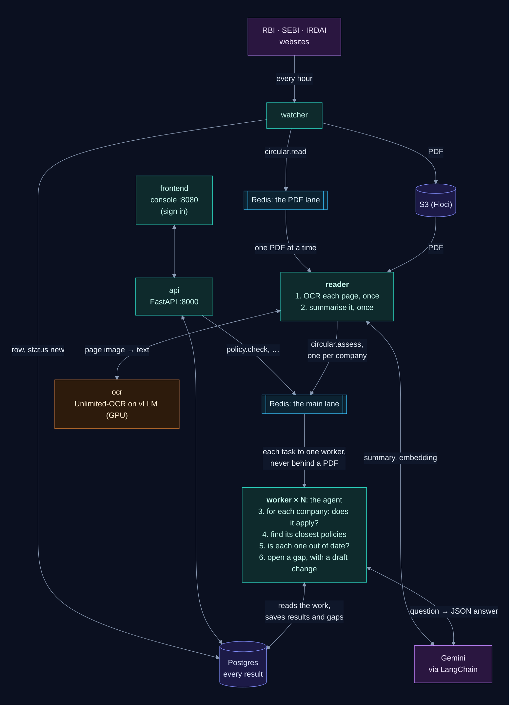

# Regulatory Circular Impact Agent

       

Every day it watches RBI, SEBI and IRDAI circulars and reads each new one with
[Unlimited-OCR](https://github.com/baidu/Unlimited-OCR). It then asks **Gemini** (through
LangChain) whether the circular applies to each company using it and which of that
company's internal policies it makes out of date. For each such policy it opens a gap ticket
for the owner, with a draft of the change, and keeps a history of the gap until it is closed.
Each company signs in to its own console and sees only its own policies and gaps. Its control
library and gap history are data a chatbot will never have.



> 📖 **How it all works**, step by step with diagrams: [how_it_works.md](how_it_works.md).

## Layout

One folder per service. Each Python service has its own `pyproject.toml`, `uv.lock`,
`.venv`, `Dockerfile`, `.env.example` and README.

| Folder | Service | What it does |
|---|---|---|
| [backend/watcher](backend/watcher) | `watcher` | Finds new circulars, stores the PDF in S3, adds a `circulars` row and a `circular.read` task |
| [backend/ocr](backend/ocr) | `ocr` | Unlimited-OCR served by vLLM on the GPU (image and flags only) |
| [backend/worker](backend/worker) | `reader`, `worker` | The agent, one program in two services: `reader` takes the PDF lane (OCR, then a summary), `worker` the main lane (does it apply, which policies are out of date, gap tickets) |
| [backend/api](backend/api) | `api` | FastAPI: sign-up and login, then each company's circulars, policies, controls and gaps |
| [backend/common](backend/common) | none | The Postgres tables and the task queue, installed into each service from `../common` |
| [frontend](frontend) | `frontend` | A test console over every API endpoint: static files served by nginx |

`docker-compose.yml` and `.env.example` are here at the root.

## Run it

You need these first:

- Docker with the NVIDIA runtime.
- Floci (a local AWS emulator, used here for S3) on port 4566, with a bucket named `rci`.
  Start it with `floci start --persist="$HOME/.floci/aws-state"`: without `--persist` it
  keeps the PDFs in memory, and they are lost when it stops.
- Host ports 5432 and 6379 free for Postgres and Redis, or other ones set in
  `POSTGRES_PORT` and `REDIS_PORT` in `.env`.
- A Gemini API key.

```bash
cp .env.example .env                        # set GEMINI_API_KEY (the rest have defaults)
docker compose up -d --build
docker compose logs -f reader worker        # watch the agent work
                                            # console: http://localhost:8080   API docs: http://localhost:8000/docs
```

Open the console and **create an account for your company** (you become its first user, and
can add teammates on the Company page). The agent knows nothing about your company until you
tell it:

1. **Company**: a few sentences on what kind of entity it is. Until this exists, circulars are
   summarised but nobody says which ones apply to you.
2. **Policies**: add them one at a time, or **Import JSON** for a whole library. A new or
   edited policy is checked at once against your circulars of the last `LOOKBACK_DAYS` that
   apply to you, so nothing waits for the next circular. Its page shows **Waiting for the
   worker** until that's done, then **Checked**.

> 🔑 **A login from the command line** (or a new password for one):
> `cd backend/api && uv run python manage.py add-user you@company.com "Your Name" --company 1`

Compose also takes settings from your shell, so a direnv `.envrc` that exports
`GEMINI_API_KEY` and `GEMINI_MODEL_NAME` works too.

> ⚡ **More workers, more speed.** Tasks wait in two lanes. Reading a PDF takes minutes,
> so it has its own lane and its own `reader`; everything else (a few Gemini calls each)
> goes to the main lane, so it never waits behind a PDF. Set `WORKERS=3` in `.env` to run
> three workers on the main lane, up to what your Gemini key's rate limit allows. Leave
> `READERS` at 1: the GPU reads one page at a time. The Redis consumer group gives each
> task to one of them, and a task is never queued twice, so no work is done twice. See
> [Running several workers](how_it_works.md#running-several-workers).

> ⏳ **The first start of `ocr` downloads the 6.7 GB model.** Until it's ready, the reader
> logs "OCR or Gemini unavailable" and keeps retrying; the worker carries on with
> everything else.

Circulars published more than `LOOKBACK_DAYS` ago are marked `skipped` instead of being
read, so a first start doesn't work through years of history.

> 🩺 **The console says Bad Gateway?** The api isn't running, most often because Postgres
> or Redis isn't. See [When things go wrong](how_it_works.md#19-when-things-go-wrong).

## Where things are explained

- **[how_it_works.md](how_it_works.md): start here.** The whole app in plain words, with a
  diagram for every step: the life of one circular from the regulator's website to a closed
  gap, each service, the console page by page, the data, failures and settings.
- **[how_the_watcher_works.md](how_the_watcher_works.md): how the watcher works.** One hourly
  round step by step: reading RBI, SEBI and IRDAI, storing the PDF, saving the row, queueing
  the task, and what happens when a site is down.
- **[how_the_worker_works.md](how_the_worker_works.md): how the worker works.** Two stories,
  a new circular and a new policy, with what goes through the Redis task queue and what
  changes in the database at each step, and how several workers and companies share it.
- [backend/worker/INTERNALS.md](backend/worker/INTERNALS.md): the worker for developers:
  everything it does in 18 steps, then every function, Redis command, SQL statement and
  commit.
- [backend/worker/README.md](backend/worker/README.md): how a circular moves through the
  pipeline, and what happens when OCR or Gemini fails.
- [backend/api/README.md](backend/api/README.md): every endpoint, logins, and how gaps are tracked.
- [frontend/README.md](frontend/README.md): the test console, and how to run it without Docker.
- [backend/ocr/README.md](backend/ocr/README.md): why the vLLM flags are needed on an 8 GB GPU.
- [backend/common/README.md](backend/common/README.md): the tables and the task queue.
- [.env.example](.env.example): every setting.

## Develop one service on the host

```bash
docker compose up -d postgres redis ocr     # what the services need
cd backend/worker
cp .env.example .env                        # host values: localhost:5432, localhost:6379 (or your POSTGRES_PORT, REDIS_PORT), localhost:4566, localhost:8001
uv sync
uv run python main.py --once
```

Each service's `config.py` is the only place that reads settings: from `.env` beside
`main.py`, with environment variables taking precedence.
