# How the backend works

       

This guide explains the Regulatory Circular Impact Agent in plain words: what it does, what
each part is for, and what happens, step by step, from the moment a regulator publishes a
circular to the moment someone on your team closes the ticket it caused. Every step has a
picture, and shows what changes in the database and what you see in the console.

**Reading the diagrams.** Each colour means the same thing in every diagram:

        

> 📖 **The other guides**
>
> - [system_overview.md](system_overview.md): the whole system on one page, each step in a
>   line or two.
> - [how_the_watcher_works.md](how_the_watcher_works.md): the watcher, which finds new
>   circulars, step by step.
> - [how_the_worker_works.md](how_the_worker_works.md): the worker, which does the reading and
>   the thinking, with what goes through the queue and the database at each step.
> - [backend/worker/INTERNALS.md](backend/worker/INTERNALS.md): for developers, the worker in
>   18 steps, then every function, Redis command and SQL statement.
> - [README.md](README.md): how to install and start it.

**Contents**

1. [The idea in one minute](#1-the-idea-in-one-minute)
2. [The app as an office](#2-the-app-as-an-office)
3. [The big picture](#3-the-big-picture)
4. [What runs where](#4-what-runs-where)
5. [Words you'll meet](#5-words-youll-meet)
6. [The life of one circular, step by step](#6-the-life-of-one-circular-step-by-step)
7. [A circular's status](#7-a-circulars-status)
8. [The watcher: finding circulars](#8-the-watcher-finding-circulars)
9. [OCR: turning a PDF into text](#9-ocr-turning-a-pdf-into-text)
10. [Gemini: the three questions](#10-gemini-the-three-questions)
11. [How the closest policies are found](#11-how-the-closest-policies-are-found)
12. [When you add or edit a policy](#12-when-you-add-or-edit-a-policy)
13. [When a company signs up or describes itself](#13-when-a-company-signs-up-or-describes-itself)
14. [The worker: doing the work](#14-the-worker-doing-the-work)
15. [The console, page by page](#15-the-console-page-by-page)
16. [Tracking a gap until it's closed](#16-tracking-a-gap-until-its-closed)
17. [The data](#17-the-data)
18. [The API](#18-the-api)
19. [When things go wrong](#19-when-things-go-wrong)
20. [Where settings come from](#20-where-settings-come-from)
21. [The code, file by file](#21-the-code-file-by-file)
22. [How do I…?](#22-how-do-i)
23. [Glossary](#23-glossary)

---

## 1. The idea in one minute

Indian regulators (**RBI**, **SEBI** and **IRDAI**) publish new circulars every week. Each
one can make one of your company's internal policies out of date, and someone has to notice,
work out what's missing, and fix the policy before a deadline.

The agent does that noticing for you, in four moves:

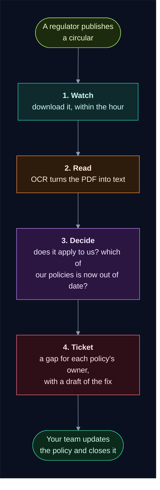
```mermaid
%%{init: {"theme": "base", "flowchart": {"diagramPadding": 0}, "themeVariables": {"darkMode": true, "primaryColor": "#16213a", "primaryTextColor": "#e6edf7", "primaryBorderColor": "#475a7a", "lineColor": "#8b9bb4", "secondaryColor": "#1b2436", "tertiaryColor": "#101a2e", "edgeLabelBackground": "#0f172a", "textColor": "#e2e8f0", "clusterBkg": "#0f1728", "clusterBorder": "#2b3a55", "titleColor": "#c4b5fd", "nodeTextColor": "#e6edf7"}}}%%
flowchart TD
    subgraph canvas[" "]
        direction TB
        a(["A regulator publishes<br/>a circular"]) --> w["<b>1. Watch</b><br/>download it, within the hour"]
        w --> r["<b>2. Read</b><br/>OCR turns the PDF into text"]
        r --> d["<b>3. Decide</b><br/>does it apply to us? which of<br/>our policies is now out of date?"]
        d --> t["<b>4. Ticket</b><br/>a gap for each policy's owner,<br/>with a draft of the fix"]
        t --> p(["Your team updates<br/>the policy and closes it"])
    end
    classDef svc fill:#0e2a2c,stroke:#2dd4bf,color:#ccfbf1
    classDef data fill:#1c1a47,stroke:#818cf8,color:#e0e7ff
    classDef ext fill:#2a1640,stroke:#c084fc,color:#f3e8ff
    classDef gpu fill:#2d1b0c,stroke:#fb923c,color:#ffedd5
    classDef ask fill:#2a2410,stroke:#fbbf24,color:#fef3c7
    classDef ok fill:#0b2a1c,stroke:#34d399,color:#d1fae5
    classDef bad fill:#2e0f17,stroke:#fb7185,color:#ffe4e6
    classDef start fill:#1c2a0e,stroke:#a7ef6f,color:#ecfccb
    classDef muted fill:#1a2130,stroke:#64748b,color:#cbd5e1
    classDef queue fill:#0c2231,stroke:#38bdf8,color:#e0f2fe
    class a start
    class w svc
    class r gpu
    class d ext
    class t bad
    class p ok
    style canvas fill:#0b1020,stroke:#1e293b,color:#0b1020
```

1. **Watch.** It checks the three regulators' websites every hour and downloads every new
   circular (a PDF).
2. **Read.** OCR turns the PDF into text, and Gemini sums up who it's for and what it
   requires.
3. **Decide.** For each company: does the circular apply to it, and if so, which of its
   policies no longer meet what the circular asks?
4. **Ticket.** For each such policy it opens a **gap**, a ticket for the policy's owner,
   with what's missing, a draft of the new wording, and a due date.

Several companies can share one installation. Each one **signs up** in the console (the
company and its first user, who can then add teammates), and gives the agent two things only
it can give:

- **a description of the company** (what kind of entity it is, its licences and businesses),
  so the agent can tell which circulars apply to it;
- **its policies and their controls**, so the agent has something to compare each circular
  with.

It ships with neither. Until you add them it still reads and summarises every circular (once,
for every company), but it can't say which ones apply to you, and it opens no gaps. Each
company only ever sees its own description, policies, answers and gaps.

> 💡 **Why it matters.** Your policy library, and the history of your gaps, are what make this
> more than a chatbot. The agent compares each circular against *your* policies and keeps
> *your* audit trail.

---

## 2. The app as an office

If the app were an office, it would have these desks:

| In an office | In the app | Its job |
|---|---|---|
| 📮 the post room | **watcher** | goes to the regulators' websites every hour and brings back anything new |
| 🗄️ the filing cabinet | **S3** (Floci on your machine) | keeps a copy of every circular's PDF |
| 📒 the register | **Postgres** | writes down everything: circulars, answers, policies, tickets |
| 📥 the in-trays | **Redis** | two to-do lists of small notes (**tasks**): one for PDFs to read, like "read circular 98", and one for everything else |
| 🧑‍💼 the reader | **reader** | takes the next PDF from its in-tray, has it scanned and summed up, then drops a note per company in the other in-tray |
| 🧑‍💼 the analysts | **worker** | take the next note from the other in-tray, do the work, write the result in the register |
| 🖨️ the scanner | **ocr** | turns a picture of a page into text, on the GPU |
| ☎️ the expert on the phone | **Gemini** | answers the analysts' questions about a text |
| 🛎️ the front desk | **api** and **frontend** (the console) | where people see everything and make changes |

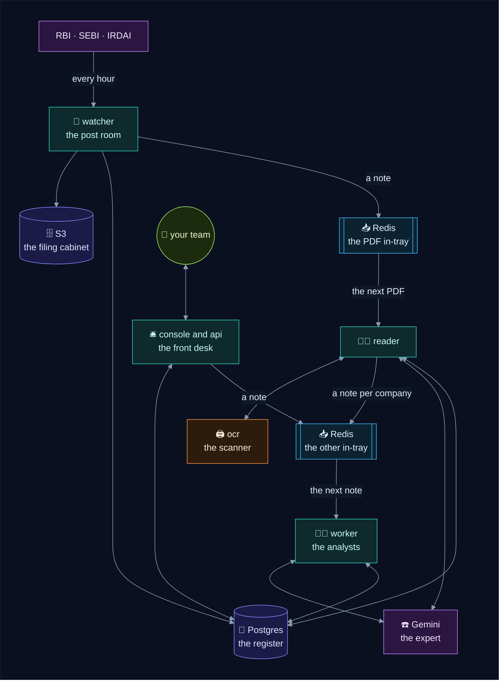
```mermaid
%%{init: {"theme": "base", "flowchart": {"diagramPadding": 0}, "themeVariables": {"darkMode": true, "primaryColor": "#16213a", "primaryTextColor": "#e6edf7", "primaryBorderColor": "#475a7a", "lineColor": "#8b9bb4", "secondaryColor": "#1b2436", "tertiaryColor": "#101a2e", "edgeLabelBackground": "#0f172a", "textColor": "#e2e8f0", "clusterBkg": "#0f1728", "clusterBorder": "#2b3a55", "titleColor": "#c4b5fd", "nodeTextColor": "#e6edf7"}}}%%
flowchart TD
    subgraph canvas[" "]
        direction TB
        sites["RBI · SEBI · IRDAI"] -->|"every hour"| W["📮 watcher<br/>the post room"]
        W --> S3[("🗄️ S3<br/>the filing cabinet")]
        W --> DB[("📒 Postgres<br/>the register")]
        W -->|"a note"| QP[["📥 Redis<br/>the PDF in-tray"]]
        QP -->|"the next PDF"| R["🧑‍💼 reader"]
        R <--> O["🖨️ ocr<br/>the scanner"]
        R -->|"a note per company"| QM[["📥 Redis<br/>the other in-tray"]]
        QM -->|"the next note"| K["🧑‍💼 worker<br/>the analysts"]
        R <--> G["☎️ Gemini<br/>the expert"]
        K <--> G
        R <--> DB
        K <--> DB
        U(("👥 your team")) <--> FD["🛎️ console and api<br/>the front desk"]
        FD <--> DB
        FD -->|"a note"| QM
    end
    classDef svc fill:#0e2a2c,stroke:#2dd4bf,color:#ccfbf1
    classDef data fill:#1c1a47,stroke:#818cf8,color:#e0e7ff
    classDef ext fill:#2a1640,stroke:#c084fc,color:#f3e8ff
    classDef gpu fill:#2d1b0c,stroke:#fb923c,color:#ffedd5
    classDef ask fill:#2a2410,stroke:#fbbf24,color:#fef3c7
    classDef ok fill:#0b2a1c,stroke:#34d399,color:#d1fae5
    classDef bad fill:#2e0f17,stroke:#fb7185,color:#ffe4e6
    classDef start fill:#1c2a0e,stroke:#a7ef6f,color:#ecfccb
    classDef muted fill:#1a2130,stroke:#64748b,color:#cbd5e1
    classDef queue fill:#0c2231,stroke:#38bdf8,color:#e0f2fe
    class sites,G ext
    class W,R,K,FD svc
    class S3,DB data
    class QP,QM queue
    class O gpu
    class U start
    style canvas fill:#0b1020,stroke:#1e293b,color:#0b1020
```

Two habits keep this office tidy:

- **The register is the truth.** A note in the in-tray only says *what* to look at ("circular
  98"); the facts are always in the register. So a lost note can be rewritten from the
  register, and a note that arrives twice does no harm.
- **Nobody walks over to another desk.** The post room and the front desk never call the
  analysts; they write in the register and drop a note in an in-tray. Any desk can close for
  a while (a restart) without losing anything.
- **Slow work has its own in-tray.** Scanning a PDF takes minutes; most other notes take
  seconds. With one in-tray, a quick note would wait behind every PDF, so PDFs go to the
  reader's in-tray and never hold up the analysts.

---

## 3. The big picture

The same office, as the services that actually run:

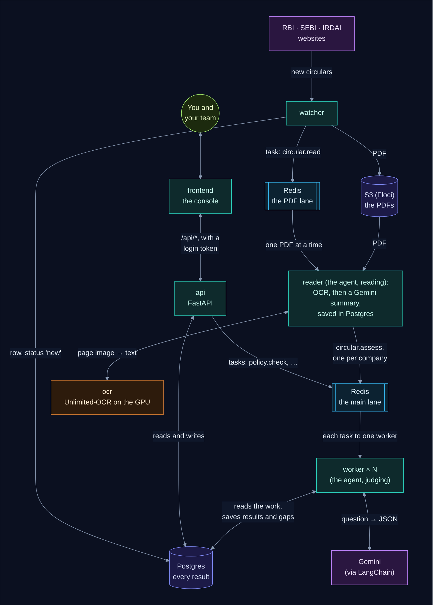
```mermaid
%%{init: {"theme": "base", "flowchart": {"diagramPadding": 0}, "themeVariables": {"darkMode": true, "primaryColor": "#16213a", "primaryTextColor": "#e6edf7", "primaryBorderColor": "#475a7a", "lineColor": "#8b9bb4", "secondaryColor": "#1b2436", "tertiaryColor": "#101a2e", "edgeLabelBackground": "#0f172a", "textColor": "#e2e8f0", "clusterBkg": "#0f1728", "clusterBorder": "#2b3a55", "titleColor": "#c4b5fd", "nodeTextColor": "#e6edf7"}}}%%
flowchart TD
    subgraph canvas[" "]
        direction TB
        sites["RBI · SEBI · IRDAI<br/>websites"] -->|"new circulars"| W["watcher"]
        U(("You and<br/>your team")) <--> F["frontend<br/>the console"]
        F <-->|"/api/*, with a<br/>login token"| A["api<br/>FastAPI"]
        W -->|"PDF"| S3[("S3 (Floci)<br/>the PDFs")]
        W -->|"row, status 'new'"| DB[("Postgres<br/>every result")]
        A <-->|"reads and writes"| DB
        W -->|"task: circular.read"| QP[["Redis<br/>the PDF lane"]]
        A -->|"tasks: policy.check, …"| QM[["Redis<br/>the main lane"]]
        QP -->|"one PDF at a time"| R["reader (the agent, reading):<br/>OCR, then a Gemini summary,<br/>saved in Postgres"]
        S3 -->|PDF| R
        R <-->|"page image → text"| O["ocr<br/>Unlimited-OCR on the GPU"]
        R -->|"circular.assess,<br/>one per company"| QM
        QM -->|"each task to one worker"| K["worker × N<br/>(the agent, judging)"]
        K <-->|"question → JSON"| G["Gemini<br/>(via LangChain)"]
        K <-->|"reads the work,<br/>saves results and gaps"| DB
    end
    classDef svc fill:#0e2a2c,stroke:#2dd4bf,color:#ccfbf1
    classDef data fill:#1c1a47,stroke:#818cf8,color:#e0e7ff
    classDef ext fill:#2a1640,stroke:#c084fc,color:#f3e8ff
    classDef gpu fill:#2d1b0c,stroke:#fb923c,color:#ffedd5
    classDef ask fill:#2a2410,stroke:#fbbf24,color:#fef3c7
    classDef ok fill:#0b2a1c,stroke:#34d399,color:#d1fae5
    classDef bad fill:#2e0f17,stroke:#fb7185,color:#ffe4e6
    classDef start fill:#1c2a0e,stroke:#a7ef6f,color:#ecfccb
    classDef muted fill:#1a2130,stroke:#64748b,color:#cbd5e1
    classDef queue fill:#0c2231,stroke:#38bdf8,color:#e0f2fe
    class W,R,K,A,F svc
    class S3,DB data
    class QP,QM queue
    class sites,G ext
    class O gpu
    class U start
    style canvas fill:#0b1020,stroke:#1e293b,color:#0b1020
```

There are two kinds of service:

- **Background services** work on their own, around the clock:
  - the **watcher** finds circulars ([section 8](#8-the-watcher-finding-circulars));
  - the **reader** reads each new circular's PDF, and the **worker** judges it for each
    company and opens gaps: the same program, on two lanes ([section 14](#14-the-worker-doing-the-work));
  - **ocr** is the model the reader uses to read the PDFs ([section 9](#9-ocr-turning-a-pdf-into-text)).
- **Services for people:** the **api** and the **frontend** (the console) show you everything
  and let you manage your company, policies and gaps ([section 15](#15-the-console-page-by-page)).

They hand work to each other as **tasks** on two **Redis streams**, called **lanes**: the
watcher saves a new circular in Postgres and queues `circular.read` on the **PDF lane**; the
api saves your change and queues `policy.check`, `company.refresh` or `circular.assess` on the
**main lane**. The reader takes the PDF lane and the workers take the main lane, each task the
moment it's queued, so a quick task never waits behind a PDF being read.

---

## 4. What runs where

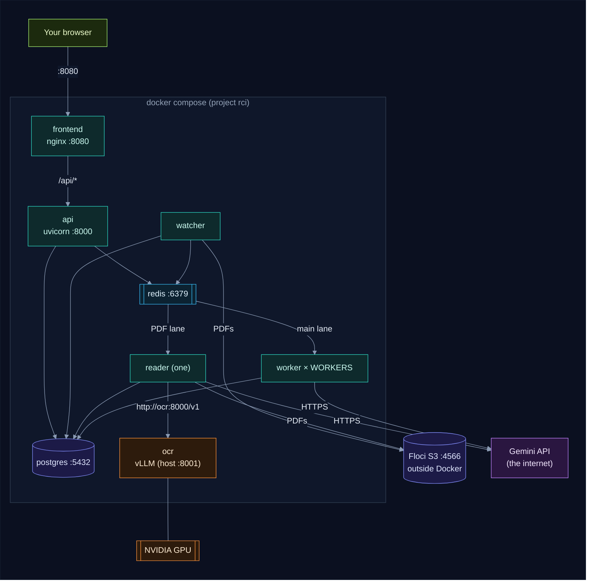
```mermaid
%%{init: {"theme": "base", "flowchart": {"diagramPadding": 0}, "themeVariables": {"darkMode": true, "primaryColor": "#16213a", "primaryTextColor": "#e6edf7", "primaryBorderColor": "#475a7a", "lineColor": "#8b9bb4", "secondaryColor": "#1b2436", "tertiaryColor": "#101a2e", "edgeLabelBackground": "#0f172a", "textColor": "#e2e8f0", "clusterBkg": "#0f1728", "clusterBorder": "#2b3a55", "titleColor": "#c4b5fd", "nodeTextColor": "#e6edf7"}}}%%
flowchart TD
    subgraph canvas[" "]
        direction TB
        B["Your browser"] -->|":8080"| FE
        subgraph compose["docker compose (project rci)"]
            direction TB
            FE["frontend<br/>nginx :8080"] -->|"/api/*"| API["api<br/>uvicorn :8000"]
            API --> PG[("postgres :5432")]
            API --> RD[["redis :6379"]]
            WA["watcher"] --> PG
            WA --> RD
            RD -->|"PDF lane"| RE["reader (one)"]
            RD -->|"main lane"| WK["worker × WORKERS"]
            RE --> PG
            WK --> PG
            RE -->|"http://ocr:8000/v1"| OC["ocr<br/>vLLM (host :8001)"]
        end
        WA -->|"PDFs"| FL[("Floci S3 :4566<br/>outside Docker")]
        RE -->|"PDFs"| FL
        RE -->|"HTTPS"| GEM["Gemini API<br/>(the internet)"]
        WK -->|"HTTPS"| GEM
        OC --- GPU[["NVIDIA GPU"]]
    end
    classDef svc fill:#0e2a2c,stroke:#2dd4bf,color:#ccfbf1
    classDef data fill:#1c1a47,stroke:#818cf8,color:#e0e7ff
    classDef ext fill:#2a1640,stroke:#c084fc,color:#f3e8ff
    classDef gpu fill:#2d1b0c,stroke:#fb923c,color:#ffedd5
    classDef ask fill:#2a2410,stroke:#fbbf24,color:#fef3c7
    classDef ok fill:#0b2a1c,stroke:#34d399,color:#d1fae5
    classDef bad fill:#2e0f17,stroke:#fb7185,color:#ffe4e6
    classDef start fill:#1c2a0e,stroke:#a7ef6f,color:#ecfccb
    classDef muted fill:#1a2130,stroke:#64748b,color:#cbd5e1
    classDef queue fill:#0c2231,stroke:#38bdf8,color:#e0f2fe
    class B start
    class FE,API,WA,RE,WK svc
    class PG,FL data
    class RD queue
    class GEM ext
    class OC,GPU gpu
    style compose fill:#0f172a,stroke:#334155,color:#94a3b8
    style canvas fill:#0b1020,stroke:#1e293b,color:#0b1020
```

| Service | Folder | What runs | Port on your machine |
|---|---|---|---|
| `watcher` | `backend/watcher` | `python main.py`: one round every 60 minutes; a task per new circular. Always **one** copy | none |
| `ocr` | `backend/ocr` | vLLM serving `baidu/Unlimited-OCR` on the GPU | 8001 |
| `reader` | `backend/worker` | `python main.py` with `LANES=pdf`: reads each new circular's PDF and sums it up. always one copy (the GPU reads one page at a time, and each PDF is read once) | none |
| `worker` | `backend/worker` | `python main.py` with `LANES=main`: everything else, a few Gemini calls per task. `WORKERS` copies | none |
| `api` | `backend/api` | `uvicorn main:app` | 8000 (docs at `/docs`) |
| `frontend` | `frontend` | nginx serving the console's files, and passing `/api` on to the api | 8080 |
| `postgres` | none (official image) | the database: every result | 5432 (`POSTGRES_PORT`) |
| `redis` | none (official image) | the two task lanes (`rci:tasks:pdf` and `rci:tasks`), kept on disk (`--appendonly yes`) | 6379 (`REDIS_PORT`) |

Two things live outside Docker:

- **Floci**, a local stand-in for Amazon S3, where the PDFs are kept. Start it with
  `floci start --persist="$HOME/.floci/aws-state"` and give it a bucket named `rci`. Without
  `--persist` it keeps the PDFs in memory, and they're gone when it stops.
- **Gemini**, Google's API, which the worker reaches over the internet.

The database tables are defined once, in `backend/common`, and shared by the watcher, worker
and api. Each of those has its own `pyproject.toml` and virtual environment.

---

## 5. Words you'll meet

The few words this guide uses all the time. The [glossary](#23-glossary) has the rest.

| Word | In plain words |
|---|---|
| **Circular** | a notice from a regulator that creates or changes rules |
| **Policy** | one of your company's own rule documents, like its KYC policy. It has an owner, the regulators it answers to, and a version number |
| **Control** | a regular check that puts a policy into practice, like "screen customers against sanctions lists daily" |
| **Gap** | a ticket saying "this policy is out of date because of this circular", with a draft of the fix |
| **Task** | a small note on a to-do list in Redis, like "read circular 98". The facts stay in Postgres |
| **Lane** | one of the two to-do lists: the **PDF lane** for reading PDFs (minutes each), the **main lane** for everything else (seconds each) |
| **Assessment** | one company's answer for one circular: still to check, or done, and whether it applies |
| **OCR** | reading text from a picture of a page |
| **Embedding** | a list of 768 numbers that captures what a text is about. Similar texts get similar numbers |
| **Lookback** | the 30 days (`LOOKBACK_DAYS`) of circulars the agent cares about |

---

## 6. The life of one circular, step by step

This section follows one circular all the way through. The example:

- **Circular 98** from RBI, "Designation of terrorist organisation…", published this morning:
  a 3-page PDF.
- Two companies use the app: **company A** (id 1), a non-deposit-taking NBFC with four RBI
  policies, and **company B** (id 2), a stock broker.


```mermaid
%%{init: {"theme": "base", "flowchart": {"diagramPadding": 0}, "themeVariables": {"darkMode": true, "primaryColor": "#16213a", "primaryTextColor": "#e6edf7", "primaryBorderColor": "#475a7a", "lineColor": "#8b9bb4", "secondaryColor": "#1b2436", "tertiaryColor": "#101a2e", "edgeLabelBackground": "#0f172a", "textColor": "#e2e8f0", "clusterBkg": "#0f1728", "clusterBorder": "#2b3a55", "titleColor": "#c4b5fd", "nodeTextColor": "#e6edf7"}}}%%
flowchart TD
    subgraph canvas[" "]
        direction TB
        subgraph once["once for every company"]
            direction TB
            s1(["1. The watcher<br/>finds it"]) --> s2["2. The reader picks<br/>up the task"]
            s2 --> s3["3. OCR reads<br/>the PDF"]
            s3 --> s4["4. Gemini<br/>summarises it"]
            s4 --> s5["5. The summary<br/>becomes numbers"]
        end
        s5 --> s6["6. Each company gets<br/>its own check"]
        subgraph each["for each company"]
            direction TB
            s7["7. Does it apply<br/>to this company?"] --> s8["8. Which of its policies<br/>could be affected?"]
            s8 --> s9["9. Is each one<br/>out of date?"]
            s9 --> s10(["10. You see it<br/>in the console"])
        end
        s6 --> s7
        s10 --> s11["11. Your team<br/>works the gap"]
    end
    classDef svc fill:#0e2a2c,stroke:#2dd4bf,color:#ccfbf1
    classDef data fill:#1c1a47,stroke:#818cf8,color:#e0e7ff
    classDef ext fill:#2a1640,stroke:#c084fc,color:#f3e8ff
    classDef gpu fill:#2d1b0c,stroke:#fb923c,color:#ffedd5
    classDef ask fill:#2a2410,stroke:#fbbf24,color:#fef3c7
    classDef ok fill:#0b2a1c,stroke:#34d399,color:#d1fae5
    classDef bad fill:#2e0f17,stroke:#fb7185,color:#ffe4e6
    classDef start fill:#1c2a0e,stroke:#a7ef6f,color:#ecfccb
    classDef muted fill:#1a2130,stroke:#64748b,color:#cbd5e1
    classDef queue fill:#0c2231,stroke:#38bdf8,color:#e0f2fe
    class s1 start
    class s2,s6,s8 svc
    class s3 gpu
    class s4,s5,s7,s9 ext
    class s10 ok
    class s11 bad
    style once fill:#0f172a,stroke:#334155,color:#94a3b8
    style each fill:#0f172a,stroke:#334155,color:#94a3b8
    style canvas fill:#0b1020,stroke:#1e293b,color:#0b1020
```

Steps 1 to 5 happen **once**, however many companies use the app: the text and the summary
are the same for everybody. Steps 7 to 9 happen **for each company**, with its own
description and its own policies, at the same time when several workers run.

### Step 1: The watcher finds it

Within the hour, the watcher's round reaches RBI, sees an ID it has never saved, downloads the
PDF, and hands the circular over.

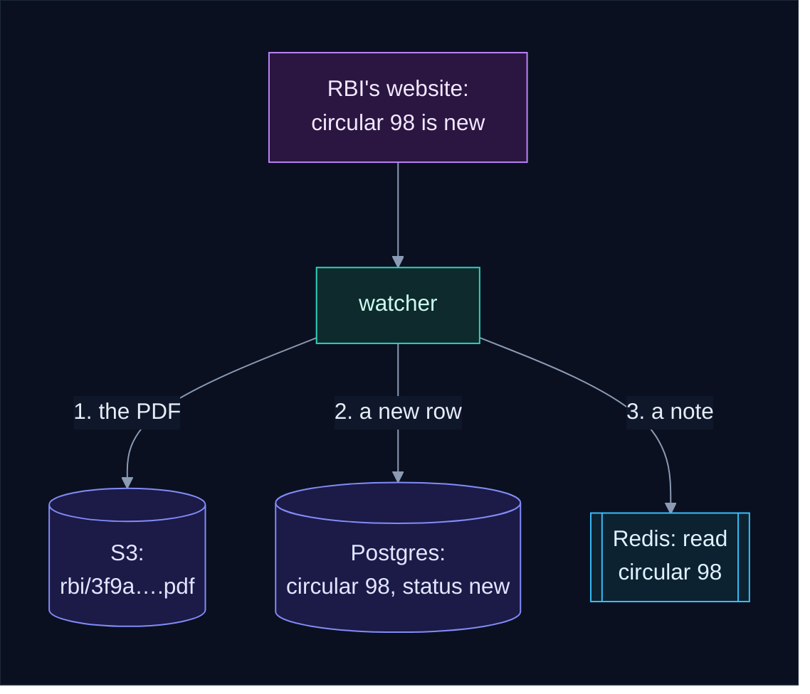
```mermaid
%%{init: {"theme": "base", "flowchart": {"diagramPadding": 0}, "themeVariables": {"darkMode": true, "primaryColor": "#16213a", "primaryTextColor": "#e6edf7", "primaryBorderColor": "#475a7a", "lineColor": "#8b9bb4", "secondaryColor": "#1b2436", "tertiaryColor": "#101a2e", "edgeLabelBackground": "#0f172a", "textColor": "#e2e8f0", "clusterBkg": "#0f1728", "clusterBorder": "#2b3a55", "titleColor": "#c4b5fd", "nodeTextColor": "#e6edf7"}}}%%
flowchart TD
    subgraph canvas[" "]
        direction TB
        site["RBI's website:<br/>circular 98 is new"] --> w["watcher"]
        w -->|"1. the PDF"| s3[("S3:<br/>rbi/3f9a….pdf")]
        w -->|"2. a new row"| db[("Postgres:<br/>circular 98, status new")]
        w -->|"3. a note"| q[["Redis: read<br/>circular 98"]]
    end
    classDef svc fill:#0e2a2c,stroke:#2dd4bf,color:#ccfbf1
    classDef data fill:#1c1a47,stroke:#818cf8,color:#e0e7ff
    classDef ext fill:#2a1640,stroke:#c084fc,color:#f3e8ff
    classDef gpu fill:#2d1b0c,stroke:#fb923c,color:#ffedd5
    classDef ask fill:#2a2410,stroke:#fbbf24,color:#fef3c7
    classDef ok fill:#0b2a1c,stroke:#34d399,color:#d1fae5
    classDef bad fill:#2e0f17,stroke:#fb7185,color:#ffe4e6
    classDef start fill:#1c2a0e,stroke:#a7ef6f,color:#ecfccb
    classDef muted fill:#1a2130,stroke:#64748b,color:#cbd5e1
    classDef queue fill:#0c2231,stroke:#38bdf8,color:#e0f2fe
    class site ext
    class w svc
    class s3,db data
    class q queue
    style canvas fill:#0b1020,stroke:#1e293b,color:#0b1020
```

**The database after:**

| id | source | title | status | text |
|---|---|---|---|---|
| **98** | **RBI** | **Designation of terrorist organisation…** | **new** | *(empty)* |

**In the console:** circular 98 appears on the **Circulars** page as **New**.

How the watcher reads each regulator's site, and what it does when a site is down, is in
[how_the_watcher_works.md](how_the_watcher_works.md).

### Step 2: The reader picks up the task

The watcher put the note on the **PDF lane**, the to-do list just for reading PDFs. The
**reader** (the worker that takes this lane) asks Redis for the next note (`XREADGROUP`).
Redis hands over "read circular 98" and, in the same moment, writes the reader's name next to
it on its **pending list**: the list of notes handed out but not finished yet. That's what
makes it this reader's note: nobody else will be given it. While it works, the worker touches the note every minute, so
Redis knows it's still alive; a note nobody touches for 5 minutes belongs to a worker that
died, and another worker takes it over.

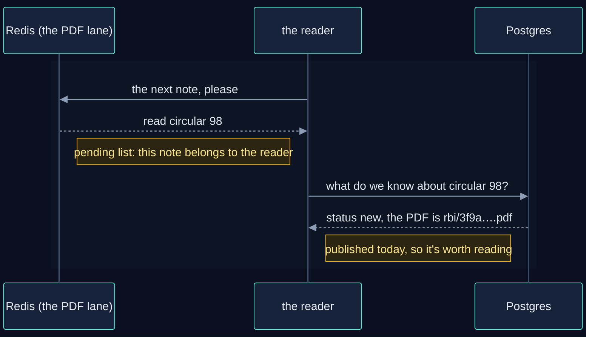
```mermaid
%%{init: {"theme": "base", "sequence": {"diagramMarginX": 0, "diagramMarginY": 0}, "themeVariables": {"darkMode": true, "primaryColor": "#16213a", "primaryTextColor": "#e6edf7", "primaryBorderColor": "#475a7a", "lineColor": "#8b9bb4", "secondaryColor": "#1b2436", "tertiaryColor": "#101a2e", "edgeLabelBackground": "#0f172a", "textColor": "#e2e8f0", "actorBkg": "#16213a", "actorBorder": "#5eead4", "actorTextColor": "#e6edf7", "actorLineColor": "#3b4a66", "signalColor": "#8b9bb4", "signalTextColor": "#e2e8f0", "noteBkgColor": "#2a2410", "noteBorderColor": "#fbbf24", "noteTextColor": "#fde68a", "labelBoxBkgColor": "#1e293b", "labelBoxBorderColor": "#64748b", "labelTextColor": "#e2e8f0", "loopTextColor": "#c4b5fd", "sequenceNumberColor": "#0b1020", "activationBkgColor": "#1e293b"}}}%%
sequenceDiagram
    box rgb(11, 16, 32)
        participant Q as Redis (the PDF lane)
        participant K as the reader
        participant DB as Postgres
    end

    rect rgb(13, 20, 36)
        K->>Q: the next note, please
        Q-->>K: read circular 98
        Note right of Q: pending list: this note belongs to the reader
        K->>DB: what do we know about circular 98?
        DB-->>K: status new, the PDF is rbi/3f9a….pdf
        Note right of K: published today, so it's worth reading
    end
```

Before reading anything, the reader looks at the circular's status:

- **Too old?** A circular published more than 30 days ago (`LOOKBACK_DAYS`) is marked
  **Skipped** right here: no OCR, no Gemini, no cost. The watcher saves every circular it
  finds, old ones too (on its first round, months of them), so this is where old ones stop.
  Nothing retries a skipped circular.
- **Failed before?** A circular marked **Failed** is left alone. It only runs again when
  someone presses **Reprocess** ([section 19](#running-failed-work-again)).
- If the reader is busy with another PDF, the note waits its turn on the PDF lane. Quick
  tasks are on the other lane, so they never wait behind it.

### Step 3: OCR reads the PDF

The PDF is often a scan, so the worker sends each page as a picture to **OCR**, a model on
the GPU that reads text from images. Each page's text is saved the moment it's read.

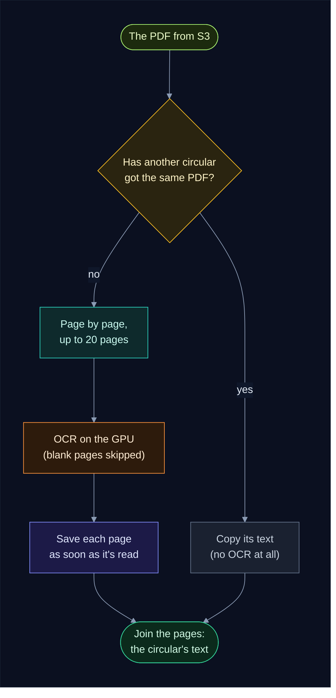
```mermaid
%%{init: {"theme": "base", "flowchart": {"diagramPadding": 0}, "themeVariables": {"darkMode": true, "primaryColor": "#16213a", "primaryTextColor": "#e6edf7", "primaryBorderColor": "#475a7a", "lineColor": "#8b9bb4", "secondaryColor": "#1b2436", "tertiaryColor": "#101a2e", "edgeLabelBackground": "#0f172a", "textColor": "#e2e8f0", "clusterBkg": "#0f1728", "clusterBorder": "#2b3a55", "titleColor": "#c4b5fd", "nodeTextColor": "#e6edf7"}}}%%
flowchart TD
    subgraph canvas[" "]
        direction TB
        a(["The PDF from S3"]) --> t{"Has another circular<br/>got the same PDF?"}
        t -->|"yes"| c["Copy its text<br/>(no OCR at all)"]
        t -->|"no"| d["Page by page,<br/>up to 20 pages"]
        d --> o["OCR on the GPU<br/>(blank pages skipped)"]
        o --> p["Save each page<br/>as soon as it's read"]
        p --> j(["Join the pages:<br/>the circular's text"])
        c --> j
    end
    classDef svc fill:#0e2a2c,stroke:#2dd4bf,color:#ccfbf1
    classDef data fill:#1c1a47,stroke:#818cf8,color:#e0e7ff
    classDef ext fill:#2a1640,stroke:#c084fc,color:#f3e8ff
    classDef gpu fill:#2d1b0c,stroke:#fb923c,color:#ffedd5
    classDef ask fill:#2a2410,stroke:#fbbf24,color:#fef3c7
    classDef ok fill:#0b2a1c,stroke:#34d399,color:#d1fae5
    classDef bad fill:#2e0f17,stroke:#fb7185,color:#ffe4e6
    classDef start fill:#1c2a0e,stroke:#a7ef6f,color:#ecfccb
    classDef muted fill:#1a2130,stroke:#64748b,color:#cbd5e1
    classDef queue fill:#0c2231,stroke:#38bdf8,color:#e0f2fe
    class a start
    class t ask
    class c muted
    class d svc
    class o gpu
    class p data
    class j ok
    style canvas fill:#0b1020,stroke:#1e293b,color:#0b1020
```

- If the worker is stopped on page 3, it starts again at page 3, not page 1.
- A short circular takes well under a minute on a laptop GPU; a 20-page one, a few minutes.

**The database after:**

| id | status | text |
|---|---|---|
| 98 | **parsed** | **"RESERVE BANK OF INDIA … (12,408 characters)"** |

**In the console:** the circular shows **In progress**. Its page has the OCR text under
**OCR text**.

More: [section 9](#9-ocr-turning-a-pdf-into-text).

### Step 4: Gemini summarises it

The worker asks **Gemini** to read the text and fill in a form with three boxes. Gemini must
answer in exactly that shape, so the code never has to guess what it meant.

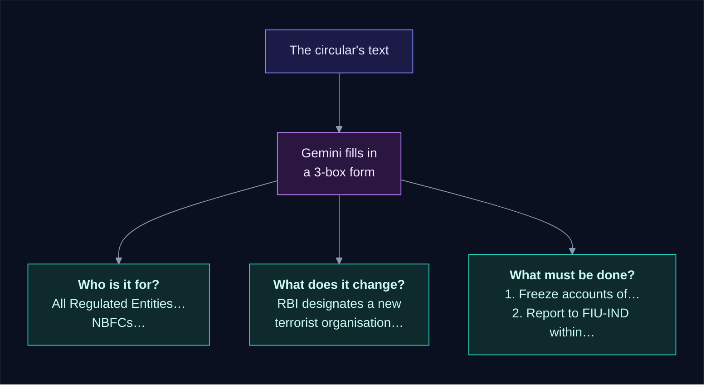
```mermaid
%%{init: {"theme": "base", "flowchart": {"diagramPadding": 0}, "themeVariables": {"darkMode": true, "primaryColor": "#16213a", "primaryTextColor": "#e6edf7", "primaryBorderColor": "#475a7a", "lineColor": "#8b9bb4", "secondaryColor": "#1b2436", "tertiaryColor": "#101a2e", "edgeLabelBackground": "#0f172a", "textColor": "#e2e8f0", "clusterBkg": "#0f1728", "clusterBorder": "#2b3a55", "titleColor": "#c4b5fd", "nodeTextColor": "#e6edf7"}}}%%
flowchart TD
    subgraph canvas[" "]
        direction TB
        t["The circular's text"] --> g["Gemini fills in<br/>a 3-box form"]
        g --> a1["<b>Who is it for?</b><br/>All Regulated Entities…<br/>NBFCs…"]
        g --> a2["<b>What does it change?</b><br/>RBI designates a new<br/>terrorist organisation…"]
        g --> a3["<b>What must be done?</b><br/>1. Freeze accounts of…<br/>2. Report to FIU-IND within…"]
    end
    classDef svc fill:#0e2a2c,stroke:#2dd4bf,color:#ccfbf1
    classDef data fill:#1c1a47,stroke:#818cf8,color:#e0e7ff
    classDef ext fill:#2a1640,stroke:#c084fc,color:#f3e8ff
    classDef gpu fill:#2d1b0c,stroke:#fb923c,color:#ffedd5
    classDef ask fill:#2a2410,stroke:#fbbf24,color:#fef3c7
    classDef ok fill:#0b2a1c,stroke:#34d399,color:#d1fae5
    classDef bad fill:#2e0f17,stroke:#fb7185,color:#ffe4e6
    classDef start fill:#1c2a0e,stroke:#a7ef6f,color:#ecfccb
    classDef muted fill:#1a2130,stroke:#64748b,color:#cbd5e1
    classDef queue fill:#0c2231,stroke:#38bdf8,color:#e0f2fe
    class t data
    class g ext
    class a1,a2,a3 svc
    style canvas fill:#0b1020,stroke:#1e293b,color:#0b1020
```

**The database after:**

| id | addressed_to | summary | requirements |
|---|---|---|---|
| 98 | **All Regulated Entities… NBFCs…** | **RBI designates a new terrorist organisation…** | **["Freeze accounts …", "Report … to FIU-IND within …", …]** |

**In the console:** the circular's page shows **Summary** and **What it requires**.

### Step 5: The summary becomes numbers

To compare the circular with your policies quickly, the worker turns its title, summary and
obligations into an **embedding**: 768 numbers that capture what it's about. Your policies
were turned into numbers the same way when you saved them.

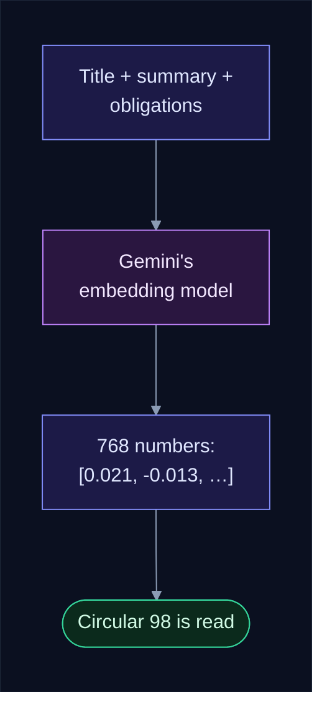
```mermaid
%%{init: {"theme": "base", "flowchart": {"diagramPadding": 0}, "themeVariables": {"darkMode": true, "primaryColor": "#16213a", "primaryTextColor": "#e6edf7", "primaryBorderColor": "#475a7a", "lineColor": "#8b9bb4", "secondaryColor": "#1b2436", "tertiaryColor": "#101a2e", "edgeLabelBackground": "#0f172a", "textColor": "#e2e8f0", "clusterBkg": "#0f1728", "clusterBorder": "#2b3a55", "titleColor": "#c4b5fd", "nodeTextColor": "#e6edf7"}}}%%
flowchart TD
    subgraph canvas[" "]
        direction TB
        s["Title + summary +<br/>obligations"] --> g["Gemini's<br/>embedding model"]
        g --> e["768 numbers:<br/>[0.021, -0.013, …]"]
        e --> r(["Circular 98 is read"])
    end
    classDef svc fill:#0e2a2c,stroke:#2dd4bf,color:#ccfbf1
    classDef data fill:#1c1a47,stroke:#818cf8,color:#e0e7ff
    classDef ext fill:#2a1640,stroke:#c084fc,color:#f3e8ff
    classDef gpu fill:#2d1b0c,stroke:#fb923c,color:#ffedd5
    classDef ask fill:#2a2410,stroke:#fbbf24,color:#fef3c7
    classDef ok fill:#0b2a1c,stroke:#34d399,color:#d1fae5
    classDef bad fill:#2e0f17,stroke:#fb7185,color:#ffe4e6
    classDef start fill:#1c2a0e,stroke:#a7ef6f,color:#ecfccb
    classDef muted fill:#1a2130,stroke:#64748b,color:#cbd5e1
    classDef queue fill:#0c2231,stroke:#38bdf8,color:#e0f2fe
    class s,e data
    class g ext
    class r ok
    style canvas fill:#0b1020,stroke:#1e293b,color:#0b1020
```

After this, the circular's status is **read**: everything that's the same for all companies
is done.

### Step 6: Each company gets its own check

Each company has to decide for itself whether the circular matters to it. The reader adds an
**assessment** per company (a row that says "not checked yet") and puts one note per company
on the **main lane**, where the workers pick them up at once: they never wait behind the next
PDF.

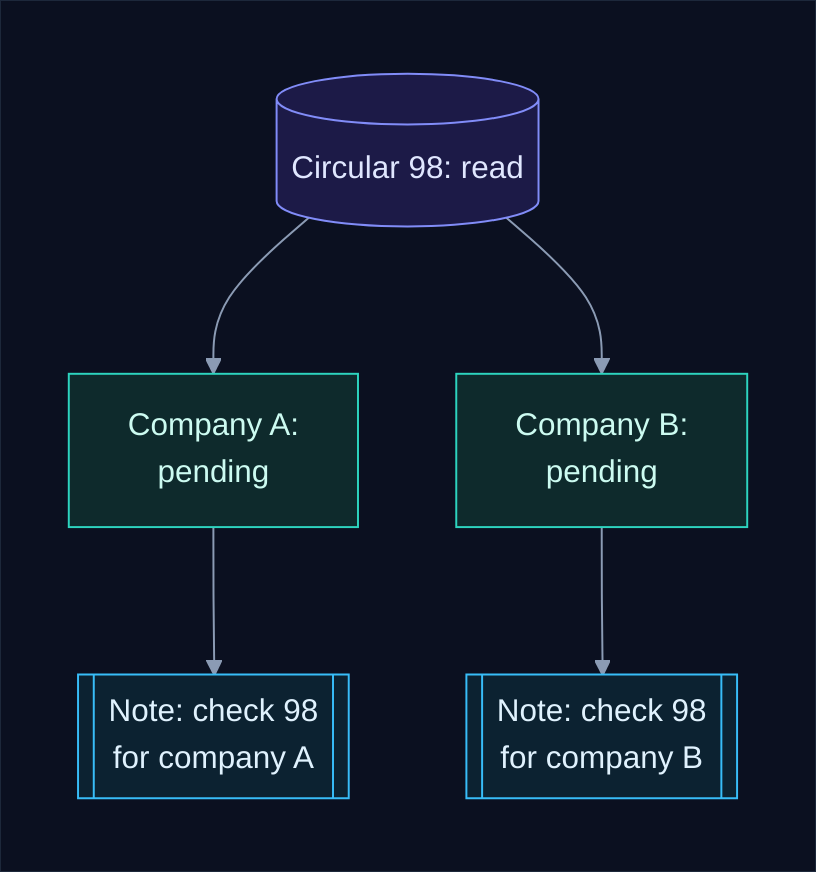
```mermaid
%%{init: {"theme": "base", "flowchart": {"diagramPadding": 0}, "themeVariables": {"darkMode": true, "primaryColor": "#16213a", "primaryTextColor": "#e6edf7", "primaryBorderColor": "#475a7a", "lineColor": "#8b9bb4", "secondaryColor": "#1b2436", "tertiaryColor": "#101a2e", "edgeLabelBackground": "#0f172a", "textColor": "#e2e8f0", "clusterBkg": "#0f1728", "clusterBorder": "#2b3a55", "titleColor": "#c4b5fd", "nodeTextColor": "#e6edf7"}}}%%
flowchart TD
    subgraph canvas[" "]
        direction TB
        c[("Circular 98: read")] --> a["Company A:<br/>pending"]
        c --> b["Company B:<br/>pending"]
        a --> ta[["Note: check 98<br/>for company A"]]
        b --> tb[["Note: check 98<br/>for company B"]]
    end
    classDef svc fill:#0e2a2c,stroke:#2dd4bf,color:#ccfbf1
    classDef data fill:#1c1a47,stroke:#818cf8,color:#e0e7ff
    classDef ext fill:#2a1640,stroke:#c084fc,color:#f3e8ff
    classDef gpu fill:#2d1b0c,stroke:#fb923c,color:#ffedd5
    classDef ask fill:#2a2410,stroke:#fbbf24,color:#fef3c7
    classDef ok fill:#0b2a1c,stroke:#34d399,color:#d1fae5
    classDef bad fill:#2e0f17,stroke:#fb7185,color:#ffe4e6
    classDef start fill:#1c2a0e,stroke:#a7ef6f,color:#ecfccb
    classDef muted fill:#1a2130,stroke:#64748b,color:#cbd5e1
    classDef queue fill:#0c2231,stroke:#38bdf8,color:#e0f2fe
    class c data
    class a,b svc
    class ta,tb queue
    style canvas fill:#0b1020,stroke:#1e293b,color:#0b1020
```

**The database after** (`assessments`):

| company | circular | status | applicable |
|---|---|---|---|
| **A** | **98** | **pending** | *(empty)* |
| **B** | **98** | **pending** | *(empty)* |

With two workers running, A and B are now checked at the same time.

### Step 7: Does it apply to this company?

Gemini reads the company's **description** (written on its **Company** page) and the start of
the circular, and answers: is this circular meant for us? It gives a one-sentence reason.

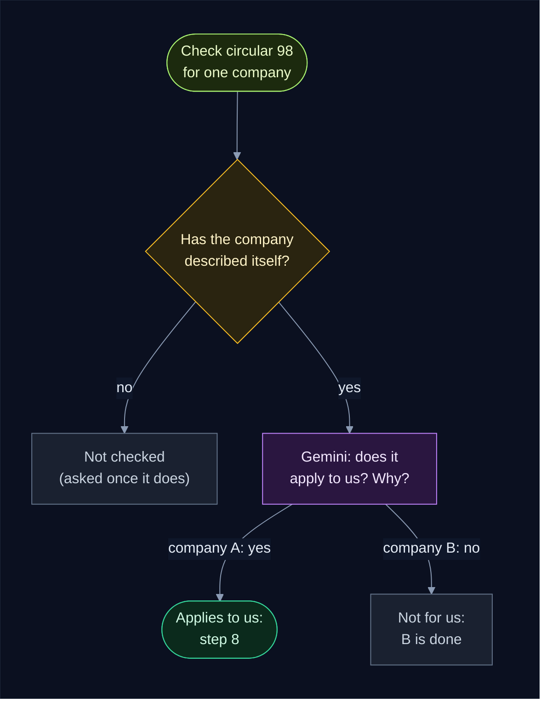
```mermaid
%%{init: {"theme": "base", "flowchart": {"diagramPadding": 0}, "themeVariables": {"darkMode": true, "primaryColor": "#16213a", "primaryTextColor": "#e6edf7", "primaryBorderColor": "#475a7a", "lineColor": "#8b9bb4", "secondaryColor": "#1b2436", "tertiaryColor": "#101a2e", "edgeLabelBackground": "#0f172a", "textColor": "#e2e8f0", "clusterBkg": "#0f1728", "clusterBorder": "#2b3a55", "titleColor": "#c4b5fd", "nodeTextColor": "#e6edf7"}}}%%
flowchart TD
    subgraph canvas[" "]
        direction TB
        a(["Check circular 98<br/>for one company"]) --> p{"Has the company<br/>described itself?"}
        p -->|"no"| nc["Not checked<br/>(asked once it does)"]
        p -->|"yes"| g["Gemini: does it<br/>apply to us? Why?"]
        g -->|"company A: yes"| yes(["Applies to us:<br/>step 8"])
        g -->|"company B: no"| nb["Not for us:<br/>B is done"]
    end
    classDef svc fill:#0e2a2c,stroke:#2dd4bf,color:#ccfbf1
    classDef data fill:#1c1a47,stroke:#818cf8,color:#e0e7ff
    classDef ext fill:#2a1640,stroke:#c084fc,color:#f3e8ff
    classDef gpu fill:#2d1b0c,stroke:#fb923c,color:#ffedd5
    classDef ask fill:#2a2410,stroke:#fbbf24,color:#fef3c7
    classDef ok fill:#0b2a1c,stroke:#34d399,color:#d1fae5
    classDef bad fill:#2e0f17,stroke:#fb7185,color:#ffe4e6
    classDef start fill:#1c2a0e,stroke:#a7ef6f,color:#ecfccb
    classDef muted fill:#1a2130,stroke:#64748b,color:#cbd5e1
    classDef queue fill:#0c2231,stroke:#38bdf8,color:#e0f2fe
    class a start
    class p ask
    class nc,nb muted
    class g ext
    class yes ok
    style canvas fill:#0b1020,stroke:#1e293b,color:#0b1020
```

**The database after:**

| company | circular | applicable | applies_reason |
|---|---|---|---|
| A | 98 | **true** | **"Addressed to NBFCs, and the company is an NBFC."** |
| B | 98 | **false** | **"Addressed to banks and NBFCs; the company is a stock broker."** |

**In the console:** A sees **Applies to us**, with the reason. B sees **Not for us**. A
company with no description sees **Not checked**, and a link to describe itself.

### Step 8: Which of its policies could be affected?

Asking Gemini about every policy would be slow and costly. So the worker first compares the
circular's numbers with each of A's RBI policies, which is quick arithmetic with no Gemini
call, and keeps the **3 closest**.

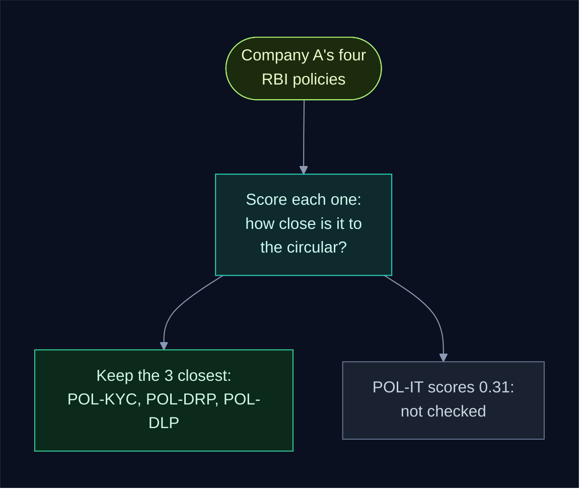
```mermaid
%%{init: {"theme": "base", "flowchart": {"diagramPadding": 0}, "themeVariables": {"darkMode": true, "primaryColor": "#16213a", "primaryTextColor": "#e6edf7", "primaryBorderColor": "#475a7a", "lineColor": "#8b9bb4", "secondaryColor": "#1b2436", "tertiaryColor": "#101a2e", "edgeLabelBackground": "#0f172a", "textColor": "#e2e8f0", "clusterBkg": "#0f1728", "clusterBorder": "#2b3a55", "titleColor": "#c4b5fd", "nodeTextColor": "#e6edf7"}}}%%
flowchart TD
    subgraph canvas[" "]
        direction TB
        p(["Company A's four<br/>RBI policies"]) --> sc["Score each one:<br/>how close is it to<br/>the circular?"]
        sc --> top["Keep the 3 closest:<br/>POL-KYC, POL-DRP, POL-DLP"]
        sc --> no["POL-IT scores 0.31:<br/>not checked"]
    end
    classDef svc fill:#0e2a2c,stroke:#2dd4bf,color:#ccfbf1
    classDef data fill:#1c1a47,stroke:#818cf8,color:#e0e7ff
    classDef ext fill:#2a1640,stroke:#c084fc,color:#f3e8ff
    classDef gpu fill:#2d1b0c,stroke:#fb923c,color:#ffedd5
    classDef ask fill:#2a2410,stroke:#fbbf24,color:#fef3c7
    classDef ok fill:#0b2a1c,stroke:#34d399,color:#d1fae5
    classDef bad fill:#2e0f17,stroke:#fb7185,color:#ffe4e6
    classDef start fill:#1c2a0e,stroke:#a7ef6f,color:#ecfccb
    classDef muted fill:#1a2130,stroke:#64748b,color:#cbd5e1
    classDef queue fill:#0c2231,stroke:#38bdf8,color:#e0f2fe
    class p start
    class sc svc
    class top ok
    class no muted
    style canvas fill:#0b1020,stroke:#1e293b,color:#0b1020
```

| Policy | Score (1.0 = the same meaning) | Checked? |
|---|---|---|
| POL-KYC, Know Your Customer and anti-money laundering | 0.82 | ✅ |
| POL-DRP, dividend repatriation and related-party payments | 0.58 | ✅ |
| POL-DLP, digital lending and fair practices | 0.55 | ✅ |
| POL-IT, IT security | 0.31 | no |

More: [section 11](#11-how-the-closest-policies-are-found).

### Step 9: Is each one out of date?

For each of the 3, Gemini reads the circular's obligations next to the policy's text and
controls, and answers: **does the policy still meet what the circular asks?** If not, the
worker opens a **gap** for the policy's owner.

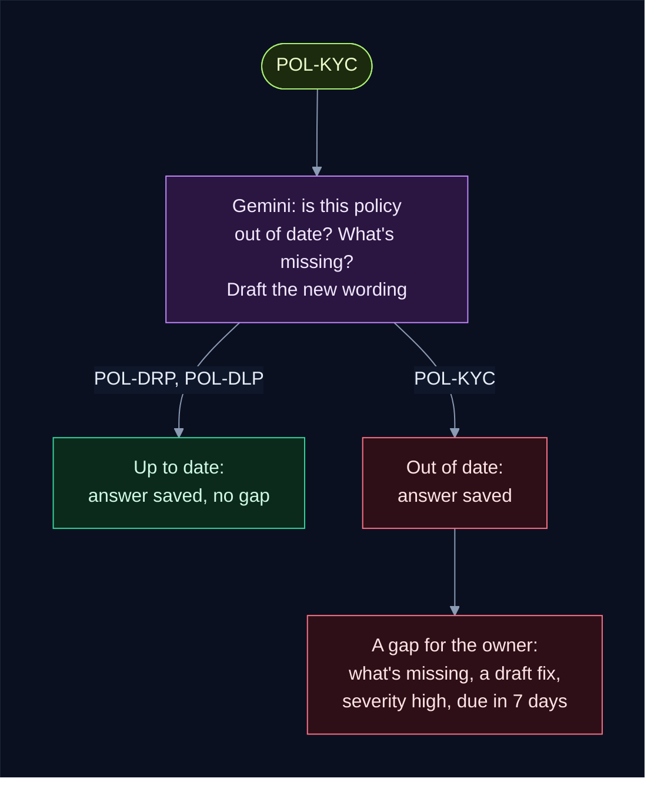
```mermaid
%%{init: {"theme": "base", "flowchart": {"diagramPadding": 0}, "themeVariables": {"darkMode": true, "primaryColor": "#16213a", "primaryTextColor": "#e6edf7", "primaryBorderColor": "#475a7a", "lineColor": "#8b9bb4", "secondaryColor": "#1b2436", "tertiaryColor": "#101a2e", "edgeLabelBackground": "#0f172a", "textColor": "#e2e8f0", "clusterBkg": "#0f1728", "clusterBorder": "#2b3a55", "titleColor": "#c4b5fd", "nodeTextColor": "#e6edf7"}}}%%
flowchart TD
    subgraph canvas[" "]
        direction TB
        p(["POL-KYC"]) --> g["Gemini: is this policy<br/>out of date? What's missing?<br/>Draft the new wording"]
        g -->|"POL-DRP, POL-DLP"| up["Up to date:<br/>answer saved, no gap"]
        g -->|"POL-KYC"| od["Out of date:<br/>answer saved"]
        od --> gap["A gap for the owner:<br/>what's missing, a draft fix,<br/>severity high, due in 7 days"]
    end
    classDef svc fill:#0e2a2c,stroke:#2dd4bf,color:#ccfbf1
    classDef data fill:#1c1a47,stroke:#818cf8,color:#e0e7ff
    classDef ext fill:#2a1640,stroke:#c084fc,color:#f3e8ff
    classDef gpu fill:#2d1b0c,stroke:#fb923c,color:#ffedd5
    classDef ask fill:#2a2410,stroke:#fbbf24,color:#fef3c7
    classDef ok fill:#0b2a1c,stroke:#34d399,color:#d1fae5
    classDef bad fill:#2e0f17,stroke:#fb7185,color:#ffe4e6
    classDef start fill:#1c2a0e,stroke:#a7ef6f,color:#ecfccb
    classDef muted fill:#1a2130,stroke:#64748b,color:#cbd5e1
    classDef queue fill:#0c2231,stroke:#38bdf8,color:#e0f2fe
    class p start
    class g ext
    class up ok
    class od,gap bad
    style canvas fill:#0b1020,stroke:#1e293b,color:#0b1020
```

**The database after** (`policy_checks` and `gaps`):

| circular | policy | version | similarity | out of date |
|---|---|---|---|---|
| **98** | **POL-KYC** | **1** | **0.82** | **yes** |
| **98** | **POL-DRP** | **1** | **0.58** | **no** |
| **98** | **POL-DLP** | **1** | **0.55** | **no** |

| gap | company | policy | severity | owner | due | status |
|---|---|---|---|---|---|---|
| **#1** | **A** | **POL-KYC v1** | **high** | **Head of Compliance** | **in 7 days** | **open** |

Every answer is saved, so the same question is never asked twice. More:
[section 10](#10-gemini-the-three-questions).

### Step 10: You see it in the console

Company A's check is done. Here's what A's team now sees:

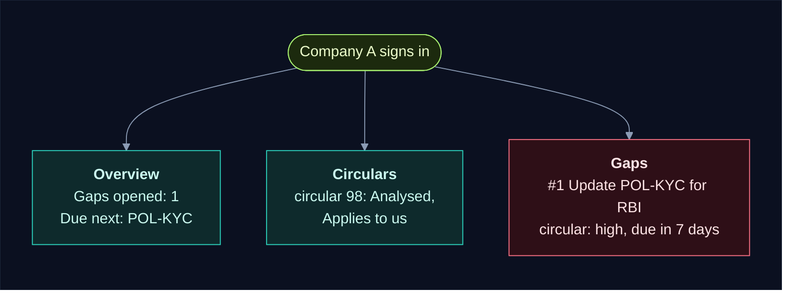
```mermaid
%%{init: {"theme": "base", "flowchart": {"diagramPadding": 0}, "themeVariables": {"darkMode": true, "primaryColor": "#16213a", "primaryTextColor": "#e6edf7", "primaryBorderColor": "#475a7a", "lineColor": "#8b9bb4", "secondaryColor": "#1b2436", "tertiaryColor": "#101a2e", "edgeLabelBackground": "#0f172a", "textColor": "#e2e8f0", "clusterBkg": "#0f1728", "clusterBorder": "#2b3a55", "titleColor": "#c4b5fd", "nodeTextColor": "#e6edf7"}}}%%
flowchart TD
    subgraph canvas[" "]
        direction TB
        a(["Company A signs in"]) --> o["<b>Overview</b><br/>Gaps opened: 1<br/>Due next: POL-KYC"]
        a --> c["<b>Circulars</b><br/>circular 98: Analysed,<br/>Applies to us"]
        a --> g["<b>Gaps</b><br/>#1 Update POL-KYC for RBI<br/>circular: high, due in 7 days"]
    end
    classDef svc fill:#0e2a2c,stroke:#2dd4bf,color:#ccfbf1
    classDef data fill:#1c1a47,stroke:#818cf8,color:#e0e7ff
    classDef ext fill:#2a1640,stroke:#c084fc,color:#f3e8ff
    classDef gpu fill:#2d1b0c,stroke:#fb923c,color:#ffedd5
    classDef ask fill:#2a2410,stroke:#fbbf24,color:#fef3c7
    classDef ok fill:#0b2a1c,stroke:#34d399,color:#d1fae5
    classDef bad fill:#2e0f17,stroke:#fb7185,color:#ffe4e6
    classDef start fill:#1c2a0e,stroke:#a7ef6f,color:#ecfccb
    classDef muted fill:#1a2130,stroke:#64748b,color:#cbd5e1
    classDef queue fill:#0c2231,stroke:#38bdf8,color:#e0f2fe
    class a start
    class o,c svc
    class g bad
    style canvas fill:#0b1020,stroke:#1e293b,color:#0b1020
```

- On circular 98's page, **Checked against your policies** lists POL-KYC (**Out of date**),
  POL-DRP and POL-DLP (**Up to date**), each with its score.
- On gap #1's page: **What the policy is missing**, the **Proposed wording**, and the
  **Activity** history, which starts with "agent opened".
- Company B sees circular 98 as **Analysed** and **Not for us**, and no gap.

### Step 11: Your team works the gap

The policy's owner (or anyone in company A) takes it from there: starts it, updates the
policy, and closes the gap with a note. Every change goes into the gap's history.

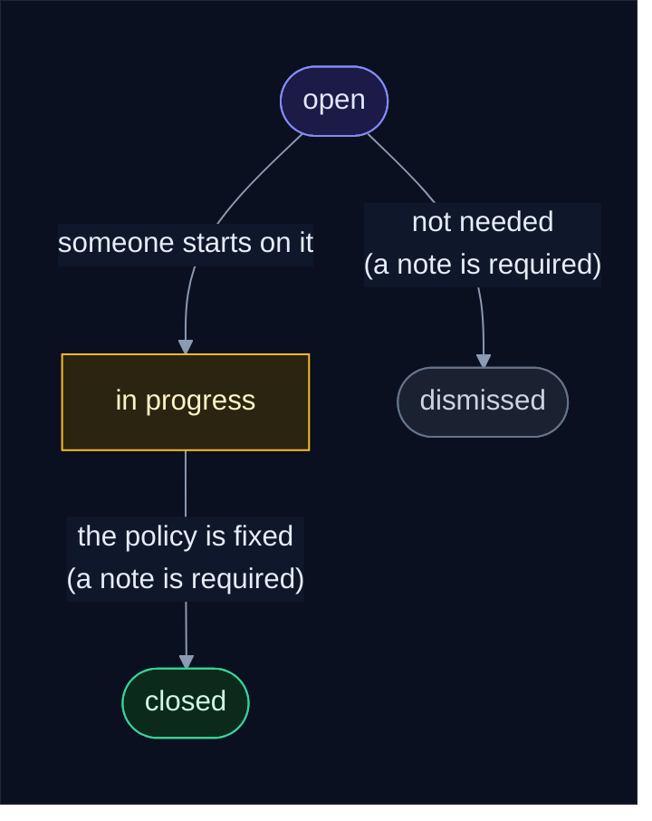
```mermaid
%%{init: {"theme": "base", "flowchart": {"diagramPadding": 0}, "themeVariables": {"darkMode": true, "primaryColor": "#16213a", "primaryTextColor": "#e6edf7", "primaryBorderColor": "#475a7a", "lineColor": "#8b9bb4", "secondaryColor": "#1b2436", "tertiaryColor": "#101a2e", "edgeLabelBackground": "#0f172a", "textColor": "#e2e8f0", "clusterBkg": "#0f1728", "clusterBorder": "#2b3a55", "titleColor": "#c4b5fd", "nodeTextColor": "#e6edf7"}}}%%
flowchart TD
    subgraph canvas[" "]
        direction TB
        o(["open"]) -->|"someone starts on it"| p["in progress"]
        p -->|"the policy is fixed<br/>(a note is required)"| c(["closed"])
        o -->|"not needed<br/>(a note is required)"| d(["dismissed"])
    end
    classDef svc fill:#0e2a2c,stroke:#2dd4bf,color:#ccfbf1
    classDef data fill:#1c1a47,stroke:#818cf8,color:#e0e7ff
    classDef ext fill:#2a1640,stroke:#c084fc,color:#f3e8ff
    classDef gpu fill:#2d1b0c,stroke:#fb923c,color:#ffedd5
    classDef ask fill:#2a2410,stroke:#fbbf24,color:#fef3c7
    classDef ok fill:#0b2a1c,stroke:#34d399,color:#d1fae5
    classDef bad fill:#2e0f17,stroke:#fb7185,color:#ffe4e6
    classDef start fill:#1c2a0e,stroke:#a7ef6f,color:#ecfccb
    classDef muted fill:#1a2130,stroke:#64748b,color:#cbd5e1
    classDef queue fill:#0c2231,stroke:#38bdf8,color:#e0f2fe
    class o data
    class p ask
    class c ok
    class d muted
    style canvas fill:#0b1020,stroke:#1e293b,color:#0b1020
```

When POL-KYC's text is edited, it becomes **version 2**, and gap #1's history gets a line
"POL-KYC updated to v2", so the owner can close the gap against the new wording. More:
[section 16](#16-tracking-a-gap-until-its-closed).

### What the whole journey cost

| Work | How many times | For |
|---|---|---|
| download the PDF | 1 | everybody |
| OCR | 3 pages, once | everybody |
| Gemini: summary | 1 | everybody |
| Gemini: embedding | 1 | everybody |
| Gemini: does it apply? | 1 per described company: 2 | A and B |
| Gemini: is this policy out of date? | up to 3 per company it applies to: 3 | A |

Nothing is repeated later: not after a restart, not when a new policy is added (only new
questions are asked), and not when another circular turns out to have the identical PDF.

---

## 7. A circular's status

A circular's **status** says how far it has got. The first part is shared by every company;
then each company has its own **assessment**.

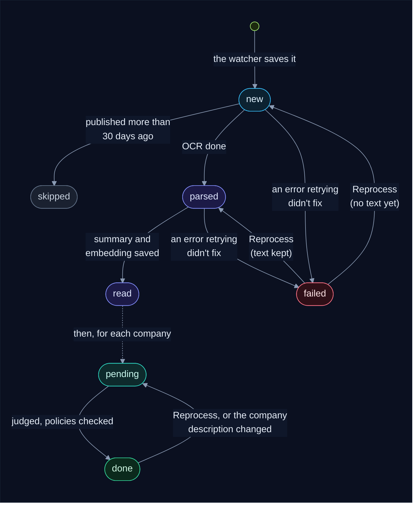
```mermaid
%%{init: {"theme": "base", "flowchart": {"diagramPadding": 0}, "themeVariables": {"darkMode": true, "primaryColor": "#16213a", "primaryTextColor": "#e6edf7", "primaryBorderColor": "#475a7a", "lineColor": "#8b9bb4", "secondaryColor": "#1b2436", "tertiaryColor": "#101a2e", "edgeLabelBackground": "#0f172a", "textColor": "#e2e8f0", "clusterBkg": "#0f1728", "clusterBorder": "#2b3a55", "titleColor": "#c4b5fd", "nodeTextColor": "#e6edf7"}}}%%
flowchart TD
    subgraph canvas[" "]
        direction TB
        s0((" ")) -->|"the watcher saves it"| c_new(["new"])
        c_new -->|"published more than<br/>30 days ago"| c_skipped(["skipped"])
        c_new -->|"OCR done"| c_parsed(["parsed"])
        c_parsed -->|"summary and<br/>embedding saved"| c_read(["read"])
        c_new -->|"an error retrying<br/>didn't fix"| c_failed(["failed"])
        c_parsed -->|"an error retrying<br/>didn't fix"| c_failed
        c_failed -->|"Reprocess<br/>(no text yet)"| c_new
        c_failed -->|"Reprocess<br/>(text kept)"| c_parsed
        c_read -.->|"then, for each company"| a_pending(["pending"])
        a_pending -->|"judged, policies checked"| a_done(["done"])
        a_done -->|"Reprocess, or the company<br/>description changed"| a_pending
    end
    classDef svc fill:#0e2a2c,stroke:#2dd4bf,color:#ccfbf1
    classDef data fill:#1c1a47,stroke:#818cf8,color:#e0e7ff
    classDef ext fill:#2a1640,stroke:#c084fc,color:#f3e8ff
    classDef gpu fill:#2d1b0c,stroke:#fb923c,color:#ffedd5
    classDef ask fill:#2a2410,stroke:#fbbf24,color:#fef3c7
    classDef ok fill:#0b2a1c,stroke:#34d399,color:#d1fae5
    classDef bad fill:#2e0f17,stroke:#fb7185,color:#ffe4e6
    classDef start fill:#1c2a0e,stroke:#a7ef6f,color:#ecfccb
    classDef muted fill:#1a2130,stroke:#64748b,color:#cbd5e1
    classDef queue fill:#0c2231,stroke:#38bdf8,color:#e0f2fe
    class s0 start
    class c_new queue
    class c_parsed,c_read data
    class c_failed bad
    class c_skipped muted
    class a_pending svc
    class a_done ok
    style canvas fill:#0b1020,stroke:#1e293b,color:#0b1020
```

| In the database | The console shows | What it means |
|---|---|---|
| `new` | **New** | saved by the watcher; a worker will start on it |
| `parsed` | **In progress** | the OCR text is saved; the summary is next |
| `read`, your assessment `pending` | **In progress** | read; your company's check is waiting or running |
| `read`, your assessment `done` | **Analysed** | finished for your company |
| `failed` (or your assessment `failed`) | **Failed** | something went wrong that retrying didn't fix; the page says why, and **Reprocess** tries again |
| `skipped` | **Skipped** | older than 30 days when first seen: never read, costs nothing |

#### Where "Skipped" comes from

A worker sets it, the first time it picks up a `new` circular, when the circular was
published more than 30 days ago (`LOOKBACK_DAYS`). The watcher saves everything on the
regulators' lists, including old circulars, so `skipped` stops a first start from paying to
read months of them. A circular with no publication date is never skipped.

- Nothing retries a skipped circular: no task is queued for it again, unless someone presses
  **Reprocess**.
- **To read one anyway:** raise `LOOKBACK_DAYS` in `.env`, restart the workers, then press
  **Reprocess** on it. Reprocess alone sets it back to `new`, but while it's still older than
  the window it's skipped again.
- A company that joined later also sees older circulars as **Skipped**, even ones that were
  read: it only gets checks for the last 30 days.

#### Where "Failed" comes from

A worker sets it when reading a circular (or checking it for your company) fails in a way
that waiting or retrying can't fix: for example the PDF has no text at all, the PDF is
missing from S3, or Gemini refuses the request. The error is saved on the circular and shown
on its page under **Why it failed**.

- A failed circular stays failed: nothing retries it by itself, because the same error would
  just happen again.
- **To run it again:** fix the cause, then press **Reprocess**. It carries on from what was
  saved: if the OCR text was saved, the PDF isn't read again.
- The details, for every kind of failure: [Running failed work again](#running-failed-work-again).

---
## 8. The watcher: finding circulars

The watcher is the post room: once an hour it visits the three regulators, and for each
circular it hasn't seen before it stores the PDF, adds a row, and leaves a task for the
workers. It has its own guide: **[how_the_watcher_works.md](how_the_watcher_works.md)**.

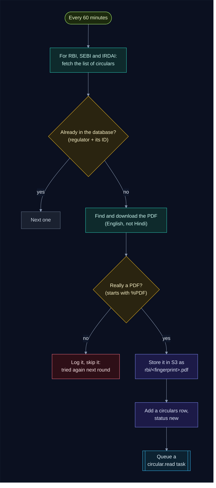
```mermaid
%%{init: {"theme": "base", "flowchart": {"diagramPadding": 0}, "themeVariables": {"darkMode": true, "primaryColor": "#16213a", "primaryTextColor": "#e6edf7", "primaryBorderColor": "#475a7a", "lineColor": "#8b9bb4", "secondaryColor": "#1b2436", "tertiaryColor": "#101a2e", "edgeLabelBackground": "#0f172a", "textColor": "#e2e8f0", "clusterBkg": "#0f1728", "clusterBorder": "#2b3a55", "titleColor": "#c4b5fd", "nodeTextColor": "#e6edf7"}}}%%
flowchart TD
    subgraph canvas[" "]
        direction TB
        start(["Every 60 minutes"]) --> each["For RBI, SEBI and IRDAI:<br/>fetch the list of circulars"]
        each --> known{"Already in the database?<br/>(regulator + its ID)"}
        known -->|"yes"| next["Next one"]
        known -->|"no"| pdf["Find and download the PDF<br/>(English, not Hindi)"]
        pdf --> isPdf{"Really a PDF?<br/>(starts with %PDF)"}
        isPdf -->|"no"| skip["Log it, skip it:<br/>tried again next round"]
        isPdf -->|"yes"| store["Store it in S3 as<br/>rbi/&lt;fingerprint&gt;.pdf"]
        store --> row["Add a circulars row,<br/>status new"]
        row --> task[["Queue a<br/>circular.read task"]]
    end
    classDef svc fill:#0e2a2c,stroke:#2dd4bf,color:#ccfbf1
    classDef data fill:#1c1a47,stroke:#818cf8,color:#e0e7ff
    classDef ext fill:#2a1640,stroke:#c084fc,color:#f3e8ff
    classDef gpu fill:#2d1b0c,stroke:#fb923c,color:#ffedd5
    classDef ask fill:#2a2410,stroke:#fbbf24,color:#fef3c7
    classDef ok fill:#0b2a1c,stroke:#34d399,color:#d1fae5
    classDef bad fill:#2e0f17,stroke:#fb7185,color:#ffe4e6
    classDef start fill:#1c2a0e,stroke:#a7ef6f,color:#ecfccb
    classDef muted fill:#1a2130,stroke:#64748b,color:#cbd5e1
    classDef queue fill:#0c2231,stroke:#38bdf8,color:#e0f2fe
    class start start
    class each,list,pdf svc
    class known,isPdf ask
    class next muted
    class skip bad
    class store,row data
    class task queue
    style canvas fill:#0b1020,stroke:#1e293b,color:#0b1020
```

| Regulator | Where the watcher looks | The circular's ID |
|---|---|---|
| RBI | the RSS feed `notifications_rss.xml` | `?Id=` in the link |
| SEBI | three listing pages: circulars, master circulars, regulations (the RSS feed misses many) | the page's path |
| IRDAI | the circulars table, where each row links its own PDF | `?documentId=` in the link |

- **Polite:** every request waits 1.5 seconds first, and retries up to 3 times on a busy
  site or a network error.
- **Nothing half-saved:** the row is added only once the PDF is safely in S3, so a failure
  just means "try again next round".
- **No duplicates:** a circular is known by its regulator and ID, and its PDF is named after
  its fingerprint, so nothing is saved twice.
- **No date filter:** it saves everything it hasn't seen; the worker skips old circulars
  without reading them.

---

## 9. OCR: turning a PDF into text

The worker reads each PDF with **Baidu Unlimited-OCR**, a vision model that looks at each page
as a picture. Unlike copying a PDF's hidden text layer, it handles scanned pages, tables and
Hindi.

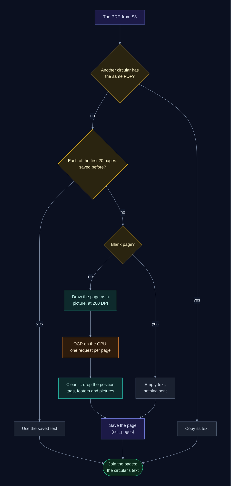
```mermaid
%%{init: {"theme": "base", "flowchart": {"diagramPadding": 0}, "themeVariables": {"darkMode": true, "primaryColor": "#16213a", "primaryTextColor": "#e6edf7", "primaryBorderColor": "#475a7a", "lineColor": "#8b9bb4", "secondaryColor": "#1b2436", "tertiaryColor": "#101a2e", "edgeLabelBackground": "#0f172a", "textColor": "#e2e8f0", "clusterBkg": "#0f1728", "clusterBorder": "#2b3a55", "titleColor": "#c4b5fd", "nodeTextColor": "#e6edf7"}}}%%
flowchart TD
    subgraph canvas[" "]
        direction TB
        pdf["The PDF, from S3"] --> twin{"Another circular has<br/>the same PDF?"}
        twin -->|"yes"| copy["Copy its text"]
        twin -->|"no"| saved{"Each of the first 20 pages:<br/>saved before?"}
        saved -->|"yes"| skip["Use the saved text"]
        saved -->|"no"| blank{"Blank page?"}
        blank -->|"yes"| empty["Empty text,<br/>nothing sent"]
        blank -->|"no"| render["Draw the page as a<br/>picture, at 200 DPI"]
        render --> ocr["OCR on the GPU:<br/>one request per page"]
        ocr --> clean["Clean it: drop the position<br/>tags, footers and pictures"]
        clean --> save["Save the page<br/>(ocr_pages)"]
        empty --> save
        skip --> join(["Join the pages:<br/>the circular's text"])
        save --> join
        copy --> join
    end
    classDef svc fill:#0e2a2c,stroke:#2dd4bf,color:#ccfbf1
    classDef data fill:#1c1a47,stroke:#818cf8,color:#e0e7ff
    classDef ext fill:#2a1640,stroke:#c084fc,color:#f3e8ff
    classDef gpu fill:#2d1b0c,stroke:#fb923c,color:#ffedd5
    classDef ask fill:#2a2410,stroke:#fbbf24,color:#fef3c7
    classDef ok fill:#0b2a1c,stroke:#34d399,color:#d1fae5
    classDef bad fill:#2e0f17,stroke:#fb7185,color:#ffe4e6
    classDef start fill:#1c2a0e,stroke:#a7ef6f,color:#ecfccb
    classDef muted fill:#1a2130,stroke:#64748b,color:#cbd5e1
    classDef queue fill:#0c2231,stroke:#38bdf8,color:#e0f2fe
    class pdf,save data
    class twin,saved,blank ask
    class copy,skip,empty muted
    class render,clean svc
    class ocr gpu
    class join ok
    style canvas fill:#0b1020,stroke:#1e293b,color:#0b1020
```

What the model sends back for one line, and what's kept:

```text
<|det|>text [117, 118, 297, 134]<|/det|>RBI/2026-2027/270      ← from the model
RBI/2026-2027/270                                              ← kept
```

The model tags each block with its type and position on the page. `ocr.py` keeps the text,
and drops page footers (the boilerplate "RBI never sends mails…"), pictures and empty blocks.

| Question | Answer |
|---|---|
| Why only the first 20 pages? | Long master circulars state their changes up front, and the cap stops a 300-page regulation from tying up the GPU for an hour (`OCR_MAX_PAGES`) |
| Why 200 DPI? | At 200 DPI an A4 page is cut into about 6 tiles for the model; at 300 DPI it's 24, too much for an 8 GB GPU. `backend/ocr/README.md` explains the model's flags |
| What if the worker stops halfway? | Each page is saved in `ocr_pages` as soon as it's read. If page 15 of 20 times out, or the worker restarts on page 15, it starts again at page 15 and logs `14 pages OCR'd before, carrying on` |
| Is a PDF ever read twice? | No. The text is kept in `circulars.text`, and a second circular with the identical PDF (the same fingerprint) copies the text, and the summary, instead |
| What if a PDF has no text at all? | The circular is marked **Failed** with "OCR found no text in the PDF". Its pages stay saved, so **Reprocess** doesn't send them to the GPU again |

---

## 10. Gemini: the three questions

This is where the thinking happens. The worker asks Gemini three kinds of question. Each answer
comes back as a filled-in form (JSON matching a fixed shape), never as free text the code
would have to interpret. If Gemini's answer doesn't fit the form, the worker asks again.

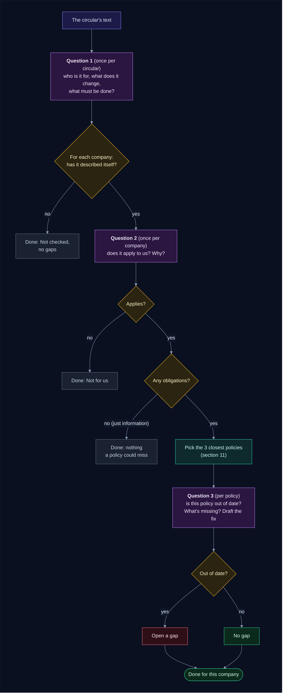
```mermaid
%%{init: {"theme": "base", "flowchart": {"diagramPadding": 0}, "themeVariables": {"darkMode": true, "primaryColor": "#16213a", "primaryTextColor": "#e6edf7", "primaryBorderColor": "#475a7a", "lineColor": "#8b9bb4", "secondaryColor": "#1b2436", "tertiaryColor": "#101a2e", "edgeLabelBackground": "#0f172a", "textColor": "#e2e8f0", "clusterBkg": "#0f1728", "clusterBorder": "#2b3a55", "titleColor": "#c4b5fd", "nodeTextColor": "#e6edf7"}}}%%
flowchart TD
    subgraph canvas[" "]
        direction TB
        text["The circular's text"] --> q1["<b>Question 1</b> (once per circular)<br/>who is it for, what does it change,<br/>what must be done?"]
        q1 --> described{"For each company:<br/>has it described itself?"}
        described -->|"no"| doneUnknown["Done: Not checked,<br/>no gaps"]
        described -->|"yes"| q2["<b>Question 2</b> (once per company)<br/>does it apply to us? Why?"]
        q2 --> applies{"Applies?"}
        applies -->|"no"| doneNo["Done: Not for us"]
        applies -->|"yes"| anyReq{"Any obligations?"}
        anyReq -->|"no (just information)"| doneInfo["Done: nothing<br/>a policy could miss"]
        anyReq -->|"yes"| match["Pick the 3 closest policies<br/>(section 11)"]
        match --> q3["<b>Question 3</b> (per policy)<br/>is this policy out of date?<br/>What's missing? Draft the fix"]
        q3 --> impacted{"Out of date?"}
        impacted -->|"yes"| gap["Open a gap"]
        impacted -->|"no"| ok["No gap"]
        gap --> done(["Done for this company"])
        ok --> done
    end
    classDef svc fill:#0e2a2c,stroke:#2dd4bf,color:#ccfbf1
    classDef data fill:#1c1a47,stroke:#818cf8,color:#e0e7ff
    classDef ext fill:#2a1640,stroke:#c084fc,color:#f3e8ff
    classDef gpu fill:#2d1b0c,stroke:#fb923c,color:#ffedd5
    classDef ask fill:#2a2410,stroke:#fbbf24,color:#fef3c7
    classDef ok fill:#0b2a1c,stroke:#34d399,color:#d1fae5
    classDef bad fill:#2e0f17,stroke:#fb7185,color:#ffe4e6
    classDef start fill:#1c2a0e,stroke:#a7ef6f,color:#ecfccb
    classDef muted fill:#1a2130,stroke:#64748b,color:#cbd5e1
    classDef queue fill:#0c2231,stroke:#38bdf8,color:#e0f2fe
    class text data
    class q1,q2,q3 ext
    class described,applies,anyReq,impacted ask
    class doneUnknown,doneNo,doneInfo muted
    class match svc
    class gap bad
    class ok,done ok
    style canvas fill:#0b1020,stroke:#1e293b,color:#0b1020
```

### The three questions

| # | Question | Asked | What Gemini reads | What it fills in |
|---|---|---|---|---|
| 1 | What does it say? | once per circular | the regulator, the title, and up to 100,000 characters of the text | `addressed_to`, `summary`, `requirements[]` (numbers and deadlines kept as written) |
| 2 | Does it apply to us? | once per company, once it's described | the company's description, the title, the addressees, and the first 4,000 characters | `reason`, `applies_to_company` |
| 3 | Is this policy out of date? | once per policy version, for the 3 closest policies | the company's description; the circular's addressees, summary and obligations; the policy's text and controls | `missing_from_policy`, `impacted`, `severity`, `affected_controls[]`, `draft_change` |

### Question 1: what does it say?

```mermaid
%%{init: {"theme": "base", "flowchart": {"diagramPadding": 0}, "themeVariables": {"darkMode": true, "primaryColor": "#16213a", "primaryTextColor": "#e6edf7", "primaryBorderColor": "#475a7a", "lineColor": "#8b9bb4", "secondaryColor": "#1b2436", "tertiaryColor": "#101a2e", "edgeLabelBackground": "#0f172a", "textColor": "#e2e8f0", "clusterBkg": "#0f1728", "clusterBorder": "#2b3a55", "titleColor": "#c4b5fd", "nodeTextColor": "#e6edf7"}}}%%
flowchart TD
    subgraph canvas[" "]
        direction TB
        a["Regulator: RBI<br/>Title: Designation of…<br/>Text: RESERVE BANK OF INDIA …"] --> g["Gemini"]
        g --> o["addressed_to · summary ·<br/>requirements"]
    end
    classDef svc fill:#0e2a2c,stroke:#2dd4bf,color:#ccfbf1
    classDef data fill:#1c1a47,stroke:#818cf8,color:#e0e7ff
    classDef ext fill:#2a1640,stroke:#c084fc,color:#f3e8ff
    classDef gpu fill:#2d1b0c,stroke:#fb923c,color:#ffedd5
    classDef ask fill:#2a2410,stroke:#fbbf24,color:#fef3c7
    classDef ok fill:#0b2a1c,stroke:#34d399,color:#d1fae5
    classDef bad fill:#2e0f17,stroke:#fb7185,color:#ffe4e6
    classDef start fill:#1c2a0e,stroke:#a7ef6f,color:#ecfccb
    classDef muted fill:#1a2130,stroke:#64748b,color:#cbd5e1
    classDef queue fill:#0c2231,stroke:#38bdf8,color:#e0f2fe
    class a data
    class g ext
    class o svc
    style canvas fill:#0b1020,stroke:#1e293b,color:#0b1020
```

An example answer:

```json
{
  "addressed_to": "All Regulated Entities of the Reserve Bank, including NBFCs",
  "summary": "RBI designates a new terrorist organisation under the UAPA and asks regulated entities to freeze and report related accounts.",
  "requirements": [
    "Freeze, without delay, any account held by the designated organisation or its members",
    "Report any such account to FIU-IND and the Nodal Officer within 24 hours"
  ]
}
```

The instructions ask for every obligation, one per item, with numbers, time limits and dates
exactly as written, and no vague items like "comply with the circular".

### Question 2: does it apply to us?

```mermaid
%%{init: {"theme": "base", "flowchart": {"diagramPadding": 0}, "themeVariables": {"darkMode": true, "primaryColor": "#16213a", "primaryTextColor": "#e6edf7", "primaryBorderColor": "#475a7a", "lineColor": "#8b9bb4", "secondaryColor": "#1b2436", "tertiaryColor": "#101a2e", "edgeLabelBackground": "#0f172a", "textColor": "#e2e8f0", "clusterBkg": "#0f1728", "clusterBorder": "#2b3a55", "titleColor": "#c4b5fd", "nodeTextColor": "#e6edf7"}}}%%
flowchart TD
    subgraph canvas[" "]
        direction TB
        c(["Your company description"]) --> g["Gemini"]
        a["The title, the addressees,<br/>the first 4,000 characters"] --> g
        g --> o["applies_to_company ·<br/>a one-sentence reason"]
    end
    classDef svc fill:#0e2a2c,stroke:#2dd4bf,color:#ccfbf1
    classDef data fill:#1c1a47,stroke:#818cf8,color:#e0e7ff
    classDef ext fill:#2a1640,stroke:#c084fc,color:#f3e8ff
    classDef gpu fill:#2d1b0c,stroke:#fb923c,color:#ffedd5
    classDef ask fill:#2a2410,stroke:#fbbf24,color:#fef3c7
    classDef ok fill:#0b2a1c,stroke:#34d399,color:#d1fae5
    classDef bad fill:#2e0f17,stroke:#fb7185,color:#ffe4e6
    classDef start fill:#1c2a0e,stroke:#a7ef6f,color:#ecfccb
    classDef muted fill:#1a2130,stroke:#64748b,color:#cbd5e1
    classDef queue fill:#0c2231,stroke:#38bdf8,color:#e0f2fe
    class c start
    class a data
    class g ext
    class o svc
    style canvas fill:#0b1020,stroke:#1e293b,color:#0b1020
```

```json
{
  "reason": "Addressed to all regulated entities including NBFCs, and the company is an NBFC.",
  "applies_to_company": true
}
```

Only the start of the text is sent: that's where a circular says who it's for. A circular
with no named addressee (amended regulations, say) applies if its subject touches any of the
company's businesses.

### Question 3: is this policy out of date?

```mermaid
%%{init: {"theme": "base", "flowchart": {"diagramPadding": 0}, "themeVariables": {"darkMode": true, "primaryColor": "#16213a", "primaryTextColor": "#e6edf7", "primaryBorderColor": "#475a7a", "lineColor": "#8b9bb4", "secondaryColor": "#1b2436", "tertiaryColor": "#101a2e", "edgeLabelBackground": "#0f172a", "textColor": "#e2e8f0", "clusterBkg": "#0f1728", "clusterBorder": "#2b3a55", "titleColor": "#c4b5fd", "nodeTextColor": "#e6edf7"}}}%%
flowchart TD
    subgraph canvas[" "]
        direction TB
        c(["Your company description"]) --> g["Gemini"]
        a["The circular: addressees,<br/>summary, obligations"] --> g
        p["The policy: its text at<br/>this version, its controls"] --> g
        g --> o["what's missing · out of date? ·<br/>severity · controls · draft"]
    end
    classDef svc fill:#0e2a2c,stroke:#2dd4bf,color:#ccfbf1
    classDef data fill:#1c1a47,stroke:#818cf8,color:#e0e7ff
    classDef ext fill:#2a1640,stroke:#c084fc,color:#f3e8ff
    classDef gpu fill:#2d1b0c,stroke:#fb923c,color:#ffedd5
    classDef ask fill:#2a2410,stroke:#fbbf24,color:#fef3c7
    classDef ok fill:#0b2a1c,stroke:#34d399,color:#d1fae5
    classDef bad fill:#2e0f17,stroke:#fb7185,color:#ffe4e6
    classDef start fill:#1c2a0e,stroke:#a7ef6f,color:#ecfccb
    classDef muted fill:#1a2130,stroke:#64748b,color:#cbd5e1
    classDef queue fill:#0c2231,stroke:#38bdf8,color:#e0f2fe
    class c start
    class a,p data
    class g ext
    class o svc
    style canvas fill:#0b1020,stroke:#1e293b,color:#0b1020
```

```json
{
  "missing_from_policy": "The policy has no rule to freeze accounts of designated organisations, or to report them to FIU-IND within 24 hours.",
  "impacted": true,
  "severity": "high",
  "affected_controls": ["CTL-KYC-03"],
  "draft_change": "Add clause 2A after clause 2: 'On any designation under the UAPA, the Company shall freeze …'"
}
```

- **Out of date** means the circular creates or changes an obligation within the policy's
  scope that the policy text doesn't already meet. A policy is only counted out of date when
  `impacted` is true *and* `missing_from_policy` isn't empty.
- **Up to date** is a real answer, not a failure: the policy already complies, or the
  circular is about something it doesn't cover. It's saved too, so the same pair is never
  asked about again.
- **Severity:** `high` means the company would breach the circular or face penalties;
  `medium`, a process or document must change; `low`, only wording or a reference.

### What a gap contains

| Field | Where it comes from |
|---|---|
| `title` | `Update POL-KYC for RBI circular: <the circular's title>` |
| `impact` | what the policy is missing (question 3) |
| `draft_change` | the proposed wording (question 3) |
| `affected_controls` | the policy's controls Gemini named; codes that don't exist are dropped |
| `severity` | `high`, `medium` or `low` (question 3) |
| `owner` | the policy's owner |
| `due_date` | today plus 7 days (high), 30 (medium) or 60 (low) |
| `policy_version` | the version of the policy that was found out of date |

Each gap starts its history with one line: `agent` `opened`, with what's missing. The verdict,
the gap and that first line are saved together: all of them or none.

### Work that's done once, and kept

Everything slow or paid for is saved the first time and reused after that:

| Work | Saved in | Done again only when |
|---|---|---|
| OCR of the PDF (the slowest step) | `ocr_pages` page by page while it runs, then `circulars.text` | never. A second circular with the same PDF copies it |
| Question 1: what does it say? | `circulars.addressed_to`, `summary`, `requirements` | never. A second circular with the same PDF copies it |
| Question 2: does it apply to us? | `assessments.applicable`, `applies_reason` (per company) | you change your company description, or press **Reprocess** |
| The circular's embedding | `circulars.embedding` | you change the embedding model |
| A policy's embeddings | `policies.embeddings` | its title or text is edited, or you change the embedding model |
| Question 3: is this policy out of date? | `policy_checks` (and a gap if it is) | the policy's text changes (a new version), or **Reprocess** re-asks the "up to date" ones |

> ✅ **Nothing is done twice.** A restart, an outage halfway through, a task delivered twice,
> a new policy or a changed company description never repeats a call that already succeeded.
> With no task waiting, the worker makes no call at all.

---

## 11. How the closest policies are found

Reading every policy for every circular would be slow and expensive, so the worker narrows the
list first with **embeddings**.

Think of an embedding as a **position on a map of meanings**: 768 numbers that place a text
somewhere, so texts about similar things land close together. A KYC circular lands near your
KYC policy, and far from your leave policy. Measuring how close two texts are is quick
arithmetic (**cosine similarity**, from 0 to 1), with no Gemini call.

```mermaid
%%{init: {"theme": "base", "flowchart": {"diagramPadding": 0}, "themeVariables": {"darkMode": true, "primaryColor": "#16213a", "primaryTextColor": "#e6edf7", "primaryBorderColor": "#475a7a", "lineColor": "#8b9bb4", "secondaryColor": "#1b2436", "tertiaryColor": "#101a2e", "edgeLabelBackground": "#0f172a", "textColor": "#e2e8f0", "clusterBkg": "#0f1728", "clusterBorder": "#2b3a55", "titleColor": "#c4b5fd", "nodeTextColor": "#e6edf7"}}}%%
flowchart TD
    subgraph canvas[" "]
        direction TB
        c["The circular: title +<br/>summary + obligations"] -->|"embedded once,<br/>kept on the circular"| qv(("its position"))
        p["Each policy: title + text,<br/>in 5,000-character pieces"] -->|"embedded once,<br/>kept on the policy"| pv(("one position<br/>per piece"))
        filter{"Only policies that list the<br/>circular's regulator"} --> cos
        qv --> cos["How close? A policy<br/>scores its closest piece"]
        pv --> cos
        cos --> top(["The 3 highest scores<br/>go to question 3"])
    end
    classDef svc fill:#0e2a2c,stroke:#2dd4bf,color:#ccfbf1
    classDef data fill:#1c1a47,stroke:#818cf8,color:#e0e7ff
    classDef ext fill:#2a1640,stroke:#c084fc,color:#f3e8ff
    classDef gpu fill:#2d1b0c,stroke:#fb923c,color:#ffedd5
    classDef ask fill:#2a2410,stroke:#fbbf24,color:#fef3c7
    classDef ok fill:#0b2a1c,stroke:#34d399,color:#d1fae5
    classDef bad fill:#2e0f17,stroke:#fb7185,color:#ffe4e6
    classDef start fill:#1c2a0e,stroke:#a7ef6f,color:#ecfccb
    classDef muted fill:#1a2130,stroke:#64748b,color:#cbd5e1
    classDef queue fill:#0c2231,stroke:#38bdf8,color:#e0f2fe
    class c,p data
    class qv,pv,cos svc
    class filter ask
    class top ok
    style canvas fill:#0b1020,stroke:#1e293b,color:#0b1020
```

- **Long policies are cut into pieces.** The embedding model reads about 2,000 tokens (words
  or parts of words) at most, so a policy is split into 5,000-character pieces, each placed on the map. A policy scores
  its best piece, so a clause on page 12 of a long KYC policy still makes it a match.
- **Only the right regulator.** A policy tagged RBI is only scored against RBI circulars.
- **Top 3.** The 3 highest scores go on to question 3 (`MATCH_TOP_K`). With 3 or fewer
  policies for that regulator, all of them are checked; with 50, only the 3 most relevant.
- **You can see the scores.** Each circular's page lists the policies it was checked against,
  under **Checked against your policies**, with their scores and verdicts.

For the RBI circular in [section 6](#6-the-life-of-one-circular-step-by-step):

| Policy (all tagged RBI) | Score | Sent to Gemini? |
|---|---|---|
| POL-KYC, Know Your Customer and anti-money laundering | 0.82 | ✅ top 3 |
| POL-DRP, dividend repatriation and related-party payments | 0.58 | ✅ top 3 |
| POL-DLP, digital lending and fair practices | 0.55 | ✅ top 3 |
| POL-IT, IT security | 0.31 | no |
| POL-HR, staff leave | 0.12 | no |

---

## 12. When you add or edit a policy

Circulars aren't the only trigger. When you add a policy, the worker checks it against your
company's circulars of the **last 30 days** that apply to you, so a library loaded today still
finds the gaps left by last week's circulars. From then on, every new circular is checked
against it too.

> 💡 **No restart, no waiting.** Saving a policy queues a `policy.check` task, and a worker
> starts on it straight away. The policy's page says **Waiting for the worker** until it's
> done, then **Checked**.

### Step by step: what happens to a new policy

**Step 1: you save it.** The api saves it as version 1 under your company, with no
embeddings yet, and queues a `policy.check` task.

```mermaid
%%{init: {"theme": "base", "flowchart": {"diagramPadding": 0}, "themeVariables": {"darkMode": true, "primaryColor": "#16213a", "primaryTextColor": "#e6edf7", "primaryBorderColor": "#475a7a", "lineColor": "#8b9bb4", "secondaryColor": "#1b2436", "tertiaryColor": "#101a2e", "edgeLabelBackground": "#0f172a", "textColor": "#e2e8f0", "clusterBkg": "#0f1728", "clusterBorder": "#2b3a55", "titleColor": "#c4b5fd", "nodeTextColor": "#e6edf7"}}}%%
flowchart TD
    subgraph canvas[" "]
        direction TB
        u(["You: New policy,<br/>or Import JSON"]) --> a["api"]
        a --> db[("Postgres: POL-AML,<br/>version 1, not checked")]
        a --> q[["Note: check<br/>policy POL-AML"]]
    end
    classDef svc fill:#0e2a2c,stroke:#2dd4bf,color:#ccfbf1
    classDef data fill:#1c1a47,stroke:#818cf8,color:#e0e7ff
    classDef ext fill:#2a1640,stroke:#c084fc,color:#f3e8ff
    classDef gpu fill:#2d1b0c,stroke:#fb923c,color:#ffedd5
    classDef ask fill:#2a2410,stroke:#fbbf24,color:#fef3c7
    classDef ok fill:#0b2a1c,stroke:#34d399,color:#d1fae5
    classDef bad fill:#2e0f17,stroke:#fb7185,color:#ffe4e6
    classDef start fill:#1c2a0e,stroke:#a7ef6f,color:#ecfccb
    classDef muted fill:#1a2130,stroke:#64748b,color:#cbd5e1
    classDef queue fill:#0c2231,stroke:#38bdf8,color:#e0f2fe
    class u start
    class a svc
    class db data
    class q queue
    style canvas fill:#0b1020,stroke:#1e293b,color:#0b1020
```

**Step 2: a worker turns it into numbers.** The policy's text is cut into 5,000-character
pieces and each one is embedded.

```mermaid
%%{init: {"theme": "base", "flowchart": {"diagramPadding": 0}, "themeVariables": {"darkMode": true, "primaryColor": "#16213a", "primaryTextColor": "#e6edf7", "primaryBorderColor": "#475a7a", "lineColor": "#8b9bb4", "secondaryColor": "#1b2436", "tertiaryColor": "#101a2e", "edgeLabelBackground": "#0f172a", "textColor": "#e2e8f0", "clusterBkg": "#0f1728", "clusterBorder": "#2b3a55", "titleColor": "#c4b5fd", "nodeTextColor": "#e6edf7"}}}%%
flowchart TD
    subgraph canvas[" "]
        direction TB
        p["POL-AML: title + text<br/>(9,800 characters: 2 pieces)"] --> g["Gemini's<br/>embedding model"]
        g --> e["2 positions on the<br/>map, saved on the policy"]
    end
    classDef svc fill:#0e2a2c,stroke:#2dd4bf,color:#ccfbf1
    classDef data fill:#1c1a47,stroke:#818cf8,color:#e0e7ff
    classDef ext fill:#2a1640,stroke:#c084fc,color:#f3e8ff
    classDef gpu fill:#2d1b0c,stroke:#fb923c,color:#ffedd5
    classDef ask fill:#2a2410,stroke:#fbbf24,color:#fef3c7
    classDef ok fill:#0b2a1c,stroke:#34d399,color:#d1fae5
    classDef bad fill:#2e0f17,stroke:#fb7185,color:#ffe4e6
    classDef start fill:#1c2a0e,stroke:#a7ef6f,color:#ecfccb
    classDef muted fill:#1a2130,stroke:#64748b,color:#cbd5e1
    classDef queue fill:#0c2231,stroke:#38bdf8,color:#e0f2fe
    class p,e data
    class g ext
    style canvas fill:#0b1020,stroke:#1e293b,color:#0b1020
```

**Step 3: it finds the circulars worth checking.** Your company's circulars from the last 30
days that apply to you and create obligations.

```mermaid
%%{init: {"theme": "base", "flowchart": {"diagramPadding": 0}, "themeVariables": {"darkMode": true, "primaryColor": "#16213a", "primaryTextColor": "#e6edf7", "primaryBorderColor": "#475a7a", "lineColor": "#8b9bb4", "secondaryColor": "#1b2436", "tertiaryColor": "#101a2e", "edgeLabelBackground": "#0f172a", "textColor": "#e2e8f0", "clusterBkg": "#0f1728", "clusterBorder": "#2b3a55", "titleColor": "#c4b5fd", "nodeTextColor": "#e6edf7"}}}%%
flowchart TD
    subgraph canvas[" "]
        direction TB
        all(["Every circular"]) --> a["Analysed for your company,<br/>and applies to you"]
        a --> b["Published in the<br/>last 30 days"]
        b --> c["Creates obligations"]
        c --> d(["Worth checking"])
    end
    classDef svc fill:#0e2a2c,stroke:#2dd4bf,color:#ccfbf1
    classDef data fill:#1c1a47,stroke:#818cf8,color:#e0e7ff
    classDef ext fill:#2a1640,stroke:#c084fc,color:#f3e8ff
    classDef gpu fill:#2d1b0c,stroke:#fb923c,color:#ffedd5
    classDef ask fill:#2a2410,stroke:#fbbf24,color:#fef3c7
    classDef ok fill:#0b2a1c,stroke:#34d399,color:#d1fae5
    classDef bad fill:#2e0f17,stroke:#fb7185,color:#ffe4e6
    classDef start fill:#1c2a0e,stroke:#a7ef6f,color:#ecfccb
    classDef muted fill:#1a2130,stroke:#64748b,color:#cbd5e1
    classDef queue fill:#0c2231,stroke:#38bdf8,color:#e0f2fe
    class all start
    class a,b,c svc
    class d ok
    style canvas fill:#0b1020,stroke:#1e293b,color:#0b1020
```

**Step 4: for each one, it ranks your policies.** The new policy competes with all your
policies for that regulator for the 3 closest places.

```mermaid
%%{init: {"theme": "base", "flowchart": {"diagramPadding": 0}, "themeVariables": {"darkMode": true, "primaryColor": "#16213a", "primaryTextColor": "#e6edf7", "primaryBorderColor": "#475a7a", "lineColor": "#8b9bb4", "secondaryColor": "#1b2436", "tertiaryColor": "#101a2e", "edgeLabelBackground": "#0f172a", "textColor": "#e2e8f0", "clusterBkg": "#0f1728", "clusterBorder": "#2b3a55", "titleColor": "#c4b5fd", "nodeTextColor": "#e6edf7"}}}%%
flowchart TD
    subgraph canvas[" "]
        direction TB
        c["One circular worth checking"] --> r["Rank all your policies<br/>for its regulator"]
        r --> t{"Is POL-AML in the<br/>3 closest, and never<br/>asked about before?"}
        t -->|"no"| n["Nothing to ask"]
        t -->|"yes"| g["Ask Gemini question 3"]
    end
    classDef svc fill:#0e2a2c,stroke:#2dd4bf,color:#ccfbf1
    classDef data fill:#1c1a47,stroke:#818cf8,color:#e0e7ff
    classDef ext fill:#2a1640,stroke:#c084fc,color:#f3e8ff
    classDef gpu fill:#2d1b0c,stroke:#fb923c,color:#ffedd5
    classDef ask fill:#2a2410,stroke:#fbbf24,color:#fef3c7
    classDef ok fill:#0b2a1c,stroke:#34d399,color:#d1fae5
    classDef bad fill:#2e0f17,stroke:#fb7185,color:#ffe4e6
    classDef start fill:#1c2a0e,stroke:#a7ef6f,color:#ecfccb
    classDef muted fill:#1a2130,stroke:#64748b,color:#cbd5e1
    classDef queue fill:#0c2231,stroke:#38bdf8,color:#e0f2fe
    class c data
    class r svc
    class t ask
    class n muted
    class g ext
    style canvas fill:#0b1020,stroke:#1e293b,color:#0b1020
```

**Step 5: each answer is saved.** Up to date, or out of date with a gap for the owner. Then
the policy is stamped **Checked**.

```mermaid
%%{init: {"theme": "base", "flowchart": {"diagramPadding": 0}, "themeVariables": {"darkMode": true, "primaryColor": "#16213a", "primaryTextColor": "#e6edf7", "primaryBorderColor": "#475a7a", "lineColor": "#8b9bb4", "secondaryColor": "#1b2436", "tertiaryColor": "#101a2e", "edgeLabelBackground": "#0f172a", "textColor": "#e2e8f0", "clusterBkg": "#0f1728", "clusterBorder": "#2b3a55", "titleColor": "#c4b5fd", "nodeTextColor": "#e6edf7"}}}%%
flowchart TD
    subgraph canvas[" "]
        direction TB
        g["Gemini's answer"] -->|"up to date"| up["Saved: no gap"]
        g -->|"out of date"| gap["Saved, and a gap<br/>for the owner"]
        up --> ck(["Policy: Checked"])
        gap --> ck
    end
    classDef svc fill:#0e2a2c,stroke:#2dd4bf,color:#ccfbf1
    classDef data fill:#1c1a47,stroke:#818cf8,color:#e0e7ff
    classDef ext fill:#2a1640,stroke:#c084fc,color:#f3e8ff
    classDef gpu fill:#2d1b0c,stroke:#fb923c,color:#ffedd5
    classDef ask fill:#2a2410,stroke:#fbbf24,color:#fef3c7
    classDef ok fill:#0b2a1c,stroke:#34d399,color:#d1fae5
    classDef bad fill:#2e0f17,stroke:#fb7185,color:#ffe4e6
    classDef start fill:#1c2a0e,stroke:#a7ef6f,color:#ecfccb
    classDef muted fill:#1a2130,stroke:#64748b,color:#cbd5e1
    classDef queue fill:#0c2231,stroke:#38bdf8,color:#e0f2fe
    class g ext
    class up,ck ok
    class gap bad
    style canvas fill:#0b1020,stroke:#1e293b,color:#0b1020
```

The same thing runs whenever you save the policy again. All in one picture:

```mermaid
%%{init: {"theme": "base", "sequence": {"diagramMarginX": 0, "diagramMarginY": 0}, "themeVariables": {"darkMode": true, "primaryColor": "#16213a", "primaryTextColor": "#e6edf7", "primaryBorderColor": "#475a7a", "lineColor": "#8b9bb4", "secondaryColor": "#1b2436", "tertiaryColor": "#101a2e", "edgeLabelBackground": "#0f172a", "textColor": "#e2e8f0", "actorBkg": "#16213a", "actorBorder": "#5eead4", "actorTextColor": "#e6edf7", "actorLineColor": "#3b4a66", "signalColor": "#8b9bb4", "signalTextColor": "#e2e8f0", "noteBkgColor": "#2a2410", "noteBorderColor": "#fbbf24", "noteTextColor": "#fde68a", "labelBoxBkgColor": "#1e293b", "labelBoxBorderColor": "#64748b", "labelTextColor": "#e2e8f0", "loopTextColor": "#c4b5fd", "sequenceNumberColor": "#0b1020", "activationBkgColor": "#1e293b"}}}%%
sequenceDiagram
    autonumber
    box rgb(11, 16, 32)
        participant U as You
        participant A as api
        participant Q as Redis
        participant DB as Postgres
        participant K as worker
        participant G as Gemini
    end

    rect rgb(13, 20, 36)
        U->>A: save a new policy
        A->>DB: version 1, no embeddings yet
        A->>Q: policy.check
        A-->>U: saved
        Q-->>K: policy.check, at once
        K->>G: embed it, in 5,000-character pieces
        K->>DB: save the positions
        K->>DB: your recent circulars that apply
        Note right of K: rank your policies for each one (no Gemini)
        loop each circular where it's in the top 3, never asked before
            K->>G: is the policy out of date?
            K->>DB: save the answer, and a gap if it is
        end
        K->>DB: stamp the policy Checked
    end
```

### Which circulars a new policy is checked against

A circular is checked against the new policy only if it passes every test below. Each test
exists either because the question can't be asked yet, or because the answer is already
known.

| If this fails… | It means | Setting |
|---|---|---|
| Analysed for your company | the circular is still waiting, failed, or was skipped as too old | |
| Applies to your company | Gemini judged it's for other kinds of entity, or the company isn't described yet | |
| Published in the last 30 days | it's older than the lookback window | `LOOKBACK_DAYS` |
| Creates obligations | it's informational (a repeal, a notice): there's nothing a policy could miss | |
| The policy lists the circular's regulator | the policy isn't tagged RBI, SEBI or IRDAI as needed | |
| Among the 3 closest | other policies fit this circular better | `MATCH_TOP_K` |
| Never asked at this version, and no gap yet | the answer is already known | |

### An example: a new policy with no gap

Say you add **POL-DRP** (listing RBI, SEBI and IRDAI) to a library that already has one policy,
for a company described as a non-deposit-taking NBFC, and the worker has analysed 25 circulars
from the last 30 days:

| Circulars | How many | What happens to them |
|---|---|---|
| don't apply to an NBFC | 23 | not checked |
| apply, but only repeal old guidelines (no obligations) | 1 | nothing to check |
| apply, with 4 obligations (an RBI circular) | 1 | checked |

The worker then:

1. **Embeds** POL-DRP (1,711 characters: 1 piece) a few seconds after you save it.
2. **Ranks** the 2 policies for the one circular worth checking: POL-DRP scores 0.58, POL-DLP
   0.55. With only 2 policies, both are in the top 3.
3. **Asks Gemini** about POL-DRP. POL-DLP was already asked about for this circular, so it
   isn't asked again. Gemini finds POL-DRP already covers what the circular requires.
4. **Saves** the answer: up to date, no gap.

The worker's log says exactly that:

```text
INFO pipeline embedded POL-DRP (1 chunks) with gemini-embedding-001
INFO pipeline #98 vs POL-DRP v1 (0.58): up to date
INFO pipeline POL-DRP checked, gaps opened: none
```

In the console, the circular's page lists both policies under **Checked against your
policies**, each **Up to date**. Nothing shows on the Gaps page because no gap was needed.

### After that: every new circular includes the policy

```mermaid
%%{init: {"theme": "base", "flowchart": {"diagramPadding": 0}, "themeVariables": {"darkMode": true, "primaryColor": "#16213a", "primaryTextColor": "#e6edf7", "primaryBorderColor": "#475a7a", "lineColor": "#8b9bb4", "secondaryColor": "#1b2436", "tertiaryColor": "#101a2e", "edgeLabelBackground": "#0f172a", "textColor": "#e2e8f0", "clusterBkg": "#0f1728", "clusterBorder": "#2b3a55", "titleColor": "#c4b5fd", "nodeTextColor": "#e6edf7"}}}%%
flowchart TD
    subgraph canvas[" "]
        direction TB
        nc["A new circular<br/>that applies to you"] --> rank["Rank every policy<br/>for its regulator"]
        lib[("Your policy library,<br/>new policy included")] --> rank
        rank --> top["Its 3 closest"]
        top --> judge["Gemini judges each one"]
        judge --> out(["Answers saved,<br/>gaps opened"])
    end
    classDef svc fill:#0e2a2c,stroke:#2dd4bf,color:#ccfbf1
    classDef data fill:#1c1a47,stroke:#818cf8,color:#e0e7ff
    classDef ext fill:#2a1640,stroke:#c084fc,color:#f3e8ff
    classDef gpu fill:#2d1b0c,stroke:#fb923c,color:#ffedd5
    classDef ask fill:#2a2410,stroke:#fbbf24,color:#fef3c7
    classDef ok fill:#0b2a1c,stroke:#34d399,color:#d1fae5
    classDef bad fill:#2e0f17,stroke:#fb7185,color:#ffe4e6
    classDef start fill:#1c2a0e,stroke:#a7ef6f,color:#ecfccb
    classDef muted fill:#1a2130,stroke:#64748b,color:#cbd5e1
    classDef queue fill:#0c2231,stroke:#38bdf8,color:#e0f2fe
    class nc,lib data
    class rank,top svc
    class judge ext
    class out ok
    style canvas fill:#0b1020,stroke:#1e293b,color:#0b1020
```

### When you edit a policy: what gets redone

Only what the change can affect:

| You change | Turned into numbers again? | Checked again? | Why |
|---|---|---|---|
| the owner | no | no | nothing Gemini reads has changed. New gaps go to the new owner |
| a control (added) | no | no | used from the next check on |
| the regulators | no | yes, against circulars from the newly listed regulators | those circulars couldn't pick it before |
| the title | yes | only pairs never asked about | the ranking may change; the text Gemini judges is the same version |
| the text | yes | yes: it's a new version, so every recent pair is asked again, except pairs that already have a gap | a new version may fix, or cause, a gap |

A text edit also bumps the version and adds a line to each of the policy's open gaps
("POL-KYC updated to v2"), so the owner can close them against the new wording.

### Why doesn't my new policy have a gap?

```mermaid
%%{init: {"theme": "base", "flowchart": {"diagramPadding": 0}, "themeVariables": {"darkMode": true, "primaryColor": "#16213a", "primaryTextColor": "#e6edf7", "primaryBorderColor": "#475a7a", "lineColor": "#8b9bb4", "secondaryColor": "#1b2436", "tertiaryColor": "#101a2e", "edgeLabelBackground": "#0f172a", "textColor": "#e2e8f0", "clusterBkg": "#0f1728", "clusterBorder": "#2b3a55", "titleColor": "#c4b5fd", "nodeTextColor": "#e6edf7"}}}%%
flowchart TD
    subgraph canvas[" "]
        direction TB
        s(["Added a policy, but no gap?"]) --> q1{"Is the company described?<br/>(the Company page)"}
        q1 -->|"no"| a1["Describe it. Until then no circular<br/>is judged as applying to you"]
        q1 -->|"yes"| q2{"Does any circular from the<br/>last 30 days apply to you<br/>and have obligations?"}
        q2 -->|"no"| a2["Nothing to check yet.<br/>New circulars will be checked"]
        q2 -->|"yes"| q3{"Open that circular. Is the policy<br/>under Checked against your policies?"}
        q3 -->|"yes, Up to date"| a3["Gemini found the policy already<br/>meets the circular: no gap needed"]
        q3 -->|"no"| q4{"Does the policy list that<br/>circular's regulator?"}
        q4 -->|"no"| a4["Edit the policy and<br/>add the regulator"]
        q4 -->|"yes"| a5["Other policies were closer.<br/>Raise MATCH_TOP_K to check<br/>more policies per circular"]
    end
    classDef svc fill:#0e2a2c,stroke:#2dd4bf,color:#ccfbf1
    classDef data fill:#1c1a47,stroke:#818cf8,color:#e0e7ff
    classDef ext fill:#2a1640,stroke:#c084fc,color:#f3e8ff
    classDef gpu fill:#2d1b0c,stroke:#fb923c,color:#ffedd5
    classDef ask fill:#2a2410,stroke:#fbbf24,color:#fef3c7
    classDef ok fill:#0b2a1c,stroke:#34d399,color:#d1fae5
    classDef bad fill:#2e0f17,stroke:#fb7185,color:#ffe4e6
    classDef start fill:#1c2a0e,stroke:#a7ef6f,color:#ecfccb
    classDef muted fill:#1a2130,stroke:#64748b,color:#cbd5e1
    classDef queue fill:#0c2231,stroke:#38bdf8,color:#e0f2fe
    class s start
    class q1,q2,q3,q4 ask
    class a3 ok
    class a1,a2,a4,a5 muted
    style canvas fill:#0b1020,stroke:#1e293b,color:#0b1020
```

To see what the worker did, and when:

```bash
docker compose logs worker | grep -E "embedded| checked,| vs "
```

### Reliability

- **Each answer is saved as soon as Gemini gives it.** If Gemini fails halfway, the task is
  retried and carries on from the next unasked pair; nothing is asked twice.
- **Two quick edits, both checked.** While a policy's check is waiting, saving it again adds
  nothing: the waiting task checks the latest version. If you save it while the check is
  running, the worker checks it once more when it finishes.
- **One ticket per pair.** An edit never opens a second gap for the same circular and policy.
- **Changing `GEMINI_EMBEDDING_MODEL_NAME`** turns every policy and circular into numbers again,
  automatically, the next time the worker uses it: positions from two different models can't
  be compared.

---

## 13. When a company signs up or describes itself

The company's **description** is how the agent knows which circulars are for you. It's
written on the console's **Company** page, and there's no default. Signing up gives the
worker nothing to do; **adding or changing the description** is what starts the work.

### Step 1: a company signs up

On **Set up your company**, someone enters the company's name and their own name, email and
password. That creates the company and its first user, and **queues nothing**: with no
description and no policies yet, there's nothing for a worker to judge.

```mermaid
%%{init: {"theme": "base", "flowchart": {"diagramPadding": 0}, "themeVariables": {"darkMode": true, "primaryColor": "#16213a", "primaryTextColor": "#e6edf7", "primaryBorderColor": "#475a7a", "lineColor": "#8b9bb4", "secondaryColor": "#1b2436", "tertiaryColor": "#101a2e", "edgeLabelBackground": "#0f172a", "textColor": "#e2e8f0", "clusterBkg": "#0f1728", "clusterBorder": "#2b3a55", "titleColor": "#c4b5fd", "nodeTextColor": "#e6edf7"}}}%%
flowchart TD
    subgraph canvas[" "]
        direction TB
        u(["Set up your company"]) --> a["api"]
        a --> co[("A new company<br/>(no description yet)")]
        a --> us[("Its first user")]
        a --> n["No task:<br/>nothing to judge yet"]
    end
    classDef svc fill:#0e2a2c,stroke:#2dd4bf,color:#ccfbf1
    classDef data fill:#1c1a47,stroke:#818cf8,color:#e0e7ff
    classDef ext fill:#2a1640,stroke:#c084fc,color:#f3e8ff
    classDef gpu fill:#2d1b0c,stroke:#fb923c,color:#ffedd5
    classDef ask fill:#2a2410,stroke:#fbbf24,color:#fef3c7
    classDef ok fill:#0b2a1c,stroke:#34d399,color:#d1fae5
    classDef bad fill:#2e0f17,stroke:#fb7185,color:#ffe4e6
    classDef start fill:#1c2a0e,stroke:#a7ef6f,color:#ecfccb
    classDef muted fill:#1a2130,stroke:#64748b,color:#cbd5e1
    classDef queue fill:#0c2231,stroke:#38bdf8,color:#e0f2fe
    class u start
    class a svc
    class co,us data
    class n muted
    style canvas fill:#0b1020,stroke:#1e293b,color:#0b1020
```

**In the console:** recent circulars show **Analysed** but **Not checked**, with a link to
describe the company. The overview's **Apply to us** tile says "Describe your company to find
out". New circulars that arrive meanwhile are read as usual, and also marked **Not checked**
for this company.

### Step 2: you add the description

Saving a description for the first time, or a changed one, queues a `company.refresh` task.
Saving the page with the same description, or only a new name, queues nothing.

```mermaid
%%{init: {"theme": "base", "flowchart": {"diagramPadding": 0}, "themeVariables": {"darkMode": true, "primaryColor": "#16213a", "primaryTextColor": "#e6edf7", "primaryBorderColor": "#475a7a", "lineColor": "#8b9bb4", "secondaryColor": "#1b2436", "tertiaryColor": "#101a2e", "edgeLabelBackground": "#0f172a", "textColor": "#e2e8f0", "clusterBkg": "#0f1728", "clusterBorder": "#2b3a55", "titleColor": "#c4b5fd", "nodeTextColor": "#e6edf7"}}}%%
flowchart TD
    subgraph canvas[" "]
        direction TB
        u(["You save the Company page"]) --> c{"Is the description<br/>new or changed?"}
        c -->|"yes"| p[("companies.profile:<br/>the new description")]
        p --> q[["Note: refresh<br/>this company"]]
        c -->|"no: same text,<br/>or only the name"| n["Saved, nothing<br/>queued"]
    end
    classDef svc fill:#0e2a2c,stroke:#2dd4bf,color:#ccfbf1
    classDef data fill:#1c1a47,stroke:#818cf8,color:#e0e7ff
    classDef ext fill:#2a1640,stroke:#c084fc,color:#f3e8ff
    classDef gpu fill:#2d1b0c,stroke:#fb923c,color:#ffedd5
    classDef ask fill:#2a2410,stroke:#fbbf24,color:#fef3c7
    classDef ok fill:#0b2a1c,stroke:#34d399,color:#d1fae5
    classDef bad fill:#2e0f17,stroke:#fb7185,color:#ffe4e6
    classDef start fill:#1c2a0e,stroke:#a7ef6f,color:#ecfccb
    classDef muted fill:#1a2130,stroke:#64748b,color:#cbd5e1
    classDef queue fill:#0c2231,stroke:#38bdf8,color:#e0f2fe
    class u start
    class c ask
    class a svc
    class p data
    class q queue
    class n muted
    style canvas fill:#0b1020,stroke:#1e293b,color:#0b1020
```

If the task can't be queued (Redis is down), the old description is put back and the page
says **try again**: a description is never saved without the check it needs.

### Step 3: the worker finds which circulars apply now

The worker sets **your** answers given before the change back to pending, gives you a to-do
for each circular read in the last 30 days that you don't have yet, and queues a check for
each one. Other companies' answers are never touched.

```mermaid
%%{init: {"theme": "base", "flowchart": {"diagramPadding": 0}, "themeVariables": {"darkMode": true, "primaryColor": "#16213a", "primaryTextColor": "#e6edf7", "primaryBorderColor": "#475a7a", "lineColor": "#8b9bb4", "secondaryColor": "#1b2436", "tertiaryColor": "#101a2e", "edgeLabelBackground": "#0f172a", "textColor": "#e2e8f0", "clusterBkg": "#0f1728", "clusterBorder": "#2b3a55", "titleColor": "#c4b5fd", "nodeTextColor": "#e6edf7"}}}%%
flowchart TD
    subgraph canvas[" "]
        direction TB
        q[["refresh this company"]] --> k["A worker"]
        k --> r["Your older answers:<br/>back to pending"]
        k --> t["A to-do for each recent<br/>circular you lack"]
        r --> s(["A check queued<br/>for each one"])
        t --> s
    end
    classDef svc fill:#0e2a2c,stroke:#2dd4bf,color:#ccfbf1
    classDef data fill:#1c1a47,stroke:#818cf8,color:#e0e7ff
    classDef ext fill:#2a1640,stroke:#c084fc,color:#f3e8ff
    classDef gpu fill:#2d1b0c,stroke:#fb923c,color:#ffedd5
    classDef ask fill:#2a2410,stroke:#fbbf24,color:#fef3c7
    classDef ok fill:#0b2a1c,stroke:#34d399,color:#d1fae5
    classDef bad fill:#2e0f17,stroke:#fb7185,color:#ffe4e6
    classDef start fill:#1c2a0e,stroke:#a7ef6f,color:#ecfccb
    classDef muted fill:#1a2130,stroke:#64748b,color:#cbd5e1
    classDef queue fill:#0c2231,stroke:#38bdf8,color:#e0f2fe
    class q queue
    class k svc
    class r,t data
    class s ok
    style canvas fill:#0b1020,stroke:#1e293b,color:#0b1020
```

### Step 4: every recent circular is judged, for you only

Each one goes through steps 7 to 9 of [section 6](#6-the-life-of-one-circular-step-by-step)
for your company: does it apply, and if so, are any of your policies out of date?

```mermaid
%%{init: {"theme": "base", "flowchart": {"diagramPadding": 0}, "themeVariables": {"darkMode": true, "primaryColor": "#16213a", "primaryTextColor": "#e6edf7", "primaryBorderColor": "#475a7a", "lineColor": "#8b9bb4", "secondaryColor": "#1b2436", "tertiaryColor": "#101a2e", "edgeLabelBackground": "#0f172a", "textColor": "#e2e8f0", "clusterBkg": "#0f1728", "clusterBorder": "#2b3a55", "titleColor": "#c4b5fd", "nodeTextColor": "#e6edf7"}}}%%
flowchart TD
    subgraph canvas[" "]
        direction TB
        q[["25 checks for<br/>your company"]] --> g["Gemini, for each:<br/>does it apply to us?"]
        g -->|"23: no"| n["Not for us"]
        g -->|"2: yes"| p["Check your 3<br/>closest policies"]
        p --> gap["Gaps, where a policy<br/>is out of date"]
    end
    classDef svc fill:#0e2a2c,stroke:#2dd4bf,color:#ccfbf1
    classDef data fill:#1c1a47,stroke:#818cf8,color:#e0e7ff
    classDef ext fill:#2a1640,stroke:#c084fc,color:#f3e8ff
    classDef gpu fill:#2d1b0c,stroke:#fb923c,color:#ffedd5
    classDef ask fill:#2a2410,stroke:#fbbf24,color:#fef3c7
    classDef ok fill:#0b2a1c,stroke:#34d399,color:#d1fae5
    classDef bad fill:#2e0f17,stroke:#fb7185,color:#ffe4e6
    classDef start fill:#1c2a0e,stroke:#a7ef6f,color:#ecfccb
    classDef muted fill:#1a2130,stroke:#64748b,color:#cbd5e1
    classDef queue fill:#0c2231,stroke:#38bdf8,color:#e0f2fe
    class q queue
    class g ext
    class n muted
    class p svc
    class gap bad
    style canvas fill:#0b1020,stroke:#1e293b,color:#0b1020
```

Only question 2 is asked again. The OCR text, the summaries and the policy answers don't
depend on your description, so they're kept and cost nothing.

### What makes a good description

Say what kind of entity the company is, list every licence and business with its regulator,
and say what it's *not* when that's easy to confuse. The example the Company page shows:

> *A private sector scheduled commercial bank in India and an Authorised Dealer Category-I.
> It also runs a stock broking and depository participant business (regulated by SEBI) and
> distributes insurance as a corporate agent (regulated by IRDAI). It is not a co-operative
> bank, small finance bank, payments bank, NBFC, insurer or mutual fund.*

Each answer comes with a one-sentence reason. If a circular is marked **Not for us** wrongly,
make the description more precise and save it: everything recent is judged again.

---

## 14. The worker: doing the work

The worker is the agent: a Python program ([`backend/worker/main.py`](backend/worker/main.py))
that runs all the time, as many copies as you like. Picture a post office with two counters.
Every piece of work arrives as a ticket (a **task**). Parcels (reading a PDF, minutes each)
go to the **PDF lane**, served by one clerk, the **reader**; letters (everything else, a few
seconds each) go to the **main lane**, served by the **workers**. So a letter never waits
behind a parcel. Each clerk takes the next ticket at their counter as soon as they're free.
When the lanes are empty, the clerks simply wait: **no OCR, no Gemini, no database work**.
The lanes are their only source of work.

> 📖 **More on the worker.** [how_the_worker_works.md](how_the_worker_works.md) follows a new
> circular and a new policy through the worker, with exactly what goes through the queue and
> the database at each step. For developers,
> [backend/worker/INTERNALS.md](backend/worker/INTERNALS.md) walks through everything the
> worker does in 18 steps, then has every Redis command, SQL statement and commit.

### What lands in the queue

| Task | Lane | Who queues it | What it does | OCR and Gemini used |
|---|---|---|---|---|
| `circular.read` | PDF | the watcher, for each new circular; the api, when you **Reprocess** a failed one | reads the PDF, summarises it, embeds it: **once, for every company** | OCR once, 1 question, 1 embedding |
| `circular.assess` | main | the reader, one per company after reading a circular; the api, when you **Reprocess** | decides whether it applies to that company, checks that company's closest policies, opens gaps | 1 question, plus up to 3 policy checks |
| `policy.check` | main | the api, when you add or edit a policy | embeds it, checks it against your recent circulars that apply | 1 embedding, plus 1 check per circular where it's among the 3 closest |
| `company.refresh` | main | the api, when you add or change your description | sets your older answers back to pending, queues a `circular.assess` for each of your recent circulars | none itself |

### Every change queues its task

The lanes are the workers' **only** source of work: a worker never looks in Postgres for
something to do. So everything that needs a worker puts its task on its lane, right after
the change is saved:

```mermaid
%%{init: {"theme": "base", "flowchart": {"diagramPadding": 0}, "themeVariables": {"darkMode": true, "primaryColor": "#16213a", "primaryTextColor": "#e6edf7", "primaryBorderColor": "#475a7a", "lineColor": "#8b9bb4", "secondaryColor": "#1b2436", "tertiaryColor": "#101a2e", "edgeLabelBackground": "#0f172a", "textColor": "#e2e8f0", "clusterBkg": "#0f1728", "clusterBorder": "#2b3a55", "titleColor": "#c4b5fd", "nodeTextColor": "#e6edf7"}}}%%
flowchart TD
    subgraph canvas[" "]
        direction TB
        w["watcher:<br/>a new circular"] --> p[["the PDF lane<br/>rci:tasks:pdf"]]
        a["you, in the console: add or<br/>change the description, save<br/>a policy, press Reprocess"] --> q[["the main lane<br/>rci:tasks"]]
        a -.->|"Reprocess an<br/>unread circular"| p
        k["the reader: one check<br/>per company"] --> q
        m["manage.py requeue:<br/>only after Redis<br/>lost its data"] -.-> q
        m -.-> p
        p --> y(["the reader"])
        q --> x(["the workers"])
    end
    classDef svc fill:#0e2a2c,stroke:#2dd4bf,color:#ccfbf1
    classDef data fill:#1c1a47,stroke:#818cf8,color:#e0e7ff
    classDef ext fill:#2a1640,stroke:#c084fc,color:#f3e8ff
    classDef gpu fill:#2d1b0c,stroke:#fb923c,color:#ffedd5
    classDef ask fill:#2a2410,stroke:#fbbf24,color:#fef3c7
    classDef ok fill:#0b2a1c,stroke:#34d399,color:#d1fae5
    classDef bad fill:#2e0f17,stroke:#fb7185,color:#ffe4e6
    classDef start fill:#1c2a0e,stroke:#a7ef6f,color:#ecfccb
    classDef muted fill:#1a2130,stroke:#64748b,color:#cbd5e1
    classDef queue fill:#0c2231,stroke:#38bdf8,color:#e0f2fe
    class w,a,k svc
    class m muted
    class p,q queue
    class x,y ok
    style canvas fill:#0b1020,stroke:#1e293b,color:#0b1020
```

| What happens | The task |
|---|---|
| a regulator publishes a circular (the watcher finds it) | `circular.read` |
| you add your company description, or change it | `company.refresh` |
| you add a policy, or save one again: **every save** | `policy.check` |
| you press **Reprocess** | `circular.read`, or `circular.assess` for your company |
| a circular has been read (the reader queues it) | `circular.assess`, one per company |
| a company signs up | none: no description and no policies yet, so nothing to judge |
| you save the Company page with the same description, or only a new name | none: nothing changed for the worker |
| you add a control, update a gap, add a teammate | none: the worker reads a policy's controls each time it judges it |

**If Redis is down** when something is saved, nothing is left half done: the watcher
drops the circular and tries it again next round; the console says **try again** (a new
policy or a description change isn't saved at all; a policy edit is saved, and saving it
again queues its task);
a worker that can't queue its next steps runs its task again. **If Redis loses its data**
(its volume deleted: a restart loses nothing), run `cd backend/api && uv run python manage.py
requeue` once: it puts back every piece of unfinished work Postgres shows.

### Where tasks come from

```mermaid
%%{init: {"theme": "base", "flowchart": {"diagramPadding": 0}, "themeVariables": {"darkMode": true, "primaryColor": "#16213a", "primaryTextColor": "#e6edf7", "primaryBorderColor": "#475a7a", "lineColor": "#8b9bb4", "secondaryColor": "#1b2436", "tertiaryColor": "#101a2e", "edgeLabelBackground": "#0f172a", "textColor": "#e2e8f0", "clusterBkg": "#0f1728", "clusterBorder": "#2b3a55", "titleColor": "#c4b5fd", "nodeTextColor": "#e6edf7"}}}%%
flowchart TD
    subgraph canvas[" "]
        direction TB
        W["watcher"] -->|"circular.read"| P[["the PDF lane<br/><b>rci:tasks:pdf</b>"]]
        A["api (your changes)"] -->|"policy.check, company.refresh,<br/>circular.assess"| Q[["the main lane<br/><b>rci:tasks</b>"]]
        A -.->|"circular.read<br/>(Reprocess)"| P
        P -->|"the next PDF"| R["reader"]
        R -.->|"circular.assess,<br/>one per company"| Q
        Q -->|"the next task"| K1["worker 1"]
        Q -->|"the next task"| K2["worker 2"]
    end
    classDef svc fill:#0e2a2c,stroke:#2dd4bf,color:#ccfbf1
    classDef data fill:#1c1a47,stroke:#818cf8,color:#e0e7ff
    classDef ext fill:#2a1640,stroke:#c084fc,color:#f3e8ff
    classDef gpu fill:#2d1b0c,stroke:#fb923c,color:#ffedd5
    classDef ask fill:#2a2410,stroke:#fbbf24,color:#fef3c7
    classDef ok fill:#0b2a1c,stroke:#34d399,color:#d1fae5
    classDef bad fill:#2e0f17,stroke:#fb7185,color:#ffe4e6
    classDef start fill:#1c2a0e,stroke:#a7ef6f,color:#ecfccb
    classDef muted fill:#1a2130,stroke:#64748b,color:#cbd5e1
    classDef queue fill:#0c2231,stroke:#38bdf8,color:#e0f2fe
    class W,A,R,K1,K2 svc
    class P,Q queue
    style canvas fill:#0b1020,stroke:#1e293b,color:#0b1020
```

Each lane is a **Redis stream**, read as one **consumer group**: each task goes to exactly one
reader or worker. A task is only marked finished when the work is done, so a worker that dies
mid-task doesn't lose it: it's picked up again. Reading a PDF takes minutes and everything else
takes seconds, which is why they're kept apart: with one lane, a "does it apply?" check could
wait several minutes behind PDFs it has nothing to do with.

### How a worker takes a task

```mermaid
%%{init: {"theme": "base", "sequence": {"diagramMarginX": 0, "diagramMarginY": 0}, "themeVariables": {"darkMode": true, "primaryColor": "#16213a", "primaryTextColor": "#e6edf7", "primaryBorderColor": "#475a7a", "lineColor": "#8b9bb4", "secondaryColor": "#1b2436", "tertiaryColor": "#101a2e", "edgeLabelBackground": "#0f172a", "textColor": "#e2e8f0", "actorBkg": "#16213a", "actorBorder": "#5eead4", "actorTextColor": "#e6edf7", "actorLineColor": "#3b4a66", "signalColor": "#8b9bb4", "signalTextColor": "#e2e8f0", "noteBkgColor": "#2a2410", "noteBorderColor": "#fbbf24", "noteTextColor": "#fde68a", "labelBoxBkgColor": "#1e293b", "labelBoxBorderColor": "#64748b", "labelTextColor": "#e2e8f0", "loopTextColor": "#c4b5fd", "sequenceNumberColor": "#0b1020", "activationBkgColor": "#1e293b"}}}%%
sequenceDiagram
    box rgb(11, 16, 32)
        participant K as a worker
        participant R as Redis: the group workers
    end

    rect rgb(13, 20, 36)
        K->>R: XREADGROUP: a task nobody has had
        R-->>K: task: read circular 98
        Note left of R: pending list: the task belongs to this worker
        loop every minute while it works
            K->>R: XCLAIM: still mine
        end
        K->>R: XACK: finished
        Note left of R: off the pending list, for good
    end
```

1. **Redis hands the task over and writes the worker's name on it**, on the group's **pending
   list** (tasks handed out but not finished). That's what makes the task this worker's own.
2. **While it works, the worker touches the task every minute.** Redis keeps each pending
   task's idle time (how long since its owner touched it); touching it sets that back to 0.
3. **When the work is done, the worker says "finished"** (`XACK`), and the task leaves the
   pending list for good.
4. **If the work fails for a moment** (a service is down, a hiccup), the worker doesn't say
   "finished": the task stays on its pending list, and it's the first thing the worker picks
   up again.
5. **If the worker dies**, its task stays on the pending list with its idle time growing.
   After 5 minutes, another worker takes it over (`XAUTOCLAIM`), and carries on from the last
   saved step.

The whole queue, with diagrams for every part: [The task queue](how_the_worker_works.md#5-the-task-queue-redis-streams).

### Running several workers

One reader and one worker are plenty for a handful of circulars a day, and they already work
side by side: while the reader spends minutes on a PDF, the worker gets on with everything
else. To get through a backlog faster, run more workers: set `WORKERS=3` in `.env`, or
`docker compose up -d --scale worker=3`. They share the main lane with no setup:

```mermaid
%%{init: {"theme": "base", "flowchart": {"diagramPadding": 0}, "themeVariables": {"darkMode": true, "primaryColor": "#16213a", "primaryTextColor": "#e6edf7", "primaryBorderColor": "#475a7a", "lineColor": "#8b9bb4", "secondaryColor": "#1b2436", "tertiaryColor": "#101a2e", "edgeLabelBackground": "#0f172a", "textColor": "#e2e8f0", "clusterBkg": "#0f1728", "clusterBorder": "#2b3a55", "titleColor": "#c4b5fd", "nodeTextColor": "#e6edf7"}}}%%
flowchart TD
    subgraph canvas[" "]
        direction TB
        P[["the PDF lane"]] --> R["reader:<br/>reading circular 99"]
        R --> O["ocr: one page<br/>at a time"]
        Q[["the main lane"]] --> K1["worker 1:<br/>checking 98 for company A"]
        Q --> K2["worker 2:<br/>checking 98 for company B"]
        Q --> K3["worker 3:<br/>checking a new policy"]
        K1 --> G["Gemini"]
        K2 --> G
        K3 --> G
    end
    classDef svc fill:#0e2a2c,stroke:#2dd4bf,color:#ccfbf1
    classDef data fill:#1c1a47,stroke:#818cf8,color:#e0e7ff
    classDef ext fill:#2a1640,stroke:#c084fc,color:#f3e8ff
    classDef gpu fill:#2d1b0c,stroke:#fb923c,color:#ffedd5
    classDef ask fill:#2a2410,stroke:#fbbf24,color:#fef3c7
    classDef ok fill:#0b2a1c,stroke:#34d399,color:#d1fae5
    classDef bad fill:#2e0f17,stroke:#fb7185,color:#ffe4e6
    classDef start fill:#1c2a0e,stroke:#a7ef6f,color:#ecfccb
    classDef muted fill:#1a2130,stroke:#64748b,color:#cbd5e1
    classDef queue fill:#0c2231,stroke:#38bdf8,color:#e0f2fe
    class P,Q queue
    class R,K1,K2,K3 svc
    class O gpu
    class G ext
    style canvas fill:#0b1020,stroke:#1e293b,color:#0b1020
```

- **Each task goes to one worker.** Each lane's consumer group hands them out.
- **The same work is never queued twice.** Each task gets a small Redis key when it's queued,
  and a copy is dropped while that key exists. The worker deletes the key when the task is
  done.
- **No locks.** Nothing is shared but Postgres, and each piece of work is saved once.
- **More workers, not more readers.** There's always one reader: the OCR server reads one
  page at a time on the GPU, so a second would only take turns, and one reader never reads
  the same PDF twice. Workers only wait
  for Gemini, so more of them do more at once, up to your Gemini key's rate limit (past it,
  they wait a minute and try again).
- **A worker that dies** leaves its task unfinished. It's picked up again: at once if its
  container restarts, otherwise by another worker after 5 minutes. A worker that's alive
  renews its claim on its task every minute, so a slow task (a long PDF) is never taken over
  and done twice.

How the queue works, with diagrams: [The task queue](how_the_worker_works.md#5-the-task-queue-redis-streams)
and [No duplicates](how_the_worker_works.md#7-no-duplicates-each-task-is-queued-once).

### When something breaks

- **OCR or Gemini is down, or Gemini's quota is used up:** the task waits a minute and is
  tried again, for as long as it takes. Nothing is lost. Only its lane waits: while OCR is
  down (its model still loading, say), the workers carry on with everything else.
- **A hiccup** (a timeout, a server error, an answer in the wrong shape): the task is retried
  up to 3 times.
- **Anything else:** the circular (or your company's check of it) is marked **Failed** and the
  error is saved on it. Open it in the console to read why, then press **Reprocess**.
- **Redis is down:** the workers wait for it. The console says **try again** for anything
  that needs a worker, and the watcher tries its new circulars again next round
  ([Every change queues its task](#every-change-queues-its-task)).

Details: [When things go wrong](#19-when-things-go-wrong).

### Reading its log

`docker compose logs -f reader worker` shows what the reader and the workers are doing. Each
line means:

| Log line | What happened |
|---|---|
| `worker 4b2f…-1: lanes main, using gemini-…, waiting for tasks` | a worker started on the main lane (`lanes pdf` for the reader), and Gemini accepted the key and model names |
| `#98 parsed: 12408 chars` | OCR is done and the text is saved |
| `#98: 2 pages OCR'd before, carrying on` | the worker was stopped halfway through a PDF, and carries on from the next page |
| `#98 read: addressed to '…'` | the summary is saved; each company's check is queued |
| `#98 vs POL-KYC v1 (0.74): GAP` | Gemini checked one policy (similarity 0.74): out of date, and a gap was opened (or `up to date`) |
| `#98 for company 1: applies: True, gaps opened: ['POL-KYC']` | the circular is done for company 1 |
| `embedded POL-AML (1 chunks) with gemini-embedding-001` | a new or edited policy was turned into numbers |
| `POL-AML checked, gaps opened: none` | a saved policy was checked against the company's recent circulars (its page now says **Checked**) |
| `OCR or Gemini unavailable (…); retrying` | a service is down or rate-limited; the task waits and tries again |
| `… failed for good` | the circular or check was marked failed; the error is on its page |

A worker with nothing to do prints nothing.

### Common questions

**Does it call Gemini every minute?** No. There's no polling: a worker wakes up when a task
arrives, and only calls Gemini for real work: a new circular, a new or edited policy, a new
company description, or **Reprocess**. There's no timer at all.

**Is a circular's PDF ever read twice?** No. Each page is read by OCR once and saved the
moment it's read; a circular already read, queued again or Reprocessed, uses its saved
text, and a new circular with the very same PDF copies it. Only a page whose request never
finished (a timeout, a restart mid-page) is sent again. There's always exactly one reader,
so two copies of a PDF are never read at once. The checks, and how each case was tested:
[A PDF is read only once](how_the_worker_works.md#a-pdf-is-read-only-once).

**Do I need to restart it after adding a policy or changing the company?** No. Saving queues
a task, and a worker starts on it straight away.

**How do I make it faster?** Run more workers: `WORKERS=3` in `.env`. Reading PDFs already
has its own lane, so the checks never wait behind it. See
[Running several workers](#running-several-workers).

---
## 15. The console, page by page

The console is the website your team uses, at http://localhost:8080. After signing in, the
sidebar has three groups: **Work** (what needs attention), **Library** (what you give the
agent) and **Help** (the system, animated).

```mermaid
%%{init: {"theme": "base", "flowchart": {"diagramPadding": 0}, "themeVariables": {"darkMode": true, "primaryColor": "#16213a", "primaryTextColor": "#e6edf7", "primaryBorderColor": "#475a7a", "lineColor": "#8b9bb4", "secondaryColor": "#1b2436", "tertiaryColor": "#101a2e", "edgeLabelBackground": "#0f172a", "textColor": "#e2e8f0", "clusterBkg": "#0f1728", "clusterBorder": "#2b3a55", "titleColor": "#c4b5fd", "nodeTextColor": "#e6edf7"}}}%%
flowchart TD
    subgraph canvas[" "]
        direction TB
        in(["Sign in, or<br/>Set up your company"]) --> ov
        subgraph work["Work"]
            direction TB
            ov["<b>Overview</b><br/>the numbers, and<br/>what's due next"]
            ga["<b>Gaps</b><br/>policies to update"]
            ci["<b>Circulars</b><br/>from the regulators"]
        end
        subgraph lib["Library"]
            direction TB
            po["<b>Policies</b><br/>your policy library"]
            co["<b>Company</b><br/>your description, team<br/>and password"]
        end
        subgraph help["Help"]
            direction TB
            hw["<b>How it works</b><br/>the system, animated"]
        end
        ov --> ga
        ov --> ci
        ov ~~~ po
        co ~~~ hw
    end
    classDef svc fill:#0e2a2c,stroke:#2dd4bf,color:#ccfbf1
    classDef data fill:#1c1a47,stroke:#818cf8,color:#e0e7ff
    classDef ext fill:#2a1640,stroke:#c084fc,color:#f3e8ff
    classDef gpu fill:#2d1b0c,stroke:#fb923c,color:#ffedd5
    classDef ask fill:#2a2410,stroke:#fbbf24,color:#fef3c7
    classDef ok fill:#0b2a1c,stroke:#34d399,color:#d1fae5
    classDef bad fill:#2e0f17,stroke:#fb7185,color:#ffe4e6
    classDef start fill:#1c2a0e,stroke:#a7ef6f,color:#ecfccb
    classDef muted fill:#1a2130,stroke:#64748b,color:#cbd5e1
    classDef queue fill:#0c2231,stroke:#38bdf8,color:#e0f2fe
    class in start
    class ov,ga,ci svc
    class po,co data
    class hw ok
    style work fill:#0f172a,stroke:#334155,color:#94a3b8
    style lib fill:#0f172a,stroke:#334155,color:#94a3b8
    style help fill:#0f172a,stroke:#334155,color:#94a3b8
    style canvas fill:#0b1020,stroke:#1e293b,color:#0b1020
```

### Overview

The first page after signing in: how things stand, at a glance.

```mermaid
%%{init: {"theme": "base", "flowchart": {"diagramPadding": 0}, "themeVariables": {"darkMode": true, "primaryColor": "#16213a", "primaryTextColor": "#e6edf7", "primaryBorderColor": "#475a7a", "lineColor": "#8b9bb4", "secondaryColor": "#1b2436", "tertiaryColor": "#101a2e", "edgeLabelBackground": "#0f172a", "textColor": "#e2e8f0", "clusterBkg": "#0f1728", "clusterBorder": "#2b3a55", "titleColor": "#c4b5fd", "nodeTextColor": "#e6edf7"}}}%%
flowchart TD
    subgraph canvas[" "]
        direction TB
        o(["Overview"]) --> tiles["<b>Four tiles across the top</b><br/>Regulatory inflow<br/>Apply to us<br/>Gaps opened<br/>Overdue"]
        tiles --> panels["<b>Three panels below</b><br/>Due next<br/>Exposure by policy<br/>Latest circulars"]
        tiles -->|"click a tile"| jump(["the matching list,<br/>already filtered"])
    end
    classDef svc fill:#0e2a2c,stroke:#2dd4bf,color:#ccfbf1
    classDef data fill:#1c1a47,stroke:#818cf8,color:#e0e7ff
    classDef ext fill:#2a1640,stroke:#c084fc,color:#f3e8ff
    classDef gpu fill:#2d1b0c,stroke:#fb923c,color:#ffedd5
    classDef ask fill:#2a2410,stroke:#fbbf24,color:#fef3c7
    classDef ok fill:#0b2a1c,stroke:#34d399,color:#d1fae5
    classDef bad fill:#2e0f17,stroke:#fb7185,color:#ffe4e6
    classDef start fill:#1c2a0e,stroke:#a7ef6f,color:#ecfccb
    classDef muted fill:#1a2130,stroke:#64748b,color:#cbd5e1
    classDef queue fill:#0c2231,stroke:#38bdf8,color:#e0f2fe
    class o start
    class tiles svc
    class panels data
    class jump ok
    style canvas fill:#0b1020,stroke:#1e293b,color:#0b1020
```

| Part | What it shows |
|---|---|
| **Regulatory inflow** | circulars published in the last 30 days, compared with the 30 days before |
| **Apply to us** | how many of the analysed circulars apply to your company. Until you describe it: "Describe your company to find out" |
| **Gaps opened** | gaps opened in the last 30 days, and how many are still open |
| **Overdue** | open gaps past their due date, and how many more are due in the next 7 days. Clicking it opens the Gaps page filtered to overdue gaps |
| **Due next** | your open gaps, soonest due first |
| **Exposure by policy** | which of your policies have the most open gaps |
| **Latest circulars** | the newest circulars, and their status for your company |

### Gaps

Every gap your company has, with filters for status (Open, In progress, Closed, Dismissed),
owner, and **Overdue only**. A gap's own page:

```mermaid
%%{init: {"theme": "base", "flowchart": {"diagramPadding": 0}, "themeVariables": {"darkMode": true, "primaryColor": "#16213a", "primaryTextColor": "#e6edf7", "primaryBorderColor": "#475a7a", "lineColor": "#8b9bb4", "secondaryColor": "#1b2436", "tertiaryColor": "#101a2e", "edgeLabelBackground": "#0f172a", "textColor": "#e2e8f0", "clusterBkg": "#0f1728", "clusterBorder": "#2b3a55", "titleColor": "#c4b5fd", "nodeTextColor": "#e6edf7"}}}%%
flowchart TD
    subgraph canvas[" "]
        direction TB
        subgraph side["the side column"]
            direction TB
            u["<b>Update</b><br/>status, owner, due date"] ~~~ d["<b>Details</b><br/>the circular, the policy,<br/>severity, dates"]
        end
        subgraph main["the page"]
            direction TB
            m["<b>What the policy is missing</b><br/>Gemini's finding"] ~~~ w["<b>Proposed wording</b><br/>the draft change,<br/>ready to paste"]
            w ~~~ act["<b>Activity</b><br/>every change: who, when, why"]
            act ~~~ c["<b>Add a comment</b>"]
        end
    end
    classDef svc fill:#0e2a2c,stroke:#2dd4bf,color:#ccfbf1
    classDef data fill:#1c1a47,stroke:#818cf8,color:#e0e7ff
    classDef ext fill:#2a1640,stroke:#c084fc,color:#f3e8ff
    classDef gpu fill:#2d1b0c,stroke:#fb923c,color:#ffedd5
    classDef ask fill:#2a2410,stroke:#fbbf24,color:#fef3c7
    classDef ok fill:#0b2a1c,stroke:#34d399,color:#d1fae5
    classDef bad fill:#2e0f17,stroke:#fb7185,color:#ffe4e6
    classDef start fill:#1c2a0e,stroke:#a7ef6f,color:#ecfccb
    classDef muted fill:#1a2130,stroke:#64748b,color:#cbd5e1
    classDef queue fill:#0c2231,stroke:#38bdf8,color:#e0f2fe
    class m bad
    class w ok
    class act muted
    class c,u svc
    class d data
    style main fill:#0f172a,stroke:#334155,color:#94a3b8
    style side fill:#0f172a,stroke:#334155,color:#94a3b8
    style canvas fill:#0b1020,stroke:#1e293b,color:#0b1020
```

Closing or dismissing a gap needs a note, so its history always says why it ended.
[Section 16](#16-tracking-a-gap-until-its-closed) has the whole life of a gap.

### Circulars

Every circular the watcher has found, newest first. Filter by regulator (All, RBI, SEBI,
IRDAI) and by status (All but skipped, Everything, Analysed, Waiting for the worker, Failed,
Skipped), or search titles and addressees. Each row shows whether it applies to you. A
circular's own page:

```mermaid
%%{init: {"theme": "base", "flowchart": {"diagramPadding": 0}, "themeVariables": {"darkMode": true, "primaryColor": "#16213a", "primaryTextColor": "#e6edf7", "primaryBorderColor": "#475a7a", "lineColor": "#8b9bb4", "secondaryColor": "#1b2436", "tertiaryColor": "#101a2e", "edgeLabelBackground": "#0f172a", "textColor": "#e2e8f0", "clusterBkg": "#0f1728", "clusterBorder": "#2b3a55", "titleColor": "#c4b5fd", "nodeTextColor": "#e6edf7"}}}%%
flowchart TD
    subgraph canvas[" "]
        direction TB
        subgraph side["the side column"]
            direction TB
            d["<b>Details</b><br/>dates, status, whether<br/>it applies, and why"] ~~~ src["<b>Source</b><br/>links to the regulator's<br/>page and the PDF"]
            src ~~~ rp[["<b>Run it again</b><br/>Reprocess"]]
        end
        subgraph main["the page"]
            direction TB
            f["<b>Why it failed</b><br/>(only when it did)"] ~~~ s["<b>Summary</b><br/>who it's for, what it changes"]
            s ~~~ r["<b>What it requires</b><br/>every obligation"]
            r ~~~ g["<b>Gaps opened</b><br/>for your policies"]
            g ~~~ ck["<b>Checked against your policies</b><br/>each policy's score, and<br/>Out of date or Up to date"]
            ck ~~~ t["<b>OCR text</b><br/>everything OCR read"]
        end
    end
    classDef svc fill:#0e2a2c,stroke:#2dd4bf,color:#ccfbf1
    classDef data fill:#1c1a47,stroke:#818cf8,color:#e0e7ff
    classDef ext fill:#2a1640,stroke:#c084fc,color:#f3e8ff
    classDef gpu fill:#2d1b0c,stroke:#fb923c,color:#ffedd5
    classDef ask fill:#2a2410,stroke:#fbbf24,color:#fef3c7
    classDef ok fill:#0b2a1c,stroke:#34d399,color:#d1fae5
    classDef bad fill:#2e0f17,stroke:#fb7185,color:#ffe4e6
    classDef start fill:#1c2a0e,stroke:#a7ef6f,color:#ecfccb
    classDef muted fill:#1a2130,stroke:#64748b,color:#cbd5e1
    classDef queue fill:#0c2231,stroke:#38bdf8,color:#e0f2fe
    class f ask
    class s ext
    class r,ck svc
    class g bad
    class t,d data
    class src muted
    class rp queue
    style main fill:#0f172a,stroke:#334155,color:#94a3b8
    style side fill:#0f172a,stroke:#334155,color:#94a3b8
    style canvas fill:#0b1020,stroke:#1e293b,color:#0b1020
```

**Reprocess** on a circular that's been read redoes only *your company's* check: "does it
apply?" again, and the policies it found up to date. On a failed one, it reads it again,
carrying on from what was saved.

### Policies

Your policy library. Each policy shows **Waiting for the worker** from the moment it's saved,
then **Checked** with the date, by itself (the page looks every 3 seconds). Add policies one
at a time with **New policy**, or many at once with **Import JSON** (the file format is shown
on the page and in `frontend/README.md`). A policy's own page:

```mermaid
%%{init: {"theme": "base", "flowchart": {"diagramPadding": 0}, "themeVariables": {"darkMode": true, "primaryColor": "#16213a", "primaryTextColor": "#e6edf7", "primaryBorderColor": "#475a7a", "lineColor": "#8b9bb4", "secondaryColor": "#1b2436", "tertiaryColor": "#101a2e", "edgeLabelBackground": "#0f172a", "textColor": "#e2e8f0", "clusterBkg": "#0f1728", "clusterBorder": "#2b3a55", "titleColor": "#c4b5fd", "nodeTextColor": "#e6edf7"}}}%%
flowchart TD
    subgraph canvas[" "]
        direction TB
        subgraph side["the side column"]
            direction TB
            d["<b>Details</b><br/>code, owner, regulators,<br/>version, last checked"] ~~~ h["<b>How the agent uses it</b><br/>what it's compared with,<br/>and when"]
        end
        subgraph main["the page"]
            direction TB
            t["<b>Policy text</b><br/>the current version"] ~~~ c["<b>Controls</b><br/>its regular checks;<br/>add one here"]
            c ~~~ g["<b>Gaps</b><br/>gaps opened against it"]
        end
    end
    classDef svc fill:#0e2a2c,stroke:#2dd4bf,color:#ccfbf1
    classDef data fill:#1c1a47,stroke:#818cf8,color:#e0e7ff
    classDef ext fill:#2a1640,stroke:#c084fc,color:#f3e8ff
    classDef gpu fill:#2d1b0c,stroke:#fb923c,color:#ffedd5
    classDef ask fill:#2a2410,stroke:#fbbf24,color:#fef3c7
    classDef ok fill:#0b2a1c,stroke:#34d399,color:#d1fae5
    classDef bad fill:#2e0f17,stroke:#fb7185,color:#ffe4e6
    classDef start fill:#1c2a0e,stroke:#a7ef6f,color:#ecfccb
    classDef muted fill:#1a2130,stroke:#64748b,color:#cbd5e1
    classDef queue fill:#0c2231,stroke:#38bdf8,color:#e0f2fe
    class t data
    class c,d svc
    class g bad
    class h muted
    style main fill:#0f172a,stroke:#334155,color:#94a3b8
    style side fill:#0f172a,stroke:#334155,color:#94a3b8
    style canvas fill:#0b1020,stroke:#1e293b,color:#0b1020
```

**Edit** changes the title, owner, regulators or text. A text change makes a new version
([what gets redone](#when-you-edit-a-policy-what-gets-redone)).

### Company

```mermaid
%%{init: {"theme": "base", "flowchart": {"diagramPadding": 0}, "themeVariables": {"darkMode": true, "primaryColor": "#16213a", "primaryTextColor": "#e6edf7", "primaryBorderColor": "#475a7a", "lineColor": "#8b9bb4", "secondaryColor": "#1b2436", "tertiaryColor": "#101a2e", "edgeLabelBackground": "#0f172a", "textColor": "#e2e8f0", "clusterBkg": "#0f1728", "clusterBorder": "#2b3a55", "titleColor": "#c4b5fd", "nodeTextColor": "#e6edf7"}}}%%
flowchart TD
    subgraph canvas[" "]
        direction TB
        subgraph side["the side column"]
            direction TB
            h["<b>What makes a good<br/>description</b>"] ~~~ e["<b>An example</b>"]
            e ~~~ p["<b>Your password</b><br/>change it"]
        end
        subgraph main["the page"]
            direction TB
            y["<b>Your company</b><br/>its name and description"] ~~~ t["<b>Team</b><br/>everyone who can sign in;<br/>add a teammate"]
        end
    end
    classDef svc fill:#0e2a2c,stroke:#2dd4bf,color:#ccfbf1
    classDef data fill:#1c1a47,stroke:#818cf8,color:#e0e7ff
    classDef ext fill:#2a1640,stroke:#c084fc,color:#f3e8ff
    classDef gpu fill:#2d1b0c,stroke:#fb923c,color:#ffedd5
    classDef ask fill:#2a2410,stroke:#fbbf24,color:#fef3c7
    classDef ok fill:#0b2a1c,stroke:#34d399,color:#d1fae5
    classDef bad fill:#2e0f17,stroke:#fb7185,color:#ffe4e6
    classDef start fill:#1c2a0e,stroke:#a7ef6f,color:#ecfccb
    classDef muted fill:#1a2130,stroke:#64748b,color:#cbd5e1
    classDef queue fill:#0c2231,stroke:#38bdf8,color:#e0f2fe
    class y start
    class t svc
    class h,e muted
    class p data
    style main fill:#0f172a,stroke:#334155,color:#94a3b8
    style side fill:#0f172a,stroke:#334155,color:#94a3b8
    style canvas fill:#0b1020,stroke:#1e293b,color:#0b1020
```

Adding or changing the description judges your recent circulars again (the same text, or a
new name, queues nothing)
([section 13](#13-when-a-company-signs-up-or-describes-itself)). A teammate you add sees
everything your company sees, and can change their own password here.

### How it works

Four animations of the system, one per tab. Each step moves small labelled notes along the
arrows and changes what each part says. Under the picture, **The rows now** shows the
database and Redis rows that step changed (lit), like the tables in the guides, and
**Underneath** shows the log lines, SQL statements and Redis commands. The caption names the
code that does it.

```mermaid
%%{init: {"theme": "base", "flowchart": {"diagramPadding": 0}, "themeVariables": {"darkMode": true, "primaryColor": "#16213a", "primaryTextColor": "#e6edf7", "primaryBorderColor": "#475a7a", "lineColor": "#8b9bb4", "secondaryColor": "#1b2436", "tertiaryColor": "#101a2e", "edgeLabelBackground": "#0f172a", "textColor": "#e2e8f0", "clusterBkg": "#0f1728", "clusterBorder": "#2b3a55", "titleColor": "#c4b5fd", "nodeTextColor": "#e6edf7"}}}%%
flowchart TD
    subgraph canvas[" "]
        direction TB
        sys["<b>Whole system</b> · 14 steps<br/>one circular, end to end<br/>then a saved policy"]
        sys -->|"click the watcher"| wa["<b>Watcher</b> · 33 steps<br/>the watcher guide's 9 steps<br/>each way it can fail"]
        sys -->|"click the reader<br/>or a worker"| wo["<b>Worker</b> · 48 steps<br/>INTERNALS.md's 18 steps<br/>with its tables"]
        sys -->|"click the console"| ap["<b>API</b> · 17 steps<br/>sign in · save a policy<br/>edits · gaps · Redis down"]
    end
    classDef svc fill:#0e2a2c,stroke:#2dd4bf,color:#ccfbf1
    classDef ok fill:#0b2a1c,stroke:#34d399,color:#d1fae5
    class sys ok
    class wa,wo,ap svc
    style canvas fill:#0b1020,stroke:#1e293b,color:#0b1020
```

- **Play, pause, step** (also ← and →, and Space), restart, or change the speed (1×, 2×,
  0.5×). Click any step in the list below the picture to jump to it.
- **Each tab has its own address** (`#/how/watcher`, `#/how/worker`, `#/how/api`), so you
  can send someone straight to one.
- **The Worker tab follows [INTERNALS.md](backend/worker/INTERNALS.md)**, and the Watcher tab
  [how_the_watcher_works.md](how_the_watcher_works.md): their numbered boxes are the guides'
  steps, each caption names the step it shows, and the example is the guides' own
  (circular 98; company 1 and company 2). The log lines, Redis commands and SQL are the ones
  the services print and run.
- **Full screen** (the button, or F) puts the picture on the left and the rows and the log
  beside it.
- With your system set to **reduce motion**, it starts paused and each step shows its end
  state.

---

## 16. Tracking a gap until it's closed

```mermaid
%%{init: {"theme": "base", "flowchart": {"diagramPadding": 0}, "themeVariables": {"darkMode": true, "primaryColor": "#16213a", "primaryTextColor": "#e6edf7", "primaryBorderColor": "#475a7a", "lineColor": "#8b9bb4", "secondaryColor": "#1b2436", "tertiaryColor": "#101a2e", "edgeLabelBackground": "#0f172a", "textColor": "#e2e8f0", "clusterBkg": "#0f1728", "clusterBorder": "#2b3a55", "titleColor": "#c4b5fd", "nodeTextColor": "#e6edf7"}}}%%
flowchart TD
    subgraph canvas[" "]
        direction TB
        s0((" ")) -->|"the agent opens it"| g_open(["open"])
        g_open -->|"someone starts on it"| g_progress(["in progress"])
        g_progress --> g_open
        g_open -->|"fixed<br/>(note required)"| g_closed(["closed"])
        g_progress -->|"fixed<br/>(note required)"| g_closed
        g_open -->|"not needed<br/>(note required)"| g_dismissed(["dismissed"])
        g_progress -->|"not needed<br/>(note required)"| g_dismissed
        g_closed -->|"reopened"| g_open
        g_dismissed -->|"reopened"| g_open
    end
    classDef svc fill:#0e2a2c,stroke:#2dd4bf,color:#ccfbf1
    classDef data fill:#1c1a47,stroke:#818cf8,color:#e0e7ff
    classDef ext fill:#2a1640,stroke:#c084fc,color:#f3e8ff
    classDef gpu fill:#2d1b0c,stroke:#fb923c,color:#ffedd5
    classDef ask fill:#2a2410,stroke:#fbbf24,color:#fef3c7
    classDef ok fill:#0b2a1c,stroke:#34d399,color:#d1fae5
    classDef bad fill:#2e0f17,stroke:#fb7185,color:#ffe4e6
    classDef start fill:#1c2a0e,stroke:#a7ef6f,color:#ecfccb
    classDef muted fill:#1a2130,stroke:#64748b,color:#cbd5e1
    classDef queue fill:#0c2231,stroke:#38bdf8,color:#e0f2fe
    class s0 start
    class g_open data
    class g_progress ask
    class g_closed ok
    class g_dismissed muted
    style canvas fill:#0b1020,stroke:#1e293b,color:#0b1020
```

- **Every change is a line in its history.** Changing the status, owner or due date, or
  adding a comment, adds a `gap_events` row: who (the signed-in user's email), when, and why.
- **Closing or dismissing needs a note.** The API refuses without one.
- **Editing the policy shows on its gaps.** When a policy's text changes, each of its open
  gaps gets a line "POL-KYC updated to v2". The owner can then close the gap against the new
  version, and the console shows "found in v1, now v2".
- **Overdue** means open or in progress, with a due date before today. The overview counts
  these, and the Gaps page can filter to them.

An example history, as the console shows it, for gap #1 (update POL-KYC for an RBI circular):

```mermaid
%%{init: {"theme": "base", "flowchart": {"diagramPadding": 0}, "themeVariables": {"darkMode": true, "primaryColor": "#16213a", "primaryTextColor": "#e6edf7", "primaryBorderColor": "#475a7a", "lineColor": "#8b9bb4", "secondaryColor": "#1b2436", "tertiaryColor": "#101a2e", "edgeLabelBackground": "#0f172a", "textColor": "#e2e8f0", "clusterBkg": "#0f1728", "clusterBorder": "#2b3a55", "titleColor": "#c4b5fd", "nodeTextColor": "#e6edf7"}}}%%
flowchart TD
    subgraph canvas[" "]
        direction TB
        d0["<b>Day 0</b> · agent opened the gap<br/><i>reporting to FIU-IND is missing</i>"] --> d1["<b>Day 1</b> · priya: open → in progress<br/><i>drafting clause 2A</i>"]
        d1 --> d3["<b>Day 3</b> · cco commented<br/><i>board meets on the 10th</i>"]
        d3 --> d10["<b>Day 10</b> · system:<br/>POL-KYC updated to v2"]
        d10 --> d10b["<b>Day 10</b> · priya: in progress → closed<br/><i>v2 approved by the board</i>"]
    end
    classDef svc fill:#0e2a2c,stroke:#2dd4bf,color:#ccfbf1
    classDef data fill:#1c1a47,stroke:#818cf8,color:#e0e7ff
    classDef ext fill:#2a1640,stroke:#c084fc,color:#f3e8ff
    classDef gpu fill:#2d1b0c,stroke:#fb923c,color:#ffedd5
    classDef ask fill:#2a2410,stroke:#fbbf24,color:#fef3c7
    classDef ok fill:#0b2a1c,stroke:#34d399,color:#d1fae5
    classDef bad fill:#2e0f17,stroke:#fb7185,color:#ffe4e6
    classDef start fill:#1c2a0e,stroke:#a7ef6f,color:#ecfccb
    classDef muted fill:#1a2130,stroke:#64748b,color:#cbd5e1
    classDef queue fill:#0c2231,stroke:#38bdf8,color:#e0f2fe
    class d0 bad
    class d1 ask
    class d3 muted
    class d10 data
    class d10b ok
    style canvas fill:#0b1020,stroke:#1e293b,color:#0b1020
```

---

## 17. The data

Eleven tables, all defined in `backend/common/common/models.py`. Circulars are **shared**;
everything else belongs to one company.

```mermaid
%%{init: {"theme": "base", "flowchart": {"diagramPadding": 0}, "themeVariables": {"darkMode": true, "primaryColor": "#16213a", "primaryTextColor": "#e6edf7", "primaryBorderColor": "#475a7a", "lineColor": "#8b9bb4", "secondaryColor": "#1b2436", "tertiaryColor": "#101a2e", "edgeLabelBackground": "#0f172a", "textColor": "#e2e8f0", "clusterBkg": "#0f1728", "clusterBorder": "#2b3a55", "titleColor": "#c4b5fd", "nodeTextColor": "#e6edf7"}}}%%
flowchart TD
    subgraph canvas[" "]
        direction TB
        CO["<b>companies</b><br/>name · profile (the description)"]
        CI["<b>circulars</b> (shared by all)<br/>source · title · links · published_at<br/>status · text · summary<br/>requirements · embedding · error"]
        US["<b>users</b><br/>email · name<br/>password hash"]
        AS["<b>assessments</b><br/>one per company and circular<br/>status · applicable · reason"]
        PO["<b>policies</b><br/>code · title · owner · regulators<br/>text · version · embeddings<br/>checked_at"]
        CT["<b>controls</b><br/>code · description<br/>owner · frequency"]
        PC["<b>policy_checks</b><br/>one per circular and<br/>policy version<br/>similarity · impacted"]
        GA["<b>gaps</b><br/>impact · draft_change<br/>severity · owner<br/>status · due_date"]
        GE["<b>gap_events</b><br/>at · actor · action · note"]
        CO --> US
        CO --> AS
        CI --> AS
        CO --> PO
        PO --> CT
        PO --> PC
        CI --> PC
        PO --> GA
        CI --> GA
        GA --> GE
    end
    classDef svc fill:#0e2a2c,stroke:#2dd4bf,color:#ccfbf1
    classDef data fill:#1c1a47,stroke:#818cf8,color:#e0e7ff
    classDef ext fill:#2a1640,stroke:#c084fc,color:#f3e8ff
    classDef gpu fill:#2d1b0c,stroke:#fb923c,color:#ffedd5
    classDef ask fill:#2a2410,stroke:#fbbf24,color:#fef3c7
    classDef ok fill:#0b2a1c,stroke:#34d399,color:#d1fae5
    classDef bad fill:#2e0f17,stroke:#fb7185,color:#ffe4e6
    classDef start fill:#1c2a0e,stroke:#a7ef6f,color:#ecfccb
    classDef muted fill:#1a2130,stroke:#64748b,color:#cbd5e1
    classDef queue fill:#0c2231,stroke:#38bdf8,color:#e0f2fe
    class CO,US start
    class CI,PO,CT data
    class AS svc
    class PC ok
    class GA bad
    class GE muted
    style canvas fill:#0b1020,stroke:#1e293b,color:#0b1020
```

Two more stand apart. `app_secrets` holds secrets the services make for themselves, such as
the key that signs login tokens when `JWT_SECRET` isn't set. `ocr_pages` holds each page of a
PDF the moment it's OCR'd, so a restarted worker carries on from the next page; its rows are
deleted once the circular has its text, so it's empty when nothing is being read.

| Table | Who writes it | One row is… |
|---|---|---|
| `companies` | api | a company: its name and description |
| `users` | api | someone who can sign in, in one company |
| `circulars` | watcher (new rows), worker (text, summary, status) | a circular, **shared by every company** |
| `assessments` | worker, api (Reprocess, a new description) | one company's answer for one circular |
| `policies`, `controls` | api (the worker adds embeddings and `checked_at`) | a policy, or one of its controls |
| `policy_checks` | worker | Gemini's answer for one circular and one policy version |
| `gaps` | worker (opens them), api (status, owner, due date) | a policy made out of date by a circular |
| `gap_events` | worker, api | one line of a gap's history, never edited |
| `ocr_pages` | worker | one page of a PDF being read |
| `app_secrets` | api | a secret made on first start |

Rules the database itself enforces:

- A circular is unique by its regulator and ID, so the watcher can't save it twice.
- An assessment is unique by company and circular: one answer per company.
- A policy code is unique within a company, a control code within its policy, and an email
  across all users.
- A gap is unique by circular and policy: one ticket per pair.
- A check is unique by circular, policy and policy version: Gemini answers each pair once per
  version.
- `gap_events` rows are only ever added, never edited or deleted: that's the audit trail.

Tables are created at startup by every service, and a column added to a model later is added
to the existing table (nothing is ever dropped). To give a company a login from the command
line, use `backend/api/manage.py add-user`.

---

## 18. The API

The console is plain HTML and JavaScript. It talks to the API through nginx, so the browser
only ever sees one address. You sign in with your email and password; the API answers with a
**login token** (a signed note naming you and your company, valid for `TOKEN_HOURS`), and the
console sends it with every call. Every query the API runs is limited to your company:
another company's policy, gap or answer is simply "not found".

```mermaid
%%{init: {"theme": "base", "sequence": {"diagramMarginX": 0, "diagramMarginY": 0}, "themeVariables": {"darkMode": true, "primaryColor": "#16213a", "primaryTextColor": "#e6edf7", "primaryBorderColor": "#475a7a", "lineColor": "#8b9bb4", "secondaryColor": "#1b2436", "tertiaryColor": "#101a2e", "edgeLabelBackground": "#0f172a", "textColor": "#e2e8f0", "actorBkg": "#16213a", "actorBorder": "#5eead4", "actorTextColor": "#e6edf7", "actorLineColor": "#3b4a66", "signalColor": "#8b9bb4", "signalTextColor": "#e2e8f0", "noteBkgColor": "#2a2410", "noteBorderColor": "#fbbf24", "noteTextColor": "#fde68a", "labelBoxBkgColor": "#1e293b", "labelBoxBorderColor": "#64748b", "labelTextColor": "#e2e8f0", "loopTextColor": "#c4b5fd", "sequenceNumberColor": "#0b1020", "activationBkgColor": "#1e293b"}}}%%
sequenceDiagram
    box rgb(11, 16, 32)
        participant B as Browser
        participant N as nginx (frontend :8080)
        participant A as api (FastAPI)
        participant DB as Postgres
    end

    rect rgb(13, 20, 36)
        B->>N: GET /api/gaps?status=open, with the login token
        N->>A: GET /gaps?status=open (the /api prefix removed)
        Note right of A: check the token: user 7, company 1
        A->>DB: the gaps WHERE company_id = 1 AND status = 'open'
        DB-->>A: rows
        A-->>N: JSON
        N-->>B: JSON, drawn as the Gaps list
    end
```

| Area | Endpoints |
|---|---|
| Health and counts | `GET /health` (no login) · `GET /stats` (your company's counts) |
| Accounts | `POST /auth/signup` (a company and its first user) · `POST /auth/login` · `GET /auth/me` · `PUT /auth/password` · `GET /users` · `POST /users` (add a teammate) |
| Company | `GET /company` · `PUT /company` (name and description; a new description judges your circulars again) |
| Circulars | `GET /circulars` · `GET /circulars/{id}` (with its gaps and the policies it was checked against) · `GET /circulars/{id}/text` · `POST /circulars/{id}/reprocess` |
| Policies | `GET /policies` · `POST /policies` · `GET /policies/{id}` · `PUT /policies/{id}` · `POST /policies/{id}/controls` |
| Gaps | `GET /gaps` (filter by status, owner, policy, overdue) · `GET /gaps/{id}` (with its circular, policy and history) · `PATCH /gaps/{id}` · `POST /gaps/{id}/comments` |

The API never calls Gemini or OCR. Anything that needs the agent works in two moves:

```mermaid
%%{init: {"theme": "base", "flowchart": {"diagramPadding": 0}, "themeVariables": {"darkMode": true, "primaryColor": "#16213a", "primaryTextColor": "#e6edf7", "primaryBorderColor": "#475a7a", "lineColor": "#8b9bb4", "secondaryColor": "#1b2436", "tertiaryColor": "#101a2e", "edgeLabelBackground": "#0f172a", "textColor": "#e2e8f0", "clusterBkg": "#0f1728", "clusterBorder": "#2b3a55", "titleColor": "#c4b5fd", "nodeTextColor": "#e6edf7"}}}%%
flowchart TD
    subgraph canvas[" "]
        direction TB
        u(["You save a change"]) --> a["api"]
        a -->|"1. save it"| db[("Postgres")]
        a -->|"2. then queue a task"| q[["Redis"]]
        q --> k["a worker, at once"]
    end
    classDef svc fill:#0e2a2c,stroke:#2dd4bf,color:#ccfbf1
    classDef data fill:#1c1a47,stroke:#818cf8,color:#e0e7ff
    classDef ext fill:#2a1640,stroke:#c084fc,color:#f3e8ff
    classDef gpu fill:#2d1b0c,stroke:#fb923c,color:#ffedd5
    classDef ask fill:#2a2410,stroke:#fbbf24,color:#fef3c7
    classDef ok fill:#0b2a1c,stroke:#34d399,color:#d1fae5
    classDef bad fill:#2e0f17,stroke:#fb7185,color:#ffe4e6
    classDef start fill:#1c2a0e,stroke:#a7ef6f,color:#ecfccb
    classDef muted fill:#1a2130,stroke:#64748b,color:#cbd5e1
    classDef queue fill:#0c2231,stroke:#38bdf8,color:#e0f2fe
    class u start
    class a svc
    class db data
    class q queue
    class k svc
    style canvas fill:#0b1020,stroke:#1e293b,color:#0b1020
```

If Redis can't take the task, the api answers 503 "try again": a new policy is deleted
again and a changed description is put back (nothing was saved), while a policy edit stays
saved, so saving it again queues its task. A sign-up queues nothing, so it never fails this
way. Lists
never read the heavy columns (the OCR text, the embeddings); the OCR text has its own
endpoint. The interactive API docs are at http://localhost:8000/docs.

---

## 19. When things go wrong

> 🛡️ **The worker never loses work.** A task is marked finished only when it's done, and the
> question it asks about every error is: is the work to blame, or the service?

```mermaid
%%{init: {"theme": "base", "flowchart": {"diagramPadding": 0}, "themeVariables": {"darkMode": true, "primaryColor": "#16213a", "primaryTextColor": "#e6edf7", "primaryBorderColor": "#475a7a", "lineColor": "#8b9bb4", "secondaryColor": "#1b2436", "tertiaryColor": "#101a2e", "edgeLabelBackground": "#0f172a", "textColor": "#e2e8f0", "clusterBkg": "#0f1728", "clusterBorder": "#2b3a55", "titleColor": "#c4b5fd", "nodeTextColor": "#e6edf7"}}}%%
flowchart TD
    subgraph canvas[" "]
        direction TB
        err["An error while doing a task"] --> down{"Is a service down or busy?<br/>(can't connect, Gemini 429)"}
        down -->|"yes"| wait["Wait 60 s and try again,<br/>for as long as it takes"]
        down -->|"no"| crash{"A hiccup? (5xx, timeout,<br/>dropped connection, an answer<br/>not in the asked-for shape)"}
        crash -->|"yes"| count{"Third try for<br/>this task?"}
        count -->|"no"| retry["Try the task again"]
        count -->|"yes"| failed
        crash -->|"no (a 400, say)"| failed["Mark the circular (or your check)<br/>failed, with the error saved"]
    end
    classDef svc fill:#0e2a2c,stroke:#2dd4bf,color:#ccfbf1
    classDef data fill:#1c1a47,stroke:#818cf8,color:#e0e7ff
    classDef ext fill:#2a1640,stroke:#c084fc,color:#f3e8ff
    classDef gpu fill:#2d1b0c,stroke:#fb923c,color:#ffedd5
    classDef ask fill:#2a2410,stroke:#fbbf24,color:#fef3c7
    classDef ok fill:#0b2a1c,stroke:#34d399,color:#d1fae5
    classDef bad fill:#2e0f17,stroke:#fb7185,color:#ffe4e6
    classDef start fill:#1c2a0e,stroke:#a7ef6f,color:#ecfccb
    classDef muted fill:#1a2130,stroke:#64748b,color:#cbd5e1
    classDef queue fill:#0c2231,stroke:#38bdf8,color:#e0f2fe
    class err,failed bad
    class down,crash,count ask
    class wait,retry muted
    style canvas fill:#0b1020,stroke:#1e293b,color:#0b1020
```

| What happened | What you see | What to do |
|---|---|---|
| The OCR model is still loading (the first start downloads 6.7 GB) | the reader logs "OCR or Gemini unavailable; retrying" every minute; the workers carry on with everything else | nothing: it carries on by itself |
| Gemini's quota ran out (429) | the same message | wait, or raise your quota |
| Gemini or OCR returned a 5xx a few times | the circular shows **Failed**, with the error | **Reprocess** it |
| A wrong API key or model name | the worker stops at startup: "Gemini rejected the key or model name" | fix `.env`, then restart the worker |
| A PDF link is broken | the watcher logs "failed" for that circular | nothing: it's tried again next round |
| Redis restarted or was down | the worker logs "Redis unavailable; retrying"; the console says "try again" when you save | wait for it, then save again. Tasks on disk survive a restart |
| Redis lost its data (its volume deleted) | circulars stay **New** or **In progress**, policies **Waiting for the worker** | `cd backend/api && uv run python manage.py requeue`: it queues every piece of unfinished work again |
| A worker died mid-task | nothing | nothing: its task is taken over (at once after a restart, otherwise after 5 minutes), and OCR carries on from the next unsaved page |
| Postgres or Redis isn't running | the console says **Bad Gateway**; `docker compose ps` shows the api, worker and watcher restarting, and their logs say `failed to resolve host 'postgres'` (or `'redis'`) | `docker compose up -d` |
| Another project holds port 5432 or 6379 | `docker compose up` stops with "port is already allocated" | stop the other project's database, or set `POSTGRES_PORT` / `REDIS_PORT` in `.env` |
| The api stays "Restarting" after Postgres is back | Docker is waiting before its next try | `docker compose up -d --force-recreate api` |
| Floci isn't running | the watcher logs `Could not connect to the endpoint URL: "http://host.docker.internal:4566/…"`; a circular a worker was reading shows **Failed** with the same error | start Floci (see [What runs where](#4-what-runs-where)). The watcher's circular wasn't saved, so its next round tries again; **Reprocess** a failed one |
| Floci was restarted without `--persist` | the old PDFs are gone; a circular not read yet shows **Failed** (`NoSuchKey`) | nothing for circulars already read: their text is in Postgres. Start Floci with `--persist` from now on |

LangChain first retries Gemini's rate limits and server errors itself (3 times); only after
that does the worker's own retry take over. The rules are all in
`backend/worker/failures.py`.

### Running failed work again

When a task fails for good, the worker **gives up** on it. What that writes depends on the
task:

```mermaid
%%{init: {"theme": "base", "flowchart": {"diagramPadding": 0}, "themeVariables": {"darkMode": true, "primaryColor": "#16213a", "primaryTextColor": "#e6edf7", "primaryBorderColor": "#475a7a", "lineColor": "#8b9bb4", "secondaryColor": "#1b2436", "tertiaryColor": "#101a2e", "edgeLabelBackground": "#0f172a", "textColor": "#e2e8f0", "clusterBkg": "#0f1728", "clusterBorder": "#2b3a55", "titleColor": "#c4b5fd", "nodeTextColor": "#e6edf7"}}}%%
flowchart TD
    subgraph canvas[" "]
        direction TB
        g(["The worker gives up"]) --> t{"Which task?"}
        t -->|"reading a circular"| c["The circular: Failed,<br/>the error saved (every<br/>company sees it)"]
        t -->|"checking it for<br/>a company"| a["That company's check:<br/>Failed, the error saved"]
        t -->|"checking a policy,<br/>refreshing a company"| n["Nothing marked<br/>failed"]
        c --> d[["A copy of the task and the<br/>error in Redis: rci:dead"]]
        a --> d
        n --> d
        d --> f(["The task is finished:<br/>off the pending list"])
    end
    classDef svc fill:#0e2a2c,stroke:#2dd4bf,color:#ccfbf1
    classDef data fill:#1c1a47,stroke:#818cf8,color:#e0e7ff
    classDef ext fill:#2a1640,stroke:#c084fc,color:#f3e8ff
    classDef gpu fill:#2d1b0c,stroke:#fb923c,color:#ffedd5
    classDef ask fill:#2a2410,stroke:#fbbf24,color:#fef3c7
    classDef ok fill:#0b2a1c,stroke:#34d399,color:#d1fae5
    classDef bad fill:#2e0f17,stroke:#fb7185,color:#ffe4e6
    classDef start fill:#1c2a0e,stroke:#a7ef6f,color:#ecfccb
    classDef muted fill:#1a2130,stroke:#64748b,color:#cbd5e1
    classDef queue fill:#0c2231,stroke:#38bdf8,color:#e0f2fe
    class g start
    class t ask
    class c,a bad
    class n muted
    class d queue
    class f ok
    style canvas fill:#0b1020,stroke:#1e293b,color:#0b1020
```

**Where you see it:** the circular says **Failed** in the console, and its page has a **Why it
failed** panel with the error (`ValueError: OCR found no text in the PDF`, say). The worker's
log says `… failed for good`. `docker compose exec redis redis-cli XRANGE rci:dead - +` lists
every task given up.

**How each one runs again:**

```mermaid
%%{init: {"theme": "base", "flowchart": {"diagramPadding": 0}, "themeVariables": {"darkMode": true, "primaryColor": "#16213a", "primaryTextColor": "#e6edf7", "primaryBorderColor": "#475a7a", "lineColor": "#8b9bb4", "secondaryColor": "#1b2436", "tertiaryColor": "#101a2e", "edgeLabelBackground": "#0f172a", "textColor": "#e2e8f0", "clusterBkg": "#0f1728", "clusterBorder": "#2b3a55", "titleColor": "#c4b5fd", "nodeTextColor": "#e6edf7"}}}%%
flowchart TD
    subgraph canvas[" "]
        direction TB
        f1["A failed circular"] -->|"fix the cause,<br/>press Reprocess"| a1["Back to In progress,<br/>the error cleared"]
        a1 --> t1(["Read again, from<br/>what was saved"])
        f2["Your company's check<br/>failed"] -->|"press Reprocess"| a2["Your check back<br/>to pending"]
        a2 --> t2(["Judged again<br/>for your company"])
        f3["A policy check failed"] -->|"save the policy<br/>again"| a3["Every save queues<br/>a new check"]
        a3 --> t3(["Checked again"])
    end
    classDef svc fill:#0e2a2c,stroke:#2dd4bf,color:#ccfbf1
    classDef data fill:#1c1a47,stroke:#818cf8,color:#e0e7ff
    classDef ext fill:#2a1640,stroke:#c084fc,color:#f3e8ff
    classDef gpu fill:#2d1b0c,stroke:#fb923c,color:#ffedd5
    classDef ask fill:#2a2410,stroke:#fbbf24,color:#fef3c7
    classDef ok fill:#0b2a1c,stroke:#34d399,color:#d1fae5
    classDef bad fill:#2e0f17,stroke:#fb7185,color:#ffe4e6
    classDef start fill:#1c2a0e,stroke:#a7ef6f,color:#ecfccb
    classDef muted fill:#1a2130,stroke:#64748b,color:#cbd5e1
    classDef queue fill:#0c2231,stroke:#38bdf8,color:#e0f2fe
    class f1,f2,f3 bad
    class a1,a2,a3 svc
    class t1,t2,t3 ok
    style canvas fill:#0b1020,stroke:#1e293b,color:#0b1020
```

| What failed | Retried by itself? | How to run it again | It carries on from |
|---|---|---|---|
| reading a circular | no | fix the cause (start Floci, say), then **Reprocess** | the pages already read, the text, the summary |
| your company's check of a circular | no | **Reprocess** on the circular | your gaps and "out of date" answers; "does it apply?" and the "up to date" answers are asked again |
| checking a policy | no: it keeps saying **Waiting for the worker** | save the policy again | its embeddings and every saved answer |

Nothing re-runs failed work by itself: the same error would most likely happen again. A person fixes the cause, then saves again or presses **Reprocess**, which queues a new task.

> 🔒 **Workers never step on each other.** However many run, each task goes to one reader or
> worker, and a task is never queued twice. See [Running several workers](#running-several-workers).

---

## 20. Where settings come from

```mermaid
%%{init: {"theme": "base", "flowchart": {"diagramPadding": 0}, "themeVariables": {"darkMode": true, "primaryColor": "#16213a", "primaryTextColor": "#e6edf7", "primaryBorderColor": "#475a7a", "lineColor": "#8b9bb4", "secondaryColor": "#1b2436", "tertiaryColor": "#101a2e", "edgeLabelBackground": "#0f172a", "textColor": "#e2e8f0", "clusterBkg": "#0f1728", "clusterBorder": "#2b3a55", "titleColor": "#c4b5fd", "nodeTextColor": "#e6edf7"}}}%%
flowchart TD
    subgraph canvas[" "]
        direction TB
        env[".env beside<br/>docker-compose.yml"] --> compose["docker compose"]
        shell["your shell<br/>(e.g. a direnv .envrc)"] --> compose
        compose -->|"the container's<br/>environment"| cfg["each service's config.py"]
        local[".env beside a service's main.py<br/>(when run with uv run)"] --> cfg
        defaults["defaults written<br/>in config.py"] --> cfg
        cfg --> code(["the rest of the code<br/>(never reads os.environ)"])
    end
    classDef svc fill:#0e2a2c,stroke:#2dd4bf,color:#ccfbf1
    classDef data fill:#1c1a47,stroke:#818cf8,color:#e0e7ff
    classDef ext fill:#2a1640,stroke:#c084fc,color:#f3e8ff
    classDef gpu fill:#2d1b0c,stroke:#fb923c,color:#ffedd5
    classDef ask fill:#2a2410,stroke:#fbbf24,color:#fef3c7
    classDef ok fill:#0b2a1c,stroke:#34d399,color:#d1fae5
    classDef bad fill:#2e0f17,stroke:#fb7185,color:#ffe4e6
    classDef start fill:#1c2a0e,stroke:#a7ef6f,color:#ecfccb
    classDef muted fill:#1a2130,stroke:#64748b,color:#cbd5e1
    classDef queue fill:#0c2231,stroke:#38bdf8,color:#e0f2fe
    class env,shell,local,defaults muted
    class compose,cfg svc
    class code ok
    style canvas fill:#0b1020,stroke:#1e293b,color:#0b1020
```

- 🔑 Only **`GEMINI_API_KEY`** is required. Every other setting has a default in the service's
  `config.py`.
- Nothing about **your company** is a setting. The description and the policies are data,
  entered in the console, so the agent never assumes a company you didn't describe.
- Compose passes settings you haven't set as empty strings, and `config.py` ignores empty
  values, so the default always applies.
- **`S3_ENDPOINT_URL` is fixed in `docker-compose.yml`** on purpose. Your shell may say
  `localhost:4566`, which is right on your machine but would point a container at itself.

Settings you're most likely to change:

| Setting | Default | What it changes |
|---|---|---|
| `GEMINI_MODEL_NAME` | `gemini-3.5-flash` | the model that answers the three questions |
| `GEMINI_EMBEDDING_MODEL_NAME` | `gemini-embedding-001` | the model used for policy matching (changing it turns each policy and circular into numbers again, the next time the worker uses it) |
| `LOOKBACK_DAYS` | 30 | older circulars are skipped; new policies and new companies are checked against this window |
| `MATCH_TOP_K` | 3 | how many policies Gemini checks per circular |
| `WORKERS` | 1 | how many workers take the main lane side by side (does it apply, policy checks) |
| `OCR_MAX_PAGES` | 20 | how many pages of each PDF are read |
| `WATCH_INTERVAL_MINUTES` | 60 | how often the watcher visits the regulators |
| `JWT_SECRET` | empty: a key made on first start, kept in Postgres | signs login tokens |
| `TOKEN_HOURS` | 12 | how long a login lasts |
| `POSTGRES_PORT`, `REDIS_PORT` | 5432, 6379 | the ports Postgres and Redis get on your machine, when another project uses these |

`.env.example` in the repo root lists every setting.

---

## 21. The code, file by file

```mermaid
%%{init: {"theme": "base", "flowchart": {"diagramPadding": 0}, "themeVariables": {"darkMode": true, "primaryColor": "#16213a", "primaryTextColor": "#e6edf7", "primaryBorderColor": "#475a7a", "lineColor": "#8b9bb4", "secondaryColor": "#1b2436", "tertiaryColor": "#101a2e", "edgeLabelBackground": "#0f172a", "textColor": "#e2e8f0", "clusterBkg": "#0f1728", "clusterBorder": "#2b3a55", "titleColor": "#c4b5fd", "nodeTextColor": "#e6edf7"}}}%%
flowchart TD
    subgraph canvas[" "]
        direction TB
        frontend["<b>frontend</b><br/>index.html<br/>js/views/: one file per page<br/>css/: the look"]
        frontend -->|"/api"| api
        watcher["<b>backend/watcher</b><br/>main.py: the hourly loop<br/>sources.py: RBI, SEBI, IRDAI<br/>fetch.py: polite HTTP<br/>storage.py: PDF to S3"]
        worker["<b>backend/worker</b><br/>main.py: a task loop per lane<br/>pipeline.py: what each task does<br/>ocr.py: PDF pages to text<br/>llm.py: the Gemini prompts<br/>failures.py: wait, retry or give up<br/>storage.py: PDF from S3"]
        api["<b>backend/api</b><br/>main.py: the app<br/>routes/: the endpoints<br/>auth.py: passwords, tokens<br/>database.py: sessions, queueing<br/>manage.py: logins from<br/>the command line"]
        common[("<b>backend/common</b> (shared)<br/>models.py: the 11 tables<br/>db.py: creates the tables<br/>queue.py: the task lanes")]
        watcher --> common
        worker --> common
        api --> common
    end
    classDef svc fill:#0e2a2c,stroke:#2dd4bf,color:#ccfbf1
    classDef data fill:#1c1a47,stroke:#818cf8,color:#e0e7ff
    classDef ext fill:#2a1640,stroke:#c084fc,color:#f3e8ff
    classDef gpu fill:#2d1b0c,stroke:#fb923c,color:#ffedd5
    classDef ask fill:#2a2410,stroke:#fbbf24,color:#fef3c7
    classDef ok fill:#0b2a1c,stroke:#34d399,color:#d1fae5
    classDef bad fill:#2e0f17,stroke:#fb7185,color:#ffe4e6
    classDef start fill:#1c2a0e,stroke:#a7ef6f,color:#ecfccb
    classDef muted fill:#1a2130,stroke:#64748b,color:#cbd5e1
    classDef queue fill:#0c2231,stroke:#38bdf8,color:#e0f2fe
    class watcher,worker,api,frontend svc
    class common data
    style canvas fill:#0b1020,stroke:#1e293b,color:#0b1020
```

| Want to change… | Look in |
|---|---|
| which sites are watched, or how they're read | `backend/watcher/sources.py` ([the watcher's guide](how_the_watcher_works.md#10-the-code-file-by-file)) |
| what Gemini is asked, or the shape of its answers | `backend/worker/llm.py` (the prompts and their answer forms sit side by side) |
| the order of the steps, how policies are picked, the due dates | `backend/worker/pipeline.py` |
| what's retried and what's marked failed | `backend/worker/failures.py` (the rules) and `main.py` (`run_task`) |
| the task types, or how tasks are queued and read | `backend/common/common/queue.py`, `backend/worker/main.py` |
| sign-up, login, tokens, teammates | `backend/api/auth.py`, `backend/api/routes/auth.py` |
| a login for a company from the command line | `backend/api/manage.py` |
| how PDFs are turned into pictures, or how OCR output is cleaned | `backend/worker/ocr.py` |
| the OCR model's flags | `backend/ocr/Dockerfile` |
| an endpoint | `backend/api/routes/` (`auth.py`, `company.py`, `circulars.py`, `policies.py`, `gaps.py`) |
| a table or a column | `backend/common/common/models.py` (then rebuild all three services) |
| the console | `frontend/js/views/` (one file per page) and `frontend/css/` (see `frontend/README.md`) |

---

## 22. How do I…?

**…start everything?**

```bash
floci start --persist="$HOME/.floci/aws-state"   # S3 for the PDFs, kept on disk
AWS_ACCESS_KEY_ID=test AWS_SECRET_ACCESS_KEY=test \
  aws --endpoint-url http://localhost:4566 --region us-east-1 s3 mb s3://rci   # once: the bucket
cp .env.example .env                 # set GEMINI_API_KEY
docker compose up -d --build
docker compose logs -f reader worker # watch the agent think
```

Then open http://localhost:8080 and **create an account for your company**. If it says
**Bad Gateway**, the api isn't running: see [When things go wrong](#19-when-things-go-wrong).

**…make it look for new circulars now?** Restart the watcher; a round starts at once:

```bash
docker compose restart watcher
docker compose logs -f watcher
```

**…run it beside another project that uses ports 5432 and 6379?** Give this one other ports
in `.env`:

```bash
POSTGRES_PORT=5433
REDIS_PORT=6380
```

Only tools you run on your machine use these ports. The containers reach Postgres and Redis by
name inside Docker, so nothing else changes.

**…give a company a login from the command line?** For example company 1, which holds the
data from before logins existed:

```bash
cd backend/api && uv run python manage.py add-user you@company.com "Your Name" --company 1
```

It asks for a password (or reads `RCI_PASSWORD`); for an existing login it sets a new one, so
it's also how to reset a forgotten password. `manage.py companies` lists every company and its
users.

**…add a teammate?** On the **Company** page, under **Team**: their name, email and a first
password. They see everything your company sees, and can change their password on the same
page.

**…tell the agent who my company is?** On the **Company** page, write a few sentences. See
[What makes a good description](#what-makes-a-good-description). The workers start at once:
every recent circular is judged against it, each with a one-sentence reason.

**…load my company's policies?** On **Policies**, use **Import JSON** (the file format is on
that page and in `frontend/README.md`), or add them one at a time with **New policy**. A
worker turns each one into numbers as soon as it's saved and checks it against your last 30
days of circulars.

**…see why a circular has no gaps?** Open it in the console:

- **Not checked**: nobody has described the company yet. Do that on the **Company** page.
- **Not for us**: Gemini decided it's for other kinds of entity. The reason is shown beside
  it. If it's wrong, make your company description more precise.
- **No obligations**: it's informational, so there's nothing to check.
- **"No policy in the library was found out of date"**: the closest policies already comply,
  or you don't have a policy on that subject yet.

**…run a circular through the agent again?** Press **Reprocess** on its page. For a circular
that's been read, only **your company's** answer is redone: "does it apply?" again, and the
policies it found up to date, with no new OCR. A failed one is read again (OCR only if no
text was saved). Gaps already opened are kept and never duplicated.

**…know when the worker has checked my policy?** Open the policy. It says **Waiting for the
worker** from the moment you save it, and switches to **Checked** by itself when the worker is
done.

**…find out why a new policy has no gap?** Follow the chart in
[Why doesn't my new policy have a gap?](#why-doesnt-my-new-policy-have-a-gap). Most often
Gemini checked it and found it already up to date, which the circular's page shows.

**…see what Gemini decided, step by step?**

```bash
docker compose logs reader worker | grep pipeline
# #98 read: addressed to 'All Commercial Banks'
# #98 vs POL-KYC v1 (0.74): GAP
# #98 for company 1: applies: True, gaps opened: ['POL-KYC']
```

**…look at the raw data?**

```bash
TOKEN=$(curl -s localhost:8000/auth/login -H 'Content-Type: application/json' \
  -d '{"email": "you@company.com", "password": "…"}' | python3 -c 'import json,sys; print(json.load(sys.stdin)["token"])')
curl -H "Authorization: Bearer $TOKEN" localhost:8000/stats
curl -H "Authorization: Bearer $TOKEN" localhost:8000/circulars/98 | python3 -m json.tool
curl -H "Authorization: Bearer $TOKEN" localhost:8000/circulars/98/text   # the OCR output
docker compose exec postgres psql -U rci -d rci -c \
  "select circular_id, status, applicable from assessments where company_id = 1 order by circular_id desc limit 10"
```

**…see the task queue?**

```bash
docker compose exec redis redis-cli XINFO GROUPS rci:tasks       # the main lane. lag: waiting, pending: being worked on
docker compose exec redis redis-cli XINFO GROUPS rci:tasks:pdf   # the PDF lane
docker compose exec redis redis-cli XRANGE rci:dead - +      # tasks that failed for good
```

**…get the work back after Redis lost its data?** Redis keeps the queue on disk, so a
restart loses nothing. If its data was deleted, queue every unfinished piece of work again,
once:

```bash
cd backend/api && uv run python manage.py requeue
# 3 unfinished: 3 queued, 0 already queued
```

**…run one service on my machine instead of in Docker?**

```bash
docker compose up -d postgres redis ocr    # what it depends on
cd backend/worker && cp .env.example .env && uv sync
uv run python main.py --once               # work until both lanes are empty, then exit
```

---

## 23. Glossary

| Term | Meaning |
|---|---|
| **Applicable** | Whether a circular applies to the company you described. Empty means "not checked", because no description exists yet |
| **Assessment** | One company's answer for one circular: pending, then done, with whether it applies |
| **Circular** | A notice from a regulator (RBI, SEBI or IRDAI) that creates or changes rules |
| **Claim** | A worker's name on the task it's doing, renewed every minute, so no other worker starts the same task |
| **Company** | One organisation using the app, with its own users, description, policies and gaps. Circulars are shared by all |
| **Company description** | A few sentences you write on the Company page saying what kind of entity the company is. There's no default |
| **Control** | A regular check that puts a policy into practice, e.g. "screen customers against sanctions lists daily" |
| **Dedupe key** | A small Redis key set when a task is queued and deleted when it's done, so the same task is never queued twice |
| **Embedding** | A list of 768 numbers that places a text on a map of meanings, so similar texts can be found by arithmetic |
| **Fingerprint (sha256)** | A code computed from a PDF's bytes: the same file always gives the same code. Names the PDF in S3, and spots identical PDFs |
| **Gap** | A ticket saying "this policy is out of date because of this circular", with a draft of the fix |
| **Gap event** | One line of a gap's history: opened, status changed, reassigned, commented, policy updated |
| **Login token** | A signed note (a JWT) the api gives you at sign-in, naming you and your company, sent with every call |
| **Lookback** | The window (`LOOKBACK_DAYS`, 30) of recent circulars the agent cares about |
| **OCR** | Optical character recognition: reading text from a picture of a page |
| **Policy** | One of the company's own rule documents, e.g. its KYC policy. It has an owner, the regulators it answers to, and a version |
| **Requirements** | The concrete obligations Gemini found in a circular |
| **Round** | One visit of the watcher to all three regulators, every 60 minutes |
| **Lane** | One of the two Redis streams tasks wait in: the PDF lane (`rci:tasks:pdf`, reading PDFs, read by the reader) and the main lane (`rci:tasks`, everything else, read by the workers) |
| **Stream, consumer group** | Redis's list of tasks, and the group of workers reading it, which hands each task to one of them. Each lane is a stream with its own group |
| **Structured output** | Asking Gemini to fill in a form (JSON matching a fixed shape) instead of writing free text |
| **Task** | A small message on a lane saying what to work on, e.g. `circular.read 98`. The data stays in Postgres |
