# How the backend works

This guide explains the Regulatory Circular Impact Agent from the outside in. It starts with
one picture of the whole system, follows a single circular through it, and then covers each
service, the data, and what happens when something breaks. Every diagram is Mermaid, so it
renders on GitHub and in VS Code's Markdown preview.

**Contents**

1. [The idea in one minute](#1-the-idea-in-one-minute)
2. [The big picture](#2-the-big-picture)
3. [What runs where](#3-what-runs-where)
4. [The life of one circular](#4-the-life-of-one-circular)
5. [Step 1: the watcher finds new circulars](#5-step-1-the-watcher-finds-new-circulars)
6. [Step 2: OCR turns the PDF into text](#6-step-2-ocr-turns-the-pdf-into-text)
7. [Step 3: the worker decides what the circular means for us](#7-step-3-the-worker-decides-what-the-circular-means-for-us)
8. [When you add or edit a policy](#8-when-you-add-or-edit-a-policy)
9. [The data](#9-the-data)
10. [Tracking a gap until it's closed](#10-tracking-a-gap-until-its-closed)
11. [The API and the console](#11-the-api-and-the-console)
12. [When things go wrong](#12-when-things-go-wrong)
13. [Where settings come from](#13-where-settings-come-from)
14. [The code, file by file](#14-the-code-file-by-file)
15. [How do I…?](#15-how-do-i)
16. [Glossary](#16-glossary)

---

## 1. The idea in one minute

Indian regulators (**RBI**, **SEBI** and **IRDAI**) publish new circulars every week. Each
one can make a company's internal policy out of date.

The agent does four things by itself:

1. **Watches** the three regulators' websites and downloads every new circular (a PDF).
2. **Reads** it: OCR turns the PDF into text.
3. **Decides** whether the circular applies to the company and, if it does, which internal
   policies it makes out of date.
4. **Opens a gap ticket** for each such policy, addressed to the policy's owner, with a
   drafted change to the policy's wording.

It needs two things that only you can give it, both entered in the console:

- **a description of your company** (what kind of entity it is, its licences and businesses),
  so it can tell which circulars apply to you;
- **your policies and their controls**, so it has something to compare each circular with.

It ships with neither. Until you add them it still reads and summarises every circular,
but it doesn't say which ones apply to you, and it opens no gaps.

People then work the gaps (in progress, closed or dismissed) in the console. Every change is
kept in the gap's history.

> The company's own policy library, and the history of its gaps, are what make this more
> than a chatbot. The agent compares each circular against *your* policies and keeps
> *your* audit trail.

---

## 2. The big picture

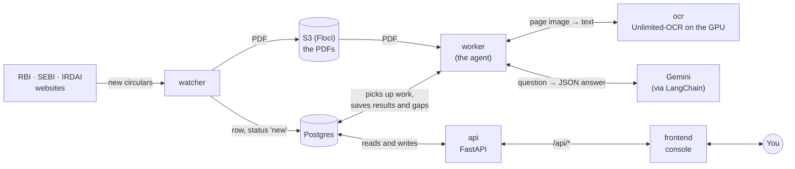

There are two kinds of service:

- **Background services** work on their own, around the clock:
  - the **watcher** finds circulars;
  - the **worker** reads them and opens gaps;
  - **ocr** is the model the worker uses to read the PDFs.
- **Services for people:** the **api** and the **frontend** (the console) show you
  everything and let you manage policies and gaps.

The services never call each other directly, except the worker calling `ocr` and Gemini.
They hand work over through **Postgres**: the watcher writes a row with status `new`, and
the worker picks up any row with that status. That keeps each service simple, and means any
of them can be restarted at any time.

---

## 3. What runs where

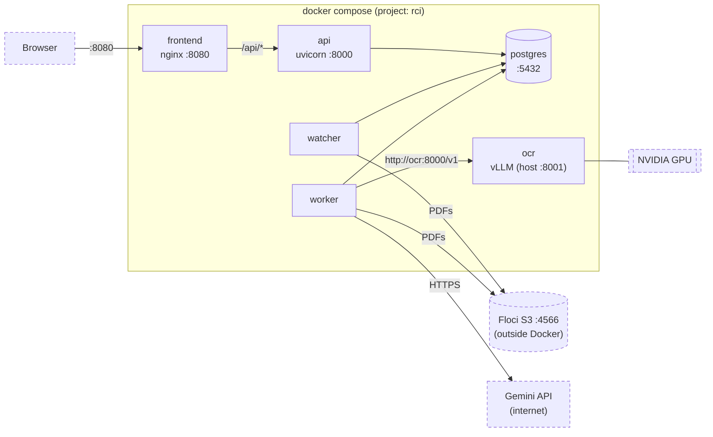

| Service | Folder | Runs | Port on your machine |
|---|---|---|---|
| `watcher` | `backend/watcher` | `python main.py`, one round every 60 minutes | none |
| `ocr` | `backend/ocr` | vLLM serving `baidu/Unlimited-OCR` on the GPU | 8001 |
| `worker` | `backend/worker` | `python main.py`, one round every 60 seconds | none |
| `api` | `backend/api` | `uvicorn main:app` | 8000 (docs at `/docs`) |
| `frontend` | `frontend` | nginx serving static files | 8080 |
| `postgres` | none (official image) | the database | 5432 |

Two things live outside Docker:

- **Floci**, a local AWS emulator used for S3, where the PDFs are kept.
- **Gemini**, Google's API, which the worker reaches over the internet.

The database tables are defined once, in `backend/common`, and installed into the watcher,
worker and api. Each of those has its own `pyproject.toml` and virtualenv.

---

## 4. The life of one circular

This is the whole journey of one circular, from the regulator's website to a ticket on
someone's desk.

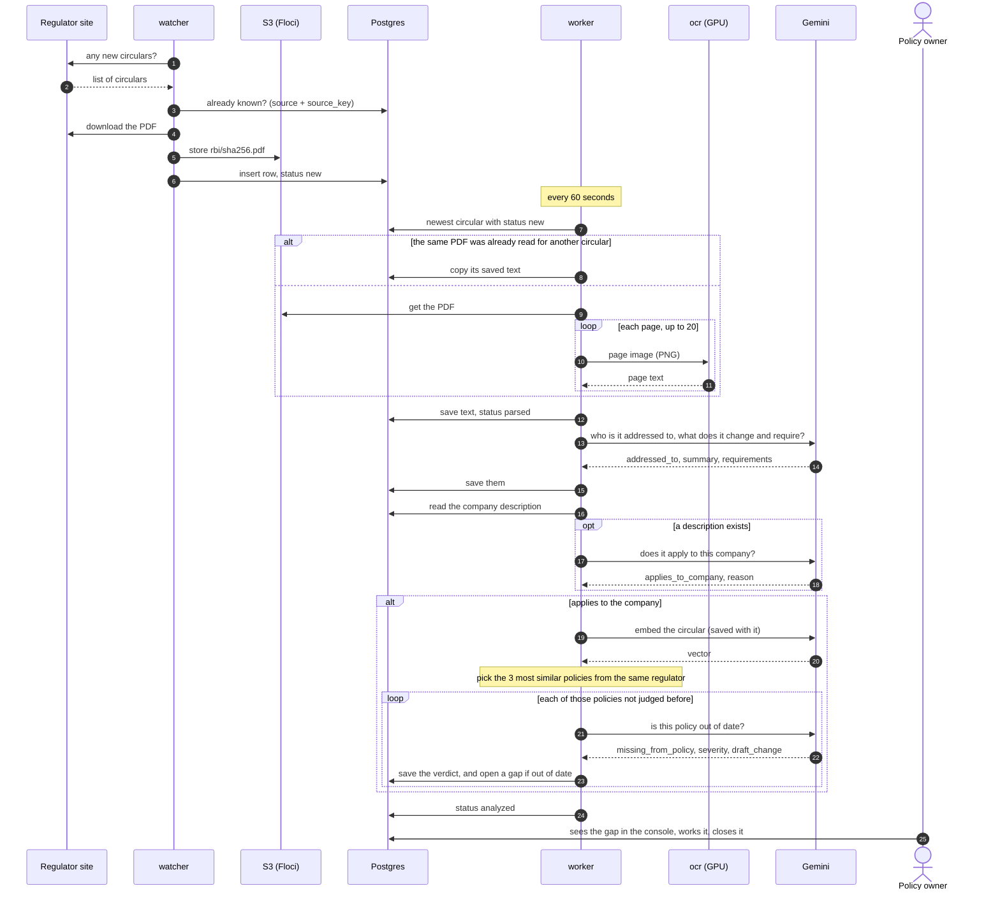

A circular's **status** tells you where it is in that journey:

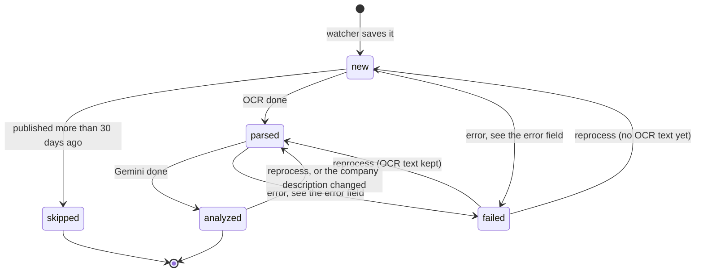

- **`new`**: saved by the watcher, waiting for the worker.
- **`parsed`**: OCR is done and the text is saved. Everything after this reads the saved
  text, so OCR never runs twice for a circular, whatever happens next.
- **`analyzed`**: finished. The circular now has its addressee, a summary, its
  requirements, `applicable` (true, false, or empty if no company description exists yet)
  with the reason, and any gaps it opened.
- **`failed`**: something went wrong that retrying didn't fix. The `error` field says
  what, and **Reprocess** in the console queues it again.
- **`skipped`**: older than `LOOKBACK_DAYS` (30) when the worker first saw it. That stops a
  first start from working through years of old circulars.

---

## 5. Step 1: the watcher finds new circulars

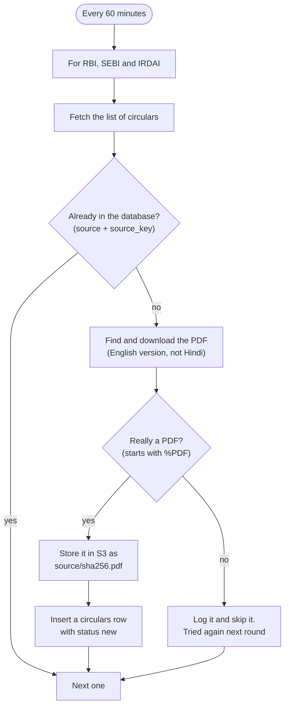

Where each regulator's circulars come from:

| Source | How the watcher reads it | Stable ID (`source_key`) |
|---|---|---|
| RBI | the RSS feed `notifications_rss.xml` | `?Id=` in the link |
| SEBI | three listing pages: circulars, master circulars and regulations (the RSS feed misses many circulars) | the page's path |
| IRDAI | the circulars table, where each row links its own PDF | `?documentId=` in the link |

Things worth knowing:

- **Politeness.** Every request waits 1.5 seconds first, and retries up to 3 times on a
  network error, a 429 or a 5xx.
- **Nothing half-saved.** The row is inserted only after the PDF is safely in S3, so a
  failure simply means "try again next round".
- **The PDF's hash is its name** (`rbi/<sha256>.pdf`), so the same file is never stored
  twice.

---

## 6. Step 2: OCR turns the PDF into text

The worker reads each PDF with **Baidu Unlimited-OCR**, a vision model that sees the page as
an image. It handles scanned pages, tables and Hindi, not just a PDF's text layer.

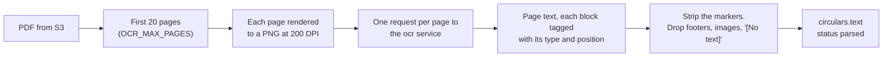

- The model tags each block of text with its type and position on the page, like
  `<|det|>text [117, 118, 297, 134]<|/det|>RBI/2026-2027/270`. `ocr.py` strips those tags
  and drops page footers (the boilerplate "RBI never sends mails…"), images and empty blocks.
- The request uses the model's own recipe: the prompt `<image>document parsing.`, plus a
  no-repeat n-gram setting that stops it looping on tables.
- **Why only 20 pages?** Long master circulars state their changes up front. The cap keeps
  a 300-page regulation from tying up the GPU for an hour.
- **Why 200 DPI?** At 200 DPI an A4 page is cut into about 6 tiles. At 300 DPI it's 24,
  which is too much for an 8 GB GPU. `backend/ocr/README.md` explains the vLLM flags that
  make the model fit.
- **Once per PDF.** OCR is the slow step (tens of seconds a page on a laptop GPU), so its
  output is kept in `circulars.text` and everything else reads that. When a regulator lists
  the same PDF under a second circular, the worker spots the identical file (same SHA-256)
  and copies the saved text instead of reading it again.
- **No page read twice.** If page 15 of 20 times out, the retry starts at page 15: pages
  already read are kept in memory until the document is done. Blank pages are skipped, and
  all pages go over one reused connection.

---

## 7. Step 3: the worker decides what the circular means for us

This is where the thinking happens. The worker asks Gemini three kinds of question. Each
answer comes back as **JSON matching a Pydantic model** (LangChain's
`with_structured_output`), never as free text the code would have to parse.

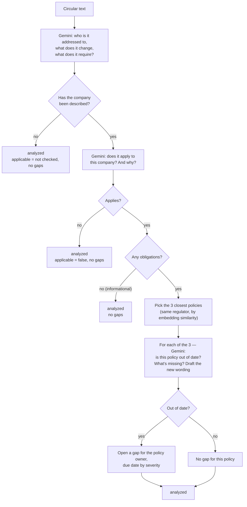

Every verdict from the last step is saved in `policy_checks`, one row per circular and
policy version. A pair that has a row, or already has a gap, is never sent to Gemini again,
so a circular and policy pair never get two tickets and never cost two calls.

### The three questions

| # | Question | What Gemini gets | What comes back |
|---|---|---|---|
| 1 | What does it say? (every circular) | Up to 100,000 characters of the text | `addressed_to`, `summary`, `requirements[]` (with numbers and deadlines kept as written) |
| 2 | Does it apply to us? (only once the company is described) | Your company description, the addressee, and the first 4,000 characters | `applies_to_company`, `reason` |
| 3 | Is this policy out of date? | Your company description, the circular's addressee, summary and requirements, the policy's text and its controls | `missing_from_policy`, `impacted`, `severity`, `affected_controls[]`, `draft_change` |

The company description is **yours**. It's written on the console's **Company** page and
stored in the `company` table, with no built-in default. Saving a changed description clears
every circular's "does it apply?" answer and sends the analysed ones back to `parsed`. The
worker then asks question 2 again, and only question 2: the OCR text, the summaries and the
policy verdicts don't depend on the description, so they're kept.

### Work that's done once, and kept

Everything slow or paid for is saved the first time and reused after that:

| Work | Saved in | Done again only when |
|---|---|---|
| OCR of the PDF (the slowest step) | `circulars.text` | never. A second circular with the same PDF copies it |
| Question 1: what does it say? | `circulars.addressed_to`, `summary`, `requirements` | you press **Reprocess** |
| Question 2: does it apply to us? | `circulars.applicable`, `applies_reason` | you change the company description, or press **Reprocess** |
| The circular's embedding | `circulars.embedding` | its summary changes, or you change the embedding model |
| A policy's embeddings | `policies.embeddings` | its title or text is edited, or you change the embedding model |
| Question 3: is this policy out of date? | `policy_checks` (and a gap if it is) | the policy's text changes (a new version), or **Reprocess** re-asks the "up to date" ones |

So a restart, an outage halfway through, a new policy or a changed company description
never repeats a call that already succeeded. A quiet round, with nothing new anywhere,
makes no OCR or Gemini call at all.

### How the closest policies are found

Reading every policy for every circular would be slow and expensive, so the worker narrows
the list first with **embeddings**. An embedding turns a text into a list of 768 numbers,
where similar meanings give similar numbers.

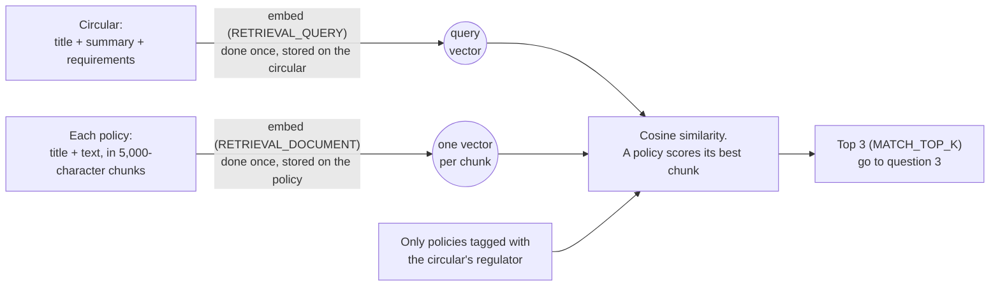

The embedding model reads about 2,000 tokens at most, so a long policy is split into
5,000-character chunks and each chunk is embedded. A policy's score is its best chunk's, so
a clause on page 12 of a long KYC policy still makes it a match.

### What a gap contains

| Field | Where it comes from |
|---|---|
| `title` | `Update POL-KYC for RBI circular: <circular title>` |
| `impact` | what the policy is missing (Gemini, question 3) |
| `draft_change` | the proposed wording (Gemini, question 3) |
| `affected_controls` | the policy's controls Gemini named. Codes that don't exist are dropped |
| `severity` | `high` (a breach or penalty), `medium` (a process or document must change) or `low` (wording only) |
| `owner` | the policy's owner |
| `due_date` | today plus 7 days (high), 30 (medium) or 60 (low) |
| `policy_version` | the version of the policy that was found out of date |

Each gap starts its history with one event: `agent` `opened` it.

---

## 8. When you add or edit a policy

Circulars aren't the only trigger. When a policy is added, or its text, title or regulators
are edited, the worker checks it against the **recent** circulars too. So a library loaded
today still finds the gaps left by last week's circulars.

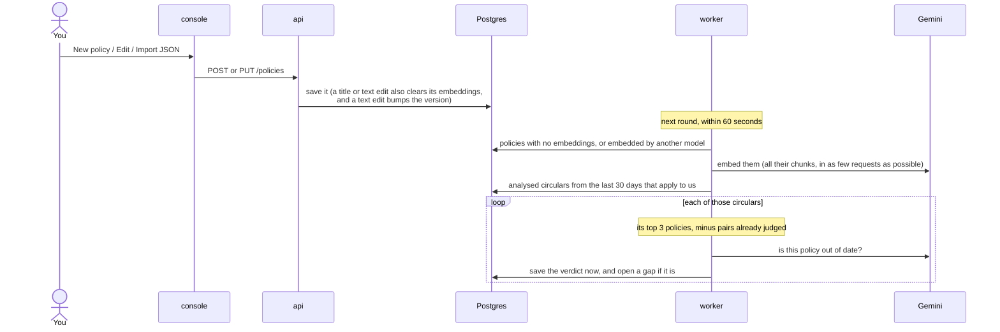

- **Each verdict is saved as soon as Gemini gives it.** If Gemini fails halfway, the next
  round carries on from the next unjudged pair; nothing is asked twice.
- **Nothing changed, nothing done.** The worker notes what the company, the library and the
  recent circulars looked like when it last finished, and skips this step while they're the
  same.
- **Only what matters is redone.** Changing a policy's owner re-does nothing. Changing its
  regulators checks it against that regulator's circulars. Editing its text re-embeds it
  and, being a new version, checks it again.
- An edit never opens a second gap for the same circular and policy.
- Changing `GEMINI_EMBEDDING_MODEL_NAME` re-embeds every policy and circular automatically.
  Vectors from two different models can't be compared, so the worker tracks which model made
  each one.

---

## 9. The data

Seven tables, all defined in `backend/common/common/models.py`:

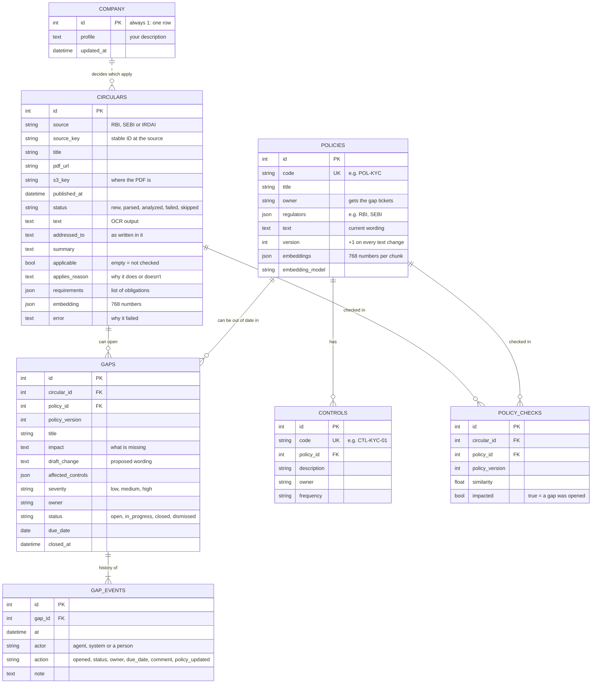

Rules the database enforces:

- A circular is unique by `(source, source_key)`, so the watcher can't save it twice.
- A gap is unique by `(circular_id, policy_id)`: one ticket per circular and policy.
- A check is unique by `(circular_id, policy_id, policy_version)`: Gemini judges each pair
  once per version of the policy.
- `gap_events` rows are only ever added, never edited or deleted. That's the audit trail.

Tables are created at startup by every service (`init_db`), and a column added to a model
later is added to the existing table (nothing is ever dropped). A Postgres advisory lock
stops two services that start together from both changing the schema.

---

## 10. Tracking a gap until it's closed

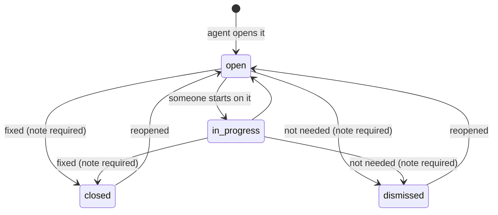

- **Every change is an event.** Changing the status, owner or due date, or adding a comment,
  adds a `gap_events` row recording who did it (the name you enter under "Signed in as"),
  when, and why.
- **Closing or dismissing needs a note.** The API refuses without one, so the history always
  says why a gap ended.
- **Editing the policy is noted on its gaps.** When a policy's text changes, each of its open
  gaps gets a `policy_updated` event ("POL-KYC updated to v2"). The owner can then close the
  gap against the new version, and the console shows "found in v1, now v2".
- **Overdue** means open or in progress with a due date before today. The overview counts
  these, and the Gaps page can filter to them.

An example history, as the console shows it:

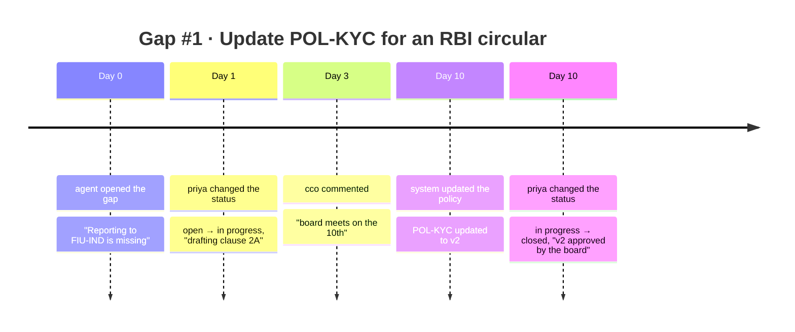

---

## 11. The API and the console

The console is plain HTML and JavaScript. It talks to the API through nginx, so the browser
only ever sees one address.

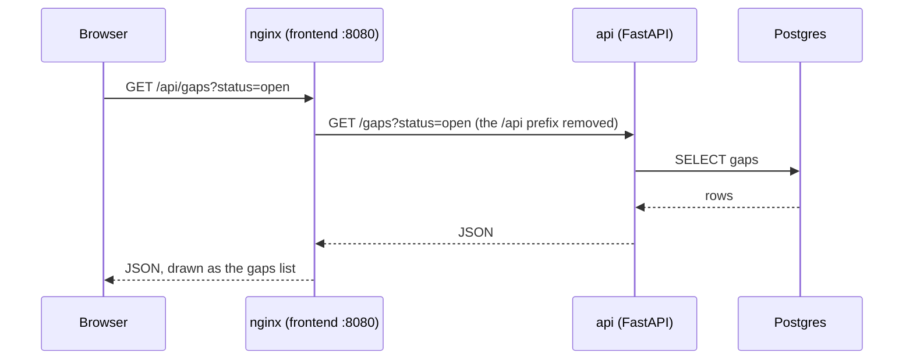

| Area | Endpoints |
|---|---|
| Health and counts | `GET /health` · `GET /stats` |
| Company | `GET /company` · `PUT /company` (a change sends analysed circulars back to be judged again) |
| Circulars | `GET /circulars` · `GET /circulars/{id}` (with its gaps and the policies it was checked against) · `GET /circulars/{id}/text` · `POST /circulars/{id}/reprocess` |
| Policies | `GET /policies` · `POST /policies` · `GET /policies/{id}` · `PUT /policies/{id}` · `POST /policies/{id}/controls` |
| Gaps | `GET /gaps` (filter by status, owner, policy, overdue) · `GET /gaps/{id}` (with its circular, policy and history) · `PATCH /gaps/{id}` · `POST /gaps/{id}/comments` |

The API never calls Gemini or OCR. It only reads and writes Postgres. Anything that needs
the agent, like reprocessing a circular or checking a new policy, works by changing the
data (a status, or a cleared embedding), which the worker notices on its next round.

Lists never read the heavy columns (the OCR text, the embeddings) from the database, since
the console never shows them; the OCR text has its own endpoint.

The interactive API docs are at http://localhost:8000/docs.

---

## 12. When things go wrong

The worker never loses work. The question it asks about every error is: is the circular to
blame, or the service?

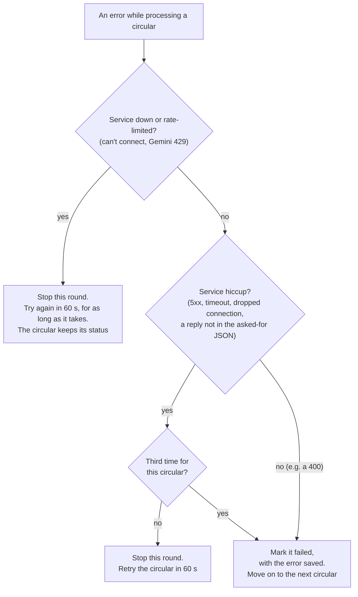

| What happened | What you see | What to do |
|---|---|---|
| The OCR model is still loading (first start downloads 6.7 GB) | the worker logs "OCR or Gemini unavailable; retrying in 60s" | nothing: it carries on by itself |
| Gemini's quota ran out (429) | the same message | wait, or raise your quota |
| Gemini or OCR returned a 5xx a few times | the circular shows `failed`, with the error | **Reprocess** it in the console |
| A wrong API key or model name | the worker stops at startup: "Gemini rejected the configuration" | fix `.env`, then restart the worker |
| A PDF link is broken | the watcher logs "failed" for that one | nothing: it's tried again next round |

LangChain first retries Gemini's rate limits and server errors itself (3 times). Only after
that does the worker's own retry take over. LangChain wraps Gemini's errors in its own
classes, so the worker reads the HTTP code from the original error underneath
(`gemini_status` in `backend/worker/failures.py`, which holds all these rules).

Checking new policies against recent circulars follows the same rules. An error there that
isn't a service problem is logged, and that circular is left alone until the worker restarts,
so the worker keeps processing everything else instead of stopping.

---

## 13. Where settings come from

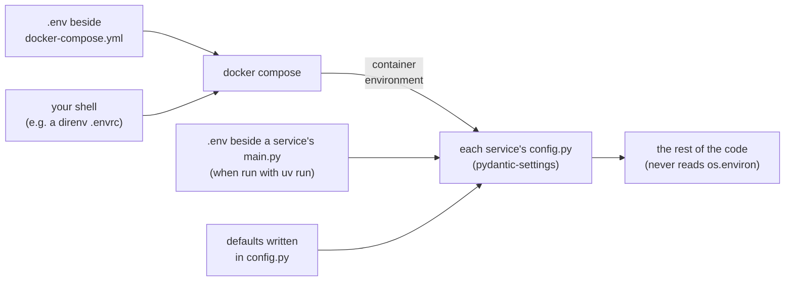

- Only **`GEMINI_API_KEY`** is required.
- Nothing about **your company** is a setting. The company description and the policies are
  data, entered in the console, so the agent never assumes a company you didn't describe. Every other setting has a default in the service's
  `config.py`.
- Compose passes settings you haven't set as empty strings, and `config.py` ignores empty
  values (`env_ignore_empty`), so the default in `config.py` always applies.
- **`S3_ENDPOINT_URL` is fixed in `docker-compose.yml`** on purpose. Your shell may say
  `localhost:4566`, which is right on the host but would point a container at itself.

Settings you're most likely to change:

| Setting | Default | What it changes |
|---|---|---|
| `GEMINI_MODEL_NAME` | `gemini-3.5-flash` | the model that answers the three questions |
| `GEMINI_EMBEDDING_MODEL_NAME` | `gemini-embedding-001` | the model used for policy matching (changing it re-embeds every policy and circular) |
| `LOOKBACK_DAYS` | 30 | older circulars are skipped; new policies are checked against this window |
| `MATCH_TOP_K` | 3 | how many policies Gemini checks per circular |
| `OCR_MAX_PAGES` | 20 | how many pages of each PDF are read |
| `WATCH_INTERVAL_MINUTES` | 60 | how often the regulator sites are checked |

`.env.example` in the repo root lists every setting.

---

## 14. The code, file by file

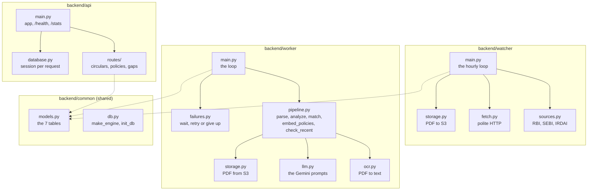

| Want to change… | Look in |
|---|---|
| which sites are watched, or how they're scraped | `backend/watcher/sources.py` |
| what Gemini is asked, or the shape of its answers | `backend/worker/llm.py` (the prompts and Pydantic models sit side by side) |
| the order of the steps, how policies are picked, the due dates | `backend/worker/pipeline.py` |
| what's retried and what's marked failed | `backend/worker/failures.py` (the rules) and `main.py` (the loop) |
| how PDFs are turned into images, or how OCR output is cleaned | `backend/worker/ocr.py` |
| the vLLM flags for the OCR model | `backend/ocr/Dockerfile` |
| an endpoint | `backend/api/routes/` (`company.py`, `circulars.py`, `policies.py`, `gaps.py`) |
| a table or a column | `backend/common/common/models.py` (then rebuild all three services) |
| the console | `frontend/js/views/` (one module per page) and `frontend/css/` (see `frontend/README.md`) |

---

## 15. How do I…?

**…start everything?**

```bash
cp .env.example .env                 # set GEMINI_API_KEY
docker compose up -d --build
docker compose logs -f worker        # watch the agent think
```

Then open http://localhost:8080.

**…tell the agent who my company is?** In the console, open **Company** and write a few
sentences. Say what kind of entity it is, list every licence and business with its regulator,
and say what it's *not* when that's easy to confuse ("not a small finance bank"). Within a
few minutes every analysed circular has been judged against it, each with a one-sentence
reason.

**…load my company's policies?** In the console, go to **Policies**, then **Import JSON**
(the file format is shown on that page and in `frontend/README.md`), or add them one at a
time with **New policy**. Within a minute the worker embeds them and checks them against the
last 30 days of circulars.

**…see why a circular has no gaps?** Open it in the console:

- **"Not checked for us"**: nobody has described the company yet. Do that on the
  **Company** page.
- **"Not for us"**: Gemini decided it's addressed to other kinds of entity. The reason is
  shown beside it. If it's wrong, make your company description more precise.
- **No obligations**: it's informational, so there's nothing to check.
- **"No policy in the library was found out of date"**: the closest policies already comply,
  or you don't have a policy on that subject yet.

**…run a circular through the agent again?** Press **Reprocess** on the circular, or
`curl -X POST localhost:8000/circulars/<id>/reprocess`. Gemini reads the saved OCR text
again (no new OCR), judges it and re-checks the policies it had found up to date. Gaps
already opened are kept and never duplicated.

**…see which policies a circular was checked against?** Its page in the console has a
**Checked against your policies** list: each policy, its similarity, and Gemini's verdict.

**…see what Gemini decided, step by step?**

```bash
docker compose logs worker | grep pipeline
# #98 vs POL-KYC v1 (similarity 0.74): GAP
# #98 analyzed: addressed to 'All Commercial Banks', applies to us: True, gaps opened: ['POL-KYC']
```

**…look at the raw data?**

```bash
curl localhost:8000/stats
curl localhost:8000/circulars/98 | python3 -m json.tool
curl localhost:8000/circulars/98/text            # the OCR output
docker compose exec postgres psql -U rci -d rci -c "select id, status, applicable from circulars order by id desc limit 10"
```

**…run one service on my machine instead of in Docker?**

```bash
docker compose up -d postgres ocr    # what it depends on
cd backend/worker && cp .env.example .env && uv sync
uv run python main.py --once         # one pass through the queue, then exit
```

---

## 16. Glossary

| Term | Meaning |
|---|---|
| **Circular** | A notice from a regulator (RBI, SEBI or IRDAI) that creates or changes rules |
| **Policy** | One of the company's own documents, e.g. its KYC policy. It has an owner, the regulators it answers to, and a version |
| **Control** | A regular check that puts a policy into practice, e.g. "screen customers against sanctions lists daily" |
| **Gap** | A ticket saying "this policy is out of date because of this circular", with a draft of the fix |
| **Gap event** | One line of a gap's history: opened, status changed, reassigned, commented, policy updated |
| **Company description** | A few sentences you write on the console's Company page saying what kind of entity the company is. There's no default |
| **Applicable** | Whether a circular applies to the company you described. Empty means "not checked", because no description exists yet |
| **Requirements** | The concrete obligations Gemini found in a circular |
| **OCR** | Optical character recognition: reading text from an image of a page |
| **Embedding** | A list of numbers that represents a text's meaning, so similar texts can be found by arithmetic |
| **Structured output** | Asking the model for JSON that matches a schema (a Pydantic model), instead of free text |
| **Lookback** | The window (`LOOKBACK_DAYS`, 30) of recent circulars the agent cares about |
