# How the backend works

       

This guide explains the Regulatory Circular Impact Agent from the outside in. It starts with
one picture of the whole system, follows a single circular through it, and then covers each
service, the data, and what happens when something breaks. Every diagram is Mermaid, so it
renders on GitHub and in VS Code's Markdown preview.

**Reading the diagrams.** Each colour means the same thing in every diagram:

        

**Contents**

1. [The idea in one minute](#1-the-idea-in-one-minute)
2. [The big picture](#2-the-big-picture)
3. [What runs where](#3-what-runs-where)
4. [The worker in plain words](#4-the-worker-in-plain-words)
5. [The life of one circular](#5-the-life-of-one-circular)
6. [Step 1: the watcher finds new circulars](#6-step-1-the-watcher-finds-new-circulars)
7. [Step 2: OCR turns the PDF into text](#7-step-2-ocr-turns-the-pdf-into-text)
8. [Step 3: the worker decides what the circular means for us](#8-step-3-the-worker-decides-what-the-circular-means-for-us)
9. [When you add or edit a policy](#9-when-you-add-or-edit-a-policy)
10. [The data](#10-the-data)
11. [Tracking a gap until it's closed](#11-tracking-a-gap-until-its-closed)
12. [The API and the console](#12-the-api-and-the-console)
13. [When things go wrong](#13-when-things-go-wrong)
14. [Where settings come from](#14-where-settings-come-from)
15. [The code, file by file](#15-the-code-file-by-file)
16. [How do I…?](#16-how-do-i)
17. [Glossary](#17-glossary)

---

## 1. The idea in one minute

Indian regulators (**RBI**, **SEBI** and **IRDAI**) publish new circulars every week. Each
one can make a company's internal policy out of date.

The agent does four things by itself:

1. **Watches** the three regulators' websites and downloads every new circular (a PDF).
2. **Reads** it: OCR turns the PDF into text.
3. **Decides** whether the circular applies to the company and, if it does, which internal
   policies it makes out of date.
4. **Opens a gap ticket** for each such policy, addressed to the policy's owner, with a
   drafted change to the policy's wording.

Several companies can use one installation. Each one **signs up** in the console (the
company and its first user, who can then add teammates), and gives the agent two things that
only it can give:

- **a description of your company** (what kind of entity it is, its licences and businesses),
  so it can tell which circulars apply to you;
- **your policies and their controls**, so it has something to compare each circular with.

It ships with neither. Until you add them it still reads and summarises every circular
(once, for every company), but it doesn't say which ones apply to you, and it opens no gaps.
Each company only ever sees its own description, policies, verdicts and gaps.

People then work the gaps (in progress, closed or dismissed) in the console. Every change is
kept in the gap's history.

> 💡 **Why it matters.** The company's own policy library, and the history of its gaps, are
> what make this more than a chatbot. The agent compares each circular against *your* policies and keeps
> *your* audit trail.

---

## 2. The big picture

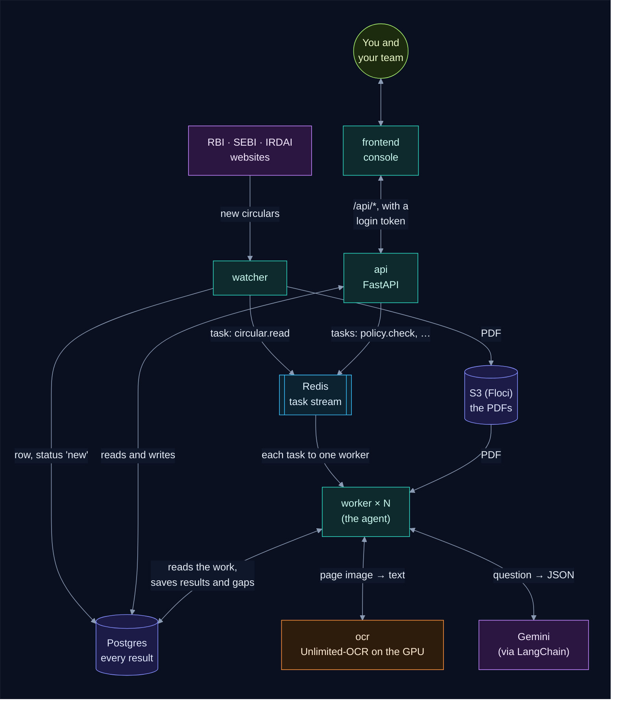

There are two kinds of service:

- **Background services** work on their own, around the clock:
  - the **watcher** finds circulars;
  - the **worker** reads them and opens gaps;
  - **ocr** is the model the worker uses to read the PDFs.
- **Services for people:** the **api** and the **frontend** (the console) show you
  everything and let you manage policies and gaps.

The services never call each other directly, except the worker calling `ocr` and Gemini.
They hand work over as **tasks** on a **Redis stream**: the watcher saves a new circular in
Postgres and queues `circular.read`; the api saves your change and queues `policy.check`,
`company.refresh` or `circular.assess`. A worker picks each task up the moment it's queued.
**Postgres stays the source of truth**: a task only says what to look at, so a task that's
lost is found again, and one delivered twice does nothing twice. Any service can be
restarted at any time.

---

## 3. What runs where

```mermaid
%%{init: {"theme": "base", "flowchart": {"diagramPadding": 0}, "themeVariables": {"darkMode": true, "primaryColor": "#16213a", "primaryTextColor": "#e6edf7", "primaryBorderColor": "#475a7a", "lineColor": "#8b9bb4", "secondaryColor": "#1b2436", "tertiaryColor": "#101a2e", "edgeLabelBackground": "#0f172a", "textColor": "#e2e8f0", "clusterBkg": "#0f1728", "clusterBorder": "#2b3a55", "titleColor": "#c4b5fd", "nodeTextColor": "#e6edf7"}}}%%
flowchart LR
    subgraph canvas[" "]
        direction LR
        B["Browser"] -->|":8080"| FE
        subgraph compose["docker compose (rci)"]
            FE["frontend<br/>nginx :8080"] -->|"/api/*"| API["api<br/>uvicorn :8000"]
            API --> PG[("postgres<br/>:5432")]
            API --> RD[["redis<br/>:6379"]]
            WA["watcher"] --> PG
            WA --> RD
            RD --> WK["worker × WORKERS"]
            WK --> PG
            WK -->|"http://ocr:8000/v1"| OC["ocr<br/>vLLM (host :8001)"]
        end
        WA -->|PDFs| FL[("Floci S3 :4566<br/>(outside Docker)")]
        WK -->|PDFs| FL
        WK -->|HTTPS| GEM["Gemini API<br/>(internet)"]
        OC --- GPU[["NVIDIA GPU"]]
    end
    classDef svc fill:#0e2a2c,stroke:#2dd4bf,color:#ccfbf1
    classDef data fill:#1c1a47,stroke:#818cf8,color:#e0e7ff
    classDef ext fill:#2a1640,stroke:#c084fc,color:#f3e8ff
    classDef gpu fill:#2d1b0c,stroke:#fb923c,color:#ffedd5
    classDef ask fill:#2a2410,stroke:#fbbf24,color:#fef3c7
    classDef ok fill:#0b2a1c,stroke:#34d399,color:#d1fae5
    classDef bad fill:#2e0f17,stroke:#fb7185,color:#ffe4e6
    classDef start fill:#1c2a0e,stroke:#a7ef6f,color:#ecfccb
    classDef muted fill:#1a2130,stroke:#64748b,color:#cbd5e1
    classDef queue fill:#0c2231,stroke:#38bdf8,color:#e0f2fe
    class FE,API,WA,WK svc
    class PG,FL data
    class RD queue
    class GEM ext
    class OC,GPU gpu
    class B start
    classDef external stroke-dasharray: 5 4
    class FL,GEM,GPU external
    style compose fill:#0c1a24,stroke:#2dd4bf
    style canvas fill:#0b1020,stroke:#1e293b,color:#0b1020
```

| Service | Folder | Runs | Port on your machine |
|---|---|---|---|
| `watcher` | `backend/watcher` | `python main.py`, one round every 60 minutes; queues a task per new circular. Always one replica | none |
| `ocr` | `backend/ocr` | vLLM serving `baidu/Unlimited-OCR` on the GPU | 8001 |
| `worker` | `backend/worker` | `python main.py`: waits for tasks on the stream and does them ([how it works](#4-the-worker-in-plain-words)). `WORKERS` replicas | none |
| `api` | `backend/api` | `uvicorn main:app` | 8000 (docs at `/docs`) |
| `frontend` | `frontend` | nginx serving static files | 8080 |
| `postgres` | none (official image) | the database: every result | 5432 |
| `redis` | none (official image) | the task stream (`rci:tasks`), kept on disk (`--appendonly yes`) | 6379 |

Two things live outside Docker:

- **Floci**, a local AWS emulator used for S3, where the PDFs are kept.
- **Gemini**, Google's API, which the worker reaches over the internet.

The database tables are defined once, in `backend/common`, and installed into the watcher,
worker and api. Each of those has its own `pyproject.toml` and virtualenv.

---

## 4. The worker in plain words

The worker is the agent: a Python program ([`backend/worker/main.py`](backend/worker/main.py))
that runs all the time, as many copies as you like. Picture a ticket machine: every piece of
work arrives as a ticket (a **task**) in one queue, and each clerk takes the next ticket as
soon as they're free. When the queue is empty, the clerks simply wait: **no OCR, no Gemini,
no database work** (apart from one quick look for missing work every 15 minutes).

> 📖 **Two stories, step by step.** [how_the_worker_works.md](how_the_worker_works.md) follows
> a new circular and a new policy through the worker, and shows exactly what goes through the
> queue and what changes in the database at each step. For developers,
> [backend/worker/INTERNALS.md](backend/worker/INTERNALS.md) has every Redis command, SQL
> statement and commit.

### What lands in the queue

| Task | Who queues it | What the worker does | OCR and Gemini used |
|---|---|---|---|
| `circular.read` | the watcher, for each new circular; the api, when you **Reprocess** a failed one | reads the PDF, summarises it, embeds it: **once, for every company** | OCR once, 1 question, 1 embedding |
| `circular.assess` | the worker, one per company after reading a circular; the api, when you **Reprocess** | decides whether it applies to that company, checks that company's closest policies, opens gaps | 1 question, plus up to 3 policy checks |
| `policy.check` | the api, when you add or edit a policy | embeds it, checks it against your recent circulars that apply | 1 embedding, plus 1 check per circular where it's among the 3 closest |
| `company.refresh` | the api, at sign-up and when you change your description | queues a `circular.assess` for each of your recent circulars | none itself |

### Where tasks come from

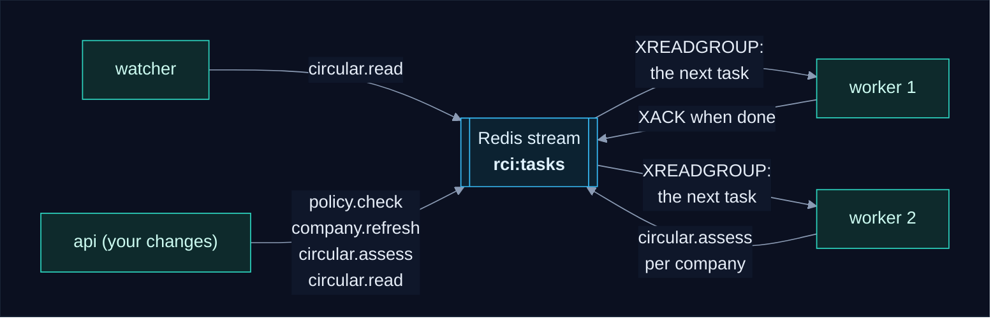

The queue is a **Redis stream**, read by the workers as one **consumer group**: each task
goes to exactly one worker. A task is only acknowledged when it's finished, so a worker that
dies mid-task doesn't lose it: it's picked up again. And every 15 minutes one worker checks
Postgres for unfinished work whose task went missing, and queues it again.

### One circular, from start to finish

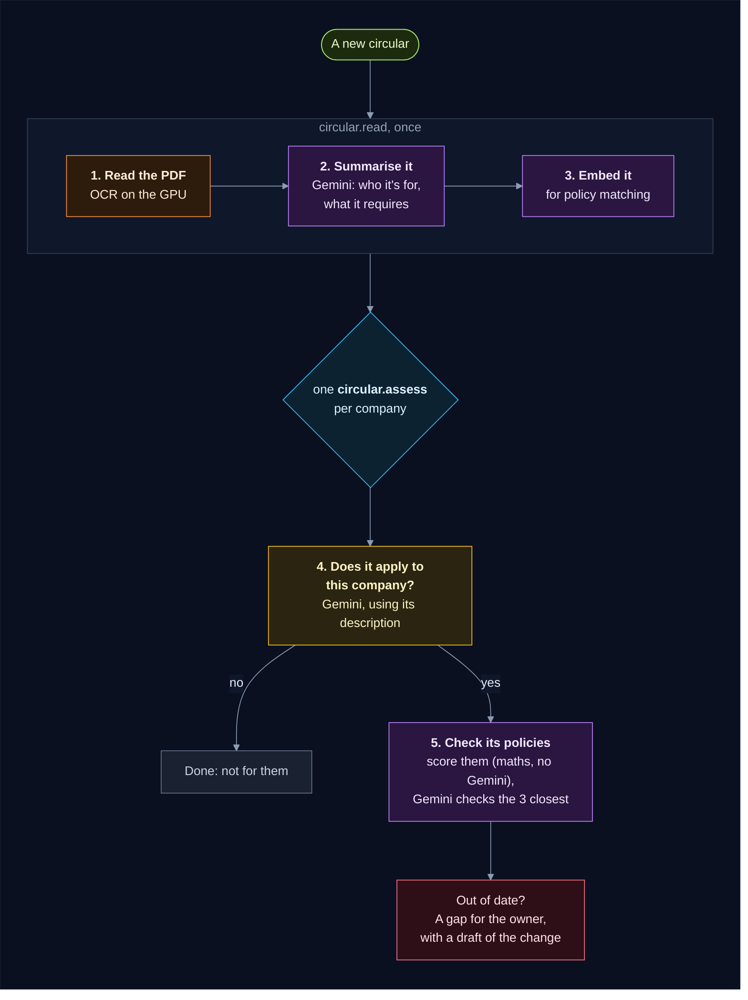

Reading a circular (steps 1 to 3) doesn't depend on any company, so it's done **once**, however
many companies use the app. Steps 4 and 5 are done **for each company**, with its own
description and its own policies, at the same time when several workers run. Each step saves
its answer before the next one starts, so if something breaks halfway, the retry carries on
from the last saved step. Sections 5 to 8 go through each step in detail.

### How it picks which policies to check

Asking Gemini about every policy for every circular would be slow and costly. So the worker
first gives each of the company's policies a quick **similarity score** against the circular,
using arithmetic on saved embeddings with no Gemini call. Only the **3 highest scores** go to
Gemini (`MATCH_TOP_K`). Only policies tagged with the circular's regulator are scored.

For example, an RBI circular about reporting suspicious accounts:

| Policy (all tagged RBI) | Score | Sent to Gemini? |
|---|---|---|
| POL-KYC, Know Your Customer and anti-money laundering | 0.82 | ✅ top 3 |
| POL-DRP | 0.58 | ✅ top 3 |
| POL-DLP, digital lending | 0.55 | ✅ top 3 |
| POL-IT, IT security | 0.31 | no |
| POL-HR, staff leave | 0.12 | no |

With 3 or fewer policies for a regulator, all of them are checked. The scores are shown on each
circular's page, under **Checked against your policies**.

### It never does the same work twice

Like a clerk who writes everything down, the worker saves every answer it pays for: the OCR
text, the summary, the embeddings, whether the circular applies to each company, and every
policy verdict. A restart, a crash, or the same task arriving twice never repeats a call that
already succeeded. The full list is in [Work that's done once, and kept](#work-thats-done-once-and-kept).

### When something breaks

- **OCR or Gemini is down, or Gemini's quota is used up:** the task waits a minute and is
  tried again, for as long as it takes. Nothing is lost.
- **A hiccup** (a timeout, a server error, an answer in the wrong shape): the task is retried
  up to 3 times.
- **Anything else:** the circular (or your company's assessment of it) is marked `failed` and
  the error is saved on it. Open it in the console to read why, then press **Reprocess**.
- **Redis is down:** your changes are still saved; the workers wait for Redis, and the
  reconciler queues whatever was missed.

Details: [When things go wrong](#13-when-things-go-wrong).

### Running several workers

One worker is plenty for a handful of circulars a day. To get through a backlog faster, run
more: set `WORKERS=3` in `.env`, or `docker compose up -d --scale worker=3`. They share the
work with no setup:

- **Each task goes to one worker.** The consumer group hands them out.
- **The same work is never queued twice.** Each task gets a small Redis key when it's
  queued, and a copy is dropped while that key exists (the watcher and the reconciler may
  both find the same circular). The worker deletes the key when the task is done.
- **No locks.** Nothing else needs coordinating. The OCR server takes one page at a time
  and queues the rest, so extra workers mainly speed up the Gemini steps and the
  companies' assessments.
- **A worker that dies** leaves its task unacknowledged. It's picked up again: at once if
  its container restarts, otherwise by another worker after 30 minutes.

How the queue works, with diagrams: [The task queue](how_the_worker_works.md#5-the-task-queue-redis-streams)
and [No duplicates](how_the_worker_works.md#7-no-duplicates-each-task-is-queued-once).

### Reading its log

`docker compose logs -f worker` shows what the workers are doing. Each line means:

| Log line | What happened |
|---|---|
| `worker 4b2f…-1: using gemini-…, waiting for tasks` | the worker started, and Gemini accepted the key and model names |
| `#98 parsed: 12408 chars` | OCR is done and the text is saved |
| `#98 read: addressed to '…'` | the summary is saved; each company's assessment is queued |
| `#98 vs POL-KYC v1 (0.74): GAP` | Gemini checked one policy (similarity 0.74): out of date, and a gap was opened (or `up to date`) |
| `#98 for company 1: applies: True, gaps opened: ['POL-KYC']` | the circular is done for company 1 |
| `embedded POL-AML (1 chunks) with gemini-embedding-001` | a new or edited policy was turned into an embedding |
| `POL-AML checked, gaps opened: none` | a saved policy was checked against the company's recent circulars (its page now says **Checked**) |
| `OCR or Gemini unavailable (…); retrying` | a service is down or rate-limited; the task waits and tries again |
| `reconciler: 3 unfinished tasks checked` | unfinished work was queued again, unless it was still queued |
| `… failed for good` | the circular or assessment was marked failed; the error is on its page |

A worker with nothing to do prints nothing.

### Common questions

**Does it call Gemini every minute?** No. There's no polling: a worker wakes up when a task
arrives, and only calls Gemini for real work: a new circular, a new or edited policy, a new
company description, or **Reprocess**. The one timer is the reconciler, which looks in
Postgres every 15 minutes for work whose task went missing; it calls no one itself.

**Do I need to restart it after adding a policy or changing the company?** No. Saving queues a
task, and a worker starts on it straight away.

**Why wasn't my policy checked against a circular?** See
[Why doesn't my new policy have a gap?](#why-doesnt-my-new-policy-have-a-gap).

**How do I make it faster?** Run more workers: `WORKERS=3` in `.env`. See
[Running several workers](#running-several-workers).

---

## 5. The life of one circular

This is the whole journey of one circular, from the regulator's website to a ticket on
someone's desk.

```mermaid
%%{init: {"theme": "base", "sequence": {"diagramMarginX": 0, "diagramMarginY": 0}, "themeVariables": {"darkMode": true, "primaryColor": "#16213a", "primaryTextColor": "#e6edf7", "primaryBorderColor": "#475a7a", "lineColor": "#8b9bb4", "secondaryColor": "#1b2436", "tertiaryColor": "#101a2e", "edgeLabelBackground": "#0f172a", "textColor": "#e2e8f0", "actorBkg": "#16213a", "actorBorder": "#5eead4", "actorTextColor": "#e6edf7", "actorLineColor": "#3b4a66", "signalColor": "#8b9bb4", "signalTextColor": "#e2e8f0", "noteBkgColor": "#2a2410", "noteBorderColor": "#fbbf24", "noteTextColor": "#fde68a", "labelBoxBkgColor": "#1e293b", "labelBoxBorderColor": "#64748b", "labelTextColor": "#e2e8f0", "loopTextColor": "#c4b5fd", "sequenceNumberColor": "#0b1020", "activationBkgColor": "#1e293b"}}}%%
sequenceDiagram
    autonumber
    box rgb(11, 16, 32)
        participant Site as Regulator site
        participant W as watcher
        participant Q as Redis
        participant DB as Postgres
        participant K as worker
        participant X as OCR + Gemini
        participant P as Policy owner
    end

    rect rgb(13, 20, 36)
        W->>DB: already known? (source + source_key)
        W->>Site: download the PDF, store it in S3
        W->>DB: insert row, status new
        W->>Q: circular.read 98
        Q-->>K: circular.read 98, at once
        K->>X: OCR each page (unless the same PDF was read before)
        K->>DB: save text (parsed)
        K->>X: who is it for, what does it require?
        K->>DB: save summary and embedding (read)
        K->>DB: a pending assessment for each company
        K->>Q: circular.assess, one per company
        Q-->>K: circular.assess (your company, 98)
        opt your company is described
            K->>X: does it apply to your company?
        end
        opt it applies, with obligations
            loop each of your 3 closest policies not judged before
                K->>X: is this policy out of date?
                K->>DB: save the verdict, and a gap if out of date
            end
        end
        K->>DB: your assessment done
        P->>DB: sees the gap in the console, works it, closes it
    end
```

A circular's **status** tells you where it is in that journey:

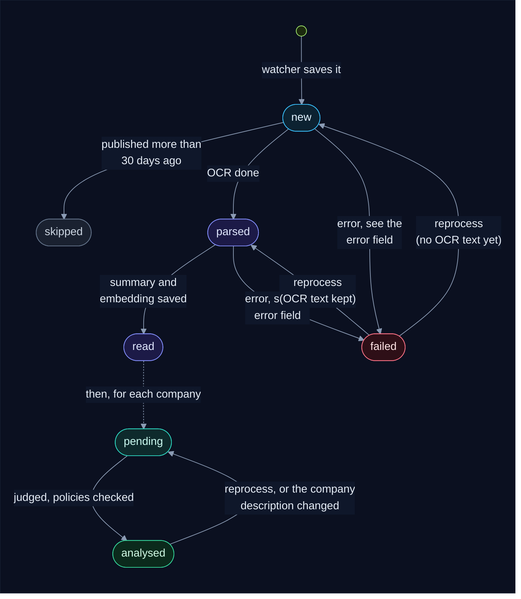

The circular's own status is shared by every company:

- **`new`**: saved by the watcher, its `circular.read` task queued.
- **`parsed`**: OCR is done and the text is saved. Everything after this reads the saved
  text, so OCR never runs twice for a circular, whatever happens next.
- **`read`**: summarised and embedded. What's left depends on the company.
- **`failed`**: something went wrong that retrying didn't fix. The `error` field says
  what, and **Reprocess** in the console queues it again.
- **`skipped`**: older than `LOOKBACK_DAYS` (30) when the worker first saw it. That stops a
  first start from working through years of old circulars.

Then each company has its own **assessment** of a read circular: `pending` until it's been
judged for that company, then done, with `applicable` (true, false, or empty if the company
isn't described yet), the reason, and any gaps. The console shows a read circular as
**In progress** while your assessment is pending and **Analysed** once it's done.

---

## 6. Step 1: the watcher finds new circulars

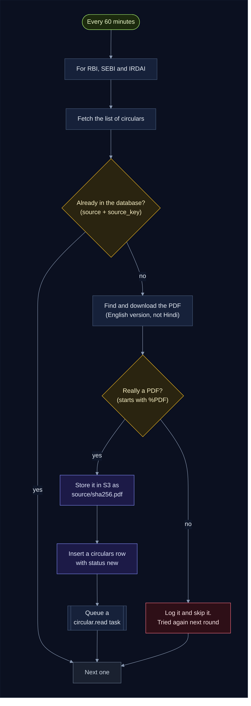

Where each regulator's circulars come from:

| Source | How the watcher reads it | Stable ID (`source_key`) |
|---|---|---|
| RBI | the RSS feed `notifications_rss.xml` | `?Id=` in the link |
| SEBI | three listing pages: circulars, master circulars and regulations (the RSS feed misses many circulars) | the page's path |
| IRDAI | the circulars table, where each row links its own PDF | `?documentId=` in the link |

Things worth knowing:

- **Politeness.** Every request waits 1.5 seconds first, and retries up to 3 times on a
  network error, a 429 or a 5xx.
- **Nothing half-saved.** The row is inserted only after the PDF is safely in S3, so a
  failure simply means "try again next round". The task is queued only after the row is
  saved, so a worker never gets a circular it can't find; if Redis is down at that moment,
  the worker's reconciler queues it later.
- **The PDF's hash is its name** (`rbi/<sha256>.pdf`), so the same file is never stored
  twice.

---

## 7. Step 2: OCR turns the PDF into text

The worker reads each PDF with **Baidu Unlimited-OCR**, a vision model that sees the page as
an image. It handles scanned pages, tables and Hindi, not just a PDF's text layer.

```mermaid
%%{init: {"theme": "base", "flowchart": {"diagramPadding": 0}, "themeVariables": {"darkMode": true, "primaryColor": "#16213a", "primaryTextColor": "#e6edf7", "primaryBorderColor": "#475a7a", "lineColor": "#8b9bb4", "secondaryColor": "#1b2436", "tertiaryColor": "#101a2e", "edgeLabelBackground": "#0f172a", "textColor": "#e2e8f0", "clusterBkg": "#0f1728", "clusterBorder": "#2b3a55", "titleColor": "#c4b5fd", "nodeTextColor": "#e6edf7"}}}%%
flowchart LR
    subgraph canvas[" "]
        direction LR
        pdf["PDF from S3"] --> pages["First 20 pages<br/>(OCR_MAX_PAGES)"]
        pages --> png["Each page rendered<br/>to a PNG at 200 DPI"]
        png --> request["One request per page to<br/>the ocr service"]
        request --> raw["Page text, each block tagged<br/>with its type and position"]
        raw --> clean["Strip the markers.<br/>Drop footers, images, '[No text]'"]
        clean --> saved["circulars.text<br/>status parsed"]
    end

    classDef svc fill:#0e2a2c,stroke:#2dd4bf,color:#ccfbf1
    classDef data fill:#1c1a47,stroke:#818cf8,color:#e0e7ff
    classDef ext fill:#2a1640,stroke:#c084fc,color:#f3e8ff
    classDef gpu fill:#2d1b0c,stroke:#fb923c,color:#ffedd5
    classDef ask fill:#2a2410,stroke:#fbbf24,color:#fef3c7
    classDef ok fill:#0b2a1c,stroke:#34d399,color:#d1fae5
    classDef bad fill:#2e0f17,stroke:#fb7185,color:#ffe4e6
    classDef start fill:#1c2a0e,stroke:#a7ef6f,color:#ecfccb
    classDef muted fill:#1a2130,stroke:#64748b,color:#cbd5e1
    class pdf data
    class request,raw gpu
    class saved ok
    style canvas fill:#0b1020,stroke:#1e293b,color:#0b1020
```

- The model tags each block of text with its type and position on the page, like
  `<|det|>text [117, 118, 297, 134]<|/det|>RBI/2026-2027/270`. `ocr.py` strips those tags
  and drops page footers (the boilerplate "RBI never sends mails…"), images and empty blocks.
- The request uses the model's own recipe: the prompt `<image>document parsing.`, plus a
  no-repeat n-gram setting that stops it looping on tables.
- **Why only 20 pages?** Long master circulars state their changes up front. The cap keeps
  a 300-page regulation from tying up the GPU for an hour.
- **Why 200 DPI?** At 200 DPI an A4 page is cut into about 6 tiles. At 300 DPI it's 24,
  which is too much for an 8 GB GPU. `backend/ocr/README.md` explains the vLLM flags that
  make the model fit.
- **Once per PDF.** OCR is the slow step (tens of seconds a page on a laptop GPU), so its
  output is kept in `circulars.text` and everything else reads that. When a regulator lists
  the same PDF under a second circular, the worker spots the identical file (same SHA-256)
  and copies the saved text instead of reading it again.
- **No page read twice.** If page 15 of 20 times out, the retry starts at page 15: pages
  already read are kept in memory until the document is done. Blank pages are skipped, and
  all pages go over one reused connection.

---

## 8. Step 3: the worker decides what the circular means for us

This is where the thinking happens. The worker asks Gemini three kinds of question. The
first is asked **once per circular**; the other two **once per company** (in its
`circular.assess` task). Each answer comes back as **JSON matching a Pydantic model**
(LangChain's `with_structured_output`), never as free text the code would have to parse.

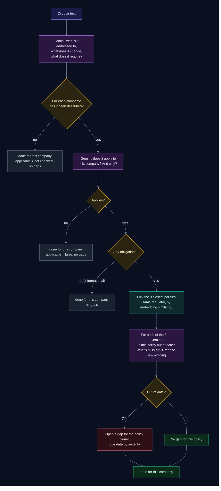

Every verdict from the last step is saved in `policy_checks`, one row per circular and
policy version. A pair that has a row, or already has a gap, is never sent to Gemini again,
so a circular and policy pair never get two tickets and never cost two calls.

### The three questions

| # | Question | What Gemini gets | What comes back |
|---|---|---|---|
| 1 | What does it say? (every circular) | Up to 100,000 characters of the text | `addressed_to`, `summary`, `requirements[]` (with numbers and deadlines kept as written) |
| 2 | Does it apply to us? (only once the company is described) | Your company description, the addressee, and the first 4,000 characters | `applies_to_company`, `reason` |
| 3 | Is this policy out of date? | Your company description, the circular's addressee, summary and requirements, the policy's text and its controls | `missing_from_policy`, `impacted`, `severity`, `affected_controls[]`, `draft_change` |

The company description is **yours**. It's written on the console's **Company** page and
stored in the `companies` table, with no built-in default. Saving a changed description
clears **your** "does it apply?" answers (your assessments go back to `pending`) and queues a
`company.refresh`. The worker then asks question 2 again for you, and only question 2: the
OCR text, the summaries and the policy verdicts don't depend on the description, so they're
kept. Other companies' answers are never touched.

### Work that's done once, and kept

Everything slow or paid for is saved the first time and reused after that:

| Work | Saved in | Done again only when |
|---|---|---|
| OCR of the PDF (the slowest step) | `circulars.text` | never. A second circular with the same PDF copies it |
| Question 1: what does it say? | `circulars.addressed_to`, `summary`, `requirements` | you press **Reprocess** |
| Question 2: does it apply to us? | `assessments.applicable`, `applies_reason` (per company) | you change your company description, or press **Reprocess** |
| The circular's embedding | `circulars.embedding` | its summary changes, or you change the embedding model |
| A policy's embeddings | `policies.embeddings` | its title or text is edited, or you change the embedding model |
| Question 3: is this policy out of date? | `policy_checks` (and a gap if it is) | the policy's text changes (a new version), or **Reprocess** re-asks the "up to date" ones |

> ✅ **Nothing is done twice.** A restart, an outage halfway through, a task delivered
> twice, a new policy or a changed company description never repeats a call that already
> succeeded. With no task in the queue, the worker makes no call at all.

### How the closest policies are found

Reading every policy for every circular would be slow and expensive, so the worker narrows
the list first with **embeddings**. An embedding turns a text into a list of 768 numbers,
where similar meanings give similar numbers.

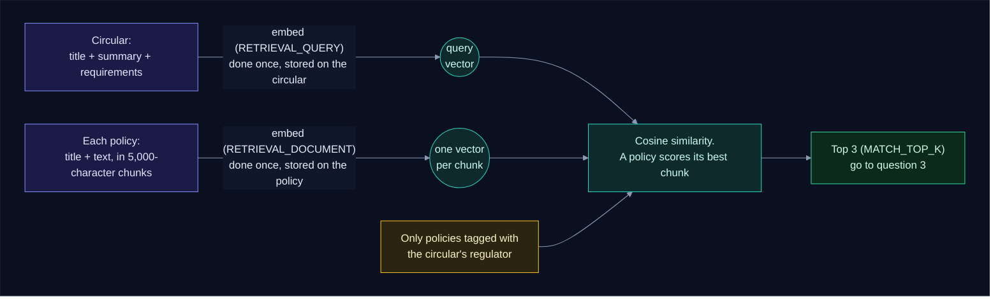

The embedding model reads about 2,000 tokens at most, so a long policy is split into
5,000-character chunks and each chunk is embedded. A policy's score is its best chunk's, so
a clause on page 12 of a long KYC policy still makes it a match.

### What a gap contains

| Field | Where it comes from |
|---|---|
| `title` | `Update POL-KYC for RBI circular: <circular title>` |
| `impact` | what the policy is missing (Gemini, question 3) |
| `draft_change` | the proposed wording (Gemini, question 3) |
| `affected_controls` | the policy's controls Gemini named. Codes that don't exist are dropped |
| `severity` | `high` (a breach or penalty), `medium` (a process or document must change) or `low` (wording only) |
| `owner` | the policy's owner |
| `due_date` | today plus 7 days (high), 30 (medium) or 60 (low) |
| `policy_version` | the version of the policy that was found out of date |

Each gap starts its history with one event: `agent` `opened` it.

---

## 9. When you add or edit a policy

Circulars aren't the only trigger. When you add a policy, the worker checks it against
your company's circulars of the **last 30 days** that apply to you, so a library loaded today
still finds the gaps left by last week's circulars. From then on, every new circular is
checked against it too.

> 💡 **No restart, no waiting.** Saving a policy queues a `policy.check` task, and a worker
> starts on it straight away.

In short, for a new policy:

1. The api saves it under your company as version 1, with no embeddings yet, and queues a
   `policy.check` task.
2. A worker takes the task at once and embeds the policy (turns its text into vectors, see
   [section 8](#how-the-closest-policies-are-found)).
3. The worker lists your recent circulars that apply to you and have obligations.
4. For each one it ranks every policy by similarity. Where the new policy is among the 3
   closest, Gemini is asked whether the policy is now out of date.
5. Each answer is saved. An out-of-date policy gets a gap ticket for its owner, with a draft
   of the new wording.

The same task runs whenever you save the policy again. The rest of this section follows a
new policy through.

### Step by step: what happens to a new policy

```mermaid
%%{init: {"theme": "base", "sequence": {"diagramMarginX": 0, "diagramMarginY": 0}, "themeVariables": {"darkMode": true, "primaryColor": "#16213a", "primaryTextColor": "#e6edf7", "primaryBorderColor": "#475a7a", "lineColor": "#8b9bb4", "secondaryColor": "#1b2436", "tertiaryColor": "#101a2e", "edgeLabelBackground": "#0f172a", "textColor": "#e2e8f0", "actorBkg": "#16213a", "actorBorder": "#5eead4", "actorTextColor": "#e6edf7", "actorLineColor": "#3b4a66", "signalColor": "#8b9bb4", "signalTextColor": "#e2e8f0", "noteBkgColor": "#2a2410", "noteBorderColor": "#fbbf24", "noteTextColor": "#fde68a", "labelBoxBkgColor": "#1e293b", "labelBoxBorderColor": "#64748b", "labelTextColor": "#e2e8f0", "loopTextColor": "#c4b5fd", "sequenceNumberColor": "#0b1020", "activationBkgColor": "#1e293b"}}}%%
sequenceDiagram
    autonumber
    box rgb(11, 16, 32)
        participant U as You
        participant A as api
        participant Q as Redis
        participant DB as Postgres
        participant K as worker
        participant G as Gemini
    end

    rect rgb(13, 20, 36)
        U->>A: POST /policies (New policy or Import JSON)
        A->>DB: save as version 1, no embeddings
        A->>Q: policy.check (your company, the policy)
        A-->>U: 201 Created
        Q-->>K: policy.check, at once
        K->>G: embed it, in 5,000-character chunks
        K->>DB: save the vectors
        K->>DB: your recent circulars that apply
        Note over K: rank your policies for each<br/>circular (no Gemini call)
        loop each circular: new policy in its top 3, pair never judged
            K->>G: is the policy out of date?
            G-->>K: what's missing, severity, draft
            K->>DB: save the verdict, and a gap if out of date
        end
        K->>Q: XACK: done
    end
```

### Which circulars a new policy is checked against

Not every circular. Each filter below exists either because the question can't be asked yet
or because the answer is already known:

A circular is checked against the new policy only if it passes every one of these, left to
right. The first row decides whether the circular is worth checking at all; the second,
whether this policy is one of the right ones to ask about.

```mermaid
%%{init: {"theme": "base", "flowchart": {"diagramPadding": 0}, "themeVariables": {"darkMode": true, "primaryColor": "#16213a", "primaryTextColor": "#e6edf7", "primaryBorderColor": "#475a7a", "lineColor": "#8b9bb4", "secondaryColor": "#1b2436", "tertiaryColor": "#101a2e", "edgeLabelBackground": "#0f172a", "textColor": "#e2e8f0", "clusterBkg": "#0f1728", "clusterBorder": "#2b3a55", "titleColor": "#c4b5fd", "nodeTextColor": "#e6edf7"}}}%%
flowchart TD
    subgraph canvas[" "]
        direction TB
        all(["Every circular"]) --> row1
        subgraph row1["Is the circular worth checking?"]
            direction LR
            a["Analysed for<br/>your company"] --> b["Applies to<br/>your company"] --> c["Published in<br/>the last 30 days"] --> d["Creates<br/>obligations"]
        end
        row1 --> row2
        subgraph row2["Is this policy one to ask about?"]
            direction LR
            e["Lists the circular's<br/>regulator"] --> f["Among the circular's<br/>3 closest policies"] --> g["Never judged at this<br/>version, and no gap yet"]
        end
        row2 --> ask(["Sent to Gemini"])
    end

    classDef svc fill:#0e2a2c,stroke:#2dd4bf,color:#ccfbf1
    classDef data fill:#1c1a47,stroke:#818cf8,color:#e0e7ff
    classDef ext fill:#2a1640,stroke:#c084fc,color:#f3e8ff
    classDef gpu fill:#2d1b0c,stroke:#fb923c,color:#ffedd5
    classDef ask fill:#2a2410,stroke:#fbbf24,color:#fef3c7
    classDef ok fill:#0b2a1c,stroke:#34d399,color:#d1fae5
    classDef bad fill:#2e0f17,stroke:#fb7185,color:#ffe4e6
    classDef start fill:#1c2a0e,stroke:#a7ef6f,color:#ecfccb
    classDef muted fill:#1a2130,stroke:#64748b,color:#cbd5e1
    class all start
    class ask ext
    style row1 fill:#0c1a24,stroke:#2dd4bf
    style row2 fill:#170f26,stroke:#c084fc
    style canvas fill:#0b1020,stroke:#1e293b,color:#0b1020
```

| If it fails… | It means | Setting |
|---|---|---|
| Analysed for your company | the circular is still waiting, failed, or was skipped as too old | |
| Applies to the company | Gemini judged it's for other kinds of entity, or the company isn't described yet | |
| Published in the last 30 days | it's older than the look-back window | `LOOKBACK_DAYS` |
| Creates obligations | it's informational (a repeal, a notice), so there's nothing a policy could miss | |
| Lists the circular's regulator | the policy isn't tagged with RBI, SEBI or IRDAI as needed | |
| Among the 3 closest | other policies fit this circular better | `MATCH_TOP_K` |
| Never judged | Gemini already answered for this version of the policy, or a gap is already open | |

The "3 closest" test is relative. Every one of your policies that lists the circular's regulator competes
for the 3 places, by how close its best chunk is to the circular (see
[How the closest policies are found](#how-the-closest-policies-are-found)). With 3 or fewer
policies for that regulator, all of them are checked. With 50, only the 3 most relevant are,
which keeps Gemini's work (and your bill) small without missing the policies that matter.

### How Gemini decides whether there's a gap

For each pair that gets through, Gemini is asked question 3 from
[section 8](#the-three-questions):

```mermaid
%%{init: {"theme": "base", "flowchart": {"diagramPadding": 0}, "themeVariables": {"darkMode": true, "primaryColor": "#16213a", "primaryTextColor": "#e6edf7", "primaryBorderColor": "#475a7a", "lineColor": "#8b9bb4", "secondaryColor": "#1b2436", "tertiaryColor": "#101a2e", "edgeLabelBackground": "#0f172a", "textColor": "#e2e8f0", "clusterBkg": "#0f1728", "clusterBorder": "#2b3a55", "titleColor": "#c4b5fd", "nodeTextColor": "#e6edf7"}}}%%
flowchart TD
    subgraph canvas[" "]
        direction TB
        subgraph input["What Gemini is given"]
            direction LR
            co["Your company<br/>description"]
            ci["The circular: addressee,<br/>summary, obligations"]
            po["The policy: its text at this<br/>version, and its controls"]
            co ~~~ ci ~~~ po
        end
        input --> q{"Does the circular require<br/>something this policy<br/>doesn't already say?"}
        q -->|no| ok["Up to date<br/>saved in policy_checks<br/>no gap"]
        q -->|yes| bad["Out of date<br/>saved in policy_checks"]
        bad --> gap["A gap for the policy owner:<br/>what's missing, severity, draft wording,<br/>affected controls, due date"]
    end

    classDef svc fill:#0e2a2c,stroke:#2dd4bf,color:#ccfbf1
    classDef data fill:#1c1a47,stroke:#818cf8,color:#e0e7ff
    classDef ext fill:#2a1640,stroke:#c084fc,color:#f3e8ff
    classDef gpu fill:#2d1b0c,stroke:#fb923c,color:#ffedd5
    classDef ask fill:#2a2410,stroke:#fbbf24,color:#fef3c7
    classDef ok fill:#0b2a1c,stroke:#34d399,color:#d1fae5
    classDef bad fill:#2e0f17,stroke:#fb7185,color:#ffe4e6
    classDef start fill:#1c2a0e,stroke:#a7ef6f,color:#ecfccb
    classDef muted fill:#1a2130,stroke:#64748b,color:#cbd5e1
    class q ask
    class ok ok
    class bad,gap bad
    style input fill:#170f26,stroke:#c084fc
    style canvas fill:#0b1020,stroke:#1e293b,color:#0b1020
```

Strictly, "out of date" means the circular creates or changes an obligation within this
policy's scope that the policy text doesn't already meet.

- **Up to date** is a real answer, not a failure. It means the policy already says what the
  circular requires, or the circular is about something the policy doesn't cover. It's still
  saved, so the same pair is never asked about again.
- **Out of date** opens one gap with `severity` high, medium or low, due in 7, 30 or 60 days.
  See [What a gap contains](#what-a-gap-contains).
- Controls Gemini names that don't exist on the policy are dropped from the gap.

### An example: a new policy with no gap

Say you add **POL-DRP** (listing RBI, SEBI and IRDAI) to a library that already has one
policy, for a company described as a non-deposit-taking NBFC, and the worker has analysed 25
circulars from the last 30 days:

| Circulars | How many | What happens to them |
|---|---|---|
| Don't apply to an NBFC | 23 | not checked |
| Applies, but only repeals old guidelines (no obligations) | 1 | nothing to check |
| Applies, with 4 obligations (an RBI circular) | 1 | checked |

The worker then:

1. **Embeds** POL-DRP (3,057 characters, so 1 chunk) a few seconds after you save it.
2. **Ranks** the 2 policies for the one eligible circular: POL-DRP scores 0.58, POL-DLP 0.55.
   With only 2 policies, both are in the top 3.
3. **Asks Gemini** about POL-DRP. POL-DLP was already judged for this circular, so it isn't
   asked again. Gemini finds that POL-DRP already covers what the circular requires.
4. **Saves** the verdict: up to date, no gap.

It's all visible in the worker's log:

```text
INFO pipeline embedded POL-DRP (1 chunks) with gemini-embedding-001
INFO pipeline #98 vs POL-DRP v1 (0.58): up to date
INFO pipeline POL-DRP checked, gaps opened: none
```

And in the console: the circular's page lists both policies under **Checked against your
policies**, each marked **Up to date**. Nothing shows on the Gaps page because no gap was
needed. The next RBI, SEBI or IRDAI circular that applies will be checked against POL-DRP
as soon as it's analysed.

### After that: every new circular includes the policy

The check above only looks back. Going forward, the new policy is simply part of your
library: each new circular that applies to you ranks all your policies (the new one included) and
the 3 closest are judged, as in [section 8](#8-step-3-the-worker-decides-what-the-circular-means-for-us).

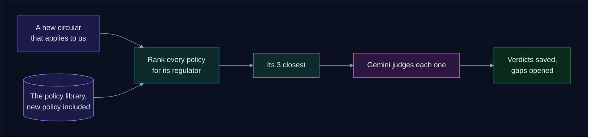

### When you edit a policy: what gets redone

Only what the change can affect:

| You change | Re-embedded? | Checked again? | Why |
|---|---|---|---|
| the owner | no | no | nothing Gemini sees has changed. New gaps go to the new owner |
| a control (added) | no | no | used from the next check on |
| the regulators | no | yes, against circulars from the newly listed regulators | those circulars couldn't pick it before |
| the title | yes | only pairs never judged | the ranking may change; the text Gemini judges is the same version |
| the text | yes | yes: it's a new version, so every recent pair is judged again, except pairs that already have a gap | a new version may fix, or cause, a gap |

A text edit also bumps the version and adds a `policy_updated` event to each of the policy's
open gaps ("POL-KYC updated to v2"), so the owner can close them against the new wording.

### Why doesn't my new policy have a gap?

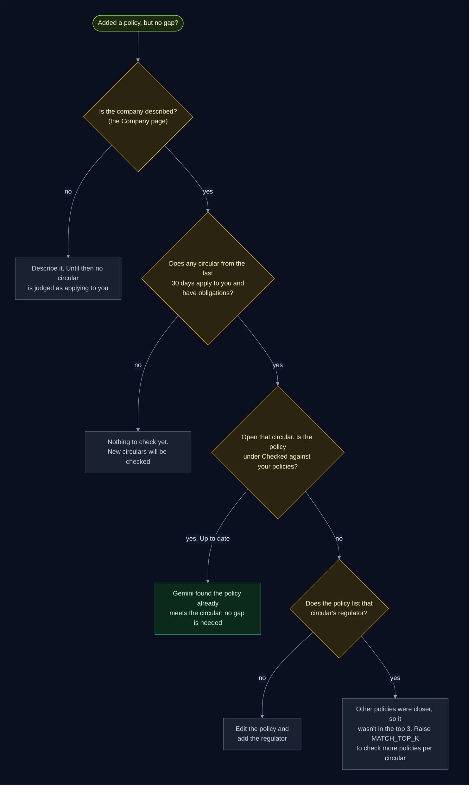

To see what the worker did, and when:

```bash
docker compose logs worker | grep -E "embedded| checked,| vs "
```

### Reliability

- **Each verdict is saved as soon as Gemini gives it.** If Gemini fails halfway, the task
  is retried and carries on from the next unjudged pair; nothing is asked twice.
- **Two quick edits, both checked.** While a policy's check is queued, saving it again
  adds nothing: the queued task checks the latest version. If you save it while the check
  is running, the worker checks it once more when it finishes.
- **You can watch it.** The policy's page says **Waiting for the worker** until the check is
  done (the worker stamps the policy's `checked_at`), then switches to **Checked** by itself.
- **One ticket per pair.** An edit never opens a second gap for the same circular and policy.
- **Changing `GEMINI_EMBEDDING_MODEL_NAME`** re-embeds every policy and circular
  automatically. Vectors from two different models can't be compared, so the worker tracks
  which model made each one.

---

## 10. The data

Ten tables, all defined in `backend/common/common/models.py`:

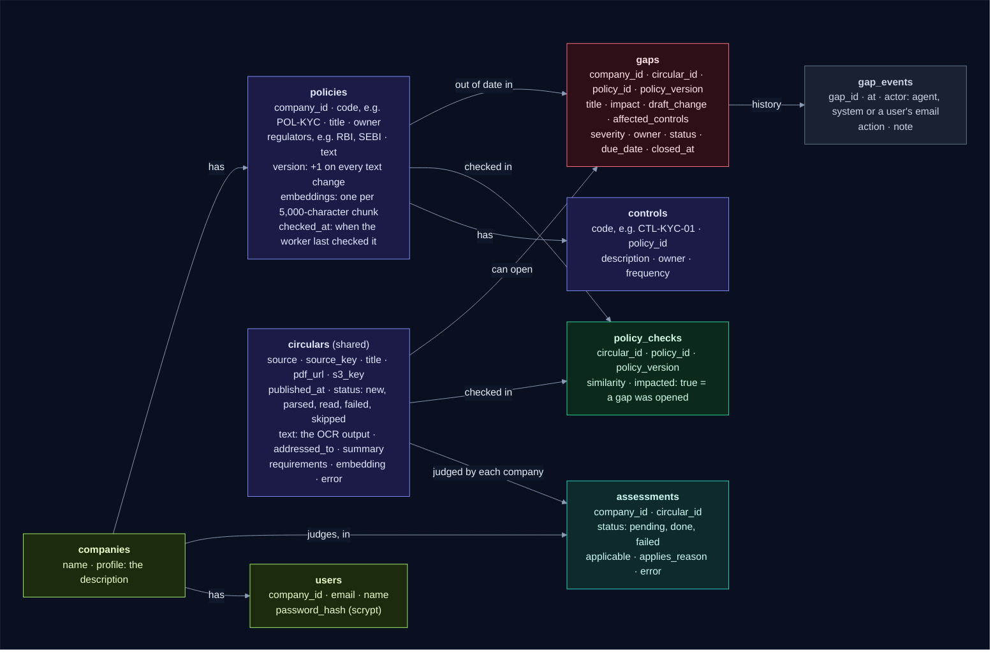

The tenth, `app_secrets`, holds secrets the services make for themselves, such as the key
that signs login tokens when `JWT_SECRET` isn't set.

Rules the database enforces:

- A circular is unique by `(source, source_key)`, so the watcher can't save it twice.
- An assessment is unique by `(company_id, circular_id)`: one answer per company.
- A policy code is unique within a company, a control code within its policy, and an email
  across all users.
- A gap is unique by `(circular_id, policy_id)`: one ticket per circular and policy.
- A check is unique by `(circular_id, policy_id, policy_version)`: Gemini judges each pair
  once per version of the policy.
- `gap_events` rows are only ever added, never edited or deleted. That's the audit trail.

Tables are created at startup by every service (`init_db`), and a column added to a model
later is added to the existing table (nothing is ever dropped). A transaction lock
stops two services that start together from both changing the schema. To give a company a
login from the command line, use `backend/api/manage.py add-user`.

---

## 11. Tracking a gap until it's closed

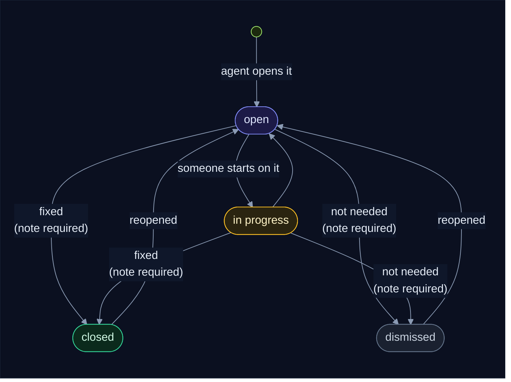

- **Every change is an event.** Changing the status, owner or due date, or adding a comment,
  adds a `gap_events` row recording who did it (the signed-in user's email), when, and
  why.
- **Closing or dismissing needs a note.** The API refuses without one, so the history always
  says why a gap ended.
- **Editing the policy is noted on its gaps.** When a policy's text changes, each of its open
  gaps gets a `policy_updated` event ("POL-KYC updated to v2"). The owner can then close the
  gap against the new version, and the console shows "found in v1, now v2".
- **Overdue** means open or in progress with a due date before today. The overview counts
  these, and the Gaps page can filter to them.

An example history, as the console shows it, for gap #1 (update POL-KYC for an RBI circular):

```mermaid
%%{init: {"theme": "base", "flowchart": {"diagramPadding": 0}, "themeVariables": {"darkMode": true, "primaryColor": "#16213a", "primaryTextColor": "#e6edf7", "primaryBorderColor": "#475a7a", "lineColor": "#8b9bb4", "secondaryColor": "#1b2436", "tertiaryColor": "#101a2e", "edgeLabelBackground": "#0f172a", "textColor": "#e2e8f0", "clusterBkg": "#0f1728", "clusterBorder": "#2b3a55", "titleColor": "#c4b5fd", "nodeTextColor": "#e6edf7"}}}%%
flowchart LR
    subgraph canvas[" "]
        direction LR
        d0["<b>Day 0</b><br/>agent opened the gap<br/><i>Reporting to FIU-IND is missing</i>"] --> d1["<b>Day 1</b><br/>priya: open → in progress<br/><i>drafting clause 2A</i>"]
        d1 --> d3["<b>Day 3</b><br/>cco commented<br/><i>board meets on the 10th</i>"]
        d3 --> d10["<b>Day 10</b><br/>system: POL-KYC<br/>updated to v2"]
        d10 --> d10b["<b>Day 10</b><br/>priya: in progress → closed<br/><i>v2 approved by the board</i>"]
    end

    classDef svc fill:#0e2a2c,stroke:#2dd4bf,color:#ccfbf1
    classDef data fill:#1c1a47,stroke:#818cf8,color:#e0e7ff
    classDef ext fill:#2a1640,stroke:#c084fc,color:#f3e8ff
    classDef gpu fill:#2d1b0c,stroke:#fb923c,color:#ffedd5
    classDef ask fill:#2a2410,stroke:#fbbf24,color:#fef3c7
    classDef ok fill:#0b2a1c,stroke:#34d399,color:#d1fae5
    classDef bad fill:#2e0f17,stroke:#fb7185,color:#ffe4e6
    classDef start fill:#1c2a0e,stroke:#a7ef6f,color:#ecfccb
    classDef muted fill:#1a2130,stroke:#64748b,color:#cbd5e1
    class d0 bad
    class d1 ask
    class d3 muted
    class d10 data
    class d10b ok
    style canvas fill:#0b1020,stroke:#1e293b,color:#0b1020
```

---

## 12. The API and the console

The console is plain HTML and JavaScript. It talks to the API through nginx, so the browser
only ever sees one address. You sign in with your email and password; the API answers with a
**login token** (a JWT naming you and your company, valid for `TOKEN_HOURS`), and the console
sends it with every call. Every query the API runs is limited to your company: another
company's policy, gap or verdict is simply "not found".

```mermaid
%%{init: {"theme": "base", "sequence": {"diagramMarginX": 0, "diagramMarginY": 0}, "themeVariables": {"darkMode": true, "primaryColor": "#16213a", "primaryTextColor": "#e6edf7", "primaryBorderColor": "#475a7a", "lineColor": "#8b9bb4", "secondaryColor": "#1b2436", "tertiaryColor": "#101a2e", "edgeLabelBackground": "#0f172a", "textColor": "#e2e8f0", "actorBkg": "#16213a", "actorBorder": "#5eead4", "actorTextColor": "#e6edf7", "actorLineColor": "#3b4a66", "signalColor": "#8b9bb4", "signalTextColor": "#e2e8f0", "noteBkgColor": "#2a2410", "noteBorderColor": "#fbbf24", "noteTextColor": "#fde68a", "labelBoxBkgColor": "#1e293b", "labelBoxBorderColor": "#64748b", "labelTextColor": "#e2e8f0", "loopTextColor": "#c4b5fd", "sequenceNumberColor": "#0b1020", "activationBkgColor": "#1e293b"}}}%%
sequenceDiagram
    box rgb(11, 16, 32)
        participant B as Browser
        participant N as nginx (frontend :8080)
        participant A as api (FastAPI)
        participant DB as Postgres
    end

    rect rgb(13, 20, 36)
        B->>N: GET /api/gaps?status=open (Authorization: Bearer token)
        N->>A: GET /gaps?status=open (the /api prefix removed)
        Note over A: check the token: user 7, company 1
        A->>DB: SELECT gaps WHERE company_id = 1 AND status = 'open'
        DB-->>A: rows
        A-->>N: JSON
        N-->>B: JSON, drawn as the gaps list
    end
```

| Area | Endpoints |
|---|---|
| Health and counts | `GET /health` (no login) · `GET /stats` (your company's counts) |
| Accounts | `POST /auth/signup` (a company and its first user) · `POST /auth/login` · `GET /auth/me` · `PUT /auth/password` · `GET /users` · `POST /users` (add a teammate) |
| Company | `GET /company` · `PUT /company` (name and description; a new description queues your circulars to be judged again) |
| Circulars | `GET /circulars` · `GET /circulars/{id}` (with its gaps and the policies it was checked against) · `GET /circulars/{id}/text` · `POST /circulars/{id}/reprocess` |
| Policies | `GET /policies` · `POST /policies` · `GET /policies/{id}` · `PUT /policies/{id}` · `POST /policies/{id}/controls` |
| Gaps | `GET /gaps` (filter by status, owner, policy, overdue) · `GET /gaps/{id}` (with its circular, policy and history) · `PATCH /gaps/{id}` · `POST /gaps/{id}/comments` |

The API never calls Gemini or OCR. Anything that needs the agent, like reprocessing a
circular or checking a new policy, works in two moves: the API saves the change in Postgres,
then queues a task on the Redis stream, which a worker picks up at once. If Redis is down,
the change is still saved, and the worker's reconciler queues it later.

Lists never read the heavy columns (the OCR text, the embeddings) from the database, since
the console never shows them; the OCR text has its own endpoint.

The interactive API docs are at http://localhost:8000/docs.

---

## 13. When things go wrong

> 🛡️ **The worker never loses work.** A task is acknowledged only when it's finished, and
> the question it asks about every error is: is the work to blame, or the service?

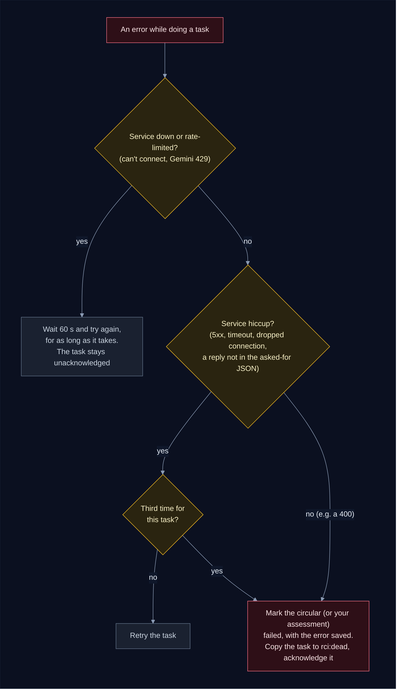

| What happened | What you see | What to do |
|---|---|---|
| The OCR model is still loading (first start downloads 6.7 GB) | the worker logs "OCR or Gemini unavailable; retrying" every minute | nothing: it carries on by itself |
| Gemini's quota ran out (429) | the same message | wait, or raise your quota |
| Gemini or OCR returned a 5xx a few times | the circular shows `failed`, with the error | **Reprocess** it in the console |
| A wrong API key or model name | the worker stops at startup: "Gemini rejected the key or model name" | fix `.env`, then restart the worker |
| A PDF link is broken | the watcher logs "failed" for that one | nothing: it's tried again next round |
| Redis restarted or was down | the worker logs "Redis unavailable; retrying" | nothing: tasks on disk survive, and the reconciler queues anything missed |
| A worker died mid-task | nothing | nothing: its task is taken over (after a restart at once, otherwise after 30 minutes) |

LangChain first retries Gemini's rate limits and server errors itself (3 times). Only after
that does the worker's own retry take over. LangChain wraps Gemini's errors in its own
classes, so the worker reads the HTTP code from the original error underneath
(`gemini_status` in `backend/worker/failures.py`, which holds all these rules).

> 🔒 **Workers never step on each other.** However many run, the consumer group gives each
> task to one worker, and a task is never queued twice. See
> [Running several workers](#running-several-workers).

---

## 14. Where settings come from

```mermaid
%%{init: {"theme": "base", "flowchart": {"diagramPadding": 0}, "themeVariables": {"darkMode": true, "primaryColor": "#16213a", "primaryTextColor": "#e6edf7", "primaryBorderColor": "#475a7a", "lineColor": "#8b9bb4", "secondaryColor": "#1b2436", "tertiaryColor": "#101a2e", "edgeLabelBackground": "#0f172a", "textColor": "#e2e8f0", "clusterBkg": "#0f1728", "clusterBorder": "#2b3a55", "titleColor": "#c4b5fd", "nodeTextColor": "#e6edf7"}}}%%
flowchart LR
    subgraph canvas[" "]
        direction LR
        env[".env beside<br/>docker-compose.yml"] --> compose["docker compose"]
        shell["your shell<br/>(e.g. a direnv .envrc)"] --> compose
        compose -->|"container<br/>environment"| cfg["each service's config.py<br/>(pydantic-settings)"]
        local[".env beside a service's main.py<br/>(when run with uv run)"] --> cfg
        defaults["defaults written<br/>in config.py"] --> cfg
        cfg --> code["the rest of the code<br/>(never reads os.environ)"]
    end

    classDef svc fill:#0e2a2c,stroke:#2dd4bf,color:#ccfbf1
    classDef data fill:#1c1a47,stroke:#818cf8,color:#e0e7ff
    classDef ext fill:#2a1640,stroke:#c084fc,color:#f3e8ff
    classDef gpu fill:#2d1b0c,stroke:#fb923c,color:#ffedd5
    classDef ask fill:#2a2410,stroke:#fbbf24,color:#fef3c7
    classDef ok fill:#0b2a1c,stroke:#34d399,color:#d1fae5
    classDef bad fill:#2e0f17,stroke:#fb7185,color:#ffe4e6
    classDef start fill:#1c2a0e,stroke:#a7ef6f,color:#ecfccb
    classDef muted fill:#1a2130,stroke:#64748b,color:#cbd5e1
    class compose,cfg svc
    class code ok
    style canvas fill:#0b1020,stroke:#1e293b,color:#0b1020
```

- 🔑 Only **`GEMINI_API_KEY`** is required.
- Nothing about **your company** is a setting. The company description and the policies are
  data, entered in the console, so the agent never assumes a company you didn't describe. Every other setting has a default in the service's
  `config.py`.
- Compose passes settings you haven't set as empty strings, and `config.py` ignores empty
  values (`env_ignore_empty`), so the default in `config.py` always applies.
- **`S3_ENDPOINT_URL` is fixed in `docker-compose.yml`** on purpose. Your shell may say
  `localhost:4566`, which is right on the host but would point a container at itself.

Settings you're most likely to change:

| Setting | Default | What it changes |
|---|---|---|
| `GEMINI_MODEL_NAME` | `gemini-3.5-flash` | the model that answers the three questions |
| `GEMINI_EMBEDDING_MODEL_NAME` | `gemini-embedding-001` | the model used for policy matching (changing it re-embeds every policy and circular) |
| `LOOKBACK_DAYS` | 30 | older circulars are skipped; new policies and new companies are checked against this window |
| `MATCH_TOP_K` | 3 | how many policies Gemini checks per circular |
| `WORKERS` | 1 | how many workers run side by side ([how they share the work](#running-several-workers)) |
| `RECONCILE_MINUTES` | 15 | how often one worker looks in Postgres for work whose task went missing |
| `JWT_SECRET` | empty: a key made on first start, kept in Postgres | signs login tokens |
| `TOKEN_HOURS` | 12 | how long a login lasts |
| `OCR_MAX_PAGES` | 20 | how many pages of each PDF are read |
| `WATCH_INTERVAL_MINUTES` | 60 | how often the regulator sites are checked |

`.env.example` in the repo root lists every setting.

---

## 15. The code, file by file

```mermaid
%%{init: {"theme": "base", "flowchart": {"diagramPadding": 0}, "themeVariables": {"darkMode": true, "primaryColor": "#16213a", "primaryTextColor": "#e6edf7", "primaryBorderColor": "#475a7a", "lineColor": "#8b9bb4", "secondaryColor": "#1b2436", "tertiaryColor": "#101a2e", "edgeLabelBackground": "#0f172a", "textColor": "#e2e8f0", "clusterBkg": "#0f1728", "clusterBorder": "#2b3a55", "titleColor": "#c4b5fd", "nodeTextColor": "#e6edf7"}}}%%
flowchart TB
    subgraph canvas[" "]
        direction TB
        subgraph common["backend/common (shared)"]
            models["models.py<br/>the 10 tables"]
            dbpy["db.py<br/>make_engine, init_db"]
            queuepy["queue.py<br/>the task stream"]
        end
        subgraph watcher["backend/watcher"]
            wmain["main.py<br/>the hourly loop"] --> sources["sources.py<br/>RBI, SEBI, IRDAI"]
            wmain --> fetch["fetch.py<br/>polite HTTP"]
            wmain --> wstore["storage.py<br/>PDF to S3"]
        end
        subgraph worker["backend/worker"]
            kmain["main.py<br/>the task loop"] --> pipeline["pipeline.py<br/>read_circular, assess,<br/>check_policy, refresh_company"]
            kmain --> failures["failures.py<br/>wait, retry or give up"]
            pipeline --> ocrpy["ocr.py<br/>PDF to text"]
            pipeline --> llm["llm.py<br/>the Gemini prompts"]
            pipeline --> kstore["storage.py<br/>PDF from S3"]
        end
        subgraph api["backend/api"]
            amain["main.py<br/>app, /health, /stats"] --> routes["routes/<br/>auth, company, circulars,<br/>policies, gaps"]
            amain --> database["database.py<br/>session, enqueue"]
            routes --> authpy["auth.py<br/>passwords, tokens"]
        end
        wmain -.-> models
        kmain -.-> models
        routes -.-> models
        wmain -.-> queuepy
        kmain -.-> queuepy
        database -.-> queuepy
    end

    class models,dbpy data
    class queuepy queue
    class wmain,kmain,amain svc
    classDef svc fill:#0e2a2c,stroke:#2dd4bf,color:#ccfbf1
    classDef data fill:#1c1a47,stroke:#818cf8,color:#e0e7ff
    classDef ext fill:#2a1640,stroke:#c084fc,color:#f3e8ff
    classDef gpu fill:#2d1b0c,stroke:#fb923c,color:#ffedd5
    classDef ask fill:#2a2410,stroke:#fbbf24,color:#fef3c7
    classDef ok fill:#0b2a1c,stroke:#34d399,color:#d1fae5
    classDef bad fill:#2e0f17,stroke:#fb7185,color:#ffe4e6
    classDef start fill:#1c2a0e,stroke:#a7ef6f,color:#ecfccb
    classDef muted fill:#1a2130,stroke:#64748b,color:#cbd5e1
    classDef queue fill:#0c2231,stroke:#38bdf8,color:#e0f2fe
    style common fill:#14123a,stroke:#818cf8
    style watcher fill:#0c1a24,stroke:#2dd4bf
    style worker fill:#0c1a24,stroke:#2dd4bf
    style api fill:#0c1a24,stroke:#2dd4bf
    style canvas fill:#0b1020,stroke:#1e293b,color:#0b1020
```

| Want to change… | Look in |
|---|---|
| which sites are watched, or how they're scraped | `backend/watcher/sources.py` |
| what Gemini is asked, or the shape of its answers | `backend/worker/llm.py` (the prompts and Pydantic models sit side by side) |
| the order of the steps, how policies are picked, the due dates | `backend/worker/pipeline.py` |
| what's retried and what's marked failed | `backend/worker/failures.py` (the rules) and `main.py` (`run_task`) |
| the task types, or how tasks are queued and read | `backend/common/common/queue.py`, `backend/worker/main.py` |
| sign-up, login, tokens, teammates | `backend/api/auth.py`, `backend/api/routes/auth.py` |
| a login for a company from the command line | `backend/api/manage.py` |
| how PDFs are turned into images, or how OCR output is cleaned | `backend/worker/ocr.py` |
| the vLLM flags for the OCR model | `backend/ocr/Dockerfile` |
| an endpoint | `backend/api/routes/` (`auth.py`, `company.py`, `circulars.py`, `policies.py`, `gaps.py`) |
| a table or a column | `backend/common/common/models.py` (then rebuild all three services) |
| the console | `frontend/js/views/` (one module per page) and `frontend/css/` (see `frontend/README.md`) |

---

## 16. How do I…?

**…start everything?**

```bash
cp .env.example .env                 # set GEMINI_API_KEY
docker compose up -d --build
docker compose logs -f worker        # watch the agent think
```

Then open http://localhost:8080 and **create an account for your company**.

**…give a company a login from the command line?** For example company 1, which holds the
data from before logins existed:

```bash
cd backend/api && uv run python manage.py add-user you@company.com "Your Name" --company 1
```

It asks for a password (or reads `RCI_PASSWORD`); for an existing login it sets a new one,
so it's also how to reset a forgotten password. `manage.py companies` lists every company
and its users.

**…add a teammate?** On the **Company** page, under **Team**: their name, email and a first
password. They see everything your company sees, and can change their password on the same
page.

**…tell the agent who my company is?** In the console, open **Company** and write a few
sentences. Say what kind of entity it is, list every licence and business with its regulator,
and say what it's *not* when that's easy to confuse ("not a small finance bank"). The
workers start at once: every recent circular is judged against it, each with a one-sentence
reason.

**…load my company's policies?** In the console, go to **Policies**, then **Import JSON**
(the file format is shown on that page and in `frontend/README.md`), or add them one at a
time with **New policy**. A worker embeds each one as soon as it's saved and checks it
against your last 30 days of circulars.

**…see why a circular has no gaps?** Open it in the console:

- **"Not checked"**: nobody has described the company yet. Do that on the
  **Company** page.
- **"Not for us"**: Gemini decided it's addressed to other kinds of entity. The reason is
  shown beside it. If it's wrong, make your company description more precise.
- **No obligations**: it's informational, so there's nothing to check.
- **"No policy in the library was found out of date"**: the closest policies already comply,
  or you don't have a policy on that subject yet.

**…run a circular through the agent again?** Press **Reprocess** on the circular. For a
circular that's been read, only **your company's** answer is redone: Gemini judges it again
for you and re-checks the policies it had found up to date, with no new OCR. A failed one is
read again (OCR only if no text was saved). Gaps already opened are kept and never
duplicated.

**…know when the worker has checked my policy?** Open the policy. It says **Waiting for the
worker** from the moment you save it, and switches to **Checked** by itself when the worker
is done (the page looks every 3 seconds). The policies list shows the same for each policy.

**…find out why a new policy has no gap?** Follow the chart in
[Why doesn't my new policy have a gap?](#why-doesnt-my-new-policy-have-a-gap). Most often
Gemini checked it and found it already up to date, which the circular's page shows.

**…see which policies a circular was checked against?** Its page in the console has a
**Checked against your policies** list: each policy, its similarity, and Gemini's verdict.

**…see what Gemini decided, step by step?**

```bash
docker compose logs worker | grep pipeline
# #98 read: addressed to 'All Commercial Banks'
# #98 vs POL-KYC v1 (0.74): GAP
# #98 for company 1: applies: True, gaps opened: ['POL-KYC']
```

**…look at the raw data?**

```bash
TOKEN=$(curl -s localhost:8000/auth/login -H 'Content-Type: application/json' \
  -d '{"email": "you@company.com", "password": "…"}' | python3 -c 'import json,sys; print(json.load(sys.stdin)["token"])')
curl -H "Authorization: Bearer $TOKEN" localhost:8000/stats
curl -H "Authorization: Bearer $TOKEN" localhost:8000/circulars/98 | python3 -m json.tool
curl -H "Authorization: Bearer $TOKEN" localhost:8000/circulars/98/text   # the OCR output
docker compose exec postgres psql -U rci -d rci -c \
  "select circular_id, status, applicable from assessments where company_id = 1 order by circular_id desc limit 10"
```

**…see the task queue?**

```bash
docker compose exec redis redis-cli XINFO GROUPS rci:tasks   # lag: waiting, pending: being worked on
docker compose exec redis redis-cli XRANGE rci:dead - +      # tasks that failed for good
```

**…run one service on my machine instead of in Docker?**

```bash
docker compose up -d postgres redis ocr    # what it depends on
cd backend/worker && cp .env.example .env && uv sync
uv run python main.py --once               # work until the queue is empty, then exit
```

---

## 17. Glossary

| Term | Meaning |
|---|---|
| **Circular** | A notice from a regulator (RBI, SEBI or IRDAI) that creates or changes rules |
| **Policy** | One of the company's own documents, e.g. its KYC policy. It has an owner, the regulators it answers to, and a version |
| **Control** | A regular check that puts a policy into practice, e.g. "screen customers against sanctions lists daily" |
| **Gap** | A ticket saying "this policy is out of date because of this circular", with a draft of the fix |
| **Gap event** | One line of a gap's history: opened, status changed, reassigned, commented, policy updated |
| **Company** | One organisation using the app, with its own users, description, policies and gaps. Circulars are shared by all |
| **Company description** | A few sentences you write on the console's Company page saying what kind of entity the company is. There's no default |
| **Assessment** | One company's answer for one circular: pending, then done, with whether it applies |
| **Applicable** | Whether a circular applies to the company you described. Empty means "not checked", because no description exists yet |
| **Task** | A small message on the Redis stream saying what to work on, e.g. `circular.read 98`. The data stays in Postgres |
| **Stream, consumer group** | Redis's append-only list of tasks, and the group of workers reading it, which hands each task to one of them |
| **Dedupe key** | A small Redis key set when a task is queued and deleted when it's done, so the same task is never queued twice |
| **Login token** | A signed JWT the api gives you at sign-in, naming you and your company, sent with every call |
| **Requirements** | The concrete obligations Gemini found in a circular |
| **OCR** | Optical character recognition: reading text from an image of a page |
| **Embedding** | A list of numbers that represents a text's meaning, so similar texts can be found by arithmetic |
| **Structured output** | Asking the model for JSON that matches a schema (a Pydantic model), instead of free text |
| **Lookback** | The window (`LOOKBACK_DAYS`, 30) of recent circulars the agent cares about |
