# How the worker works

       

The **worker** is the part of the app that reads circulars and checks each company's
policies. This guide tells its two main stories, step by step:

- **A regulator releases a new circular.** How it's read once, then judged and checked for
  every company that uses the app.
- **You add a new policy.** How it's checked against the circulars you already have.

At every step you'll see what the worker does, **what goes through the task queue**, and
**exactly what changes in the database**.

**Reading the diagrams.** Each colour means the same thing in every diagram:

         

**Contents**

1. [The worker in one picture](#1-the-worker-in-one-picture)
2. [Story 1: a new circular is released](#2-story-1-a-new-circular-is-released)
3. [Story 2: you add a new policy](#3-story-2-you-add-a-new-policy)
4. [Other things you can do](#4-other-things-you-can-do)
5. [The task queue: Redis Streams](#5-the-task-queue-redis-streams)
6. [How the worker uses the database](#6-how-the-worker-uses-the-database)
7. [Locks: when the same task arrives twice](#7-locks-when-the-same-task-arrives-twice)
8. [Companies and logins](#8-companies-and-logins)
9. [When something goes wrong](#9-when-something-goes-wrong)
10. [Quick reference](#10-quick-reference)

---

## 1. The worker in one picture

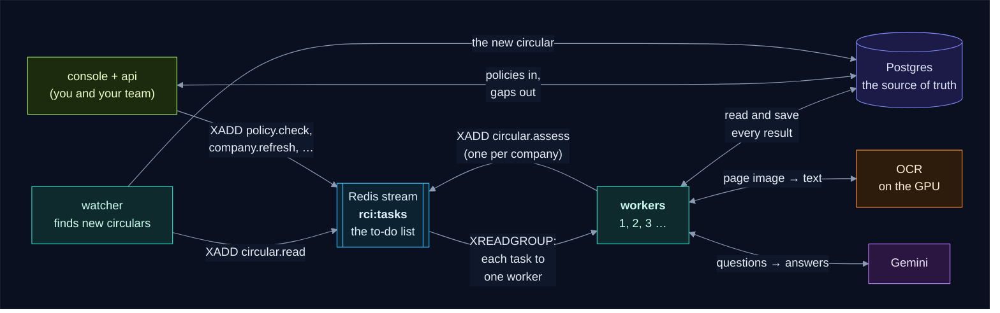

Four things to know before the stories:

- **Work arrives as tasks.** When something happens (a new circular, a policy saved, a
  company described), the service that saw it adds a **task** to a Redis stream. A task is
  tiny: a type and some ids, like `circular.read 98`.
- **No polling.** A worker waits on the stream and starts a task **the moment it's added**.
  When there's nothing to do, it just waits: no database checks, no OCR, no Gemini.
- **Each task goes to exactly one worker**, however many run. Run 3 and they share the tasks.
- **Postgres is the truth, Redis is the to-do list.** Every result is saved in Postgres after
  every step. A task only says *what to look at*; the worker reads the database to see what
  is left to do. So a lost task is found again, and a task delivered twice does nothing
  twice.

The four task types:

| Task | Carries | Added by | The worker… |
|---|---|---|---|
| `circular.read` | circular id | the watcher (new circular), the api (Reprocess) | reads the PDF (OCR), summarises and embeds it: **once, for every company** |
| `circular.assess` | company id, circular id | the worker (after reading), the api (Reprocess) | decides if the circular applies to **that company**, checks its closest policies |
| `policy.check` | company id, policy id | the api (a policy added or edited) | embeds the policy, checks it against the company's recent circulars |
| `company.refresh` | company id | the api (sign-up, a new description) | queues a `circular.assess` for each recent circular the company hasn't judged |

---

## 2. Story 1: a new circular is released

**The setting.** Two companies use the app. **Company A** (yours) is an NBFC with four RBI
policies: POL-KYC, POL-DRP, POL-DLP and POL-IT. **Company B** is a stock broker. RBI
publishes a circular about accounts linked to a banned organisation.

The circular is **read once** (the OCR and the summary are the same for everyone), then
**judged separately for each company**:

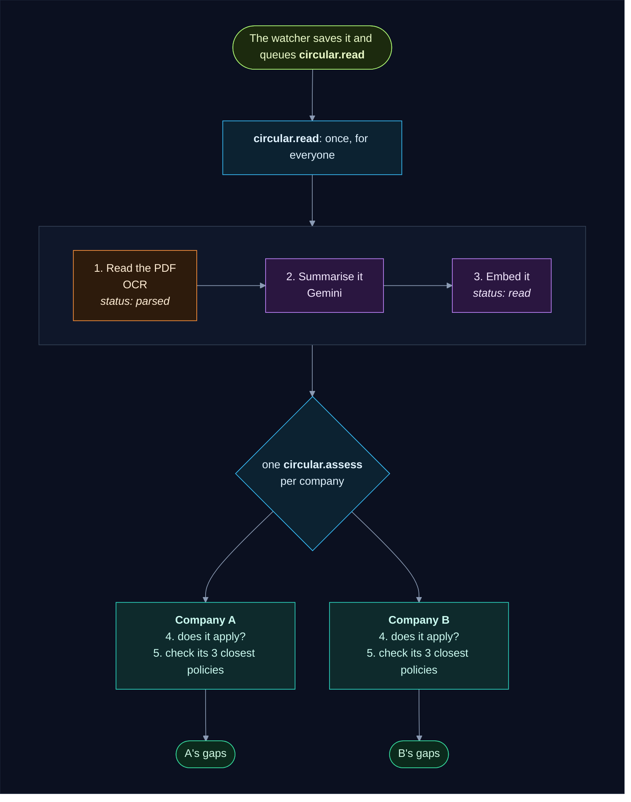

And in time order, with two workers running:

```mermaid
%%{init: {"theme": "base", "sequence": {"diagramMarginX": 0, "diagramMarginY": 0}, "themeVariables": {"darkMode": true, "primaryColor": "#16213a", "primaryTextColor": "#e6edf7", "primaryBorderColor": "#475a7a", "lineColor": "#8b9bb4", "secondaryColor": "#1b2436", "tertiaryColor": "#101a2e", "edgeLabelBackground": "#0f172a", "textColor": "#e2e8f0", "actorBkg": "#16213a", "actorBorder": "#5eead4", "actorTextColor": "#e6edf7", "actorLineColor": "#3b4a66", "signalColor": "#8b9bb4", "signalTextColor": "#e2e8f0", "noteBkgColor": "#2a2410", "noteBorderColor": "#fbbf24", "noteTextColor": "#fde68a", "labelBoxBkgColor": "#1e293b", "labelBoxBorderColor": "#64748b", "labelTextColor": "#e2e8f0", "loopTextColor": "#c4b5fd", "sequenceNumberColor": "#0b1020", "activationBkgColor": "#1e293b"}}}%%
sequenceDiagram
    autonumber
    box rgb(11, 16, 32)
        participant W as watcher
        participant Q as Redis stream
        participant K1 as worker 1
        participant K2 as worker 2
        participant DB as Postgres
        participant G as OCR + Gemini
    end

    rect rgb(13, 20, 36)
        W->>DB: INSERT circular 98 (status new)
        W->>Q: XADD circular.read 98
        Q-->>K1: XREADGROUP: circular.read 98
        K1->>G: OCR each page, then summarise
        K1->>DB: save text, summary, embedding (status read)
        K1->>DB: an assessment row for each company (pending)
        K1->>Q: XADD circular.assess (A, 98)
        K1->>Q: XADD circular.assess (B, 98)
        K1->>Q: XACK circular.read 98
        Q-->>K1: circular.assess (A, 98)
        Q-->>K2: circular.assess (B, 98)
        Note over K1,K2: both at the same time
        K1->>G: does 98 apply to A? then A's 3 closest policies
        K2->>G: does 98 apply to B? then B's 3 closest policies
        K1->>DB: A's answers and gaps (assessment done)
        K2->>DB: B's answers and gaps (assessment done)
        K1->>Q: XACK
        K2->>Q: XACK
    end
```

Now step by step, with the database after each one. **Bold** marks what changed.

### Step 0: the watcher saves it and queues a task

The watcher finds the circular on RBI's website, stores the PDF in S3, adds a row, and adds
a task to the stream:

| id | source | title | status | text |
|---|---|---|---|---|
| 98 | RBI | Designation of terrorist organisation… | **new** | *(empty)* |

```text
XADD rci:tasks * type circular.read circular_id 98
```

A free worker picks it up straight away.

### Step 1: read the PDF

The worker downloads the PDF and sends each page to the **OCR** model on the GPU, which
turns the page image into text. It saves the text.

| id | status | text |
|---|---|---|
| 98 | **parsed** | **"RESERVE BANK OF INDIA … (12,408 characters)"** |

From now on the PDF is never read again: every later step, for every company, uses this
saved text. If another circular ever has the exact same PDF, it copies this text instead of
running OCR.

### Step 2: summarise and embed it

The worker asks **Gemini** to read the text and answer in a fixed shape: who it's addressed
to, a short summary, and every obligation. Then it **embeds** the summary (turns it into a
list of numbers that capture its meaning, used to find the closest policies).

| id | status | addressed_to | summary | requirements | embedding |
|---|---|---|---|---|---|
| 98 | **read** | **All Regulated Entities… NBFCs…** | **RBI designates a new terrorist organisation…** | **["Report accounts … to FIU-IND", …]** | **[0.021, -0.013, …]** |

`read` is as far as the circular itself goes. What's left depends on the company.

### Step 3: one task per company

The worker gives every company an **assessment** of the circular, a row that says "company
X hasn't judged circular 98 yet", and queues a task for each:

| company | circular | status | applicable |
|---|---|---|---|
| **A** | **98** | **pending** | *(empty)* |
| **B** | **98** | **pending** | *(empty)* |

```text
XADD rci:tasks * type circular.assess company_id A circular_id 98
XADD rci:tasks * type circular.assess company_id B circular_id 98
```

Then it acknowledges the `circular.read` task (`XACK`): done. With two workers, the two
companies are now judged **at the same time**.

### Step 4: does it apply to this company?

For company A, the worker asks Gemini: given **A's description**, does this circular apply?
The answer comes with a reason. Company B is asked the same about **its** description.

| company | circular | applicable | applies_reason |
|---|---|---|---|
| A | 98 | **true** | **"Addressed to NBFCs, and the company is an NBFC."** |
| B | 98 | **false** | **"Addressed to banks and NBFCs; the company is a stock broker."** |

For B the story ends here: its assessment is marked `done`, and none of B's policies is
checked. If a company hasn't described itself yet, `applicable` stays empty and its story
also ends here (it's judged later, when the description is saved).

### Step 5: check the company's closest policies

Asking Gemini about every policy would be slow and costly, so the worker first **scores**
each of **A's** RBI policies by how close it is to the circular. This is quick arithmetic on
the saved embeddings, with no Gemini call. Only the **3 closest** go to Gemini:

| Policy | Score | Sent to Gemini? |
|---|---|---|
| POL-KYC | 0.82 | ✅ top 3 |
| POL-DRP | 0.58 | ✅ top 3 |
| POL-DLP | 0.55 | ✅ top 3 |
| POL-IT | 0.31 | no: clearly unrelated |

For each of the 3, Gemini reads the circular and the policy and answers: **is this policy
now out of date?** Every answer is saved in `policy_checks`, so the same question is never
asked twice:

| circular | policy | version | similarity | impacted |
|---|---|---|---|---|
| **98** | **POL-KYC** | **1** | **0.82** | **true** |
| **98** | **POL-DRP** | **1** | **0.58** | **false** |
| **98** | **POL-DLP** | **1** | **0.55** | **false** |

POL-KYC is out of date, so the worker opens a **gap** for company A, a ticket for the
policy's owner with a draft of the new wording, and writes the first line of its history:

| table | new row |
|---|---|
| `gaps` | **company A · POL-KYC · severity high · due in 7 days · draft: "Add clause 2A: …"** |
| `gap_events` | **agent · opened · "The policy does not require reporting to FIU-IND…"** |

The verdict, the gap and its history line are saved **together**: all of them or none.

### Step 6: done

| company | circular | status |
|---|---|---|
| A | 98 | **done** |
| B | 98 | **done** |

The worker acknowledges each `circular.assess` task. The gap shows up on **company A's**
Gaps page; company B never sees it.

**What it cost:** OCR once per page and 1 summary **in total**, then per company: 1 "does it
apply?" and, where it applies, up to 3 policy checks.

---

## 3. Story 2: you add a new policy

**The setting.** A week later you add **POL-AML**, your anti-money-laundering policy, tagged
RBI. Circular 98 from Story 1 is already judged. Does the new policy have a gap too?

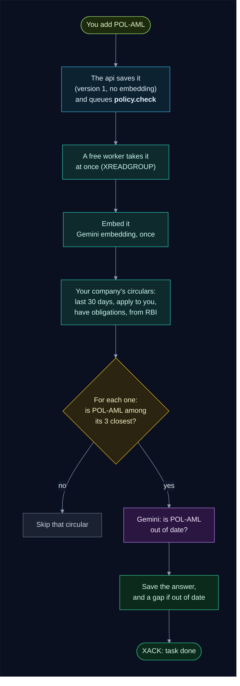

In time order:


Step by step:

### Step 1: you save it, and a task is queued

The console sends it to the api, which saves the row under **your company** and adds a task:

| company | code | title | regulators | version | embeddings |
|---|---|---|---|---|---|
| A | POL-AML | Anti-Money Laundering Policy | ["RBI"] | **1** | ***(empty)*** |

```text
XADD rci:tasks * type policy.check company_id A policy_id 11
```

The console answers at once; the worker does the rest in the background, starting straight
away.

### Step 2: the worker embeds it

The worker sends the policy's text to Gemini's embedding model (split into 5,000-character
pieces, so nothing in a long policy is lost) and saves the numbers:

| code | embeddings | embedding_model |
|---|---|---|
| POL-AML | **[[0.012, -0.034, …], …] (one list per piece)** | **gemini-embedding-001** |

### Step 3: find your circulars to check it against

It looks at **your company's** circulars of the last **30 days** that apply to you, have
obligations, and come from a regulator the new policy lists (RBI). Circular 98 qualifies.

### Step 4: is the new policy among the 3 closest?

For circular 98 the worker scores all of your RBI policies again, now including POL-AML:

| Policy | Score | Top 3? | Already checked? |
|---|---|---|---|
| POL-KYC | 0.82 | ✅ | yes (Story 1): skip |
| **POL-AML** | **0.79** | ✅ | **no: ask Gemini** |
| POL-DRP | 0.58 | ✅ | yes (Story 1): skip |
| POL-DLP | 0.55 | no | yes (Story 1) |

Only **one** Gemini question is asked: the pair nobody has checked yet.

### Step 5: save the answer

| table | new row |
|---|---|
| `policy_checks` | **98 · POL-AML · version 1 · 0.79 · impacted true** |
| `gaps` | **company A · POL-AML · severity high · due in 7 days** |
| `gap_events` | **agent · opened · "…"** |

The task is acknowledged. **What it cost:** 1 embedding (the policy) and 1 check.

> 💡 **No restart, no waiting.** The worker starts on the new policy the moment you save it.

---

## 4. Other things you can do

Everything you do in the console is saved in the database, and queues a task. The worker
then redoes **only** what the change affects:

| You… | The database change | The task | What the worker does | Gemini cost |
|---|---|---|---|---|
| add a policy | a new row, no embedding | `policy.check` | embeds it, checks it against your recent circulars | 1 embedding + 1 per top-3 circular |
| edit a policy's **text** | version + 1, embeddings cleared | `policy.check` | embeds it, checks the new version (skipping pairs that already have a gap) | 1 embedding + 1 per top-3 circular |
| edit its **title** | embeddings cleared | `policy.check` | embeds it; checks only pairs never checked | 1 embedding |
| edit its **regulators** or **owner** | `updated_at` changes | `policy.check` | checks it against any newly listed regulator's circulars | 1 per new top-3 circular |
| sign up a new company | a company and its first user | `company.refresh` | gives it an assessment of each recent circular (they're judged once it's described) | none yet |
| describe your company, or change the description | **your** assessments cleared back to `pending` | `company.refresh` | asks "does it apply?" again for each of your recent circulars, then checks pairs never checked | 1 per circular, plus new checks |
| press **Reprocess** on a circular that's read | **your** assessment back to `pending`, your "up to date" answers cleared | `circular.assess` | judges it for you again, **no OCR, no summary**; gaps are kept | 1 + its checks |
| press **Reprocess** on a failed circular | its status back to `new` or `parsed` | `circular.read` | reads it again (OCR only if no text was saved), then judges it for every company | 2 + per company |

Other companies are never touched: your description, your Reprocess and your policies only
ever change **your** rows.

---

## 5. The task queue: Redis Streams

### A stream and a group

A Redis **stream** is an append-only list of messages. The app has one, `rci:tasks`, and
three commands do all the work:

| Command | Who | What it does |
|---|---|---|
| `XADD rci:tasks * type … ids …` | watcher, api, worker | adds a task at the end |
| `XREADGROUP GROUP workers <me> … >` | each worker | "give me the next task nobody in my group has had" |
| `XACK rci:tasks workers <task id>` | each worker | "I finished it": it leaves the group's pending list |

The workers read as one **consumer group** called `workers`. The group remembers which task
it handed to which worker, so **each task goes to exactly one worker**:

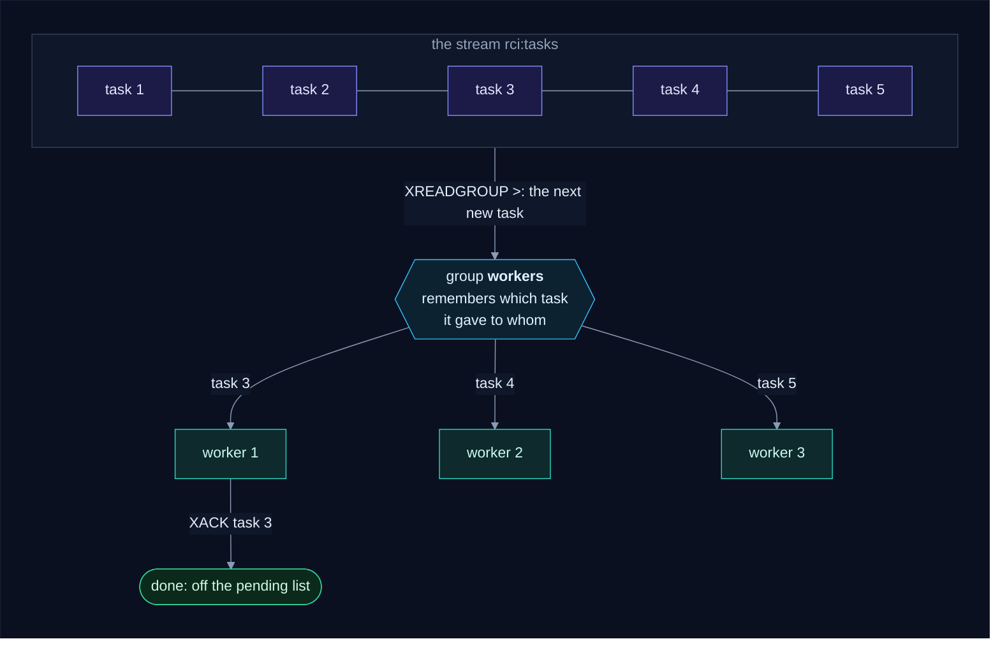

A task handed out but not yet acknowledged sits on the group's **pending list**, under the
worker that has it. That list is what makes the queue safe.

### How a worker picks its next task

Each time a worker is free, it looks in three places, in this order:

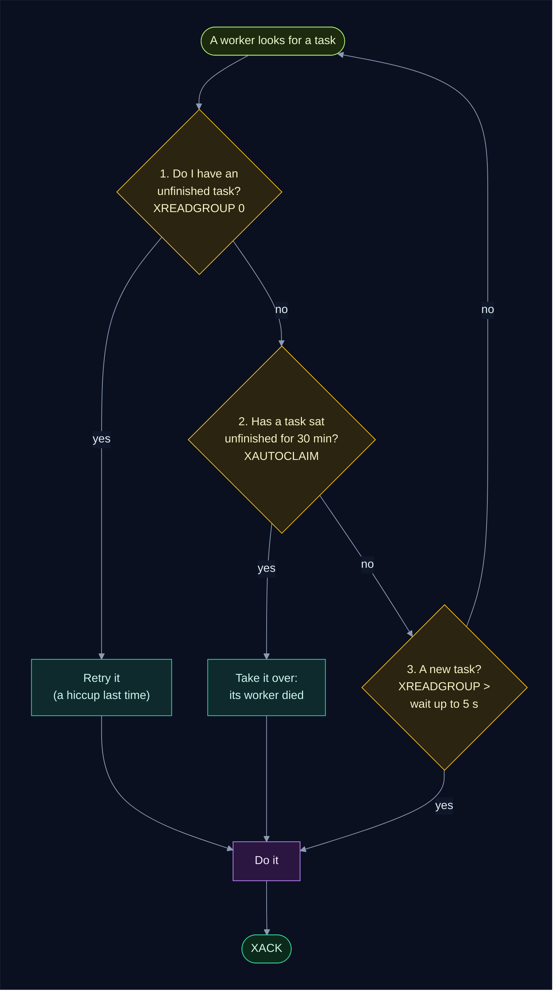

1. **Its own unfinished tasks.** If the last attempt hit a hiccup (a timeout, a bad answer),
   the task was left unacknowledged on purpose: it's retried, up to 3 times.
2. **Tasks abandoned by a dead worker.** A task that has sat on another worker's pending
   list for **30 minutes** (`CLAIM_IDLE_SECONDS`) is taken over with `XAUTOCLAIM`.
3. **A new task**, waiting up to 5 seconds for one to arrive, then looking again.

### If a worker dies

A worker that crashes mid-task never acknowledges it, so the task stays on the pending list.
If Docker restarts the same container, the worker finds the task under its own name and
carries on. If it doesn't come back, another worker takes the task over after 30 minutes
(and the reconciler, below, may queue the unfinished work again sooner). Either way the work
continues from the **last saved step** in Postgres: nothing done is lost or paid for twice.

### The reconciler: Postgres stays the truth

A task can still go missing: Redis was down when the api tried to add it, or Redis lost its
data. So every **15 minutes** (`RECONCILE_MINUTES`) one worker looks in Postgres for
unfinished work and queues it again:

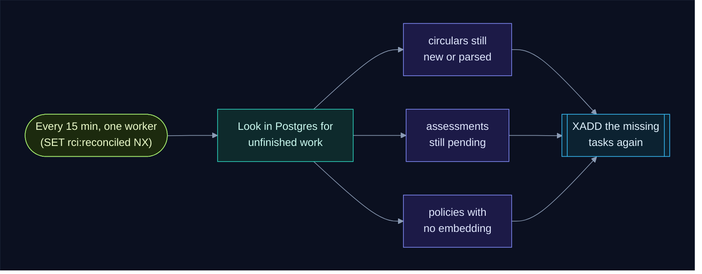

Only one worker does this per interval: the first to set the key `rci:reconciled` (with
`SET … NX EX 900`) wins, and the others skip it. A task queued twice this way is harmless
(see [section 7](#7-locks-when-the-same-task-arrives-twice)).

### The dead-letter stream

A task that fails for good (anything that isn't a service being down or a hiccup) is not
retried forever. The worker marks the circular or the assessment `failed`, saves the error
on it (you see it in the console), acknowledges the task, and copies it to a second stream,
`rci:dead`, for a developer to look at.

> 🔍 **See the queue live:**
> `docker compose exec redis redis-cli XINFO GROUPS rci:tasks` shows how many tasks are
> waiting (`lag`) and being worked on (`pending`); `XRANGE rci:dead - +` lists the failures.

---

## 6. How the worker uses the database

### The tables

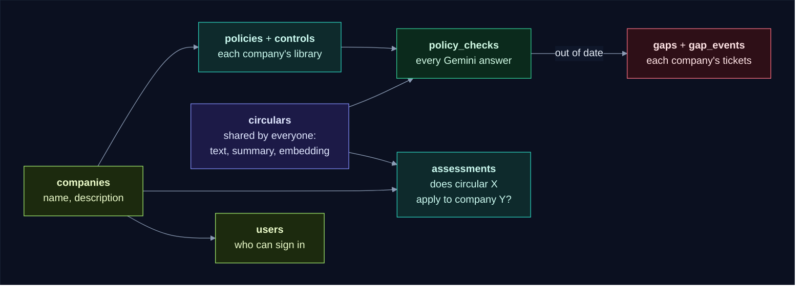

| Table | In one line | The worker… |
|---|---|---|
| `circulars` | every circular, **shared by all companies**: text, summary, embedding | writes each reading step's result |
| `companies` | each company: name and description | reads the description for "does it apply?" |
| `users` | who can sign in, each in one company | never touches it |
| `assessments` | one row per company and circular: pending, done or failed, and "does it apply?" | writes the answer and the status |
| `policies`, `controls` | each company's library | reads them, writes the policies' embeddings |
| `policy_checks` | every Gemini answer "is this policy out of date?" | writes one row per answer |
| `gaps`, `gap_events` | each company's tickets, and their history | opens a gap and its first history line |

### Two kinds of status

The **circular's** status says how far the shared reading has got. Each **assessment's**
status says how far one company has got with it:

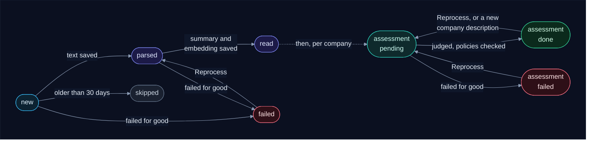

What the console shows you combines the two: a circular is **Analysed** for you once your
assessment is `done`, and **In progress** while it's still `pending`.

### It saves after every step

Each step is saved (a database **commit**) before the next one starts, and the task is
acknowledged only at the end:

```mermaid
%%{init: {"theme": "base", "sequence": {"diagramMarginX": 0, "diagramMarginY": 0}, "themeVariables": {"darkMode": true, "primaryColor": "#16213a", "primaryTextColor": "#e6edf7", "primaryBorderColor": "#475a7a", "lineColor": "#8b9bb4", "secondaryColor": "#1b2436", "tertiaryColor": "#101a2e", "edgeLabelBackground": "#0f172a", "textColor": "#e2e8f0", "actorBkg": "#16213a", "actorBorder": "#5eead4", "actorTextColor": "#e6edf7", "actorLineColor": "#3b4a66", "signalColor": "#8b9bb4", "signalTextColor": "#e2e8f0", "noteBkgColor": "#2a2410", "noteBorderColor": "#fbbf24", "noteTextColor": "#fde68a", "labelBoxBkgColor": "#1e293b", "labelBoxBorderColor": "#64748b", "labelTextColor": "#e2e8f0", "loopTextColor": "#c4b5fd", "sequenceNumberColor": "#0b1020", "activationBkgColor": "#1e293b"}}}%%
sequenceDiagram
    box rgb(11, 16, 32)
        participant K as worker
        participant DB as Postgres
        participant Q as Redis
    end

    rect rgb(13, 20, 36)
        K->>DB: save the text, COMMIT ①
        K->>DB: save the summary, COMMIT ②
        K->>DB: save the embedding (status read), COMMIT ③
        K->>Q: XADD one circular.assess per company, XACK
        K->>DB: save "does it apply to A", COMMIT ④
        K->>DB: save policy answer 1 (and its gap), COMMIT ⑤
        K->>DB: save A's assessment done, COMMIT ⑥
        K->>Q: XACK
    end
```

So if the worker stops at any point, the task is delivered again (section 5), and nothing
already done is lost or paid for twice:

| It stops… | When the task comes back, it… |
|---|---|
| while reading the PDF | reads the PDF again (the only step that restarts) |
| after the text is saved | starts at the summary |
| after the circular is `read` | only queues the companies' assessments again |
| after some policy answers | asks only about the policies not answered yet |
| after the assessment is `done` | has nothing to do |

---

## 7. Locks: when the same task arrives twice

The consumer group never hands **one** task to two workers. But the same **work** can be
queued twice: the watcher queued `circular.read 98`, and the reconciler, seeing 98 still
`parsed`, queued it again. Two workers could each get one copy. To make sure the work is
done once, the worker also takes a **Postgres advisory lock** on the work itself.

### A lock is a sticky note

Before reading circular 98, a worker puts a sticky note on it saying **"mine"**. Another
worker that sees the note leaves it alone. When the first worker is done, it takes the note
off. In Postgres the note is an **advisory lock**: a lock Postgres keeps in memory for a
number the app chooses (a 64-bit key), not tied to any table or row. Three calls matter:

| Call | In sticky-note terms | Answers |
|---|---|---|
| `pg_try_advisory_lock(key)` | **try** to put the note on; if someone else's is there, **don't wait** | `true`: it's yours · `false`: someone else has it |
| `pg_advisory_lock(key)` | put the note on, **waiting** until any other note is removed | (returns when it's yours) |
| `pg_advisory_unlock(key)` | take your note off | |

### "Skip locked": try, and if it's taken, skip it

People call this pattern **"skip locked"**: when several workers share work, each takes an
item, and the others **skip** whatever is **locked** instead of waiting for it. Here it's what
happens when a duplicate `circular.read` reaches a second worker:

```mermaid
%%{init: {"theme": "base", "sequence": {"diagramMarginX": 0, "diagramMarginY": 0}, "themeVariables": {"darkMode": true, "primaryColor": "#16213a", "primaryTextColor": "#e6edf7", "primaryBorderColor": "#475a7a", "lineColor": "#8b9bb4", "secondaryColor": "#1b2436", "tertiaryColor": "#101a2e", "edgeLabelBackground": "#0f172a", "textColor": "#e2e8f0", "actorBkg": "#16213a", "actorBorder": "#5eead4", "actorTextColor": "#e6edf7", "actorLineColor": "#3b4a66", "signalColor": "#8b9bb4", "signalTextColor": "#e2e8f0", "noteBkgColor": "#2a2410", "noteBorderColor": "#fbbf24", "noteTextColor": "#fde68a", "labelBoxBkgColor": "#1e293b", "labelBoxBorderColor": "#64748b", "labelTextColor": "#e2e8f0", "loopTextColor": "#c4b5fd", "sequenceNumberColor": "#0b1020", "activationBkgColor": "#1e293b"}}}%%
sequenceDiagram
    box rgb(11, 16, 32)
        participant Q as Redis stream
        participant K1 as worker 1
        participant DB as Postgres
        participant K2 as worker 2
    end

    rect rgb(13, 20, 36)
        Q-->>K1: circular.read 98 (from the watcher)
        K1->>DB: pg_try_advisory_lock("circular/98")
        DB-->>K1: true: 98 is yours
        Q-->>K2: circular.read 98 again (from the reconciler)
        K2->>DB: pg_try_advisory_lock("circular/98")
        DB-->>K2: false: someone is on it
        K2->>Q: XACK: nothing to do
        Note over K1: reads 98, once
        K1->>DB: pg_advisory_unlock("circular/98")
        K1->>Q: XACK
    end
```

The second worker doesn't wait for 98: the first is already doing exactly that work, so it
acknowledges its copy and moves on to its next task.

### Try, or wait?

Not every task skips. Reading a circular or assessing it is the same work whoever does it,
so a second copy can simply be dropped. But a policy or a company can **change again** while
its task runs (you save a policy twice in a row), and the second task must see the second
edit. Those tasks **wait** for the lock instead, then read the latest state:

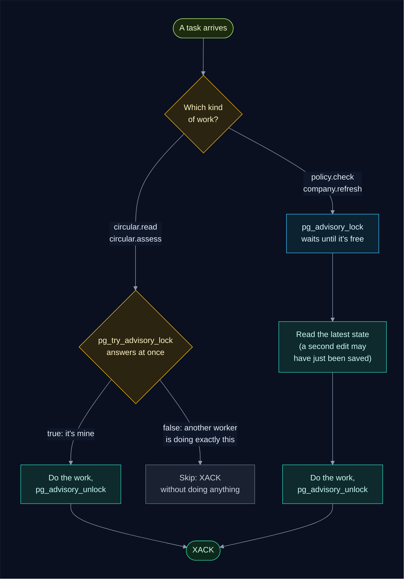

### The notes

| Note (lock name) | Protects | Taken with | If another worker has it |
|---|---|---|---|
| `circular/<id>` | reading one circular | try | skip: the other worker is reading it |
| `assess/<company>/<circular>` | one company's assessment of one circular | try (wait, inside `policy.check`) | skip |
| `policy/<id>` | embedding and checking one policy | wait | wait, then check the latest version |
| `company/<id>` | refreshing one company | wait | wait, then refresh with the latest description |
| `ocr` | the GPU, which reads one page at a time | wait | wait for the GPU |
| `schema` | creating and upgrading tables when a service starts | wait | wait: every service needs the tables |

A lock in Postgres is a **number**, not a name, so each name becomes a number with a hash of
the app, the database **schema** and the name (`lock_key` in `backend/common/common/db.py`).
Every worker gets the same number for the same name, and nothing else ever does: another copy
of the app in its own schema or database never blocks these workers.

### Sharing the GPU

The GPU reads one page at a time, so only one worker runs OCR at once (the `ocr` note). The
others don't sit idle: assessments and policy checks need no GPU, so they run on Gemini at
the same time:

```mermaid
%%{init: {"theme": "base", "sequence": {"diagramMarginX": 0, "diagramMarginY": 0}, "themeVariables": {"darkMode": true, "primaryColor": "#16213a", "primaryTextColor": "#e6edf7", "primaryBorderColor": "#475a7a", "lineColor": "#8b9bb4", "secondaryColor": "#1b2436", "tertiaryColor": "#101a2e", "edgeLabelBackground": "#0f172a", "textColor": "#e2e8f0", "actorBkg": "#16213a", "actorBorder": "#5eead4", "actorTextColor": "#e6edf7", "actorLineColor": "#3b4a66", "signalColor": "#8b9bb4", "signalTextColor": "#e2e8f0", "noteBkgColor": "#2a2410", "noteBorderColor": "#fbbf24", "noteTextColor": "#fde68a", "labelBoxBkgColor": "#1e293b", "labelBoxBorderColor": "#64748b", "labelTextColor": "#e2e8f0", "loopTextColor": "#c4b5fd", "sequenceNumberColor": "#0b1020", "activationBkgColor": "#1e293b"}}}%%
sequenceDiagram
    box rgb(11, 16, 32)
        participant K1 as worker 1
        participant DB as Postgres
        participant O as ocr (GPU)
        participant G as Gemini
        participant K2 as worker 2
    end

    rect rgb(13, 20, 36)
        K1->>DB: circular.read 99: take the ocr lock
        K1->>O: read circular 99, page by page
        K2->>DB: circular.assess (A, 98): no GPU needed
        K2->>G: does 98 apply to A? A's closest policies?
        Note over K1,K2: the Gemini work runs while the GPU reads
        K2->>DB: circular.read 100: pg_advisory_lock(ocr)
        Note left of K2: the GPU is busy: wait
        K1->>DB: save 99's text, release the ocr lock
        K2->>O: read circular 100
        K1->>G: summarise 99
    end
```

That's where extra workers pay off: one circular is on the GPU while other circulars are
judged for each company. Only workers that need the GPU wait for it.

### Why not SQL's FOR UPDATE SKIP LOCKED?

Postgres also has a "skip locked" clause in SQL. It locks a **row** while picking it:

```sql
SELECT id FROM circulars
WHERE status IN ('new', 'parsed')
ORDER BY published_at DESC
LIMIT 1
FOR UPDATE SKIP LOCKED;     -- lock the row found; step over rows other workers have locked
```

It's a good fit when one job is done inside **one transaction**, because a row lock lasts
exactly until that transaction ends with a COMMIT or ROLLBACK. The worker doesn't work that
way on purpose: it **commits after every step** (the OCR text, the summary, each answer), so
that a crash or an outage halfway loses nothing. The first of those commits would also
release the row lock, and the circular would be up for grabs while it's still being worked
on:

```mermaid
%%{init: {"theme": "base", "sequence": {"diagramMarginX": 0, "diagramMarginY": 0}, "themeVariables": {"darkMode": true, "primaryColor": "#16213a", "primaryTextColor": "#e6edf7", "primaryBorderColor": "#475a7a", "lineColor": "#8b9bb4", "secondaryColor": "#1b2436", "tertiaryColor": "#101a2e", "edgeLabelBackground": "#0f172a", "textColor": "#e2e8f0", "actorBkg": "#16213a", "actorBorder": "#5eead4", "actorTextColor": "#e6edf7", "actorLineColor": "#3b4a66", "signalColor": "#8b9bb4", "signalTextColor": "#e2e8f0", "noteBkgColor": "#2a2410", "noteBorderColor": "#fbbf24", "noteTextColor": "#fde68a", "labelBoxBkgColor": "#1e293b", "labelBoxBorderColor": "#64748b", "labelTextColor": "#e2e8f0", "loopTextColor": "#c4b5fd", "sequenceNumberColor": "#0b1020", "activationBkgColor": "#1e293b"}}}%%
sequenceDiagram
    box rgb(11, 16, 32)
        participant W1 as worker 1
        participant DB as Postgres
        participant W2 as worker 2
    end

    rect rgb(13, 20, 36)
        W1->>DB: BEGIN, then SELECT … FOR UPDATE SKIP LOCKED
        DB-->>W1: circular 98 (its row is now locked)
        W2->>DB: BEGIN, then SELECT … FOR UPDATE SKIP LOCKED
        DB-->>W2: skips 98, gives circular 97
        W1->>DB: save 98's OCR text, COMMIT
        Note over DB: the COMMIT ends worker 1's transaction,<br/>so the row lock on 98 is gone
        W2->>DB: done with 97: SELECT … FOR UPDATE SKIP LOCKED
        DB-->>W2: circular 98 (status parsed, and nothing locks it)
        Note over W1,W2: both now run Gemini on 98: double the calls,<br/>and the second to save a verdict fails
    end
```

Keeping one transaction open for the whole circular would avoid that, but it would hold a
database transaction open through minutes of OCR and Gemini calls, and a failure halfway
would throw away every step already done.

**Why the advisory lock survives the commits.** It belongs to a **connection**, not to a
transaction. The worker takes it on a connection of its own (`locks.held` in
`backend/worker/locks.py`) and does the work on another, so the work can commit as often as
it likes, and the lock stays until the worker takes it off:

```mermaid
%%{init: {"theme": "base", "sequence": {"diagramMarginX": 0, "diagramMarginY": 0}, "themeVariables": {"darkMode": true, "primaryColor": "#16213a", "primaryTextColor": "#e6edf7", "primaryBorderColor": "#475a7a", "lineColor": "#8b9bb4", "secondaryColor": "#1b2436", "tertiaryColor": "#101a2e", "edgeLabelBackground": "#0f172a", "textColor": "#e2e8f0", "actorBkg": "#16213a", "actorBorder": "#5eead4", "actorTextColor": "#e6edf7", "actorLineColor": "#3b4a66", "signalColor": "#8b9bb4", "signalTextColor": "#e2e8f0", "noteBkgColor": "#2a2410", "noteBorderColor": "#fbbf24", "noteTextColor": "#fde68a", "labelBoxBkgColor": "#1e293b", "labelBoxBorderColor": "#64748b", "labelTextColor": "#e2e8f0", "loopTextColor": "#c4b5fd", "sequenceNumberColor": "#0b1020", "activationBkgColor": "#1e293b"}}}%%
sequenceDiagram
    box rgb(11, 16, 32)
        participant L as lock connection
        participant DB as Postgres
        participant S as work session
    end

    rect rgb(13, 20, 36)
        L->>DB: pg_try_advisory_lock(key of "circular/98"): held
        S->>DB: save the OCR text, COMMIT
        S->>DB: save the summary, COMMIT
        S->>DB: save the embedding, COMMIT
        Note over L,S: the commits end the work session's transactions,<br/>not the lock: it stays held on its own connection
        L->>DB: pg_advisory_unlock(key of "circular/98")
    end
```

### Three ways to "skip locked", side by side

| | Redis consumer group | `FOR UPDATE SKIP LOCKED` | Postgres advisory lock |
|---|---|---|---|
| What it hands out | each **task** to one worker | each **row** to one transaction | each **piece of work** (a name) to one connection |
| Held until | `XACK` (or taken over after 30 min idle) | the next COMMIT or ROLLBACK | `pg_advisory_unlock`, or the connection closes |
| Survives the step-by-step commits? | yes | **no** | yes |
| Used here for | sharing tasks between workers | nothing | making the same work queued twice run once |

### If a worker dies

If a worker crashes or its machine restarts, its database connections close and **Postgres
removes all its notes by itself**. Its task was never acknowledged, so it's still pending in
Redis: the same container picks it up when it restarts, or another worker takes it over after
30 minutes. The work carries on from the last saved step. Nothing gets stuck.

> 🔍 **See the notes live.** While workers are busy, this counts the locks each database
> connection holds (each key shows up split in two halves, as `classid` and `objid`):
> `docker compose exec postgres psql -U rci -d rci -c "select pid, count(*) from pg_locks where locktype = 'advisory' group by pid"`

---

## 8. Companies and logins

Every user belongs to **one company** and signs in with an email and password. The api gives
back a **token** (a JWT) that names the user and the company, and the console sends it with
every call:

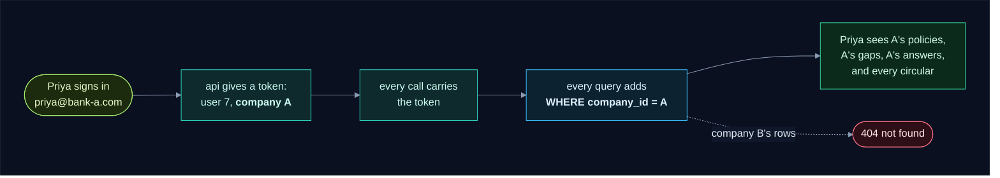

- **Circulars are shared.** They're public, and reading one is the same for everyone, so
  it's done once. Everything that depends on the company is kept per company:
  `assessments`, `policies`, `controls`, `policy_checks` (through the policy), `gaps`.
- **Policy codes are per company.** Two companies can each have a POL-KYC.
- **Another company's row is "not found"**, never "forbidden", so ids reveal nothing.
- **The worker works for everyone.** Tasks carry the company id, and every query the worker
  makes for a company is filtered by it.

---

## 9. When something goes wrong

| What happens | Example | What the worker does | What you do |
|---|---|---|---|
| a service is down | OCR still loading, Gemini quota used up | leaves the task unacknowledged, waits a minute, tries again | nothing, or raise your quota |
| a hiccup | a timeout, a server error, an answer in the wrong shape | retries the task up to 3 times | nothing |
| anything else | the PDF has no text at all | marks the circular (or your assessment) `failed` with the error, copies the task to `rci:dead` | open the circular, read the error, press **Reprocess** |
| Redis is down | a restart | the api still saves your change; the worker waits for Redis; the reconciler queues what was missed | nothing |
| a worker dies | the machine restarts | its task is picked up again (section 5) | nothing |

---

## 10. Quick reference

**What each task reads and writes:**

| Task | Reads | Writes |
|---|---|---|
| `circular.read` | the PDF from S3 (or a twin's saved text) | `circulars`: `text`, summary fields, `embedding`, status `parsed` then `read`; an `assessments` row per company; queues `circular.assess` |
| `circular.assess` | `companies.profile`, the company's `policies`, `controls`, `policy_checks` | `assessments`, `policy_checks`, `gaps`, `gap_events` |
| `policy.check` | the policy, the company's recent circulars | `policies.embeddings`, `policy_checks`, `gaps`, `gap_events` |
| `company.refresh` | recent read `circulars` | `assessments` rows; queues `circular.assess` |

**Settings you might change** (in `.env`):

| Setting | Default | What it does |
|---|---|---|
| `WORKERS` | 1 | how many workers run side by side |
| `MATCH_TOP_K` | 3 | how many closest policies Gemini checks per circular |
| `LOOKBACK_DAYS` | 30 | new circulars older than this are skipped; new policies and new companies are checked against this many days |
| `OCR_MAX_PAGES` | 20 | pages read per PDF |
| `RECONCILE_MINUTES` | 15 | how often one worker looks for work whose task went missing |
| `CLAIM_IDLE_SECONDS` | 1800 | how long a task can sit with a silent worker before another takes it |
| `GEMINI_MODEL_NAME` | `gemini-3.5-flash` | the model that answers the questions |

**Want more?**

- [How it works](how_it_works.md), the main guide to the whole app.
- [Worker internals](backend/worker/INTERNALS.md): every function, every SQL statement,
  every Redis command, commit and lock, for developers changing the code.
