# How the worker works

      

The **worker** is the part of the app that reads circulars and checks your policies. This
guide tells its two main stories, step by step:

- **A regulator releases a new circular.** How it's read, judged and checked against your
  policies.
- **You add a new policy.** How it's checked against the circulars you already have.

At every step you'll see what the worker does **and exactly what changes in the database**.

**Reading the diagrams.** Each colour means the same thing in every diagram:

       

**Contents**

1. [The worker in one picture](#1-the-worker-in-one-picture)
2. [Story 1: a new circular is released](#2-story-1-a-new-circular-is-released)
3. [Story 2: you add a new policy](#3-story-2-you-add-a-new-policy)
4. [Other things you can do](#4-other-things-you-can-do)
5. [How the worker uses the database](#5-how-the-worker-uses-the-database)
6. [Locks: pg_try_advisory_lock and "skip locked"](#6-locks-pg_try_advisory_lock-and-skip-locked)
7. [When something goes wrong](#7-when-something-goes-wrong)
8. [Quick reference](#8-quick-reference)

---

## 1. The worker in one picture

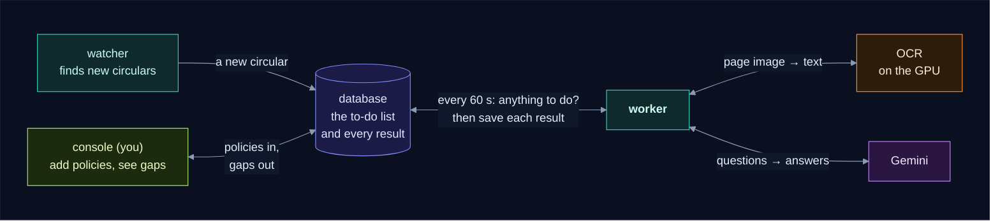

Three things to know before the stories:

- **The database is the to-do list.** Nobody calls the worker. The watcher and the console
  write to the database, and the worker checks it **every 60 seconds** for something to do.
- **Checking is free.** When there's nothing to do, the worker makes no OCR or Gemini call.
- **It saves after every step.** If it stops halfway (a crash, a restart, Gemini down), it
  carries on from the last saved step, and never pays for the same work twice.

---

## 2. Story 1: a new circular is released

**The setting.** RBI publishes a circular about accounts linked to a banned organisation.
Your company is described in the console as an NBFC, and you have four policies tagged RBI:
POL-KYC, POL-DRP, POL-DLP and POL-IT.

Here is the whole journey. Each box is one step, and the circular's **status** tells you how
far it has got:

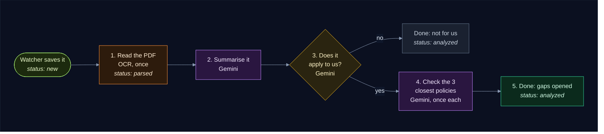

And the same journey in time order, with every visit to the database:

```mermaid
%%{init: {"theme": "base", "sequence": {"diagramMarginX": 0, "diagramMarginY": 0}, "themeVariables": {"darkMode": true, "primaryColor": "#16213a", "primaryTextColor": "#e6edf7", "primaryBorderColor": "#475a7a", "lineColor": "#8b9bb4", "secondaryColor": "#1b2436", "tertiaryColor": "#101a2e", "edgeLabelBackground": "#0f172a", "textColor": "#e2e8f0", "actorBkg": "#16213a", "actorBorder": "#5eead4", "actorTextColor": "#e6edf7", "actorLineColor": "#3b4a66", "signalColor": "#8b9bb4", "signalTextColor": "#e2e8f0", "noteBkgColor": "#2a2410", "noteBorderColor": "#fbbf24", "noteTextColor": "#fde68a", "labelBoxBkgColor": "#1e293b", "labelBoxBorderColor": "#64748b", "labelTextColor": "#e2e8f0", "loopTextColor": "#c4b5fd", "sequenceNumberColor": "#0b1020", "activationBkgColor": "#1e293b"}}}%%
sequenceDiagram
    autonumber
    box rgb(11, 16, 32)
        participant W as watcher
        participant DB as database
        participant K as worker
        participant O as OCR (GPU)
        participant G as Gemini
    end

    rect rgb(13, 20, 36)
        W->>DB: INSERT circular 98 (status new)
        Note over K: next round, within 60 s
        K->>DB: anything to do?
        DB-->>K: circular 98
        K->>O: read each page of the PDF
        O-->>K: the text
        K->>DB: save the text (status parsed)
        K->>G: summarise it
        G-->>K: who it's for, summary, obligations
        K->>DB: save them
        K->>G: does it apply to our company?
        G-->>K: yes, and why
        K->>DB: save applicable = true
        Note over K: score the policies (maths),<br/>keep the 3 closest
        loop each of the 3 closest policies
            K->>G: is this policy out of date?
            G-->>K: yes or no (with a draft if yes)
            K->>DB: save the answer, and a gap if out of date
        end
        K->>DB: save status analyzed
    end
```

Now step by step, with the circular's row in the `circulars` table after each one. **Bold**
marks what changed.

### Step 0: the watcher saves it

The watcher finds the circular on RBI's website, stores the PDF in S3, and adds a row.

| id | source | title | status | text |
|---|---|---|---|---|
| 98 | RBI | Designation of terrorist organisation… | **new** | *(empty)* |

`status = new` is the worker's to-do: on its next round (within 60 seconds) it picks it up.

### Step 1: read the PDF

The worker downloads the PDF and sends each page to the **OCR** model on the GPU, which
turns the page image into text. It then saves the text.

| id | status | text |
|---|---|---|
| 98 | **parsed** | **"RESERVE BANK OF INDIA … (12,408 characters)"** |

From now on the PDF is never read again: every later step uses this saved text. If another
circular ever has the exact same PDF, it copies this text instead of running OCR.

### Step 2: summarise it

The worker asks **Gemini** to read the text and answer in a fixed shape: who it's addressed
to, a short summary, and every obligation.

| id | addressed_to | summary | requirements |
|---|---|---|---|
| 98 | **All Regulated Entities… Non-Banking Financial Companies…** | **RBI designates a new terrorist organisation under the UAPA…** | **["Report accounts resembling the designated entity to FIU-IND", "Advise the Ministry of Home Affairs", …]** |

### Step 3: does it apply to us?

The worker asks Gemini a second question: given **your company description**, does this
circular apply to you? The answer comes with a reason.

| id | applicable | applies_reason |
|---|---|---|
| 98 | **true** | **"The circular is addressed to NBFCs, and the company is an NBFC."** |

If the answer were **false**, the story would end here: the circular is marked `analyzed`,
and no policy is checked. If you haven't described your company yet, `applicable` stays
empty and the story also ends here.

### Step 4: check the closest policies

Asking Gemini about every policy would be slow and costly, so the worker first **scores**
each RBI policy by how close it is to the circular. This is quick arithmetic on saved
"embeddings" (lists of numbers that capture meaning), with no Gemini call. Only the
**3 closest** go to Gemini:

| Policy | Score | Sent to Gemini? |
|---|---|---|
| POL-KYC | 0.82 | ✅ top 3 |
| POL-DRP | 0.58 | ✅ top 3 |
| POL-DLP | 0.55 | ✅ top 3 |
| POL-IT | 0.31 | no: clearly unrelated |

For each of the 3, Gemini reads the circular and the policy text and answers: **is this
policy now out of date?** Every answer is saved in `policy_checks`, so the same question is
never asked twice:

| circular | policy | version | similarity | impacted |
|---|---|---|---|---|
| **98** | **POL-KYC** | **1** | **0.82** | **true** |
| **98** | **POL-DRP** | **1** | **0.58** | **false** |
| **98** | **POL-DLP** | **1** | **0.55** | **false** |

POL-KYC is out of date, so the worker opens a **gap**, a ticket for the policy's owner with
a draft of the new wording, and writes the first line of its history:

| table | new row |
|---|---|
| `gaps` | **POL-KYC · severity high · due in 7 days · owner head.kyc@… · draft: "Add clause 2A: …"** |
| `gap_events` | **agent · opened · "The policy does not require reporting to FIU-IND…"** |

The verdict, the gap and its history line are saved **together**: all of them or none.

### Step 5: done

| id | status |
|---|---|
| 98 | **analyzed** |

The gap now shows up on the console's **Gaps** page, and the circular's page lists the three
policies it was checked against.

**What it cost:** OCR once per page, 2 Gemini questions (summary, applies?), 1 embedding
(the circular), and 3 policy checks.

---

## 3. Story 2: you add a new policy

**The setting.** A week later you add **POL-AML**, your anti-money-laundering policy, tagged
RBI. The circulars from Story 1 are already analysed. Does the new policy have gaps too?

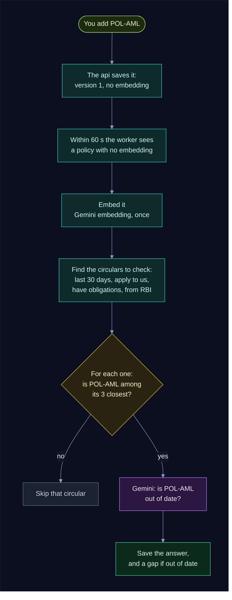

In time order:

```mermaid
%%{init: {"theme": "base", "sequence": {"diagramMarginX": 0, "diagramMarginY": 0}, "themeVariables": {"darkMode": true, "primaryColor": "#16213a", "primaryTextColor": "#e6edf7", "primaryBorderColor": "#475a7a", "lineColor": "#8b9bb4", "secondaryColor": "#1b2436", "tertiaryColor": "#101a2e", "edgeLabelBackground": "#0f172a", "textColor": "#e2e8f0", "actorBkg": "#16213a", "actorBorder": "#5eead4", "actorTextColor": "#e6edf7", "actorLineColor": "#3b4a66", "signalColor": "#8b9bb4", "signalTextColor": "#e2e8f0", "noteBkgColor": "#2a2410", "noteBorderColor": "#fbbf24", "noteTextColor": "#fde68a", "labelBoxBkgColor": "#1e293b", "labelBoxBorderColor": "#64748b", "labelTextColor": "#e2e8f0", "loopTextColor": "#c4b5fd", "sequenceNumberColor": "#0b1020", "activationBkgColor": "#1e293b"}}}%%
sequenceDiagram
    autonumber
    box rgb(11, 16, 32)
        participant U as you (console)
        participant A as api
        participant DB as database
        participant K as worker
        participant G as Gemini
    end

    rect rgb(13, 20, 36)
        U->>A: add POL-AML
        A->>DB: INSERT the policy (version 1, no embedding)
        Note over K: next round, within 60 s
        K->>DB: any policy with no embedding?
        DB-->>K: POL-AML
        K->>G: embed its text
        G-->>K: the numbers
        K->>DB: save the embedding
        K->>DB: recent circulars that apply?
        DB-->>K: circular 98
        Note over K: rank the policies for 98:<br/>POL-AML is in the top 3<br/>and was never checked
        K->>G: is POL-AML out of date for circular 98?
        G-->>K: yes, with a draft
        K->>DB: save the answer and the gap
    end
```

Step by step, with the database:

### Step 1: you save it

The console sends it to the api, which inserts the row. It has **no embedding** yet: that's
the worker's signal that it's new.

| code | title | regulators | version | embeddings |
|---|---|---|---|---|
| POL-AML | Anti-Money Laundering Policy | ["RBI"] | **1** | ***(empty)*** |

### Step 2: the worker embeds it

On its next round (within 60 seconds), the worker sees a policy with no embedding. It sends
the policy's text to Gemini's embedding model (split into 5,000-character pieces, so nothing
in a long policy is lost) and saves the numbers.

| code | embeddings | embedding_model |
|---|---|---|
| POL-AML | **[[0.012, -0.034, …], …] (one list per piece)** | **gemini-embedding-001** |

### Step 3: find the circulars to check it against

The library has changed, so the worker **catches up**: it looks at the circulars of the last
**30 days** that apply to your company, create obligations, and come from a regulator the
new policy lists (RBI). Circular 98 from Story 1 qualifies.

### Step 4: is the new policy among the 3 closest?

For circular 98 the worker scores all RBI policies again, now including POL-AML:

| Policy | Score | Top 3? | Already checked? |
|---|---|---|---|
| POL-KYC | 0.82 | ✅ | yes (Story 1): skip |
| **POL-AML** | **0.79** | ✅ | **no: ask Gemini** |
| POL-DRP | 0.58 | ✅ | yes (Story 1): skip |
| POL-DLP | 0.55 | no | yes (Story 1) |

Only **one** Gemini question is asked: the pair nobody has checked yet. POL-DLP dropping out
of the top 3 changes nothing: its answer from Story 1 stays.

### Step 5: save the answer

Gemini finds POL-AML doesn't mention the new designation, so it's out of date:

| table | new row |
|---|---|
| `policy_checks` | **98 · POL-AML · version 1 · 0.79 · impacted true** |
| `gaps` | **POL-AML · severity high · due in 7 days · owner of POL-AML** |
| `gap_events` | **agent · opened · "…"** |

**What it cost:** 1 embedding (the policy) and 1 check. From now on POL-AML is simply part
of the library: every new RBI circular that applies ranks it with the others.

> 💡 **No restart needed.** The worker notices the new policy on its next round, within a
> minute.

---

## 4. Other things you can do

Everything you do in the console is a change in the database. The worker notices it on its
next round, and redoes **only** what the change affects:

| You… | The database change | What the worker does next | Gemini cost |
|---|---|---|---|
| edit a policy's **text** | version + 1, embeddings cleared | embeds it, checks the new version against recent circulars (skipping pairs that already have a gap) | 1 embedding + 1 per top-3 circular |
| edit its **title** | embeddings cleared | embeds it; checks only pairs never checked | 1 embedding |
| edit its **regulators** | `updated_at` changes | checks it against the newly listed regulators' circulars | 1 per top-3 circular |
| edit its **owner** | `updated_at` changes | nothing to redo | none |
| change the **company description** | every circular's `applicable` cleared; analysed ones back to `parsed` | asks "does it apply?" again for each (step 3), then checks pairs never checked | 1 per circular, plus new checks |
| press **Reprocess** on a circular | its summary, applicable and "up to date" answers cleared; status back to `parsed` | steps 2 to 4 again, **no OCR**; gaps are kept | 2 + its checks |

---

## 5. How the worker uses the database

### The tables

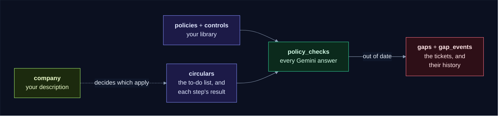

| Table | In one line | The worker… |
|---|---|---|
| `circulars` | every circular, and everything learned about it | reads the to-do list, writes each step's result |
| `company` | your company description (one row) | reads it for step 3 |
| `policies` | your policies, with their embeddings | reads them, writes their embeddings |
| `controls` | the checks under each policy | reads them for the Gemini question |
| `policy_checks` | every Gemini answer "is this policy out of date?" | writes one row per answer |
| `gaps`, `gap_events` | the tickets, and their history | opens a gap and its first history line |

### The status column is the to-do list

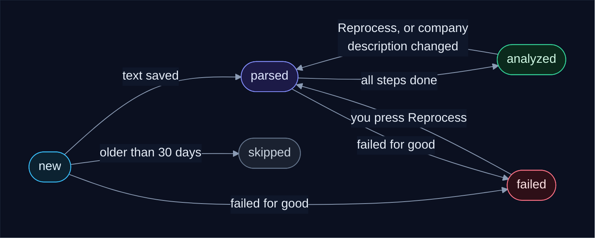

The worker only ever picks up circulars that are **new** (start at step 1) or **parsed** (start
at step 2). Everything else is either finished (`analyzed`), set aside (`skipped`: published
more than 30 days ago), or waiting for you (`failed`: open it to see why, then press
**Reprocess**).

### It saves after every step

Each step is saved (a database **commit**) before the next one starts:

```mermaid
%%{init: {"theme": "base", "sequence": {"diagramMarginX": 0, "diagramMarginY": 0}, "themeVariables": {"darkMode": true, "primaryColor": "#16213a", "primaryTextColor": "#e6edf7", "primaryBorderColor": "#475a7a", "lineColor": "#8b9bb4", "secondaryColor": "#1b2436", "tertiaryColor": "#101a2e", "edgeLabelBackground": "#0f172a", "textColor": "#e2e8f0", "actorBkg": "#16213a", "actorBorder": "#5eead4", "actorTextColor": "#e6edf7", "actorLineColor": "#3b4a66", "signalColor": "#8b9bb4", "signalTextColor": "#e2e8f0", "noteBkgColor": "#2a2410", "noteBorderColor": "#fbbf24", "noteTextColor": "#fde68a", "labelBoxBkgColor": "#1e293b", "labelBoxBorderColor": "#64748b", "labelTextColor": "#e2e8f0", "loopTextColor": "#c4b5fd", "sequenceNumberColor": "#0b1020", "activationBkgColor": "#1e293b"}}}%%
sequenceDiagram
    box rgb(11, 16, 32)
        participant K as worker
        participant DB as database
    end

    rect rgb(13, 20, 36)
        K->>DB: save the text, COMMIT ①
        K->>DB: save the summary, COMMIT ②
        K->>DB: save "does it apply", COMMIT ③
        K->>DB: save policy answer 1 (and its gap), COMMIT ④
        K->>DB: save policy answer 2, COMMIT ⑤
        K->>DB: save status analyzed, COMMIT ⑥
    end
```

So if the worker stops at any point, nothing already done is lost or paid for twice:

| It stops… | Next time it… |
|---|---|
| while reading the PDF | reads the PDF again (the only step that restarts) |
| after the text is saved | starts at the summary |
| after the summary | starts at "does it apply?" |
| after some policy answers | asks only about the policies not answered yet |
| after `analyzed` | has nothing to do |

### Several workers

With one worker, there's nobody to share with. You can run several (`WORKERS=3` in `.env`)
to get through a backlog faster, and then they need a way to stay out of each other's way:
**locks**. The next section explains them.

---

## 6. Locks: pg_try_advisory_lock and "skip locked"

Locks only matter when **several workers** run at once. With one worker, every lock is
simply always free.

### A lock is a sticky note

Picture the to-do list on a board. Before working on circular 98, a worker puts a sticky
note on it saying **"mine"**. Another worker who sees the note doesn't touch that circular.
When the first worker is done, it removes the note.

In Postgres, the sticky note is an **advisory lock**, and there are three calls:

| Call | In sticky-note terms | Answers |
|---|---|---|
| `pg_try_advisory_lock(key)` | **try** to put the note on. If someone else's note is already there, **don't wait** | `true`: it's yours now · `false`: someone else has it |
| `pg_advisory_lock(key)` | put the note on, **waiting** until any other note is removed | (returns when it's yours) |
| `pg_advisory_unlock(key)` | take your note off | |

### "Skip locked": try, and if it's taken, skip it

The worker uses **`pg_try_advisory_lock`** for circulars. If another worker already has a
circular, it doesn't wait for it: it **skips** it and tries the next one. That pattern is
called **"skip locked"**, and it keeps every worker busy without two of them ever working on
the same circular:

```mermaid
%%{init: {"theme": "base", "sequence": {"diagramMarginX": 0, "diagramMarginY": 0}, "themeVariables": {"darkMode": true, "primaryColor": "#16213a", "primaryTextColor": "#e6edf7", "primaryBorderColor": "#475a7a", "lineColor": "#8b9bb4", "secondaryColor": "#1b2436", "tertiaryColor": "#101a2e", "edgeLabelBackground": "#0f172a", "textColor": "#e2e8f0", "actorBkg": "#16213a", "actorBorder": "#5eead4", "actorTextColor": "#e6edf7", "actorLineColor": "#3b4a66", "signalColor": "#8b9bb4", "signalTextColor": "#e2e8f0", "noteBkgColor": "#2a2410", "noteBorderColor": "#fbbf24", "noteTextColor": "#fde68a", "labelBoxBkgColor": "#1e293b", "labelBoxBorderColor": "#64748b", "labelTextColor": "#e2e8f0", "loopTextColor": "#c4b5fd", "sequenceNumberColor": "#0b1020", "activationBkgColor": "#1e293b"}}}%%
sequenceDiagram
    box rgb(11, 16, 32)
        participant W1 as worker 1
        participant DB as Postgres
        participant W2 as worker 2
    end

    rect rgb(13, 20, 36)
        W1->>DB: pg_try_advisory_lock("circular/98")
        DB-->>W1: true: 98 is yours
        W2->>DB: pg_try_advisory_lock("circular/98")
        DB-->>W2: false: someone has it
        Note left of W2: don't wait: skip it
        W2->>DB: pg_try_advisory_lock("circular/97")
        DB-->>W2: true: 97 is yours
        Note over W1,W2: both work at the same time, on different circulars
        W1->>DB: pg_advisory_unlock("circular/98")
        W2->>DB: pg_advisory_unlock("circular/97")
    end
```

This is the loop each worker runs over the to-do list:

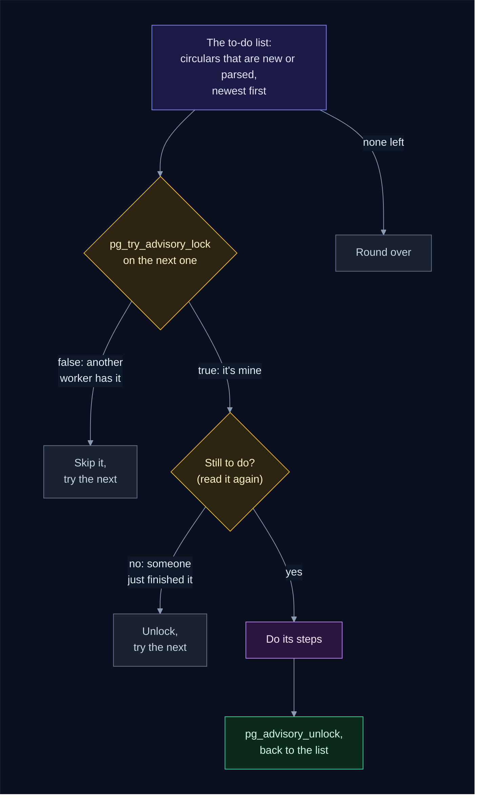

Why **read it again** after taking the note? Between reading the to-do list and taking the
note, another worker may have just finished that circular. Checking again means a finished
circular is never started twice.

### The four notes

| Note (lock name) | Protects | If another worker has it |
|---|---|---|
| `circular/<id>`, one per circular | one circular while it's processed | skip it, try the next (`pg_try_advisory_lock`) |
| `ocr` | the GPU, which reads one page at a time | take a circular that's already read instead; if there's none, wait for the GPU (`pg_advisory_lock`) |
| `library` | embedding new policies and the catch-up | skip that part this round |
| `schema` | creating tables when a service starts | wait (every service needs the tables) |

A lock in Postgres is a **number**, not a name. So the worker turns each name into a number
with a hash of the app, the database **schema** and the name (`lock_key` in
`backend/common/common/db.py`). Every worker gets the same number for the same name, and two
companies running their own copy of the app (a schema or a database each) never block each
other.

### Why not SQL's FOR UPDATE SKIP LOCKED?

Postgres also has a **"skip locked"** clause in SQL: `SELECT … FOR UPDATE SKIP LOCKED` locks
the **row** it picks, and other workers skip locked rows. It's the classic way to build a job
queue. But a row lock falls off at the next **save** (COMMIT), and the worker saves after
every step. So the note would fall off right after step 1, while the circular is still being
worked on, and another worker could grab the same circular:

```mermaid
%%{init: {"theme": "base", "sequence": {"diagramMarginX": 0, "diagramMarginY": 0}, "themeVariables": {"darkMode": true, "primaryColor": "#16213a", "primaryTextColor": "#e6edf7", "primaryBorderColor": "#475a7a", "lineColor": "#8b9bb4", "secondaryColor": "#1b2436", "tertiaryColor": "#101a2e", "edgeLabelBackground": "#0f172a", "textColor": "#e2e8f0", "actorBkg": "#16213a", "actorBorder": "#5eead4", "actorTextColor": "#e6edf7", "actorLineColor": "#3b4a66", "signalColor": "#8b9bb4", "signalTextColor": "#e2e8f0", "noteBkgColor": "#2a2410", "noteBorderColor": "#fbbf24", "noteTextColor": "#fde68a", "labelBoxBkgColor": "#1e293b", "labelBoxBorderColor": "#64748b", "labelTextColor": "#e2e8f0", "loopTextColor": "#c4b5fd", "sequenceNumberColor": "#0b1020", "activationBkgColor": "#1e293b"}}}%%
sequenceDiagram
    box rgb(11, 16, 32)
        participant W1 as worker 1
        participant DB as Postgres
        participant W2 as worker 2
    end

    rect rgb(13, 20, 36)
        W1->>DB: SELECT … FOR UPDATE SKIP LOCKED
        DB-->>W1: circular 98 (row locked)
        W1->>DB: save the text, COMMIT
        Note over DB: the COMMIT removes the row lock,<br/>though worker 1 is still on step 2
        W2->>DB: SELECT … FOR UPDATE SKIP LOCKED
        DB-->>W2: circular 98 again
        Note over W1,W2: both run Gemini on 98: double the cost
    end
```

The advisory lock doesn't have this problem, because it lives on **its own database
connection**, separate from the one that saves the steps. The saves don't touch it; it stays
until the worker takes it off:

```mermaid
%%{init: {"theme": "base", "sequence": {"diagramMarginX": 0, "diagramMarginY": 0}, "themeVariables": {"darkMode": true, "primaryColor": "#16213a", "primaryTextColor": "#e6edf7", "primaryBorderColor": "#475a7a", "lineColor": "#8b9bb4", "secondaryColor": "#1b2436", "tertiaryColor": "#101a2e", "edgeLabelBackground": "#0f172a", "textColor": "#e2e8f0", "actorBkg": "#16213a", "actorBorder": "#5eead4", "actorTextColor": "#e6edf7", "actorLineColor": "#3b4a66", "signalColor": "#8b9bb4", "signalTextColor": "#e2e8f0", "noteBkgColor": "#2a2410", "noteBorderColor": "#fbbf24", "noteTextColor": "#fde68a", "labelBoxBkgColor": "#1e293b", "labelBoxBorderColor": "#64748b", "labelTextColor": "#e2e8f0", "loopTextColor": "#c4b5fd", "sequenceNumberColor": "#0b1020", "activationBkgColor": "#1e293b"}}}%%
sequenceDiagram
    box rgb(11, 16, 32)
        participant L as lock connection
        participant DB as Postgres
        participant S as work connection
    end

    rect rgb(13, 20, 36)
        L->>DB: pg_try_advisory_lock("circular/98"): taken
        S->>DB: save the text, COMMIT
        S->>DB: save the summary, COMMIT
        S->>DB: save each answer, COMMIT
        Note over L,S: the saves don't touch the lock
        L->>DB: pg_advisory_unlock("circular/98")
    end
```

### If a worker dies

If a worker crashes or its machine restarts, its database connections close, and **Postgres
removes all its notes by itself**. The circular is still `new` or `parsed` in the table, so
on the next round another worker (or the same one, after a restart) claims it and carries on
from the last saved step. Nothing gets stuck.

> 🔍 **See the notes live.** While workers are busy, this shows how many locks each database
> connection holds:
> `docker compose exec postgres psql -U rci -d rci -c "select pid, count(*) from pg_locks where locktype = 'advisory' group by pid"`

---

## 7. When something goes wrong

| What happens | Example | What the worker does | What you do |
|---|---|---|---|
| a service is down | OCR is still loading, Gemini quota used up | waits and tries again every minute; the circular keeps its status | nothing, or raise your quota |
| a hiccup | a timeout, a server error, an answer in the wrong shape | tries the circular up to 3 times | nothing |
| anything else | the PDF has no text at all | marks the circular `failed` and saves the error on it | open it, read the error, press **Reprocess** |

---

## 8. Quick reference

**What each step reads and writes:**

| Step | Reads | Writes to `circulars` | Other tables written |
|---|---|---|---|
| 1. read the PDF | the PDF from S3 (or a twin's saved text) | `text`, `status = parsed` | |
| 2. summarise | `text` | `addressed_to`, `summary`, `requirements` | |
| 3. applies? | `company.profile` | `applicable`, `applies_reason` | |
| 4. check policies | `policies`, `controls`, `policy_checks`, `gaps` | `embedding` | `policy_checks`, `gaps`, `gap_events` |
| 5. done | | `status = analyzed` | |
| new policy | `policies`, recent `circulars` | | `policies.embeddings`, `policy_checks`, `gaps`, `gap_events` |

**Settings you might change** (in `.env`):

| Setting | Default | What it does |
|---|---|---|
| `POLL_SECONDS` | 60 | how often the worker checks for work |
| `MATCH_TOP_K` | 3 | how many closest policies Gemini checks per circular |
| `LOOKBACK_DAYS` | 30 | new policies are checked against this many days of circulars; older new circulars are skipped |
| `OCR_MAX_PAGES` | 20 | pages read per PDF |
| `WORKERS` | 1 | how many workers run side by side |
| `GEMINI_MODEL_NAME` | `gemini-3.5-flash` | the model that answers the questions |

**Want more?**

- [The worker in plain words](how_it_works.md#4-the-worker-in-plain-words) and
  [Reading its log](how_it_works.md#reading-its-log), in the main guide.
- [Worker internals](backend/worker/INTERNALS.md): every function, every SQL statement,
  every commit and lock, for developers changing the code.
