# How the worker works

       

The **worker** is the part of the app that reads circulars and checks each company's
policies. This guide tells its two main stories, step by step:

- **A regulator releases a new circular.** How it's read once, then judged and checked for
  every company that uses the app.
- **You add a new policy.** How it's checked against the circulars you already have.

At every step you'll see what the worker does, **what goes through the task queue**, and
**exactly what changes in the database**.

**Reading the diagrams.** Each colour means the same thing in every diagram:

        

**Contents**

1. [The worker in one picture](#1-the-worker-in-one-picture)
2. [Story 1: a new circular is released](#2-story-1-a-new-circular-is-released)
3. [Story 2: you add a new policy](#3-story-2-you-add-a-new-policy)
4. [Other things you can do](#4-other-things-you-can-do)
5. [The task queue: Redis Streams](#5-the-task-queue-redis-streams)
6. [How the worker uses the database](#6-how-the-worker-uses-the-database)
7. [No duplicates: each task is queued once](#7-no-duplicates-each-task-is-queued-once)
8. [Companies and logins](#8-companies-and-logins)
9. [When something goes wrong](#9-when-something-goes-wrong)
10. [Quick reference](#10-quick-reference)

---

## 1. The worker in one picture

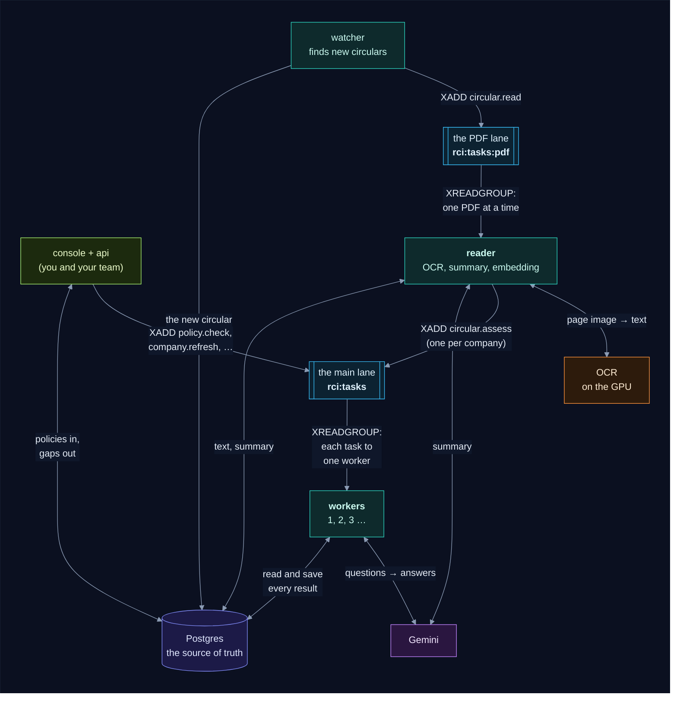
```mermaid
%%{init: {"theme": "base", "flowchart": {"diagramPadding": 0}, "themeVariables": {"darkMode": true, "primaryColor": "#16213a", "primaryTextColor": "#e6edf7", "primaryBorderColor": "#475a7a", "lineColor": "#8b9bb4", "secondaryColor": "#1b2436", "tertiaryColor": "#101a2e", "edgeLabelBackground": "#0f172a", "textColor": "#e2e8f0", "clusterBkg": "#0f1728", "clusterBorder": "#2b3a55", "titleColor": "#c4b5fd", "nodeTextColor": "#e6edf7"}}}%%
flowchart TD
    subgraph canvas[" "]
        direction TB
        watcher["watcher<br/>finds new circulars"] -->|"XADD circular.read"| P[["the PDF lane<br/><b>rci:tasks:pdf</b>"]]
        console["console + api<br/>(you and your team)"] -->|"XADD policy.check,<br/>company.refresh, …"| Q[["the main lane<br/><b>rci:tasks</b>"]]
        P -->|"XREADGROUP:<br/>one PDF at a time"| R["<b>reader</b><br/>OCR, summary, embedding"]
        R <-->|"page image → text"| O["OCR<br/>on the GPU"]
        R -->|"XADD circular.assess<br/>(one per company)"| Q
        Q -->|"XREADGROUP:<br/>each task to<br/>one worker"| K["<b>workers</b><br/>1, 2, 3 …"]
        K <-->|"questions → answers"| G["Gemini"]
        R <-->|"summary"| G
        R <-->|"text, summary"| DB[("Postgres<br/>the source of truth")]
        K <-->|"read and save<br/>every result"| DB
        console <-->|"policies in,<br/>gaps out"| DB
        watcher -->|"the new circular"| DB
    end
    classDef svc fill:#0e2a2c,stroke:#2dd4bf,color:#ccfbf1
    classDef data fill:#1c1a47,stroke:#818cf8,color:#e0e7ff
    classDef ext fill:#2a1640,stroke:#c084fc,color:#f3e8ff
    classDef gpu fill:#2d1b0c,stroke:#fb923c,color:#ffedd5
    classDef ask fill:#2a2410,stroke:#fbbf24,color:#fef3c7
    classDef ok fill:#0b2a1c,stroke:#34d399,color:#d1fae5
    classDef bad fill:#2e0f17,stroke:#fb7185,color:#ffe4e6
    classDef start fill:#1c2a0e,stroke:#a7ef6f,color:#ecfccb
    classDef muted fill:#1a2130,stroke:#64748b,color:#cbd5e1
    classDef queue fill:#0c2231,stroke:#38bdf8,color:#e0f2fe
    class watcher,R,K svc
    class console start
    class P,Q queue
    class DB data
    class O gpu
    class G ext
    style canvas fill:#0b1020,stroke:#1e293b,color:#0b1020
```

Five things to know before the stories:

- **Work arrives as tasks.** When something happens (a new circular, a policy saved, a
  company described), the service that saw it adds a **task** to a Redis stream. A task is
  tiny: a type and some ids, like `circular.read 98`.
- **Two lanes.** Reading a PDF takes minutes; everything else takes seconds. So
  `circular.read` goes to the **PDF lane**, taken by the **reader**, and every other task to
  the **main lane**, taken by the **workers**. A quick task never waits behind a PDF. The
  reader and the workers are the same program, each told which lane to take
  ([section 5](#two-lanes-a-pdf-never-holds-up-a-quick-task)).
- **No polling.** A worker waits on its lane and starts a task **the moment it's added**.
  When there's nothing to do, it just waits: no OCR, no Gemini, no database work. The
  lanes are its only source of work (section 5).
- **Each task goes to exactly one worker**, however many run. Run 3 and they share the tasks.
- **Postgres is the truth, Redis is the to-do list.** Every result is saved in Postgres after
  every step. A task only says *what to look at*; the worker reads the database to see what
  is left to do. So a lost task is found again, and a task delivered twice does nothing
  twice.

The four task types:

| Task | Lane | Carries | Added by | The worker… |
|---|---|---|---|---|
| `circular.read` | PDF | circular id | the watcher (new circular), the api (Reprocess) | reads the PDF (OCR), summarises and embeds it: **once, for every company** |
| `circular.assess` | main | company id, circular id | the reader (after reading), the api (Reprocess) | decides if the circular applies to **that company**, checks its closest policies |
| `policy.check` | main | company id, policy id | the api (a policy added or edited) | embeds the policy, checks it against the company's recent circulars |
| `company.refresh` | main | company id | the api (a description added or changed) | resets the company's answers given before the change, and queues a `circular.assess` for each one to judge again and each recent circular it hasn't judged |

---

## 2. Story 1: a new circular is released

**The setting.** Two companies use the app. **Company A** (yours) is an NBFC with four RBI
policies: POL-KYC, POL-DRP, POL-DLP and POL-IT. **Company B** is a stock broker. RBI
publishes a circular about accounts linked to a banned organisation.

The circular is **read once** (the OCR and the summary are the same for everyone), then
**judged separately for each company**:

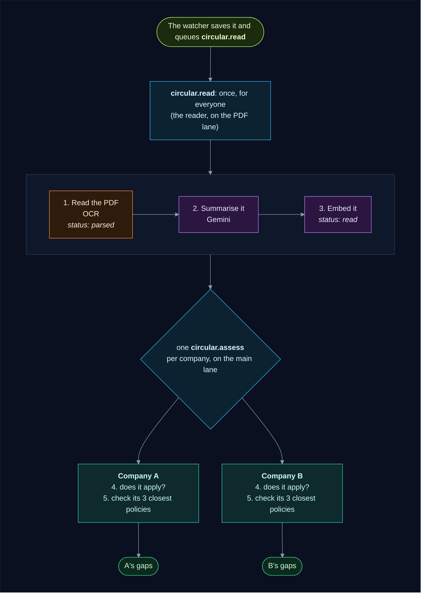
```mermaid
%%{init: {"theme": "base", "flowchart": {"diagramPadding": 0}, "themeVariables": {"darkMode": true, "primaryColor": "#16213a", "primaryTextColor": "#e6edf7", "primaryBorderColor": "#475a7a", "lineColor": "#8b9bb4", "secondaryColor": "#1b2436", "tertiaryColor": "#101a2e", "edgeLabelBackground": "#0f172a", "textColor": "#e2e8f0", "clusterBkg": "#0f1728", "clusterBorder": "#2b3a55", "titleColor": "#c4b5fd", "nodeTextColor": "#e6edf7"}}}%%
flowchart TD
    subgraph canvas[" "]
        direction TB
        s0(["The watcher saves it and queues <b>circular.read</b>"]) --> r["<b>circular.read</b>: once, for everyone<br/>(the reader, on the PDF lane)"]
        subgraph read[" "]
            direction LR
            r1["1. Read the PDF<br/>OCR<br/><i>status: parsed</i>"] --> r2["2. Summarise it<br/>Gemini"]
            r2 --> r3["3. Embed it<br/><i>status: read</i>"]
        end
        r --> read
        read --> fan{"one <b>circular.assess</b><br/>per company, on the main lane"}
        fan --> a1["<b>Company A</b><br/>4. does it apply?<br/>5. check its 3 closest policies"]
        fan --> a2["<b>Company B</b><br/>4. does it apply?<br/>5. check its 3 closest policies"]
        a1 --> d1(["A's gaps"])
        a2 --> d2(["B's gaps"])
    end
    classDef svc fill:#0e2a2c,stroke:#2dd4bf,color:#ccfbf1
    classDef data fill:#1c1a47,stroke:#818cf8,color:#e0e7ff
    classDef ext fill:#2a1640,stroke:#c084fc,color:#f3e8ff
    classDef gpu fill:#2d1b0c,stroke:#fb923c,color:#ffedd5
    classDef ask fill:#2a2410,stroke:#fbbf24,color:#fef3c7
    classDef ok fill:#0b2a1c,stroke:#34d399,color:#d1fae5
    classDef bad fill:#2e0f17,stroke:#fb7185,color:#ffe4e6
    classDef start fill:#1c2a0e,stroke:#a7ef6f,color:#ecfccb
    classDef muted fill:#1a2130,stroke:#64748b,color:#cbd5e1
    classDef queue fill:#0c2231,stroke:#38bdf8,color:#e0f2fe
    class s0 start
    class r,fan queue
    class r1 gpu
    class r2,r3 ext
    class a1,a2 svc
    class d1,d2 ok
    style read fill:#0f172a,stroke:#334155,color:#94a3b8
    style canvas fill:#0b1020,stroke:#1e293b,color:#0b1020
```

And in time order, with the reader and two workers running:

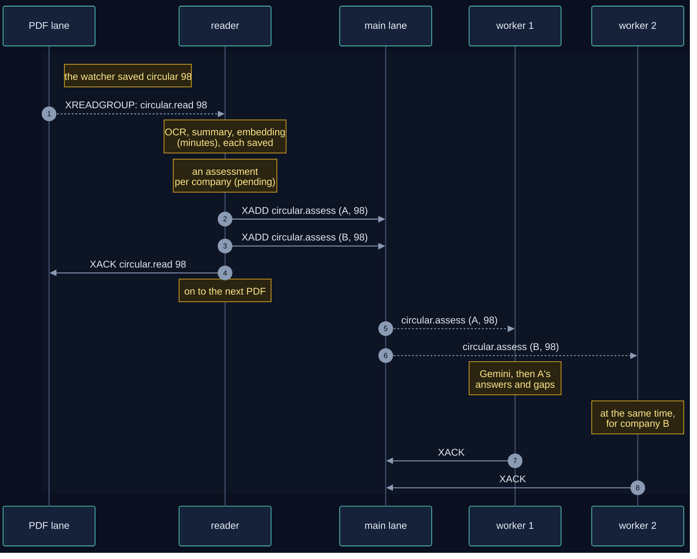
```mermaid
%%{init: {"theme": "base", "sequence": {"diagramMarginX": 0, "diagramMarginY": 0}, "themeVariables": {"darkMode": true, "primaryColor": "#16213a", "primaryTextColor": "#e6edf7", "primaryBorderColor": "#475a7a", "lineColor": "#8b9bb4", "secondaryColor": "#1b2436", "tertiaryColor": "#101a2e", "edgeLabelBackground": "#0f172a", "textColor": "#e2e8f0", "actorBkg": "#16213a", "actorBorder": "#5eead4", "actorTextColor": "#e6edf7", "actorLineColor": "#3b4a66", "signalColor": "#8b9bb4", "signalTextColor": "#e2e8f0", "noteBkgColor": "#2a2410", "noteBorderColor": "#fbbf24", "noteTextColor": "#fde68a", "labelBoxBkgColor": "#1e293b", "labelBoxBorderColor": "#64748b", "labelTextColor": "#e2e8f0", "loopTextColor": "#c4b5fd", "sequenceNumberColor": "#0b1020", "activationBkgColor": "#1e293b"}}}%%
sequenceDiagram
    autonumber
    box rgb(11, 16, 32)
        participant P as PDF lane
        participant R as reader
        participant Q as main lane
        participant K1 as worker 1
        participant K2 as worker 2
    end

    rect rgb(13, 20, 36)
        Note right of P: the watcher saved circular 98
        P-->>R: XREADGROUP: circular.read 98
        Note over R: OCR, summary, embedding<br/>(minutes), each saved
        Note over R: an assessment<br/>per company (pending)
        R->>Q: XADD circular.assess (A, 98)
        R->>Q: XADD circular.assess (B, 98)
        R->>P: XACK circular.read 98
        Note over R: on to the next PDF
        Q-->>K1: circular.assess (A, 98)
        Q-->>K2: circular.assess (B, 98)
        Note over K1: Gemini, then A's<br/>answers and gaps
        Note over K2: at the same time,<br/>for company B
        K1->>Q: XACK
        K2->>Q: XACK
    end
```

Now step by step, with the database after each one. **Bold** marks what changed.

### Step 0: the watcher saves it and queues a task

The watcher finds the circular on RBI's website, stores the PDF in S3, adds a row, and adds
a task to the PDF lane:

| id | source | title | status | text |
|---|---|---|---|---|
| 98 | RBI | Designation of terrorist organisation… | **new** | *(empty)* |

```text
XADD rci:tasks:pdf * type circular.read circular_id 98
```

(Just before, `enqueue` sets the task's dedupe key, so the same task can't be queued
twice; see [section 7](#7-no-duplicates-each-task-is-queued-once).) The reader picks it up
straight away, or as soon as it finishes the PDF it's on.

### Step 1: read the PDF

The reader downloads the PDF and sends each page to the **OCR** model on the GPU, which
turns the page image into text. Each page is saved the moment it's read, in `ocr_pages`:

| sha256 (the PDF) | page | text |
|---|---|---|
| 3f9a… | 0 | **"RESERVE BANK OF INDIA …"** |
| 3f9a… | 1 | **"2. Banks shall report …"** |

So if the reader is stopped on page 3 (a restart, a crash, a timeout), it comes back to
page 3, not page 1: a page already read is never sent to the GPU again. When the last page
is in, the reader joins them into the circular's text, and in the same commit deletes those
rows:

| id | status | text |
|---|---|---|
| 98 | **parsed** | **"RESERVE BANK OF INDIA … (12,408 characters)"** |

From now on the PDF is never read again: every later step, for every company, uses this
saved text. If another circular ever has the exact same PDF, it copies this text (and, in
step 2, the summary) instead of running OCR or asking Gemini.

### Step 2: summarise and embed it

The reader asks **Gemini** to read the text and answer in a fixed shape: who it's addressed
to, a short summary, and every obligation. Then it **embeds** the summary (turns it into a
list of numbers that capture its meaning, used to find the closest policies).

| id | status | addressed_to | summary | requirements | embedding |
|---|---|---|---|---|---|
| 98 | **read** | **All Regulated Entities… NBFCs…** | **RBI designates a new terrorist organisation…** | **["Report accounts … to FIU-IND", …]** | **[0.021, -0.013, …]** |

`read` is as far as the circular itself goes. What's left depends on the company.

### Step 3: one task per company

The reader gives every company an **assessment** of the circular, a row that says "company
X hasn't judged circular 98 yet", and queues a task for each on the **main lane**:

| company | circular | status | applicable |
|---|---|---|---|
| **A** | **98** | **pending** | *(empty)* |
| **B** | **98** | **pending** | *(empty)* |

```text
XADD rci:tasks * type circular.assess company_id A circular_id 98
XADD rci:tasks * type circular.assess company_id B circular_id 98
```

Then it acknowledges the `circular.read` task (`XACK`): done, and the reader moves on to the
next PDF. On the main lane, with two workers, the two companies are now judged **at the same
time**, and never wait behind a PDF.

### Step 4: does it apply to this company?

For company A, the worker asks Gemini: given **A's description**, does this circular apply?
The answer comes with a reason. Company B is asked the same about **its** description.

| company | circular | applicable | applies_reason |
|---|---|---|---|
| A | 98 | **true** | **"Addressed to NBFCs, and the company is an NBFC."** |
| B | 98 | **false** | **"Addressed to banks and NBFCs; the company is a stock broker."** |

For B the story ends here: its assessment is marked `done`, and none of B's policies is
checked. If a company hasn't described itself yet, `applicable` stays empty and its story
also ends here (it's judged later, when the description is saved).

### Step 5: check the company's closest policies

Asking Gemini about every policy would be slow and costly, so the worker first **scores**
each of **A's** RBI policies by how close it is to the circular. This is quick arithmetic on
the saved embeddings, with no Gemini call. Only the **3 closest** go to Gemini:

| Policy | Score | Sent to Gemini? |
|---|---|---|
| POL-KYC | 0.82 | ✅ top 3 |
| POL-DRP | 0.58 | ✅ top 3 |
| POL-DLP | 0.55 | ✅ top 3 |
| POL-IT | 0.31 | no: clearly unrelated |

For each of the 3, Gemini reads the circular and the policy and answers: **is this policy
now out of date?** Every answer is saved in `policy_checks`, so the same question is never
asked twice:

| circular | policy | version | similarity | impacted |
|---|---|---|---|---|
| **98** | **POL-KYC** | **1** | **0.82** | **true** |
| **98** | **POL-DRP** | **1** | **0.58** | **false** |
| **98** | **POL-DLP** | **1** | **0.55** | **false** |

POL-KYC is out of date, so the worker opens a **gap** for company A, a ticket for the
policy's owner with a draft of the new wording, and writes the first line of its history:

| table | new row |
|---|---|
| `gaps` | **company A · POL-KYC · severity high · due in 7 days · draft: "Add clause 2A: …"** |
| `gap_events` | **agent · opened · "The policy does not require reporting to FIU-IND…"** |

The verdict, the gap and its history line are saved **together**: all of them or none.

### Step 6: done

| company | circular | status |
|---|---|---|
| A | 98 | **done** |
| B | 98 | **done** |

The worker acknowledges each `circular.assess` task. The gap shows up on **company A's**
Gaps page; company B never sees it.

**What it cost:** OCR once per page and 1 summary **in total**, then per company: 1 "does it
apply?" and, where it applies, up to 3 policy checks.

---

## 3. Story 2: you add a new policy

**The setting.** A week later you add **POL-AML**, your anti-money-laundering policy, tagged
RBI. Circular 98 from Story 1 is already judged. Does the new policy have a gap too?


```mermaid
%%{init: {"theme": "base", "flowchart": {"diagramPadding": 0}, "themeVariables": {"darkMode": true, "primaryColor": "#16213a", "primaryTextColor": "#e6edf7", "primaryBorderColor": "#475a7a", "lineColor": "#8b9bb4", "secondaryColor": "#1b2436", "tertiaryColor": "#101a2e", "edgeLabelBackground": "#0f172a", "textColor": "#e2e8f0", "clusterBkg": "#0f1728", "clusterBorder": "#2b3a55", "titleColor": "#c4b5fd", "nodeTextColor": "#e6edf7"}}}%%
flowchart TD
    subgraph canvas[" "]
        direction TB
        add(["You add POL-AML"]) --> api["The api saves it<br/>(version 1, no embedding)<br/>and queues <b>policy.check</b>"]
        api --> take["A free worker takes it<br/>at once (XREADGROUP)"]
        take --> emb["Embed it<br/>Gemini embedding, once"]
        emb --> find["Your company's circulars:<br/>last 30 days, apply to you,<br/>have obligations, from RBI"]
        find --> top{"For each one:<br/>is POL-AML among<br/>its 3 closest?"}
        top -->|"no"| skip["Skip that circular"]
        top -->|"yes"| ask["Gemini: is POL-AML<br/>out of date?"]
        ask --> save["Save the answer,<br/>and a gap if out of date"]
        save --> ack(["XACK: task done"])
    end
    classDef svc fill:#0e2a2c,stroke:#2dd4bf,color:#ccfbf1
    classDef data fill:#1c1a47,stroke:#818cf8,color:#e0e7ff
    classDef ext fill:#2a1640,stroke:#c084fc,color:#f3e8ff
    classDef gpu fill:#2d1b0c,stroke:#fb923c,color:#ffedd5
    classDef ask fill:#2a2410,stroke:#fbbf24,color:#fef3c7
    classDef ok fill:#0b2a1c,stroke:#34d399,color:#d1fae5
    classDef bad fill:#2e0f17,stroke:#fb7185,color:#ffe4e6
    classDef start fill:#1c2a0e,stroke:#a7ef6f,color:#ecfccb
    classDef muted fill:#1a2130,stroke:#64748b,color:#cbd5e1
    classDef queue fill:#0c2231,stroke:#38bdf8,color:#e0f2fe
    class add start
    class api queue
    class take,emb,find svc
    class top ask
    class skip muted
    class ask ext
    class save,ack ok
    style canvas fill:#0b1020,stroke:#1e293b,color:#0b1020
```

In time order:

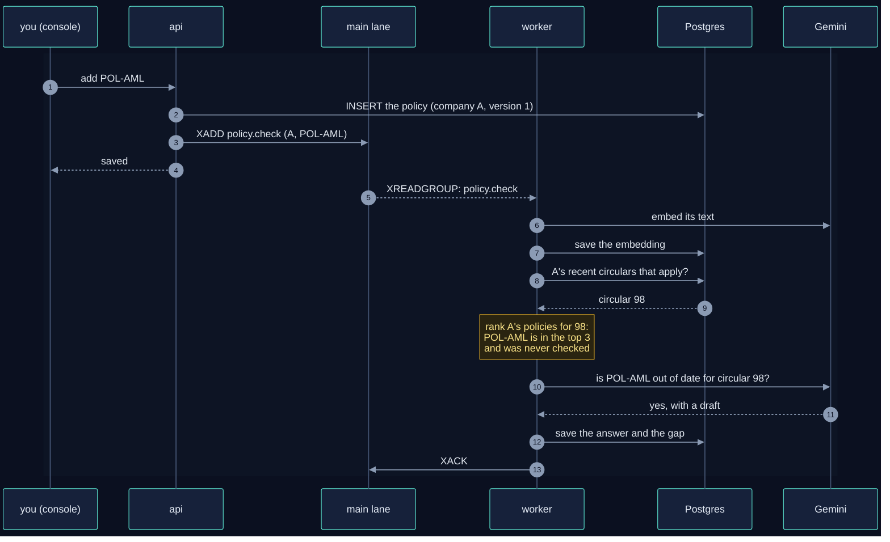
```mermaid
%%{init: {"theme": "base", "sequence": {"diagramMarginX": 0, "diagramMarginY": 0}, "themeVariables": {"darkMode": true, "primaryColor": "#16213a", "primaryTextColor": "#e6edf7", "primaryBorderColor": "#475a7a", "lineColor": "#8b9bb4", "secondaryColor": "#1b2436", "tertiaryColor": "#101a2e", "edgeLabelBackground": "#0f172a", "textColor": "#e2e8f0", "actorBkg": "#16213a", "actorBorder": "#5eead4", "actorTextColor": "#e6edf7", "actorLineColor": "#3b4a66", "signalColor": "#8b9bb4", "signalTextColor": "#e2e8f0", "noteBkgColor": "#2a2410", "noteBorderColor": "#fbbf24", "noteTextColor": "#fde68a", "labelBoxBkgColor": "#1e293b", "labelBoxBorderColor": "#64748b", "labelTextColor": "#e2e8f0", "loopTextColor": "#c4b5fd", "sequenceNumberColor": "#0b1020", "activationBkgColor": "#1e293b"}}}%%
sequenceDiagram
    autonumber
    box rgb(11, 16, 32)
        participant U as you (console)
        participant A as api
        participant Q as main lane
        participant K as worker
        participant DB as Postgres
        participant G as Gemini
    end

    rect rgb(13, 20, 36)
        U->>A: add POL-AML
        A->>DB: INSERT the policy (company A, version 1)
        A->>Q: XADD policy.check (A, POL-AML)
        A-->>U: saved
        Q-->>K: XREADGROUP: policy.check
        K->>G: embed its text
        K->>DB: save the embedding
        K->>DB: A's recent circulars that apply?
        DB-->>K: circular 98
        Note over K: rank A's policies for 98:<br/>POL-AML is in the top 3<br/>and was never checked
        K->>G: is POL-AML out of date for circular 98?
        G-->>K: yes, with a draft
        K->>DB: save the answer and the gap
        K->>Q: XACK
    end
```

Step by step:

### Step 1: you save it, and a task is queued

The console sends it to the api, which saves the row under **your company** and adds a task:

| company | code | title | regulators | version | embeddings |
|---|---|---|---|---|---|
| A | POL-AML | Anti-Money Laundering Policy | ["RBI"] | **1** | ***(empty)*** |

```text
XADD rci:tasks * type policy.check company_id A policy_id 11
```

The console answers at once, and the policy's page shows **Waiting for the worker**. The
worker does the rest in the background, starting straight away.

### Step 2: the worker embeds it

The worker sends the policy's text to Gemini's embedding model (split into 5,000-character
pieces, so nothing in a long policy is lost) and saves the numbers:

| code | embeddings | embedding_model |
|---|---|---|
| POL-AML | **[[0.012, -0.034, …], …] (one list per piece)** | **gemini-embedding-001** |

### Step 3: find your circulars to check it against

It looks at **your company's** circulars of the last **30 days** that apply to you, have
obligations, and come from a regulator the new policy lists (RBI). Circular 98 qualifies.

### Step 4: is the new policy among the 3 closest?

For circular 98 the worker scores all of your RBI policies again, now including POL-AML:

| Policy | Score | Top 3? | Already checked? |
|---|---|---|---|
| POL-KYC | 0.82 | ✅ | yes (Story 1): skip |
| **POL-AML** | **0.79** | ✅ | **no: ask Gemini** |
| POL-DRP | 0.58 | ✅ | yes (Story 1): skip |
| POL-DLP | 0.55 | no | yes (Story 1) |

Only **one** Gemini question is asked: the pair nobody has checked yet.

### Step 5: save the answer

| table | new row |
|---|---|
| `policy_checks` | **98 · POL-AML · version 1 · 0.79 · impacted true** |
| `gaps` | **company A · POL-AML · severity high · due in 7 days** |
| `gap_events` | **agent · opened · "…"** |

The worker stamps the policy's `checked_at`, and the page, which has been looking every
3 seconds, switches to **Checked** by itself, listing the new gap. The task is acknowledged.
**What it cost:** 1 embedding (the policy) and 1 check.

> 💡 **No restart, no waiting.** The worker starts on the new policy the moment you save it.

---

## 4. Other things you can do

Everything you do in the console that needs a worker is saved in the database, then queues
a task: the task is the only way the worker hears about it. The worker then redoes **only**
what the change affects:

| You… | The database change | The task | What the worker does | Gemini cost |
|---|---|---|---|---|
| add a policy | a new row, no embedding | `policy.check` | embeds it, checks it against your recent circulars | 1 embedding + 1 per top-3 circular |
| edit a policy's **text** | version + 1, embeddings cleared | `policy.check` | embeds it, checks the new version (skipping pairs that already have a gap) | 1 embedding + 1 per top-3 circular |
| edit its **title** | embeddings cleared | `policy.check` | embeds it; checks only pairs never checked | 1 embedding |
| edit its **regulators** or **owner** | `updated_at` changes | `policy.check` | checks it against any newly listed regulator's circulars | 1 per new top-3 circular |
| sign up a new company | a company and its first user | none | nothing: with no description and no policies there's nothing to judge; its recent circulars show **Not checked** | none |
| describe your company, or change the description | the description | `company.refresh` | sets **your** older answers back to `pending`, asks "does it apply?" again for each of your recent circulars, then checks pairs never checked | 1 per circular, plus new checks |
| save the company page unchanged, or only a new name | the name, if any | none | nothing | none |
| add a control, update a gap, add a teammate | that row | none | nothing: it reads a policy's controls each time it judges it | none |
| press **Reprocess** on a circular that's read | **your** assessment back to `pending`, your "up to date" answers cleared | `circular.assess` | judges it for you again, **no OCR, no summary**; gaps are kept | 1 + its checks |
| press **Reprocess** on a failed circular | its status back to `new` or `parsed` | `circular.read` | reads it again (OCR only if no text was saved), then judges it for every company | 2 + per company |

Other companies are never touched: your description, your Reprocess and your policies only
ever change **your** rows.

---

## 5. The task queue: Redis Streams

### A stream and a group

A Redis **stream** is an append-only list of messages. The app has two, one per **lane**:
`rci:tasks:pdf` for reading PDFs and `rci:tasks` for everything else (the next part says
why). Three commands do all the work:

| Command | Who | What it does |
|---|---|---|
| `XADD <lane> * type … ids …` | watcher, api, reader, worker | adds a task at the end of its lane |
| `XREADGROUP GROUP workers <me> … >` | each reader or worker, on its lane | "give me the next task nobody in my group has had" |
| `XACK <lane> workers <task id>` | each reader or worker | "I finished it": it leaves the group's pending list |

Each lane is read by its own **consumer group** called `workers`. The group remembers which task
it handed to which worker, so **each task goes to exactly one worker**:


```mermaid
%%{init: {"theme": "base", "flowchart": {"diagramPadding": 0}, "themeVariables": {"darkMode": true, "primaryColor": "#16213a", "primaryTextColor": "#e6edf7", "primaryBorderColor": "#475a7a", "lineColor": "#8b9bb4", "secondaryColor": "#1b2436", "tertiaryColor": "#101a2e", "edgeLabelBackground": "#0f172a", "textColor": "#e2e8f0", "clusterBkg": "#0f1728", "clusterBorder": "#2b3a55", "titleColor": "#c4b5fd", "nodeTextColor": "#e6edf7"}}}%%
flowchart TD
    subgraph canvas[" "]
        direction TB
        subgraph stream["one lane: the stream rci:tasks"]
            direction LR
            t1["task 1"] --- t2["task 2"] --- t3["task 3"] --- t4["task 4"] --- t5["task 5"]
        end
        stream -->|"XREADGROUP &gt;: the next new task"| g{{"group <b>workers</b><br/>remembers which task<br/>it gave to whom"}}
        g -->|"task 3"| k1["worker 1"]
        g -->|"task 4"| k2["worker 2"]
        g -->|"task 5"| k3["worker 3"]
        k1 -->|"XACK task 3"| done(["done: off the pending list"])
    end
    classDef svc fill:#0e2a2c,stroke:#2dd4bf,color:#ccfbf1
    classDef data fill:#1c1a47,stroke:#818cf8,color:#e0e7ff
    classDef ext fill:#2a1640,stroke:#c084fc,color:#f3e8ff
    classDef gpu fill:#2d1b0c,stroke:#fb923c,color:#ffedd5
    classDef ask fill:#2a2410,stroke:#fbbf24,color:#fef3c7
    classDef ok fill:#0b2a1c,stroke:#34d399,color:#d1fae5
    classDef bad fill:#2e0f17,stroke:#fb7185,color:#ffe4e6
    classDef start fill:#1c2a0e,stroke:#a7ef6f,color:#ecfccb
    classDef muted fill:#1a2130,stroke:#64748b,color:#cbd5e1
    classDef queue fill:#0c2231,stroke:#38bdf8,color:#e0f2fe
    class t1,t2,t3,t4,t5 data
    class g queue
    class k1,k2,k3 svc
    class done ok
    style stream fill:#0f172a,stroke:#334155,color:#94a3b8
    style canvas fill:#0b1020,stroke:#1e293b,color:#0b1020
```

A task handed out but not yet acknowledged sits on the group's **pending list**, under the
worker that has it. That list is what makes the queue safe.

### Two lanes: a PDF never holds up a quick task

Tasks take very different times. Reading a PDF is minutes of OCR on the GPU; everything
else is a few Gemini calls, seconds each. With a single list, first in first out, a quick
task waits behind every PDF put on the list before it. This happened on 2026-10-01, with
one list and one worker:

| Time | What the log says |
|---|---|
| 12:33:19 | `#183 read`: circular 183's "does it apply?" checks are queued |
| 12:35:34 | `#184 read`: the only worker is busy reading PDFs queued earlier |
| 12:37:53 | `#185 read` |
| 12:39:33 | `#186 read` |
| 12:39:35 | `#183 for company 1: applies: False`: a 2-second check waited **6 minutes** |

So the tasks are split into two **lanes**, each its own stream, with its own workers:

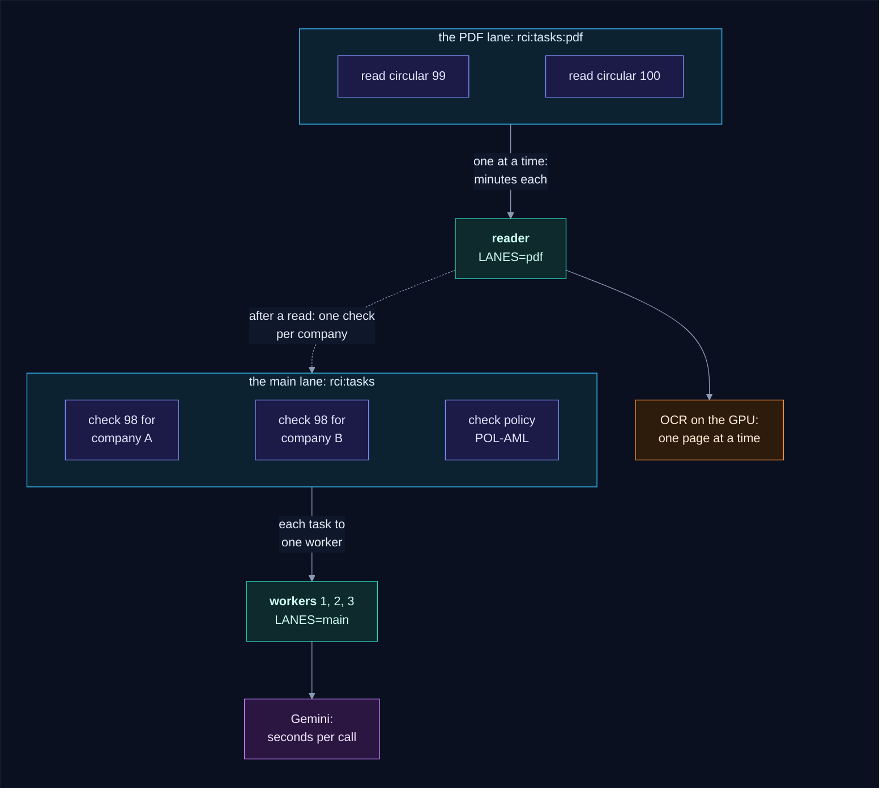
```mermaid
%%{init: {"theme": "base", "flowchart": {"diagramPadding": 0}, "themeVariables": {"darkMode": true, "primaryColor": "#16213a", "primaryTextColor": "#e6edf7", "primaryBorderColor": "#475a7a", "lineColor": "#8b9bb4", "secondaryColor": "#1b2436", "tertiaryColor": "#101a2e", "edgeLabelBackground": "#0f172a", "textColor": "#e2e8f0", "clusterBkg": "#0f1728", "clusterBorder": "#2b3a55", "titleColor": "#c4b5fd", "nodeTextColor": "#e6edf7"}}}%%
flowchart TD
    subgraph canvas[" "]
        direction TB
        subgraph pdf["the PDF lane: rci:tasks:pdf"]
            direction LR
            p1["read circular 99"] ~~~ p2["read circular 100"]
        end
        subgraph main["the main lane: rci:tasks"]
            direction LR
            m1["check 98 for<br/>company A"] ~~~ m2["check 98 for<br/>company B"]
            m2 ~~~ m3["check policy<br/>POL-AML"]
        end
        pdf -->|"one at a time:<br/>minutes each"| R["<b>reader</b><br/>LANES=pdf"]
        R --> O["OCR on the GPU:<br/>one page at a time"]
        main -->|"each task to<br/>one worker"| K["<b>workers</b> 1, 2, 3<br/>LANES=main"]
        K --> G["Gemini:<br/>seconds per call"]
        R -.->|"after a read: one check<br/>per company"| main
    end
    classDef svc fill:#0e2a2c,stroke:#2dd4bf,color:#ccfbf1
    classDef data fill:#1c1a47,stroke:#818cf8,color:#e0e7ff
    classDef ext fill:#2a1640,stroke:#c084fc,color:#f3e8ff
    classDef gpu fill:#2d1b0c,stroke:#fb923c,color:#ffedd5
    classDef ask fill:#2a2410,stroke:#fbbf24,color:#fef3c7
    classDef ok fill:#0b2a1c,stroke:#34d399,color:#d1fae5
    classDef bad fill:#2e0f17,stroke:#fb7185,color:#ffe4e6
    classDef start fill:#1c2a0e,stroke:#a7ef6f,color:#ecfccb
    classDef muted fill:#1a2130,stroke:#64748b,color:#cbd5e1
    classDef queue fill:#0c2231,stroke:#38bdf8,color:#e0f2fe
    class p1,p2,m1,m2,m3 data
    class R,K svc
    class O gpu
    class G ext
    style pdf fill:#0c2231,stroke:#38bdf8,color:#e0f2fe
    style main fill:#0c2231,stroke:#38bdf8,color:#e0f2fe
    style canvas fill:#0b1020,stroke:#1e293b,color:#0b1020
```

- **Which lane?** Only `circular.read` goes to the PDF lane. `enqueue` picks it from the task
  type, so the watcher and the api don't need to know about lanes.
- **The reader and the workers are the same program.** The `LANES` setting says which lanes
  it takes: the `reader` service has `LANES=pdf`, the `worker` service `LANES=main`. Run on
  your machine, it takes both (`pdf,main`), with a loop for each, so even one process never
  makes a check wait behind a PDF.
- **One reader, many workers.** There's always exactly one reader. The GPU reads one page at
  a time, so a second would only take turns with it, and with one reader two circulars with
  the same PDF are read one after the other: the second copies the first's text. Workers
  only wait for Gemini, so `WORKERS` can grow up to your Gemini key's rate limit.
- **A slow service only stops its own lane.** While the OCR model is loading, the reader
  waits and the workers carry on.

### How a task becomes a worker's own

Each worker has a name in the group: its container's hostname and process number, such as
`e02ff2af94f5-1`. When Redis hands a task to a worker, **it writes that name next to the task
on the pending list, in the same moment**. Nothing else is needed to make the task the
worker's own: from then on, no other worker gets it from `XREADGROUP`.

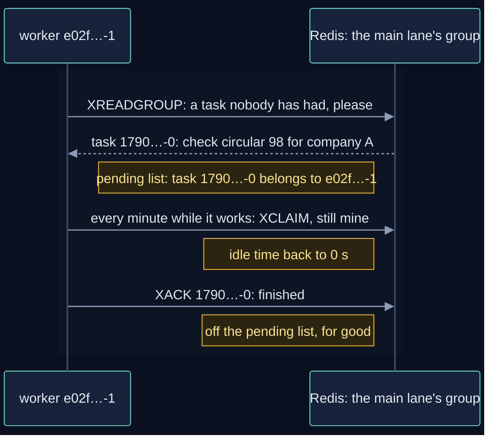
```mermaid
%%{init: {"theme": "base", "sequence": {"diagramMarginX": 0, "diagramMarginY": 0}, "themeVariables": {"darkMode": true, "primaryColor": "#16213a", "primaryTextColor": "#e6edf7", "primaryBorderColor": "#475a7a", "lineColor": "#8b9bb4", "secondaryColor": "#1b2436", "tertiaryColor": "#101a2e", "edgeLabelBackground": "#0f172a", "textColor": "#e2e8f0", "actorBkg": "#16213a", "actorBorder": "#5eead4", "actorTextColor": "#e6edf7", "actorLineColor": "#3b4a66", "signalColor": "#8b9bb4", "signalTextColor": "#e2e8f0", "noteBkgColor": "#2a2410", "noteBorderColor": "#fbbf24", "noteTextColor": "#fde68a", "labelBoxBkgColor": "#1e293b", "labelBoxBorderColor": "#64748b", "labelTextColor": "#e2e8f0", "loopTextColor": "#c4b5fd", "sequenceNumberColor": "#0b1020", "activationBkgColor": "#1e293b"}}}%%
sequenceDiagram
    box rgb(11, 16, 32)
        participant K as worker e02f…-1
        participant R as Redis: the main lane's group
    end

    rect rgb(13, 20, 36)
        K->>R: XREADGROUP: a task nobody has had, please
        R-->>K: task 1790…-0: check circular 98 for company A
        Note left of R: pending list: task 1790…-0 belongs to e02f…-1
        K->>R: every minute while it works: XCLAIM, still mine
        Note left of R: idle time back to 0 s
        K->>R: XACK 1790…-0: finished
        Note left of R: off the pending list, for good
    end
```

The pending list keeps three things about each task:

| task id | owner | idle time | times handed out |
|---|---|---|---|
| 1790831159691-0 | e02ff2af94f5-1 | 12 s | 1 |

- **The owner** is the worker that has it.
- **The idle time** is how long since the owner last touched it. Redis can't tell a busy
  worker from a dead one, so the worker touches its task every minute (`XCLAIM … JUSTID`),
  which sets the idle time back to 0. A task idle for 5 minutes belongs to a dead worker, and
  another worker takes it over (below).
- **Times handed out** goes up each time the task is read again: a retry, or a takeover.

To look at it yourself: `docker compose exec redis redis-cli XPENDING rci:tasks workers - + 10`.

### How a worker picks its next task

Each time a worker is free, it looks in three places on its lane, in this order (with both
lanes, each lane's loop does this on its own):

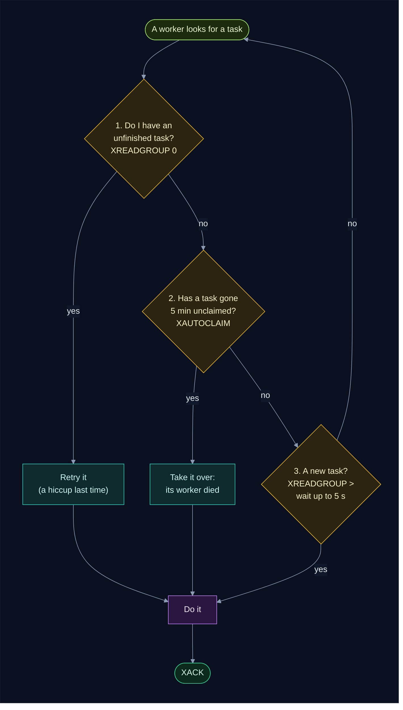
```mermaid
%%{init: {"theme": "base", "flowchart": {"diagramPadding": 0}, "themeVariables": {"darkMode": true, "primaryColor": "#16213a", "primaryTextColor": "#e6edf7", "primaryBorderColor": "#475a7a", "lineColor": "#8b9bb4", "secondaryColor": "#1b2436", "tertiaryColor": "#101a2e", "edgeLabelBackground": "#0f172a", "textColor": "#e2e8f0", "clusterBkg": "#0f1728", "clusterBorder": "#2b3a55", "titleColor": "#c4b5fd", "nodeTextColor": "#e6edf7"}}}%%
flowchart TD
    subgraph canvas[" "]
        direction TB
        get(["A worker looks for a task"]) --> own{"1. Do I have an<br/>unfinished task?<br/>XREADGROUP 0"}
        own -->|"yes"| retry["Retry it<br/>(a hiccup last time)"]
        own -->|"no"| claim{"2. Has a task gone<br/>5 min unclaimed?<br/>XAUTOCLAIM"}
        claim -->|"yes"| take["Take it over:<br/>its worker died"]
        claim -->|"no"| new{"3. A new task?<br/>XREADGROUP &gt;<br/>wait up to 5 s"}
        new -->|"yes"| run["Do it"]
        new -->|"no"| get
        retry --> run
        take --> run
        run --> ack(["XACK"])
    end
    classDef svc fill:#0e2a2c,stroke:#2dd4bf,color:#ccfbf1
    classDef data fill:#1c1a47,stroke:#818cf8,color:#e0e7ff
    classDef ext fill:#2a1640,stroke:#c084fc,color:#f3e8ff
    classDef gpu fill:#2d1b0c,stroke:#fb923c,color:#ffedd5
    classDef ask fill:#2a2410,stroke:#fbbf24,color:#fef3c7
    classDef ok fill:#0b2a1c,stroke:#34d399,color:#d1fae5
    classDef bad fill:#2e0f17,stroke:#fb7185,color:#ffe4e6
    classDef start fill:#1c2a0e,stroke:#a7ef6f,color:#ecfccb
    classDef muted fill:#1a2130,stroke:#64748b,color:#cbd5e1
    classDef queue fill:#0c2231,stroke:#38bdf8,color:#e0f2fe
    class get start
    class own,claim,new ask
    class retry,take svc
    class run ext
    class ack ok
    style canvas fill:#0b1020,stroke:#1e293b,color:#0b1020
```

1. **Its own pending list** (`XREADGROUP … 0`). If the last attempt hit a hiccup (a timeout,
   a bad answer, up to 3 tries) or a service was down (as long as it takes), the task was left
   unacknowledged on purpose, so it's still there, and it's tried again. A worker whose
   container restarted finds its unfinished task here too: it comes back with the same name.
2. **Tasks abandoned by a dead worker.** While a worker runs a task, it renews its claim on
   it every minute (`XCLAIM`), however long the task takes. A task on another worker's
   pending list that has gone **5 minutes** (`CLAIM_IDLE_SECONDS`) without that is
   abandoned, and is taken over with `XAUTOCLAIM`. A slow task is never taken: no two
   workers OCR the same PDF.
3. **A new task** (`XREADGROUP … >`, where `>` means "one nobody has had"), waiting up to 5
   seconds for one to arrive, then looking again. Redis writes the worker's name on it as it
   hands it over.

### If a worker dies

A worker that crashes mid-task never acknowledges it, so the task stays on the pending list.
If Docker restarts the same container, the worker finds the task under its own name and
carries on. If it doesn't come back (or `docker compose up --build` replaced it with a new
container, which has a new name), another worker takes the task over after 5 minutes.
Either way the work
continues from the **last saved step** in Postgres, down to the last OCR'd page: nothing
done is lost or paid for twice.

### Every change queues its task

The lanes are the workers' **only** source of work. A worker never looks in Postgres for
something to do: every change that needs a worker puts its task on its lane, right after
the change is saved.

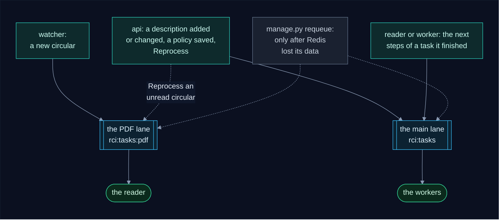
```mermaid
%%{init: {"theme": "base", "flowchart": {"diagramPadding": 0}, "themeVariables": {"darkMode": true, "primaryColor": "#16213a", "primaryTextColor": "#e6edf7", "primaryBorderColor": "#475a7a", "lineColor": "#8b9bb4", "secondaryColor": "#1b2436", "tertiaryColor": "#101a2e", "edgeLabelBackground": "#0f172a", "textColor": "#e2e8f0", "clusterBkg": "#0f1728", "clusterBorder": "#2b3a55", "titleColor": "#c4b5fd", "nodeTextColor": "#e6edf7"}}}%%
flowchart TD
    subgraph canvas[" "]
        direction TB
        w["watcher:<br/>a new circular"] --> p[["the PDF lane<br/>rci:tasks:pdf"]]
        a["api: a description added<br/>or changed, a policy saved,<br/>Reprocess"] --> q[["the main lane<br/>rci:tasks"]]
        a -.->|"Reprocess an<br/>unread circular"| p
        k["reader or worker: the next<br/>steps of a task it finished"] --> q
        m["manage.py requeue:<br/>only after Redis<br/>lost its data"] -.-> q
        m -.-> p
        p --> y(["the reader"])
        q --> x(["the workers"])
    end
    classDef svc fill:#0e2a2c,stroke:#2dd4bf,color:#ccfbf1
    classDef data fill:#1c1a47,stroke:#818cf8,color:#e0e7ff
    classDef ext fill:#2a1640,stroke:#c084fc,color:#f3e8ff
    classDef gpu fill:#2d1b0c,stroke:#fb923c,color:#ffedd5
    classDef ask fill:#2a2410,stroke:#fbbf24,color:#fef3c7
    classDef ok fill:#0b2a1c,stroke:#34d399,color:#d1fae5
    classDef bad fill:#2e0f17,stroke:#fb7185,color:#ffe4e6
    classDef start fill:#1c2a0e,stroke:#a7ef6f,color:#ecfccb
    classDef muted fill:#1a2130,stroke:#64748b,color:#cbd5e1
    classDef queue fill:#0c2231,stroke:#38bdf8,color:#e0f2fe
    class w,a,k svc
    class m muted
    class p,q queue
    class x,y ok
    style canvas fill:#0b1020,stroke:#1e293b,color:#0b1020
```

| You do (or something happens) | Task queued | By |
|---|---|---|
| a regulator publishes a circular | `circular.read` | the watcher |
| you add your company description, or change it | `company.refresh` | the api |
| you add a policy, or save one again (**every save**) | `policy.check` | the api |
| you press **Reprocess** | `circular.read`, or `circular.assess` for your company | the api |
| a circular has been read | `circular.assess`, one per company | the reader |
| a company refresh finds circulars to check | `circular.assess`, one per circular | the worker |
| a policy was saved again while it was being checked | `policy.check` again | the worker |
| a company signs up | nothing | (no description and no policies yet: nothing to judge) |
| you save the company page with the same description, or only a new name | nothing | (nothing changed for the worker) |
| you add a control, update a gap, add a teammate | nothing | (the worker reads a policy's controls each time it judges it) |

### If Redis can't take a task

A change is only finished when its task is on its lane: nobody just logs a lost task and
moves on.

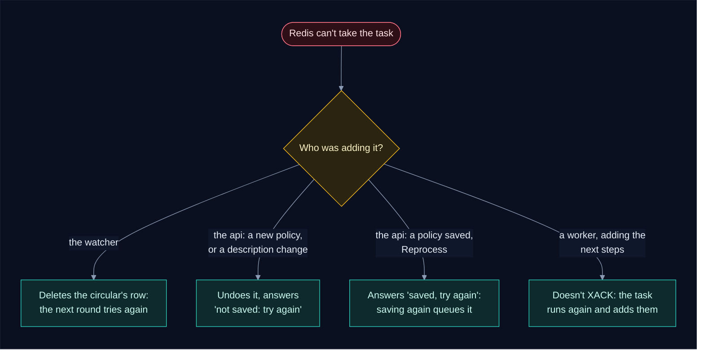
```mermaid
%%{init: {"theme": "base", "flowchart": {"diagramPadding": 0}, "themeVariables": {"darkMode": true, "primaryColor": "#16213a", "primaryTextColor": "#e6edf7", "primaryBorderColor": "#475a7a", "lineColor": "#8b9bb4", "secondaryColor": "#1b2436", "tertiaryColor": "#101a2e", "edgeLabelBackground": "#0f172a", "textColor": "#e2e8f0", "clusterBkg": "#0f1728", "clusterBorder": "#2b3a55", "titleColor": "#c4b5fd", "nodeTextColor": "#e6edf7"}}}%%
flowchart TD
    subgraph canvas[" "]
        direction TB
        e(["Redis can't take the task"]) --> who{"Who was adding it?"}
        who -->|"the watcher"| wa["Deletes the circular's row:<br/>the next round tries again"]
        who -->|"the api: a new policy,<br/>or a description change"| ac["Undoes it, answers<br/>'not saved: try again'"]
        who -->|"the api: a policy saved,<br/>Reprocess"| ae["Answers 'saved, try again':<br/>saving again queues it"]
        who -->|"a worker, adding the<br/>next steps"| wo["Doesn't XACK: the task<br/>runs again and adds them"]
    end
    classDef svc fill:#0e2a2c,stroke:#2dd4bf,color:#ccfbf1
    classDef data fill:#1c1a47,stroke:#818cf8,color:#e0e7ff
    classDef ext fill:#2a1640,stroke:#c084fc,color:#f3e8ff
    classDef gpu fill:#2d1b0c,stroke:#fb923c,color:#ffedd5
    classDef ask fill:#2a2410,stroke:#fbbf24,color:#fef3c7
    classDef ok fill:#0b2a1c,stroke:#34d399,color:#d1fae5
    classDef bad fill:#2e0f17,stroke:#fb7185,color:#ffe4e6
    classDef start fill:#1c2a0e,stroke:#a7ef6f,color:#ecfccb
    classDef muted fill:#1a2130,stroke:#64748b,color:#cbd5e1
    classDef queue fill:#0c2231,stroke:#38bdf8,color:#e0f2fe
    class e bad
    class who ask
    class wa,ac,ae,wo svc
    style canvas fill:#0b1020,stroke:#1e293b,color:#0b1020
```

Saving again always works: an undone change is a change again, and a policy save or a
Reprocess queues its task every time.

### If Redis loses its data

Redis keeps the lanes on disk (`--appendonly yes`), so a restart loses nothing. Only if its
data is deleted are the queued tasks gone. Then a person runs, once:

```bash
cd backend/api && uv run python manage.py requeue
# 3 unfinished: 3 queued, 0 already queued
```

It puts back every piece of work Postgres shows unfinished: circulars still `new` or
`parsed`, checks still `pending`, policies not checked since they were saved, and a
`company.refresh` for each company with a description (which resets nothing when nothing
changed). Each task goes back to its own lane, and the workers still only read the lanes.

### Failed work, and running it again

A task that fails for good (anything that isn't a service being down or a hiccup, or the
same hiccup 3 times) is not retried forever. `give_up()` in the worker does four things:

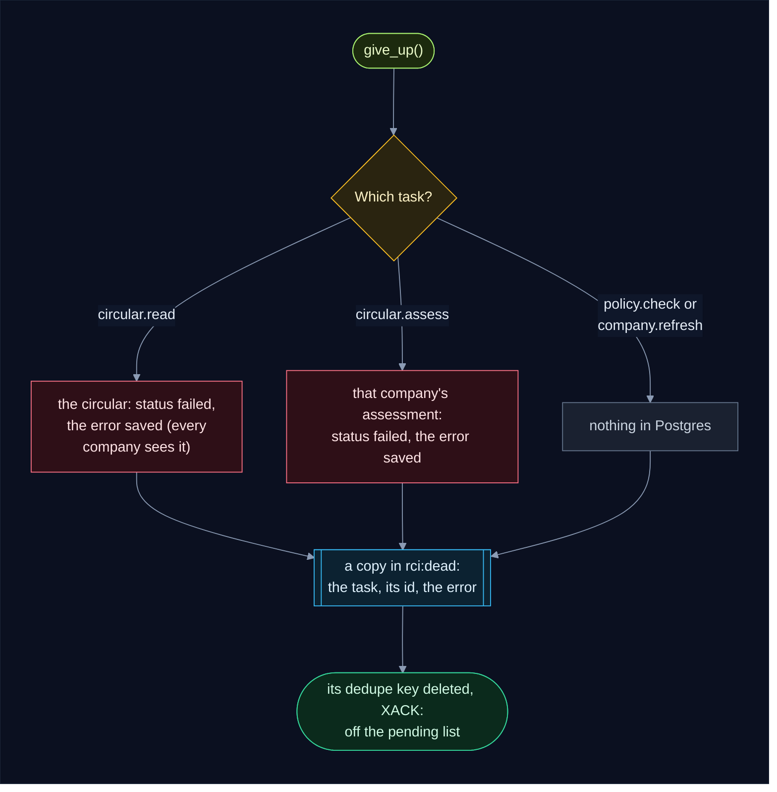
```mermaid
%%{init: {"theme": "base", "flowchart": {"diagramPadding": 0}, "themeVariables": {"darkMode": true, "primaryColor": "#16213a", "primaryTextColor": "#e6edf7", "primaryBorderColor": "#475a7a", "lineColor": "#8b9bb4", "secondaryColor": "#1b2436", "tertiaryColor": "#101a2e", "edgeLabelBackground": "#0f172a", "textColor": "#e2e8f0", "clusterBkg": "#0f1728", "clusterBorder": "#2b3a55", "titleColor": "#c4b5fd", "nodeTextColor": "#e6edf7"}}}%%
flowchart TD
    subgraph canvas[" "]
        direction TB
        g(["give_up()"]) --> t{"Which task?"}
        t -->|"circular.read"| c["the circular: status failed,<br/>the error saved (every<br/>company sees it)"]
        t -->|"circular.assess"| a["that company's assessment:<br/>status failed, the error saved"]
        t -->|"policy.check or<br/>company.refresh"| n["nothing in Postgres"]
        c --> d[["a copy in rci:dead:<br/>the task, its id, the error"]]
        a --> d
        n --> d
        d --> f(["its dedupe key deleted, XACK:<br/>off the pending list"])
    end
    classDef svc fill:#0e2a2c,stroke:#2dd4bf,color:#ccfbf1
    classDef data fill:#1c1a47,stroke:#818cf8,color:#e0e7ff
    classDef ext fill:#2a1640,stroke:#c084fc,color:#f3e8ff
    classDef gpu fill:#2d1b0c,stroke:#fb923c,color:#ffedd5
    classDef ask fill:#2a2410,stroke:#fbbf24,color:#fef3c7
    classDef ok fill:#0b2a1c,stroke:#34d399,color:#d1fae5
    classDef bad fill:#2e0f17,stroke:#fb7185,color:#ffe4e6
    classDef start fill:#1c2a0e,stroke:#a7ef6f,color:#ecfccb
    classDef muted fill:#1a2130,stroke:#64748b,color:#cbd5e1
    classDef queue fill:#0c2231,stroke:#38bdf8,color:#e0f2fe
    class g start
    class t ask
    class c,a bad
    class n muted
    class d queue
    class f ok
    style canvas fill:#0b1020,stroke:#1e293b,color:#0b1020
```

**What makes a circular `failed`**, for example:

- the PDF has no text at all: `ValueError: OCR found no text in the PDF`;
- the PDF is missing from S3 (`NoSuchKey`: Floci was restarted without `--persist`), or S3
  can't be reached (Floci isn't running);
- Gemini refused the request (a 400);
- the same hiccup three times in a row: an OCR page over 10 minutes, a server error, an answer
  not in the asked-for shape.

**Where you see it:** in the console, the circular says **Failed**, and its page has a **Why
it failed** panel with the error. The worker's log says `… failed for good`, with the full
error. And `docker compose exec redis redis-cli XRANGE rci:dead - +` lists every task given up
(nothing reads `rci:dead` back: it's a record for whoever investigates).

**How it runs again:**

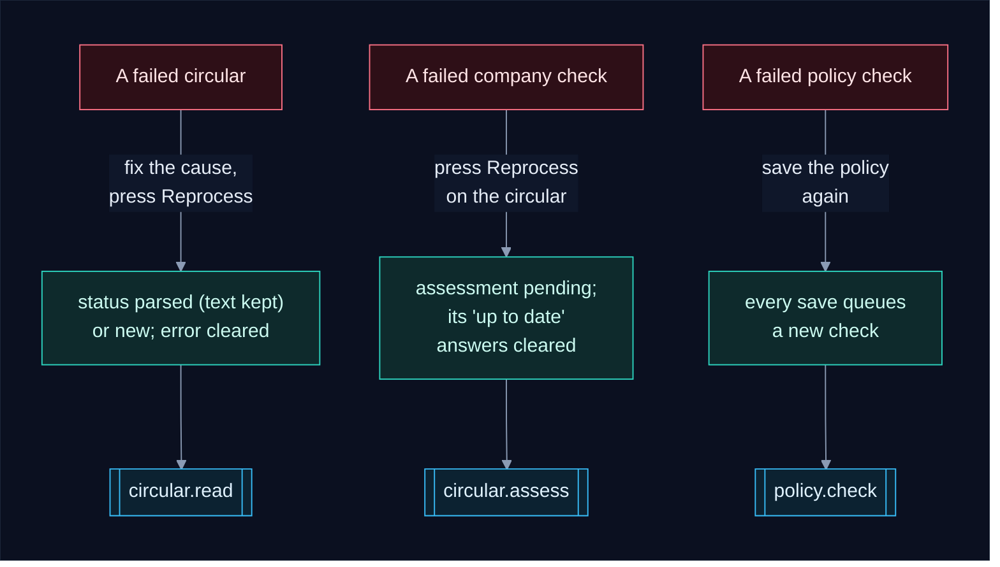
```mermaid
%%{init: {"theme": "base", "flowchart": {"diagramPadding": 0}, "themeVariables": {"darkMode": true, "primaryColor": "#16213a", "primaryTextColor": "#e6edf7", "primaryBorderColor": "#475a7a", "lineColor": "#8b9bb4", "secondaryColor": "#1b2436", "tertiaryColor": "#101a2e", "edgeLabelBackground": "#0f172a", "textColor": "#e2e8f0", "clusterBkg": "#0f1728", "clusterBorder": "#2b3a55", "titleColor": "#c4b5fd", "nodeTextColor": "#e6edf7"}}}%%
flowchart TD
    subgraph canvas[" "]
        direction TB
        f1["A failed circular"] -->|"fix the cause,<br/>press Reprocess"| a1["status parsed (text kept)<br/>or new; error cleared"]
        a1 --> t1[["circular.read"]]
        f2["A failed company check"] -->|"press Reprocess<br/>on the circular"| a2["assessment pending;<br/>its 'up to date'<br/>answers cleared"]
        a2 --> t2[["circular.assess"]]
        f3["A failed policy check"] -->|"save the policy<br/>again"| a3["every save queues<br/>a new check"]
        a3 --> t3[["policy.check"]]
    end
    classDef svc fill:#0e2a2c,stroke:#2dd4bf,color:#ccfbf1
    classDef data fill:#1c1a47,stroke:#818cf8,color:#e0e7ff
    classDef ext fill:#2a1640,stroke:#c084fc,color:#f3e8ff
    classDef gpu fill:#2d1b0c,stroke:#fb923c,color:#ffedd5
    classDef ask fill:#2a2410,stroke:#fbbf24,color:#fef3c7
    classDef ok fill:#0b2a1c,stroke:#34d399,color:#d1fae5
    classDef bad fill:#2e0f17,stroke:#fb7185,color:#ffe4e6
    classDef start fill:#1c2a0e,stroke:#a7ef6f,color:#ecfccb
    classDef muted fill:#1a2130,stroke:#64748b,color:#cbd5e1
    classDef queue fill:#0c2231,stroke:#38bdf8,color:#e0f2fe
    class f1,f2,f3 bad
    class a1,a2,a3 svc
    class t1,t2,t3 queue
    style canvas fill:#0b1020,stroke:#1e293b,color:#0b1020
```

| What failed | Retried by itself? | How to run it again | It carries on from |
|---|---|---|---|
| reading a circular | no | fix the cause (start Floci, say), then **Reprocess** | the pages already OCR'd, the text, the summary |
| one company's check | no | **Reprocess** on the circular, signed in as that company | its gaps and "out of date" answers; "does it apply?" and the "up to date" answers are asked again |
| a policy check | no: it keeps saying **Waiting for the worker** | save the policy again | its embeddings and every saved answer |
| a company refresh | no | save the company description again | the to-dos already saved |

> 🔍 **See the queue live:**
> `docker compose exec redis redis-cli XINFO GROUPS rci:tasks` shows how many tasks are
> waiting (`lag`) and being worked on (`pending`) on the main lane (`rci:tasks:pdf` for the
> PDF lane); `XPENDING rci:tasks workers - + 10` lists the pending ones with their owners;
> `XRANGE rci:dead - +` lists the failures.

---

## 6. How the worker uses the database

### The tables

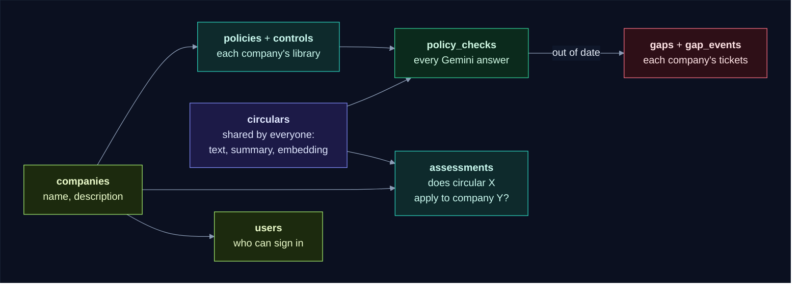
```mermaid
%%{init: {"theme": "base", "flowchart": {"diagramPadding": 0}, "themeVariables": {"darkMode": true, "primaryColor": "#16213a", "primaryTextColor": "#e6edf7", "primaryBorderColor": "#475a7a", "lineColor": "#8b9bb4", "secondaryColor": "#1b2436", "tertiaryColor": "#101a2e", "edgeLabelBackground": "#0f172a", "textColor": "#e2e8f0", "clusterBkg": "#0f1728", "clusterBorder": "#2b3a55", "titleColor": "#c4b5fd", "nodeTextColor": "#e6edf7"}}}%%
flowchart LR
    subgraph canvas[" "]
        direction LR
        CO["<b>companies</b><br/>name, description"] --> US["<b>users</b><br/>who can sign in"]
        CO --> AS["<b>assessments</b><br/>does circular X<br/>apply to company Y?"]
        CI["<b>circulars</b><br/>shared by everyone:<br/>text, summary, embedding"] --> AS
        CO --> PO["<b>policies</b> + <b>controls</b><br/>each company's library"]
        PO --> PC["<b>policy_checks</b><br/>every Gemini answer"]
        CI --> PC
        PC -->|"out of date"| GA["<b>gaps</b> + <b>gap_events</b><br/>each company's tickets"]
    end
    classDef svc fill:#0e2a2c,stroke:#2dd4bf,color:#ccfbf1
    classDef data fill:#1c1a47,stroke:#818cf8,color:#e0e7ff
    classDef ext fill:#2a1640,stroke:#c084fc,color:#f3e8ff
    classDef gpu fill:#2d1b0c,stroke:#fb923c,color:#ffedd5
    classDef ask fill:#2a2410,stroke:#fbbf24,color:#fef3c7
    classDef ok fill:#0b2a1c,stroke:#34d399,color:#d1fae5
    classDef bad fill:#2e0f17,stroke:#fb7185,color:#ffe4e6
    classDef start fill:#1c2a0e,stroke:#a7ef6f,color:#ecfccb
    classDef muted fill:#1a2130,stroke:#64748b,color:#cbd5e1
    classDef queue fill:#0c2231,stroke:#38bdf8,color:#e0f2fe
    class CO,US start
    class CI data
    class AS,PO svc
    class PC ok
    class GA bad
    style canvas fill:#0b1020,stroke:#1e293b,color:#0b1020
```

| Table | In one line | The worker… |
|---|---|---|
| `circulars` | every circular, **shared by all companies**: text, summary, embedding | writes each reading step's result |
| `companies` | each company: name and description | reads the description for "does it apply?" |
| `users` | who can sign in, each in one company | never touches it |
| `assessments` | one row per company and circular: pending, done or failed, and "does it apply?" | writes the answer and the status |
| `policies`, `controls` | each company's library | reads them, writes a policy's embeddings and `checked_at` |
| `policy_checks` | every Gemini answer "is this policy out of date?" | writes one row per answer |
| `gaps`, `gap_events` | each company's tickets, and their history | opens a gap and its first history line |
| `ocr_pages` | the pages of a PDF OCR'd so far | saves each page as it's read, deletes them once the circular has its text |

### Two kinds of status

The **circular's** status says how far the shared reading has got. Each **assessment's**
status says how far one company has got with it:

**The circular's status** (shared by every company):

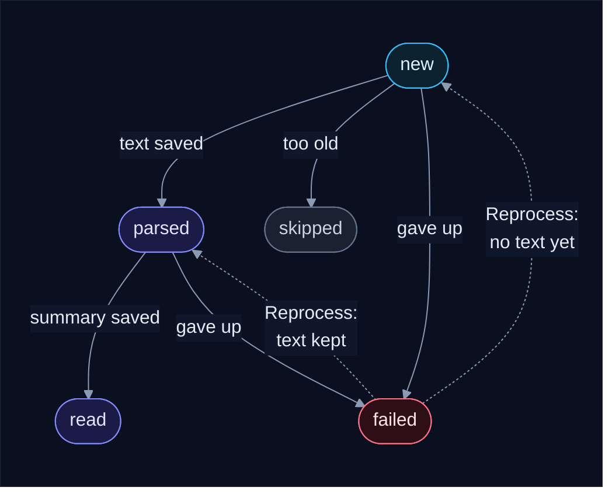
```mermaid
%%{init: {"theme": "base", "flowchart": {"diagramPadding": 0}, "themeVariables": {"darkMode": true, "primaryColor": "#16213a", "primaryTextColor": "#e6edf7", "primaryBorderColor": "#475a7a", "lineColor": "#8b9bb4", "secondaryColor": "#1b2436", "tertiaryColor": "#101a2e", "edgeLabelBackground": "#0f172a", "textColor": "#e2e8f0", "clusterBkg": "#0f1728", "clusterBorder": "#2b3a55", "titleColor": "#c4b5fd", "nodeTextColor": "#e6edf7"}}}%%
flowchart TD
    subgraph canvas[" "]
        direction TB
        c_new(["new"]) -->|"text saved"| c_parsed(["parsed"])
        c_parsed -->|"summary saved"| c_read(["read"])
        c_new -->|"too old"| c_skipped(["skipped"])
        c_new -->|"gave up"| c_failed(["failed"])
        c_parsed -->|"gave up"| c_failed
        c_failed -.->|"Reprocess:<br/>no text yet"| c_new
        c_failed -.->|"Reprocess:<br/>text kept"| c_parsed
    end
    classDef svc fill:#0e2a2c,stroke:#2dd4bf,color:#ccfbf1
    classDef data fill:#1c1a47,stroke:#818cf8,color:#e0e7ff
    classDef ext fill:#2a1640,stroke:#c084fc,color:#f3e8ff
    classDef gpu fill:#2d1b0c,stroke:#fb923c,color:#ffedd5
    classDef ask fill:#2a2410,stroke:#fbbf24,color:#fef3c7
    classDef ok fill:#0b2a1c,stroke:#34d399,color:#d1fae5
    classDef bad fill:#2e0f17,stroke:#fb7185,color:#ffe4e6
    classDef start fill:#1c2a0e,stroke:#a7ef6f,color:#ecfccb
    classDef muted fill:#1a2130,stroke:#64748b,color:#cbd5e1
    classDef queue fill:#0c2231,stroke:#38bdf8,color:#e0f2fe
    class c_new queue
    class c_parsed,c_read data
    class c_failed bad
    class c_skipped muted
    style canvas fill:#0b1020,stroke:#1e293b,color:#0b1020
```

**Each company's assessment** (once the circular is `read`):

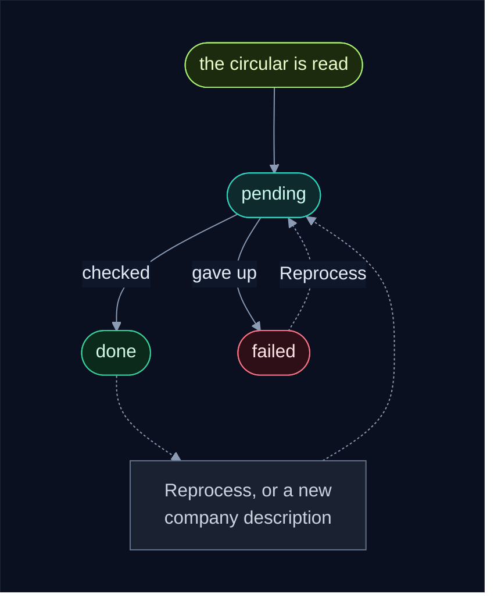
```mermaid
%%{init: {"theme": "base", "flowchart": {"diagramPadding": 0}, "themeVariables": {"darkMode": true, "primaryColor": "#16213a", "primaryTextColor": "#e6edf7", "primaryBorderColor": "#475a7a", "lineColor": "#8b9bb4", "secondaryColor": "#1b2436", "tertiaryColor": "#101a2e", "edgeLabelBackground": "#0f172a", "textColor": "#e2e8f0", "clusterBkg": "#0f1728", "clusterBorder": "#2b3a55", "titleColor": "#c4b5fd", "nodeTextColor": "#e6edf7"}}}%%
flowchart TD
    subgraph canvas[" "]
        direction TB
        r(["the circular is read"]) --> a_pending(["pending"])
        a_pending -->|"checked"| a_done(["done"])
        a_pending -->|"gave up"| a_failed(["failed"])
        a_done -.-> rp["Reprocess, or a new<br/>company description"]
        rp -.-> a_pending
        a_failed -.->|"Reprocess"| a_pending
    end
    classDef svc fill:#0e2a2c,stroke:#2dd4bf,color:#ccfbf1
    classDef data fill:#1c1a47,stroke:#818cf8,color:#e0e7ff
    classDef ext fill:#2a1640,stroke:#c084fc,color:#f3e8ff
    classDef gpu fill:#2d1b0c,stroke:#fb923c,color:#ffedd5
    classDef ask fill:#2a2410,stroke:#fbbf24,color:#fef3c7
    classDef ok fill:#0b2a1c,stroke:#34d399,color:#d1fae5
    classDef bad fill:#2e0f17,stroke:#fb7185,color:#ffe4e6
    classDef start fill:#1c2a0e,stroke:#a7ef6f,color:#ecfccb
    classDef muted fill:#1a2130,stroke:#64748b,color:#cbd5e1
    classDef queue fill:#0c2231,stroke:#38bdf8,color:#e0f2fe
    class a_pending svc
    class a_done ok
    class a_failed bad
    class r start
    class rp muted
    style canvas fill:#0b1020,stroke:#1e293b,color:#0b1020
```

"Too old" means published more than 30 days ago; "gave up" means failed for good; the dotted
arrows are what **Reprocess** (or a new company description) does. What the console shows you
combines the two: a circular is **Analysed** for you once your
assessment is `done`, and **In progress** while it's still `pending`.

**Where `skipped` is set:** by the worker, the first time it picks a `new` circular up, if it
was published more than 30 days ago (`LOOKBACK_DAYS`). The watcher saves every circular on the
regulators' lists, old ones too; reading those would cost OCR and Gemini for nothing. A
circular with no date is never skipped. Nothing retries a skipped circular. To read one
anyway, raise `LOOKBACK_DAYS`, restart the workers, and press **Reprocess** (Reprocess alone
sets it back to `new`, but it's skipped again while it's still too old).

**Where `failed` is set:** by `give_up()`, when a task fails for good: see
[Failed work, and running it again](#failed-work-and-running-it-again). A failed circular
stays failed until someone presses **Reprocess**.

### It saves after every step

Each step is saved (a database **commit**) before the next one starts, and the task is
acknowledged only at the end:

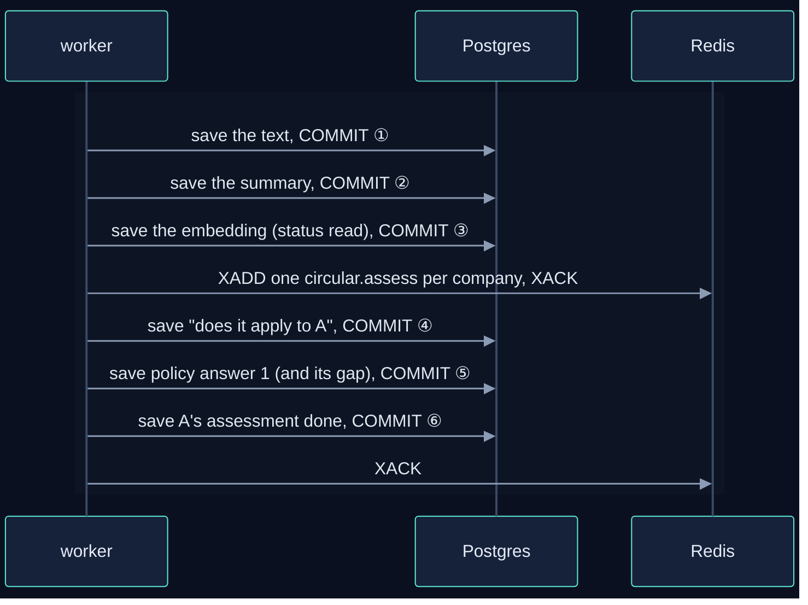
```mermaid
%%{init: {"theme": "base", "sequence": {"diagramMarginX": 0, "diagramMarginY": 0}, "themeVariables": {"darkMode": true, "primaryColor": "#16213a", "primaryTextColor": "#e6edf7", "primaryBorderColor": "#475a7a", "lineColor": "#8b9bb4", "secondaryColor": "#1b2436", "tertiaryColor": "#101a2e", "edgeLabelBackground": "#0f172a", "textColor": "#e2e8f0", "actorBkg": "#16213a", "actorBorder": "#5eead4", "actorTextColor": "#e6edf7", "actorLineColor": "#3b4a66", "signalColor": "#8b9bb4", "signalTextColor": "#e2e8f0", "noteBkgColor": "#2a2410", "noteBorderColor": "#fbbf24", "noteTextColor": "#fde68a", "labelBoxBkgColor": "#1e293b", "labelBoxBorderColor": "#64748b", "labelTextColor": "#e2e8f0", "loopTextColor": "#c4b5fd", "sequenceNumberColor": "#0b1020", "activationBkgColor": "#1e293b"}}}%%
sequenceDiagram
    box rgb(11, 16, 32)
        participant K as worker
        participant DB as Postgres
        participant Q as Redis
    end

    rect rgb(13, 20, 36)
        K->>DB: save the text, COMMIT ①
        K->>DB: save the summary, COMMIT ②
        K->>DB: save the embedding (status read), COMMIT ③
        K->>Q: XADD one circular.assess per company, XACK
        K->>DB: save "does it apply to A", COMMIT ④
        K->>DB: save policy answer 1 (and its gap), COMMIT ⑤
        K->>DB: save A's assessment done, COMMIT ⑥
        K->>Q: XACK
    end
```

So if the worker stops at any point, the task is delivered again (section 5), and nothing
already done is lost or paid for twice:

| It stops… | When the task comes back, it… |
|---|---|
| while reading the PDF | OCRs only the pages not saved yet (the page it was on is read again) |
| after the text is saved | starts at the summary |
| after the circular is `read` | only queues the companies' assessments again |
| after some policy answers | asks only about the policies not answered yet |
| after the assessment is `done` | has nothing to do |

---

## 7. No duplicates: each task is queued once

The consumer group already gives each task to **one** worker, so the workers need no locks
to share the work. What's left to prevent is the same **work** being queued twice: you
press **Reprocess** twice, or save a policy twice in a row, or a task that runs again after a
crash adds its next steps a second time. Two copies would go to two workers, and both would
pay for the same OCR and Gemini calls.

So a task is queued **at most once at a time**. `enqueue` first sets a small key for the
task in Redis with `SET … NX` ("only if it doesn't exist"). If the key was already there,
the same task is queued or running, and the new copy is simply dropped: the one already
there will do the work. When a worker finishes a task, it deletes the key, so the task can
be queued again later:

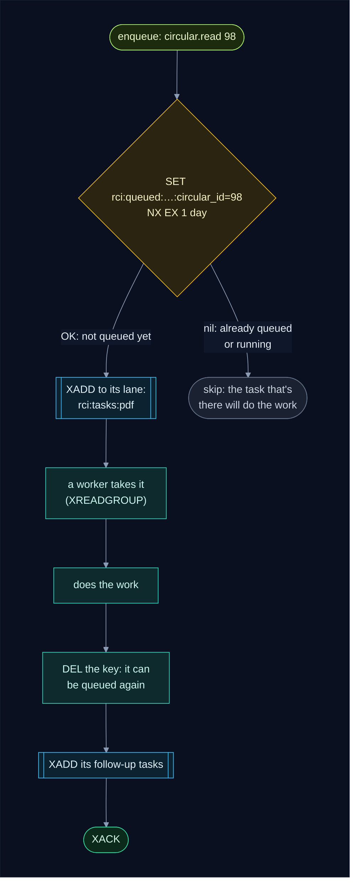
```mermaid
%%{init: {"theme": "base", "flowchart": {"diagramPadding": 0}, "themeVariables": {"darkMode": true, "primaryColor": "#16213a", "primaryTextColor": "#e6edf7", "primaryBorderColor": "#475a7a", "lineColor": "#8b9bb4", "secondaryColor": "#1b2436", "tertiaryColor": "#101a2e", "edgeLabelBackground": "#0f172a", "textColor": "#e2e8f0", "clusterBkg": "#0f1728", "clusterBorder": "#2b3a55", "titleColor": "#c4b5fd", "nodeTextColor": "#e6edf7"}}}%%
flowchart TD
    subgraph canvas[" "]
        direction TB
        add(["enqueue: circular.read 98"]) --> nx{"SET rci:queued:…:circular_id=98<br/>NX EX 1 day"}
        nx -->|"OK: not queued yet"| x[["XADD to its lane:<br/>rci:tasks:pdf"]]
        nx -->|"nil: already queued<br/>or running"| skip(["skip: the task that's<br/>there will do the work"])
        x --> take["a worker takes it<br/>(XREADGROUP)"]
        take --> work["does the work"]
        work --> del["DEL the key: it can<br/>be queued again"]
        del --> follow[["XADD its follow-up tasks"]]
        follow --> ack(["XACK"])
    end
    classDef svc fill:#0e2a2c,stroke:#2dd4bf,color:#ccfbf1
    classDef data fill:#1c1a47,stroke:#818cf8,color:#e0e7ff
    classDef ext fill:#2a1640,stroke:#c084fc,color:#f3e8ff
    classDef gpu fill:#2d1b0c,stroke:#fb923c,color:#ffedd5
    classDef ask fill:#2a2410,stroke:#fbbf24,color:#fef3c7
    classDef ok fill:#0b2a1c,stroke:#34d399,color:#d1fae5
    classDef bad fill:#2e0f17,stroke:#fb7185,color:#ffe4e6
    classDef start fill:#1c2a0e,stroke:#a7ef6f,color:#ecfccb
    classDef muted fill:#1a2130,stroke:#64748b,color:#cbd5e1
    classDef queue fill:#0c2231,stroke:#38bdf8,color:#e0f2fe
    class add start
    class nx ask
    class x,follow queue
    class skip muted
    class take,work,del svc
    class ack ok
    style canvas fill:#0b1020,stroke:#1e293b,color:#0b1020
```

A few details make this safe:

- **The key is deleted before the follow-ups are queued**, so a task can queue itself again.
  A policy edited while its check was running is checked once more, against the new text.
- **A key expires after a day**, in case a worker dies at the wrong moment and never
  deletes it.
- **Retries keep the key.** A task that waits for Gemini, or is retried after a hiccup, is
  still the same task, so nothing else can queue a copy meanwhile.

### The rare clash

Two **different** tasks can still touch the same row at the same moment: a new policy's
`policy.check` and a new circular's `circular.assess` may both ask Gemini about the same
(circular, policy) pair. The database keeps only one verdict per pair (a unique
constraint), so the second save fails with an `IntegrityError`. The worker treats that as a
hiccup and retries the task, which then sees the verdict already saved and skips it.
Nothing is marked failed, and no gap is opened twice.

### A PDF is read only once

Reading a PDF is the slow, costly part, so several checks stand between a `circular.read`
task and the GPU. A page goes to OCR only if nothing has read it before:

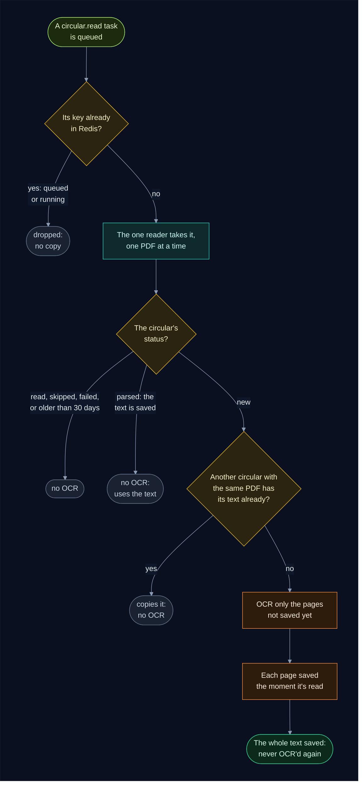
```mermaid
%%{init: {"theme": "base", "flowchart": {"diagramPadding": 0}, "themeVariables": {"darkMode": true, "primaryColor": "#16213a", "primaryTextColor": "#e6edf7", "primaryBorderColor": "#475a7a", "lineColor": "#8b9bb4", "secondaryColor": "#1b2436", "tertiaryColor": "#101a2e", "edgeLabelBackground": "#0f172a", "textColor": "#e2e8f0", "clusterBkg": "#0f1728", "clusterBorder": "#2b3a55", "titleColor": "#c4b5fd", "nodeTextColor": "#e6edf7"}}}%%
flowchart TD
    subgraph canvas[" "]
        direction TB
        e(["A circular.read task<br/>is queued"]) --> k{"Its key already<br/>in Redis?"}
        k -->|"yes: queued<br/>or running"| d1(["dropped:<br/>no copy"])
        k -->|"no"| one["The one reader takes it,<br/>one PDF at a time"]
        one --> st{"The circular's<br/>status?"}
        st -->|"read, skipped, failed,<br/>or older than 30 days"| d2(["no OCR"])
        st -->|"parsed: the<br/>text is saved"| d3(["no OCR:<br/>uses the text"])
        st -->|"new"| tw{"Another circular with<br/>the same PDF has<br/>its text already?"}
        tw -->|"yes"| d4(["copies it:<br/>no OCR"])
        tw -->|"no"| pg["OCR only the pages<br/>not saved yet"]
        pg --> sv["Each page saved<br/>the moment it's read"]
        sv --> done(["The whole text saved:<br/>never OCR'd again"])
    end
    classDef svc fill:#0e2a2c,stroke:#2dd4bf,color:#ccfbf1
    classDef data fill:#1c1a47,stroke:#818cf8,color:#e0e7ff
    classDef ext fill:#2a1640,stroke:#c084fc,color:#f3e8ff
    classDef gpu fill:#2d1b0c,stroke:#fb923c,color:#ffedd5
    classDef ask fill:#2a2410,stroke:#fbbf24,color:#fef3c7
    classDef ok fill:#0b2a1c,stroke:#34d399,color:#d1fae5
    classDef bad fill:#2e0f17,stroke:#fb7185,color:#ffe4e6
    classDef start fill:#1c2a0e,stroke:#a7ef6f,color:#ecfccb
    classDef muted fill:#1a2130,stroke:#64748b,color:#cbd5e1
    classDef queue fill:#0c2231,stroke:#38bdf8,color:#e0f2fe
    class e start
    class k,st,tw ask
    class one svc
    class pg,sv gpu
    class d1,d2,d3,d4 muted
    class done ok
    style canvas fill:#0b1020,stroke:#1e293b,color:#0b1020
```

Each way a PDF could be read twice was tested on 2026-10-03 against the real worker code,
counting every page sent to OCR:

| What happens | Pages sent to OCR |
|---|---|
| a new circular (3 pages, the last one blank) | each page once; the blank page never |
| the same circular queued again after it was read (a re-delivery, **Reprocess**, `manage.py requeue`) | none |
| the same task queued twice before it runs | the copy is dropped |
| a new circular with exactly the same PDF as one already read | none: it copies the text |
| two circulars with the same new PDF, queued together | each page once: the second copies the first's text |
| a page's request times out | only that page is sent again |
| the reader is killed on page 3, and a new one takes over | pages 1 and 2 are not sent again |
| **Reprocess** on a failed circular that has its text | none |
| a circular older than `LOOKBACK_DAYS` | none: it's skipped |

The one thing sent again is a page whose request never finished (a timeout, or the reader
stopped mid-page): its text was never saved, so there's nothing to reuse. A page that was
read is never sent again.

**Why exactly one reader.** The OCR server reads one page at a time (`--max-num-seqs 1`),
so a second reader would only take turns with the first. And with one reader, two
circulars with the same PDF are always read one after the other, so the second finds the
first's text. Compose runs the `reader` service with exactly one copy for both reasons.

### Sharing the GPU

Only the reader sends pages to the GPU, one at a time. Meanwhile the workers on the main
lane need no GPU and keep going:

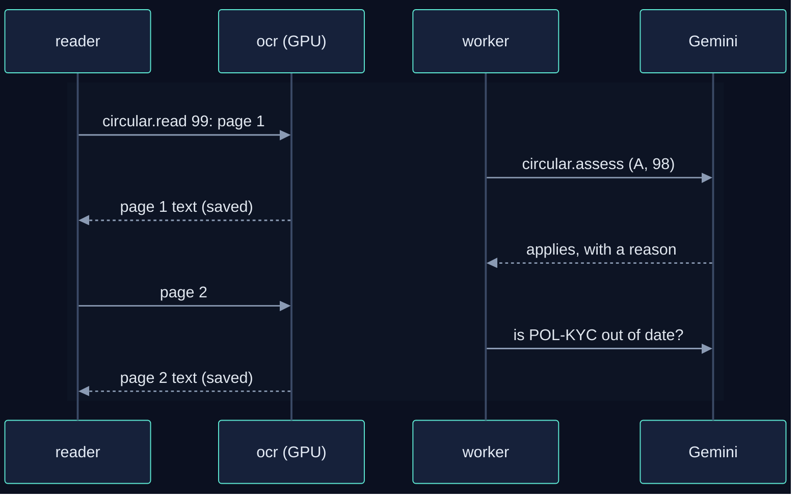
```mermaid
%%{init: {"theme": "base", "sequence": {"diagramMarginX": 0, "diagramMarginY": 0}, "themeVariables": {"darkMode": true, "primaryColor": "#16213a", "primaryTextColor": "#e6edf7", "primaryBorderColor": "#475a7a", "lineColor": "#8b9bb4", "secondaryColor": "#1b2436", "tertiaryColor": "#101a2e", "edgeLabelBackground": "#0f172a", "textColor": "#e2e8f0", "actorBkg": "#16213a", "actorBorder": "#5eead4", "actorTextColor": "#e6edf7", "actorLineColor": "#3b4a66", "signalColor": "#8b9bb4", "signalTextColor": "#e2e8f0", "noteBkgColor": "#2a2410", "noteBorderColor": "#fbbf24", "noteTextColor": "#fde68a", "labelBoxBkgColor": "#1e293b", "labelBoxBorderColor": "#64748b", "labelTextColor": "#e2e8f0", "loopTextColor": "#c4b5fd", "sequenceNumberColor": "#0b1020", "activationBkgColor": "#1e293b"}}}%%
sequenceDiagram
    box rgb(11, 16, 32)
        participant R as reader
        participant O as ocr (GPU)
        participant K as worker
        participant G as Gemini
    end

    rect rgb(13, 20, 36)
        R->>O: circular.read 99: page 1
        K->>G: circular.assess (A, 98)
        O-->>R: page 1 text (saved)
        G-->>K: applies, with a reason
        R->>O: page 2
        K->>G: is POL-KYC out of date?
        O-->>R: page 2 text (saved)
    end
```

### Why no "skip locked"?

"Skip locked" is the classic way for several workers to share one queue in a database: each
worker locks the row it takes, and the others skip locked rows. Here the queue is Redis, and
the consumer group already does that job:

| | Redis consumer group (used here) | `SELECT … FOR UPDATE SKIP LOCKED` |
|---|---|---|
| What it hands out | each **task** to one worker | each **row** to one transaction |
| Held until | `XACK` (renewed every minute; taken over after 5 minutes without renewal) | the next COMMIT or ROLLBACK |
| Survives the step-by-step commits? | yes | **no**: the first COMMIT releases the row |
| If the worker dies | the task stays pending and is taken over | the lock is released; the row is picked again |

The row lock is also why it would fit badly: the worker commits after every step, and the
first commit would release the row while the circular is still being worked on.

---

## 8. Companies and logins

Every user belongs to **one company** and signs in with an email and password. The api gives
back a **token** (a JWT) that names the user and the company, and the console sends it with
every call:

```mermaid
%%{init: {"theme": "base", "flowchart": {"diagramPadding": 0}, "themeVariables": {"darkMode": true, "primaryColor": "#16213a", "primaryTextColor": "#e6edf7", "primaryBorderColor": "#475a7a", "lineColor": "#8b9bb4", "secondaryColor": "#1b2436", "tertiaryColor": "#101a2e", "edgeLabelBackground": "#0f172a", "textColor": "#e2e8f0", "clusterBkg": "#0f1728", "clusterBorder": "#2b3a55", "titleColor": "#c4b5fd", "nodeTextColor": "#e6edf7"}}}%%
flowchart LR
    subgraph canvas[" "]
        direction LR
        login(["Priya signs in<br/>priya@bank-a.com"]) --> tok["api gives a token:<br/>user 7, <b>company A</b>"]
        tok --> carry["every call carries<br/>the token"]
        carry --> where["every query adds<br/><b>WHERE company_id = A</b>"]
        where --> sees["Priya sees A's policies,<br/>A's gaps, A's answers,<br/>and every circular"]
        where -.->|"company B's rows"| no(["404 not found"])
    end
    classDef svc fill:#0e2a2c,stroke:#2dd4bf,color:#ccfbf1
    classDef data fill:#1c1a47,stroke:#818cf8,color:#e0e7ff
    classDef ext fill:#2a1640,stroke:#c084fc,color:#f3e8ff
    classDef gpu fill:#2d1b0c,stroke:#fb923c,color:#ffedd5
    classDef ask fill:#2a2410,stroke:#fbbf24,color:#fef3c7
    classDef ok fill:#0b2a1c,stroke:#34d399,color:#d1fae5
    classDef bad fill:#2e0f17,stroke:#fb7185,color:#ffe4e6
    classDef start fill:#1c2a0e,stroke:#a7ef6f,color:#ecfccb
    classDef muted fill:#1a2130,stroke:#64748b,color:#cbd5e1
    classDef queue fill:#0c2231,stroke:#38bdf8,color:#e0f2fe
    class login start
    class tok,carry svc
    class where queue
    class sees ok
    class no bad
    style canvas fill:#0b1020,stroke:#1e293b,color:#0b1020
```

- **Circulars are shared.** They're public, and reading one is the same for everyone, so
  it's done once. Everything that depends on the company is kept per company:
  `assessments`, `policies`, `controls`, `policy_checks` (through the policy), `gaps`.
- **Policy codes are per company.** Two companies can each have a POL-KYC.
- **Another company's row is "not found"**, never "forbidden", so ids reveal nothing.
- **The worker works for everyone.** Tasks carry the company id, and every query the worker
  makes for a company is filtered by it.

---

## 9. When something goes wrong

| What happens | Example | What the worker does | What you do |
|---|---|---|---|
| a service is down | OCR still loading, Gemini quota used up | leaves the task unacknowledged, waits a minute, tries again; only that lane waits (while OCR loads, the workers carry on) | nothing, or raise your quota |
| a hiccup | a timeout, a server error, an answer in the wrong shape | retries the task up to 3 times | nothing |
| anything else | the PDF has no text at all; the PDF is missing from S3; Gemini refuses the request | marks the circular (or your assessment) `failed` with the error, copies the task to `rci:dead` | open the circular, read **Why it failed**, fix the cause, press **Reprocess** ([how it runs again](#failed-work-and-running-it-again)) |
| Redis is down | a restart | the api answers "try again" (a new policy or a description change isn't saved; a policy edit is, and saving again queues its task); the watcher tries its new circulars again next round; the worker waits for Redis | save again once Redis is back |
| a worker dies | the machine restarts | its task is picked up again (section 5) | nothing |

---

## 10. Quick reference

**What each task reads and writes:**

| Task | Reads | Writes |
|---|---|---|
| `circular.read` | the PDF from S3, pages already in `ocr_pages` (or a twin's saved text and summary) | `ocr_pages` while reading; `circulars`: `text`, summary fields, `embedding`, status `parsed` then `read`; an `assessments` row per company; queues `circular.assess` |
| `circular.assess` | `companies.profile`, the company's `policies`, `controls`, `policy_checks` | `assessments`, `policy_checks`, `gaps`, `gap_events` |
| `policy.check` | the policy, the company's recent circulars | `policies.embeddings` and `checked_at`, `policy_checks`, `gaps`, `gap_events` |
| `company.refresh` | the company's `updated_at`, its `assessments`, recent read `circulars` | `assessments`: older answers back to `pending`, missing ones added; queues `circular.assess` |

**Settings you might change** (in `.env`):

| Setting | Default | What it does |
|---|---|---|
| `WORKERS` | 1 | how many workers take the main lane side by side |
| `MATCH_TOP_K` | 3 | how many closest policies Gemini checks per circular |
| `LOOKBACK_DAYS` | 30 | new circulars older than this are skipped; new policies and new companies are checked against this many days |
| `OCR_MAX_PAGES` | 20 | pages read per PDF |
| `GEMINI_MODEL_NAME` | `gemini-3.5-flash` | the model that answers the questions |

**Want more?**

- [How it works](how_it_works.md), the main guide to the whole app.
- [How the watcher works](how_the_watcher_works.md): where the `circular.read` tasks come
  from, step by step.
- [Worker internals](backend/worker/INTERNALS.md): everything the worker does in 18 steps,
  then every function, Redis command, SQL statement and commit, for developers changing
  the code.
