# Redis Made Easy — A Developer Guide with Simple Examples

This guide explains Redis the simple way. Every idea comes with:

- a **real-life picture**, so the idea makes sense before the code,
- a **small `redis-cli` example** with the real reply from Redis,
- **short Python code** you can copy into your project,
- **diagrams** (Mermaid) for anything with moving parts.

**How to read the examples**

- A line starting with `>` is a command typed into `redis-cli`. The lines under it are what Redis replied. All replies in this guide come from a real Redis 7 server.
- `(integer) 1` is a number, `"Asha"` is text, `(nil)` means "nothing there", and `1) 2) 3)` is a list of results.
- Python examples use the `redis-py` library and assume this connection:
  ```python
  import redis
  r = redis.Redis(decode_responses=True)
  ```

**Our story.** All examples build one small app: **Tiffin Express**, a food-ordering app.
Asha is a customer. Ravi, Meena and Kumar are cooks in the kitchen (in code they are *worker processes*). Anu works in billing.

**Versions:** Redis 7+ (Redis 8 and Valkey work too), redis-py 5+, Python 3.10+.

---

## Contents

**Part 1 — Getting started**
1. [What is Redis?](#1-what-is-redis)
2. [Setup and connecting](#2-setup-and-connecting)
3. [Naming your keys](#3-naming-your-keys)
4. [The data types](#4-the-data-types)
5. [TTL: keys that delete themselves](#5-ttl-keys-that-delete-themselves)

**Part 2 — Everyday product patterns**

6. [Caching](#6-caching)
7. [Login sessions](#7-login-sessions)
8. [Rate limiting](#8-rate-limiting)
9. [Locks: one worker at a time](#9-locks-one-worker-at-a-time)
10. [Idempotency: the double-click problem](#10-idempotency-the-double-click-problem)
11. [Leaderboards and counters](#11-leaderboards-and-counters)
12. [Delayed jobs: "do this later"](#12-delayed-jobs-do-this-later)

**Part 3 — Safe and fast**

13. [One cashier: how Redis runs commands](#13-one-cashier-how-redis-runs-commands)
14. [Pipeline: one trip instead of many](#14-pipeline-one-trip-instead-of-many)
15. [Transactions: MULTI, EXEC and WATCH](#15-transactions-multi-exec-and-watch)
16. [Lua scripts: small programs inside Redis](#16-lua-scripts-small-programs-inside-redis)

**Part 4 — Messages and queues**

17. [Pub/Sub: the loudspeaker](#17-pubsub-the-loudspeaker)
18. [Streams: the kitchen order rail](#18-streams-the-kitchen-order-rail) (consumer groups, `XREADGROUP`, `XACK`, pending messages, crash recovery, no duplicates, and more)

**Part 5 — Running Redis for real**

19. [Saving data to disk](#19-saving-data-to-disk)
20. [When memory is full](#20-when-memory-is-full)
21. [Copies, failover and clusters](#21-copies-failover-and-clusters)
22. [Security](#22-security)
23. [Watching Redis health](#23-watching-redis-health)
24. [Managed Redis and Valkey](#24-managed-redis-and-valkey)

**Part 6 — Redis in AI apps**

25. [Caching, memory, budgets and streaming for LLM apps](#25-redis-in-ai-apps)

**Part 7 — Wrap-up**

26. [Testing your Redis code](#26-testing-your-redis-code)
27. [Top 20 mistakes](#27-top-20-mistakes)
28. [Cheat sheet](#28-cheat-sheet)
29. [Practice exercises](#29-practice-exercises)

---

# Part 1 — Getting started

## 1. What is Redis?

**In one line:** Redis is a very fast store that keeps data in memory (RAM) and answers in well under a millisecond.

**Real-life picture.** Your main database (Postgres, MySQL) is a **filing cabinet in the back room**: safe and organised, but you have to walk there. Redis is a **whiteboard next to the counter**: you can read and write it instantly, but it is smaller. You keep the real records in the cabinet and put the things you need *often* or *right now* on the whiteboard.

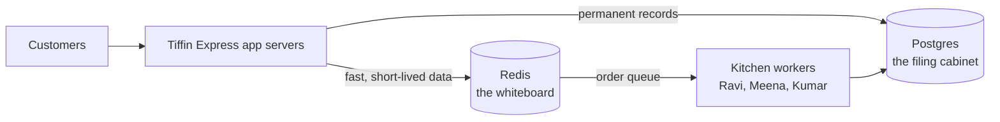

**What Tiffin Express keeps in Redis**

| Need | Redis feature | Section |
|---|---|---|
| Show the menu fast | Cache | [6](#6-caching) |
| Remember who is logged in | Sessions | [7](#7-login-sessions) |
| One-time passwords that expire | TTL | [5](#5-ttl-keys-that-delete-themselves) |
| Stop someone trying 1,000 passwords | Rate limiting | [8](#8-rate-limiting) |
| Never charge a customer twice | Idempotency keys | [10](#10-idempotency-the-double-click-problem) |
| "Top 10 dishes this week" | Sorted set | [11](#11-leaderboards-and-counters) |
| Send orders to the kitchen reliably | Streams | [18](#18-streams-the-kitchen-order-rail) |
| "Your order is ready" pop-up | Pub/Sub | [17](#17-pubsub-the-loudspeaker) |

**What Redis is not good at:** complex searches with joins (use SQL), data much bigger than your RAM budget, and being the *only* copy of important data unless you set up saving to disk and copies ([Part 5](#part-5--running-redis-for-real)).

---

## 2. Setup and connecting

### Start Redis

```bash
docker run -d --name redis -p 6379:6379 redis:7
pip install "redis>=5"
```

Check it is alive with the command-line tool `redis-cli`:

```text
> PING
PONG
```

### Connect from Python

```python
import redis

r = redis.Redis(host="localhost", port=6379, decode_responses=True)
r.set("hello", "world")
print(r.get("hello"))      # world
```

`decode_responses=True` gives you normal Python strings. Without it you get bytes (`b"world"`). Keep the default bytes mode only when you store binary data such as images or AI embeddings.

### Use one connection pool

**Real-life picture:** opening a new connection is like dialling a new phone call for every question. A **pool** keeps a few phone lines open and reuses them.

```python
pool = redis.ConnectionPool.from_url(
    "redis://localhost:6379/0",
    decode_responses=True,
    max_connections=50,        # most lines this process may open
    socket_connect_timeout=2,  # give up quickly if Redis is down
    socket_timeout=10,         # must be longer than any BLOCK wait you use (see Streams)
)
r = redis.Redis(connection_pool=pool)   # create once, reuse everywhere
```

### Async version (FastAPI and friends)

```python
import redis.asyncio as aioredis

r = aioredis.Redis.from_url("redis://localhost:6379/0", decode_responses=True)

async def get_name(user_id: int) -> str | None:
    return await r.hget(f"user:{user_id}", "name")

# when the app shuts down
await r.aclose()
```

---

## 3. Naming your keys

Redis has no tables. Every value lives under a **key name**, so your key names are your structure. Think of them as **folder paths**.

```
app:thing:id:detail

user:1               -> Asha's profile
user:1:cart          -> Asha's cart
session:9f3a...      -> one login session
cache:menu:v2        -> cached menu (version 2 of the format)
rl:login:asha        -> Asha's login-attempt counter
orders               -> the order stream
```

Simple rules:

- Use `:` between parts. Tools like RedisInsight show keys as folders this way.
- Short but readable. Millions of keys × long names = wasted memory.
- Put a **version** in cache keys (`cache:menu:v2`). When the data format changes, switch to `v3` and all old cache entries are ignored.
- Never put raw user input in a key without checking it first.

---

## 4. The data types

Choosing the right type is half of Redis.

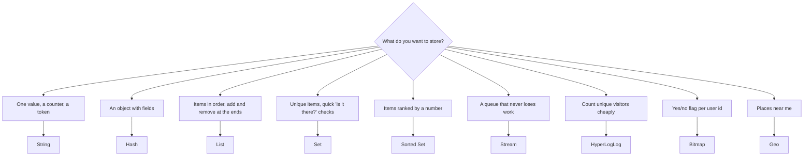

### 4.1 String — one value under one name

**Picture:** a sticky note with a label.

```text
> SET greeting "Welcome to Tiffin Express"
OK
> GET greeting
"Welcome to Tiffin Express"
# INCR adds 1. It is safe even if 1,000 users do it at the same moment.
> INCR page:views
(integer) 1
> INCR page:views
(integer) 2
> INCRBY wallet:asha 50
(integer) 50
# NX = only set it if it does not exist yet
> SET coupon:FIRST50 asha NX
OK
> SET coupon:FIRST50 ravi NX
(nil)
> GET coupon:FIRST50
"asha"
```

The coupon could be claimed only once: Ravi's `SET ... NX` returned `(nil)`, so Asha keeps it.

```python
r.set("greeting", "Welcome to Tiffin Express")
r.incr("page:views")                          # counter
r.set("otp:asha", "482913", ex=300)           # disappears after 5 minutes
first = r.set("coupon:FIRST50", "asha", nx=True)   # True only for the first person
```

### 4.2 Hash — a small object with fields

**Picture:** one filled-in form, with field names and values.

```text
> HSET user:1 name Asha city Chennai plan free credits 10
(integer) 4
> HGET user:1 name
"Asha"
> HGETALL user:1
1) "name"
2) "Asha"
3) "city"
4) "Chennai"
5) "plan"
6) "free"
7) "credits"
8) "10"
> HINCRBY user:1 credits -1
(integer) 9
> HSET user:1 plan pro
(integer) 0
> HMGET user:1 name plan credits
1) "Asha"
2) "pro"
3) "9"
```

```python
r.hset("user:1", mapping={"name": "Asha", "city": "Chennai", "plan": "free", "credits": 10})
user = r.hgetall("user:1")        # {'name': 'Asha', 'city': 'Chennai', ...}
r.hincrby("user:1", "credits", -1)
```

> **Remember:** every value comes back as a string (`'10'`, not `10`). Convert it yourself: `int(user["credits"])`.

### 4.3 List — items in a line

**Picture:** people standing in a queue. You can join at either end and leave from either end.

```text
# Asha's recently viewed dishes, newest first
> LPUSH recent:asha idli
(integer) 1
> LPUSH recent:asha dosa
(integer) 2
> LPUSH recent:asha vada
(integer) 3
> LRANGE recent:asha 0 -1
1) "vada"
2) "dosa"
3) "idli"
# keep only the newest 2
> LTRIM recent:asha 0 1
OK
> LRANGE recent:asha 0 -1
1) "vada"
2) "dosa"
# a simple job queue: add at the right, take from the left
> RPUSH jobs send-email send-sms
(integer) 2
> LPOP jobs
"send-email"
> LLEN jobs
(integer) 1
```

```python
r.lpush("recent:asha", "dosa")
r.ltrim("recent:asha", 0, 49)          # keep the newest 50
recent = r.lrange("recent:asha", 0, 9)  # top 10

job = r.blpop("jobs", timeout=5)        # wait up to 5 s for a job, else None
```

> **Remember:** once a job is popped from a list, it is gone. If the worker crashes before finishing, the job is lost. For work that must never be lost, use [Streams](#18-streams-the-kitchen-order-rail).

### 4.4 Set — unique items, no order

**Picture:** a guest list. Writing a name twice doesn't add it twice.

```text
> SADD dish:dosa:likes asha ravi meena
(integer) 3
> SADD dish:dosa:likes asha
(integer) 0
> SISMEMBER dish:dosa:likes ravi
(integer) 1
> SCARD dish:dosa:likes
(integer) 3
# dishes both Asha and Ravi like
> SADD likes:asha dosa idli vada
(integer) 3
> SADD likes:ravi dosa pongal vada
(integer) 3
> SINTER likes:asha likes:ravi
1) "vada"
2) "dosa"
```

```python
r.sadd("dish:dosa:likes", "asha")
already_liked = r.sismember("dish:dosa:likes", "asha")   # True
like_count = r.scard("dish:dosa:likes")
```

### 4.5 Sorted set — unique items ranked by a score

**Picture:** a cricket scoreboard. Every player has a score and the board is always in order.

```text
> ZADD top:dishes 120 dosa 95 idli 60 vada
(integer) 3
# 50 more dosas sold
> ZINCRBY top:dishes 50 dosa
"170"
# highest first, with scores
> ZREVRANGE top:dishes 0 2 WITHSCORES
1) "dosa"
2) "170"
3) "idli"
4) "95"
5) "vada"
6) "60"
# idli's position (0 = first place)
> ZREVRANK top:dishes idli
(integer) 1
> ZSCORE top:dishes vada
"60"
# dishes that sold at least 90
> ZRANGEBYSCORE top:dishes 90 +inf
1) "idli"
2) "dosa"
```

```python
r.zincrby("top:dishes", 1, "dosa")                          # one more sale
top3 = r.zrevrange("top:dishes", 0, 2, withscores=True)     # [('dosa', 170.0), ...]
```

Sorted sets are used for leaderboards, priority queues, rate limits and scheduled jobs (score = time).

### 4.6 HyperLogLog — count unique things with tiny memory

**Picture:** a clicker counter at a gate that counts *different* people, not total entries. It is a little bit approximate (about 1% error) but uses only about 12 KB, even for millions of people.

```text
> PFADD visitors:today asha ravi asha meena asha
(integer) 1
> PFCOUNT visitors:today
(integer) 3
```

### 4.7 Bitmap — one yes/no bit per user id

**Picture:** a long row of light switches, one per user. On = active today.

```text
> SETBIT active:today 7 1
(integer) 0
> SETBIT active:today 12 1
(integer) 0
> GETBIT active:today 7
(integer) 1
> GETBIT active:today 8
(integer) 0
> BITCOUNT active:today
(integer) 2
```

One million users = one million bits ≈ 125 KB.

### 4.8 Geo — places near me

```text
> GEOADD kitchens 80.2707 13.0827 chennai-central 80.2209 13.0475 chennai-tnagar 77.5946 12.9716 bengaluru-mg
(integer) 3
# kitchens within 10 km of a customer, nearest first
> GEOSEARCH kitchens FROMLONLAT 80.25 13.06 BYRADIUS 10 km ASC WITHDIST
1) 1) "chennai-central"
   2) "3.3773"
2) 1) "chennai-tnagar"
   2) "3.4460"
```

```python
r.geoadd("kitchens", [80.2707, 13.0827, "chennai-central"])
nearby = r.geosearch("kitchens", longitude=80.25, latitude=13.06,
                     radius=10, unit="km", withdist=True, sort="ASC")
```

### 4.9 Stream — a queue that never loses work

The most powerful type, with its own big chapter: [Streams](#18-streams-the-kitchen-order-rail).

### 4.10 JSON, search and vectors

Redis 8 includes JSON documents, search indexes and vector search (on Redis 7 these come from "Redis Stack"). Vector search is used for AI features ([section 25](#25-redis-in-ai-apps)).

### 4.11 Which commands are fast?

| Always fast (size doesn't matter) | Gets slower as the key grows |
|---|---|
| `GET`, `SET`, `INCR`, `HGET`, `HSET`, `SADD`, `SISMEMBER`, `LPUSH`, `LPOP`, `XADD` | `HGETALL`, `SMEMBERS`, `LRANGE 0 -1`, `KEYS *`, `DEL` of a huge key |
| `ZADD`, `ZRANK`, `ZINCRBY` (fast, grows very slowly) | |

Commands in the right column are fine on small keys. On a key with millions of items they can freeze Redis for everyone ([section 13](#13-one-cashier-how-redis-runs-commands)).

---

## 5. TTL: keys that delete themselves

**In one line:** any key can have a **time-to-live**. When it runs out, Redis deletes the key.

**Picture:** milk with an expiry date.

```text
> SET otp:asha 482913 EX 60
OK
> TTL otp:asha
(integer) 60
# a key with no expiry
> SET menu:title "Tiffin Express"
OK
> TTL menu:title
(integer) -1
# a key that does not exist
> TTL nothing:here
(integer) -2
# Careful: a plain SET removes the expiry!
> SET otp:asha 111111
OK
> TTL otp:asha
(integer) -1
# KEEPTTL changes the value but keeps the expiry
> SET otp:asha 222222 EX 60
OK
> SET otp:asha 333333 KEEPTTL
OK
> TTL otp:asha
(integer) 60
# add an expiry to an existing key
> EXPIRE menu:title 120
(integer) 1
> TTL menu:title
(integer) 120
```

What `TTL` replies mean: a positive number = seconds left, `-1` = never expires, `-2` = key doesn't exist.

```python
r.set("otp:asha", "482913", ex=300)        # 5 minutes
r.expire("session:abc", 1800)              # add or reset a TTL
r.expire("counter", 60, nx=True)           # only if it has no TTL yet
r.set("otp:asha", "999999", keepttl=True)  # change value, keep TTL
seconds_left = r.ttl("otp:asha")
```

**Always give these a TTL:** cache entries, sessions, OTPs, rate-limit counters, locks, idempotency keys.

How Redis cleans up expired keys:

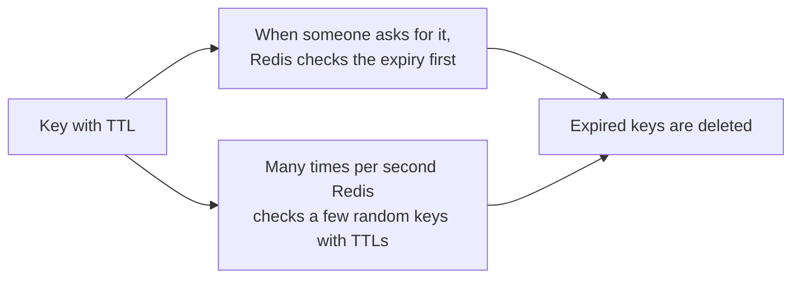

You will never *read* an expired key, but its memory may be freed a moment later than the exact expiry time.

---

# Part 2 — Everyday product patterns

## 6. Caching

**Problem:** every time someone opens the menu, the app runs a slow database query. With 10,000 visitors, that's 10,000 slow queries for the same menu.

**Picture:** the first time someone asks "what's today's special?", the cashier walks to the back room and checks. Then they **write the answer on the whiteboard**. Everyone after that just reads the whiteboard. At the end of the day the whiteboard is wiped (TTL).

### 6.1 Cache-aside: the pattern you will use 90% of the time

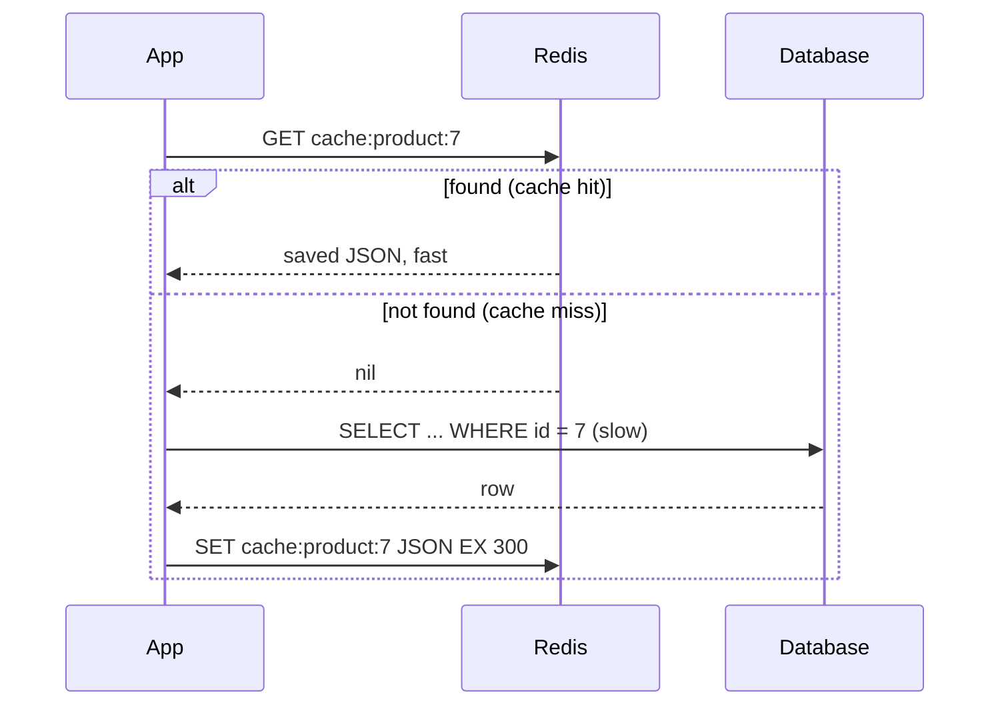

```python
import json

def get_product(product_id: int) -> dict:
    key = f"cache:product:{product_id}"
    saved = r.get(key)
    if saved is not None:                        # 1. hit: fast path
        print("from cache")
        return json.loads(saved)
    print("from database")
    product = db.query_product(product_id)       # 2. miss: ask the database
    r.set(key, json.dumps(product), ex=300)      # 3. save for 5 minutes
    return product

get_product(7)    # from database
get_product(7)    # from cache
get_product(7)    # from cache
```

### 6.2 A reusable decorator

Add `@cached(...)` to any slow function. The random "jitter" makes keys expire at slightly different times, so they don't all run out together.

```python
import functools
import random

def cached(prefix: str, ttl: int = 300, jitter: float = 0.1):
    def decorator(fn):
        @functools.wraps(fn)
        def wrapper(*args):
            key = f"cache:{prefix}:" + ":".join(map(str, args))
            saved = r.get(key)
            if saved is not None:
                return json.loads(saved)
            value = fn(*args)
            real_ttl = int(ttl * random.uniform(1 - jitter, 1 + jitter))  # 270..330 s
            r.set(key, json.dumps(value), ex=real_ttl)
            return value
        return wrapper
    return decorator

@cached("menu", ttl=300)
def get_menu(kitchen_id: int) -> list:
    return [{"dish": "dosa", "price": 80}, {"dish": "idli", "price": 40}]   # imagine a slow query

print(get_menu(1))
```

Because `None` is saved as the JSON text `"null"`, "not found" answers are cached too. This is called **negative caching**: it stops the database being asked again and again for something that doesn't exist.

### 6.3 When the data changes

**Rule:** after you update the database, **delete** the cache key. The next reader loads the fresh value.

```python
def update_product(product_id: int, data: dict) -> None:
    db.update_product(product_id, data)          # 1. update the real record first
    r.delete(f"cache:product:{product_id}")      # 2. then remove the old copy
```

Simple rules for fresh data:

1. **Delete, don't update** the cached value.
2. Delete **after** the database update has finished (committed), not before. Otherwise another request may put the old value back.
3. **Always keep a TTL**, so even a forgotten delete fixes itself.
4. When the data *format* changes, change the key version: `cache:v2:product:7` → `cache:v3:product:7`.

### 6.4 Other ways to cache

| Strategy | In simple words | Good for | Watch out |
|---|---|---|---|
| **Cache-aside** | Look in cache, else load and save | Most read-heavy data | Old data until delete or TTL |
| **Write-through** | Every write goes to DB and cache together | Data read right after it's written | Slower writes |
| **Write-behind** | Write to cache now, a worker saves to DB later | Very frequent counters (likes, views) | Data lost if Redis dies first |
| **Refresh-ahead** | Refresh popular keys before they expire | A few very hot keys | Wasted work on keys nobody reads |

### 6.5 Cache stampede

**Picture:** the whiteboard is wiped at 1:00 pm and 500 people ask for the special at 1:00:01. All 500 run to the back room at once and the back room collapses.

**Fix:** let **one** person go to the back room. Everyone else waits a moment and reads the whiteboard.

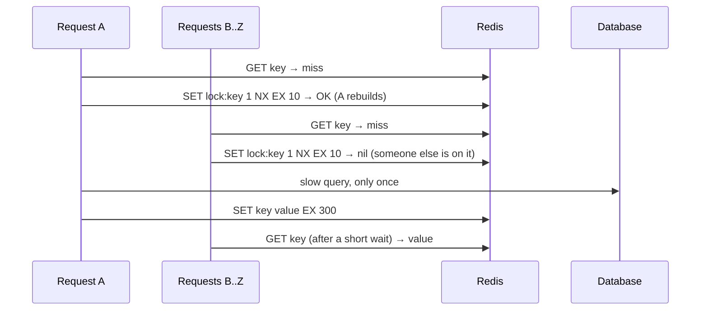

```python
import time

def get_with_rebuild_lock(key: str, loader, ttl: int = 300):
    saved = r.get(key)
    if saved is not None:
        return json.loads(saved)

    if r.set(f"lock:{key}", "1", nx=True, ex=10):     # I am the one who rebuilds
        try:
            value = loader()
            r.set(key, json.dumps(value), ex=ttl)
            return value
        finally:
            r.delete(f"lock:{key}")

    for _ in range(50):                                # others: wait up to ~5 s
        time.sleep(0.1)
        saved = r.get(key)
        if saved is not None:
            return json.loads(saved)
    return loader()                                    # last resort

print(get_with_rebuild_lock("cache:special", lambda: {"special": "ghee roast"}))
```

### 6.6 What to store in the cache

- JSON is easy to read. `orjson` or `msgpack` are faster and smaller.
- Don't use `pickle` for data other services can write: loading a pickle can run code.
- Compress values bigger than a few KB.
- Many small keys are better than one giant key that every request rewrites.

---

## 7. Login sessions

**Picture:** a cloakroom token. You get a random token at the door, and any staff member can look up your coat with it.

After login, the app creates a random session id, stores the user's details under it in Redis, and sends the id to the browser as a cookie. Any app server can read it, so it doesn't matter which server handles the next request.

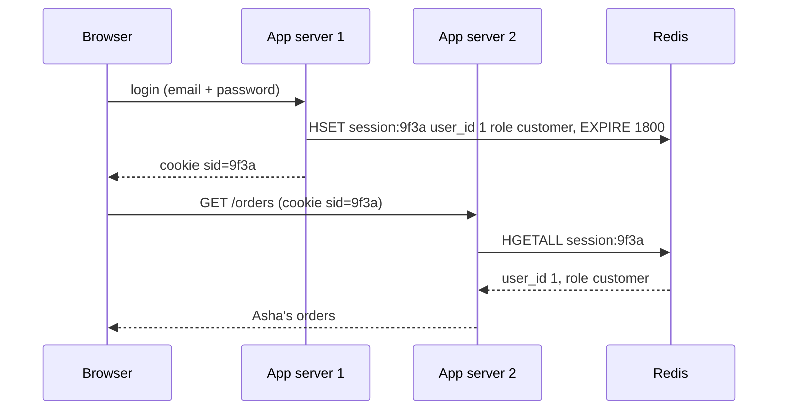

```python
import secrets

SESSION_TTL = 1800    # 30 minutes without activity

def create_session(user_id: int, role: str) -> str:
    sid = secrets.token_urlsafe(32)              # long random id, impossible to guess
    pipe = r.pipeline()
    pipe.hset(f"session:{sid}", mapping={"user_id": user_id, "role": role})
    pipe.expire(f"session:{sid}", SESSION_TTL)
    pipe.sadd(f"user:{user_id}:sessions", sid)   # list of this user's devices
    pipe.execute()
    return sid                                   # send as an HttpOnly, Secure cookie

def load_session(sid: str) -> dict | None:
    pipe = r.pipeline()
    pipe.hgetall(f"session:{sid}")
    pipe.expire(f"session:{sid}", SESSION_TTL)   # active users stay logged in
    data, _ = pipe.execute()
    return data or None

def logout(sid: str) -> None:
    r.delete(f"session:{sid}")

def logout_everywhere(user_id: int) -> None:
    for sid in r.smembers(f"user:{user_id}:sessions"):
        r.delete(f"session:{sid}")
    r.delete(f"user:{user_id}:sessions")

sid = create_session(1, "customer")
print(load_session(sid))       # {'user_id': '1', 'role': 'customer'}
logout(sid)
print(load_session(sid))       # None
```

---

## 8. Rate limiting

**Problem:** someone tries 1,000 passwords per minute on Asha's account, or a script hammers your API.

**Picture:** a bouncer with a clicker who lets in at most N people per minute.

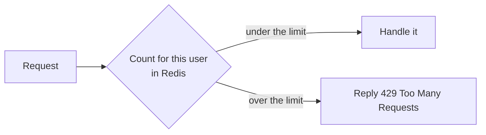

### 8.1 Fixed window: "max 3 per minute"

One counter per user per minute. The counter deletes itself after the minute.

```text
# Asha's login attempts during one minute (limit = 3)
> INCR rl:login:asha:minute-27
(integer) 1
> EXPIRE rl:login:asha:minute-27 60
(integer) 1
> INCR rl:login:asha:minute-27
(integer) 2
> INCR rl:login:asha:minute-27
(integer) 3
> INCR rl:login:asha:minute-27
(integer) 4
```

The 4th attempt returned 4, which is more than 3, so the app rejects it.

```python
import time

def allow_fixed_window(user: str, limit: int = 3, window: int = 60) -> bool:
    key = f"rl:fixed:{user}:{int(time.time() // window)}"   # a new key every minute
    pipe = r.pipeline()
    pipe.incr(key)
    pipe.expire(key, window, nx=True)     # set the expiry on the first request only
    count, _ = pipe.execute()
    return count <= limit

print([allow_fixed_window("asha") for _ in range(5)])   # [True, True, True, False, False]
```

The weakness: someone can send 3 requests at 0:59 and 3 more at 1:00, which is 6 in two seconds.

### 8.2 Sliding window: "max 3 in any 60 seconds"

Store the time of each request in a sorted set. Before allowing a new one, remove the old ones and count what's left. A Lua script ([section 16](#16-lua-scripts-small-programs-inside-redis)) does it all in one safe step.

```python
import uuid

SLIDING_WINDOW = r.register_script("""
local now    = tonumber(ARGV[1])
local window = tonumber(ARGV[2])
local limit  = tonumber(ARGV[3])
redis.call('ZREMRANGEBYSCORE', KEYS[1], 0, now - window)   -- forget old requests
if redis.call('ZCARD', KEYS[1]) < limit then
  redis.call('ZADD', KEYS[1], now, ARGV[4])                -- remember this one
  redis.call('PEXPIRE', KEYS[1], window)
  return 1
end
return 0
""")

def allow_sliding_window(user: str, limit: int = 3, window_ms: int = 60_000) -> bool:
    now = int(time.time() * 1000)
    request_id = f"{now}-{uuid.uuid4().hex[:8]}"
    return SLIDING_WINDOW(keys=[f"rl:slide:{user}"], args=[now, window_ms, limit, request_id]) == 1

print([allow_sliding_window("ravi") for _ in range(4)])   # [True, True, True, False]
```

### 8.3 Token bucket: "bursts are OK, but a steady average"

**Picture:** a jar that holds 5 tokens and gets 1 new token every second. Each request takes a token. If the jar is empty, wait.

```python
TOKEN_BUCKET = r.register_script("""
local capacity = tonumber(ARGV[1])
local rate     = tonumber(ARGV[2])
local cost     = tonumber(ARGV[3])
local t   = redis.call('TIME')
local now = tonumber(t[1]) * 1000 + math.floor(tonumber(t[2]) / 1000)
local data   = redis.call('HMGET', KEYS[1], 'tokens', 'ts')
local tokens = tonumber(data[1]) or capacity
local ts     = tonumber(data[2]) or now
tokens = math.min(capacity, tokens + (now - ts) / 1000 * rate)   -- refill
local allowed = 0
if tokens >= cost then
  tokens = tokens - cost
  allowed = 1
end
redis.call('HSET', KEYS[1], 'tokens', tokens, 'ts', now)
redis.call('PEXPIRE', KEYS[1], math.ceil(capacity / rate * 1000) + 1000)
return allowed
""")

def allow_token_bucket(key: str, capacity: int = 5, per_sec: float = 1.0, cost: int = 1) -> bool:
    return TOKEN_BUCKET(keys=[f"rl:bucket:{key}"], args=[capacity, per_sec, cost]) == 1

print([allow_token_bucket("api:meena") for _ in range(6)])   # [True, True, True, True, True, False]
```

`cost` lets you charge more for expensive calls (or charge by AI tokens, [section 25](#25-redis-in-ai-apps)).

| Method | Memory | Burst problem | When to use |
|---|---|---|---|
| Fixed window | 1 counter | Yes, at the minute edge | Simple limits, login attempts |
| Sliding window | 1 entry per request | No | Exact limits, small numbers |
| Token bucket | 2 fields | Allows controlled bursts | APIs, paid plans, AI calls |

---

## 9. Locks: one worker at a time

**Problem:** you run 3 copies of your app. The "send daily report" job must run **once**, not three times.

**Picture:** the key to the store room hangs on a hook. Whoever takes it goes in. Others wait until it's back. And the key **returns to the hook by itself** after 30 seconds, in case the person who took it faints inside.

```text
> SET lock:daily-report worker-1 NX EX 30
OK
> SET lock:daily-report worker-2 NX EX 30
(nil)
> GET lock:daily-report
"worker-1"
> TTL lock:daily-report
(integer) 30
```

- `NX` = only if nobody holds it. Worker-2 got `(nil)`, so it must wait.
- `EX 30` = the lock disappears after 30 seconds if worker-1 crashes.
- The value (`worker-1`) says **who** holds the lock.

### Why "who holds it" matters

If you release with a plain `DEL`, this can happen:

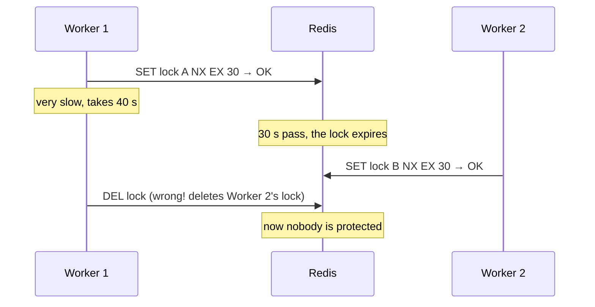

So release the lock **only if it still has your value**. That check-and-delete must be one step, so it's a tiny Lua script.

```python
import uuid

RELEASE = r.register_script("""
if redis.call('GET', KEYS[1]) == ARGV[1] then
  return redis.call('DEL', KEYS[1])
end
return 0
""")

EXTEND = r.register_script("""
if redis.call('GET', KEYS[1]) == ARGV[1] then
  return redis.call('PEXPIRE', KEYS[1], ARGV[2])
end
return 0
""")

class RedisLock:
    def __init__(self, client, name: str, ttl_ms: int = 30_000):
        self.r, self.key, self.ttl_ms = client, f"lock:{name}", ttl_ms
        self.token = uuid.uuid4().hex                  # my private value

    def acquire(self, wait_s: float = 5.0) -> bool:
        deadline = time.monotonic() + wait_s
        while time.monotonic() < deadline:
            if self.r.set(self.key, self.token, nx=True, px=self.ttl_ms):
                return True
            time.sleep(0.05 + random.random() * 0.05)  # try again soon
        return False

    def extend(self) -> bool:                          # for long jobs: "I'm still working"
        return EXTEND(keys=[self.key], args=[self.token, self.ttl_ms]) == 1

    def release(self) -> bool:
        return RELEASE(keys=[self.key], args=[self.token]) == 1

    def __enter__(self):
        if not self.acquire():
            raise TimeoutError(f"could not get {self.key}")
        return self

    def __exit__(self, *exc):
        self.release()

a = RedisLock(r, "payout:asha")
b = RedisLock(r, "payout:asha")
print(a.acquire())             # True  (a holds it)
print(b.acquire(wait_s=0.2))   # False (busy)
print(b.release())             # False (b can't remove a's lock)
print(a.release())             # True

with RedisLock(r, "daily-report"):
    print("sending the report, only one worker does this")
```

redis-py also has a ready-made lock that follows the same rules:

```python
with r.lock("daily-report", timeout=30, blocking_timeout=5):
    send_daily_report()
```

> **Remember:** a Redis lock is "good enough" for avoiding duplicate work. For money and stock, also protect the data itself (database unique constraints, or a version number checked on write), because a very slow worker can still outlive its lock.

---

## 10. Idempotency: the double-click problem

**Problem:** Asha taps "Pay ₹250". The network is slow, so she taps again. Or her phone retries automatically. Without protection she pays twice.

**Fix:** the app sends a unique **idempotency key** with the payment (made once when the checkout screen opens). The server does the work only the **first** time it sees that key.

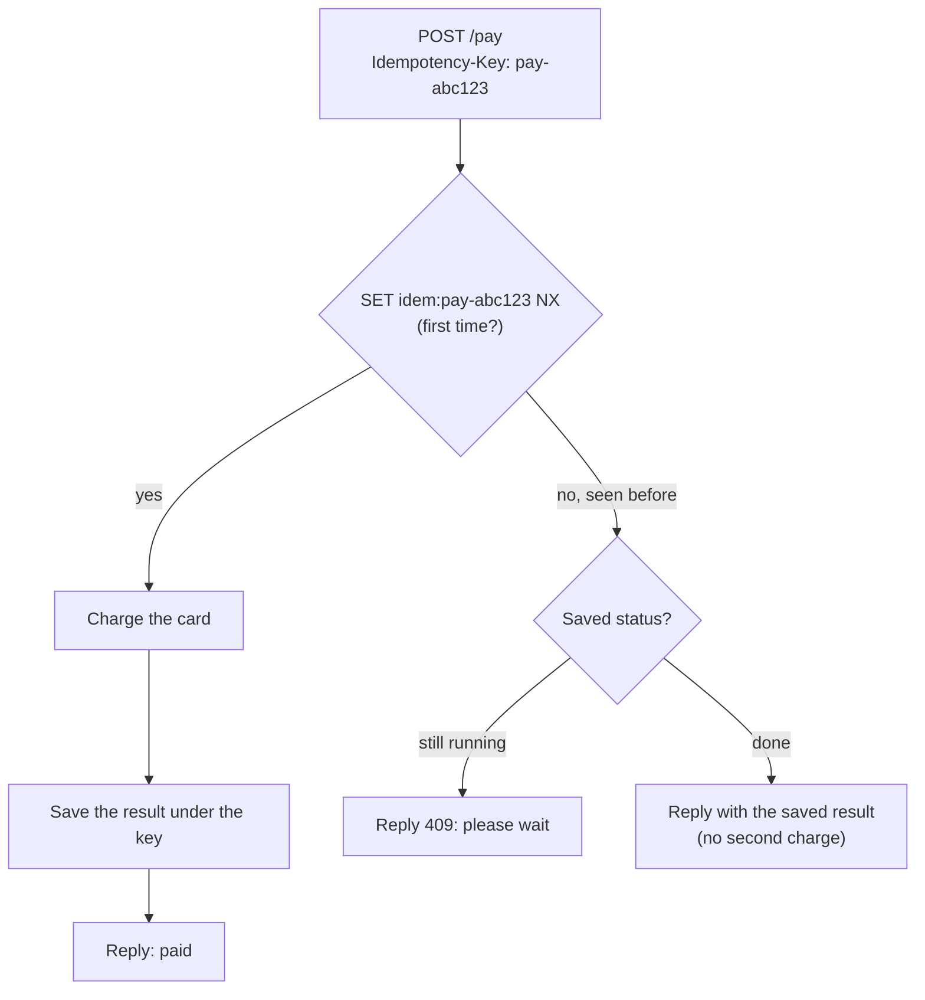

```python
def run_once(idem_key: str, work, ttl: int = 86_400):
    key = f"idem:{idem_key}"
    if r.set(key, json.dumps({"status": "running"}), nx=True, ex=ttl):
        try:
            result = work()
        except Exception:
            r.delete(key)              # failed: allow a retry
            raise
        r.set(key, json.dumps({"status": "done", "result": result}), ex=ttl)
        return result

    saved = json.loads(r.get(key) or '{"status": "running"}')
    if saved["status"] == "running":
        return {"error": "already in progress, try again in a moment"}
    return saved["result"]             # same answer as the first time

charges = []
def charge_card():
    charges.append(250)
    return {"paid": 250, "receipt": "R-1001"}

print(run_once("pay-abc123", charge_card))   # {'paid': 250, 'receipt': 'R-1001'}
print(run_once("pay-abc123", charge_card))   # same result again
print("times charged:", len(charges))        # 1
```

The same idea stops a queue worker from doing the same job twice ([18.6](#186-can-work-happen-twice-and-how-to-stop-it)).

---

## 11. Leaderboards and counters

```python
# Top dishes this week
r.zincrby("top:dishes:2026-w41", 1, "dosa")
r.zincrby("top:dishes:2026-w41", 3, "idli")
print(r.zrevrange("top:dishes:2026-w41", 0, 9, withscores=True))   # [('idli', 3.0), ('dosa', 1.0)]

# Orders per hour, each hour's counter deletes itself after 7 days
hour_key = f"stats:orders:{time.strftime('%Y%m%d%H')}"
pipe = r.pipeline()
pipe.incr(hour_key)
pipe.expire(hour_key, 7 * 86_400)
pipe.execute()

# Unique visitors per day, and for the whole week
r.pfadd("uv:mon", "asha", "ravi")
r.pfadd("uv:tue", "asha", "meena")
r.pfmerge("uv:week", "uv:mon", "uv:tue")
print(r.pfcount("uv:week"))     # 3  (asha counted once)

# Did user 123456 open the app today?
r.setbit("active:2026-10-08", 123456, 1)
print(r.getbit("active:2026-10-08", 123456))   # 1
```

Show a player's neighbours on a leaderboard ("you are 5th, here are 3rd to 7th"):

```python
for dish, score in {"vada": 10, "pongal": 7, "upma": 4, "poori": 2}.items():
    r.zadd("top:dishes:2026-w41", {dish: score})
rank = r.zrevrank("top:dishes:2026-w41", "upma")
print(rank, r.zrevrange("top:dishes:2026-w41", max(rank - 2, 0), rank + 2, withscores=True))
# 2 [('vada', 10.0), ('pongal', 7.0), ('upma', 4.0), ('idli', 3.0), ('poori', 2.0)]
```

---

## 12. Delayed jobs: "do this later"

**Problem:** "Send Asha a feedback request 1 hour after delivery." Lists and streams have no "run later" option.

**Picture:** a tray of reminder cards **sorted by time**. Every second, someone takes out the cards whose time has come and puts them in the kitchen queue.

A sorted set does this: the **score is the time** the job should run.

```text
# scores are run-at times (small numbers to keep it readable)
> ZADD reminders 1000 call-asha 3000 send-invoice 2000 check-stock
(integer) 3
# it is now time 2500: which jobs are due?
> ZRANGEBYSCORE reminders -inf 2500
1) "call-asha"
2) "check-stock"
> ZREM reminders call-asha check-stock
(integer) 2
> ZRANGE reminders 0 -1 WITHSCORES
1) "send-invoice"
2) "3000"
```

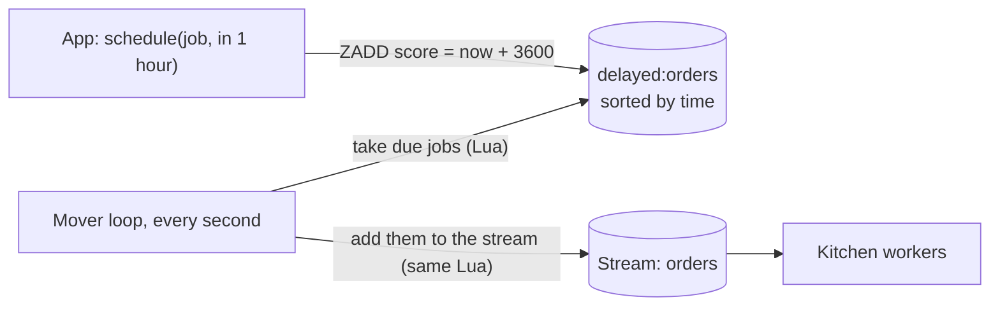

```python
MOVE_DUE = r.register_script("""
local due = redis.call('ZRANGEBYSCORE', KEYS[1], '-inf', ARGV[1], 'LIMIT', 0, ARGV[2])
for _, job in ipairs(due) do
  redis.call('XADD', KEYS[2], '*', 'data', job)
  redis.call('ZREM', KEYS[1], job)
end
return #due
""")

def schedule(job: dict, delay_s: float) -> None:
    # every job needs its own event_id, because sorted-set members are unique
    r.zadd("delayed:orders", {json.dumps(job, sort_keys=True): time.time() + delay_s})

schedule({"event_id": "evt-1", "type": "feedback_request", "user": "asha"}, delay_s=0)
schedule({"event_id": "evt-2", "type": "feedback_request", "user": "ravi"}, delay_s=3600)
moved = MOVE_DUE(keys=["delayed:orders", "orders"], args=[time.time(), 100])
print("moved now:", moved, "| still waiting:", r.zcard("delayed:orders"))   # moved now: 1 | still waiting: 1
```

The mover runs forever in its own small process:

```python
def mover_loop() -> None:
    while True:
        moved = MOVE_DUE(keys=["delayed:orders", "orders"], args=[time.time(), 100])
        if not moved:
            time.sleep(1)
```

Because "take from the tray" and "add to the stream" happen in one Lua script, a job can never be lost or moved twice in between. The same trick gives you **retries with growing wait times** ([18.10](#1810-retry-later-with-growing-waits)).

---

# Part 3 — Safe and fast

## 13. One cashier: how Redis runs commands

**Picture:** a shop with **one very fast cashier**. Customers line up and the cashier serves them one at a time, finishing each before starting the next.

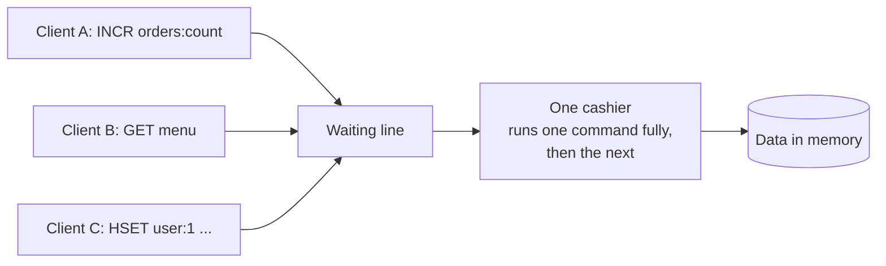

What this means for you:

- **Good:** every single command is safe on its own. Two apps running `INCR` at the same time never lose a count. No locks needed for one-command logic.
- **Bad:** one slow command makes **everyone** wait. `KEYS *` on 10 million keys, `HGETALL` on a giant hash, or `DEL` of a huge list freezes the whole server while it runs.
- **Careful:** several commands in a row are **not** one safe step. Between your `GET` and your `SET`, another client can change the value. For "read, decide, write", use a transaction ([15](#15-transactions-multi-exec-and-watch)) or a Lua script ([16](#16-lua-scripts-small-programs-inside-redis)).

---

## 14. Pipeline: one trip instead of many

**Picture:** a waiter carrying plates. Walking to the table once per plate is slow. Carrying all the plates on one tray is fast.

Each command normally needs a full trip over the network: send, wait, receive. A **pipeline** sends many commands together and reads all the answers together.

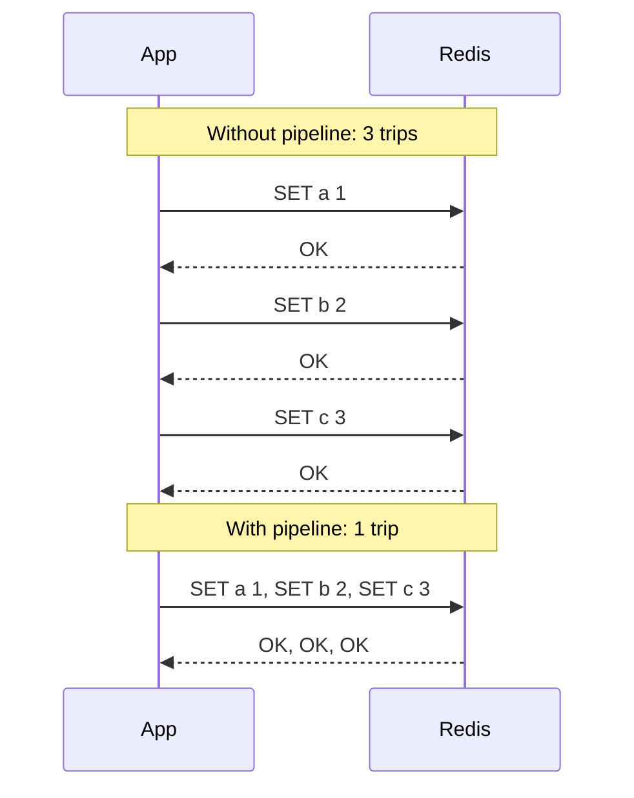

```python
r.hset("user:1", "name", "Asha")
r.hset("user:2", "name", "Ravi")
r.hset("user:3", "name", "Meena")

pipe = r.pipeline(transaction=False)    # just batching, no transaction
for user_id in [1, 2, 3]:
    pipe.hget(f"user:{user_id}", "name")
names = pipe.execute()                  # answers come back in the same order
print(names)                            # ['Asha', 'Ravi', 'Meena']
```

How much faster? This small script ran on one machine, talking to Redis on the same machine:

```python
import time
import redis

r = redis.Redis(decode_responses=True)
N = 2_000

start = time.perf_counter()
for i in range(N):
    r.set(f"bench:{i}", i)
one_by_one = time.perf_counter() - start

start = time.perf_counter()
pipe = r.pipeline(transaction=False)
for i in range(N):
    pipe.set(f"bench:{i}", i)
pipe.execute()
pipelined = time.perf_counter() - start

print(f"{N} SETs one by one : {one_by_one * 1000:7.1f} ms")
print(f"{N} SETs in pipeline: {pipelined * 1000:7.1f} ms")
print(f"pipeline was {one_by_one / pipelined:.0f}x faster")
r.delete(*[f"bench:{i}" for i in range(N)])
```

Real output:

```text
2000 SETs one by one :   200.0 ms
2000 SETs in pipeline:    19.0 ms
pipeline was 11x faster
```

Across a real network (1 ms per trip), the gap is much bigger: 2,000 trips take 2 seconds, but one pipeline takes a few milliseconds.

> **Remember:** a pipeline is about **speed**, not safety. Other clients' commands can still run between yours. Send batches of hundreds or a few thousand commands, not millions at once.

---

## 15. Transactions: MULTI, EXEC and WATCH

### MULTI / EXEC: "run these together, with nothing in between"

**Picture:** you hand the cashier a list. They put it aside (`QUEUED`) and, when you say "go" (`EXEC`), they do the whole list without serving anyone else in between.

```text
> SET stock:dosa 5
OK
> MULTI
OK
> DECRBY stock:dosa 2
QUEUED
> INCR orders:count
QUEUED
> EXEC
1) (integer) 3
2) (integer) 1
```

**Important: there is no rollback.** If one command in the list fails, the others still happen:

```text
> MULTI
OK
> INCR stock:dosa
QUEUED
> HSET stock:dosa x 1
QUEUED
> EXEC
1) (integer) 4
2) (error) WRONGTYPE Operation against a key holding the wrong kind of value
> GET stock:dosa
"4"
```

The `INCR` happened even though the `HSET` failed. (These must be typed in one `redis-cli` session, because a transaction belongs to one connection.)

In Python, `r.pipeline()` is a transaction by default:

```python
r.set("wallet:asha", 500)
r.set("wallet:ravi", 0)

pipe = r.pipeline()                 # transaction=True by default → MULTI ... EXEC
pipe.decrby("wallet:asha", 100)
pipe.incrby("wallet:ravi", 100)
print(pipe.execute())               # [400, 100]
```

### WATCH: "only if nobody changed it while I was deciding"

**Picture:** you look at the last packet of biscuits on the shelf and decide to buy it. If someone else grabs it before you reach the counter, your purchase is cancelled and you look again.

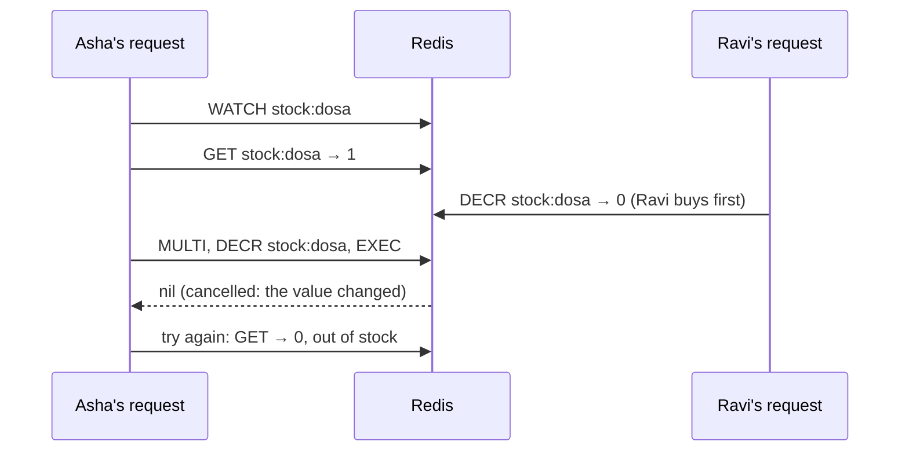

```python
def buy_with_watch(sku: str, qty: int) -> bool:
    key = f"stock:{sku}"
    with r.pipeline() as pipe:
        while True:
            try:
                pipe.watch(key)                    # 1. watch the key
                stock = int(pipe.get(key) or 0)    # 2. read it
                if stock < qty:
                    pipe.unwatch()
                    return False                   # not enough stock
                pipe.multi()                       # 3. start the transaction
                pipe.decrby(key, qty)
                pipe.execute()                     # 4. fails if the key changed
                return True
            except redis.WatchError:
                continue                           # someone changed it: try again

r.set("stock:vada", 3)
print(buy_with_watch("vada", 2), buy_with_watch("vada", 2), buy_with_watch("vada", 1))
# True False True
```

When many users fight over the same key, `WATCH` retries a lot. A Lua script is usually simpler.

---

## 16. Lua scripts: small programs inside Redis

**Picture:** instead of asking the cashier five separate questions, you hand them a **written recipe**. They follow it from start to finish without serving anyone else.

A Lua script runs **inside Redis as one uninterruptible step**. It is the cleanest way to do "check, then change".

You can try one straight from `redis-cli`:

```text
> SET stock:dosa 3
OK
# EVAL "script" <number of keys> <keys...> <args...>
> EVAL "local s = tonumber(redis.call('GET', KEYS[1])) if s < tonumber(ARGV[1]) then return -1 end return redis.call('DECRBY', KEYS[1], ARGV[1])" 1 stock:dosa 2
(integer) 1
> EVAL "local s = tonumber(redis.call('GET', KEYS[1])) if s < tonumber(ARGV[1]) then return -1 end return redis.call('DECRBY', KEYS[1], ARGV[1])" 1 stock:dosa 2
(integer) -1
```

The first buy left 1 dosa. The second asked for 2, so the script returned `-1` and changed nothing.

The same thing in Python, written nicely:

```python
BUY = r.register_script("""
local stock = tonumber(redis.call('GET', KEYS[1]) or '0')
local qty   = tonumber(ARGV[1])
if stock < qty then
  return -1                                  -- not enough, change nothing
end
return redis.call('DECRBY', KEYS[1], qty)    -- take them, return what's left
""")

r.set("stock:idli", 3)
print(BUY(keys=["stock:idli"], args=[2]))    # 1   (1 left)
print(BUY(keys=["stock:idli"], args=[2]))    # -1  (not enough)
```

Two customers can never both take the last item, because nothing runs between the check and the change.

**Rules for scripts**

- Pass **every key** the script uses in `KEYS`. Don't build key names inside the script (Redis Cluster needs to know the keys up front).
- Keep scripts short. A long script blocks everyone, like any slow command.
- Numbers: Lua decimals are cut to whole numbers when returned. Return `tostring(x)` if you need decimals.
- `register_script` sends the script once and afterwards only its short fingerprint (SHA), so it's cheap to call often.
- **Redis Functions** (`FUNCTION LOAD` / `FCALL`, Redis 7+) are named scripts that Redis stores permanently. Useful when many services share the same logic.

### Which tool when?

| You need | Use |
|---|---|
| Many independent commands, quickly | Pipeline |
| A few writes that must happen together | `MULTI` / `EXEC` |
| Read → decide → write, little competition | `WATCH` + `MULTI` / `EXEC` |
| Read → decide → write, any amount of competition | Lua script |

---

# Part 4 — Messages and queues

## 17. Pub/Sub: the loudspeaker

**In one line:** Pub/Sub sends a message to everyone who is listening **right now**. Nothing is saved.

**Picture:** an announcement on the shop loudspeaker. Everyone inside hears it. Anyone who walks in a minute later missed it forever.

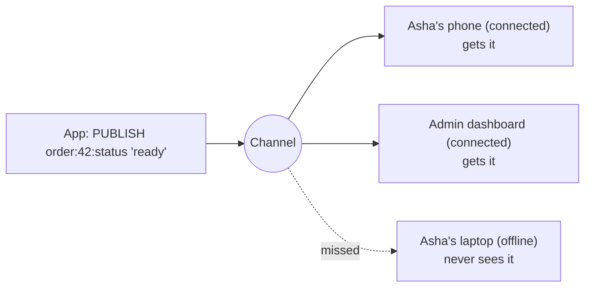

When nobody is listening, the message just disappears. `PUBLISH` tells you how many listeners received it:

```text
> PUBLISH order:42:status ready
(integer) 0
```

`0` listeners, so the message is gone.

In Python:

```python
listener = r.pubsub(ignore_subscribe_messages=True)
listener.subscribe("order:42:status")          # start listening
listener.get_message(timeout=1)                 # wait until the subscription is confirmed

receivers = r.publish("order:42:status", "ready")
print("received by", receivers, "listener(s)")  # received by 1 listener(s)

msg = listener.get_message(timeout=1)
print(msg["channel"], msg["data"])              # order:42:status ready
listener.close()
```

A real listener runs forever in its own thread or process:

```python
listener = r.pubsub(ignore_subscribe_messages=True)
listener.psubscribe("order:*:status")           # pattern: all orders
for msg in listener.listen():
    print("update:", msg["channel"], msg["data"])
```

Async version, for pushing updates to a browser over WebSocket:

```python
import redis.asyncio as aioredis

ar = aioredis.Redis(decode_responses=True)

async def updates_for(order_id: int):
    pubsub = ar.pubsub(ignore_subscribe_messages=True)
    await pubsub.subscribe(f"order:{order_id}:status")
    try:
        async for msg in pubsub.listen():
            yield msg["data"]               # e.g. await websocket.send_text(msg["data"])
    finally:
        await pubsub.unsubscribe()
        await pubsub.aclose()
```

| Good for | Not good for |
|---|---|
| "Your order is ready" pop-ups for people online | Orders, payments, emails: anything that must not be lost |
| Live dashboards, typing indicators | Work that needs retries |
| Telling all app servers "reload settings" | Anyone who might be offline |

In Redis Cluster, use **sharded Pub/Sub** (`SPUBLISH` / `SSUBSCRIBE`) so messages aren't copied to every server.

When a message must not be lost, use Streams.

---

## 18. Streams: the kitchen order rail

**In one line:** a stream is a list of messages that **stays saved**, and a **consumer group** lets many workers share the work, with "done" receipts and automatic retries.

This is how Tiffin Express sends orders to the kitchen without ever losing one.

### 18.1 The picture and the words

Imagine the order rail in a restaurant kitchen. Waiters clip tickets to the rail. Cooks take tickets, cook, and mark them done.

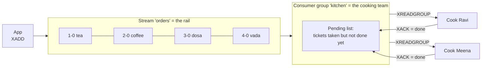

| Word | Kitchen picture | What it really is |
|---|---|---|
| **Stream** | The order rail | A saved, append-only list of messages under one key |
| **Entry / message** | One ticket | A small set of fields, e.g. `item tea` |
| **Entry ID** | Ticket number | `time-sequence`, e.g. `1791284113066-0`. Always increasing. |
| **Consumer group** | The cooking team | A named reader that remembers which tickets it has handed out |
| **Consumer** | One cook | A named worker in the group (one per running process) |
| **Pending list (PEL)** | Tickets a cook took but hasn't finished | Messages delivered but not yet acknowledged |
| **XACK** | "Done!" | Removes the message from the pending list |
| **Delivery count** | How many times a ticket was handed out | Goes up on every redelivery; used to spot bad tickets |

Two facts to remember:

1. **Reading doesn't remove a ticket from the rail.** Messages stay in the stream after they're read and acked. You clean up old ones by trimming ([18.13](#1813-the-rail-never-empties-by-itself)).
2. **Inside one team, each ticket goes to one cook. Different teams each get every ticket** ([18.11](#1811-two-teams-on-the-same-rail-fan-out)).

### 18.2 The life of one ticket

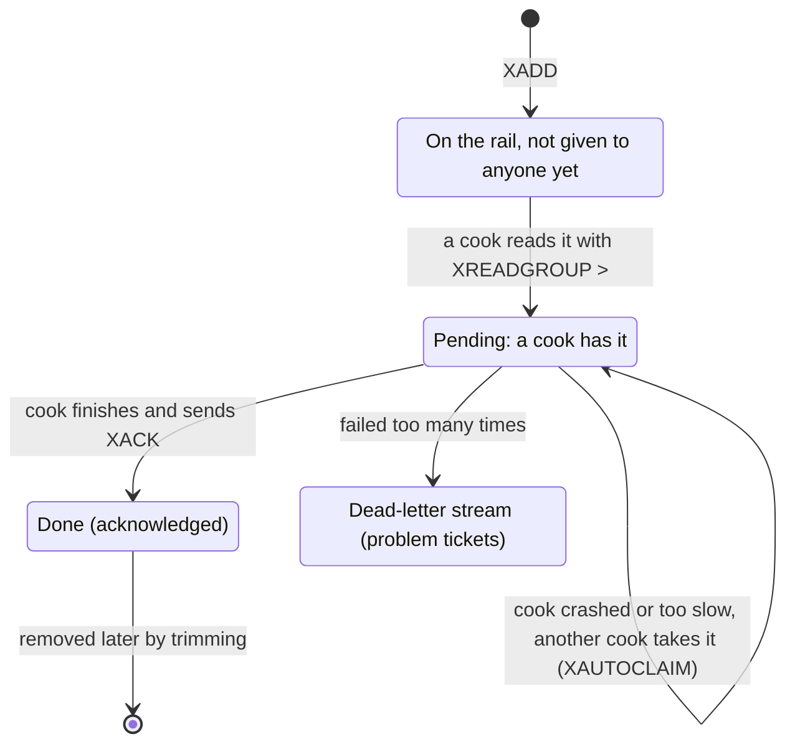

### 18.3 Try it step by step in redis-cli

We use small ticket ids (`1-0`, `2-0`, ...) so the output is easy to read. In real apps you write `*` and Redis creates the id from the current time.

**Step 1 — create the team and put 4 orders on the rail**

```text
# $ = the team only cares about orders added from now on. MKSTREAM = create the stream if missing.
> XGROUP CREATE orders kitchen $ MKSTREAM
OK
> XADD orders 1-0 item tea
"1-0"
> XADD orders 2-0 item coffee
"2-0"
> XADD orders 3-0 item dosa
"3-0"
> XADD orders 4-0 item vada
"4-0"
```

**Step 2 — two cooks take work**

```text
# ">" = give me tickets nobody in my team has taken yet
> XREADGROUP GROUP kitchen ravi COUNT 2 STREAMS orders >
1) 1) "orders"
   2) 1) 1) "1-0"
         2) 1) "item"
            2) "tea"
      2) 1) "2-0"
         2) 1) "item"
            2) "coffee"
> XREADGROUP GROUP kitchen meena COUNT 2 STREAMS orders >
1) 1) "orders"
   2) 1) 1) "3-0"
         2) 1) "item"
            2) "dosa"
      2) 1) "4-0"
         2) 1) "item"
            2) "vada"
# Ravi asks again: nothing new is left
> XREADGROUP GROUP kitchen ravi COUNT 2 STREAMS orders >
(nil)
```

Ravi got tea and coffee. Meena got dosa and vada. **Nobody got the same ticket.** Redis hands tickets out one request at a time, so this is guaranteed with no locks.

**Step 3 — cooks finish and say "done"**

```text
# Ravi made the tea. Meena made the dosa and vada.
> XACK orders kitchen 1-0
(integer) 1
> XACK orders kitchen 3-0 4-0
(integer) 2
# Summary: how many unfinished tickets, and who holds them?
> XPENDING orders kitchen
1) (integer) 1
2) "2-0"
3) "2-0"
4) 1) 1) "ravi"
      2) "1"
# Details: ticket id, who holds it, milliseconds since it was handed out, delivery count
> XPENDING orders kitchen - + 10
1) 1) "2-0"
   2) "ravi"
   3) (integer) 19
   4) (integer) 1
```

Only the coffee (`2-0`) is unfinished. Ravi took it but never said done. **Then Ravi's process crashes.** The coffee is not lost: it stays in the pending list with Ravi's name on it. There are two ways to recover it.

**Step 4a — Ravi restarts with the same name and finishes his own leftovers**

Reading with id `0` instead of `>` means "show me **my** unfinished tickets".

```text
> XREADGROUP GROUP kitchen ravi STREAMS orders 0
1) 1) "orders"
   2) 1) 1) "2-0"
         2) 1) "item"
            2) "coffee"
```

**Step 4b — or Ravi never comes back, so Meena takes over**

(Here, Ravi re-read the coffee in step 4a and then crashed again.)

`XAUTOCLAIM` means: "give me tickets that nobody has touched for at least N milliseconds". In a real app N would be something like `60000` (one minute). We use `0` here so we don't have to wait.

```text
> XAUTOCLAIM orders kitchen meena 0 0-0
1) "0-0"
2) 1) 1) "2-0"
      2) 1) "item"
         2) "coffee"
3) (empty array)
> XPENDING orders kitchen - + 10
1) 1) "2-0"
   2) "meena"
   3) (integer) 3
   4) (integer) 3
```

The coffee now belongs to Meena, and its delivery count went up (1 → 2 when Ravi re-read it, 2 → 3 when Meena claimed it). The delivery count is how you spot a ticket that keeps failing ([18.9](#189-bad-tickets-poison-messages)).

**Step 5 — Meena finishes it**

```text
> XACK orders kitchen 2-0
(integer) 1
> XPENDING orders kitchen
1) (integer) 0
2) (nil)
3) (nil)
4) (nil)
# the tickets are still on the rail, even though all are done
> XLEN orders
(integer) 4
```

**Step 6 — look at the team's status**

```text
> XINFO GROUPS orders
1)  1) "name"
    2) "kitchen"
    3) "consumers"
    4) (integer) 2
    5) "pending"
    6) (integer) 0
    7) "last-delivered-id"
    8) "4-0"
    9) "entries-read"
   10) (integer) 4
   11) "lag"
   12) (integer) 0
```

The useful fields: `pending` (unfinished tickets), `last-delivered-id` (the last ticket handed out) and `lag` (tickets on the rail that nobody has taken yet).

### 18.4 The same thing in Python

In this guide each message has one field, `data`, holding JSON. Each order also gets an `event_id` made by the app (you'll see why in [18.6](#186-can-work-happen-twice-and-how-to-stop-it)).

```python
STREAM, GROUP = "orders:py", "kitchen"

# 1. Create the team once. Running this again is harmless.
try:
    r.xgroup_create(STREAM, GROUP, id="$", mkstream=True)
except redis.ResponseError as e:
    if "BUSYGROUP" not in str(e):      # BUSYGROUP = the group already exists
        raise

# 2. The app adds orders
for n, dish in enumerate(["tea", "coffee", "dosa"], start=1):
    order = {"event_id": f"evt-{n}", "order_id": n, "dish": dish}
    r.xadd(STREAM, {"data": json.dumps(order)}, maxlen=1_000_000, approximate=True)

# 3. A cook reads and finishes work
reply = r.xreadgroup(GROUP, "ravi", {STREAM: ">"}, count=2, block=2000)
# reply looks like: [['orders:py', [('1791...-0', {'data': '{"event_id": "evt-1", ...}'}), ...]]]
for _stream, messages in reply:
    for msg_id, fields in messages:
        order = json.loads(fields["data"])
        print("ravi cooks", order["dish"])
        r.xack(STREAM, GROUP, msg_id)          # only after the work is really done

# 4. What is still unfinished?
r.xreadgroup(GROUP, "meena", {STREAM: ">"}, count=1)    # Meena takes one, doesn't finish yet
print(r.xpending(STREAM, GROUP))
# {'pending': 1, 'min': '...', 'max': '...', 'consumers': [{'name': 'meena', 'pending': 1}]}
for p in r.xpending_range(STREAM, GROUP, min="-", max="+", count=10):
    print(p["message_id"], p["consumer"], p["time_since_delivered"], p["times_delivered"])
```

`block=2000` means "wait up to 2 seconds for new tickets". Without it, the read returns immediately, and you'd have to keep asking in a busy loop.

### 18.5 Many cooks, and no ticket goes to two cooks

When a cook asks for new tickets with `>`, Redis does three things in **one step**:

1. picks the next tickets after the team's `last-delivered-id`,
2. moves `last-delivered-id` forward,
3. writes those tickets into the pending list under **that cook's** name.

Because Redis runs one command at a time ([section 13](#13-one-cashier-how-redis-runs-commands)), two cooks can never get the same new ticket.

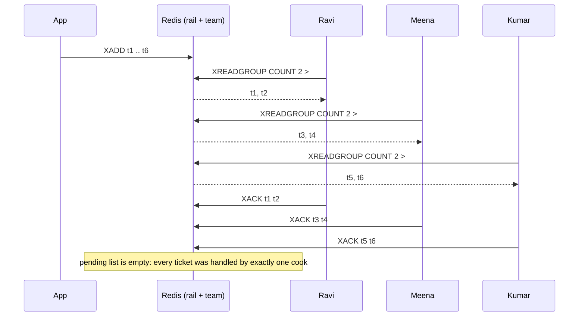

How the work gets shared:

- There's no fixed rotation. **Whoever asks first gets the next tickets**, so a fast cook simply asks more often and does more.
- `COUNT` is how many tickets a cook takes at once. Use 1–10 for slow jobs and bigger numbers for fast jobs.
- To handle more orders, **start more cooks in the same group with different names**. Nothing else changes.

> **Every running process needs its own consumer name.** Two processes with the same name share one pending list and get confused on restart. Good names: `hostname-pid`, or the Kubernetes pod name.

### 18.6 Can work happen twice, and how to stop it

Be clear about what Redis promises:

| | Promise |
|---|---|
| **Handing out** a new ticket | Exactly one cook at a time holds it |
| **Doing** the work | **At least once.** The same order *can* be cooked twice. |

How an order gets cooked twice:

1. Ravi cooks it, then crashes **just before** `XACK`. The ticket is still pending, so someone takes it over and cooks it again.
2. Ravi is just **slow**. The ticket looks abandoned, Meena claims it, and both of them cook it ([18.8](#188-the-slow-cook-trap)).
3. Ravi's `XACK` gets lost on the network.

So "no duplicates" in a real product means: **at-least-once delivery + work that is safe to repeat**. The trick is to remember "order X is done" in the **same step** as doing the work. Pick the version that matches where your work is saved:


**Result saved in Redis** — "mark done", "do the work" and "XACK" in one Lua script:

```python
COOK_AND_ACK = r.register_script("""
local first_time = redis.call('SET', KEYS[2], '1', 'NX', 'EX', 86400)
if first_time then
  redis.call('HINCRBY', KEYS[3], ARGV[3], 1)      -- the real work: count the dish
end
redis.call('XACK', KEYS[1], ARGV[1], ARGV[2])     -- done, either way
if first_time then return 1 else return 0 end
""")

r.xadd(STREAM, {"data": json.dumps({"event_id": "evt-9", "dish": "pongal"})})
for _s, messages in r.xreadgroup(GROUP, "kumar", {STREAM: ">"}, count=10):
    for msg_id, fields in messages:
        order = json.loads(fields["data"])
        for attempt in (1, 2):              # pretend the same ticket arrives twice
            result = COOK_AND_ACK(keys=[STREAM, f"done:{order['event_id']}", "dishes:made"],
                                  args=[GROUP, msg_id, order["dish"]])
            print(order["dish"], "attempt", attempt, "->", "cooked" if result else "skipped (already done)")
# pongal attempt 1 -> cooked
# pongal attempt 2 -> skipped (already done)
```

**Result saved in Postgres** — a "processed events" table in the same transaction (psycopg 3):

```python
# CREATE TABLE processed_events (event_id text PRIMARY KEY, done_at timestamptz DEFAULT now());

def handle_order(conn, msg_id: str, fields: dict) -> None:
    order = json.loads(fields["data"])
    with conn.transaction():
        first_time = conn.execute(
            "INSERT INTO processed_events (event_id) VALUES (%s) "
            "ON CONFLICT DO NOTHING RETURNING event_id",
            (order["event_id"],),
        ).fetchone() is not None
        if first_time:
            conn.execute("INSERT INTO kitchen_log (order_id, dish) VALUES (%s, %s)",
                         (order["order_id"], order["dish"]))
    r.xack(STREAM, GROUP, msg_id)       # after the commit, for new and repeated tickets alike
```

**Which id to use?** Use the `event_id` **your app put inside the message**, not the stream's entry id. If a message is ever added again (a retry, or a replay from the dead-letter stream), it gets a new entry id but keeps its `event_id`.

### 18.7 When a cook crashes

A crashed cook's tickets stay in the pending list **forever**, until someone takes them. You have two tools:

| Situation | What to do |
|---|---|
| The **same** cook restarts (same name) | On startup, read with id `0` to get your own leftovers first |
| The cook is **gone for good** | Another cook runs `XAUTOCLAIM` to take tickets idle for too long |

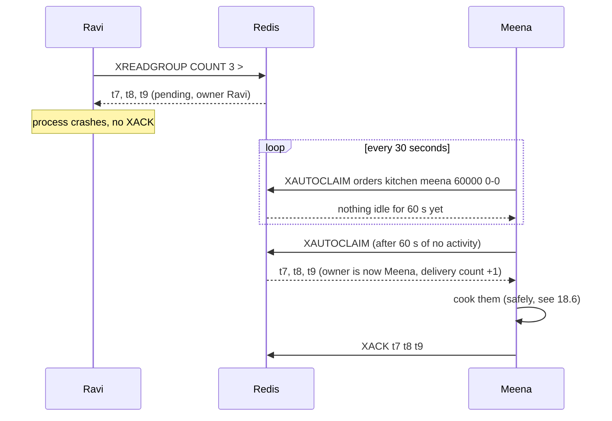

```python
def finish_my_leftovers(me: str) -> None:
    """Call once when a cook starts."""
    for _stream, messages in r.xreadgroup(GROUP, me, {STREAM: "0"}, count=1000) or []:
        for msg_id, fields in messages:
            if not fields:                      # entry was trimmed away meanwhile
                r.xack(STREAM, GROUP, msg_id)
                continue
            print(me, "finishing leftover", msg_id)
            r.xack(STREAM, GROUP, msg_id)

def take_over_abandoned(me: str, idle_ms: int = 60_000) -> None:
    """Call every ~30 seconds from every cook."""
    start = "0-0"
    while True:
        result = r.xautoclaim(STREAM, GROUP, me, idle_ms, start_id=start, count=50)
        start, claimed = result[0], result[1]
        for msg_id, fields in claimed:
            print(me, "took over", msg_id)
            r.xack(STREAM, GROUP, msg_id)       # after doing the work
        if start == "0-0":                      # looked through the whole pending list
            break

finish_my_leftovers("ravi")
take_over_abandoned("kumar", idle_ms=0)        # 0 only for this demo
print(r.xpending(STREAM, GROUP)["pending"])    # 0
```

**How long is "idle too long"?** The idle time starts when a ticket is **handed out**, not when the cook starts working on it. So it must be longer than the slowest time to finish a **whole batch** of tickets. See the next section.

### 18.8 The slow cook trap

Ravi takes 5 tickets. The first one takes him 3 seconds. Meena claims anything idle for 2 seconds, so she takes **all 5**, including the one Ravi is cooking right now.

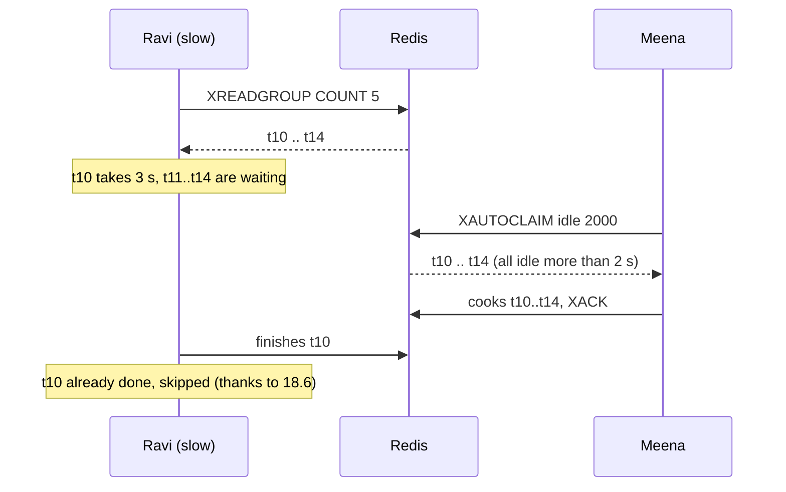

Your "safe to repeat" check prevents wrong results, but the work was wasted. Fixes:

1. Set the claim time **much longer** than your slowest batch (5–10× is a good start).
2. Use a small `COUNT` for slow jobs.
3. For long jobs, send a **heartbeat**: re-claim your own tickets with `JUSTID`. This resets the idle timer **without** increasing the delivery count.

You can see the heartbeat in action:

```text
> XGROUP CREATE jobs video-team $ MKSTREAM
OK
> XADD jobs 1-0 task make-thumbnail
"1-0"
> XREADGROUP GROUP video-team ravi STREAMS jobs >
1) 1) "jobs"
   2) 1) 1) "1-0"
         2) 1) "task"
            2) "make-thumbnail"
# idle time is now about 1500 ms
> XPENDING jobs video-team - + 10
1) 1) "1-0"
   2) "ravi"
   3) (integer) 1505
   4) (integer) 1
# heartbeat: "I'm still working on it"
> XCLAIM jobs video-team ravi 0 1-0 JUSTID
1) "1-0"
# idle time is back to about 0, delivery count still 1
> XPENDING jobs video-team - + 10
1) 1) "1-0"
   2) "ravi"
   3) (integer) 4
   4) (integer) 1
```

```python
def heartbeat(me: str, msg_ids: list[str]) -> None:
    """Call every ~10 seconds while working on long tickets."""
    r.xclaim(STREAM, GROUP, me, min_idle_time=0, message_ids=msg_ids, justid=True)
```

### 18.9 Bad tickets (poison messages)

Some tickets **always** fail: broken data, a bug, a deleted product. Without a limit they would be retried forever.

**Picture:** after three failed attempts, the head cook puts the ticket on a separate "problem orders" tray and tells the manager.

```mermaid
flowchart TD
    M["Abandoned ticket taken over"] --> D{"Delivery count above the limit?"}
    D -- "no" --> T["Try to cook it"]
    T -- "works" --> ACK["XACK"]
    T -- "fails" --> STAY["Leave it pending,<br/>it will be tried again later"]
    D -- "yes" --> DLQ["XADD to orders:dead<br/>(the problem tray)"]
    DLQ --> ACK2["XACK the original"]
    DLQ --> AL["Alert someone, fix, replay"]
```

```python
MAX_TRIES = 5
DEAD = f"{STREAM}:dead"

def take_over_with_limit(me: str, idle_ms: int = 60_000) -> None:
    start = "0-0"
    while True:
        result = r.xautoclaim(STREAM, GROUP, me, idle_ms, start_id=start, count=50)
        start, claimed = result[0], result[1]
        for msg_id, fields in claimed:
            info = r.xpending_range(STREAM, GROUP, min=msg_id, max=msg_id, count=1)
            tries = info[0]["times_delivered"] if info else 0
            if tries > MAX_TRIES:
                pipe = r.pipeline()                    # both steps, or neither
                pipe.xadd(DEAD, {**fields, "original_id": msg_id, "tries": tries})
                pipe.xack(STREAM, GROUP, msg_id)
                pipe.execute()
                print(msg_id, "moved to the problem tray")
                continue
            # ... try to do the work, XACK on success ...
        if start == "0-0":
            break

def replay_dead(limit: int = 100) -> None:
    """After fixing the bug, put the problem tickets back on the rail."""
    for dead_id, fields in r.xrange(DEAD, count=limit):
        original = {k: v for k, v in fields.items() if k not in ("original_id", "tries")}
        pipe = r.pipeline()
        pipe.xadd(STREAM, original)
        pipe.xdel(DEAD, dead_id)
        pipe.execute()
```

Set an alert for "the problem tray is not empty" (`XLEN orders:dead > 0`).

### 18.10 Retry later with growing waits

`XAUTOCLAIM` retries after a **fixed** wait. When a failure is temporary (the payment provider is down), it's kinder to wait longer each time: 10 s, 20 s, 40 s ...

**How:** mark the failed ticket done, and put a copy into the delayed-job tray from [section 12](#12-delayed-jobs-do-this-later) with a later time. The mover puts it back on the rail when it's due.

```python
def retry_later(msg_id: str, fields: dict, error: Exception, max_attempts: int = 5) -> None:
    job = json.loads(fields["data"])                  # keeps the same event_id
    job["attempt"] = job.get("attempt", 0) + 1
    pipe = r.pipeline()                               # all steps together
    if job["attempt"] > max_attempts:
        pipe.xadd(DEAD, {"data": json.dumps(job), "error": str(error)[:500]})
    else:
        wait = min(5 * 2 ** job["attempt"], 3600)     # 10 s, 20 s, 40 s ... max 1 hour
        pipe.zadd("delayed:orders", {json.dumps(job, sort_keys=True): time.time() + wait})
    pipe.xack(STREAM, GROUP, msg_id)
    pipe.execute()
```

Used in a cook:

```python
try:
    handle(order)
    r.xack(STREAM, GROUP, msg_id)
except TemporaryError as exc:          # e.g. the payment service is down
    retry_later(msg_id, fields, exc)
```

| Attempt | Wait before next try |
|---|---|
| 1 | 10 s |
| 2 | 20 s |
| 3 | 40 s |
| 4 | 80 s |
| 5 | 160 s |
| 6 | dead-letter stream |

### 18.11 Two teams on the same rail (fan-out)

Billing must charge for every order, the kitchen must cook every order, and analytics must count every order. Give **each team its own group** on the same stream.

```mermaid
flowchart LR
    APP["App: XADD orders"] --> S[("Stream: orders")]
    S --> G1["Group: kitchen"]
    S --> G2["Group: billing"]
    S --> G3["Group: analytics"]
    G1 --> K1["Ravi"]
    G1 --> K2["Meena"]
    G2 --> B1["Anu"]
    G3 --> A1["stats-1"]
    G3 --> A2["stats-2"]
```

Continuing the redis-cli example from 18.3: the kitchen has finished all 4 orders. Now billing joins and starts from the very first order (`0`):

```text
> XGROUP CREATE orders billing 0
OK
> XREADGROUP GROUP billing anu COUNT 10 STREAMS orders >
1) 1) "orders"
   2) 1) 1) "1-0"
         2) 1) "item"
            2) "tea"
      2) 1) "2-0"
         2) 1) "item"
            2) "coffee"
      3) 1) "3-0"
         2) 1) "item"
            2) "dosa"
      4) 1) "4-0"
         2) 1) "item"
            2) "vada"
```

Anu (billing) got all 4 orders, even though the kitchen team reads the same stream.

- **Inside a team, the work is split. Each team gets everything.**
- Teams are independent: if analytics is slow, the kitchen isn't affected.
- A new team created with `0` can **replay** everything still on the rail.
- Trimming must respect the **slowest** team ([18.13](#1813-the-rail-never-empties-by-itself)).

### 18.12 Keeping things in order

The rail keeps tickets in order, but with several cooks, **finishing** order is not guaranteed: ticket 2 can be done before ticket 1, and retries mix things up more.

If order matters **per customer** (Asha's "place order" must happen before her "cancel order"), split the work into several rails and always send the same customer to the same rail. One cook works each rail.

```mermaid
flowchart LR
    APP["App"] -- "crc32(customer) mod 4" --> P{"Pick a rail"}
    P --> S0[("orders:0")]
    P --> S1[("orders:1")]
    P --> S2[("orders:2")]
    P --> S3[("orders:3")]
    S0 --> W0["cook for rail 0"]
    S1 --> W1["cook for rail 1"]
    S2 --> W2["cook for rail 2"]
    S3 --> W3["cook for rail 3"]
```

```python
import zlib

RAILS = 4

def rail_for(customer: str) -> str:
    # Python's hash() changes between runs, so use a stable hash
    return f"orders:{zlib.crc32(customer.encode()) % RAILS}"

print(rail_for("asha"), rail_for("asha"), rail_for("ravi"))   # Asha always lands on the same rail
```

This is the same idea as Kafka partitions. More rails = more parallel work. One rail = strict order.

### 18.13 The rail never empties by itself

Acknowledged tickets are **not** deleted. Without cleanup, the stream grows until Redis runs out of memory.

```text
> XLEN orders
(integer) 4
# keep only the newest 2 entries
> XTRIM orders MAXLEN 2
(integer) 2
> XLEN orders
(integer) 2
> XRANGE orders - +
1) 1) "3-0"
   2) 1) "item"
      2) "dosa"
2) 1) "4-0"
   2) 1) "item"
      2) "vada"
```

Two ways to clean up:

```python
# 1. While adding: keep about the last 1 million entries ("~" = approximately, much cheaper)
r.xadd("orders", {"data": json.dumps({"event_id": "evt-100"})}, maxlen=1_000_000, approximate=True)

# 2. By age: remove entries older than 7 days (entry ids start with a timestamp)
week_ago_ms = int((time.time() - 7 * 86_400) * 1000)
r.xtrim("orders", minid=f"{week_ago_ms}-0", approximate=True)
```

> **Careful:** trimming doesn't know about your teams. It can remove tickets that a slow team hasn't read yet, or tickets that are still pending. Keep far more history than your worst backlog, and alert on lag before it gets close.

### 18.14 Cleaning up old cook names

Consumer names are never removed automatically. After many deploys, `XINFO CONSUMERS` fills up with cooks that no longer exist.

```python
def remove_idle_cooks(stream: str, group: str, idle_ms: int = 3_600_000) -> None:
    for cook in r.xinfo_consumers(stream, group):
        if cook["pending"] == 0 and cook["idle"] > idle_ms:      # nothing unfinished
            r.xgroup_delconsumer(stream, group, cook["name"])
```

> **Never delete a cook that still has pending tickets.** `XGROUP DELCONSUMER` throws those tickets away, and they will never be delivered again. Take them over first (`XAUTOCLAIM`), then delete the name.

Other team commands:

```python
r.xgroup_setid("orders", "analytics", id="0")   # read everything again from the start
r.xgroup_setid("orders", "analytics", id="$")   # skip the backlog, only new orders
r.xgroup_destroy("orders", "analytics")         # delete the team
```

### 18.15 Is the kitchen healthy?

```python
def kitchen_health(stream: str, group: str) -> dict:
    team = next(g for g in r.xinfo_groups(stream) if g["name"] == group)
    oldest = r.xpending_range(stream, group, "-", "+", 1)
    return {
        "tickets_on_rail": r.xlen(stream),
        "not_yet_taken": team.get("lag"),             # waiting for a cook
        "taken_not_done": team["pending"],            # being cooked (or stuck)
        "cooks": [(c["name"], c["pending"], c["idle"]) for c in r.xinfo_consumers(stream, group)],
        "oldest_unfinished_ms": oldest[0]["time_since_delivered"] if oldest else 0,
        "problem_tray": r.xlen(f"{stream}:dead"),
    }

print(kitchen_health(STREAM, GROUP))
```

| What you see | What it means | What to do |
|---|---|---|
| `not_yet_taken` keeps growing | Orders arrive faster than cooks finish | Add cooks, make the work faster |
| `taken_not_done` high and `oldest_unfinished_ms` large | Cooks are stuck or crashing | Check logs, check the take-over loop |
| A cook with a huge `idle` and pending tickets | That process is dead | The take-over loop should pick up its tickets |
| `problem_tray` > 0 | Bad tickets | Alert, fix, replay |
| `tickets_on_rail` close to your MAXLEN | Trimming may remove unread orders | Keep more history or add cooks |

On Kubernetes, **KEDA** can add or remove worker pods automatically based on a stream's pending count or lag, even down to zero when there's no work.

### 18.16 Full runnable demo: three cooks, a crash and a bad order

This script puts everything together:

- The app puts **12 good orders and 1 broken order** on the rail.
- **Three cooks** share the work in one team, so each order goes to one cook.
- **Ravi** cooks his first order, then **crashes before saying done**, still holding 3 tickets.
- The **supervisor** takes over tickets that nobody touched for 2 seconds.
- Ravi's first order was already cooked, so the "already done?" check **skips it**.
- The **broken order** fails 3 times and goes to the **dead-letter tray**.

```mermaid
flowchart LR
    APP["App: 12 good orders + 1 broken"] --> RAIL[("kitchen:orders")]
    RAIL --> TEAM["Team: cooks"]
    TEAM --> RAVI["Ravi (crashes)"]
    TEAM --> MEENA["Meena"]
    TEAM --> KUMAR["Kumar"]
    TEAM --> SUP["Supervisor<br/>(XAUTOCLAIM)"]
    SUP -- "after 3 failures" --> DEADT[("kitchen:orders:dead")]
    MEENA & KUMAR & SUP & RAVI -- "cook once (Lua) + XACK" --> MADE[("kitchen:cooked")]
```

Save it as `kitchen_demo.py`, then run:

```bash
docker run -d -p 6379:6379 redis:7
pip install "redis>=5"
python kitchen_demo.py
```

```python
"""
kitchen_demo.py - Redis Streams consumer groups, explained with a kitchen.

The story:
  * The app puts 12 good orders and 1 broken order on the order rail (a stream).
  * Three cooks share the work in ONE group, so every order goes to ONE cook.
  * Ravi cooks his first order, then crashes BEFORE saying "done" (XACK),
    while still holding the rest of his tickets.
  * The supervisor looks for tickets nobody has touched for 2 seconds
    (XAUTOCLAIM) and finishes them.
  * Ravi's first order was already cooked, so the "already cooked?" check skips it.
  * The broken order fails every time and is moved to the dead-letter stream.

Run:  docker run -d -p 6379:6379 redis:7    then    python kitchen_demo.py
"""
import threading
import time
from collections import Counter

import redis

STREAM = "kitchen:orders"        # the order rail
GROUP = "cooks"                  # the kitchen team
DEAD = "kitchen:orders:dead"     # the "problem orders" tray
COOKED = "kitchen:cooked"        # hash: dish -> how many were cooked
CLAIM_AFTER_MS = 2_000           # a ticket untouched for 2 s counts as abandoned
MAX_TRIES = 3                    # after 3 failed tries, give up on an order

r = redis.Redis(decode_responses=True)
stop = threading.Event()
t0 = time.time()
stats_lock = threading.Lock()
cooked_by = Counter()            # cook -> orders cooked
times_cooked = Counter()         # order id -> how many times it was really cooked


def say(who: str, text: str) -> None:
    print(f"[{time.time() - t0:4.1f}s] {who:10s} {text}", flush=True)


# Cook the dish AND remember "this order is done" in ONE step.
# Returns 1 = cooked now, 0 = this order was already cooked earlier.
COOK_ONCE = r.register_script("""
if redis.call('SET', KEYS[1], '1', 'NX', 'EX', 86400) then
  redis.call('HINCRBY', KEYS[2], ARGV[1], 1)
  return 1
end
return 0
""")


def cook(who: str, msg_id: str, order: dict) -> None:
    if "dish" not in order:
        raise ValueError("order has no dish")
    time.sleep(0.05)                                   # cooking takes a moment
    done_key = f"kitchen:done:{order['order_id']}"
    if COOK_ONCE(keys=[done_key, COOKED], args=[order["dish"]]):
        say(who, f"cooked {order['dish']:6s} for order {order['order_id']}")
        with stats_lock:
            cooked_by[who] += 1
            times_cooked[order["order_id"]] += 1
    else:
        say(who, f"order {order['order_id']} was already cooked -> skip it")


def cook_worker(name: str, crash_after_first: bool = False) -> None:
    while not stop.is_set():
        # ">" = give me tickets nobody in my team has taken yet
        reply = r.xreadgroup(GROUP, name, {STREAM: ">"}, count=3, block=500)
        for _stream, messages in reply or []:
            say(name, f"took tickets {[msg_id for msg_id, _ in messages]}")
            for msg_id, order in messages:
                try:
                    cook(name, msg_id, order)
                except Exception as exc:
                    say(name, f"FAILED order {order['order_id']} ({exc}) -> stays pending")
                    continue
                if crash_after_first:
                    say(name, "CRASHED before XACK!")
                    return
                r.xack(STREAM, GROUP, msg_id)          # "done"


def supervisor() -> None:
    name = "supervisor"
    while not stop.is_set():
        # take tickets that nobody has touched for CLAIM_AFTER_MS
        result = r.xautoclaim(STREAM, GROUP, name, CLAIM_AFTER_MS, start_id="0-0", count=10)
        for msg_id, order in result[1]:
            info = r.xpending_range(STREAM, GROUP, min=msg_id, max=msg_id, count=1)
            tries = info[0]["times_delivered"]
            if tries > MAX_TRIES:
                pipe = r.pipeline()                    # both steps, or neither
                pipe.xadd(DEAD, {**order, "tries": tries})
                pipe.xack(STREAM, GROUP, msg_id)
                pipe.execute()
                say(name, f"order {order['order_id']} failed {tries - 1} times -> dead-letter tray")
                continue
            say(name, f"picked up abandoned ticket {msg_id} (delivery {tries})")
            try:
                cook(name, msg_id, order)
                r.xack(STREAM, GROUP, msg_id)
            except Exception as exc:
                say(name, f"FAILED order {order['order_id']} again ({exc})")
        stop.wait(0.5)


def main() -> None:
    r.delete(STREAM, DEAD, COOKED, *r.scan_iter("kitchen:done:*"))
    r.xgroup_create(STREAM, GROUP, id="0", mkstream=True)

    dishes = ["dosa", "idli", "vada", "pongal"]
    for n in range(1, 14):
        order = {"order_id": n, "dish": dishes[n % 4]}
        if n == 7:
            order = {"order_id": n, "note": "???"}      # a broken order
        # small ids (1-0, 2-0 ...) keep the output readable; real apps use "*"
        r.xadd(STREAM, order, id=f"{n}-0")
    say("app", "put 13 orders on the rail (order 7 is broken)")

    ravi = threading.Thread(target=cook_worker, args=("ravi",), kwargs={"crash_after_first": True})
    ravi.start()
    time.sleep(0.2)                                    # let Ravi grab his tickets first
    others = [threading.Thread(target=cook_worker, args=("meena",)),
              threading.Thread(target=cook_worker, args=("kumar",)),
              threading.Thread(target=supervisor)]
    for t in others:
        t.start()

    while True:                                        # wait until all work is finished
        group = r.xinfo_groups(STREAM)[0]
        if group["lag"] == 0 and group["pending"] == 0:
            break
        time.sleep(0.2)
    stop.set()
    for t in [ravi, *others]:
        t.join()

    print("\n=== RESULT ===")
    print("orders cooked by each cook :", dict(sorted(cooked_by.items())))
    print("good orders cooked         :", len(times_cooked), "of 12")
    print("orders cooked twice        :", sum(1 for c in times_cooked.values() if c > 1))
    print("dishes made                :", dict(sorted(r.hgetall(COOKED).items())))
    print("orders in dead-letter tray :", [o["order_id"] for _, o in r.xrange(DEAD)])
    print("tickets still pending      :", r.xpending(STREAM, GROUP)["pending"])


if __name__ == "__main__":
    main()
```

Real output (times will differ a little on your machine):

```text
[ 0.0s] app        put 13 orders on the rail (order 7 is broken)
[ 0.0s] ravi       took tickets ['1-0', '2-0', '3-0']
[ 0.1s] ravi       cooked idli   for order 1
[ 0.1s] ravi       CRASHED before XACK!
[ 0.2s] meena      took tickets ['4-0', '5-0', '6-0']
[ 0.2s] kumar      took tickets ['7-0', '8-0', '9-0']
[ 0.2s] kumar      FAILED order 7 (order has no dish) -> stays pending
[ 0.3s] meena      cooked dosa   for order 4
[ 0.3s] kumar      cooked dosa   for order 8
[ 0.3s] meena      cooked idli   for order 5
[ 0.3s] kumar      cooked idli   for order 9
[ 0.3s] kumar      took tickets ['10-0', '11-0', '12-0']
[ 0.4s] meena      cooked vada   for order 6
[ 0.4s] meena      took tickets ['13-0']
[ 0.4s] kumar      cooked vada   for order 10
[ 0.4s] meena      cooked idli   for order 13
[ 0.4s] kumar      cooked pongal for order 11
[ 0.5s] kumar      cooked dosa   for order 12
[ 2.2s] supervisor picked up abandoned ticket 1-0 (delivery 2)
[ 2.3s] supervisor order 1 was already cooked -> skip it
[ 2.3s] supervisor picked up abandoned ticket 2-0 (delivery 2)
[ 2.3s] supervisor cooked vada   for order 2
[ 2.3s] supervisor picked up abandoned ticket 3-0 (delivery 2)
[ 2.4s] supervisor cooked pongal for order 3
[ 2.4s] supervisor picked up abandoned ticket 7-0 (delivery 2)
[ 2.4s] supervisor FAILED order 7 again (order has no dish)
[ 4.4s] supervisor picked up abandoned ticket 7-0 (delivery 3)
[ 4.4s] supervisor FAILED order 7 again (order has no dish)
[ 6.4s] supervisor order 7 failed 3 times -> dead-letter tray

=== RESULT ===
orders cooked by each cook : {'kumar': 5, 'meena': 4, 'ravi': 1, 'supervisor': 2}
good orders cooked         : 12 of 12
orders cooked twice        : 0
dishes made                : {'dosa': '3', 'idli': '4', 'pongal': '2', 'vada': '3'}
orders in dead-letter tray : ['7']
tickets still pending      : 0
```

**How to read it**

- **Each ticket went to one cook.** Ravi took tickets 1–3, and Meena and Kumar shared the rest, three at a time. No ticket was handed to two cooks.
- **Nothing was lost.** Ravi crashed holding tickets 1, 2 and 3. Two seconds later the supervisor took them over.
- **Nothing was cooked twice.** Order 1 had already been cooked by Ravi before he crashed, so the supervisor's "already done?" check skipped it.
- **The broken order didn't block anyone.** Order 7 failed, was retried, and after 3 failures went to the dead-letter tray. Everyone else kept working.
- **`good orders cooked: 12 of 12`** and **`tickets still pending: 0`** prove the whole thing worked.

Things to try:

- Set `CLAIM_AFTER_MS = 10_000`: recovery takes longer, but slow cooks are never interrupted.
- Remove `crash_after_first=True`: Ravi behaves normally and the supervisor has only the broken order to deal with.
- Change `count=3` to `count=1` in `cook_worker`: each cook takes one ticket at a time, so a crash leaves at most one ticket behind.

### 18.17 A worker for production

The demo uses threads to keep everything in one file. In a real app each cook is its **own process** (or Kubernetes pod). This async worker:

- creates the team if it doesn't exist,
- finishes its **own leftovers** on startup,
- every 30 s takes over **abandoned tickets** and moves bad ones to the dead-letter stream,
- waits for **new tickets** with a blocking read,
- **shuts down cleanly** on `Ctrl+C` or Kubernetes `SIGTERM`.

```python
"""
worker.py - a production-style Redis Streams worker (asyncio).

Start as many copies as you like, each with its own name:
    CONSUMER_NAME=cook-1 python worker.py
    CONSUMER_NAME=cook-2 python worker.py
"""
import asyncio
import json
import logging
import os
import signal
import socket

import redis.asyncio as aioredis

STREAM, GROUP, DEAD = "orders", "kitchen", "orders:dead"
CONSUMER = os.getenv("CONSUMER_NAME") or f"{socket.gethostname()}-{os.getpid()}"
BATCH = 10                  # tickets per read
BLOCK_MS = 5_000            # wait up to 5 s for new tickets
CLAIM_AFTER_MS = 60_000     # take over tickets nobody touched for 60 s
MAX_TRIES = 5               # then move the ticket to the dead-letter stream
RECLAIM_EVERY_S = 30        # how often to look for abandoned tickets

log = logging.getLogger(CONSUMER)
r = aioredis.Redis(
    host="localhost", port=6379, decode_responses=True,
    socket_timeout=BLOCK_MS / 1000 + 5,   # must be longer than the BLOCK wait
    health_check_interval=30,
)


async def ensure_group() -> None:
    try:
        await r.xgroup_create(STREAM, GROUP, id="$", mkstream=True)
    except aioredis.ResponseError as e:
        if "BUSYGROUP" not in str(e):     # BUSYGROUP = the group already exists
            raise


async def handle(order: dict) -> None:
    """Your business logic. Make it safe to run twice (see section 18.6)."""
    log.info("cooking %s", order)


async def process(msg_id: str, fields: dict) -> None:
    if not fields:                        # entry was trimmed away while pending
        await r.xack(STREAM, GROUP, msg_id)
        return
    try:
        await handle(json.loads(fields["data"]))
        await r.xack(STREAM, GROUP, msg_id)                # "done"
    except Exception:
        log.exception("failed %s, it stays pending and will be retried", msg_id)


async def reclaim_abandoned() -> None:
    start = "0-0"
    while True:
        result = await r.xautoclaim(STREAM, GROUP, CONSUMER, CLAIM_AFTER_MS,
                                    start_id=start, count=BATCH)
        start, claimed = result[0], result[1]
        for msg_id, fields in claimed:
            info = await r.xpending_range(STREAM, GROUP, min=msg_id, max=msg_id, count=1)
            if info and info[0]["times_delivered"] > MAX_TRIES:
                pipe = r.pipeline()                         # both steps, or neither
                pipe.xadd(DEAD, {**fields, "original_id": msg_id})
                pipe.xack(STREAM, GROUP, msg_id)
                await pipe.execute()
                log.warning("moved %s to the dead-letter stream", msg_id)
            else:
                await process(msg_id, fields)
        if start == "0-0":                # went through the whole pending list
            return


async def run(stop: asyncio.Event) -> None:
    await ensure_group()

    # 1. After a restart, finish MY OWN unfinished tickets first (id "0")
    for _, msgs in await r.xreadgroup(GROUP, CONSUMER, {STREAM: "0"}, count=1000) or []:
        for msg_id, fields in msgs:
            await process(msg_id, fields)

    loop = asyncio.get_running_loop()
    last_reclaim = 0.0
    while not stop.is_set():
        # 2. Now and then, take over tickets from cooks that disappeared
        if loop.time() - last_reclaim > RECLAIM_EVERY_S:
            await reclaim_abandoned()
            last_reclaim = loop.time()
        # 3. Read NEW tickets (id ">"), waiting up to BLOCK_MS for them
        reply = await r.xreadgroup(GROUP, CONSUMER, {STREAM: ">"}, count=BATCH, block=BLOCK_MS)
        for _, msgs in reply or []:
            for msg_id, fields in msgs:
                await process(msg_id, fields)
    log.info("stopped cleanly")


async def main() -> None:
    logging.basicConfig(level=logging.INFO, format="%(name)s %(message)s")
    stop = asyncio.Event()
    loop = asyncio.get_running_loop()
    for sig in (signal.SIGTERM, signal.SIGINT):    # Kubernetes sends SIGTERM on shutdown
        loop.add_signal_handler(sig, stop.set)
    await run(stop)
    await r.aclose()


if __name__ == "__main__":
    asyncio.run(main())
```

Run three cooks:

```bash
CONSUMER_NAME=cook-1 python worker.py &
CONSUMER_NAME=cook-2 python worker.py &
CONSUMER_NAME=cook-3 python worker.py &
```

The app side (FastAPI) that adds orders:

```python
import json
import uuid

import redis.asyncio as aioredis
from fastapi import FastAPI

app = FastAPI()
ar = aioredis.Redis(decode_responses=True)

@app.post("/orders")
async def place_order(order: dict):
    event = {"event_id": str(uuid.uuid4()), **order}      # the id used to avoid duplicates
    msg_id = await ar.xadd("orders", {"data": json.dumps(event)},
                           maxlen=1_000_000, approximate=True)
    return {"queued": msg_id, "event_id": event["event_id"]}
```

On Kubernetes, use the pod name as the cook name and give pods time to finish:

```yaml
spec:
  terminationGracePeriodSeconds: 60      # longer than BLOCK + your slowest batch
  containers:
    - name: worker
      env:
        - name: CONSUMER_NAME
          valueFrom:
            fieldRef:
              fieldPath: metadata.name
```

**Doing several tickets at once inside one worker.** The template handles one ticket at a time. If the work is mostly waiting on the network, handle a batch together, with a limit:

```python
limit = asyncio.Semaphore(20)            # at most 20 at the same time

async def limited(msg_id, fields):
    async with limit:
        await process(msg_id, fields)

# inside the read loop:
for _, msgs in reply or []:
    await asyncio.gather(*(limited(m, f) for m, f in msgs))
```

> **Gotcha:** a read with `block=5000` keeps the connection silent for up to 5 seconds. If the client's `socket_timeout` is shorter, you'll get `TimeoutError`s. Always set `socket_timeout` longer than `BLOCK` (the template uses BLOCK + 5 s).

### 18.18 Three levels of delivery promise

| Level | How | Use for |
|---|---|---|
| **At most once** (may lose) | Pub/Sub, or `XREADGROUP ... NOACK` (no pending list) | Metrics, logs, "who's online" |
| **At least once** (may repeat) | `XREADGROUP` + `XACK` after the work | The normal setting |
| **Effectively once** | At least once + work that is safe to repeat ([18.6](#186-can-work-happen-twice-and-how-to-stop-it)) | Payments, stock, emails, anything a customer sees |

### 18.19 Streams quick reference

**Special ids**

| You write | In | Means |
|---|---|---|
| `*` | `XADD` | Make the id for me (from the current time) |
| `$` | `XGROUP CREATE` | The team only reads orders added from now on |
| `0` | `XGROUP CREATE` | The team starts from the very first order |
| `>` | `XREADGROUP` | New tickets nobody in my team has taken |
| `0` | `XREADGROUP` | **My own** unfinished tickets |
| `-` and `+` | `XRANGE`, `XPENDING` | Smallest and largest possible id |

**Commands**

| Command | In plain words |
|---|---|
| `XADD key * field value` | Put a ticket on the rail |
| `XLEN key` | How many tickets are on the rail |
| `XRANGE key - + COUNT n` | Look at tickets (no team, nothing changes) |
| `XREAD BLOCK ms STREAMS key id` | Read without a team: every reader sees everything |
| `XGROUP CREATE key group id MKSTREAM` | Create a team |
| `XREADGROUP GROUP g c COUNT n BLOCK ms STREAMS key >` | Cook `c` of team `g` takes new tickets |
| `XACK key group id ...` | "Done" |
| `XPENDING key group` | Summary of unfinished tickets |
| `XPENDING key group - + n` | Unfinished tickets with owner, idle time and delivery count |
| `XAUTOCLAIM key group c min-idle 0-0` | Take tickets that were idle too long |
| `XCLAIM key group c 0 id JUSTID` | Heartbeat: reset idle time without counting a delivery |
| `XINFO GROUPS key` / `XINFO CONSUMERS key group` | Team and cook status |
| `XTRIM key MAXLEN ~ n` / `MINID ~ id` | Remove old tickets |
| `XGROUP SETID key group id` | Move the team's position (replay or skip) |
| `XGROUP DELCONSUMER key group c` | Remove a cook name (and its pending tickets!) |

### 18.20 Streams vs Pub/Sub vs Lists vs Kafka

| | Pub/Sub | List | Stream + group | Kafka |
|---|---|---|---|---|
| Message kept if nobody is listening | No | Yes | Yes | Yes |
| "Done" receipts and retries | No | Do it yourself | Built in | Built in |
| Several workers share the work | No | Yes | Yes | Yes |
| Several teams each get everything | Yes | No | Yes | Yes |
| Read old messages again | No | No | Yes, until trimmed | Yes, kept for long |
| Where data lives | Not stored | Memory | Memory | Disk (huge, months) |
| Extra system to run | No | No | No | Yes, a whole cluster |

Rules of thumb:

- **Redis Streams:** job queues and events inside your product, moderate volume, keeping hours to days of history, and you already run Redis.
- **Kafka (or similar):** huge volume, history kept for weeks or months, many teams reading the same events.
- **A task library** (Celery, RQ, Dramatiq, arq, Taskiq): you want scheduling, retries and results without building them yourself.

---

# Part 5 — Running Redis for real

## 19. Saving data to disk

Redis keeps data in RAM, which is lost when the server stops. To survive restarts, Redis can also write to disk in two ways.

**Picture:**
- **RDB** = taking a **photo of the whiteboard** every few minutes. Small and quick to restore, but you lose whatever was written after the last photo.
- **AOF** = keeping a **diary of every change**. Bigger, but you lose at most about one second.

```mermaid
flowchart LR
    W["Writes"] --> MEM[("Data in memory")]
    MEM -- "photo every few minutes" --> RDB["RDB file<br/>small, fast restart,<br/>may lose minutes"]
    MEM -- "diary of every write" --> AOF["AOF file<br/>loses about 1 second at most"]
    RDB & AOF --> RESTART["After a restart, Redis loads them back"]
```

| Setting | Data lost if Redis crashes | Good for |
|---|---|---|
| Nothing saved | Everything | A pure cache you can rebuild |
| RDB only | Minutes | Backups, data that's OK to lose a little of |
| AOF, write every second | About 1 second | Queues, sessions, most real data |
| AOF, write on every change | Almost nothing | Rarely worth it: much slower |
| RDB + AOF | About 1 second | The usual production choice |

```conf
# redis.conf
appendonly yes
appendfsync everysec
save 3600 1 300 100 60 10000      # RDB photo rules: after 3600 s if 1 change, etc.
```

Two practical notes:

- Saving uses a copy of the process (`fork`). With a lot of data it briefly needs extra memory. Leave free RAM (around 30–50% on busy servers).
- Copy backup files to another machine. Saving to disk protects against restarts, not against a dead disk or someone running `FLUSHALL`.

---

## 20. When memory is full

**Picture:** a fridge that is full. You must decide: throw out the oldest food, the food nobody eats, or stop putting new food in.

Set a limit and a rule:

```conf
maxmemory 4gb
maxmemory-policy allkeys-lru
```

| Rule (policy) | What gets thrown out | Use for |
|---|---|---|
| `noeviction` | Nothing. New writes fail with an "out of memory" error | Queues, streams, sessions, locks: data you can't lose silently |
| `allkeys-lru` | Keys not used for the longest time | A pure cache |
| `allkeys-lfu` | Keys used the least often | A cache with some always-popular keys |
| `volatile-lru` / `volatile-lfu` | Only keys that have a TTL | A mixed server where only cache keys have TTLs |

> **Danger:** if one Redis server holds both your **cache** and your **order stream**, `allkeys-lru` may throw away the stream or your locks. Use a separate Redis for the cache, or a `volatile-*` rule with TTLs only on cache keys.

### Never use `KEYS *` in production

`KEYS` looks at every key in one go and freezes Redis while it does. `SCAN` looks a small piece at a time.

```text
> MSET cache:menu:1 a cache:menu:2 b cache:menu:3 c session:abc x
OK
# SCAN <cursor> MATCH <pattern> COUNT <how many to look at per step>
> SCAN 0 MATCH cache:menu:* COUNT 100
1) "0"
2) 1) "cache:menu:3"
   2) "cache:menu:1"
   3) "cache:menu:2"
```

The first line of the reply is the **cursor**. `"0"` means "finished". Otherwise, call `SCAN` again with that number. In Python, `scan_iter` does the looping for you:

```python
batch = []
for key in r.scan_iter(match="cache:menu:*", count=1000):
    batch.append(key)
    if len(batch) >= 500:
        r.unlink(*batch)        # delete in batches
        batch.clear()
if batch:
    r.unlink(*batch)
print(r.exists("cache:menu:1"))  # 0
```

The same goes for big collections: use `HSCAN`, `SSCAN` and `ZSCAN` instead of `HGETALL`, `SMEMBERS` and `ZRANGE 0 -1` on huge keys.

### Big keys

A list with 10 million items is slow to read, slow to delete and hard to move.

```text
> HSET user:1 name Asha city Chennai plan pro
(integer) 3
# how many bytes does this key use?
> MEMORY USAGE user:1
(integer) 96
# delete in the background, without freezing Redis
> UNLINK user:1
(integer) 1
```

```bash
redis-cli --bigkeys      # biggest key of each type
redis-cli --memkeys      # biggest keys by memory
```

- Keep collections bounded: `LTRIM` lists, `MAXLEN` streams, `ZREMRANGEBYRANK` sorted sets.
- Split huge hashes into smaller ones (`user:1:orders:2026-10`).
- Delete big keys with `UNLINK`, not `DEL`.

---

## 21. Copies, failover and clusters

### Replication: a copy that follows along

**Picture:** an assistant who copies everything written on the main whiteboard onto a second whiteboard.

The copy (replica) can serve reads and take over if the main one dies. The copying happens **a moment later** (asynchronously), so:

- a write can be lost if the main server dies before the copy receives it,
- a read from the copy might be a fraction of a second behind.

### Sentinel: automatic takeover

**Picture:** three managers watch the main whiteboard. If they agree it's gone, they promote the assistant's copy to be the new main board and tell everyone where it is.

```mermaid
flowchart TD
    APP["App"] -- "where is the main Redis?" --> SEN["3 Sentinels (they vote)"]
    SEN -- "watch" --> P[("Main")]
    SEN -- "watch" --> R1[("Copy 1")]
    SEN -- "watch" --> R2[("Copy 2")]
    P -- "copies changes" --> R1
    P -- "copies changes" --> R2
    APP -- "reads and writes" --> P
```

```python
from redis.sentinel import Sentinel

sentinel = Sentinel([("sentinel-1", 26379), ("sentinel-2", 26379), ("sentinel-3", 26379)],
                    socket_timeout=0.5)
main = sentinel.master_for("mymaster", decode_responses=True)    # for writes
copy = sentinel.slave_for("mymaster", decode_responses=True)     # for reads that may lag
main.set("menu:title", "Tiffin Express")
```

### Cluster: split the data across many servers

**Picture:** one whiteboard is full, so you use several. A simple rule decides which board each key goes on.

Redis Cluster splits keys into **16,384 slots**. Each key's slot comes from its name, and each server owns a range of slots.

```mermaid
flowchart TD
    C["Key: user:42:cart"] --> H["slot = CRC16(key) mod 16384"]
    H --> N1["Server A<br/>slots 0 to 5460"]
    H --> N2["Server B<br/>slots 5461 to 10922"]
    H --> N3["Server C<br/>slots 10923 to 16383"]
    N1 --> R1["Copy of A"]
    N2 --> R2["Copy of B"]
    N3 --> R3["Copy of C"]
```

**The big rule:** a command, transaction or Lua script that uses several keys only works if all the keys are in the **same slot**. You control this with **hash tags**: only the part inside `{ }` decides the slot.

```python
from redis.crc import key_slot

for key in ["user:42:name", "user:42:cart", "{user:42}:name", "{user:42}:cart"]:
    print(f"{key:16s} -> slot {key_slot(key.encode())}")
# user:42:name     -> slot 6755
# user:42:cart     -> slot 12984     different servers: can't be used together
# {user:42}:name   -> slot 15880
# {user:42}:cart   -> slot 15880     same slot: OK in one command or script
```

```python
from redis.cluster import RedisCluster

rc = RedisCluster(host="cluster-node-1", port=6379, decode_responses=True)
rc.mset({"{user:42}:name": "Asha", "{user:42}:plan": "pro"})   # works: same slot
```

For the Streams patterns in this guide, give the stream, its dead-letter stream and its "done" markers the same tag, e.g. `{orders}:stream`, `{orders}:dead`, `{orders}:done:evt-1`. But don't put *everything* under one tag, or one server does all the work.

| Setup | More write capacity | Automatic takeover | Effort |
|---|---|---|---|
| One server | No | No | Lowest |
| Main + copies + Sentinel | No (more reads only) | Yes | Medium |
| Cluster | Yes | Yes | Highest, and the same-slot rule applies |

---

## 22. Security

1. **Never put Redis on the public internet.** Keep it on a private network.
2. **Give each app its own user** with only the commands and keys it needs (ACLs).
3. **Block dangerous commands** like `FLUSHALL`, `CONFIG`, `KEYS` for app users.
4. **Use TLS** so passwords and data are encrypted on the network.
5. Keep passwords in a secret manager, not in code.

An ACL user for the kitchen workers: it may use stream commands on `orders*` keys, and nothing else.

```text
> ACL SETUSER kitchen-worker on >s3cret ~orders* +@stream +ping
OK
```

What that worker sees when it logs in as `kitchen-worker`:

```text
> XLEN orders
(integer) 2
> GET user:1
(error) NOPERM this user has no permissions to run the 'get' command
> FLUSHALL
(error) NOPERM this user has no permissions to run the 'flushall' command
> XLEN secret:stuff
(error) NOPERM this user has no permissions to access one of the keys used as arguments
```

Connecting with a user, password and TLS from Python:

```python
import os

r = redis.Redis(
    host="redis.internal", port=6380,
    username="kitchen-worker", password=os.environ["REDIS_PASSWORD"],
    ssl=True, ssl_cert_reqs="required", ssl_ca_certs="/etc/ssl/redis-ca.pem",
    decode_responses=True,
)
```

---

## 23. Watching Redis health

| Number to watch | Why it matters |
|---|---|
| Memory used vs `maxmemory` | Close to the limit = keys thrown out or "out of memory" errors |
| `evicted_keys` | Above 0 on a server holding queues or sessions = an incident |
| Cache hit ratio (`keyspace_hits` / all lookups) | Low = the cache isn't helping |
| `connected_clients` | Suddenly rising = connections not being reused (pool problem) |
| Slow log | Which commands are slow |
| Stream lag, pending, dead-letter size | Queue health ([18.15](#1815-is-the-kitchen-healthy)) |

```python
stats = r.info("stats")
hits, misses = stats["keyspace_hits"], stats["keyspace_misses"]
print("cache hit ratio:", round(hits / max(hits + misses, 1), 2))
print("evicted keys   :", stats["evicted_keys"])
print("memory used    :", r.info("memory")["used_memory_human"])
```

Handy commands when something is slow:

```bash
redis-cli SLOWLOG GET 10        # the 10 slowest recent commands
redis-cli --latency             # live round-trip time
redis-cli LATENCY DOCTOR        # Redis explains latency problems in words
redis-cli CLIENT LIST           # who is connected and what they are doing
redis-cli MONITOR               # shows every command live; for debugging only, very heavy
```

For dashboards, the Prometheus `redis_exporter` exposes all of these numbers.

---

## 24. Managed Redis and Valkey

Running Redis yourself means handling backups, failover, upgrades and memory tuning. Managed services do this for you: AWS ElastiCache (and MemoryDB when you need stronger durability), Google Memorystore, Azure's managed Redis, Redis Cloud, and Upstash (pay per request, also works over HTTP).

In 2024 Redis changed its license, and the Linux Foundation started **Valkey**, an open-source copy (fork) of Redis 7.2. Redis 8 later added an open-source license option again. For everything in Parts 1–5, Redis and Valkey behave the same and use the same Python client. Extras like JSON, search and vector search differ, so check what your provider runs before relying on them.

---

# Part 6 — Redis in AI apps

## 25. Redis in AI apps

AI (LLM) calls are **slow** (seconds) and **cost money** per call, and AI apps keep a lot of short-lived state. Redis helps in five ways.

```mermaid
flowchart LR
    U["User question"] --> API["API server"]
    API --> B["1. Token budget per user"]
    API --> C["2. Exact cache / 3. Similar-question cache"]
    API --> M["4. Chat memory"]
    API --> Q["Stream: long AI jobs"]
    Q --> W["AI workers"]
    W --> S["5. Answer stream (resumable)"]
    S --> API
    B & C & M & Q & S --- R[("Redis")]
```

### 25.1 Exact cache: same question, same answer

If the model, the messages and the settings are exactly the same, reuse the saved answer.

```python
import hashlib

def llm_cache_key(model: str, messages: list, **settings) -> str:
    raw = json.dumps({"model": model, "messages": messages, **settings}, sort_keys=True)
    return "llm:exact:" + hashlib.sha256(raw.encode()).hexdigest()

def cached_llm_call(call_llm, model: str, messages: list, ttl: int = 86_400, **settings) -> str:
    key = llm_cache_key(model, messages, **settings)
    saved = r.get(key)
    if saved is not None:
        return saved                                   # free and instant
    answer = call_llm(model=model, messages=messages, **settings)
    r.set(key, answer, ex=ttl)
    return answer

calls = 0
def fake_llm(**kwargs) -> str:
    global calls
    calls += 1
    return "Our best seller is masala dosa."

question = [{"role": "user", "content": "What is your best seller?"}]
cached_llm_call(fake_llm, "some-model", question, temperature=0)
cached_llm_call(fake_llm, "some-model", question, temperature=0)
print("real LLM calls:", calls)    # real LLM calls: 1
```

Only cache answers that should be the same every time (e.g. `temperature=0`), and put everything that changes the answer into the key (system prompt version, tools, customer).

### 25.2 Similar-question cache (semantic cache)

"How do I reset my password?" and "forgot my password, help" are different text but the same question. A semantic cache turns each question into an **embedding** (a list of numbers that captures the meaning) and reuses the answer of the **closest** earlier question, if it's close enough.

```mermaid
flowchart TD
    Q["New question"] --> E["Turn it into an embedding"]
    E --> S{"Search Redis for the closest<br/>earlier question. Close enough?"}
    S -- "yes" --> HIT["Return the saved answer<br/>(no LLM call)"]
    S -- "no" --> LLM["Ask the LLM"]
    LLM --> ST["Save embedding + answer, with a TTL"]
    ST --> ANS["Return the answer"]
```

This needs Redis 8 (search built in), Redis Stack, or a managed Redis with vector search.

```python
import uuid

import numpy as np
import redis

rb = redis.Redis()          # no decode_responses: embeddings are raw bytes
DIM = 1536                  # must match your embedding model

def create_index() -> None:
    try:
        rb.execute_command(
            "FT.CREATE", "idx:llmcache", "ON", "HASH", "PREFIX", "1", "llmcache:",
            "SCHEMA",
            "tenant", "TAG",
            "answer", "TEXT",
            "embedding", "VECTOR", "HNSW", "6",
            "TYPE", "FLOAT32", "DIM", DIM, "DISTANCE_METRIC", "COSINE",
        )
    except redis.ResponseError as e:
        if "Index already exists" not in str(e):
            raise

def to_bytes(vector) -> bytes:
    return np.asarray(vector, dtype=np.float32).tobytes()

def find_similar(tenant: str, question_vector, max_distance: float = 0.10) -> str | None:
    # tenant ids should be simple letters/numbers (special characters need escaping in TAG queries)
    res = rb.execute_command(
        "FT.SEARCH", "idx:llmcache",
        f"(@tenant:{{{tenant}}})=>[KNN 1 @embedding $vec AS dist]",
        "PARAMS", "2", "vec", to_bytes(question_vector),
        "RETURN", "2", "answer", "dist",
        "DIALECT", "2",
    )
    if res[0] == 0:
        return None
    fields = dict(zip(res[2][::2], res[2][1::2]))
    if float(fields[b"dist"]) <= max_distance:     # 0 = identical meaning
        return fields[b"answer"].decode()
    return None

def save_answer(tenant: str, question_vector, answer: str, ttl: int = 86_400) -> None:
    key = f"llmcache:{uuid.uuid4().hex}"
    pipe = rb.pipeline()
    pipe.hset(key, mapping={"tenant": tenant, "answer": answer, "embedding": to_bytes(question_vector)})
    pipe.expire(key, ttl)
    pipe.execute()
```

Be careful:

- **Keep each customer separate** (the `tenant` filter above). Never show one customer's answer to another.
- Don't cache answers about personal or live data ("what's my order status?", "today's price").
- Tune `max_distance` on real questions. Too loose gives confidently wrong answers.
- Libraries like RedisVL or LangChain's Redis cache wrap this if you'd rather not write the commands.

### 25.3 Chat memory that cleans itself up

```python
def add_message(session_id: str, role: str, content: str, keep: int = 20, ttl: int = 3600) -> None:
    key = f"chat:{session_id}"
    pipe = r.pipeline()
    pipe.rpush(key, json.dumps({"role": role, "content": content}))
    pipe.ltrim(key, -keep, -1)       # keep only the last 20 messages
    pipe.expire(key, ttl)            # forget the chat after 1 hour of silence
    pipe.execute()

def get_history(session_id: str) -> list[dict]:
    return [json.loads(m) for m in r.lrange(f"chat:{session_id}", 0, -1)]

for i in range(25):
    add_message("s1", "user", f"message {i}")
history = get_history("s1")
print(len(history), history[0]["content"], "...", history[-1]["content"])   # 20 message 5 ... message 24
```

For agent frameworks, LangGraph has a Redis "checkpointer" package (`langgraph-checkpoint-redis`) that saves agent state between steps and across servers.

### 25.4 Token budget per user

Reserve an estimate before the call, then correct it with the real number after.

```python
DAILY_TOKEN_LIMIT = 200_000

def budget_key(user: str) -> str:
    return f"llm:tokens:{user}:{time.strftime('%Y%m%d')}"     # a new counter every day

def reserve_tokens(user: str, estimate: int) -> bool:
    key = budget_key(user)
    pipe = r.pipeline()
    pipe.incrby(key, estimate)
    pipe.expire(key, 2 * 86_400, nx=True)
    used, _ = pipe.execute()
    if used > DAILY_TOKEN_LIMIT:
        r.decrby(key, estimate)          # give it back, refuse the call
        return False
    return True

def settle_tokens(user: str, estimate: int, actual: int) -> None:
    r.incrby(budget_key(user), actual - estimate)

print(reserve_tokens("asha", 150_000))   # True
print(reserve_tokens("asha", 100_000))   # False: would go over 200,000
settle_tokens("asha", 150_000, 40_000)   # the call only used 40,000
print(reserve_tokens("asha", 100_000))   # True
```

To stay under the AI provider's tokens-per-minute limit across **all** your servers, reuse the token bucket from [8.3](#83-token-bucket-bursts-are-ok-but-a-steady-average) with `cost` = estimated tokens:

```python
TPM = 90_000     # provider limit: tokens per minute
if not allow_token_bucket("provider:llm", capacity=TPM, per_sec=TPM / 60, cost=estimated_tokens):
    ...          # queue the request or reply 429
```

### 25.5 Resumable answer streaming

AI answers arrive word by word. If the user's connection drops halfway, you don't want to start again (and pay again).

**Idea:** the worker writes each piece of the answer to a stream. The API server reads from the stream and sends pieces to the browser, remembering the last id it sent. When the browser reconnects, it continues **from that id**. (Server-Sent Events have this built in through the `Last-Event-ID` header.)

```mermaid
sequenceDiagram
    participant LLM as AI worker
    participant R as Redis stream llm:answer:s1
    participant API as API server
    participant B as Browser
    LLM->>R: XADD "Your", "masala", "dosa", ...
    API->>R: XREAD from 0
    R-->>API: "Your", "masala", "dosa"
    API-->>B: Your masala dosa
    Note over B: connection drops
    B->>API: reconnect, last id = id of "dosa"
    API->>R: XREAD after that id
    R-->>API: "is", "on", "the", "way!"
    API-->>B: is on the way!
```

```python
"""llm_stream.py - stream an AI answer through Redis so a dropped connection can resume."""
import asyncio

import redis.asyncio as aioredis

r = aioredis.Redis(decode_responses=True)


async def write_answer(session_id: str, chunks) -> None:
    """Runs where the LLM is called: save each piece of text as it arrives."""
    key = f"llm:answer:{session_id}"
    async for chunk in chunks:
        await r.xadd(key, {"t": chunk}, maxlen=10_000, approximate=True)
    await r.xadd(key, {"done": "1"})
    await r.expire(key, 3600)                       # forget the answer after an hour


async def read_answer(session_id: str, last_id: str = "0"):
    """Runs in the API server. Yields (id, text). To resume, pass the last id you sent."""
    key = f"llm:answer:{session_id}"
    while True:
        reply = await r.xread({key: last_id}, block=15_000, count=100)
        if not reply:
            return                                  # nothing for 15 s: give up
        for _key, entries in reply:
            for entry_id, fields in entries:
                last_id = entry_id
                if fields.get("done"):
                    return
                yield entry_id, fields["t"]


async def fake_llm():
    for word in ["Your ", "masala ", "dosa ", "is ", "on ", "the ", "way!"]:
        await asyncio.sleep(0.05)                   # pretend the model is thinking
        yield word


async def main() -> None:
    await r.delete("llm:answer:s1")
    writer = asyncio.create_task(write_answer("s1", fake_llm()))

    seen, last_id = [], "0"
    async for entry_id, text in read_answer("s1"):
        seen.append(text)
        last_id = entry_id
        if len(seen) == 3:
            print("browser got     :", "".join(seen), " <- connection drops here")
            break

    rest = [text async for _, text in read_answer("s1", last_id=last_id)]
    print("after reconnect :", "".join(rest))
    print("full answer     :", "".join(seen + rest))
    await writer
    await r.aclose()


if __name__ == "__main__":
    asyncio.run(main())
```

Real output:

```text
browser got     : Your masala dosa   <- connection drops here
after reconnect : is on the way!
full answer     : Your masala dosa is on the way!
```

This uses plain `XREAD` (no group) because **every** reader should see every piece. The long AI jobs themselves go through a consumer group, as in [section 18](#18-streams-the-kitchen-order-rail).

---

# Part 7 — Wrap-up

## 26. Testing your Redis code

**Quick unit tests** with `fakeredis`, a pretend Redis that runs inside Python (no server needed):

```python
import fakeredis

fake = fakeredis.FakeRedis(decode_responses=True)   # pip install "fakeredis[lua]" for Lua scripts
fake.set("hello", "world")
print(fake.get("hello"))                             # world
```

**Real tests** against a real Redis, especially for Lua scripts, Streams and timing. `testcontainers` starts Redis in Docker for your tests:

```python
import pytest
from testcontainers.redis import RedisContainer

@pytest.fixture(scope="session")
def redis_client():
    with RedisContainer("redis:7") as container:
        yield container.get_client(decode_responses=True)

@pytest.fixture(autouse=True)
def clean(redis_client):
    redis_client.flushdb()

def test_only_one_worker_gets_the_lock(redis_client):
    a = RedisLock(redis_client, "job")
    b = RedisLock(redis_client, "job")
    assert a.acquire()
    assert not b.acquire(wait_s=0.2)
    assert not b.release()          # can't release someone else's lock
    assert a.release()
```

What to test for stream workers:

- A worker that **crashes before `XACK`** → the message is delivered again (read without acking, then run the take-over code with a small idle time).
- Running the same message **twice** changes data only **once**.
- A **bad message** ends in the dead-letter stream after N tries.
- After a run, **nothing is pending** and totals match the input (like the kitchen demo in [18.16](#1816-full-runnable-demo-three-cooks-a-crash-and-a-bad-order)).

---

## 27. Top 20 mistakes

| # | Mistake | Fix |
|---|---|---|
| 1 | Cache keys with no TTL | Always set `ex`, add a little random jitter |
| 2 | A plain `SET` silently removed the TTL | Pass `ex` again or use `keepttl=True` |
| 3 | `KEYS *` in production | `SCAN` / `scan_iter` |
| 4 | Huge lists, hashes or sets | Keep them bounded, split them, delete with `UNLINK` |
| 5 | `GET` then `SET` (two users overwrite each other) | `INCR`, `SET NX`, `WATCH`, or a Lua script |
| 6 | Releasing a lock with plain `DEL` | Compare-and-delete Lua script with your own token |
| 7 | New connection for every request | One connection pool per process |
| 8 | `socket_timeout` shorter than `BLOCK` | Make `socket_timeout` longer than the `BLOCK` wait |
| 9 | Pub/Sub for things that must not be lost | Streams with consumer groups |
| 10 | `XACK` before the work is really done | Ack only after the result is saved |
| 11 | Believing streams never repeat work | At-least-once + "already done?" check on `event_id` |
| 12 | Nobody takes over abandoned tickets | Run `XAUTOCLAIM` regularly |
| 13 | Claim time shorter than a batch takes | Raise it, lower `COUNT`, or send heartbeats (`XCLAIM JUSTID`) |
| 14 | Bad messages retried forever | Delivery-count limit + dead-letter stream + alert |
| 15 | Streams never trimmed | `MAXLEN ~` on `XADD`, or `XTRIM MINID` |
| 16 | Deleting a consumer that still has pending messages | Take them over first, then delete |
| 17 | Two processes with the same consumer name | Use `hostname-pid` or the pod name |
| 18 | Cache and queues on one server with `allkeys-lru` | Separate servers, or `volatile-*` with TTLs only on cache keys |
| 19 | Multi-key commands failing in Cluster | Hash tags `{...}`, and pass all keys to scripts |
| 20 | Redis open to the network without a password | Private network, ACL users, TLS |

---

## 28. Cheat sheet

| Type / area | Commands you'll use most |
|---|---|
| String | `SET k v EX 60 NX`, `GET`, `MGET`, `INCR`, `INCRBY`, `DECRBY` |
| Any key | `DEL`, `UNLINK`, `EXISTS`, `EXPIRE`, `TTL`, `PERSIST`, `SCAN`, `TYPE` |
| Hash | `HSET`, `HGET`, `HMGET`, `HGETALL`, `HINCRBY`, `HDEL`, `HSCAN` |
| List | `LPUSH`, `RPUSH`, `LPOP`, `BLPOP`, `LRANGE`, `LTRIM`, `LLEN` |
| Set | `SADD`, `SREM`, `SISMEMBER`, `SCARD`, `SINTER`, `SUNION` |
| Sorted set | `ZADD`, `ZINCRBY`, `ZREVRANGE ... WITHSCORES`, `ZREVRANK`, `ZSCORE`, `ZRANGEBYSCORE`, `ZREM` |
| Stream | `XADD`, `XLEN`, `XRANGE`, `XGROUP CREATE`, `XREADGROUP`, `XACK`, `XPENDING`, `XAUTOCLAIM`, `XCLAIM`, `XINFO`, `XTRIM` |
| Pub/Sub | `PUBLISH`, `SUBSCRIBE`, `PSUBSCRIBE` |
| Counting | `PFADD`, `PFCOUNT`, `PFMERGE`, `SETBIT`, `GETBIT`, `BITCOUNT` |
| Geo | `GEOADD`, `GEOSEARCH`, `GEODIST` |
| Safety | `MULTI`, `EXEC`, `WATCH`, `EVAL` / `register_script` |
| Health | `INFO`, `SLOWLOG GET`, `MEMORY USAGE`, `CLIENT LIST`, `--bigkeys` |

**Which pattern for which problem?**

| Problem | Pattern | Section |
|---|---|---|
| Slow page | Cache-aside + TTL | [6](#6-caching) |
| Logged-in users across servers | Sessions | [7](#7-login-sessions) |
| Too many requests | Rate limiting | [8](#8-rate-limiting) |
| Job must run on one server only | Lock | [9](#9-locks-one-worker-at-a-time) |
| Double payments | Idempotency key | [10](#10-idempotency-the-double-click-problem) |
| Top 10 lists | Sorted set | [11](#11-leaderboards-and-counters) |
| "Do this in an hour" | Delayed jobs | [12](#12-delayed-jobs-do-this-later) |
| Check-then-change safely | Lua script | [16](#16-lua-scripts-small-programs-inside-redis) |
| Live pop-ups | Pub/Sub | [17](#17-pubsub-the-loudspeaker) |
| Background work that must not be lost | Streams + consumer group | [18](#18-streams-the-kitchen-order-rail) |

---

## 29. Practice exercises

Try these in order. Each one builds on a section of the guide.

1. **Recently viewed** (section 4.3): keep the last 10 dishes each user viewed, newest first, with no duplicates. *Hint: `LREM` the dish before `LPUSH`, then `LTRIM`.*
2. **OTP with 3 tries** (sections 5, 4.2): store an OTP for 5 minutes and allow only 3 wrong guesses. *Hint: a hash with `code` and `tries`, `HINCRBY` on each wrong guess, `EXPIRE` once.*
3. **Menu cache** (section 6): cache the menu for 5 minutes and delete the cache when an admin changes a price. Print "from cache" or "from database" to check it works.
4. **Login limit** (section 8): allow 5 login attempts per 15 minutes per user, then reply "try again later".
5. **Flash sale** (section 16): 100 dosas at half price, 1,000 buyers at once. Write a Lua script that never sells more than 100. Test it with many threads.
6. **Kitchen queue** (section 18): run two copies of `worker.py`, add 20 orders, then kill one worker in the middle (`Ctrl+C` stops it cleanly, `kill -9` simulates a crash). Check with `XPENDING` that its tickets are taken over and nothing is left pending. *Hint: lower `CLAIM_AFTER_MS` and `RECLAIM_EVERY_S` to a few seconds while testing, so you don't wait a minute.*
7. **No double cooking** (section 18.6): make a worker crash right after the work but before `XACK`. Show that the "already done?" check stops the order being cooked twice.
8. **Leaderboard page** (section 11): show the top 10 dishes this week and "your favourite dish is at position N".

**Suggested learning path:** strings, hashes and TTL → caching → sorted sets, rate limits, locks, idempotency → pipelines, transactions, Lua → Streams (run the kitchen demo!) → saving to disk, memory, security → Cluster → AI patterns.
