# Redis for Product Developers — A Practical Guide with Python

A hands-on guide to the Redis concepts you actually need when building a product: data structures, caching, rate limiting, locks, idempotency, atomic operations, and a deep dive into **Redis Streams with consumer groups** (`XREADGROUP`, `XACK`, pending entries, `XAUTOCLAIM`, dead-letter queues, and multiple consumers where each message goes to exactly one worker).

Every pattern comes with Python code (`redis-py`) and diagrams (Mermaid).

**Assumed versions:** Redis 7.0+ (Redis 8 or Valkey 7.2+/8 also work), `redis-py` 5+, Python 3.10+.
The Lua scripts, rate limiters, locks, delayed queue and the full Streams demo in this guide were run and checked against a real Redis 7 server.

---

## Table of contents

**Part 1 — Foundations**
1. [What Redis is and where it fits](#1-what-redis-is-and-where-it-fits)
2. [Setup and connecting from Python](#2-setup-and-connecting-from-python)
3. [Key design and naming](#3-key-design-and-naming)
4. [Core data structures](#4-core-data-structures)
5. [Expiration (TTL)](#5-expiration-ttl)

**Part 2 — Product patterns**

6. [Caching](#6-caching)
7. [Session storage](#7-session-storage)
8. [Rate limiting](#8-rate-limiting)
9. [Distributed locks](#9-distributed-locks)
10. [Idempotency keys](#10-idempotency-keys)
11. [Leaderboards, counters and analytics](#11-leaderboards-counters-and-analytics)
12. [Delayed jobs with sorted sets](#12-delayed-jobs-with-sorted-sets)

**Part 3 — Atomicity and performance**

13. [The single-threaded model](#13-the-single-threaded-model)
14. [Pipelining](#14-pipelining)
15. [Transactions: MULTI/EXEC and WATCH](#15-transactions-multiexec-and-watch)
16. [Lua scripts](#16-lua-scripts)

**Part 4 — Messaging**

17. [Pub/Sub](#17-pubsub)
18. [Redis Streams deep dive](#18-redis-streams-deep-dive)

**Part 5 — Running Redis in production**

19. [Persistence](#19-persistence)
20. [Memory and eviction](#20-memory-and-eviction)
21. [Replication, Sentinel and Cluster](#21-replication-sentinel-and-cluster)
22. [Security](#22-security)
23. [Observability and operations](#23-observability-and-operations)
24. [Managed services and forks](#24-managed-services-and-forks)

**Part 6 — Redis in AI / LLM applications**

25. [Semantic cache, chat memory, token budgets](#25-redis-in-ai--llm-applications)

**Part 7 — Wrap-up**

26. [Testing](#26-testing)
27. [Common mistakes checklist](#27-common-mistakes-checklist)
28. [Command cheat sheet](#28-command-cheat-sheet)

---

# Part 1 — Foundations

## 1. What Redis is and where it fits

Redis is an **in-memory data structure server**. Data lives in RAM, so most operations finish in microseconds. You talk to it over the network with simple commands (`SET`, `GET`, `XADD`, ...).

In a typical product, Redis sits **next to** your main database, not instead of it:

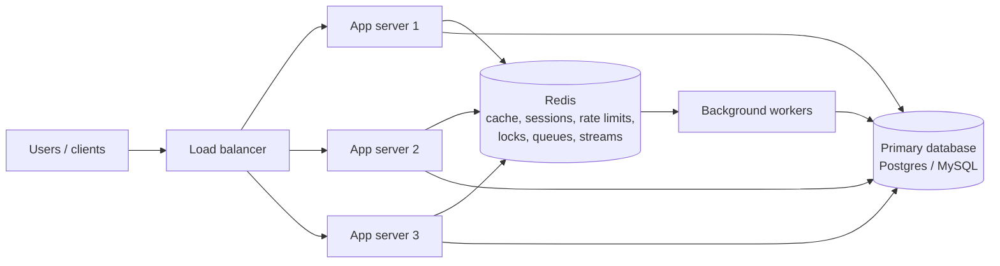
```mermaid
flowchart LR
    U["Users / clients"] --> LB["Load balancer"]
    LB --> A1["App server 1"]
    LB --> A2["App server 2"]
    LB --> A3["App server 3"]
    A1 & A2 & A3 --> R[("Redis<br/>cache, sessions, rate limits,<br/>locks, queues, streams")]
    A1 & A2 & A3 --> DB[("Primary database<br/>Postgres / MySQL")]
    R --> W["Background workers"]
    W --> DB
```

Why teams add Redis:

| Need | Why Redis helps |
|---|---|
| Speed | Reads and writes in well under a millisecond |
| Shared state across servers | Sessions, rate-limit counters, locks visible to every app instance |
| Rich data structures | Sorted sets, streams, sets, etc. solve problems that are awkward in SQL |
| Atomic operations | `INCR`, `SET NX`, Lua scripts give race-free logic without extra locking |
| Messaging | Pub/Sub and Streams for real-time features and job queues |

What Redis is **not** good at: complex relational queries, joins, very large datasets that don't fit in your RAM budget, and being your only copy of critical data unless you configure persistence and replication carefully.

---

## 2. Setup and connecting from Python

### Run Redis locally

```bash
docker run -d --name redis -p 6379:6379 redis:7
pip install "redis>=5"
```

### Connect with a connection pool

Creating a new TCP connection per request is slow. Create **one pool per process** and reuse it.

```python
import redis

pool = redis.ConnectionPool.from_url(
    "redis://localhost:6379/0",
    decode_responses=True,       # return str instead of bytes
    max_connections=50,          # upper bound per process
    socket_connect_timeout=2,    # fail fast if Redis is unreachable
    socket_timeout=10,           # MUST be larger than any BLOCK time you use (see Streams)
    health_check_interval=30,    # ping idle connections before reuse
)
r = redis.Redis(connection_pool=pool)
r.ping()
```

### Retries on transient errors

```python
from redis.backoff import ExponentialBackoff
from redis.retry import Retry
from redis.exceptions import ConnectionError, TimeoutError

r = redis.Redis(
    host="localhost",
    port=6379,
    decode_responses=True,
    retry=Retry(ExponentialBackoff(cap=2, base=0.1), retries=3),
    retry_on_error=[ConnectionError, TimeoutError],
)
```

Only retry operations that are safe to repeat. `GET` is always safe. `INCR` or `XADD` can run twice if the first attempt succeeded but the reply was lost.

### Async client (FastAPI, aiohttp, etc.)

```python
import redis.asyncio as aioredis

r = aioredis.Redis.from_url("redis://localhost:6379/0", decode_responses=True)

async def get_user_name(user_id: int) -> str | None:
    return await r.hget(f"user:{user_id}", "name")

# on shutdown
await r.aclose()
```

### `decode_responses`

- `True`: you get `str`. Convenient for text and JSON.
- `False` (default): you get `bytes`. Required when storing binary data such as vector embeddings, images or pickled objects. Many apps keep **two clients**: one text, one binary.

---

## 3. Key design and naming

Redis has no tables. Your **key names are your schema**, so be consistent.

```
<app>:<entity>:<id>[:<sub-thing>]

shop:user:42                 -> hash with profile fields
shop:user:42:cart            -> hash of product_id -> qty
shop:session:9f3a...         -> session hash
shop:rl:login:203.0.113.7    -> rate-limit counter
shop:cache:product:1001      -> cached JSON
shop:orders                  -> stream
```

Rules of thumb:

- Use `:` as a separator. Most tools (RedisInsight, etc.) group keys by it.
- Keep keys short but readable. Billions of keys × long names = real memory.
- Put a **version** in cache keys when the value format changes: `cache:v2:product:1001`. Bumping `v2 → v3` instantly invalidates everything old.
- In Redis Cluster, keys used together in one command or script must live in the same slot. Use **hash tags**: `{user:42}:cart` and `{user:42}:profile` both hash on `user:42` (see [section 21](#21-replication-sentinel-and-cluster)).
- Never build keys from raw, unbounded user input without validation (key explosion, memory abuse).

---

## 4. Core data structures

Picking the right structure is most of the skill with Redis.

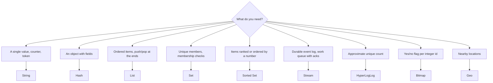
```mermaid
flowchart TD
    Q{"What do you need?"} --> S1["A single value, counter, token"] --> STR["String"]
    Q --> S2["An object with fields"] --> HASH["Hash"]
    Q --> S3["Ordered items, push/pop at the ends"] --> LIST["List"]
    Q --> S4["Unique members, membership checks"] --> SET["Set"]
    Q --> S5["Items ranked or ordered by a number"] --> ZSET["Sorted Set"]
    Q --> S6["Durable event log, work queue with acks"] --> STREAM["Stream"]
    Q --> S7["Approximate unique count"] --> HLL["HyperLogLog"]
    Q --> S8["Yes/no flag per integer id"] --> BIT["Bitmap"]
    Q --> S9["Nearby locations"] --> GEO["Geo"]
```

### String

The simplest type: text, number or bytes up to 512 MB (keep them far smaller in practice).

```python
r.set("feature:new_checkout", "on")
r.set("otp:+919800000000", "482913", ex=300)          # expires in 5 minutes
r.set("job:report:lock", "worker-1", nx=True, ex=30)  # only if it doesn't exist

r.incr("stats:page_views")              # atomic counter
r.incrby("wallet:42:points", 50)
r.incrbyfloat("metrics:latency_sum", 0.023)

r.mset({"a": 1, "b": 2})
r.mget("a", "b")                        # ['1', '2']
```

### Hash

A small object: field → value. Memory-efficient for many small objects.

```python
r.hset("user:42", mapping={"name": "Asha", "plan": "pro", "credits": 10})
r.hget("user:42", "plan")                # 'pro'
r.hgetall("user:42")                     # {'name': 'Asha', 'plan': 'pro', 'credits': '10'}
r.hincrby("user:42", "credits", -1)      # atomic per-field counter
r.hdel("user:42", "plan")
```

Redis 7.4+ also supports **per-field expiry** (`HEXPIRE key 60 FIELDS 1 otp`), useful when one field of an object should expire on its own.

### List

Ordered sequence. Fast at both ends, slow (O(N)) in the middle.

```python
r.lpush("recent:user:42", "viewed:p1001")   # newest first
r.ltrim("recent:user:42", 0, 49)            # keep only the latest 50
r.lrange("recent:user:42", 0, 9)            # top 10

# simple blocking queue (no acks: if the worker dies after BRPOP, the job is lost)
r.lpush("jobs", "send-email:42")
job = r.brpop("jobs", timeout=5)            # ('jobs', 'send-email:42') or None
```

For reliable queues use **Streams** ([section 18](#18-redis-streams-deep-dive)) or the `LMOVE` "processing list" pattern.

### Set

Unordered unique members with fast membership checks.

```python
r.sadd("post:99:likes", "user:1", "user:2")
r.sismember("post:99:likes", "user:1")      # True
r.scard("post:99:likes")                    # 2
r.sinter("user:1:follows", "user:2:follows")  # mutual follows
```

### Sorted Set (ZSET)

Unique members, each with a numeric **score**, kept in order. One of the most useful structures.

```python
r.zadd("lb:weekly", {"alice": 120, "bob": 95})
r.zincrby("lb:weekly", 10, "bob")
r.zrevrange("lb:weekly", 0, 9, withscores=True)   # top 10
r.zrevrank("lb:weekly", "alice")                   # 0-based rank
r.zrangebyscore("lb:weekly", 100, "+inf")          # members with score >= 100
```

Used for leaderboards, priority queues, sliding-window rate limits, delayed jobs (score = run-at timestamp), and time-ordered indexes.

### HyperLogLog, Bitmap, Geo

```python
# Unique visitors per day, ~12 KB per key regardless of count, ~0.81% error
r.pfadd("uv:2026-10-06", "user:1", "user:2", "user:1")
r.pfcount("uv:2026-10-06")                          # 2

# Daily active users as bits: 1 bit per user id
r.setbit("dau:2026-10-06", 42, 1)
r.bitcount("dau:2026-10-06")

# Stores near a point
r.geoadd("stores", [78.1460, 11.6643, "salem-store", 80.2707, 13.0827, "chennai-store"])
r.geosearch("stores", longitude=78.15, latitude=11.66, radius=10, unit="km",
            withdist=True, sort="ASC")              # [['salem-store', 0.6468]]
```

### JSON, Search and Vector

Redis 8 bundles JSON documents, the Query Engine (secondary indexes, full-text) and vector search. On Redis 7 these come from **Redis Stack** modules. Useful for querying documents by field and for AI similarity search ([section 25](#25-redis-in-ai--llm-applications)).

### Big-O you should remember

| Operation | Cost |
|---|---|
| `GET`, `SET`, `HGET`, `SADD`, `LPUSH`, `INCR` | O(1) |
| `ZADD`, `ZRANK`, `ZINCRBY` | O(log N) |
| `XADD` | O(1) |
| `HGETALL`, `SMEMBERS`, `LRANGE 0 -1`, `KEYS *` | O(N), dangerous on big keys |

---

## 5. Expiration (TTL)

Any key can have a time-to-live. When it expires, Redis deletes it.

```python
r.set("otp:42", "123456", ex=300)        # set with TTL (seconds)
r.set("tmp", "x", px=1500)               # milliseconds
r.expire("session:abc", 1800)            # add TTL to an existing key
r.expire("counter", 60, nx=True)         # only if it has no TTL yet (Redis 7+)
r.ttl("session:abc")                     # seconds left; -1 = no TTL, -2 = missing
r.persist("session:abc")                 # remove TTL
r.set("user:42:name", "Asha", keepttl=True)  # overwrite value, keep the old TTL
```

**Watch out:** a plain `SET` on an existing key **removes its TTL** unless you pass `ex`/`px` again or `keepttl=True`.

How Redis expires keys:

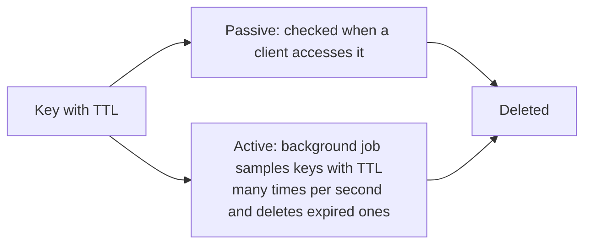
```mermaid
flowchart LR
    K["Key with TTL"] --> P["Passive: checked when a client accesses it"]
    K --> A["Active: background job samples keys with TTL<br/>many times per second and deletes expired ones"]
    P --> D["Deleted"]
    A --> D
```

So expired keys never get returned to clients, but memory may be freed slightly later than the exact TTL.

Always set a TTL on: cache entries, sessions, OTPs, rate-limit keys, locks, idempotency keys, temporary job state.

---

# Part 2 — Product patterns

## 6. Caching

### 6.1 Cache-aside (lazy loading) — the default choice

The application owns the logic: check Redis, fall back to the database on a miss, then fill the cache.

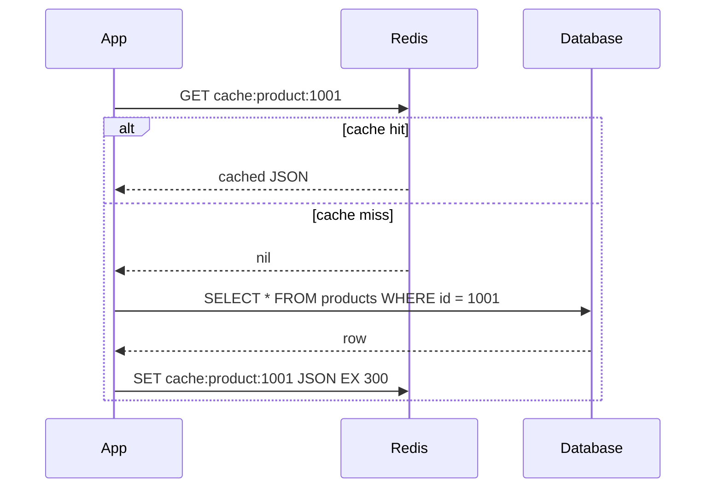
```mermaid
sequenceDiagram
    participant App
    participant Redis
    participant DB as Database
    App->>Redis: GET cache:product:1001
    alt cache hit
        Redis-->>App: cached JSON
    else cache miss
        Redis-->>App: nil
        App->>DB: SELECT * FROM products WHERE id = 1001
        DB-->>App: row
        App->>Redis: SET cache:product:1001 JSON EX 300
    end
```

A reusable decorator with TTL jitter (so many keys don't expire at the same moment):

```python
import functools
import json
import random

def cached(prefix: str, ttl: int = 300, jitter: float = 0.1):
    def deco(fn):
        @functools.wraps(fn)
        def wrapper(*args):
            key = f"cache:{prefix}:" + ":".join(map(str, args))
            hit = r.get(key)
            if hit is not None:
                return json.loads(hit)
            value = fn(*args)
            real_ttl = int(ttl * random.uniform(1 - jitter, 1 + jitter))
            r.set(key, json.dumps(value), ex=real_ttl)
            return value
        return wrapper
    return deco

@cached("product", ttl=300)
def get_product(product_id: int) -> dict | None:
    return db.fetch_product(product_id)        # your DB call
```

Note that a `None` result is stored as the JSON string `"null"`, so "not found" is cached too. That is **negative caching**, and it protects the database from repeated lookups of missing ids. Give misses a shorter TTL if new records appear often.

### 6.2 Other write strategies

| Strategy | How it works | Good for | Risk |
|---|---|---|---|
| Cache-aside | App reads cache, loads DB on miss | Most read-heavy data | Stale data until TTL or invalidation |
| Write-through | App writes DB and cache together | Data read right after writing | Extra write latency, caches data nobody reads |
| Write-behind | App writes cache, a worker flushes to DB later | Very high write rates (counters, likes) | Data loss if Redis dies before flush |
| Refresh-ahead | Refresh popular keys before they expire | Hot keys with expensive loads | Wasted work on keys that cooled down |

### 6.3 Invalidation

"There are only two hard things in computer science: cache invalidation and naming things." Practical rules:

1. **On write, delete the cache key** (don't update it). The next read repopulates it from the source of truth.
   ```python
   def update_product(product_id: int, data: dict) -> None:
       db.update_product(product_id, data)
       r.delete(f"cache:product:{product_id}")
   ```
2. **Delete after the DB commit**, not before. Deleting first lets a concurrent reader put the old value back.
3. **Always keep a TTL** as a safety net for missed invalidations.
4. For many app servers with local in-process caches, broadcast invalidations via Pub/Sub, or use Redis client-side caching (RESP3 tracking).
5. Use **versioned keys** (`cache:v3:...`) for deploys that change the cached format.

### 6.4 Cache stampede (thundering herd)

When a hot key expires, hundreds of requests miss at the same time and all hit the database.

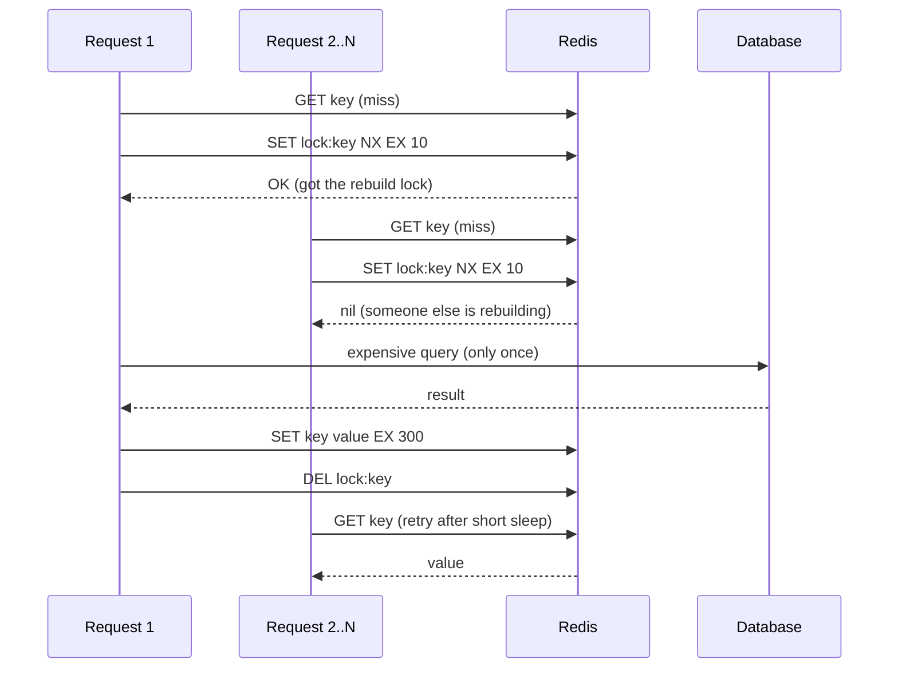
```mermaid
sequenceDiagram
    participant R1 as Request 1
    participant R2 as Request 2..N
    participant Redis
    participant DB as Database
    R1->>Redis: GET key (miss)
    R1->>Redis: SET lock:key NX EX 10
    Redis-->>R1: OK (got the rebuild lock)
    R2->>Redis: GET key (miss)
    R2->>Redis: SET lock:key NX EX 10
    Redis-->>R2: nil (someone else is rebuilding)
    R1->>DB: expensive query (only once)
    DB-->>R1: result
    R1->>Redis: SET key value EX 300
    R1->>Redis: DEL lock:key
    R2->>Redis: GET key (retry after short sleep)
    Redis-->>R2: value
```

```python
import json
import time

def get_with_rebuild_lock(key: str, loader, ttl: int = 300, lock_ttl: int = 10):
    value = r.get(key)
    if value is not None:
        return json.loads(value)

    if r.set(f"lock:{key}", "1", nx=True, ex=lock_ttl):
        try:
            result = loader()
            r.set(key, json.dumps(result), ex=ttl)
            return result
        finally:
            r.delete(f"lock:{key}")

    for _ in range(50):                      # wait up to ~5 s for the rebuilder
        time.sleep(0.1)
        value = r.get(key)
        if value is not None:
            return json.loads(value)
    return loader()                          # last resort
```

Other defences: TTL jitter (above), refresh-ahead for known hot keys, and **probabilistic early expiration** (each reader refreshes a little before expiry with a small probability that grows as the TTL runs out).

### 6.5 Serialization tips

- JSON is readable and portable. Use `orjson` or `msgpack` for speed and size.
- Avoid `pickle` for anything another service might write: unpickling untrusted data runs code.
- Compress large values (zstd/gzip) if they are over a few KB.
- Prefer many small keys over one giant key that every request rewrites.

---

## 7. Session storage

Storing sessions in Redis makes app servers **stateless**: any server can handle any request.

```python
import secrets

SESSION_TTL = 1800  # 30 minutes of inactivity

def create_session(user_id: int, role: str) -> str:
    sid = secrets.token_urlsafe(32)
    key = f"session:{sid}"
    pipe = r.pipeline()
    pipe.hset(key, mapping={"user_id": user_id, "role": role})
    pipe.expire(key, SESSION_TTL)
    pipe.sadd(f"user:{user_id}:sessions", sid)   # index for "log out everywhere"
    pipe.execute()
    return sid                                   # send as an HttpOnly, Secure cookie

def load_session(sid: str) -> dict | None:
    key = f"session:{sid}"
    pipe = r.pipeline()
    pipe.hgetall(key)
    pipe.expire(key, SESSION_TTL)                # sliding expiration on every access
    data, _ = pipe.execute()
    return data or None

def logout(sid: str) -> None:
    r.delete(f"session:{sid}")

def logout_everywhere(user_id: int) -> None:
    # keep an index of a user's sessions to support "log out of all devices"
    for sid in r.smembers(f"user:{user_id}:sessions"):
        r.delete(f"session:{sid}")
    r.delete(f"user:{user_id}:sessions")
```

---

## 8. Rate limiting

Three algorithms, from simplest to smoothest.

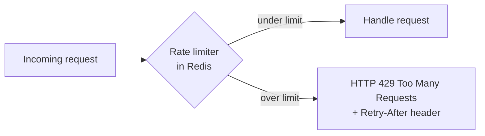
```mermaid
flowchart LR
    REQ["Incoming request"] --> RL{"Rate limiter<br/>in Redis"}
    RL -- "under limit" --> OK["Handle request"]
    RL -- "over limit" --> DENY["HTTP 429 Too Many Requests<br/>+ Retry-After header"]
```

### 8.1 Fixed window

Count requests per time bucket (e.g. per minute).

```python
import time

def allow_fixed_window(user_id: str, limit: int = 100, window: int = 60) -> bool:
    key = f"rl:fixed:{user_id}:{int(time.time() // window)}"
    pipe = r.pipeline()
    pipe.incr(key)
    pipe.expire(key, window, nx=True)   # set TTL only on the first hit
    count, _ = pipe.execute()
    return count <= limit
```

Simple and cheap, but allows bursts at window edges (100 at 0:59 + 100 at 1:00).

### 8.2 Sliding window log (sorted set + Lua)

Keep a timestamp per request and count the ones inside the last `window`. The script makes check-and-add atomic.

```python
import time
import uuid

SLIDING_WINDOW = r.register_script("""
local now    = tonumber(ARGV[1])
local window = tonumber(ARGV[2])
local limit  = tonumber(ARGV[3])
redis.call('ZREMRANGEBYSCORE', KEYS[1], 0, now - window)
if redis.call('ZCARD', KEYS[1]) < limit then
  redis.call('ZADD', KEYS[1], now, ARGV[4])
  redis.call('PEXPIRE', KEYS[1], window)
  return 1
end
return 0
""")

def allow_sliding_window(user_id: str, limit: int = 100, window_ms: int = 60_000) -> bool:
    now = int(time.time() * 1000)
    member = f"{now}-{uuid.uuid4().hex[:8]}"           # unique per request
    return SLIDING_WINDOW(keys=[f"rl:slide:{user_id}"],
                          args=[now, window_ms, limit, member]) == 1
```

Accurate, but stores one entry per request, so memory grows with the limit.

### 8.3 Token bucket (Lua, server time)

A bucket holds up to `capacity` tokens and refills at `rate` per second. Each request spends tokens. It allows short bursts but enforces a steady average. Using Redis `TIME` avoids clock differences between app servers.

```python
TOKEN_BUCKET = r.register_script("""
local capacity = tonumber(ARGV[1])
local rate     = tonumber(ARGV[2])
local cost     = tonumber(ARGV[3])
local t   = redis.call('TIME')
local now = tonumber(t[1]) * 1000 + math.floor(tonumber(t[2]) / 1000)
local data   = redis.call('HMGET', KEYS[1], 'tokens', 'ts')
local tokens = tonumber(data[1]) or capacity
local ts     = tonumber(data[2]) or now
tokens = math.min(capacity, tokens + (now - ts) / 1000 * rate)
local allowed = 0
if tokens >= cost then
  tokens = tokens - cost
  allowed = 1
end
redis.call('HSET', KEYS[1], 'tokens', tokens, 'ts', now)
redis.call('PEXPIRE', KEYS[1], math.ceil(capacity / rate * 1000) + 1000)
return allowed
""")

def allow_token_bucket(key: str, capacity: int = 20, per_sec: float = 5.0, cost: int = 1) -> bool:
    return TOKEN_BUCKET(keys=[f"rl:bucket:{key}"], args=[capacity, per_sec, cost]) == 1
```

`cost` lets you charge expensive endpoints more (or charge by LLM tokens, see section 25).

| Algorithm | Memory per key | Burst at edges | Accuracy |
|---|---|---|---|
| Fixed window | 1 counter | Yes | Approximate |
| Sliding window log | 1 entry per request | No | Exact |
| Token bucket | 2 fields | Controlled bursts | Smooth |

---

## 9. Distributed locks

Use a lock when **only one worker at a time** may do something: run a nightly job, rebuild a cache, process a specific user's payout.

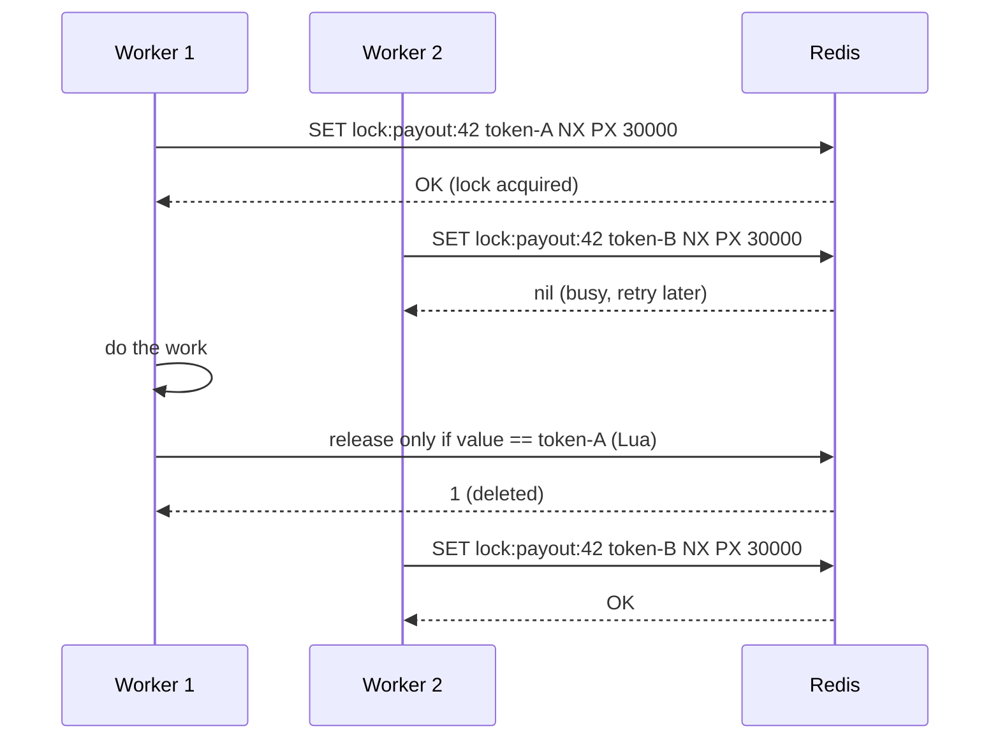
```mermaid
sequenceDiagram
    participant W1 as Worker 1
    participant W2 as Worker 2
    participant Redis
    W1->>Redis: SET lock:payout:42 token-A NX PX 30000
    Redis-->>W1: OK (lock acquired)
    W2->>Redis: SET lock:payout:42 token-B NX PX 30000
    Redis-->>W2: nil (busy, retry later)
    W1->>W1: do the work
    W1->>Redis: release only if value == token-A (Lua)
    Redis-->>W1: 1 (deleted)
    W2->>Redis: SET lock:payout:42 token-B NX PX 30000
    Redis-->>W2: OK
```

Three rules make a Redis lock safe enough:

1. **Acquire atomically with a TTL**: `SET key token NX PX ttl`. The TTL frees the lock if the holder crashes.
2. **Unique token per holder**, so you never delete someone else's lock.
3. **Release with a compare-and-delete script**. A plain `DEL` could remove a lock that already expired and was taken by another worker.

```python
import random
import time
import uuid

RELEASE = r.register_script("""
if redis.call('GET', KEYS[1]) == ARGV[1] then
  return redis.call('DEL', KEYS[1])
end
return 0
""")

EXTEND = r.register_script("""
if redis.call('GET', KEYS[1]) == ARGV[1] then
  return redis.call('PEXPIRE', KEYS[1], ARGV[2])
end
return 0
""")

class RedisLock:
    def __init__(self, client, name: str, ttl_ms: int = 30_000):
        self.r, self.key, self.ttl_ms = client, f"lock:{name}", ttl_ms
        self.token = uuid.uuid4().hex

    def acquire(self, wait_s: float = 5.0) -> bool:
        deadline = time.monotonic() + wait_s
        while time.monotonic() < deadline:
            if self.r.set(self.key, self.token, nx=True, px=self.ttl_ms):
                return True
            time.sleep(0.05 + random.random() * 0.05)   # jittered retry
        return False

    def extend(self) -> bool:
        """Call periodically for long jobs (a 'watchdog')."""
        return EXTEND(keys=[self.key], args=[self.token, self.ttl_ms]) == 1

    def release(self) -> bool:
        return RELEASE(keys=[self.key], args=[self.token]) == 1

    def __enter__(self):
        if not self.acquire():
            raise TimeoutError(f"could not acquire {self.key}")
        return self

    def __exit__(self, *exc):
        self.release()

with RedisLock(r, "payout:42"):
    run_payout(42)
```

`redis-py` also ships a ready-made lock: `with r.lock("payout:42", timeout=30, blocking_timeout=5): ...`.

**Know the limits.** A process can pause (GC, slow I/O) longer than the TTL, the lock expires, and a second worker enters. For correctness-critical work, pass a **fencing token** (an `INCR` number taken with the lock) to the database and reject writes with an older token, or rely on database constraints. Redlock (multiple independent Redis nodes) improves availability but does not remove this problem.

---

## 10. Idempotency keys

Clients retry. Networks drop replies. Webhooks are delivered twice. An **idempotency key** makes "do this once" safe to repeat.

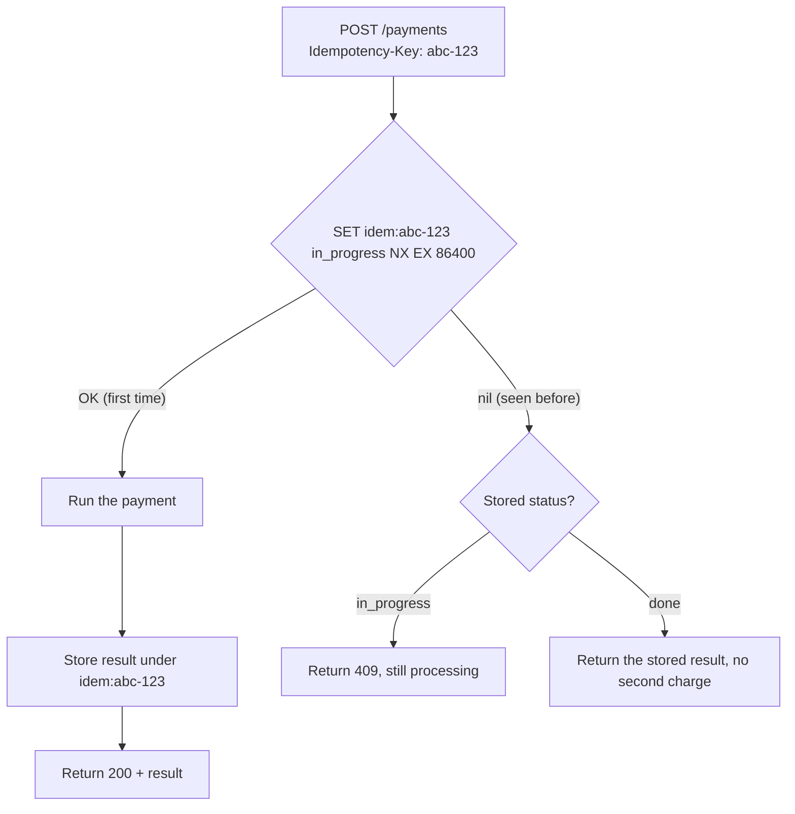
```mermaid
flowchart TD
    A["POST /payments<br/>Idempotency-Key: abc-123"] --> B{"SET idem:abc-123 in_progress NX EX 86400"}
    B -- "OK (first time)" --> C["Run the payment"]
    C --> D["Store result under idem:abc-123"]
    D --> E["Return 200 + result"]
    B -- "nil (seen before)" --> F{"Stored status?"}
    F -- "in_progress" --> G["Return 409, still processing"]
    F -- "done" --> H["Return the stored result, no second charge"]
```

```python
import json

def run_idempotent(idem_key: str, handler, ttl: int = 86_400):
    key = f"idem:{idem_key}"
    if r.set(key, json.dumps({"status": "in_progress"}), nx=True, ex=ttl):
        try:
            result = handler()
        except Exception:
            r.delete(key)                    # let the client retry a failed attempt
            raise
        r.set(key, json.dumps({"status": "done", "result": result}), ex=ttl)
        return 200, result

    saved = json.loads(r.get(key) or '{"status": "in_progress"}')
    if saved["status"] == "in_progress":
        return 409, {"detail": "request is already being processed"}
    return 200, saved["result"]
```

The same idea protects stream consumers from double processing (see [18.5](#185-no-duplicates-delivery-vs-processing)).

---

## 11. Leaderboards, counters and analytics

```python
# Leaderboard
r.zincrby("lb:2026-w41", 25, "player:7")
top10 = r.zrevrange("lb:2026-w41", 0, 9, withscores=True)
my_rank = r.zrevrank("lb:2026-w41", "player:7")          # 0-based
around_me = r.zrevrange("lb:2026-w41", max(my_rank - 2, 0), my_rank + 2, withscores=True)

# Counters per time bucket (expire old buckets automatically)
bucket = f"stats:signups:{time.strftime('%Y%m%d%H')}"
pipe = r.pipeline()
pipe.incr(bucket)
pipe.expire(bucket, 7 * 86_400)
pipe.execute()

# Unique counts at tiny memory
r.pfadd("uv:article:55", "user:1")
r.pfcount("uv:article:55")
r.pfmerge("uv:article:55:week", "uv:article:55:d1", "uv:article:55:d2")

# "Did user X do Y today?" for millions of users
r.setbit("active:2026-10-06", 123456, 1)
r.getbit("active:2026-10-06", 123456)
r.bitcount("active:2026-10-06")
```

---

## 12. Delayed jobs with sorted sets

Streams and lists have no built-in "run later". A sorted set with **score = run-at timestamp** gives you a delayed queue. A small mover process pushes due jobs into a stream for normal workers.

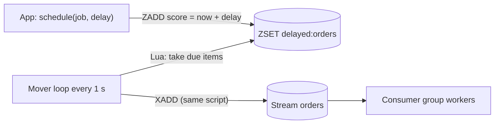
```mermaid
flowchart LR
    APP["App: schedule(job, delay)"] -- "ZADD score = now + delay" --> Z[("ZSET delayed:orders")]
    MOVER["Mover loop every 1 s"] -- "Lua: take due items" --> Z
    MOVER -- "XADD (same script)" --> S[("Stream orders")]
    S --> WK["Consumer group workers"]
```

```python
import json
import time

MOVE_DUE = r.register_script("""
local due = redis.call('ZRANGEBYSCORE', KEYS[1], '-inf', ARGV[1], 'LIMIT', 0, ARGV[2])
for _, job in ipairs(due) do
  redis.call('XADD', KEYS[2], '*', 'data', job)
  redis.call('ZREM', KEYS[1], job)
end
return #due
""")

def schedule(job: dict, delay_s: float) -> None:
    # ZSET members are unique, so every job needs its own id
    r.zadd("delayed:orders", {json.dumps(job, sort_keys=True): time.time() + delay_s})

def mover_loop() -> None:
    while True:
        moved = MOVE_DUE(keys=["delayed:orders", "orders"], args=[time.time(), 100])
        if not moved:
            time.sleep(1)

schedule({"event_id": "evt-1", "type": "reminder_email", "user": 42}, delay_s=3600)
```

Because the move happens in one Lua script, a job is never lost or duplicated between the ZSET and the stream. The job lands in the stream as a `data` field holding JSON, the same message format used in the Streams section. This is also how you build **retry with exponential backoff** for stream messages ([18.13](#1813-retries-with-backoff)).

---

# Part 3 — Atomicity and performance

## 13. The single-threaded model

Redis executes commands **one at a time** on a single main thread (network I/O can use extra threads in Redis 6+, but command execution is serial).

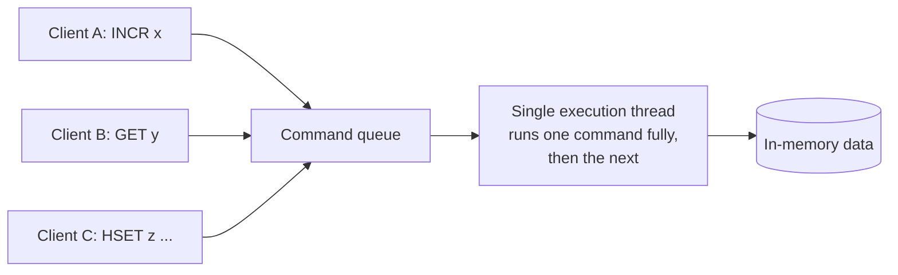
```mermaid
flowchart LR
    C1["Client A: INCR x"] --> Q["Command queue"]
    C2["Client B: GET y"] --> Q
    C3["Client C: HSET z ..."] --> Q
    Q --> T["Single execution thread<br/>runs one command fully,<br/>then the next"]
    T --> M[("In-memory data")]
```

What this means for you:

- **Every single command is atomic.** Two clients doing `INCR` at once never lose an update. No locks needed for single-command logic.
- **One slow command blocks everyone.** `KEYS *`, `HGETALL` on a 1M-field hash, `SMEMBERS` on a huge set, `DEL` of a giant key, or a long Lua script all freeze every other client while they run.
- Multi-step logic ("read, decide, write") is **not** atomic across commands. Use `MULTI`/`WATCH` or a Lua script.

---

## 14. Pipelining

Each command costs one network round trip. With 1 ms between your app and Redis, 100 commands take ~100 ms. A pipeline sends them all at once and reads all replies together.

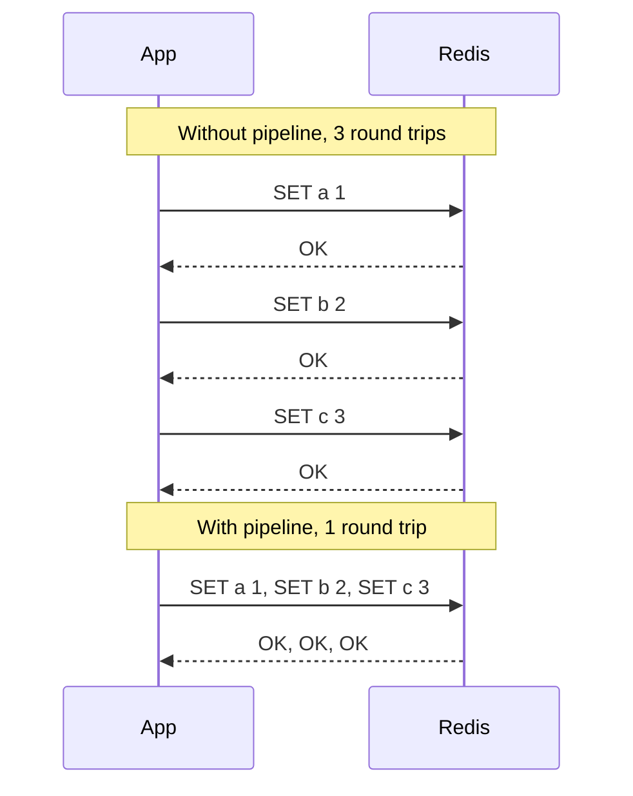
```mermaid
sequenceDiagram
    participant App
    participant Redis
    Note over App,Redis: Without pipeline, 3 round trips
    App->>Redis: SET a 1
    Redis-->>App: OK
    App->>Redis: SET b 2
    Redis-->>App: OK
    App->>Redis: SET c 3
    Redis-->>App: OK
    Note over App,Redis: With pipeline, 1 round trip
    App->>Redis: SET a 1, SET b 2, SET c 3
    Redis-->>App: OK, OK, OK
```

```python
pipe = r.pipeline(transaction=False)      # plain pipeline, no MULTI/EXEC
for user_id in user_ids:
    pipe.hget(f"user:{user_id}", "name")
names = pipe.execute()                    # list of results in the same order
```

Pipelines are about **speed**, not atomicity: other clients' commands can run between yours. Keep batches to a few hundred or thousand commands to bound memory.

---

## 15. Transactions: MULTI/EXEC and WATCH

`MULTI ... EXEC` queues commands and runs them **back-to-back** with nothing in between. In `redis-py`, `r.pipeline()` (default `transaction=True`) wraps commands in `MULTI`/`EXEC`.

```python
pipe = r.pipeline()                        # transaction=True by default
pipe.decrby("wallet:42", 100)
pipe.incrby("wallet:99", 100)
pipe.execute()                             # both run together
```

Important: Redis transactions have **no rollback**. If one command fails at runtime (e.g. `INCR` on a non-number), the others still apply.

### Optimistic locking with WATCH

`WATCH` a key, read it, decide, then `MULTI`/`EXEC`. If anyone changed the key in between, `EXEC` aborts and you retry.

```python
def buy_with_watch(sku: str, qty: int) -> bool:
    key = f"stock:{sku}"
    with r.pipeline() as pipe:
        while True:
            try:
                pipe.watch(key)                    # immediate mode: commands run now
                stock = int(pipe.get(key) or 0)
                if stock < qty:
                    pipe.unwatch()
                    return False
                pipe.multi()                       # start buffering the transaction
                pipe.decrby(key, qty)
                pipe.execute()                     # raises WatchError if key changed
                return True
            except redis.WatchError:
                continue                           # someone else bought, retry
```

Under heavy contention `WATCH` retries a lot. A Lua script is usually simpler and faster.

---

## 16. Lua scripts

A Lua script runs **atomically on the server**: no other command runs until it finishes. It is the cleanest way to do "check then act" in one step.

```python
BUY = r.register_script("""
local stock = tonumber(redis.call('GET', KEYS[1]) or '0')
local qty   = tonumber(ARGV[1])
if stock < qty then
  return -1
end
return redis.call('DECRBY', KEYS[1], qty)
""")

remaining = BUY(keys=["stock:sku-1"], args=[2])
if remaining == -1:
    print("out of stock")
```

`register_script` uses `EVALSHA` (sends only the script's hash) and falls back to `EVAL` automatically if the server doesn't have it cached yet.

Rules for scripts:

- Pass **every key** the script touches in `KEYS`, never build key names inside the script. Redis Cluster needs this to route the script, and all keys must be in the same slot.
- Keep scripts short. A long script blocks the whole server like any slow command.
- Return values convert: Lua number → integer (decimals are truncated, return `tostring(x)` for floats), Lua table → array, `false` → nil.
- Scripts are not persisted. After a restart or failover, `register_script` reloads them for you.
- **Redis Functions** (Redis 7+, `FUNCTION LOAD` / `FCALL`) are the persistent, named version of scripts. They are stored with the data and replicated, which suits shared libraries of server-side logic.

### When to use what

| Need | Tool |
|---|---|
| Many independent commands, fast | Pipeline (`transaction=False`) |
| Several writes that must run together | `MULTI`/`EXEC` |
| Read, decide, write with low contention | `WATCH` + `MULTI`/`EXEC` |
| Read, decide, write, any contention | Lua script |

---

# Part 4 — Messaging

## 17. Pub/Sub

Publish/Subscribe is **fire-and-forget broadcast**. A message goes to every client subscribed to the channel **at that moment**, and is not stored anywhere.

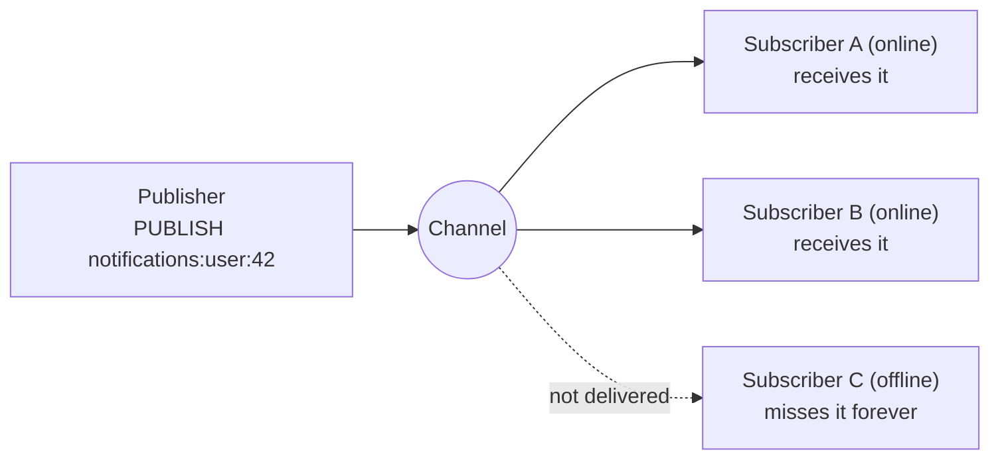
```mermaid
flowchart LR
    PUB["Publisher<br/>PUBLISH notifications:user:42"] --> CH(("Channel"))
    CH --> S1["Subscriber A (online)<br/>receives it"]
    CH --> S2["Subscriber B (online)<br/>receives it"]
    CH -. "not delivered" .-> S3["Subscriber C (offline)<br/>misses it forever"]
```

```python
import json

# Publisher (anywhere in your app)
r.publish("notifications:user:42", json.dumps({"text": "Your order shipped"}))

# Subscriber (a long-running loop in its own thread or process)
p = r.pubsub(ignore_subscribe_messages=True)
p.subscribe("notifications:user:42")
p.psubscribe("notifications:*")              # pattern subscription
for msg in p.listen():
    print(msg["channel"], json.loads(msg["data"]))
```

Async version, e.g. to push events to WebSocket clients connected to this server:

```python
import redis.asyncio as aioredis

r = aioredis.Redis(decode_responses=True)

async def events_for(user_id: int):
    pubsub = r.pubsub(ignore_subscribe_messages=True)
    await pubsub.subscribe(f"notifications:user:{user_id}")
    try:
        async for msg in pubsub.listen():
            yield msg["data"]                # e.g. await websocket.send_text(...)
    finally:
        await pubsub.unsubscribe()
        await pubsub.aclose()
```

Good for: live notifications to connected users, chat typing indicators, broadcasting cache-invalidation or config-reload signals to all app servers.

Not good for: anything that must not be lost (orders, payments, emails). There are no acks, no retries and no history. A slow subscriber can even be disconnected when its output buffer fills (`client-output-buffer-limit pubsub`). In Redis Cluster, prefer **sharded Pub/Sub** (`SPUBLISH`/`SSUBSCRIBE`, Redis 7+) so messages don't get copied to every node.

When you need durability, use Streams.

---

## 18. Redis Streams deep dive

Streams give you a **durable, append-only log** plus **consumer groups** that share work between workers with acknowledgements and retries. This is the Redis answer to "a reliable job/event queue".

### 18.1 Mental model

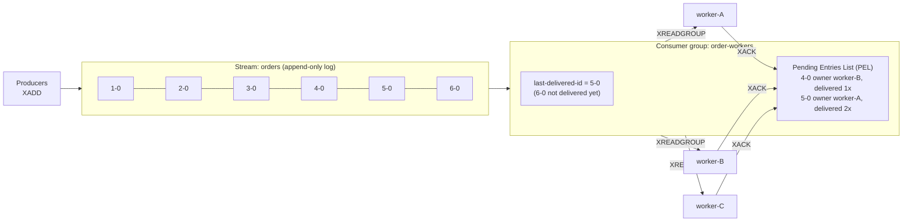
```mermaid
flowchart LR
    P["Producers<br/>XADD"] --> S
    subgraph S ["Stream: orders (append-only log)"]
        direction LR
        E1["1-0"] --- E2["2-0"] --- E3["3-0"] --- E4["4-0"] --- E5["5-0"] --- E6["6-0"]
    end
    subgraph G ["Consumer group: order-workers"]
        LD["last-delivered-id = 5-0<br/>(6-0 not delivered yet)"]
        PEL["Pending Entries List (PEL)<br/>4-0 owner worker-B, delivered 1x<br/>5-0 owner worker-A, delivered 2x"]
    end
    S --> G
    G -- "XREADGROUP" --> A["worker-A"]
    G -- "XREADGROUP" --> B["worker-B"]
    G -- "XREADGROUP" --> C["worker-C"]
    A & B & C -- "XACK" --> PEL
```

The vocabulary:

| Term | Meaning |
|---|---|
| **Stream** | An append-only log stored under one key. Entries are small field-value maps. |
| **Entry ID** | `<milliseconds-timestamp>-<sequence>`, e.g. `1791284113066-7`. Always increasing, so IDs double as time. |
| **Consumer group** | A named reader of the stream with its own cursor (`last-delivered-id`). Many groups can read the same stream independently. |
| **Consumer** | A named worker inside a group. Created automatically the first time it calls `XREADGROUP`. |
| **PEL** | Pending Entries List: messages delivered to a consumer but **not yet acknowledged**. Each record stores the owner, the idle time and the delivery count. |
| **ACK** | `XACK` removes a message from the PEL: "done, don't give this to anyone again". |

Two properties to remember:

- **Reading does not delete.** Unlike `LPOP`, entries stay in the stream after they are read and acked. You remove old entries by trimming ([18.14](#1814-retention-and-trimming)).
- **Groups share work, separate groups each get everything.** Inside one group, each message goes to one consumer. Different groups each see every message (fan-out, [18.11](#1811-fan-out-with-multiple-groups)).

### 18.2 Message lifecycle

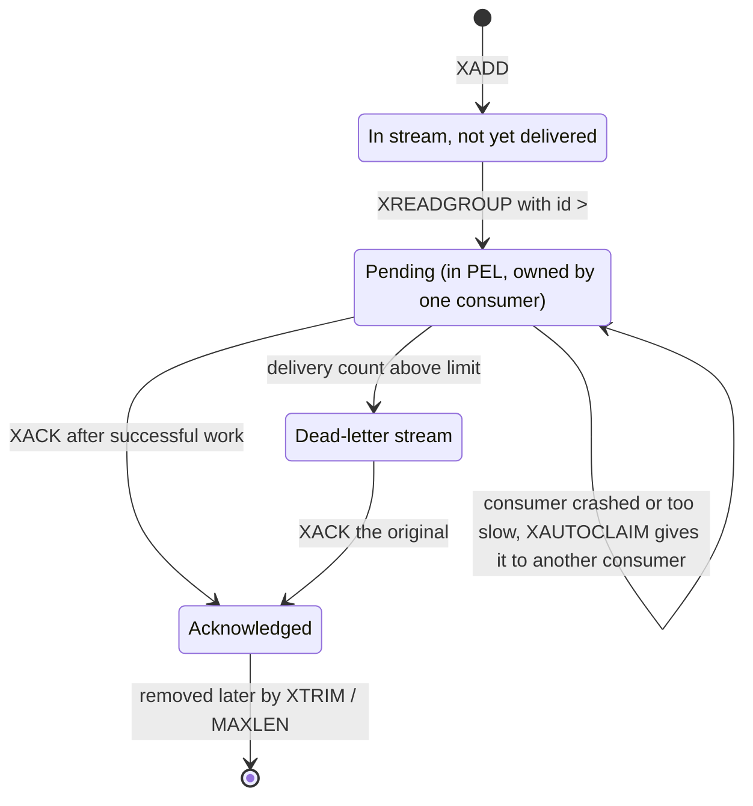
```mermaid
stateDiagram-v2
    state "In stream, not yet delivered" as New
    state "Pending (in PEL, owned by one consumer)" as Pending
    state "Acknowledged" as Acked
    state "Dead-letter stream" as Dead
    [*] --> New: XADD
    New --> Pending: XREADGROUP with id >
    Pending --> Acked: XACK after successful work
    Pending --> Pending: consumer crashed or too slow, XAUTOCLAIM gives it to another consumer
    Pending --> Dead: delivery count above limit
    Dead --> Acked: XACK the original
    Acked --> [*]: removed later by XTRIM / MAXLEN
```

### 18.3 Command reference

| Command | What it does |
|---|---|
| `XADD key [MAXLEN ~ n] * f v ...` | Append an entry. `*` = auto-generate ID. Optional trimming. |
| `XLEN key` | Number of entries. |
| `XRANGE key - + [COUNT n]` | Read entries by ID range (no group, no tracking). |
| `XREAD [BLOCK ms] STREAMS key id` | Read without a group (every reader sees everything, nothing is tracked). |
| `XGROUP CREATE key group id [MKSTREAM]` | Create a group. `$` = only new entries, `0` = from the beginning. |
| `XREADGROUP GROUP g c [COUNT n] [BLOCK ms] [NOACK] STREAMS key id` | Read as consumer `c` of group `g`. `>` = new messages, `0` = my own pending messages. |
| `XACK key group id [id ...]` | Acknowledge, removing from the PEL. |
| `XPENDING key group` | Summary: total pending, min/max ID, count per consumer. |
| `XPENDING key group [IDLE ms] - + count [consumer]` | Detail: ID, owner, idle ms, delivery count. |
| `XCLAIM key group c min-idle id ...` | Take specific pending messages. `JUSTID` resets idle without counting a delivery. |
| `XAUTOCLAIM key group c min-idle start [COUNT n]` | Scan the PEL and take messages idle longer than `min-idle`. |
| `XINFO STREAM / GROUPS / CONSUMERS` | Introspection: length, lag, pending, idle times. |
| `XTRIM key MAXLEN ~ n` / `MINID ~ id` | Retention by count or by age. |
| `XDEL key id` | Delete specific entries. |
| `XGROUP SETID key group id` | Move a group's cursor (replay or skip). |
| `XGROUP DELCONSUMER key group c` | Remove a consumer **and drop its pending entries**. |
| `XGROUP DESTROY key group` | Delete a group. |

Special IDs at a glance:

| ID | Where | Meaning |
|---|---|---|
| `*` | `XADD` | Generate the ID for me |
| `$` | `XGROUP CREATE`, `XREAD` | "Only things added after now" |
| `0` or `0-0` | `XGROUP CREATE` | Start from the very first entry |
| `>` | `XREADGROUP` | Messages never delivered to anyone in this group |
| `0` | `XREADGROUP` | My own pending messages (history), for recovery after restart |
| `-` / `+` | ranges | Smallest / largest possible ID |

### First steps in Python

```python
import json
import redis

r = redis.Redis(decode_responses=True)
STREAM, GROUP = "orders", "order-workers"

# 1. Create the group once (idempotent)
try:
    r.xgroup_create(STREAM, GROUP, id="$", mkstream=True)
except redis.ResponseError as e:
    if "BUSYGROUP" not in str(e):           # BUSYGROUP = group already exists
        raise

# 2. Produce. Convention used in this guide: one field "data" holding JSON,
#    with a producer-generated event_id for idempotency.
msg_id = r.xadd(STREAM, {"data": json.dumps({"event_id": "evt-1001", "order_id": 1001, "amount": 499})},
                maxlen=1_000_000, approximate=True)

# 3. Consume as worker-1
resp = r.xreadgroup(GROUP, "worker-1", {STREAM: ">"}, count=10, block=5000)
# resp == [['orders', [('1791284113066-0', {'data': '{"event_id": ...}'})]]]   or [] on timeout
for _stream, messages in resp:
    for msg_id, fields in messages:
        order = json.loads(fields["data"])
        # ... do the work ...
        r.xack(STREAM, GROUP, msg_id)

# 4. Inspect pending
r.xpending(STREAM, GROUP)
# {'pending': 0, 'min': None, 'max': None, 'consumers': []}
r.xpending_range(STREAM, GROUP, min="-", max="+", count=10)
# [{'message_id': '...', 'consumer': 'worker-1', 'time_since_delivered': 61234, 'times_delivered': 1}, ...]
```

### 18.4 Multiple consumers: one message goes to exactly one consumer

When a consumer calls `XREADGROUP ... >`, Redis, in **one atomic step** on its single thread:

1. takes the entries after the group's `last-delivered-id`,
2. moves `last-delivered-id` forward past them,
3. records each of them in the PEL under **that** consumer's name.

Because this happens atomically, two consumers in the same group can never receive the same new message. No locks are needed.

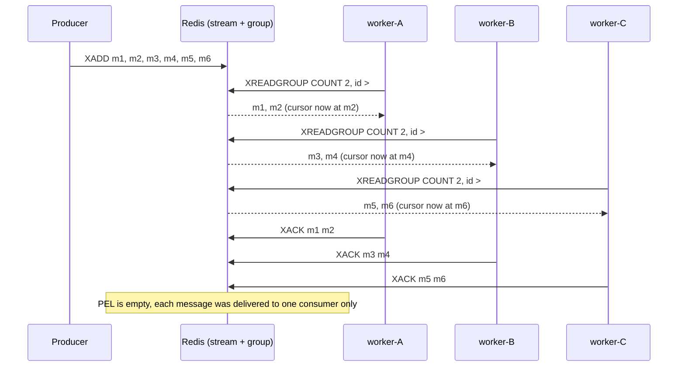
```mermaid
sequenceDiagram
    participant P as Producer
    participant R as Redis (stream + group)
    participant A as worker-A
    participant B as worker-B
    participant C as worker-C
    P->>R: XADD m1, m2, m3, m4, m5, m6
    A->>R: XREADGROUP COUNT 2, id >
    R-->>A: m1, m2 (cursor now at m2)
    B->>R: XREADGROUP COUNT 2, id >
    R-->>B: m3, m4 (cursor now at m4)
    C->>R: XREADGROUP COUNT 2, id >
    R-->>C: m5, m6 (cursor now at m6)
    A->>R: XACK m1 m2
    B->>R: XACK m3 m4
    C->>R: XACK m5 m6
    Note over R: PEL is empty, each message was delivered to one consumer only
```

How load balancing works in practice:

- Whoever asks first gets the next messages, so idle workers naturally pick up more work. There is no round-robin; fast workers simply ask more often.
- `COUNT` is the batch size. Use small counts (1–10) for slow jobs, larger counts for fast jobs.
- To scale, start more consumers **in the same group with different names**. Nothing else changes.

**Consumer names must be unique per running process.** Two processes using the same name share one PEL, and on restart both would re-read the same pending messages with id `0`. Good choices: `hostname-pid`, or the Kubernetes pod name. A StatefulSet gives stable pod names, so a restarted pod resumes its own pending work. With a Deployment, pod names change, so leftovers are picked up by `XAUTOCLAIM` and the old consumer name is cleaned up later ([18.15](#1815-consumer-housekeeping)).

### 18.5 "No duplicates": delivery vs processing

Be precise about what Redis guarantees:

| Layer | Guarantee |
|---|---|
| **Delivery** of a new message within a group | Exactly one consumer at a time owns it. |
| **Processing** | **At-least-once.** The same message can be processed more than once. |

Ways a message gets processed twice:

1. The worker finishes the work, then crashes **before** `XACK`. The message is still pending, gets reclaimed and runs again.
2. The worker is **slow**. Its message looks abandoned, another worker claims it, and both finish ([18.7](#187-the-slow-consumer-trap)).
3. The `XACK` reply is lost on the network and the client retries the whole job.

So "no duplicates" in a product means **effectively-once**: at-least-once delivery + an **idempotent handler**. Pick the technique that matches where your side effect lives:

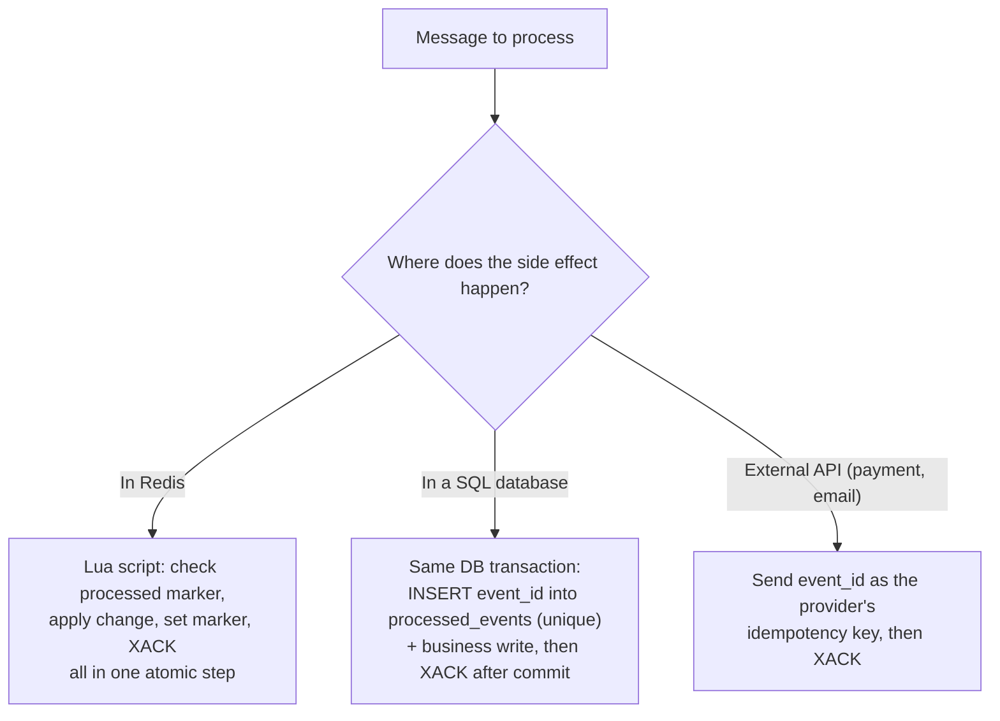
```mermaid
flowchart TD
    M["Message to process"] --> W{"Where does the side effect happen?"}
    W -- "In Redis" --> L["Lua script: check processed marker,<br/>apply change, set marker, XACK<br/>all in one atomic step"]
    W -- "In a SQL database" --> D["Same DB transaction:<br/>INSERT event_id into processed_events (unique)<br/>+ business write, then XACK after commit"]
    W -- "External API (payment, email)" --> X["Send event_id as the provider's<br/>idempotency key, then XACK"]
```

**Side effect in Redis — atomic apply + mark + ack** (this exact script is used in the runnable demo below):

```python
APPLY_AND_ACK = r.register_script("""
local first_time = redis.call('SET', KEYS[2], '1', 'NX', 'EX', 86400)
if first_time then
  redis.call('HINCRBY', KEYS[3], ARGV[3], ARGV[4])
end
redis.call('XACK', KEYS[1], ARGV[1], ARGV[2])
if first_time then return 1 else return 0 end
""")

# returns 1 = applied now, 0 = duplicate, safely skipped (and acked)
APPLY_AND_ACK(keys=[STREAM, f"processed:{event_id}", "wallet:totals"],
              args=[GROUP, msg_id, user_id, amount])
```

**Side effect in Postgres — dedup table in the same transaction** (psycopg 3):

```python
# CREATE TABLE processed_events (event_id text PRIMARY KEY, processed_at timestamptz DEFAULT now());

def handle_order(conn, msg_id: str, fields: dict) -> None:
    event = json.loads(fields["data"])
    with conn.transaction():
        first_time = conn.execute(
            "INSERT INTO processed_events (event_id) VALUES (%s) "
            "ON CONFLICT DO NOTHING RETURNING event_id",
            (event["event_id"],),
        ).fetchone() is not None
        if first_time:
            conn.execute(
                "UPDATE wallets SET balance = balance + %s WHERE user_id = %s",
                (event["amount"], event["user_id"]),
            )
    r.xack(STREAM, GROUP, msg_id)        # after commit, for new and duplicate messages alike
```

**Which ID to deduplicate on?** Use a **producer-generated `event_id`** inside the payload, not the stream entry ID. If a message is ever re-published (retry with backoff, DLQ replay, migration), it gets a new stream ID but keeps its `event_id`. The demo below dedups on the stream ID only because it never re-publishes.

Keep dedup markers at least as long as a message could possibly be redelivered (hours to days).

### 18.6 Crash recovery: pending messages and XAUTOCLAIM

If a consumer dies, its unacked messages stay in the PEL **forever** unless someone takes them. There are two recovery paths.

**Path 1 — the same consumer restarts** (stable name): read your own history with id `0` before reading new messages.

```python
# On startup: finish what I was doing before I crashed
for _, messages in r.xreadgroup(GROUP, CONSUMER, {STREAM: "0"}, count=1000) or []:
    for msg_id, fields in messages:
        if not fields:                       # entry was trimmed/deleted while pending
            r.xack(STREAM, GROUP, msg_id)
            continue
        process(msg_id, fields)
```

**Path 2 — another consumer takes over** (the consumer is gone for good):

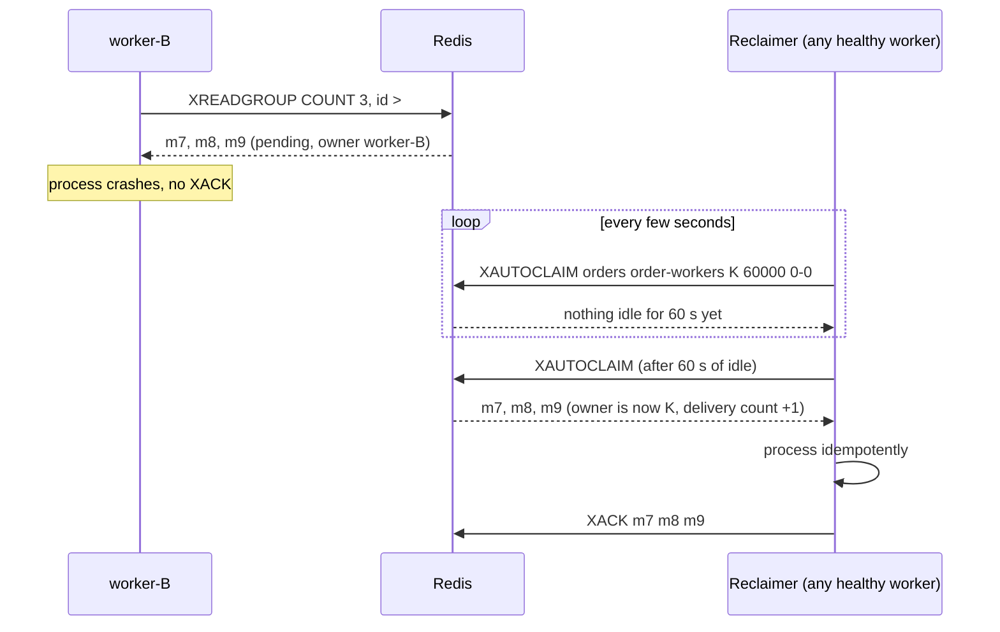
```mermaid
sequenceDiagram
    participant B as worker-B
    participant R as Redis
    participant K as Reclaimer (any healthy worker)
    B->>R: XREADGROUP COUNT 3, id >
    R-->>B: m7, m8, m9 (pending, owner worker-B)
    Note over B: process crashes, no XACK
    loop every few seconds
        K->>R: XAUTOCLAIM orders order-workers K 60000 0-0
        R-->>K: nothing idle for 60 s yet
    end
    K->>R: XAUTOCLAIM (after 60 s of idle)
    R-->>K: m7, m8, m9 (owner is now K, delivery count +1)
    K->>K: process idempotently
    K->>R: XACK m7 m8 m9
```

```python
CLAIM_IDLE_MS = 60_000

def reclaim_stale(consumer: str) -> None:
    start = "0-0"
    while True:
        result = r.xautoclaim(STREAM, GROUP, consumer, CLAIM_IDLE_MS, start_id=start, count=50)
        start, claimed = result[0], result[1]
        # result[2] (Redis 7+) lists IDs that were pending but no longer exist (trimmed);
        # Redis removes them from the PEL for you.
        for msg_id, fields in claimed:
            process(msg_id, fields)
        if start == "0-0":                   # scanned the whole PEL
            break
```

Run this periodically inside every worker (simplest), or in one dedicated reclaimer process.

**Choosing `min-idle-time`:** idle time is measured from **delivery**, not from when your code starts working on a message. It must be longer than the worst-case time to process a whole **batch**, otherwise healthy-but-busy workers get their messages stolen. See the next section.

### 18.7 The slow consumer trap

This happened in the demo below. worker-C read a batch of 5 messages, the first one took 3 seconds, and the reclaimer (with a 2-second threshold) took **all five** because they had all been idle since delivery.

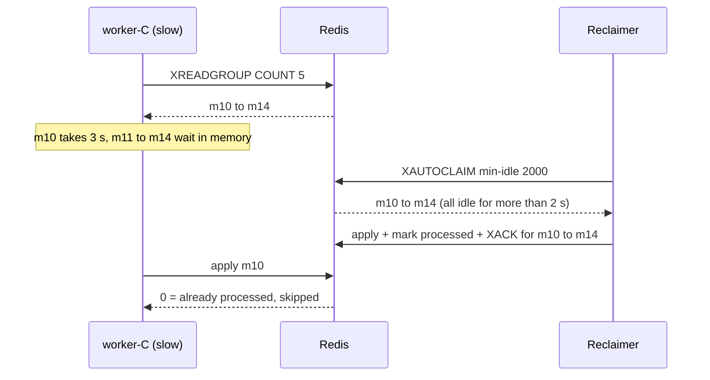
```mermaid
sequenceDiagram
    participant C as worker-C (slow)
    participant R as Redis
    participant K as Reclaimer
    C->>R: XREADGROUP COUNT 5
    R-->>C: m10 to m14
    Note over C: m10 takes 3 s, m11 to m14 wait in memory
    K->>R: XAUTOCLAIM min-idle 2000
    R-->>K: m10 to m14 (all idle for more than 2 s)
    K->>R: apply + mark processed + XACK for m10 to m14
    C->>R: apply m10
    R-->>C: 0 = already processed, skipped
```

Idempotency saved correctness, but work was wasted. Fixes:

1. Set `min-idle-time` well above the worst batch duration (e.g. 5–10× your p99).
2. Use a small `COUNT` for slow jobs.
3. For long jobs, send a **heartbeat**: re-claim your own messages with `JUSTID`, which resets their idle time without counting a new delivery.

```python
def heartbeat(msg_ids: list[str]) -> None:
    """Call every ~10 s while working on long-running messages."""
    r.xclaim(STREAM, GROUP, CONSUMER, min_idle_time=0, message_ids=msg_ids, justid=True)
```

### 18.8 Poison messages and the dead-letter stream

A message that always fails (bad data, a bug) would be reclaimed and retried forever, wasting capacity. Track the **delivery count** and park it after N attempts.

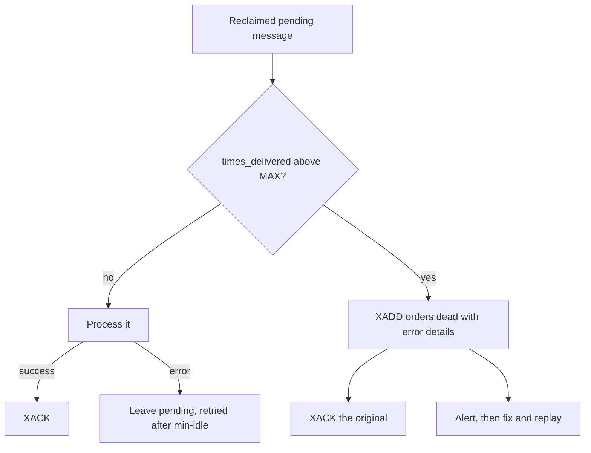
```mermaid
flowchart TD
    M["Reclaimed pending message"] --> D{"times_delivered above MAX?"}
    D -- "no" --> T["Process it"]
    T -- "success" --> ACK["XACK"]
    T -- "error" --> STAY["Leave pending, retried after min-idle"]
    D -- "yes" --> DLQ["XADD orders:dead with error details"]
    DLQ --> ACK2["XACK the original"]
    DLQ --> AL["Alert, then fix and replay"]
```

```python
MAX_DELIVERIES = 5
DLQ = "orders:dead"

def reclaim_with_dlq(consumer: str) -> None:
    start = "0-0"
    while True:
        result = r.xautoclaim(STREAM, GROUP, consumer, CLAIM_IDLE_MS, start_id=start, count=50)
        start, claimed = result[0], result[1]
        for msg_id, fields in claimed:
            info = r.xpending_range(STREAM, GROUP, min=msg_id, max=msg_id, count=1)
            deliveries = info[0]["times_delivered"] if info else 0
            if deliveries > MAX_DELIVERIES:
                pipe = r.pipeline()                  # both or neither
                pipe.xadd(DLQ, {**fields, "original_id": msg_id, "deliveries": deliveries})
                pipe.xack(STREAM, GROUP, msg_id)
                pipe.execute()
                continue
            process(msg_id, fields)
        if start == "0-0":
            break

def replay_dead_letters(limit: int = 100) -> None:
    """After fixing the bug, push parked messages back to the main stream."""
    for dead_id, fields in r.xrange(DLQ, count=limit):
        original = {k: v for k, v in fields.items() if k not in ("original_id", "deliveries", "error")}
        pipe = r.pipeline()
        pipe.xadd(STREAM, original)
        pipe.xdel(DLQ, dead_id)
        pipe.execute()
```

Alert whenever `XLEN orders:dead > 0`.

### 18.9 Full runnable demo: multiple consumers, crash, slow worker, poison message

This single script puts everything together. It starts **3 consumers in one group** plus a reclaimer:

- `worker-A` is healthy.
- `worker-B` **crashes** after 2 messages while still holding a batch (never acks it).
- `worker-C` is **slow** on its first message, so its batch gets reclaimed.
- One **poison** message always fails and ends up in the dead-letter stream.

At the end it proves: every message was applied once, no message was applied twice, nothing is left pending, and the totals match exactly what the producer sent.

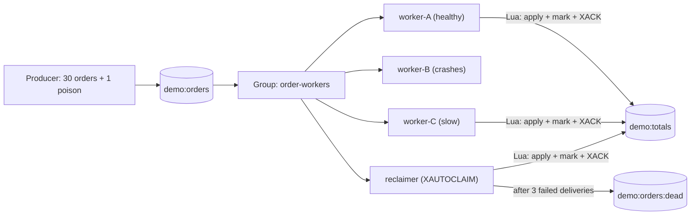
```mermaid
flowchart LR
    PR["Producer: 30 orders + 1 poison"] --> ST[("demo:orders")]
    ST --> GR["Group: order-workers"]
    GR --> WA["worker-A (healthy)"]
    GR --> WB["worker-B (crashes)"]
    GR --> WC["worker-C (slow)"]
    GR --> RC["reclaimer (XAUTOCLAIM)"]
    RC -- "after 3 failed deliveries" --> DL[("demo:orders:dead")]
    WA & WC & RC -- "Lua: apply + mark + XACK" --> TO[("demo:totals")]
```

Save as `streams_demo.py` and run it against a local Redis 7+:

```bash
docker run -d -p 6379:6379 redis:7
pip install "redis>=5"
python streams_demo.py
```

```python
"""
Redis Streams consumer-group demo (Redis 7+, redis-py 5+).

What it shows:
  * 1 producer, 3 consumers in ONE group -> every message goes to exactly one consumer
  * worker-B "crashes" while holding messages -> a reclaimer takes them over (XAUTOCLAIM)
  * worker-C is too slow on one message -> it gets reclaimed, and the idempotent
    Lua script stops the work from being applied twice
  * a poison message is retried MAX_DELIVERIES times, then moved to a dead-letter stream
  * at the end, totals are checked against what the producer sent

Run:  docker run -d -p 6379:6379 redis:7     then     python streams_demo.py
"""
import random
import threading
import time
from collections import Counter, defaultdict

import redis

STREAM = "demo:orders"
GROUP = "order-workers"
DLQ = "demo:orders:dead"
TOTALS = "demo:totals"          # hash: user -> total amount applied
MAX_DELIVERIES = 3
CLAIM_IDLE_MS = 2_000           # a message idle this long is considered abandoned

pool = redis.ConnectionPool(host="localhost", port=6379, decode_responses=True)
stop = threading.Event()
stats_lock = threading.Lock()
handled_by = defaultdict(list)  # consumer -> [msg_id]   (who applied what)
duplicates_prevented = Counter()
T0 = time.time()


def log(msg: str) -> None:
    print(f"[{time.time() - T0:5.2f}s] {msg}", flush=True)


def client() -> redis.Redis:
    return redis.Redis(connection_pool=pool)


# Apply the side effect, remember the message id, and ACK, all in ONE atomic step.
# If the id was already processed (redelivery / reclaim), skip the work but still ACK.
APPLY_AND_ACK = """
local first_time = redis.call('SET', KEYS[2], '1', 'NX', 'EX', 86400)
if first_time then
  redis.call('HINCRBY', KEYS[3], ARGV[3], ARGV[4])
end
redis.call('XACK', KEYS[1], ARGV[1], ARGV[2])
if first_time then return 1 else return 0 end
"""
apply_and_ack = client().register_script(APPLY_AND_ACK)


def process(r: redis.Redis, consumer: str, msg_id: str, fields: dict, slow: bool = False) -> None:
    """Business logic. Raises on failure -> message stays pending -> retried later."""
    if fields.get("poison") == "1":
        raise ValueError("cannot parse payload")
    time.sleep(3 if slow else random.uniform(0.01, 0.05))     # simulate real work
    applied = apply_and_ack(
        keys=[STREAM, f"demo:processed:{msg_id}", TOTALS],
        args=[GROUP, msg_id, fields["user"], fields["amount"]],
    )
    with stats_lock:
        if applied:
            handled_by[consumer].append(msg_id)
        else:
            duplicates_prevented[consumer] += 1
            log(f"{consumer}: {msg_id} was already processed by someone else -> skipped, acked")


def worker(name: str, crash_after: int | None = None, slow_once: bool = False) -> None:
    r = client()
    done = 0
    # 1) After a restart, first finish MY OWN pending messages (id "0" = my PEL history).
    for _, messages in r.xreadgroup(GROUP, name, {STREAM: "0"}, count=100) or []:
        for msg_id, fields in messages:
            if fields:
                process(r, name, msg_id, fields)
    # 2) Then read NEW messages (id ">" = never delivered to anyone in this group).
    while not stop.is_set():
        resp = r.xreadgroup(GROUP, name, {STREAM: ">"}, count=5, block=1000)
        for _, messages in resp or []:
            for i, (msg_id, fields) in enumerate(messages):
                if crash_after is not None and done >= crash_after:
                    held = [m for m, _ in messages[i:]]
                    log(f"{name}: CRASHED while holding {held} (never acked)")
                    return
                try:
                    process(r, name, msg_id, fields, slow=slow_once)
                    slow_once = False
                    done += 1
                except Exception as exc:
                    log(f"{name}: failed {msg_id} ({exc}) -> left pending for retry")


def reclaimer(name: str = "reclaimer") -> None:
    """Periodically take over messages idle > CLAIM_IDLE_MS (dead or stuck consumers)."""
    r = client()
    while not stop.is_set():
        start = "0-0"
        while True:
            result = r.xautoclaim(STREAM, GROUP, name, CLAIM_IDLE_MS, start_id=start, count=50)
            next_id, claimed = result[0], result[1]
            for msg_id, fields in claimed:
                info = r.xpending_range(STREAM, GROUP, min=msg_id, max=msg_id, count=1)
                deliveries = info[0]["times_delivered"] if info else 0
                if deliveries > MAX_DELIVERIES:
                    r.xadd(DLQ, {**fields, "original_id": msg_id, "deliveries": deliveries})
                    r.xack(STREAM, GROUP, msg_id)
                    log(f"{name}: {msg_id} delivered {deliveries}x -> moved to dead-letter stream")
                    continue
                log(f"{name}: claimed {msg_id} (delivery {deliveries})")
                try:
                    process(r, name, msg_id, fields)
                except Exception as exc:
                    log(f"{name}: retry of {msg_id} failed ({exc})")
            if next_id == "0-0":
                break
            start = next_id
        stop.wait(0.5)


def produce(r: redis.Redis, n: int) -> dict:
    expected = Counter()
    for i in range(n):
        user, amount = f"u{i % 3}", random.randint(1, 100)
        r.xadd(STREAM, {"user": user, "amount": amount}, maxlen=10_000, approximate=True)
        expected[user] += amount
    r.xadd(STREAM, {"user": "u0", "amount": 0, "poison": "1"})
    log(f"producer: added {n} orders + 1 poison message")
    return expected


def main() -> None:
    r = client()
    r.delete(STREAM, DLQ, TOTALS, *r.scan_iter("demo:processed:*"))
    r.xgroup_create(STREAM, GROUP, id="0", mkstream=True)
    expected = produce(r, 30)

    threads = [
        threading.Thread(target=worker, args=("worker-A",)),
        threading.Thread(target=worker, args=("worker-B",), kwargs={"crash_after": 2}),
        threading.Thread(target=worker, args=("worker-C",), kwargs={"slow_once": True}),
        threading.Thread(target=reclaimer),
    ]
    for t in threads:
        t.start()

    last_id = r.xinfo_stream(STREAM)["last-generated-id"]
    deadline = time.time() + 30
    while time.time() < deadline:
        group = next(g for g in r.xinfo_groups(STREAM) if g["name"] == GROUP)
        if group["last-delivered-id"] == last_id and group["pending"] == 0:
            break
        time.sleep(0.2)
    time.sleep(3.5)  # let the slow worker finish so we can see the duplicate being skipped
    stop.set()
    for t in threads:
        t.join()

    print("\n=== RESULT ===")
    all_ids = [m for ids in handled_by.values() for m in ids]
    for consumer, ids in sorted(handled_by.items()):
        print(f"{consumer:10s} applied {len(ids):2d} messages")
    print(f"messages applied twice      : {len(all_ids) - len(set(all_ids))}")
    print(f"duplicates prevented (Lua)  : {dict(duplicates_prevented)}")
    print(f"dead-letter stream entries  : {r.xlen(DLQ)}")
    print(f"pending after run           : {r.xpending(STREAM, GROUP)['pending']}")
    actual = {k: int(v) for k, v in r.hgetall(TOTALS).items()}
    print(f"totals match producer       : {actual == dict(expected)}")


if __name__ == "__main__":
    main()
```

Output from a real run (timings and IDs will differ on yours):

```text
[ 0.01s] producer: added 30 orders + 1 poison message
[ 0.08s] worker-B: CRASHED while holding ['1791284547337-7', '1791284547337-8', '1791284547337-9'] (never acked)
[ 0.66s] worker-A: failed 1791284547339-2 (cannot parse payload) -> left pending for retry
[ 2.02s] reclaimer: claimed 1791284547337-7 (delivery 2)
[ 2.06s] reclaimer: claimed 1791284547337-8 (delivery 2)
[ 2.10s] reclaimer: claimed 1791284547337-9 (delivery 2)
[ 2.14s] reclaimer: claimed 1791284547338-0 (delivery 2)
[ 2.18s] reclaimer: claimed 1791284547338-1 (delivery 2)
[ 2.21s] reclaimer: claimed 1791284547338-2 (delivery 2)
[ 2.24s] reclaimer: claimed 1791284547338-3 (delivery 2)
[ 2.28s] reclaimer: claimed 1791284547338-4 (delivery 2)
[ 2.80s] reclaimer: claimed 1791284547339-2 (delivery 2)
[ 2.80s] reclaimer: retry of 1791284547339-2 failed (cannot parse payload)
[ 3.01s] worker-C: 1791284547338-0 was already processed by someone else -> skipped, acked
[ 3.05s] worker-C: 1791284547338-1 was already processed by someone else -> skipped, acked
[ 3.10s] worker-C: 1791284547338-2 was already processed by someone else -> skipped, acked
[ 3.11s] worker-C: 1791284547338-3 was already processed by someone else -> skipped, acked
[ 3.16s] worker-C: 1791284547338-4 was already processed by someone else -> skipped, acked
[ 4.80s] reclaimer: claimed 1791284547339-2 (delivery 3)
[ 4.80s] reclaimer: retry of 1791284547339-2 failed (cannot parse payload)
[ 6.80s] reclaimer: 1791284547339-2 delivered 4x -> moved to dead-letter stream

=== RESULT ===
reclaimer  applied  8 messages
worker-A   applied 20 messages
worker-B   applied  2 messages
messages applied twice      : 0
duplicates prevented (Lua)  : {'worker-C': 5}
dead-letter stream entries  : 1
pending after run           : 0
totals match producer       : True
```

How to read it:

- worker-B crashed holding three messages. After 2 s of idle, the reclaimer claimed them (delivery count 2) and processed them. **Nothing was lost.**
- worker-C's first message took 3 s, so its whole batch was reclaimed and processed by the reclaimer. When worker-C finally finished, the Lua script reported "already processed" five times. **Nothing was applied twice.**
- The poison message failed on deliveries 1, 2 and 3, and was moved to `demo:orders:dead` on the 4th claim.
- `totals match producer : True` is the end-to-end proof of effectively-once processing.

Try changing things: set `count=1` in the workers and only the slow message itself gets reclaimed instead of the whole batch; set `CLAIM_IDLE_MS = 5000` and worker-C keeps its batch, so no work is wasted (crash recovery just takes longer).

### 18.10 Production worker template (asyncio)

A worker you can run as many copies of as you like. It:

- creates the group if missing,
- resumes its own pending messages on startup,
- reclaims stale messages from dead consumers every 30 s and dead-letters poison ones,
- reads new messages with a blocking read,
- shuts down cleanly on `SIGTERM` (Kubernetes) or `Ctrl+C`.

```python
"""worker.py - production-style Redis Streams consumer (redis.asyncio).

Run many copies with different CONSUMER_NAME values.
"""
import asyncio, json, logging, os, signal, socket
import redis.asyncio as aioredis

STREAM, GROUP, DLQ = "orders", "order-workers", "orders:dead"
CONSUMER = os.getenv("CONSUMER_NAME") or f"{socket.gethostname()}-{os.getpid()}"
BATCH, BLOCK_MS = 10, 5_000
CLAIM_IDLE_MS, MAX_DELIVERIES = 60_000, 5
RECLAIM_EVERY_S = 30

log = logging.getLogger(CONSUMER)
r = aioredis.Redis(host="localhost", port=6379, decode_responses=True,
                   socket_timeout=BLOCK_MS / 1000 + 5, health_check_interval=30)

async def ensure_group():
    try:
        await r.xgroup_create(STREAM, GROUP, id="$", mkstream=True)
    except aioredis.ResponseError as e:
        if "BUSYGROUP" not in str(e):
            raise

async def handle(msg_id, fields):
    """Your business logic. Must be idempotent (dedup on order["event_id"], see 18.5)."""
    order = json.loads(fields["data"])
    log.info("processing %s -> %s", msg_id, order)

async def process(msg_id, fields):
    if not fields:
        await r.xack(STREAM, GROUP, msg_id)
        return
    try:
        await handle(msg_id, fields)
        await r.xack(STREAM, GROUP, msg_id)
    except Exception:
        log.exception("failed %s, leaving it pending for retry", msg_id)

async def reclaim():
    start = "0-0"
    while True:
        result = await r.xautoclaim(STREAM, GROUP, CONSUMER, CLAIM_IDLE_MS, start_id=start, count=BATCH)
        start, claimed = result[0], result[1]
        for msg_id, fields in claimed:
            info = await r.xpending_range(STREAM, GROUP, min=msg_id, max=msg_id, count=1)
            if info and info[0]["times_delivered"] > MAX_DELIVERIES:
                await r.xadd(DLQ, {**fields, "original_id": msg_id})
                await r.xack(STREAM, GROUP, msg_id)
                log.warning("dead-lettered %s", msg_id)
            else:
                await process(msg_id, fields)
        if start == "0-0":
            return

async def run(stop):
    await ensure_group()
    for _, msgs in await r.xreadgroup(GROUP, CONSUMER, {STREAM: "0"}, count=1000) or []:
        for msg_id, fields in msgs:
            await process(msg_id, fields)
    loop = asyncio.get_running_loop()
    last_reclaim = 0.0
    while not stop.is_set():
        if loop.time() - last_reclaim > RECLAIM_EVERY_S:
            await reclaim()
            last_reclaim = loop.time()
        resp = await r.xreadgroup(GROUP, CONSUMER, {STREAM: ">"}, count=BATCH, block=BLOCK_MS)
        for _, msgs in resp or []:
            for msg_id, fields in msgs:
                await process(msg_id, fields)
    log.info("stopped cleanly")

async def main():
    logging.basicConfig(level=logging.INFO, format="%(name)s %(message)s")
    stop = asyncio.Event()
    loop = asyncio.get_running_loop()
    for sig in (signal.SIGTERM, signal.SIGINT):
        loop.add_signal_handler(sig, stop.set)
    await run(stop)
    await r.aclose()

if __name__ == "__main__":
    asyncio.run(main())
```

Run three consumers:

```bash
CONSUMER_NAME=worker-1 python worker.py &
CONSUMER_NAME=worker-2 python worker.py &
CONSUMER_NAME=worker-3 python worker.py &
```

A FastAPI endpoint that produces work:

```python
import json
import uuid

import redis.asyncio as aioredis
from fastapi import FastAPI

app = FastAPI()
r = aioredis.Redis(decode_responses=True)

@app.post("/orders")
async def create_order(order: dict):
    event = {"event_id": str(uuid.uuid4()), **order}
    msg_id = await r.xadd("orders", {"data": json.dumps(event)},
                          maxlen=1_000_000, approximate=True)
    return {"queued": msg_id, "event_id": event["event_id"]}
```

On Kubernetes, use the pod name as the consumer name and give pods enough time to finish on shutdown:

```yaml
spec:
  terminationGracePeriodSeconds: 60      # > BLOCK time + longest batch
  containers:
    - name: worker
      env:
        - name: CONSUMER_NAME
          valueFrom:
            fieldRef:
              fieldPath: metadata.name
```

**Concurrency inside one worker.** The template processes one message at a time. For I/O-bound work, process a batch concurrently with a cap:

```python
sem = asyncio.Semaphore(20)

async def guarded(msg_id, fields):
    async with sem:
        await process(msg_id, fields)

# inside the read loop
for _, msgs in resp or []:
    await asyncio.gather(*(guarded(m, f) for m, f in msgs))
```

**Gotcha: socket timeout vs BLOCK.** A blocking `XREADGROUP ... BLOCK 5000` keeps the socket silent for up to 5 s. If the client's `socket_timeout` is shorter, you get `TimeoutError`s. Always set `socket_timeout` larger than your `BLOCK` (the template uses `BLOCK + 5 s`).

### 18.11 Fan-out with multiple groups

Several services need the same event: billing must charge, email must send a receipt, analytics must count. Give each service **its own group** on the same stream.

```mermaid
flowchart LR
    P["Order service<br/>XADD orders"] --> S[("Stream: orders")]
    S --> G1["Group: billing"]
    S --> G2["Group: email"]
    S --> G3["Group: analytics"]
    G1 --> B1["billing-1"]
    G1 --> B2["billing-2"]
    G2 --> E1["email-1"]
    G3 --> A1["analytics-1"]
    G3 --> A2["analytics-2"]
    G3 --> A3["analytics-3"]
```

```python
for group in ("billing", "email", "analytics"):
    try:
        r.xgroup_create("orders", group, id="$", mkstream=True)
    except redis.ResponseError as e:
        if "BUSYGROUP" not in str(e):
            raise

# billing workers read with GROUP billing, email workers with GROUP email, ...
r.xreadgroup("billing", "billing-1", {"orders": ">"}, count=10, block=5000)
r.xreadgroup("email", "email-1", {"orders": ">"}, count=10, block=5000)
```

- **Every group gets every message.** Inside a group, the work is split.
- Groups are independent: a slow email service doesn't slow billing down.
- Adding a new group later with id `0` lets a new service **replay history** that is still in the stream.
- Retention must respect the **slowest** group ([18.14](#1814-retention-and-trimming)).

### 18.12 Ordering and partitioning

A stream stores entries in order. But with several consumers in a group, **processing** order is not guaranteed: m2 can finish before m1, and retries move messages even further out of order.

If order matters **per entity** (all events of order #42 must apply in sequence), partition by key: N streams, route each key to one stream with a stable hash, and have one active consumer per stream.

```mermaid
flowchart LR
    P["Producer"] -- "crc32(order_id) mod 4" --> R{"Router"}
    R --> S0[("orders:0")]
    R --> S1[("orders:1")]
    R --> S2[("orders:2")]
    R --> S3[("orders:3")]
    S0 --> W0["consumer for partition 0"]
    S1 --> W1["consumer for partition 1"]
    S2 --> W2["consumer for partition 2"]
    S3 --> W3["consumer for partition 3"]
```

```python
import zlib

PARTITIONS = 4

def stream_for(key: str) -> str:
    # Python's built-in hash() changes between processes, so use a stable hash
    return f"orders:{zlib.crc32(key.encode()) % PARTITIONS}"

r.xadd(stream_for("order-42"), {"data": json.dumps(event)})
```

This is the same idea as Kafka partitions. Ordering costs parallelism: one partition is processed by one consumer at a time. For strict ordering, also process each partition's messages one by one and don't skip a failing message (park the whole partition or send it to a per-key retry path).

### 18.13 Retries with backoff

`XAUTOCLAIM` gives you a **fixed** retry delay (the `min-idle-time`). For exponential backoff, ack the failed message and re-schedule a copy through the delayed queue from [section 12](#12-delayed-jobs-with-sorted-sets):

```python
import json
import time

MAX_ATTEMPTS = 5

def retry_later(msg_id: str, fields: dict, error: Exception) -> None:
    job = json.loads(fields["data"])                  # keeps its event_id
    job["attempt"] = job.get("attempt", 0) + 1
    pipe = r.pipeline()                               # MULTI/EXEC: both or neither
    if job["attempt"] > MAX_ATTEMPTS:
        pipe.xadd(DLQ, {"data": json.dumps(job), "error": str(error)[:500], "original_id": msg_id})
    else:
        delay = min(5 * 2 ** job["attempt"], 3600)    # 10 s, 20 s, 40 s ... up to 1 h
        pipe.zadd("delayed:orders", {json.dumps(job, sort_keys=True): time.time() + delay})
    pipe.xack(STREAM, GROUP, msg_id)
    pipe.execute()

# in the worker
try:
    handle(msg_id, fields)
    r.xack(STREAM, GROUP, msg_id)
except TemporaryError as exc:                         # e.g. downstream API is down
    retry_later(msg_id, fields, exc)
```

The mover loop from section 12 puts the job back into the stream when it's due. Because the retried copy gets a **new stream ID**, deduplication must use the `event_id` inside the payload.

### 18.14 Retention and trimming

Acked entries are **not** deleted. Without trimming, a stream grows until Redis runs out of memory.

```python
# Cap by count while producing (cheap, approximate with ~)
r.xadd("orders", {"data": payload}, maxlen=1_000_000, approximate=True)

# Cap by age: drop entries older than 7 days (IDs are timestamps)
week_ago_ms = int((time.time() - 7 * 86_400) * 1000)
r.xtrim("orders", minid=f"{week_ago_ms}-0", approximate=True)
```

- `~` (approximate) trims whole internal nodes and is much cheaper than exact trimming. The stream may keep a few extra entries.
- Trimming does not care about consumer groups. It can remove entries that are **still pending** or **not yet delivered** to a slow group. Pending ones that were trimmed come back from `XAUTOCLAIM` in its third result (deleted IDs) and are dropped from the PEL, so they are effectively lost. Size retention well above the worst backlog of the slowest group, and alert on lag before it gets close.
- Prefer trimming over `XDEL` for retention.

### 18.15 Consumer housekeeping

Consumers are never removed automatically, so after many deploys `XINFO CONSUMERS` fills up with dead names.

```python
def remove_idle_consumers(stream: str, group: str, idle_ms: int = 3_600_000) -> None:
    for c in r.xinfo_consumers(stream, group):
        if c["pending"] == 0 and c["idle"] > idle_ms:
            r.xgroup_delconsumer(stream, group, c["name"])
```

**Never delete a consumer that still has pending messages.** `XGROUP DELCONSUMER` drops its PEL entries, so those messages will never be redelivered. Claim them first (`XAUTOCLAIM`), then delete.

Other group operations:

```python
r.xgroup_setid("orders", "analytics", id="0")   # replay everything still in the stream
r.xgroup_setid("orders", "analytics", id="$")   # skip the backlog, only new messages
r.xgroup_destroy("orders", "analytics")         # remove the group entirely
```

### 18.16 Monitoring and autoscaling

```python
def stream_health(stream: str, group: str) -> dict:
    g = next(x for x in r.xinfo_groups(stream) if x["name"] == group)
    oldest = r.xpending_range(stream, group, "-", "+", 1)
    return {
        "length": r.xlen(stream),
        "lag": g.get("lag"),                    # entries not yet delivered to the group (Redis 7+)
        "pending": g["pending"],                # delivered but not acked
        "consumers": [(c["name"], c["pending"], c["idle"]) for c in r.xinfo_consumers(stream, group)],
        "oldest_pending_idle_ms": oldest[0]["time_since_delivered"] if oldest else 0,
        "dead_letters": r.xlen(f"{stream}:dead"),
    }
# {'length': 6, 'lag': 0, 'pending': 0, 'consumers': [('w1', 0, 1003), ('w2', 0, 1001)],
#  'oldest_pending_idle_ms': 0, 'dead_letters': 0}
```

| Signal | What it means | Action |
|---|---|---|
| `lag` keeps growing | Producers are faster than consumers | Add consumers, optimise the handler |
| `pending` high, oldest pending idle is large | Workers are stuck or crashing | Check logs, check reclaimer |
| A consumer's `idle` is huge and it has pending | That process is dead | Reclaimer should take its messages |
| `dead_letters > 0` | Poison messages | Alert, fix, replay |
| `length` near your MAXLEN | Retention may cut unprocessed data | Increase retention or capacity |

On Kubernetes, **KEDA** has a Redis Streams scaler that can scale your worker Deployment based on pending entries or lag, including scaling to zero when idle.

### 18.17 Delivery semantics and NOACK

| Mode | How | Use when |
|---|---|---|
| At-most-once | Pub/Sub, or `XREADGROUP ... NOACK` (no PEL entry is created) | Losing a message is fine: metrics, logs, presence |
| At-least-once | `XREADGROUP` + `XACK` after the work | The default for real work |
| Effectively-once | At-least-once + idempotent handler (18.5) | Payments, inventory, emails, anything user-visible |

### 18.18 Streams vs Pub/Sub vs Lists vs Kafka

| | Pub/Sub | List (`BRPOP` / `LMOVE`) | Stream + consumer group | Kafka |
|---|---|---|---|---|
| Message kept if nobody is listening | No | Yes | Yes | Yes |
| Acks and redelivery | No | Manual (`LMOVE` to a processing list) | Built in (PEL, `XAUTOCLAIM`) | Built in (offsets) |
| Work sharing between workers | No | Yes | Yes | Yes (per partition) |
| Fan-out to several services | Yes | No | Yes (one group each) | Yes (one consumer group each) |
| Replay history | No | No | Yes, while retained | Yes, long retention |
| Ordering | Per channel | Per list | Per stream, not across parallel consumers | Per partition |
| Data size | n/a | RAM | RAM | Disk (TBs, months) |
| Operational cost | You already run Redis | You already run Redis | You already run Redis | A separate cluster |

Rules of thumb:

- **Redis Streams**: most product job queues and internal events at moderate volume, when you already run Redis and retention of hours to days is enough.
- **Kafka (or similar)**: very high throughput, long retention, many teams consuming the same events, stream processing.
- **A task framework** (Celery, RQ, Dramatiq, arq, Taskiq): when you want scheduling, retries and result storage without building them yourself.

---

# Part 5 — Running Redis in production

## 19. Persistence

Redis keeps data in RAM, but it can write it to disk so it survives restarts.

```mermaid
flowchart LR
    W["Writes"] --> MEM[("In-memory dataset")]
    MEM -- "periodic snapshot (fork)" --> RDB["RDB file<br/>compact, fast restart,<br/>loses writes since last snapshot"]
    MEM -- "append every write" --> AOF["AOF log<br/>fsync every second by default,<br/>loses at most ~1 s"]
    RDB & AOF --> RESTART["Restart: load AOF if enabled, else RDB"]
```

| Mode | Data loss on crash | Notes |
|---|---|---|
| None | Everything | Fine for a pure cache that can be rebuilt |
| RDB only | Minutes (since last snapshot) | Small files, good for backups |
| AOF `everysec` | About 1 second | The usual choice for queues, sessions, durable data |
| AOF `always` | Almost none | Much slower writes |
| RDB + AOF | About 1 second | Common production setup; AOF is rewritten with an RDB preamble |

```conf
# redis.conf
appendonly yes
appendfsync everysec
save 3600 1 300 100 60 10000      # snapshot rules for RDB
```

Snapshots and AOF rewrites `fork()` the process. With a large dataset, the fork can pause Redis for a moment and temporarily need extra memory (copy-on-write). Leave memory headroom (≈ 30–50% spare on write-heavy instances).

Back up RDB files off the machine. Persistence protects against restarts, not against disk loss or `FLUSHALL`.

---

## 20. Memory and eviction

### Set a limit and a policy

```conf
maxmemory 4gb
maxmemory-policy allkeys-lru
```

| Policy | Evicts | Use for |
|---|---|---|
| `noeviction` | Nothing; writes fail with an OOM error | Queues, streams, sessions, primary data |
| `allkeys-lru` | Least recently used, any key | Pure cache |
| `allkeys-lfu` | Least frequently used, any key | Cache with stable hot keys |
| `volatile-lru` / `volatile-lfu` | Only keys that have a TTL | Mixed instance: cache keys have TTLs, durable keys don't |
| `volatile-ttl` | Keys closest to expiry | Rarely the best choice |
| `allkeys-random` / `volatile-random` | Random | Rarely the best choice |

**Danger:** if one instance holds both cache entries and durable data (streams, locks, idempotency keys), `allkeys-lru` may evict your **stream or locks**. Use separate instances for cache and durable data, or `volatile-*` policies with TTLs only on cache keys. With `noeviction`, your code must handle `OOM command not allowed` errors.

### Find and avoid big keys

```bash
redis-cli --bigkeys          # largest key per type
redis-cli --memkeys          # largest keys by memory
redis-cli MEMORY USAGE user:42
```

- Keep collections bounded: trim lists (`LTRIM`), streams (`MAXLEN`), sorted sets (`ZREMRANGEBYRANK`).
- Split huge hashes into buckets (`user:42:events:2026-10`).
- Small hashes, lists, sets and sorted sets use a compact encoding (listpack). Many small objects are cheaper than one giant one.
- Delete big keys with `UNLINK` (frees memory in the background) instead of `DEL`.

### Never use KEYS in production

`KEYS pattern` scans the whole keyspace in one blocking call. Use `SCAN`, which walks the keyspace in small steps.

```python
# bad
for key in r.keys("cache:product:*"):
    r.delete(key)

# good: incremental, non-blocking, batched deletes
batch = []
for key in r.scan_iter(match="cache:product:*", count=1000):
    batch.append(key)
    if len(batch) >= 500:
        r.unlink(*batch)
        batch.clear()
if batch:
    r.unlink(*batch)
```

The same applies inside collections: `HSCAN`, `SSCAN`, `ZSCAN` instead of `HGETALL` / `SMEMBERS` / `ZRANGE 0 -1` on big keys.

---

## 21. Replication, Sentinel and Cluster

### Replication

A primary streams its writes to one or more replicas. Replication is **asynchronous**: a write acknowledged by the primary can be lost if the primary dies before replicas receive it. `WAIT n timeout` blocks until `n` replicas have the write, which narrows (but does not remove) that window.

Replicas can serve reads, but they may be slightly behind (read-your-own-write can fail).

### Sentinel: automatic failover for one primary

```mermaid
flowchart TD
    APP["App with Sentinel-aware client"] -- "who is the primary?" --> SEN["Sentinels (3 or more, quorum)"]
    SEN -- "monitor" --> P[("Primary")]
    SEN -- "monitor" --> R1[("Replica 1")]
    SEN -- "monitor" --> R2[("Replica 2")]
    P -- "async replication" --> R1
    P -- "async replication" --> R2
    APP -- "reads and writes" --> P
```

When the primary fails, the Sentinels agree, promote a replica, and clients ask Sentinel for the new address.

```python
from redis.sentinel import Sentinel

sentinel = Sentinel([("sentinel-1", 26379), ("sentinel-2", 26379), ("sentinel-3", 26379)],
                    socket_timeout=0.5)
primary = sentinel.master_for("mymaster", decode_responses=True)    # writes
replica = sentinel.slave_for("mymaster", decode_responses=True)     # reads that can be stale
primary.set("k", "v")
```

### Cluster: sharding across many primaries

The keyspace is split into **16,384 hash slots**. Each key maps to a slot with `CRC16(key) mod 16384`, and each primary owns a range of slots.

```mermaid
flowchart TD
    C["Client: key user:42"] --> H["slot = CRC16(key) mod 16384"]
    H --> N1["Primary A<br/>slots 0 to 5460"]
    H --> N2["Primary B<br/>slots 5461 to 10922"]
    H --> N3["Primary C<br/>slots 10923 to 16383"]
    N1 --> R1["Replica A1"]
    N2 --> R2["Replica B1"]
    N3 --> R3["Replica C1"]
```

```python
from redis.cluster import RedisCluster

rc = RedisCluster(host="cluster-node-1", port=6379, decode_responses=True)
rc.set("user:42:name", "Asha")      # the client routes to the right node automatically
```

The big rule: **multi-key commands, transactions and Lua scripts only work when all keys are in the same slot.** Control this with **hash tags**: only the part inside `{...}` is hashed.

```python
# Same slot: both hash on "user:42"
rc.mset({"{user:42}:name": "Asha", "{user:42}:plan": "pro"})

# The stream, its dedup markers and totals used by one Lua script must share a tag
STREAM = "{orders}:stream"
DLQ = "{orders}:dead"
marker = f"{{orders}}:processed:{event_id}"
```

Don't put everything under one tag, or one node gets all the traffic (a hot shard). A single stream lives on a single node; to spread a big stream workload, use partitioned streams with different tags ([18.12](#1812-ordering-and-partitioning)).

| Setup | Scales writes | Automatic failover | Complexity |
|---|---|---|---|
| Single instance | No | No | Lowest |
| Primary + replicas + Sentinel | No (reads only) | Yes | Medium |
| Cluster | Yes | Yes | Highest; multi-key rules apply |

---

## 22. Security

- **Never expose Redis to the internet.** Keep it in a private network, restrict with security groups / network policies, and keep `protected-mode yes`.
- **Use ACL users**, one per application role, with only the commands and key patterns it needs:
  ```
  ACL SETUSER orders-worker on >change-me ~orders* ~{orders}* +xreadgroup +xack +xautoclaim +xclaim +xpending +xadd +xinfo +xgroup +ping
  ACL SETUSER cache-app on >change-me ~cache:* +get +set +del +unlink +expire +ttl +mget +ping
  ACL SETUSER default off
  ```
- **Block dangerous commands** for app users: `FLUSHALL`, `FLUSHDB`, `CONFIG`, `DEBUG`, `KEYS`, `SHUTDOWN` (the ACL category `-@dangerous` covers most of them).
- **Encrypt in transit** with TLS:
  ```python
  r = redis.Redis(
      host="redis.internal", port=6380,
      username="orders-worker", password=os.environ["REDIS_PASSWORD"],
      ssl=True, ssl_cert_reqs="required", ssl_ca_certs="/etc/ssl/redis-ca.pem",
      decode_responses=True,
  )
  ```
- Keep secrets in a secret manager, not in code.
- Validate any user input that becomes part of a key name.
- Don't `pickle.loads` data from Redis that another service could have written.

---

## 23. Observability and operations

Metrics worth a dashboard and alerts (from `INFO`, or the Prometheus `redis_exporter`):

| Metric | Why |
|---|---|
| `used_memory` vs `maxmemory` | Approaching the limit means eviction or OOM errors |
| `mem_fragmentation_ratio` | Much above 1.5 wastes RAM; consider `activedefrag yes` |
| `evicted_keys` | Non-zero on a durable instance is an incident |
| `keyspace_hits` / `keyspace_misses` | Cache hit ratio |
| `connected_clients`, `rejected_connections` | Connection leaks, pool misconfiguration |
| `blocked_clients` | Clients in `BLOCK` reads (normal for stream workers) |
| `instantaneous_ops_per_sec` | Load |
| `latest_fork_usec` | Long forks cause latency spikes |
| Replication offset lag | Replicas falling behind |
| Stream lag / pending / DLQ length | Queue health ([18.16](#1816-monitoring-and-autoscaling)) |

```python
stats = r.info("stats")
hits, misses = stats["keyspace_hits"], stats["keyspace_misses"]
print("cache hit ratio:", round(hits / max(hits + misses, 1), 3))
print("evicted keys   :", stats["evicted_keys"])
```

Debugging tools:

```bash
redis-cli SLOWLOG GET 10          # slowest recent commands
redis-cli LATENCY DOCTOR          # latency analysis
redis-cli --latency               # live round-trip latency
redis-cli CLIENT LIST             # who is connected, what they are doing
redis-cli MONITOR                 # every command live; debugging only, very heavy
```

---

## 24. Managed services and forks

Running Redis yourself means handling failover, backups, upgrades and memory tuning. Managed options include AWS ElastiCache (and MemoryDB when you need durability with a multi-AZ transaction log), Google Memorystore, Azure's managed Redis offerings, Redis Cloud, and Upstash (serverless, also reachable over HTTP).

In 2024 Redis changed its license, and the Linux Foundation started **Valkey**, an open-source fork of Redis 7.2. Redis 8 later added an AGPLv3 license option. For everything in Parts 1–5 of this guide, Redis and Valkey behave the same and work with the same clients (`redis-py`). The extra modules differ: Redis 8 bundles JSON, the Query Engine and vector search, while Valkey has its own module ecosystem. Check which one your cloud provider runs before relying on module features.

---

# Part 6 — Redis in AI / LLM applications

## 25. Redis in AI / LLM applications

LLM apps are slow and expensive per call, and they keep a lot of short-lived state. Redis fits several needs at once.

```mermaid
flowchart LR
    U["User request"] --> API["API server"]
    API --> RL["Token budget and<br/>provider rate limit"]
    API --> SC["Exact / semantic cache"]
    API --> MEM["Chat memory (list + TTL)"]
    API --> Q["Stream: long agent jobs"]
    Q --> W["Agent workers"]
    W --> TOK["Stream per answer:<br/>resumable token streaming"]
    TOK --> API
    RL & SC & MEM & Q & TOK --- R[("Redis")]
```

### 25.1 Exact-match LLM cache

Start here. Same model + same messages + same parameters → reuse the answer.

```python
import hashlib
import json

def llm_cache_key(model: str, messages: list, **params) -> str:
    raw = json.dumps({"model": model, "messages": messages, **params}, sort_keys=True)
    return "llm:exact:" + hashlib.sha256(raw.encode()).hexdigest()

def cached_completion(call_llm, model: str, messages: list, ttl: int = 86_400, **params) -> str:
    key = llm_cache_key(model, messages, **params)
    if (hit := r.get(key)) is not None:
        return hit
    answer = call_llm(model=model, messages=messages, **params)
    r.set(key, answer, ex=ttl)
    return answer
```

Only cache deterministic-enough calls (e.g. `temperature=0`), and include anything that changes the answer (system prompt version, tool list, tenant) in the key.

### 25.2 Semantic cache (vector search)

Reuse an answer when a **similar** question was asked before ("How do I reset my password?" ≈ "forgot password, how to reset").

```mermaid
flowchart TD
    Q["User question"] --> E["Create embedding"]
    E --> S{"KNN search in Redis:<br/>closest cached question<br/>within distance threshold?"}
    S -- "yes" --> HIT["Return cached answer, no LLM call"]
    S -- "no" --> LLM["Call the LLM"]
    LLM --> ST["Store embedding + answer with TTL"]
    ST --> ANS["Return answer"]
```

Requires Redis 8+ (Query Engine built in), Redis Stack, or a managed Redis with vector search.

```python
import uuid

import numpy as np
import redis

rb = redis.Redis()          # binary-safe client: embeddings are raw bytes
DIM = 1536                  # must match your embedding model

def create_index() -> None:
    try:
        rb.execute_command(
            "FT.CREATE", "idx:llmcache", "ON", "HASH", "PREFIX", "1", "llmcache:",
            "SCHEMA",
            "tenant", "TAG",
            "response", "TEXT",
            "embedding", "VECTOR", "HNSW", "6",
            "TYPE", "FLOAT32", "DIM", DIM, "DISTANCE_METRIC", "COSINE",
        )
    except redis.ResponseError as e:
        if "Index already exists" not in str(e):
            raise

def to_bytes(vec) -> bytes:
    return np.asarray(vec, dtype=np.float32).tobytes()

def semantic_lookup(tenant: str, query_vec, max_distance: float = 0.10) -> str | None:
    res = rb.execute_command(
        "FT.SEARCH", "idx:llmcache",
        f"(@tenant:{{{tenant}}})=>[KNN 1 @embedding $vec AS dist]",
        "PARAMS", "2", "vec", to_bytes(query_vec),
        "RETURN", "2", "response", "dist",
        "DIALECT", "2",
    )
    if res[0] == 0:
        return None
    fields = dict(zip(res[2][::2], res[2][1::2]))
    if float(fields[b"dist"]) <= max_distance:     # cosine distance: 0 = identical
        return fields[b"response"].decode()
    return None

def semantic_store(tenant: str, query_vec, response: str, ttl: int = 86_400) -> None:
    key = f"llmcache:{uuid.uuid4().hex}"
    pipe = rb.pipeline()
    pipe.hset(key, mapping={"tenant": tenant, "response": response, "embedding": to_bytes(query_vec)})
    pipe.expire(key, ttl)
    pipe.execute()
```

Be careful with semantic caching:

- **Isolate tenants and users** (the `tenant` tag filter above). Never serve one customer's answer to another.
- Don't cache answers that depend on personal data, live data or time ("what's my balance?", "today's price").
- Tune `max_distance` on real traffic. Too loose returns wrong answers confidently.
- Higher-level libraries (RedisVL, LangChain's Redis cache) wrap this pattern if you prefer not to write FT commands.

### 25.3 Chat memory with automatic cleanup

```python
def add_turn(session_id: str, role: str, content: str, max_turns: int = 20, ttl: int = 3600) -> None:
    key = f"chat:{session_id}"
    pipe = r.pipeline()
    pipe.rpush(key, json.dumps({"role": role, "content": content}))
    pipe.ltrim(key, -max_turns, -1)     # keep only the last N turns
    pipe.expire(key, ttl)               # forget idle conversations
    pipe.execute()

def get_history(session_id: str) -> list[dict]:
    return [json.loads(m) for m in r.lrange(f"chat:{session_id}", 0, -1)]
```

For agent frameworks, LangGraph offers a Redis checkpointer (`langgraph-checkpoint-redis`) to persist graph state between steps and across servers.

### 25.4 Token budgets per user

Reserve an estimate before the call, settle with the real usage after.

```python
import time

DAILY_TOKEN_LIMIT = 200_000

def _budget_key(user_id: str) -> str:
    return f"llm:tokens:{user_id}:{time.strftime('%Y%m%d')}"

def reserve_tokens(user_id: str, estimate: int) -> bool:
    key = _budget_key(user_id)
    pipe = r.pipeline()
    pipe.incrby(key, estimate)
    pipe.expire(key, 2 * 86_400, nx=True)
    used, _ = pipe.execute()
    if used > DAILY_TOKEN_LIMIT:
        r.decrby(key, estimate)          # give the reservation back
        return False
    return True

def settle_tokens(user_id: str, estimate: int, actual: int) -> None:
    r.incrby(_budget_key(user_id), actual - estimate)
```

To stay under a **provider's** tokens-per-minute limit across all your servers, reuse the token bucket from [8.3](#83-token-bucket-lua-server-time) with `cost` = estimated tokens:

```python
TPM = 90_000
if not allow_token_bucket("provider:llm", capacity=TPM, per_sec=TPM / 60, cost=estimated_tokens):
    ...  # queue the request or return 429
```

### 25.5 Resumable token streaming with Streams

Write each generated chunk to a per-answer stream. The client-facing endpoint (SSE or WebSocket) reads with `XREAD` from the last ID it sent. If the user's connection drops, the client reconnects with that ID (SSE's `Last-Event-ID`) and continues where it stopped. The worker generating the answer can even run on a different server.

```python
import redis.asyncio as aioredis

ar = aioredis.Redis(decode_responses=True)

async def stream_answer(session_id: str, chunks) -> None:
    """Runs in the worker that calls the LLM."""
    key = f"llm:stream:{session_id}"
    async for chunk in chunks:
        await ar.xadd(key, {"t": chunk}, maxlen=10_000, approximate=True)
    await ar.xadd(key, {"done": "1"})
    await ar.expire(key, 3600)

async def read_answer(session_id: str, last_id: str = "0"):
    """Runs in the API server; yields (id, text) pairs to send as SSE events."""
    key = f"llm:stream:{session_id}"
    while True:
        resp = await ar.xread({key: last_id}, block=15_000, count=100)
        if not resp:
            return                            # timed out, generator is gone
        for _, entries in resp:
            for entry_id, fields in entries:
                last_id = entry_id
                if fields.get("done"):
                    return
                yield entry_id, fields["t"]
```

This uses plain `XREAD` (no group) because every reader should see every chunk. Long-running agent jobs themselves go through a consumer group as in [section 18](#18-redis-streams-deep-dive).

---

# Part 7 — Wrap-up

## 26. Testing

**Unit tests** with `fakeredis`, an in-memory fake that needs no server:

```python
import fakeredis

r = fakeredis.FakeRedis(decode_responses=True)   # pip install "fakeredis[lua]" for scripts
```

**Integration tests** against a real Redis, especially for Lua scripts, Streams and timing behaviour:

```python
import pytest
from testcontainers.redis import RedisContainer

@pytest.fixture(scope="session")
def redis_client():
    with RedisContainer("redis:7") as container:
        yield container.get_client(decode_responses=True)

@pytest.fixture(autouse=True)
def clean_db(redis_client):
    redis_client.flushdb()

def test_lock_is_exclusive(redis_client):
    a, b = RedisLock(redis_client, "job"), RedisLock(redis_client, "job")
    assert a.acquire()
    assert not b.acquire(wait_s=0.2)
    assert not b.release()             # cannot release someone else's lock
    assert a.release()
```

What to test for stream consumers:

- A crash before `XACK` leads to redelivery (simulate by reading and not acking, then run the reclaimer with a small `min-idle-time`).
- Running the handler twice on the same message changes state only once.
- Poison messages end up in the DLQ after N deliveries.
- After a run, `XPENDING` is empty and business totals match the input (like the demo).

---

## 27. Common mistakes checklist

| Mistake | Fix |
|---|---|
| Cache keys without TTL | Always set `ex`; add jitter |
| Plain `SET` silently removed a TTL | Pass `ex` again or `keepttl=True` |
| `KEYS *` in production code | `SCAN` / `scan_iter` |
| Huge hashes / lists / sets | Bound them, bucket them, delete with `UNLINK` |
| Read-then-write race (`GET` then `SET`) | `INCR`, `SET NX`, `WATCH`, or a Lua script |
| Lock released with plain `DEL` | Compare-and-delete Lua with a unique token |
| New connection per request | One connection pool per process |
| `socket_timeout` shorter than `BLOCK` | `socket_timeout` > `BLOCK` time |
| Pub/Sub used for jobs that must not be lost | Streams with consumer groups |
| `XACK` before the work is done | Ack only after the side effect is committed |
| Assuming streams give exactly-once | At-least-once + idempotent handler keyed on `event_id` |
| Never reclaiming pending messages | `XAUTOCLAIM` loop in every worker or a reclaimer |
| `min-idle-time` shorter than a batch takes | Raise it, lower `COUNT`, or heartbeat with `XCLAIM JUSTID` |
| No poison-message handling | Delivery-count check + dead-letter stream + alert |
| Stream never trimmed | `MAXLEN ~` on `XADD` or periodic `XTRIM MINID` |
| `XGROUP DELCONSUMER` on a consumer with pending messages | Claim first, then delete |
| Same consumer name in two processes | `hostname-pid` or pod name |
| Cache and queues on one instance with `allkeys-lru` | Separate instances or `volatile-*` policy |
| Multi-key operations failing in Cluster | Hash tags `{...}`, pass all keys to scripts |
| Redis open to the network with no auth | Private network, ACL users, TLS |
| `pickle` for cached objects | JSON / msgpack |

---

## 28. Command cheat sheet

| Area | Commands |
|---|---|
| Strings | `SET k v EX s NX`, `GET`, `MGET`, `INCR`, `INCRBY`, `DECRBY`, `GETDEL` |
| Keys | `DEL`, `UNLINK`, `EXISTS`, `EXPIRE`, `TTL`, `PERSIST`, `SCAN`, `TYPE`, `RENAME` |
| Hashes | `HSET`, `HGET`, `HMGET`, `HGETALL`, `HINCRBY`, `HDEL`, `HSCAN`, `HEXPIRE` (7.4+) |
| Lists | `LPUSH`, `RPUSH`, `LPOP`, `BRPOP`, `LMOVE`, `LRANGE`, `LTRIM`, `LLEN` |
| Sets | `SADD`, `SREM`, `SISMEMBER`, `SCARD`, `SINTER`, `SUNION`, `SSCAN` |
| Sorted sets | `ZADD`, `ZINCRBY`, `ZRANGE`, `ZREVRANGE`, `ZRANK`, `ZRANGEBYSCORE`, `ZREMRANGEBYSCORE`, `ZPOPMIN` |
| Streams | `XADD`, `XLEN`, `XRANGE`, `XREAD`, `XGROUP CREATE`, `XREADGROUP`, `XACK`, `XPENDING`, `XCLAIM`, `XAUTOCLAIM`, `XINFO`, `XTRIM`, `XDEL` |
| Pub/Sub | `PUBLISH`, `SUBSCRIBE`, `PSUBSCRIBE`, `SPUBLISH`, `SSUBSCRIBE` |
| Probabilistic | `PFADD`, `PFCOUNT`, `PFMERGE`, `SETBIT`, `GETBIT`, `BITCOUNT` |
| Geo | `GEOADD`, `GEOSEARCH`, `GEODIST` |
| Atomicity | `MULTI`, `EXEC`, `WATCH`, `EVAL`, `EVALSHA`, `FCALL` |
| Ops | `INFO`, `SLOWLOG GET`, `LATENCY DOCTOR`, `MEMORY USAGE`, `CLIENT LIST`, `CONFIG GET`, `ACL SETUSER` |

### Suggested learning path

1. Strings, hashes, TTL and cache-aside
2. Sorted sets, rate limiting, locks, idempotency keys
3. Pipelines, transactions and Lua
4. Streams: groups, `XREADGROUP`, `XACK`, pending, `XAUTOCLAIM`, DLQ (run the demo in 18.9)
5. Persistence, eviction, memory
6. Sentinel and Cluster, security, monitoring
7. AI patterns: caching, budgets, resumable streaming