# Redis with Python — A Developer Guide Made Easy

This guide teaches Redis **through Python**. Every idea comes with:

- a **real-life picture**, so the idea makes sense before the code,
- **Python code** you can copy into your project,
- the **real output** that code printed (every example in this guide was run against Redis 7),
- **diagrams** for anything with moving parts.

**Our story.** All examples build one small app: **Tiffin Express**, a food-ordering app.
Asha is a customer. Ravi, Meena and Kumar are cooks in the kitchen (in code they are *worker processes*). Anu works in billing.

**Versions:** Redis 7+ (Redis 8 and Valkey work too), redis-py 5+, Python 3.10+.

**How to use this guide:** start Redis, open Python, run the setup in [section 2](#2-setup-and-connecting), then run the examples in order. Each chapter starts with an empty Redis, and examples inside a chapter build on each other.

---

## Contents

**Part 1 — Getting started**
1. [What is Redis?](#1-what-is-redis)
2. [Setup and connecting](#2-setup-and-connecting)
3. [What redis-py gives back](#3-what-redis-py-gives-back)
4. [Naming your keys](#4-naming-your-keys)
5. [The data types](#5-the-data-types)
6. [TTL: keys that delete themselves](#6-ttl-keys-that-delete-themselves)

**Part 2 — Everyday product patterns**

7. [Caching](#7-caching)
8. [Login sessions](#8-login-sessions)
9. [Rate limiting](#9-rate-limiting)
10. [Locks: one worker at a time](#10-locks-one-worker-at-a-time)
11. [Idempotency: the double-click problem](#11-idempotency-the-double-click-problem)
12. [Leaderboards and counters](#12-leaderboards-and-counters)
13. [Delayed jobs: "do this later"](#13-delayed-jobs-do-this-later)

**Part 3 — Safe and fast**

14. [One cashier: how Redis runs commands](#14-one-cashier-how-redis-runs-commands)
15. [Pipeline: one trip instead of many](#15-pipeline-one-trip-instead-of-many)
16. [Transactions and WATCH](#16-transactions-and-watch)
17. [Lua scripts: small programs inside Redis](#17-lua-scripts-small-programs-inside-redis)

**Part 4 — Messages and queues**

18. [Pub/Sub: the loudspeaker](#18-pubsub-the-loudspeaker)
19. [Streams: the kitchen order rail](#19-streams-the-kitchen-order-rail) (consumer groups, `xreadgroup`, `xack`, pending messages, crash recovery, no duplicates, and more)

**Part 5 — Running Redis for real**

20. [Saving data to disk](#20-saving-data-to-disk)
21. [When memory is full](#21-when-memory-is-full)
22. [Copies, failover and clusters](#22-copies-failover-and-clusters)
23. [Security](#23-security)
24. [Watching Redis health](#24-watching-redis-health)
25. [Managed Redis and Valkey](#25-managed-redis-and-valkey)

**Part 6 — Redis in AI apps**

26. [Caching, memory, budgets and streaming for LLM apps](#26-redis-in-ai-apps)

**Part 7 — Putting it all together**

27. [A small FastAPI app using everything](#27-a-small-fastapi-app-using-everything)

**Part 8 — Wrap-up**

28. [Testing your Redis code](#28-testing-your-redis-code)
29. [Top 20 mistakes](#29-top-20-mistakes)
30. [redis-py cheat sheet](#30-redis-py-cheat-sheet)
31. [Practice exercises](#31-practice-exercises)

---

# Part 1 — Getting started

## 1. What is Redis?

**In one line:** Redis is a very fast store that keeps data in memory (RAM) and answers in well under a millisecond.

**Real-life picture.** Your main database (Postgres, MySQL) is a **filing cabinet in the back room**: safe and organised, but you have to walk there. Redis is a **whiteboard next to the counter**: you can read and write it instantly, but it is smaller. You keep the real records in the cabinet and put the things you need *often* or *right now* on the whiteboard.

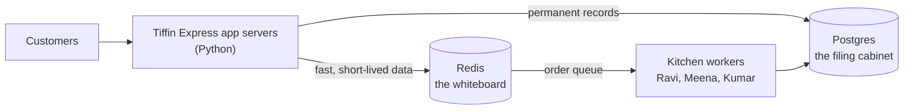

**What Tiffin Express keeps in Redis**

| Need | Redis feature | Section |
|---|---|---|
| Show the menu fast | Cache | [7](#7-caching) |
| Remember who is logged in | Sessions | [8](#8-login-sessions) |
| One-time passwords that expire | TTL | [6](#6-ttl-keys-that-delete-themselves) |
| Stop someone trying 1,000 passwords | Rate limiting | [9](#9-rate-limiting) |
| Never charge a customer twice | Idempotency keys | [11](#11-idempotency-the-double-click-problem) |
| "Top 10 dishes this week" | Sorted set | [12](#12-leaderboards-and-counters) |
| Send orders to the kitchen reliably | Streams | [19](#19-streams-the-kitchen-order-rail) |
| "Your order is ready" pop-up | Pub/Sub | [18](#18-pubsub-the-loudspeaker) |

**What Redis is not good at:** complex searches with joins (use SQL), data much bigger than your RAM budget, and being the *only* copy of important data unless you set up saving to disk and copies ([Part 5](#part-5--running-redis-for-real)).

---

## 2. Setup and connecting

### Start Redis and install the Python client

```bash
docker run -d --name redis -p 6379:6379 redis:7
pip install "redis>=5"
```

### Connect

This is the setup every example in the guide uses (run it first, then any chapter):

```python
import asyncio
import json
import random
import threading
import time
import uuid

import redis

r = redis.Redis(host="localhost", port=6379, decode_responses=True)
print("connected:", r.ping())

r.set("hello", "world")
print(r.get("hello"))
```

Output:

```text
connected: True
world
```

`decode_responses=True` gives you normal Python strings. Without it you get bytes:

```python
raw = redis.Redis(host="localhost", port=6379)          # no decode_responses
print(raw.get("hello"))
```

Output:

```text
b'world'
```

Keep the bytes mode only for binary data, such as images or AI embeddings.

### Use one connection pool

**Picture:** opening a new connection is like dialling a new phone call for every question. A **pool** keeps a few phone lines open and reuses them.

```python
pool = redis.ConnectionPool.from_url(
    "redis://localhost:6379/0",
    decode_responses=True,
    max_connections=50,        # most lines this process may open
    socket_connect_timeout=2,  # give up quickly if Redis is down
    socket_timeout=10,         # must be longer than any BLOCK wait you use (see Streams)
)
r = redis.Redis(connection_pool=pool)   # create once at startup, reuse everywhere
print(r.ping())
```

Output:

```text
True
```

### Retry when the network blinks

```python
from redis.backoff import ExponentialBackoff
from redis.exceptions import ConnectionError, TimeoutError
from redis.retry import Retry

safe_r = redis.Redis(
    host="localhost", port=6379, decode_responses=True,
    retry=Retry(ExponentialBackoff(cap=2, base=0.1), retries=3),
    retry_on_error=[ConnectionError, TimeoutError],
)
print(safe_r.ping())
```

Output:

```text
True
```

Retrying `GET` is always safe. Retrying `INCR` or `XADD` can run it twice if the first try worked but the reply got lost.

### Async version (FastAPI and friends)

```python
import asyncio
import redis.asyncio as aioredis

async def main():
    ar = aioredis.Redis(host="localhost", port=6379, decode_responses=True)
    await ar.set("greeting", "vanakkam")
    print(await ar.get("greeting"))
    await ar.aclose()                 # close when the app shuts down

asyncio.run(main())
```

Output:

```text
vanakkam
```

Every method has the same name in the async client; you just `await` it.

---

## 3. What redis-py gives back

Before the data types, it helps to know what Python values come back.

```python
print(r.set("name", "Asha"))                   # Redis said OK
print(r.get("name"))                           # text
print(r.get("no-such-key"))                    # nothing there
print(r.incr("visits"))                        # a number
r.rpush("queue", "a", "b")
print(r.lrange("queue", 0, -1))                # a list
r.hset("user:1", mapping={"name": "Asha", "credits": 10})
print(r.hgetall("user:1"))                     # a dict
r.sadd("tags", "veg", "spicy")
print(r.smembers("tags"))                      # a set (order varies)
r.zadd("scores", {"asha": 90, "ravi": 80})
print(r.zrevrange("scores", 0, -1, withscores=True))   # list of (member, score)
print(r.exists("name"), r.exists("no-such-key"))       # 1 = yes, 0 = no
```

Output:

```text
True
Asha
None
1
['a', 'b']
{'name': 'Asha', 'credits': '10'}
{'spicy', 'veg'}
[('asha', 90.0), ('ravi', 80.0)]
1 0
```

| Redis replies | Python gets |
|---|---|
| OK | `True` |
| nothing | `None` |
| a number | `int` |
| text | `str` (with `decode_responses=True`) |
| a list | `list` |
| a hash | `dict` |
| a set | `set` |
| scores | `float` |

> **Remember:** numbers you **stored** come back as text. `r.hgetall("user:1")` gives `{'credits': '10'}`, so convert with `int(...)` yourself.

---

## 4. Naming your keys

Redis has no tables. Every value lives under a **key name**, so your key names are your structure. Think of them as **folder paths**.

```
app:thing:id:detail

user:1               -> Asha's profile
user:1:cart          -> Asha's cart
session:9f3a...      -> one login session
cache:menu:v2        -> cached menu (version 2 of the format)
rl:login:asha        -> Asha's login-attempt counter
orders               -> the order stream
```

A tiny helper keeps names consistent across your codebase:

```python
def key(*parts) -> str:
    return ":".join(str(p) for p in parts)

print(key("user", 1, "cart"))
print(key("cache", "v2", "product", 1001))
```

Output:

```text
user:1:cart
cache:v2:product:1001
```

Simple rules:

- Use `:` between parts. Tools like RedisInsight show keys as folders this way.
- Short but readable. Millions of keys × long names = wasted memory.
- Put a **version** in cache keys (`cache:v2:...`). When the data format changes, switch to `v3` and the old entries are simply ignored.
- Never put raw user input in a key without checking it first.

---

## 5. The data types

Choosing the right type is half of Redis.

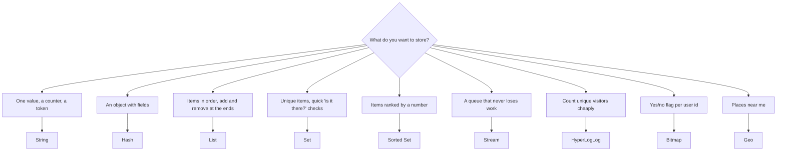

### 5.1 String — one value under one name

**Picture:** a sticky note with a label.

```python
r.set("greeting", "Welcome to Tiffin Express")
print(r.get("greeting"))

# incr adds 1. It is safe even if 1,000 users do it at the same moment.
print(r.incr("page:views"))
print(r.incr("page:views"))
print(r.incrby("wallet:asha", 50))

# nx=True: only set it if it does not exist yet
print("asha claims coupon:", r.set("coupon:FIRST50", "asha", nx=True))
print("ravi claims coupon:", r.set("coupon:FIRST50", "ravi", nx=True))
print("coupon owner:", r.get("coupon:FIRST50"))

# several at once
r.mset({"price:dosa": 80, "price:idli": 40})
print(r.mget("price:dosa", "price:idli", "price:vada"))
```

Output:

```text
Welcome to Tiffin Express
1
2
50
asha claims coupon: True
ravi claims coupon: None
coupon owner: asha
['80', '40', None]
```

The coupon could be claimed only once: Ravi's `set(..., nx=True)` returned `None`, so Asha keeps it.

### 5.2 Hash — a small object with fields

**Picture:** one filled-in form, with field names and values.

```python
r.hset("user:1", mapping={"name": "Asha", "city": "Chennai", "plan": "free", "credits": 10})
print(r.hget("user:1", "name"))
print(r.hgetall("user:1"))

print(r.hincrby("user:1", "credits", -1))      # use one credit
r.hset("user:1", "plan", "pro")                # change one field
print(r.hmget("user:1", ["name", "plan", "credits"]))

user = r.hgetall("user:1")
credits = int(user["credits"])                  # stored numbers come back as text
print(type(user["credits"]), credits + 1)
```

Output:

```text
Asha
{'name': 'Asha', 'city': 'Chennai', 'plan': 'free', 'credits': '10'}
9
['Asha', 'pro', '9']
<class 'str'> 10
```

### 5.3 List — items in a line

**Picture:** people standing in a queue. You can join at either end and leave from either end.

```python
# Asha's recently viewed dishes, newest first
for dish in ["idli", "dosa", "vada"]:
    r.lpush("recent:asha", dish)
print(r.lrange("recent:asha", 0, -1))

r.ltrim("recent:asha", 0, 1)                    # keep only the newest 2
print(r.lrange("recent:asha", 0, -1))

# a simple job queue: add at the right, take from the left
r.rpush("jobs", "send-email", "send-sms")
print(r.lpop("jobs"))
print(r.llen("jobs"))

# blpop waits for a job (here up to 1 second)
print(r.blpop("jobs", timeout=1))               # (list name, value)
print(r.blpop("jobs", timeout=1))               # nothing left -> None after 1 s
```

Output:

```text
['vada', 'dosa', 'idli']
['vada', 'dosa']
send-email
1
('jobs', 'send-sms')
None
```

> **Remember:** once a job is popped from a list, it is gone. If the worker crashes before finishing, the job is lost. For work that must never be lost, use [Streams](#19-streams-the-kitchen-order-rail).

### 5.4 Set — unique items, no order

**Picture:** a guest list. Writing a name twice doesn't add it twice.

```python
print(r.sadd("dish:dosa:likes", "asha", "ravi", "meena"))   # 3 added
print(r.sadd("dish:dosa:likes", "asha"))                    # 0: already there
print(r.sismember("dish:dosa:likes", "ravi"))
print(r.scard("dish:dosa:likes"))

# dishes both Asha and Ravi like
r.sadd("likes:asha", "dosa", "idli", "vada")
r.sadd("likes:ravi", "dosa", "pongal", "vada")
print(sorted(r.sinter("likes:asha", "likes:ravi")))
```

Output:

```text
3
0
1
3
['dosa', 'vada']
```

### 5.5 Sorted set — unique items ranked by a score

**Picture:** a cricket scoreboard. Every player has a score and the board is always in order.

```python
r.zadd("top:dishes", {"dosa": 120, "idli": 95, "vada": 60})
print(r.zincrby("top:dishes", 50, "dosa"))                  # 50 more dosas sold

print(r.zrevrange("top:dishes", 0, 2, withscores=True))     # highest first
print("idli position:", r.zrevrank("top:dishes", "idli"))   # 0 = first place
print("vada score:", r.zscore("top:dishes", "vada"))
print("sold 90 or more:", r.zrangebyscore("top:dishes", 90, "+inf"))
```

Output:

```text
170.0
[('dosa', 170.0), ('idli', 95.0), ('vada', 60.0)]
idli position: 1
vada score: 60.0
sold 90 or more: ['idli', 'dosa']
```

Sorted sets are used for leaderboards, priority queues, rate limits and scheduled jobs (score = time).

### 5.6 HyperLogLog — count unique things with tiny memory

**Picture:** a clicker at a gate that counts *different* people, not total entries. It is slightly approximate (about 1% error) but uses only about 12 KB, even for millions of people.

```python
r.pfadd("visitors:today", "asha", "ravi", "asha", "meena", "asha")
print(r.pfcount("visitors:today"))
```

Output:

```text
3
```

### 5.7 Bitmap — one yes/no bit per user id

**Picture:** a long row of light switches, one per user. On = active today.

```python
r.setbit("active:today", 7, 1)        # user 7 was active
r.setbit("active:today", 12, 1)       # user 12 was active
print(r.getbit("active:today", 7), r.getbit("active:today", 8))
print("active users:", r.bitcount("active:today"))
```

Output:

```text
1 0
active users: 2
```

One million users = one million bits ≈ 125 KB.

### 5.8 Geo — places near me

```python
r.geoadd("kitchens", [80.2707, 13.0827, "chennai-central",
                      80.2209, 13.0475, "chennai-tnagar",
                      77.5946, 12.9716, "bengaluru-mg"])

# kitchens within 10 km of a customer, nearest first
nearby = r.geosearch("kitchens", longitude=80.25, latitude=13.06,
                     radius=10, unit="km", withdist=True, sort="ASC")
for name, km in nearby:
    print(f"{name}: {km} km")
```

Output:

```text
chennai-central: 3.3773 km
chennai-tnagar: 3.446 km
```

### 5.9 Stream — a queue that never loses work

The most powerful type, with its own big chapter: [Streams](#19-streams-the-kitchen-order-rail).

### 5.10 JSON, search and vectors

Redis 8 includes JSON documents, search indexes and vector search (on Redis 7 these come from "Redis Stack"). Vector search is used for AI features ([section 26](#26-redis-in-ai-apps)).

### 5.11 Which commands are fast?

| Always fast (size doesn't matter) | Gets slower as the key grows |
|---|---|
| `get`, `set`, `incr`, `hget`, `hset`, `sadd`, `sismember`, `lpush`, `lpop`, `xadd` | `hgetall`, `smembers`, `lrange(0, -1)`, `keys("*")`, `delete` of a huge key |
| `zadd`, `zrank`, `zincrby` (fast, grows very slowly) | |

The right column is fine on small keys. On a key with millions of items it can freeze Redis for everyone ([section 14](#14-one-cashier-how-redis-runs-commands)).

---

## 6. TTL: keys that delete themselves

**In one line:** any key can have a **time-to-live**. When it runs out, Redis deletes the key.

**Picture:** milk with an expiry date.

```python
r.set("otp:asha", "482913", ex=60)        # expires in 60 seconds
print("otp ttl:", r.ttl("otp:asha"))

r.set("menu:title", "Tiffin Express")     # no expiry
print("menu ttl:", r.ttl("menu:title"))
print("missing ttl:", r.ttl("nothing:here"))

# Careful: a plain set() REMOVES the expiry!
r.set("otp:asha", "111111")
print("after plain set:", r.ttl("otp:asha"))

# keepttl=True changes the value but keeps the expiry
r.set("otp:asha", "222222", ex=60)
r.set("otp:asha", "333333", keepttl=True)
print("after keepttl:", r.ttl("otp:asha"))

r.expire("menu:title", 120)               # add an expiry to an existing key
print("menu ttl now:", r.ttl("menu:title"))

r.set("flash", "gone soon", px=300)       # milliseconds
time.sleep(0.4)
print("flash after 0.4 s:", r.get("flash"))
```

Output:

```text
otp ttl: 60
menu ttl: -1
missing ttl: -2
after plain set: -1
after keepttl: 60
menu ttl now: 120
flash after 0.4 s: None
```

What `ttl` returns: a positive number = seconds left, `-1` = never expires, `-2` = the key doesn't exist.

Other handy options:

```python
r.set("counter", 0)
print(r.expire("counter", 60, nx=True))   # only if it has no TTL yet -> True
print(r.expire("counter", 10, nx=True))   # it has one now -> False
print(r.persist("counter"), r.ttl("counter"))   # remove the TTL
```

Output:

```text
True
False
True -1
```

**Always give these a TTL:** cache entries, sessions, OTPs, rate-limit counters, locks, idempotency keys.

How Redis cleans up expired keys:

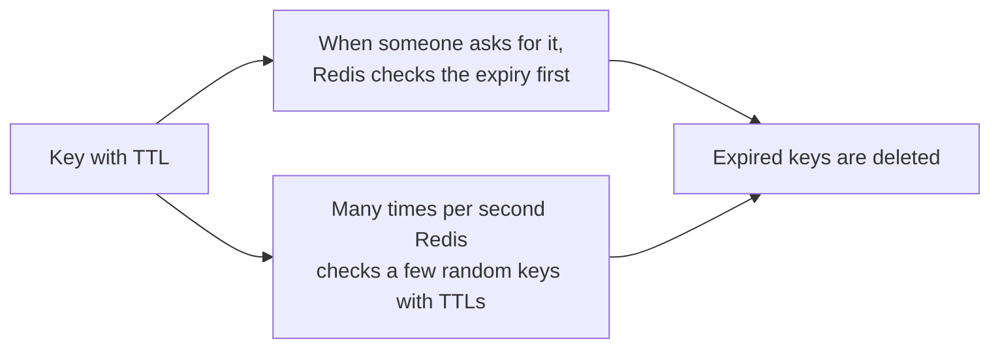

You will never *read* an expired key, but its memory may be freed a moment later than the exact expiry time.

---

# Part 2 — Everyday product patterns

## 7. Caching

**Problem:** every time someone opens the menu, the app runs a slow database query. With 10,000 visitors, that's 10,000 slow queries for the same menu.

**Picture:** the first time someone asks "what's today's special?", the cashier walks to the back room and checks. Then they **write the answer on the whiteboard**. Everyone after that just reads the whiteboard. At the end of the day the whiteboard is wiped (TTL).

### 7.1 Cache-aside: the pattern you will use 90% of the time

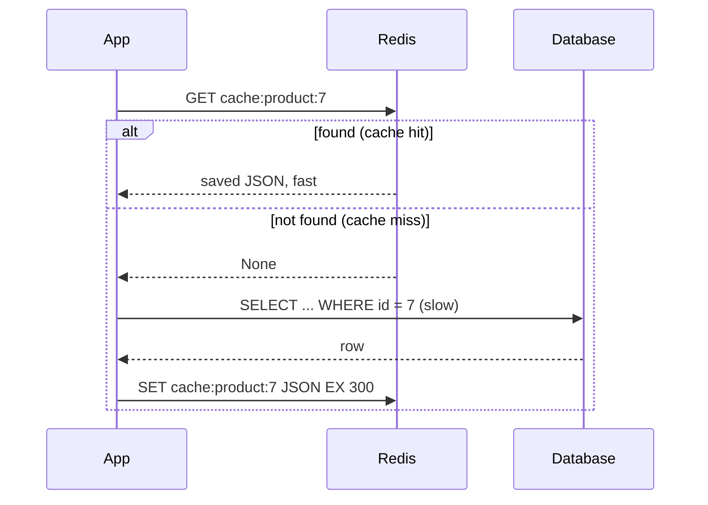

In these examples a tiny fake database stands in for Postgres. It sleeps 200 ms to act slow.

```python
class FakeDB:
    """Pretend database: every query takes 200 ms."""
    def __init__(self):
        self.products = {7: {"id": 7, "name": "Masala Dosa", "price": 80}}

    def query_product(self, product_id):
        time.sleep(0.2)
        return self.products.get(product_id)

    def update_product(self, product_id, data):
        time.sleep(0.2)
        self.products[product_id].update(data)

db = FakeDB()
```

```python
def get_product(product_id: int) -> dict | None:
    key = f"cache:product:{product_id}"
    saved = r.get(key)
    if saved is not None:                         # 1. hit: fast path
        return json.loads(saved)
    product = db.query_product(product_id)        # 2. miss: ask the database
    r.set(key, json.dumps(product), ex=300)       # 3. save for 5 minutes
    return product

for attempt in range(1, 4):
    start = time.perf_counter()
    product = get_product(7)
    ms = (time.perf_counter() - start) * 1000
    print(f"call {attempt}: {product['name']} in {ms:.1f} ms")
```

Output:

```text
call 1: Masala Dosa in 200.8 ms
call 2: Masala Dosa in 0.2 ms
call 3: Masala Dosa in 0.2 ms
```

The first call paid for the slow query. The next calls came straight from Redis.

### 7.2 A reusable decorator

Put `@cached(...)` on any slow function. The random "jitter" makes keys expire at slightly different times, so they don't all run out together.

```python
import functools

def cached(prefix: str, ttl: int = 300, jitter: float = 0.1):
    def decorator(fn):
        @functools.wraps(fn)
        def wrapper(*args):
            key = f"cache:{prefix}:" + ":".join(map(str, args))
            saved = r.get(key)
            if saved is not None:
                return json.loads(saved)
            value = fn(*args)
            real_ttl = int(ttl * random.uniform(1 - jitter, 1 + jitter))  # 270..330 s
            r.set(key, json.dumps(value), ex=real_ttl)
            return value
        return wrapper
    return decorator

@cached("menu", ttl=300)
def get_menu(kitchen_id: int) -> list:
    time.sleep(0.2)                                # imagine a slow query
    return [{"dish": "dosa", "price": 80}, {"dish": "idli", "price": 40}]

print(get_menu(1))
print("cached for", r.ttl("cache:menu:1"), "seconds")
```

Output:

```text
[{'dish': 'dosa', 'price': 80}, {'dish': 'idli', 'price': 40}]
cached for 292 seconds
```

`None` is saved as the JSON text `"null"`, so "not found" answers are cached too. This is called **negative caching**: it stops the database being asked again and again for something that doesn't exist.

```python
print(get_product(999))                    # not in the database
print(repr(r.get("cache:product:999")))    # the "not found" answer is cached
```

Output:

```text
None
'null'
```

### 7.3 When the data changes

**Rule:** after you update the database, **delete** the cache key. The next reader loads the fresh value.

```python
def update_product(product_id: int, data: dict) -> None:
    db.update_product(product_id, data)           # 1. update the real record first
    r.delete(f"cache:product:{product_id}")       # 2. then remove the old copy

print("before:", get_product(7)["price"])
update_product(7, {"price": 90})
print("after: ", get_product(7)["price"])
```

Output:

```text
before: 80
after:  90
```

Simple rules for fresh data:

1. **Delete, don't update** the cached value.
2. Delete **after** the database update has finished (committed), not before. Otherwise another request may put the old value back.
3. **Always keep a TTL**, so even a forgotten delete fixes itself.
4. When the data *format* changes, change the key version: `cache:v2:product:7` → `cache:v3:product:7`.

### 7.4 Other ways to cache

| Strategy | In simple words | Good for | Watch out |
|---|---|---|---|
| **Cache-aside** | Look in cache, else load and save | Most read-heavy data | Old data until delete or TTL |
| **Write-through** | Every write goes to DB and cache together | Data read right after it's written | Slower writes |
| **Write-behind** | Write to cache now, a worker saves to DB later | Very frequent counters (likes, views) | Data lost if Redis dies first |
| **Refresh-ahead** | Refresh popular keys before they expire | A few very hot keys | Wasted work on keys nobody reads |

### 7.5 Cache stampede

**Picture:** the whiteboard is wiped at 1:00 pm and 500 people ask for the special at 1:00:01. All 500 run to the back room at once and the back room collapses.

**Fix:** let **one** person go to the back room. Everyone else waits a moment and reads the whiteboard.

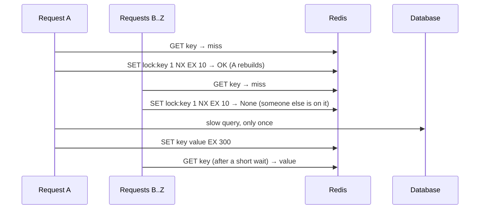

This example fires 20 requests at the same moment with threads, and counts how many reach the database:

```python
import threading

db_calls = 0

def load_special():
    global db_calls
    db_calls += 1
    time.sleep(0.3)                                   # slow query
    return {"special": "ghee roast"}

def get_with_rebuild_lock(key: str, loader, ttl: int = 300):
    saved = r.get(key)
    if saved is not None:
        return json.loads(saved)

    if r.set(f"lock:{key}", "1", nx=True, ex=10):     # I am the one who rebuilds
        try:
            value = loader()
            r.set(key, json.dumps(value), ex=ttl)
            return value
        finally:
            r.delete(f"lock:{key}")

    for _ in range(50):                                # others: wait up to ~5 s
        time.sleep(0.1)
        saved = r.get(key)
        if saved is not None:
            return json.loads(saved)
    return loader()                                    # last resort

results = []
threads = [threading.Thread(target=lambda: results.append(get_with_rebuild_lock("cache:special", load_special)))
           for _ in range(20)]
for t in threads:
    t.start()
for t in threads:
    t.join()
print(f"{len(results)} requests answered, database called {db_calls} time(s)")
```

Output:

```text
20 requests answered, database called 1 time(s)
```

### 7.6 What to store in the cache

- JSON is easy to read. `orjson` or `msgpack` are faster and smaller.
- Don't use `pickle` for data other services can write: loading a pickle can run code.
- Compress values bigger than a few KB.
- Many small keys are better than one giant key that every request rewrites.

---

## 8. Login sessions

**Picture:** a cloakroom token. You get a random token at the door, and any staff member can look up your coat with it.

After login, the app creates a random session id, stores the user's details under it in Redis, and sends the id to the browser as a cookie. Any app server can read it, so it doesn't matter which server handles the next request.

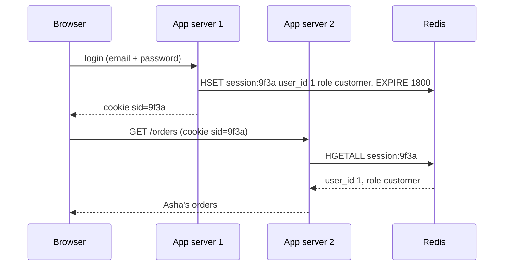

```python
import secrets

SESSION_TTL = 1800    # 30 minutes without activity

def create_session(user_id: int, role: str) -> str:
    sid = secrets.token_urlsafe(32)              # long random id, impossible to guess
    pipe = r.pipeline()
    pipe.hset(f"session:{sid}", mapping={"user_id": user_id, "role": role})
    pipe.expire(f"session:{sid}", SESSION_TTL)
    pipe.sadd(f"user:{user_id}:sessions", sid)   # list of this user's devices
    pipe.execute()
    return sid                                   # send as an HttpOnly, Secure cookie

def load_session(sid: str) -> dict | None:
    pipe = r.pipeline()
    pipe.hgetall(f"session:{sid}")
    pipe.expire(f"session:{sid}", SESSION_TTL)   # active users stay logged in
    data, _ = pipe.execute()
    return data or None

def logout(sid: str) -> None:
    r.delete(f"session:{sid}")

def logout_everywhere(user_id: int) -> None:
    for sid in r.smembers(f"user:{user_id}:sessions"):
        r.delete(f"session:{sid}")
    r.delete(f"user:{user_id}:sessions")

phone = create_session(1, "customer")
laptop = create_session(1, "customer")
print("phone session :", load_session(phone))
logout(phone)
print("after logout  :", load_session(phone))
print("laptop session:", load_session(laptop))
logout_everywhere(1)
print("after logout everywhere:", load_session(laptop))
```

Output:

```text
phone session : {'user_id': '1', 'role': 'customer'}
after logout  : None
laptop session: {'user_id': '1', 'role': 'customer'}
after logout everywhere: None
```

---

## 9. Rate limiting

**Problem:** someone tries 1,000 passwords per minute on Asha's account, or a script hammers your API.

**Picture:** a bouncer with a clicker who lets in at most N people per minute.

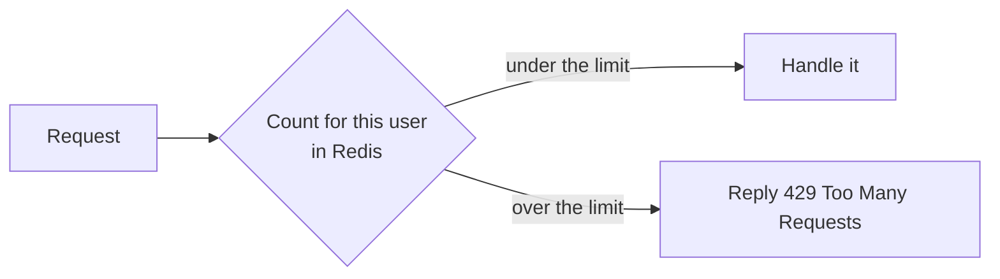

### 9.1 Fixed window: "max 3 per minute"

One counter per user per minute. The counter deletes itself after the minute.

```python
def allow_fixed_window(user: str, limit: int = 3, window: int = 60) -> bool:
    key = f"rl:fixed:{user}:{int(time.time() // window)}"   # a new key every minute
    pipe = r.pipeline()
    pipe.incr(key)
    pipe.expire(key, window, nx=True)     # set the expiry on the first request only
    count, _ = pipe.execute()
    print(f"  attempt {count} -> {'allowed' if count <= limit else 'BLOCKED'}")
    return count <= limit

for _ in range(5):
    allow_fixed_window("asha")
```

Output:

```text
  attempt 1 -> allowed
  attempt 2 -> allowed
  attempt 3 -> allowed
  attempt 4 -> BLOCKED
  attempt 5 -> BLOCKED
```

The weakness: someone can send 3 requests at 0:59 and 3 more at 1:00, which is 6 in two seconds.

### 9.2 Sliding window: "max 3 in any N seconds"

Store the time of each request in a sorted set. Before allowing a new one, remove the old ones and count what's left. A Lua script ([section 17](#17-lua-scripts-small-programs-inside-redis)) does it all in one safe step.

```python
SLIDING_WINDOW = r.register_script("""
local now    = tonumber(ARGV[1])
local window = tonumber(ARGV[2])
local limit  = tonumber(ARGV[3])
redis.call('ZREMRANGEBYSCORE', KEYS[1], 0, now - window)   -- forget old requests
if redis.call('ZCARD', KEYS[1]) < limit then
  redis.call('ZADD', KEYS[1], now, ARGV[4])                -- remember this one
  redis.call('PEXPIRE', KEYS[1], window)
  return 1
end
return 0
""")

def allow_sliding_window(user: str, limit: int = 3, window_ms: int = 60_000) -> bool:
    now = int(time.time() * 1000)
    request_id = f"{now}-{uuid.uuid4().hex[:8]}"
    return SLIDING_WINDOW(keys=[f"rl:slide:{user}"], args=[now, window_ms, limit, request_id]) == 1

# limit: 3 requests in any 1 second
print([allow_sliding_window("ravi", limit=3, window_ms=1000) for _ in range(4)])
time.sleep(1.1)
print("1.1 s later:", allow_sliding_window("ravi", limit=3, window_ms=1000))
```

Output:

```text
[True, True, True, False]
1.1 s later: True
```

### 9.3 Token bucket: "bursts are OK, but a steady average"

**Picture:** a jar that holds 5 tokens and gets 1 new token every second. Each request takes a token. If the jar is empty, wait.

```python
TOKEN_BUCKET = r.register_script("""
local capacity = tonumber(ARGV[1])
local rate     = tonumber(ARGV[2])
local cost     = tonumber(ARGV[3])
local t   = redis.call('TIME')
local now = tonumber(t[1]) * 1000 + math.floor(tonumber(t[2]) / 1000)
local data   = redis.call('HMGET', KEYS[1], 'tokens', 'ts')
local tokens = tonumber(data[1]) or capacity
local ts     = tonumber(data[2]) or now
tokens = math.min(capacity, tokens + (now - ts) / 1000 * rate)   -- refill
local allowed = 0
if tokens >= cost then
  tokens = tokens - cost
  allowed = 1
end
redis.call('HSET', KEYS[1], 'tokens', tokens, 'ts', now)
redis.call('PEXPIRE', KEYS[1], math.ceil(capacity / rate * 1000) + 1000)
return allowed
""")

def allow_token_bucket(key: str, capacity: int = 5, per_sec: float = 1.0, cost: int = 1) -> bool:
    return TOKEN_BUCKET(keys=[f"rl:bucket:{key}"], args=[capacity, per_sec, cost]) == 1

print("burst of 6:", [allow_token_bucket("api:meena") for _ in range(6)])
time.sleep(1.05)
print("1 s later :", allow_token_bucket("api:meena"))
```

Output:

```text
burst of 6: [True, True, True, True, True, False]
1 s later : True
```

`cost` lets you charge more for expensive calls (or charge by AI tokens, [section 26](#26-redis-in-ai-apps)).

| Method | Memory | Burst problem | When to use |
|---|---|---|---|
| Fixed window | 1 counter | Yes, at the minute edge | Simple limits, login attempts |
| Sliding window | 1 entry per request | No | Exact limits, small numbers |
| Token bucket | 2 fields | Allows controlled bursts | APIs, paid plans, AI calls |

---

## 10. Locks: one worker at a time

**Problem:** you run 3 copies of your app. The "send daily report" job must run **once**, not three times.

**Picture:** the key to the store room hangs on a hook. Whoever takes it goes in. Others wait until it's back. And the key **returns to the hook by itself** after 30 seconds, in case the person who took it faints inside.

```python
print("worker-1:", r.set("lock:daily-report", "worker-1", nx=True, ex=30))
print("worker-2:", r.set("lock:daily-report", "worker-2", nx=True, ex=30))
print("held by :", r.get("lock:daily-report"))
print("expires in:", r.ttl("lock:daily-report"), "s")
```

Output:

```text
worker-1: True
worker-2: None
held by : worker-1
expires in: 30 s
```

- `nx=True` = only if nobody holds it. Worker-2 got `None`, so it must wait.
- `ex=30` = the lock disappears after 30 seconds if worker-1 crashes.
- The value (`worker-1`) says **who** holds the lock.

### Why "who holds it" matters

If you release with a plain `delete`, this can happen:

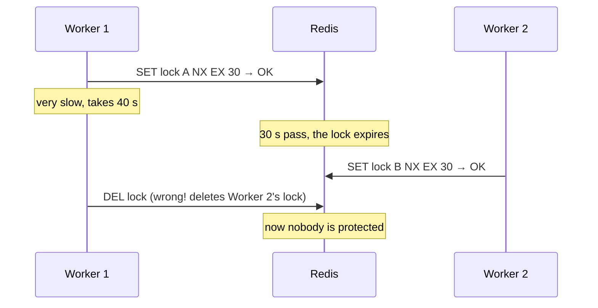

So release the lock **only if it still has your value**. That check-and-delete must be one step, so it's a tiny Lua script.

```python
RELEASE = r.register_script("""
if redis.call('GET', KEYS[1]) == ARGV[1] then
  return redis.call('DEL', KEYS[1])
end
return 0
""")

EXTEND = r.register_script("""
if redis.call('GET', KEYS[1]) == ARGV[1] then
  return redis.call('PEXPIRE', KEYS[1], ARGV[2])
end
return 0
""")

class RedisLock:
    def __init__(self, client, name: str, ttl_ms: int = 30_000):
        self.r, self.key, self.ttl_ms = client, f"lock:{name}", ttl_ms
        self.token = uuid.uuid4().hex                  # my private value

    def acquire(self, wait_s: float = 5.0) -> bool:
        deadline = time.monotonic() + wait_s
        while True:
            if self.r.set(self.key, self.token, nx=True, px=self.ttl_ms):
                return True
            if time.monotonic() >= deadline:           # waited long enough
                return False
            time.sleep(0.05 + random.random() * 0.05)  # try again soon

    def extend(self) -> bool:                          # for long jobs: "I'm still working"
        return EXTEND(keys=[self.key], args=[self.token, self.ttl_ms]) == 1

    def release(self) -> bool:
        return RELEASE(keys=[self.key], args=[self.token]) == 1

    def __enter__(self):
        if not self.acquire():
            raise TimeoutError(f"could not get {self.key}")
        return self

    def __exit__(self, *exc):
        self.release()

a = RedisLock(r, "payout:asha")
b = RedisLock(r, "payout:asha")
print("a acquires:", a.acquire())
print("b acquires:", b.acquire(wait_s=0.2))
print("b releases a's lock?", b.release())
print("a releases:", a.release())
print("now b acquires:", b.acquire(wait_s=0.2))
b.release()
```

Output:

```text
a acquires: True
b acquires: False
b releases a's lock? False
a releases: True
now b acquires: True
```

Three threads all trying to run the same job, with the lock:

```python
def daily_report(worker: str) -> None:
    lock = RedisLock(r, "daily-report-job", ttl_ms=5_000)
    if lock.acquire(wait_s=0):                 # don't wait: someone else is doing it
        try:
            print(f"{worker}: sending the report")
            time.sleep(0.3)
        finally:
            lock.release()
    else:
        print(f"{worker}: skipped, another worker has it")

workers = [threading.Thread(target=daily_report, args=(f"worker-{i}",)) for i in range(1, 4)]
for w in workers:
    w.start()
for w in workers:
    w.join()
```

Output:

```text
worker-1: sending the report
worker-2: skipped, another worker has it
worker-3: skipped, another worker has it
```

redis-py also has a ready-made lock that follows the same rules:

```python
with r.lock("daily-report", timeout=30, blocking_timeout=5):
    print("inside the built-in lock")
```

Output:

```text
inside the built-in lock
```

> **Remember:** a Redis lock is "good enough" for avoiding duplicate work. For money and stock, also protect the data itself (database unique constraints, or a version number checked on write), because a very slow worker can still outlive its lock.

---

## 11. Idempotency: the double-click problem

**Problem:** Asha taps "Pay ₹250". The network is slow, so she taps again. Or her phone retries automatically. Without protection she pays twice.

**Fix:** the app sends a unique **idempotency key** with the payment (made once when the checkout screen opens). The server does the work only the **first** time it sees that key.

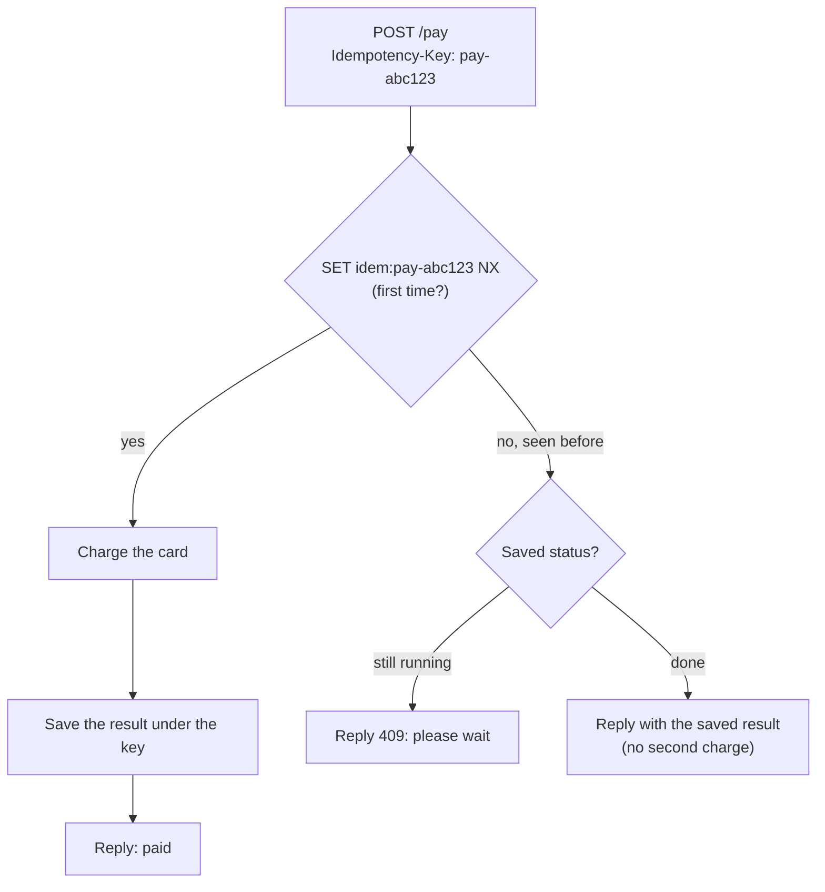

```python
def run_once(idem_key: str, work, ttl: int = 86_400):
    key = f"idem:{idem_key}"
    if r.set(key, json.dumps({"status": "running"}), nx=True, ex=ttl):
        try:
            result = work()
        except Exception:
            r.delete(key)              # failed: allow a retry
            raise
        r.set(key, json.dumps({"status": "done", "result": result}), ex=ttl)
        return result

    saved = json.loads(r.get(key) or '{"status": "running"}')
    if saved["status"] == "running":
        return {"error": "already in progress, try again in a moment"}
    return saved["result"]             # same answer as the first time

charges = []
def charge_card():
    charges.append(250)
    return {"paid": 250, "receipt": "R-1001"}

print("tap 1:", run_once("pay-abc123", charge_card))
print("tap 2:", run_once("pay-abc123", charge_card))
print("tap 3:", run_once("pay-abc123", charge_card))
print("times charged:", len(charges))
```

Output:

```text
tap 1: {'paid': 250, 'receipt': 'R-1001'}
tap 2: {'paid': 250, 'receipt': 'R-1001'}
tap 3: {'paid': 250, 'receipt': 'R-1001'}
times charged: 1
```

The same idea stops a queue worker from doing the same job twice ([19.6](#196-can-work-happen-twice-and-how-to-stop-it)).

---

## 12. Leaderboards and counters

```python
# Top dishes this week
week = "top:dishes:2026-w41"
for dish, sold in {"dosa": 12, "idli": 30, "vada": 10, "pongal": 7, "upma": 4, "poori": 2}.items():
    r.zincrby(week, sold, dish)
print("top 3:", r.zrevrange(week, 0, 2, withscores=True))

# "upma is 5th; show 3rd to 7th"
rank = r.zrevrank(week, "upma")
print("upma rank:", rank + 1)
print("around upma:", r.zrevrange(week, max(rank - 2, 0), rank + 2, withscores=True))
```

Output:

```text
top 3: [('idli', 30.0), ('dosa', 12.0), ('vada', 10.0)]
upma rank: 5
around upma: [('vada', 10.0), ('pongal', 7.0), ('upma', 4.0), ('poori', 2.0)]
```

```python
# Orders per hour; each hour's counter deletes itself after 7 days
hour_key = f"stats:orders:{time.strftime('%Y%m%d%H')}"
pipe = r.pipeline()
pipe.incr(hour_key)
pipe.expire(hour_key, 7 * 86_400)
pipe.execute()
print(hour_key, "=", r.get(hour_key))

# Unique visitors per day, and for the whole week
r.pfadd("uv:mon", "asha", "ravi")
r.pfadd("uv:tue", "asha", "meena")
r.pfmerge("uv:week", "uv:mon", "uv:tue")
print("unique visitors this week:", r.pfcount("uv:week"))

# Did user 123456 open the app today?
r.setbit("active:2026-10-08", 123456, 1)
print("user 123456 active:", r.getbit("active:2026-10-08", 123456))
```

Output:

```text
stats:orders:2026100804 = 1
unique visitors this week: 3
user 123456 active: 1
```

---

## 13. Delayed jobs: "do this later"

**Problem:** "Send Asha a feedback request 1 hour after delivery." Lists and streams have no "run later" option.

**Picture:** a tray of reminder cards **sorted by time**. Every second, someone takes out the cards whose time has come and puts them in the kitchen queue.

A sorted set does this: the **score is the time** the job should run.

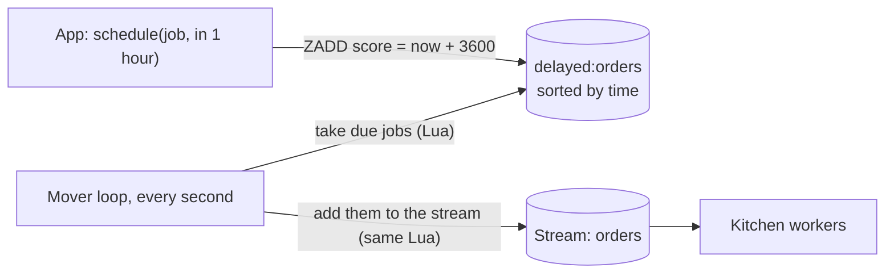

```python
MOVE_DUE = r.register_script("""
local due = redis.call('ZRANGEBYSCORE', KEYS[1], '-inf', ARGV[1], 'LIMIT', 0, ARGV[2])
for _, job in ipairs(due) do
  redis.call('XADD', KEYS[2], '*', 'data', job)
  redis.call('ZREM', KEYS[1], job)
end
return #due
""")

def schedule(job: dict, delay_s: float) -> None:
    # every job needs its own event_id, because sorted-set members are unique
    r.zadd("delayed:orders", {json.dumps(job, sort_keys=True): time.time() + delay_s})

def move_due_jobs() -> int:
    return MOVE_DUE(keys=["delayed:orders", "orders"], args=[time.time(), 100])

schedule({"event_id": "evt-1", "type": "feedback_request", "user": "asha"}, delay_s=0.5)
schedule({"event_id": "evt-2", "type": "feedback_request", "user": "ravi"}, delay_s=3600)

print("moved now        :", move_due_jobs())
time.sleep(0.6)
print("moved 0.6 s later:", move_due_jobs())
print("still waiting    :", r.zcard("delayed:orders"))
print("now in the stream:", [json.loads(f["data"])["user"] for _, f in r.xrange("orders")])
```

Output:

```text
moved now        : 0
moved 0.6 s later: 1
still waiting    : 1
now in the stream: ['asha']
```

The mover runs forever in its own small process:

```python
def mover_loop() -> None:
    while True:
        if not move_due_jobs():
            time.sleep(1)
```

Because "take from the tray" and "add to the stream" happen in one Lua script, a job can never be lost or moved twice in between. The same trick gives you **retries with growing wait times** ([19.10](#1910-retry-later-with-growing-waits)).

---

# Part 3 — Safe and fast

## 14. One cashier: how Redis runs commands

**Picture:** a shop with **one very fast cashier**. Customers line up and the cashier serves them one at a time, finishing each before starting the next.

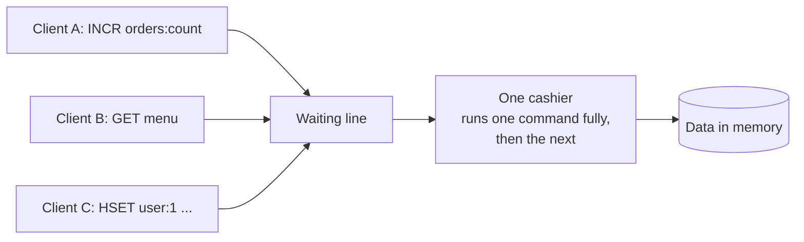

What this means for you:

- **Good:** every single command is safe on its own. Two apps running `incr` at the same time never lose a count.
- **Bad:** one slow command makes **everyone** wait. `keys("*")` on 10 million keys, `hgetall` on a giant hash, or deleting a huge list freezes the whole server while it runs.
- **Careful:** several commands in a row are **not** one safe step. Between your `get` and your `set`, another client can change the value.

Here is that last problem for real. A flash sale has **10 dosas**. 30 customers press "buy" at the same moment. First the wrong way (read, then write):

```python
import threading

def naive_buy(sold: list) -> None:
    stock = int(r.get("stock:dosa"))      # 1. read
    if stock >= 1:
        time.sleep(0.01)                  # 2. a little processing time
        r.set("stock:dosa", stock - 1)    # 3. write
        sold.append(1)

r.set("stock:dosa", 10)
sold = []
buyers = [threading.Thread(target=naive_buy, args=(sold,)) for _ in range(30)]
for b in buyers:
    b.start()
for b in buyers:
    b.join()
print(f"dosas sold: {len(sold)}, stock left: {r.get('stock:dosa')}")
```

Output:

```text
dosas sold: 30, stock left: 9
```

Many buyers read "10" at the same time, so far more than 10 dosas were sold. The same sale with one command that checks and changes in a single step:

```python
def safe_buy(sold: list) -> None:
    if r.decr("stock:dosa") >= 0:          # one command: take one and see what's left
        sold.append(1)
    else:
        r.incr("stock:dosa")               # went below zero: put it back

r.set("stock:dosa", 10)
sold = []
buyers = [threading.Thread(target=safe_buy, args=(sold,)) for _ in range(30)]
for b in buyers:
    b.start()
for b in buyers:
    b.join()
print(f"dosas sold: {len(sold)}, stock left: {r.get('stock:dosa')}")
```

Output:

```text
dosas sold: 10, stock left: 0
```

For "read, decide, write" logic that one command can't express, use a transaction ([16](#16-transactions-and-watch)) or a Lua script ([17](#17-lua-scripts-small-programs-inside-redis)).

---

## 15. Pipeline: one trip instead of many

**Picture:** a waiter carrying plates. Walking to the table once per plate is slow. Carrying all the plates on one tray is fast.

Each command normally needs a full trip over the network: send, wait, receive. A **pipeline** sends many commands together and reads all the answers together.

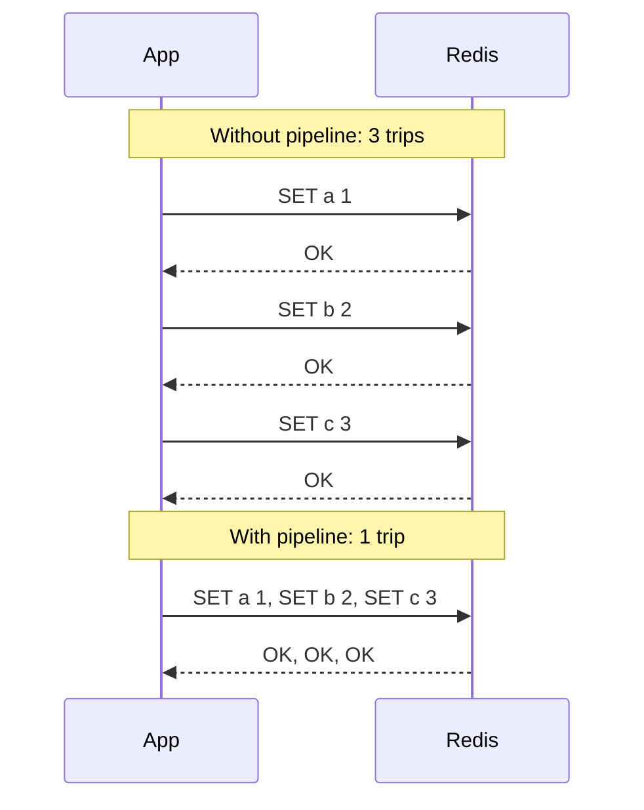

```python
for user_id, name in [(1, "Asha"), (2, "Ravi"), (3, "Meena")]:
    r.hset(f"user:{user_id}", "name", name)

pipe = r.pipeline(transaction=False)    # just batching, no transaction
for user_id in [1, 2, 3]:
    pipe.hget(f"user:{user_id}", "name")
print(pipe.execute())                   # answers come back in the same order
```

Output:

```text
['Asha', 'Ravi', 'Meena']
```

How much faster is it? 2,000 writes, both ways:

```python
N = 2_000

start = time.perf_counter()
for i in range(N):
    r.set(f"bench:{i}", i)
one_by_one = time.perf_counter() - start

start = time.perf_counter()
pipe = r.pipeline(transaction=False)
for i in range(N):
    pipe.set(f"bench:{i}", i)
pipe.execute()
pipelined = time.perf_counter() - start

print(f"one by one : {one_by_one * 1000:6.1f} ms")
print(f"pipeline   : {pipelined * 1000:6.1f} ms  ({one_by_one / pipelined:.0f}x faster)")
```

Output:

```text
one by one :  169.7 ms
pipeline   :   22.8 ms  (7x faster)
```

That ran with Redis on the same machine. Across a real network (about 1 ms per trip), 2,000 separate trips take about 2 seconds, while the pipeline still takes a few milliseconds.

> **Remember:** a pipeline is about **speed**, not safety. Other clients' commands can still run between yours. Send batches of hundreds or a few thousand commands, not millions at once.

---

## 16. Transactions and WATCH

### Transactions: "run these together, with nothing in between"

**Picture:** you hand the cashier a list and say "do all of these in one go". Nobody else is served in the middle of your list.

In redis-py, `r.pipeline()` is a **transaction by default** (`MULTI` … `EXEC`):

```python
r.set("wallet:asha", 500)
r.set("wallet:ravi", 0)

pipe = r.pipeline()                 # transaction=True by default
pipe.decrby("wallet:asha", 100)
pipe.incrby("wallet:ravi", 100)
print(pipe.execute())               # both ran together
```

Output:

```text
[400, 100]
```

**Important: there is no rollback.** If one command in the list fails, the others still happen:

```python
r.set("stock:dosa", 5)
pipe = r.pipeline()
pipe.incr("stock:dosa")             # fine
pipe.hset("stock:dosa", "x", 1)     # wrong type: stock:dosa is a string, not a hash
results = pipe.execute(raise_on_error=False)
for name, result in zip(["incr", "hset"], results):
    print(f"{name}: {result}" if not isinstance(result, Exception) else f"{name}: ERROR {result}")
print("stock now:", r.get("stock:dosa"))   # the incr still happened
```

Output:

```text
incr: 6
hset: ERROR WRONGTYPE Operation against a key holding the wrong kind of value
stock now: 6
```

### WATCH: "only if nobody changed it while I was deciding"

**Picture:** you look at the last packet of biscuits and decide to buy it. If someone grabs it before you reach the counter, your purchase is cancelled and you look again.

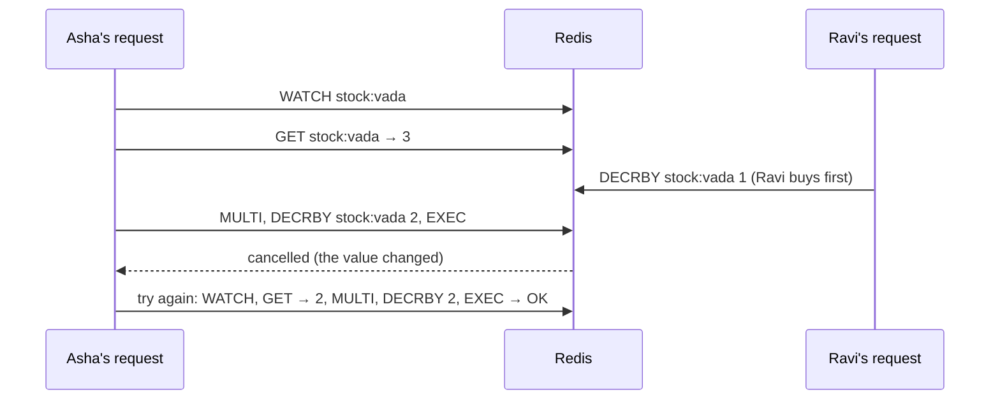

The example below makes "Ravi" buy in the middle of Asha's first attempt, so you can see the retry:

```python
def buy_with_watch(sku: str, qty: int, someone_else_buys=None) -> bool:
    key = f"stock:{sku}"
    with r.pipeline() as pipe:
        attempt = 0
        while True:
            attempt += 1
            try:
                pipe.watch(key)                       # 1. watch the key
                stock = int(pipe.get(key) or 0)       # 2. read it
                if someone_else_buys and attempt == 1:
                    someone_else_buys()               # (demo only: a rival buys now)
                if stock < qty:
                    pipe.unwatch()
                    print(f"  attempt {attempt}: only {stock} left, not enough")
                    return False
                pipe.multi()                          # 3. start the transaction
                pipe.decrby(key, qty)
                pipe.execute()                        # 4. fails if the key changed
                print(f"  attempt {attempt}: bought {qty}")
                return True
            except redis.WatchError:
                print(f"  attempt {attempt}: stock changed while deciding, trying again")

r.set("stock:vada", 3)
buy_with_watch("vada", 2, someone_else_buys=lambda: r.decrby("stock:vada", 1))
print("stock left:", r.get("stock:vada"))
buy_with_watch("vada", 2)
```

Output:

```text
  attempt 1: stock changed while deciding, trying again
  attempt 2: bought 2
stock left: 0
  attempt 1: only 0 left, not enough
```

When many users fight over the same key, `WATCH` retries a lot. A Lua script is usually simpler.

---

## 17. Lua scripts: small programs inside Redis

**Picture:** instead of asking the cashier five separate questions, you hand them a **written recipe**. They follow it from start to finish without serving anyone else.

A Lua script runs **inside Redis as one uninterruptible step**. It's the cleanest way to do "check, then change".

The quickest way to try one is `r.eval(script, number_of_keys, *keys_and_args)`:

```python
r.set("stock:dosa", 3)
script = """
local stock = tonumber(redis.call('GET', KEYS[1]))
if stock < tonumber(ARGV[1]) then return -1 end
return redis.call('DECRBY', KEYS[1], ARGV[1])
"""
print(r.eval(script, 1, "stock:dosa", 2))     # 1 left
print(r.eval(script, 1, "stock:dosa", 2))     # not enough -> -1
```

Output:

```text
1
-1
```

In real code use `register_script`. It sends the script once, then calls it by a short fingerprint (SHA):

```python
BUY = r.register_script("""
local stock = tonumber(redis.call('GET', KEYS[1]) or '0')
local qty   = tonumber(ARGV[1])
if stock < qty then
  return -1                                  -- not enough, change nothing
end
return redis.call('DECRBY', KEYS[1], qty)    -- take them, return what's left
""")

print(BUY(keys=["stock:idli"], args=[1]))     # no stock yet -> -1
r.set("stock:idli", 3)
print(BUY(keys=["stock:idli"], args=[2]))     # 1 left
print(BUY(keys=["stock:idli"], args=[2]))     # not enough -> -1
```

Output:

```text
-1
1
-1
```

The flash sale from [section 14](#14-one-cashier-how-redis-runs-commands) again, this time buying **2 at a time** (something a single `decr` can't check safely):

```python
r.set("stock:dosa", 10)
sold = []

def lua_buy():
    if BUY(keys=["stock:dosa"], args=[2]) >= 0:
        sold.append(2)

buyers = [threading.Thread(target=lua_buy) for _ in range(30)]
for b in buyers:
    b.start()
for b in buyers:
    b.join()
print(f"dosas sold: {sum(sold)}, stock left: {r.get('stock:dosa')}")
```

Output:

```text
dosas sold: 10, stock left: 0
```

Exactly 10 sold, never more, because nothing runs between the check and the change.

**Rules for scripts**

- Pass **every key** the script uses in `keys=[...]`. Don't build key names inside the script (Redis Cluster needs to know the keys up front).
- Keep scripts short. A long script blocks everyone, like any slow command.
- Numbers: Lua decimals are cut to whole numbers when returned. Return `tostring(x)` if you need decimals.
- **Redis Functions** (`FUNCTION LOAD` / `r.fcall(...)`, Redis 7+) are named scripts Redis stores permanently. Useful when many services share the same logic.

### Which tool when?

| You need | Use |
|---|---|
| Many independent commands, quickly | `r.pipeline(transaction=False)` |
| A few writes that must happen together | `r.pipeline()` (transaction) |
| Read → decide → write, little competition | `pipe.watch(...)` + transaction |
| Read → decide → write, any amount of competition | Lua script |

---

# Part 4 — Messages and queues

## 18. Pub/Sub: the loudspeaker

**In one line:** Pub/Sub sends a message to everyone who is listening **right now**. Nothing is saved.

**Picture:** an announcement on the shop loudspeaker. Everyone inside hears it. Anyone who walks in a minute later missed it forever.

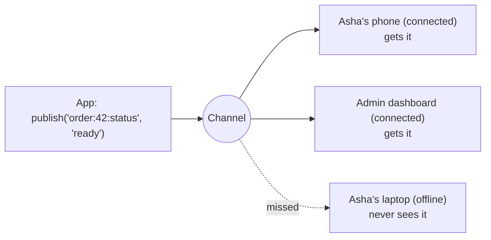

`publish` returns how many listeners received the message. With nobody listening, the message just disappears:

```python
print("received by:", r.publish("order:42:status", "ready"))
```

Output:

```text
received by: 0
```

Now with a listener:

```python
listener = r.pubsub(ignore_subscribe_messages=True)
listener.subscribe("order:42:status")          # start listening
listener.get_message(timeout=1)                 # wait until the subscription is confirmed

print("received by:", r.publish("order:42:status", "being cooked"))
print("received by:", r.publish("order:42:status", "ready"))

for _ in range(2):
    msg = listener.get_message(timeout=1)
    print(msg["channel"], "->", msg["data"])
listener.close()
```

Output:

```text
received by: 1
received by: 1
order:42:status -> being cooked
order:42:status -> ready
```

A real listener runs in its own thread. redis-py can run the loop for you with `run_in_thread`:

```python
def on_update(message):
    print("update:", message["channel"], "->", message["data"])

listener = r.pubsub(ignore_subscribe_messages=True)
listener.psubscribe(**{"order:*:status": on_update})   # pattern: every order
worker = listener.run_in_thread(sleep_time=0.01)
time.sleep(0.1)

r.publish("order:42:status", "out for delivery")
r.publish("order:43:status", "ready")
time.sleep(0.2)
worker.stop()
```

Output:

```text
update: order:42:status -> out for delivery
update: order:43:status -> ready
```

Async version, for pushing updates to a browser over WebSocket:

```python
import redis.asyncio as aioredis

async def updates_for(ar, order_id: int):
    pubsub = ar.pubsub(ignore_subscribe_messages=True)
    await pubsub.subscribe(f"order:{order_id}:status")
    try:
        async for msg in pubsub.listen():
            yield msg["data"]               # in a real app: await websocket.send_text(...)
    finally:
        await pubsub.unsubscribe()
        await pubsub.aclose()

async def demo():
    ar = aioredis.Redis(decode_responses=True)

    async def kitchen():
        await asyncio.sleep(0.2)
        await ar.publish("order:42:status", "ready")

    task = asyncio.create_task(kitchen())
    async for status in updates_for(ar, 42):
        print("browser shows:", status)
        break
    await task
    await ar.aclose()

asyncio.run(demo())
```

Output:

```text
browser shows: ready
```

| Good for | Not good for |
|---|---|
| "Your order is ready" pop-ups for people online | Orders, payments, emails: anything that must not be lost |
| Live dashboards, typing indicators | Work that needs retries |
| Telling all app servers "reload settings" | Anyone who might be offline |

In Redis Cluster, use **sharded Pub/Sub** (`spublish` / `ssubscribe`) so messages aren't copied to every server.

When a message must not be lost, use Streams.

---

## 19. Streams: the kitchen order rail

**In one line:** a stream is a list of messages that **stays saved**, and a **consumer group** lets many workers share the work, with "done" receipts and automatic retries.

This is how Tiffin Express sends orders to the kitchen without ever losing one.

### 19.1 The picture and the words

Imagine the order rail in a restaurant kitchen. Waiters clip tickets to the rail. Cooks take tickets, cook, and mark them done.

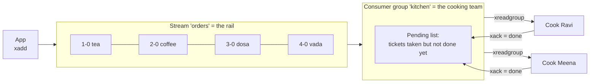

| Word | Kitchen picture | What it really is |
|---|---|---|
| **Stream** | The order rail | A saved, append-only list of messages under one key |
| **Entry / message** | One ticket | A small dict of fields, e.g. `{"item": "tea"}` |
| **Entry ID** | Ticket number | `time-sequence`, e.g. `1791284113066-0`. Always increasing. |
| **Consumer group** | The cooking team | A named reader that remembers which tickets it has handed out |
| **Consumer** | One cook | A named worker in the group (one per running process) |
| **Pending list (PEL)** | Tickets a cook took but hasn't finished | Messages delivered but not yet acknowledged |
| **`xack`** | "Done!" | Removes the message from the pending list |
| **Delivery count** | How many times a ticket was handed out | Goes up on every redelivery; used to spot bad tickets |

Two facts to remember:

1. **Reading doesn't remove a ticket from the rail.** Messages stay in the stream after they're read and acked. You clean up old ones by trimming ([19.13](#1913-the-rail-never-empties-by-itself)).
2. **Inside one team, each ticket goes to one cook. Different teams each get every ticket** ([19.11](#1911-two-teams-on-the-same-rail-fan-out)).

### 19.2 The life of one ticket

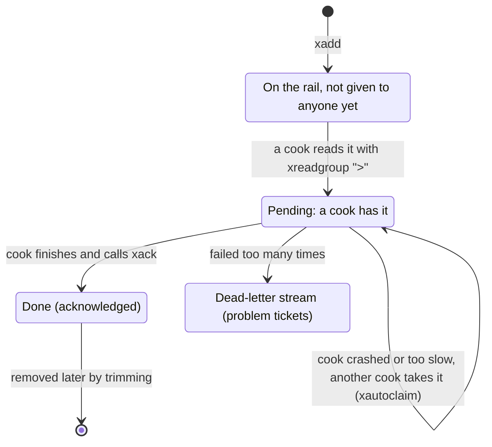

### 19.3 Step by step

We use small ticket ids (`1-0`, `2-0`, ...) so the output is easy to read. In real apps leave out `id=` and Redis creates the id from the current time.

A small helper prints what `xreadgroup` returns:

```python
def show(reply) -> None:
    """Print the tickets in an xreadgroup reply, one per line."""
    if not reply:
        print("  (nothing)")
    for _stream, messages in reply or []:
        for msg_id, fields in messages:
            print(f"  {msg_id}: {fields}")
```

**Step 1 — create the team and put 4 orders on the rail**

```python
# id="$" = the team only cares about orders added from now on
# mkstream=True = create the stream if it doesn't exist yet
r.xgroup_create("orders", "kitchen", id="$", mkstream=True)

for n, item in enumerate(["tea", "coffee", "dosa", "vada"], start=1):
    print(r.xadd("orders", {"item": item}, id=f"{n}-0"))
```

Output:

```text
1-0
2-0
3-0
4-0
```

**Step 2 — two cooks take work**

`">"` means "give me tickets nobody in my team has taken yet". Here is the raw reply once, so you know its shape:

```python
reply = r.xreadgroup("kitchen", "ravi", {"orders": ">"}, count=2)
print(reply)
```

Output:

```text
[['orders', [('1-0', {'item': 'tea'}), ('2-0', {'item': 'coffee'})]]]
```

It's a list of `[stream name, [(id, fields), ...]]`. From now on we print it with `show`:

```python
print("meena gets:")
show(r.xreadgroup("kitchen", "meena", {"orders": ">"}, count=2))

print("ravi asks again:")
show(r.xreadgroup("kitchen", "ravi", {"orders": ">"}, count=2))
```

Output:

```text
meena gets:
  3-0: {'item': 'dosa'}
  4-0: {'item': 'vada'}
ravi asks again:
  (nothing)
```

Ravi got tea and coffee. Meena got dosa and vada. **Nobody got the same ticket.** When Ravi asked again, nothing new was left. Redis hands tickets out one request at a time, so this is guaranteed with no locks.

**Step 3 — cooks finish and say "done"**

```python
print(r.xack("orders", "kitchen", "1-0"))            # Ravi made the tea
print(r.xack("orders", "kitchen", "3-0", "4-0"))     # Meena made dosa and vada

# Summary: how many unfinished tickets, and who holds them?
print(r.xpending("orders", "kitchen"))

# Details: who holds each ticket, how long ago it was handed out, how many deliveries
for p in r.xpending_range("orders", "kitchen", min="-", max="+", count=10):
    print(p)
```

Output:

```text
1
2
{'pending': 1, 'min': '2-0', 'max': '2-0', 'consumers': [{'name': 'ravi', 'pending': 1}]}
{'message_id': '2-0', 'consumer': 'ravi', 'time_since_delivered': 1, 'times_delivered': 1}
```

Only the coffee (`2-0`) is unfinished. Ravi took it but never said done. **Then Ravi's process crashes.** The coffee is not lost: it stays in the pending list with Ravi's name on it. There are two ways to recover it.

**Step 4a — Ravi restarts with the same name and finishes his own leftovers**

Reading with id `"0"` instead of `">"` means "show me **my** unfinished tickets":

```python
show(r.xreadgroup("kitchen", "ravi", {"orders": "0"}))
```

Output:

```text
  2-0: {'item': 'coffee'}
```

**Step 4b — or Ravi never comes back, so Meena takes over**

(Here, Ravi re-read the coffee in step 4a and then crashed again.)

`xautoclaim` means: "give me tickets nobody has touched for at least `min_idle_time` milliseconds". In a real app that would be something like `60_000` (one minute). We use `0` so we don't have to wait.

```python
next_start, claimed, deleted = r.xautoclaim("orders", "kitchen", "meena", min_idle_time=0, start_id="0-0")
print("meena took over:", claimed)

for p in r.xpending_range("orders", "kitchen", min="-", max="+", count=10):
    print(p)
```

Output:

```text
meena took over: [('2-0', {'item': 'coffee'})]
{'message_id': '2-0', 'consumer': 'meena', 'time_since_delivered': 1, 'times_delivered': 3}
```

The coffee now belongs to Meena, and its delivery count went up (1 → 2 when Ravi re-read it, 2 → 3 when Meena claimed it). The delivery count is how you spot a ticket that keeps failing ([19.9](#199-bad-tickets-poison-messages)).

**Step 5 — Meena finishes it**

```python
r.xack("orders", "kitchen", "2-0")
print(r.xpending("orders", "kitchen"))
print("tickets still on the rail:", r.xlen("orders"))    # acked tickets are not deleted
```

Output:

```text
{'pending': 0, 'min': None, 'max': None, 'consumers': []}
tickets still on the rail: 4
```

**Step 6 — look at the team and its cooks**

```python
for group in r.xinfo_groups("orders"):
    print(group)
for cook in r.xinfo_consumers("orders", "kitchen"):
    print(cook)
```

Output:

```text
{'name': 'kitchen', 'consumers': 2, 'pending': 0, 'last-delivered-id': '4-0', 'entries-read': 4, 'lag': 0}
{'name': 'meena', 'pending': 0, 'idle': 1}
{'name': 'ravi', 'pending': 0, 'idle': 1}
```

The useful fields: `pending` (unfinished tickets), `last-delivered-id` (the last ticket handed out), `lag` (tickets on the rail nobody has taken yet), and for each cook its own `pending` count and `idle` time in milliseconds.

### 19.4 Real messages: JSON and an event id

In real apps each message usually has one field, `data`, holding JSON. Each order also gets an `event_id` made by the app (you'll see why in [19.6](#196-can-work-happen-twice-and-how-to-stop-it)).

```python
STREAM, GROUP = "orders:live", "kitchen"

# 1. Create the team once. Running this again is harmless.
def ensure_group(stream: str, group: str) -> None:
    try:
        r.xgroup_create(stream, group, id="$", mkstream=True)
    except redis.ResponseError as e:
        if "BUSYGROUP" not in str(e):      # BUSYGROUP = the group already exists
            raise

ensure_group(STREAM, GROUP)
ensure_group(STREAM, GROUP)               # second call: no error

# 2. The app adds orders
def place_order(order_id: int, dish: str) -> str:
    event = {"event_id": f"evt-{uuid.uuid4().hex[:8]}", "order_id": order_id, "dish": dish}
    return r.xadd(STREAM, {"data": json.dumps(event)}, maxlen=1_000_000, approximate=True)

for n, dish in enumerate(["tea", "coffee", "dosa"], start=1):
    place_order(n, dish)

# 3. A cook reads and finishes work. block=2000: wait up to 2 s for new tickets.
reply = r.xreadgroup(GROUP, "ravi", {STREAM: ">"}, count=10, block=2000)
for _stream, messages in reply:
    for msg_id, fields in messages:
        order = json.loads(fields["data"])
        print(f"ravi cooks order {order['order_id']}: {order['dish']}")
        r.xack(STREAM, GROUP, msg_id)          # only after the work is really done

print("pending:", r.xpending(STREAM, GROUP)["pending"])
```

Output:

```text
ravi cooks order 1: tea
ravi cooks order 2: coffee
ravi cooks order 3: dosa
pending: 0
```

Without `block`, the read returns immediately when there's nothing new, and you'd have to keep asking in a busy loop.

### 19.5 Many cooks, and no ticket goes to two cooks

When a cook asks for new tickets with `">"`, Redis does three things in **one step**:

1. picks the next tickets after the team's `last-delivered-id`,
2. moves `last-delivered-id` forward,
3. writes those tickets into the pending list under **that** cook's name.

Because Redis runs one command at a time ([section 14](#14-one-cashier-how-redis-runs-commands)), two cooks can never get the same new ticket.

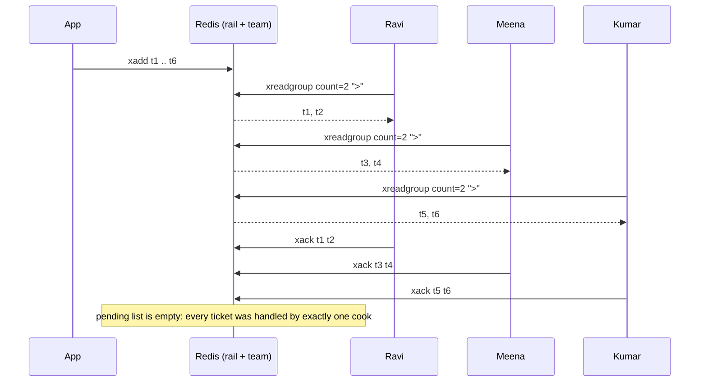

Let's prove it with three cook **threads** grabbing from 30 orders at the same time:

```python
from collections import Counter

for n in range(30):
    place_order(100 + n, random.choice(["dosa", "idli", "vada"]))

handled_by = {}                      # order_id -> cook
lock = threading.Lock()

def cook(name: str) -> None:
    c = redis.Redis(decode_responses=True)          # each thread/process has its own client
    while True:
        reply = c.xreadgroup(GROUP, name, {STREAM: ">"}, count=2, block=300)
        if not reply:
            return                                  # nothing left
        for _stream, messages in reply:
            for msg_id, fields in messages:
                order = json.loads(fields["data"])
                time.sleep(0.01)                    # cooking
                with lock:
                    if order["order_id"] in handled_by:
                        print("DUPLICATE!", order["order_id"])
                    handled_by[order["order_id"]] = name
                c.xack(STREAM, GROUP, msg_id)

cooks = [threading.Thread(target=cook, args=(n,)) for n in ["ravi", "meena", "kumar"]]
for t in cooks:
    t.start()
for t in cooks:
    t.join()

print("orders handled:", len(handled_by))
print("per cook      :", dict(Counter(handled_by.values())))
print("pending       :", r.xpending(STREAM, GROUP)["pending"])
```

Output:

```text
orders handled: 30
per cook      : {'meena': 10, 'kumar': 10, 'ravi': 10}
pending       : 0
```

How the work gets shared:

- There's no fixed rotation. **Whoever asks first gets the next tickets**, so a fast cook simply asks more often and does more.
- `count` is how many tickets a cook takes at once. Use 1–10 for slow jobs and bigger numbers for fast jobs.
- To handle more orders, **start more cooks in the same group with different names**. Nothing else changes.

> **Every running process needs its own consumer name.** Two processes with the same name share one pending list and get confused on restart. Good names: `f"{socket.gethostname()}-{os.getpid()}"`, or the Kubernetes pod name.

### 19.6 Can work happen twice, and how to stop it

Be clear about what Redis promises:

| | Promise |
|---|---|
| **Handing out** a new ticket | Exactly one cook at a time holds it |
| **Doing** the work | **At least once.** The same order *can* be cooked twice. |

How an order gets cooked twice:

1. Ravi cooks it, then crashes **just before** `xack`. The ticket is still pending, so someone takes it over and cooks it again.
2. Ravi is just **slow**. The ticket looks abandoned, Meena claims it, and both of them cook it ([19.8](#198-the-slow-cook-trap)).
3. Ravi's `xack` gets lost on the network.

So "no duplicates" in a real product means: **at-least-once delivery + work that is safe to repeat**. The trick is to remember "order X is done" in the **same step** as doing the work. Pick the version that matches where your work is saved:

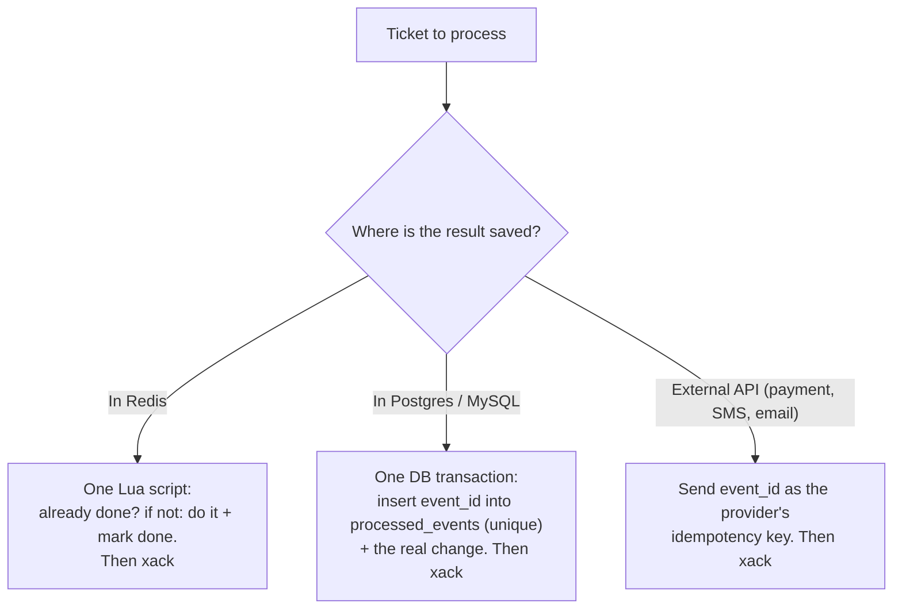

**Result saved in Redis** — "mark done", "do the work" and "xack" in one Lua script. The example delivers the same ticket twice on purpose:

```python
COOK_AND_ACK = r.register_script("""
local first_time = redis.call('SET', KEYS[2], '1', 'NX', 'EX', 86400)
if first_time then
  redis.call('HINCRBY', KEYS[3], ARGV[3], 1)      -- the real work: count the dish
end
redis.call('XACK', KEYS[1], ARGV[1], ARGV[2])     -- done, either way
if first_time then return 1 else return 0 end
""")

place_order(500, "pongal")
for _s, messages in r.xreadgroup(GROUP, "kumar", {STREAM: ">"}, count=10):
    for msg_id, fields in messages:
        order = json.loads(fields["data"])
        for attempt in (1, 2):                    # pretend the same ticket arrives twice
            cooked = COOK_AND_ACK(keys=[STREAM, f"done:{order['event_id']}", "dishes:made"],
                                  args=[GROUP, msg_id, order["dish"]])
            print(f"attempt {attempt}:", "cooked" if cooked else "skipped (already done)")

print("pongal made:", r.hget("dishes:made", "pongal"))
```

Output:

```text
attempt 1: cooked
attempt 2: skipped (already done)
pongal made: 1
```

**Result saved in Postgres** — a "processed events" table in the same transaction (psycopg 3; not run here):

```python
# CREATE TABLE processed_events (event_id text PRIMARY KEY, done_at timestamptz DEFAULT now());

def handle_order(conn, msg_id: str, fields: dict) -> None:
    order = json.loads(fields["data"])
    with conn.transaction():
        first_time = conn.execute(
            "INSERT INTO processed_events (event_id) VALUES (%s) "
            "ON CONFLICT DO NOTHING RETURNING event_id",
            (order["event_id"],),
        ).fetchone() is not None
        if first_time:
            conn.execute("INSERT INTO kitchen_log (order_id, dish) VALUES (%s, %s)",
                         (order["order_id"], order["dish"]))
    r.xack(STREAM, GROUP, msg_id)       # after the commit, for new and repeated tickets alike
```

**Which id to use?** Use the `event_id` **your app put inside the message**, not the stream's entry id. If a message is ever added again (a retry, or a replay from the dead-letter stream), it gets a new entry id but keeps its `event_id`.

### 19.7 When a cook crashes

A crashed cook's tickets stay in the pending list **forever**, until someone takes them. You have two tools:

| Situation | What to do |
|---|---|
| The **same** cook restarts (same name) | On startup, read with id `"0"` to get your own leftovers first |
| The cook is **gone for good** | Another cook runs `xautoclaim` to take tickets idle for too long |

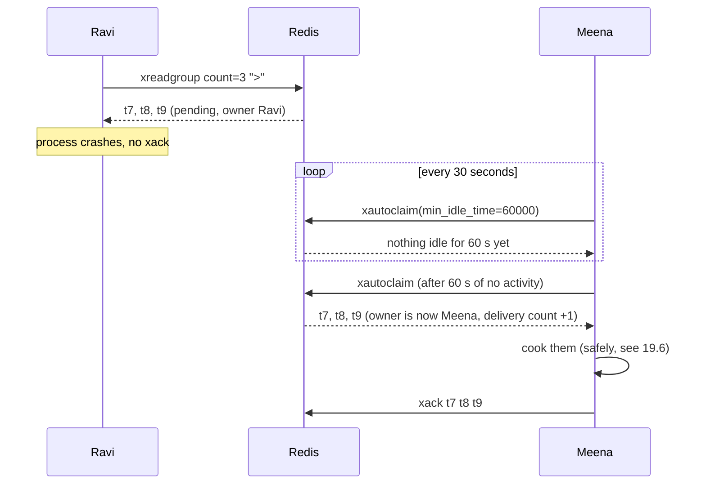

The example: Ravi takes 3 tickets and "crashes". Kumar takes them over once they've been idle for 1 second:

```python
for n in range(3):
    place_order(600 + n, "idli")
show(r.xreadgroup(GROUP, "ravi", {STREAM: ">"}, count=3))
print("ravi crashes without xack")

def take_over_abandoned(me: str, idle_ms: int = 60_000) -> int:
    """Call every ~30 seconds from every cook. Returns how many tickets it finished."""
    finished = 0
    start = "0-0"
    while True:
        start, claimed, _deleted = r.xautoclaim(STREAM, GROUP, me, idle_ms, start_id=start, count=50)
        for msg_id, fields in claimed:
            order = json.loads(fields["data"])
            print(f"{me} took over order {order['order_id']}")
            r.xack(STREAM, GROUP, msg_id)        # after doing the work
            finished += 1
        if start == "0-0":                       # looked through the whole pending list
            return finished

print("right away  :", take_over_abandoned("kumar", idle_ms=1000), "taken over")
time.sleep(1.1)
print("1.1 s later :", take_over_abandoned("kumar", idle_ms=1000), "taken over")
print("pending now :", r.xpending(STREAM, GROUP)["pending"])
```

Output:

```text
  1791434114030-0: {'data': '{"event_id": "evt-f59ab662", "order_id": 600, "dish": "idli"}'}
  1791434114030-1: {'data': '{"event_id": "evt-f5e95115", "order_id": 601, "dish": "idli"}'}
  1791434114030-2: {'data': '{"event_id": "evt-503c77be", "order_id": 602, "dish": "idli"}'}
ravi crashes without xack
right away  : 0 taken over
kumar took over order 600
kumar took over order 601
kumar took over order 602
1.1 s later : 3 taken over
pending now : 0
```

Nothing was taken over immediately, because the tickets hadn't been idle long enough. After 1 second they were.

And the restart path, for a cook that comes back with the same name:

```python
def finish_my_leftovers(me: str) -> None:
    """Call once when a cook starts, before reading new tickets."""
    for _stream, messages in r.xreadgroup(GROUP, me, {STREAM: "0"}, count=1000) or []:
        for msg_id, fields in messages:
            if not fields:                       # entry was trimmed away meanwhile
                r.xack(STREAM, GROUP, msg_id)
                continue
            print(me, "finishing leftover", json.loads(fields["data"])["order_id"])
            r.xack(STREAM, GROUP, msg_id)

place_order(700, "vada")
r.xreadgroup(GROUP, "meena", {STREAM: ">"}, count=1)    # meena takes it, then restarts
finish_my_leftovers("meena")
```

Output:

```text
meena finishing leftover 700
```

**How long is "idle too long"?** The idle time starts when a ticket is **handed out**, not when the cook starts working on it. So it must be longer than the slowest time to finish a **whole batch**. See the next section.

### 19.8 The slow cook trap

Ravi takes 5 tickets. The first one takes him 3 seconds. Meena claims anything idle for 2 seconds, so she takes **all 5**, including the one Ravi is cooking right now.

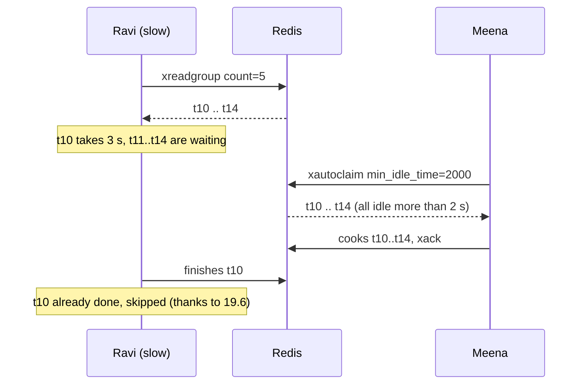

Your "safe to repeat" check prevents wrong results, but the work was wasted. Fixes:

1. Set the claim time **much longer** than your slowest batch (5–10× is a good start).
2. Use a small `count` for slow jobs.
3. For long jobs, send a **heartbeat**: re-claim your own tickets with `justid=True`. This resets the idle timer **without** increasing the delivery count.

Watch the heartbeat reset the idle time:

```python
place_order(800, "biryani (slow)")
reply = r.xreadgroup(GROUP, "ravi", {STREAM: ">"}, count=1)
msg_id = reply[0][1][0][0]

def idle_and_deliveries(msg_id):
    p = r.xpending_range(STREAM, GROUP, min=msg_id, max=msg_id, count=1)[0]
    return f"idle {p['time_since_delivered']} ms, delivered {p['times_delivered']}x"

time.sleep(1.5)
print("after 1.5 s of cooking:", idle_and_deliveries(msg_id))

def heartbeat(me: str, msg_ids: list[str]) -> None:
    """Call every ~10 seconds while working on long tickets."""
    r.xclaim(STREAM, GROUP, me, min_idle_time=0, message_ids=msg_ids, justid=True)

heartbeat("ravi", [msg_id])
print("right after heartbeat :", idle_and_deliveries(msg_id))
r.xack(STREAM, GROUP, msg_id)
```

Output:

```text
after 1.5 s of cooking: idle 1500 ms, delivered 1x
right after heartbeat : idle 1 ms, delivered 1x
```

### 19.9 Bad tickets (poison messages)

Some tickets **always** fail: broken data, a bug, a deleted product. Without a limit they would be retried forever.

**Picture:** after three failed attempts, the head cook puts the ticket on a separate "problem orders" tray and tells the manager.

```mermaid
flowchart TD
    M["Abandoned ticket taken over"] --> D{"Delivery count above the limit?"}
    D -- "no" --> T["Try to cook it"]
    T -- "works" --> ACK["xack"]
    T -- "fails" --> STAY["Leave it pending,<br/>it will be tried again later"]
    D -- "yes" --> DLQ["xadd to orders:dead<br/>(the problem tray)"]
    DLQ --> ACK2["xack the original"]
    DLQ --> AL["Alert someone, fix, replay"]
```

The example adds one broken order, then runs the take-over loop until the order lands in the problem tray:

```python
MAX_TRIES = 3
DEAD = f"{STREAM}:dead"

def cook_order(order: dict) -> None:
    if "dish" not in order:
        raise ValueError("order has no dish")

def take_over_with_limit(me: str, idle_ms: int = 60_000) -> None:
    start = "0-0"
    while True:
        start, claimed, _deleted = r.xautoclaim(STREAM, GROUP, me, idle_ms, start_id=start, count=50)
        for msg_id, fields in claimed:
            tries = r.xpending_range(STREAM, GROUP, min=msg_id, max=msg_id, count=1)[0]["times_delivered"]
            if tries > MAX_TRIES:
                pipe = r.pipeline()                    # both steps, or neither
                pipe.xadd(DEAD, {**fields, "original_id": msg_id, "tries": tries})
                pipe.xack(STREAM, GROUP, msg_id)
                pipe.execute()
                print(f"  {msg_id}: failed {tries - 1} times -> problem tray")
                continue
            try:
                cook_order(json.loads(fields["data"]))
                r.xack(STREAM, GROUP, msg_id)
            except Exception as exc:
                print(f"  delivery {tries}: failed ({exc}), stays pending")
        if start == "0-0":
            return

r.xadd(STREAM, {"data": json.dumps({"event_id": "evt-bad", "order_id": 900})})   # no dish!

reply = r.xreadgroup(GROUP, "meena", {STREAM: ">"}, count=1)    # meena takes it first
msg_id, fields = reply[0][1][0]
try:
    cook_order(json.loads(fields["data"]))
except Exception as exc:
    print(f"  delivery 1: failed ({exc}), stays pending")

for _ in range(4):
    time.sleep(0.15)
    take_over_with_limit("supervisor", idle_ms=100)

print("problem tray:", [json.loads(f["data"])["order_id"] for _, f in r.xrange(DEAD)])
print("pending     :", r.xpending(STREAM, GROUP)["pending"])
```

Output:

```text
  delivery 1: failed (order has no dish), stays pending
  delivery 2: failed (order has no dish), stays pending
  delivery 3: failed (order has no dish), stays pending
  1791434116636-0: failed 3 times -> problem tray
problem tray: [900]
pending     : 0
```

After fixing the bug, put the problem tickets back on the rail and let a cook handle them:

```python
def cook_order(order: dict) -> None:            # bug fixed: no dish now means "chef's special"
    order.setdefault("dish", "chef's special")
    print(f"  cooked order {order['order_id']}: {order['dish']}")

def replay_dead(limit: int = 100) -> int:
    replayed = 0
    for dead_id, fields in r.xrange(DEAD, count=limit):
        original = {k: v for k, v in fields.items() if k not in ("original_id", "tries")}
        pipe = r.pipeline()
        pipe.xadd(STREAM, original)
        pipe.xdel(DEAD, dead_id)
        pipe.execute()
        replayed += 1
    return replayed

print("replayed:", replay_dead(), "| problem tray now:", r.xlen(DEAD))
for _stream, messages in r.xreadgroup(GROUP, "meena", {STREAM: ">"}, count=10):
    for msg_id, fields in messages:
        cook_order(json.loads(fields["data"]))
        r.xack(STREAM, GROUP, msg_id)
```

Output:

```text
replayed: 1 | problem tray now: 0
  cooked order 900: chef's special
```

Set an alert for "the problem tray is not empty" (`r.xlen("orders:dead") > 0`).

### 19.10 Retry later with growing waits

`xautoclaim` retries after a **fixed** wait. When a failure is temporary (the payment provider is down), it's kinder to wait longer each time: 10 s, 20 s, 40 s ...

**How:** acknowledge the failed ticket and put a copy into the delayed-job tray from [section 13](#13-delayed-jobs-do-this-later) with a later time. The mover puts it back on the rail when it's due.

```python
def retry_later(msg_id: str, fields: dict, error: Exception, max_attempts: int = 5) -> str:
    job = json.loads(fields["data"])                  # keeps the same event_id
    job["attempt"] = job.get("attempt", 0) + 1
    pipe = r.pipeline()                               # all steps together
    if job["attempt"] > max_attempts:
        pipe.xadd(DEAD, {"data": json.dumps(job), "error": str(error)[:500]})
        outcome = "gave up: problem tray"
    else:
        wait = min(5 * 2 ** job["attempt"], 3600)     # 10 s, 20 s, 40 s ... max 1 hour
        pipe.zadd("delayed:orders", {json.dumps(job, sort_keys=True): time.time() + wait})
        outcome = f"retry in {wait} s"
    pipe.xack(STREAM, GROUP, msg_id)
    pipe.execute()
    return outcome

# One payment keeps failing because the payment service is down.
fields = {"data": json.dumps({"event_id": "evt-pay", "order_id": 950})}
while fields:
    msg_id = r.xadd(STREAM, fields)
    r.xreadgroup(GROUP, "anu", {STREAM: ">"}, count=1)          # Anu takes it, the call fails
    print(retry_later(msg_id, fields, ConnectionError("payment service down")))
    # Instead of waiting, take the job straight back out of the tray (the mover would do this later)
    due = r.zpopmin("delayed:orders")
    fields = {"data": due[0][0]} if due else None
```

Output:

```text
retry in 10 s
retry in 20 s
retry in 40 s
retry in 80 s
retry in 160 s
gave up: problem tray
```

In a cook it looks like this:

```python
try:
    handle(order)
    r.xack(STREAM, GROUP, msg_id)
except TemporaryError as exc:          # e.g. the payment service is down
    retry_later(msg_id, fields, exc)
```

### 19.11 Two teams on the same rail (fan-out)

Billing must charge for every order, the kitchen must cook every order, and analytics must count every order. Give **each team its own group** on the same stream.

```mermaid
flowchart LR
    APP["App: xadd orders"] --> S[("Stream: orders")]
    S --> G1["Group: kitchen"]
    S --> G2["Group: billing"]
    S --> G3["Group: analytics"]
    G1 --> K1["Ravi"]
    G1 --> K2["Meena"]
    G2 --> B1["Anu"]
    G3 --> A1["stats-1"]
    G3 --> A2["stats-2"]
```

Back to the `orders` stream from 19.3: the kitchen has finished all 4 orders. Now billing joins and starts from the very first order (`id="0"`):

```python
r.xgroup_create("orders", "billing", id="0")
print("anu (billing) gets:")
show(r.xreadgroup("billing", "anu", {"orders": ">"}, count=10))
print("kitchen has nothing new:")
show(r.xreadgroup("kitchen", "ravi", {"orders": ">"}, count=10))
```

Output:

```text
anu (billing) gets:
  1-0: {'item': 'tea'}
  2-0: {'item': 'coffee'}
  3-0: {'item': 'dosa'}
  4-0: {'item': 'vada'}
kitchen has nothing new:
  (nothing)
```

- **Inside a team, the work is split. Each team gets everything.**
- Teams are independent: if analytics is slow, the kitchen isn't affected.
- A new team created with `id="0"` can **replay** everything still on the rail.
- Trimming must respect the **slowest** team ([19.13](#1913-the-rail-never-empties-by-itself)).

### 19.12 Keeping things in order

The rail keeps tickets in order, but with several cooks, **finishing** order is not guaranteed: ticket 2 can be done before ticket 1, and retries mix things up more.

If order matters **per customer** (Asha's "place order" must happen before her "cancel order"), split the work into several rails and always send the same customer to the same rail. One cook works each rail.

```mermaid
flowchart LR
    APP["App"] -- "crc32(customer) mod 4" --> P{"Pick a rail"}
    P --> S0[("orders:0")]
    P --> S1[("orders:1")]
    P --> S2[("orders:2")]
    P --> S3[("orders:3")]
    S0 --> W0["cook for rail 0"]
    S1 --> W1["cook for rail 1"]
    S2 --> W2["cook for rail 2"]
    S3 --> W3["cook for rail 3"]
```

```python
import zlib

RAILS = 4

def rail_for(customer: str) -> str:
    # Python's hash() changes between runs, so use a stable hash
    return f"orders:{zlib.crc32(customer.encode()) % RAILS}"

for customer in ["asha", "ravi", "meena", "asha"]:
    print(customer, "->", rail_for(customer))
```

Output:

```text
asha -> orders:2
ravi -> orders:0
meena -> orders:0
asha -> orders:2
```

Asha always lands on the same rail. This is the same idea as Kafka partitions: more rails = more parallel work, one rail = strict order.

### 19.13 The rail never empties by itself

Acknowledged tickets are **not** deleted. Without cleanup, the stream grows until Redis runs out of memory.

```python
print("before:", r.xlen("orders"))
print("removed:", r.xtrim("orders", maxlen=2, approximate=False))   # keep the newest 2
print("after:", r.xlen("orders"), r.xrange("orders"))
```

Output:

```text
before: 4
removed: 2
after: 2 [('3-0', {'item': 'dosa'}), ('4-0', {'item': 'vada'})]
```

Two ways to clean up in a real app:

```python
# 1. While adding: keep about the last 1 million entries ("approximate" is much cheaper)
r.xadd("orders", {"data": json.dumps({"event_id": "evt-x"})}, maxlen=1_000_000, approximate=True)

# 2. By age: remove entries older than 7 days (entry ids start with a timestamp)
week_ago_ms = int((time.time() - 7 * 86_400) * 1000)
print("removed by age:", r.xtrim("orders", minid=f"{week_ago_ms}-0", approximate=True))
```

Output:

```text
removed by age: 0
```

> **Careful:** trimming doesn't know about your teams. It can remove tickets a slow team hasn't read yet, or tickets that are still pending. Keep far more history than your worst backlog, and alert on lag before it gets close.

### 19.14 Cleaning up old cook names

Consumer names are never removed automatically. After many deploys, the cook list fills up with names that no longer exist.

```python
def remove_idle_cooks(stream: str, group: str, idle_ms: int = 3_600_000) -> list[str]:
    removed = []
    for cook in r.xinfo_consumers(stream, group):
        if cook["pending"] == 0 and cook["idle"] > idle_ms:      # nothing unfinished
            r.xgroup_delconsumer(stream, group, cook["name"])
            removed.append(cook["name"])
    return removed

print("cooks before:", [c["name"] for c in r.xinfo_consumers(STREAM, GROUP)])
print("removed     :", remove_idle_cooks(STREAM, GROUP, idle_ms=100))   # 100 ms only for the demo
```

Output:

```text
cooks before: ['anu', 'kumar', 'meena', 'ravi', 'supervisor']
removed     : ['kumar', 'ravi', 'supervisor']
```

> **Never delete a cook that still has pending tickets.** `xgroup_delconsumer` throws those tickets away and they will never be delivered again. Take them over first (`xautoclaim`), then delete the name.

Other team commands:

```python
r.xgroup_create("orders", "analytics", id="$")
print(r.xgroup_setid("orders", "analytics", id="0"))   # read everything again from the start
print(r.xgroup_setid("orders", "analytics", id="$"))   # skip the backlog, only new orders
print(r.xgroup_destroy("orders", "analytics"))         # delete the team
```

Output:

```text
True
True
True
```

### 19.15 Is the kitchen healthy?

```python
def kitchen_health(stream: str, group: str) -> dict:
    team = next(g for g in r.xinfo_groups(stream) if g["name"] == group)
    oldest = r.xpending_range(stream, group, "-", "+", 1)
    return {
        "tickets_on_rail": r.xlen(stream),
        "not_yet_taken": team.get("lag"),             # waiting for a cook
        "taken_not_done": team["pending"],            # being cooked (or stuck)
        "cooks": [(c["name"], c["pending"], c["idle"]) for c in r.xinfo_consumers(stream, group)],
        "oldest_unfinished_ms": oldest[0]["time_since_delivered"] if oldest else 0,
        "problem_tray": r.xlen(f"{stream}:dead"),
    }

place_order(1000, "dosa")
place_order(1001, "idli")
r.xreadgroup(GROUP, "kumar", {STREAM: ">"}, count=1)     # one taken, not finished
for name, value in kitchen_health(STREAM, GROUP).items():
    print(f"{name:22s} {value}")
```

Output:

```text
tickets_on_rail        49
not_yet_taken          1
taken_not_done         1
cooks                  [('anu', 0, 4), ('kumar', 1, 1), ('meena', 0, 7)]
oldest_unfinished_ms   0
problem_tray           1
```

| What you see | What it means | What to do |
|---|---|---|
| `not_yet_taken` keeps growing | Orders arrive faster than cooks finish | Add cooks, make the work faster |
| `taken_not_done` high and `oldest_unfinished_ms` large | Cooks are stuck or crashing | Check logs, check the take-over loop |
| A cook with a huge `idle` and pending tickets | That process is dead | The take-over loop should pick up its tickets |
| `problem_tray` > 0 | Bad tickets | Alert, fix, replay |
| `tickets_on_rail` close to your `maxlen` | Trimming may remove unread orders | Keep more history or add cooks |

On Kubernetes, **KEDA** can add or remove worker pods automatically based on a stream's pending count or lag, even down to zero when there's no work.

### 19.16 Full runnable demo: three cooks, a crash and a bad order

This script puts everything together:

- The app puts **12 good orders and 1 broken order** on the rail.
- **Three cooks** share the work in one team, so each order goes to one cook.
- **Ravi** cooks his first order, then **crashes before saying done**, still holding 3 tickets.
- The **supervisor** takes over tickets that nobody touched for 2 seconds.
- Ravi's first order was already cooked, so the "already done?" check **skips it**.
- The **broken order** fails 3 times and goes to the **dead-letter tray**.

```mermaid
flowchart LR
    APP["App: 12 good orders + 1 broken"] --> RAIL[("kitchen:orders")]
    RAIL --> TEAM["Team: cooks"]
    TEAM --> RAVI["Ravi (crashes)"]
    TEAM --> MEENA["Meena"]
    TEAM --> KUMAR["Kumar"]
    TEAM --> SUP["Supervisor<br/>(xautoclaim)"]
    SUP -- "after 3 failures" --> DEADT[("kitchen:orders:dead")]
    MEENA & KUMAR & SUP & RAVI -- "cook once (Lua) + xack" --> MADE[("kitchen:cooked")]
```

Save it as `kitchen_demo.py`, then run:

```bash
docker run -d -p 6379:6379 redis:7
pip install "redis>=5"
python kitchen_demo.py
```

```python
"""
kitchen_demo.py - Redis Streams consumer groups, explained with a kitchen.

The story:
  * The app puts 12 good orders and 1 broken order on the order rail (a stream).
  * Three cooks share the work in ONE group, so every order goes to ONE cook.
  * Ravi cooks his first order, then crashes BEFORE saying "done" (XACK),
    while still holding the rest of his tickets.
  * The supervisor looks for tickets nobody has touched for 2 seconds
    (XAUTOCLAIM) and finishes them.
  * Ravi's first order was already cooked, so the "already cooked?" check skips it.
  * The broken order fails every time and is moved to the dead-letter stream.

Run:  docker run -d -p 6379:6379 redis:7    then    python kitchen_demo.py
"""
import threading
import time
from collections import Counter

import redis

STREAM = "kitchen:orders"        # the order rail
GROUP = "cooks"                  # the kitchen team
DEAD = "kitchen:orders:dead"     # the "problem orders" tray
COOKED = "kitchen:cooked"        # hash: dish -> how many were cooked
CLAIM_AFTER_MS = 2_000           # a ticket untouched for 2 s counts as abandoned
MAX_TRIES = 3                    # after 3 failed tries, give up on an order

r = redis.Redis(decode_responses=True)
stop = threading.Event()
t0 = time.time()
stats_lock = threading.Lock()
cooked_by = Counter()            # cook -> orders cooked
times_cooked = Counter()         # order id -> how many times it was really cooked


def say(who: str, text: str) -> None:
    print(f"[{time.time() - t0:4.1f}s] {who:10s} {text}", flush=True)


# Cook the dish AND remember "this order is done" in ONE step.
# Returns 1 = cooked now, 0 = this order was already cooked earlier.
COOK_ONCE = r.register_script("""
if redis.call('SET', KEYS[1], '1', 'NX', 'EX', 86400) then
  redis.call('HINCRBY', KEYS[2], ARGV[1], 1)
  return 1
end
return 0
""")


def cook(who: str, msg_id: str, order: dict) -> None:
    if "dish" not in order:
        raise ValueError("order has no dish")
    time.sleep(0.05)                                   # cooking takes a moment
    done_key = f"kitchen:done:{order['order_id']}"
    if COOK_ONCE(keys=[done_key, COOKED], args=[order["dish"]]):
        say(who, f"cooked {order['dish']:6s} for order {order['order_id']}")
        with stats_lock:
            cooked_by[who] += 1
            times_cooked[order["order_id"]] += 1
    else:
        say(who, f"order {order['order_id']} was already cooked -> skip it")


def cook_worker(name: str, crash_after_first: bool = False) -> None:
    while not stop.is_set():
        # ">" = give me tickets nobody in my team has taken yet
        reply = r.xreadgroup(GROUP, name, {STREAM: ">"}, count=3, block=500)
        for _stream, messages in reply or []:
            say(name, f"took tickets {[msg_id for msg_id, _ in messages]}")
            for msg_id, order in messages:
                try:
                    cook(name, msg_id, order)
                except Exception as exc:
                    say(name, f"FAILED order {order['order_id']} ({exc}) -> stays pending")
                    continue
                if crash_after_first:
                    say(name, "CRASHED before XACK!")
                    return
                r.xack(STREAM, GROUP, msg_id)          # "done"


def supervisor() -> None:
    name = "supervisor"
    while not stop.is_set():
        # take tickets that nobody has touched for CLAIM_AFTER_MS
        result = r.xautoclaim(STREAM, GROUP, name, CLAIM_AFTER_MS, start_id="0-0", count=10)
        for msg_id, order in result[1]:
            info = r.xpending_range(STREAM, GROUP, min=msg_id, max=msg_id, count=1)
            tries = info[0]["times_delivered"]
            if tries > MAX_TRIES:
                pipe = r.pipeline()                    # both steps, or neither
                pipe.xadd(DEAD, {**order, "tries": tries})
                pipe.xack(STREAM, GROUP, msg_id)
                pipe.execute()
                say(name, f"order {order['order_id']} failed {tries - 1} times -> dead-letter tray")
                continue
            say(name, f"picked up abandoned ticket {msg_id} (delivery {tries})")
            try:
                cook(name, msg_id, order)
                r.xack(STREAM, GROUP, msg_id)
            except Exception as exc:
                say(name, f"FAILED order {order['order_id']} again ({exc})")
        stop.wait(0.5)


def main() -> None:
    r.delete(STREAM, DEAD, COOKED, *r.scan_iter("kitchen:done:*"))
    r.xgroup_create(STREAM, GROUP, id="0", mkstream=True)

    dishes = ["dosa", "idli", "vada", "pongal"]
    for n in range(1, 14):
        order = {"order_id": n, "dish": dishes[n % 4]}
        if n == 7:
            order = {"order_id": n, "note": "???"}      # a broken order
        # small ids (1-0, 2-0 ...) keep the output readable; real apps use "*"
        r.xadd(STREAM, order, id=f"{n}-0")
    say("app", "put 13 orders on the rail (order 7 is broken)")

    ravi = threading.Thread(target=cook_worker, args=("ravi",), kwargs={"crash_after_first": True})
    ravi.start()
    time.sleep(0.2)                                    # let Ravi grab his tickets first
    others = [threading.Thread(target=cook_worker, args=("meena",)),
              threading.Thread(target=cook_worker, args=("kumar",)),
              threading.Thread(target=supervisor)]
    for t in others:
        t.start()

    while True:                                        # wait until all work is finished
        group = r.xinfo_groups(STREAM)[0]
        if group["lag"] == 0 and group["pending"] == 0:
            break
        time.sleep(0.2)
    stop.set()
    for t in [ravi, *others]:
        t.join()

    print("\n=== RESULT ===")
    print("orders cooked by each cook :", dict(sorted(cooked_by.items())))
    print("good orders cooked         :", len(times_cooked), "of 12")
    print("orders cooked twice        :", sum(1 for c in times_cooked.values() if c > 1))
    print("dishes made                :", dict(sorted(r.hgetall(COOKED).items())))
    print("orders in dead-letter tray :", [o["order_id"] for _, o in r.xrange(DEAD)])
    print("tickets still pending      :", r.xpending(STREAM, GROUP)["pending"])


if __name__ == "__main__":
    main()
```

Real output (times will differ a little on your machine):

Output:

```text
[ 0.0s] app        put 13 orders on the rail (order 7 is broken)
[ 0.0s] ravi       took tickets ['1-0', '2-0', '3-0']
[ 0.1s] ravi       cooked idli   for order 1
[ 0.1s] ravi       CRASHED before XACK!
[ 0.2s] meena      took tickets ['4-0', '5-0', '6-0']
[ 0.2s] kumar      took tickets ['7-0', '8-0', '9-0']
[ 0.2s] kumar      FAILED order 7 (order has no dish) -> stays pending
[ 0.3s] meena      cooked dosa   for order 4
[ 0.3s] kumar      cooked dosa   for order 8
[ 0.3s] meena      cooked idli   for order 5
[ 0.3s] kumar      cooked idli   for order 9
[ 0.3s] kumar      took tickets ['10-0', '11-0', '12-0']
[ 0.4s] meena      cooked vada   for order 6
[ 0.4s] meena      took tickets ['13-0']
[ 0.4s] kumar      cooked vada   for order 10
[ 0.4s] meena      cooked idli   for order 13
[ 0.4s] kumar      cooked pongal for order 11
[ 0.5s] kumar      cooked dosa   for order 12
[ 2.2s] supervisor picked up abandoned ticket 1-0 (delivery 2)
[ 2.3s] supervisor order 1 was already cooked -> skip it
[ 2.3s] supervisor picked up abandoned ticket 2-0 (delivery 2)
[ 2.3s] supervisor cooked vada   for order 2
[ 2.3s] supervisor picked up abandoned ticket 3-0 (delivery 2)
[ 2.4s] supervisor cooked pongal for order 3
[ 2.4s] supervisor picked up abandoned ticket 7-0 (delivery 2)
[ 2.4s] supervisor FAILED order 7 again (order has no dish)
[ 4.4s] supervisor picked up abandoned ticket 7-0 (delivery 3)
[ 4.4s] supervisor FAILED order 7 again (order has no dish)
[ 6.4s] supervisor order 7 failed 3 times -> dead-letter tray

=== RESULT ===
orders cooked by each cook : {'kumar': 5, 'meena': 4, 'ravi': 1, 'supervisor': 2}
good orders cooked         : 12 of 12
orders cooked twice        : 0
dishes made                : {'dosa': '3', 'idli': '4', 'pongal': '2', 'vada': '3'}
orders in dead-letter tray : ['7']
tickets still pending      : 0
```

**How to read it**

- **Each ticket went to one cook.** Ravi took tickets 1–3, and Meena and Kumar shared the rest, three at a time. No ticket was handed to two cooks.
- **Nothing was lost.** Ravi crashed holding tickets 1, 2 and 3. Two seconds later the supervisor took them over.
- **Nothing was cooked twice.** Order 1 had already been cooked by Ravi before he crashed, so the supervisor's "already done?" check skipped it.
- **The broken order didn't block anyone.** Order 7 failed, was retried, and after 3 failures went to the dead-letter tray. Everyone else kept working.
- **`good orders cooked: 12 of 12`** and **`tickets still pending: 0`** prove the whole thing worked.

Things to try:

- Set `CLAIM_AFTER_MS = 10_000`: recovery takes longer, but slow cooks are never interrupted.
- Remove `crash_after_first=True`: Ravi behaves normally and the supervisor only deals with the broken order.
- Change `count=3` to `count=1` in `cook_worker`: each cook takes one ticket at a time, so a crash leaves at most one ticket behind.

### 19.17 A worker for production

The demo uses threads to keep everything in one file. In a real app each cook is its **own process** (or Kubernetes pod). This async worker:

- creates the team if it doesn't exist,
- finishes its **own leftovers** on startup,
- every 30 s takes over **abandoned tickets** and moves bad ones to the dead-letter stream,
- waits for **new tickets** with a blocking read,
- **shuts down cleanly** on `Ctrl+C` or Kubernetes `SIGTERM`.

```python
"""
worker.py - a production-style Redis Streams worker (asyncio).

Start as many copies as you like, each with its own name:
    CONSUMER_NAME=cook-1 python worker.py
    CONSUMER_NAME=cook-2 python worker.py
"""
import asyncio
import json
import logging
import os
import signal
import socket

import redis.asyncio as aioredis

STREAM, GROUP, DEAD = "orders", "kitchen", "orders:dead"
CONSUMER = os.getenv("CONSUMER_NAME") or f"{socket.gethostname()}-{os.getpid()}"
BATCH = 10                  # tickets per read
BLOCK_MS = 5_000            # wait up to 5 s for new tickets
CLAIM_AFTER_MS = 60_000     # take over tickets nobody touched for 60 s
MAX_TRIES = 5               # then move the ticket to the dead-letter stream
RECLAIM_EVERY_S = 30        # how often to look for abandoned tickets

log = logging.getLogger(CONSUMER)
r = aioredis.Redis(
    host="localhost", port=6379, decode_responses=True,
    socket_timeout=BLOCK_MS / 1000 + 5,   # must be longer than the BLOCK wait
    health_check_interval=30,
)


async def ensure_group() -> None:
    try:
        await r.xgroup_create(STREAM, GROUP, id="$", mkstream=True)
    except aioredis.ResponseError as e:
        if "BUSYGROUP" not in str(e):     # BUSYGROUP = the group already exists
            raise


async def handle(order: dict) -> None:
    """Your business logic. Make it safe to run twice (see section 18.6)."""
    log.info("cooking %s", order)


async def process(msg_id: str, fields: dict) -> None:
    if not fields:                        # entry was trimmed away while pending
        await r.xack(STREAM, GROUP, msg_id)
        return
    try:
        await handle(json.loads(fields["data"]))
        await r.xack(STREAM, GROUP, msg_id)                # "done"
    except Exception:
        log.exception("failed %s, it stays pending and will be retried", msg_id)


async def reclaim_abandoned() -> None:
    start = "0-0"
    while True:
        result = await r.xautoclaim(STREAM, GROUP, CONSUMER, CLAIM_AFTER_MS,
                                    start_id=start, count=BATCH)
        start, claimed = result[0], result[1]
        for msg_id, fields in claimed:
            info = await r.xpending_range(STREAM, GROUP, min=msg_id, max=msg_id, count=1)
            if info and info[0]["times_delivered"] > MAX_TRIES:
                pipe = r.pipeline()                         # both steps, or neither
                pipe.xadd(DEAD, {**fields, "original_id": msg_id})
                pipe.xack(STREAM, GROUP, msg_id)
                await pipe.execute()
                log.warning("moved %s to the dead-letter stream", msg_id)
            else:
                await process(msg_id, fields)
        if start == "0-0":                # went through the whole pending list
            return


async def run(stop: asyncio.Event) -> None:
    await ensure_group()

    # 1. After a restart, finish MY OWN unfinished tickets first (id "0")
    for _, msgs in await r.xreadgroup(GROUP, CONSUMER, {STREAM: "0"}, count=1000) or []:
        for msg_id, fields in msgs:
            await process(msg_id, fields)

    loop = asyncio.get_running_loop()
    last_reclaim = 0.0
    while not stop.is_set():
        # 2. Now and then, take over tickets from cooks that disappeared
        if loop.time() - last_reclaim > RECLAIM_EVERY_S:
            await reclaim_abandoned()
            last_reclaim = loop.time()
        # 3. Read NEW tickets (id ">"), waiting up to BLOCK_MS for them
        reply = await r.xreadgroup(GROUP, CONSUMER, {STREAM: ">"}, count=BATCH, block=BLOCK_MS)
        for _, msgs in reply or []:
            for msg_id, fields in msgs:
                await process(msg_id, fields)
    log.info("stopped cleanly")


async def main() -> None:
    logging.basicConfig(level=logging.INFO, format="%(name)s %(message)s")
    stop = asyncio.Event()
    loop = asyncio.get_running_loop()
    for sig in (signal.SIGTERM, signal.SIGINT):    # Kubernetes sends SIGTERM on shutdown
        loop.add_signal_handler(sig, stop.set)
    await run(stop)
    await r.aclose()


if __name__ == "__main__":
    asyncio.run(main())
```

Run three cooks:

```bash
CONSUMER_NAME=cook-1 python worker.py &
CONSUMER_NAME=cook-2 python worker.py &
CONSUMER_NAME=cook-3 python worker.py &
```

On Kubernetes, use the pod name as the cook name and give pods time to finish:

```yaml
spec:
  terminationGracePeriodSeconds: 60      # longer than BLOCK + your slowest batch
  containers:
    - name: worker
      env:
        - name: CONSUMER_NAME
          valueFrom:
            fieldRef:
              fieldPath: metadata.name
```

**Doing several tickets at once inside one worker.** The template handles one ticket at a time. If the work is mostly waiting on the network, handle a batch together, with a limit:

```python
limit = asyncio.Semaphore(20)            # at most 20 at the same time

async def limited(msg_id, fields):
    async with limit:
        await process(msg_id, fields)

# inside the read loop:
for _, msgs in reply or []:
    await asyncio.gather(*(limited(m, f) for m, f in msgs))
```

> **Gotcha:** a read with `block=5000` keeps the connection silent for up to 5 seconds. If the client's `socket_timeout` is shorter, you'll get `TimeoutError`s. Always set `socket_timeout` longer than `block` (the template uses block + 5 s).

### 19.18 Three levels of delivery promise

| Level | How | Use for |
|---|---|---|
| **At most once** (may lose) | Pub/Sub, or `xreadgroup(..., noack=True)` (no pending list) | Metrics, logs, "who's online" |
| **At least once** (may repeat) | `xreadgroup` + `xack` after the work | The normal setting |
| **Effectively once** | At least once + work that is safe to repeat ([19.6](#196-can-work-happen-twice-and-how-to-stop-it)) | Payments, stock, emails, anything a customer sees |

### 19.19 Streams quick reference (redis-py)

**Special ids**

| You write | In | Means |
|---|---|---|
| leave out `id` (or `"*"`) | `xadd` | Make the id for me from the current time |
| `"$"` | `xgroup_create` | The team only reads orders added from now on |
| `"0"` | `xgroup_create` | The team starts from the very first order |
| `">"` | `xreadgroup` | New tickets nobody in my team has taken |
| `"0"` | `xreadgroup` | **My own** unfinished tickets |
| `"-"` and `"+"` | `xrange`, `xpending_range` | Smallest and largest possible id |

**Methods**

| redis-py call | In plain words |
|---|---|
| `r.xadd(stream, {"data": ...}, maxlen=N, approximate=True)` | Put a ticket on the rail (and keep about N) |
| `r.xlen(stream)` | How many tickets are on the rail |
| `r.xrange(stream, "-", "+", count=10)` | Look at tickets (no team, nothing changes) |
| `r.xread({stream: last_id}, block=ms)` | Read without a team: every reader sees everything |
| `r.xgroup_create(stream, group, id="$", mkstream=True)` | Create a team |
| `r.xreadgroup(group, me, {stream: ">"}, count=10, block=5000)` | Take new tickets |
| `r.xack(stream, group, *ids)` | "Done" |
| `r.xpending(stream, group)` | Summary of unfinished tickets |
| `r.xpending_range(stream, group, "-", "+", 10)` | Unfinished tickets with owner, idle time, delivery count |
| `r.xautoclaim(stream, group, me, min_idle_ms, start_id="0-0")` | Take tickets that were idle too long |
| `r.xclaim(stream, group, me, 0, ids, justid=True)` | Heartbeat: reset idle time without counting a delivery |
| `r.xinfo_groups(stream)` / `r.xinfo_consumers(stream, group)` | Team and cook status |
| `r.xtrim(stream, maxlen=N)` / `r.xtrim(stream, minid=...)` | Remove old tickets |
| `r.xgroup_setid(stream, group, id)` | Move the team's position (replay or skip) |
| `r.xgroup_delconsumer(stream, group, me)` | Remove a cook name (and its pending tickets!) |

### 19.20 Streams vs Pub/Sub vs Lists vs Kafka

| | Pub/Sub | List | Stream + group | Kafka |
|---|---|---|---|---|
| Message kept if nobody is listening | No | Yes | Yes | Yes |
| "Done" receipts and retries | No | Do it yourself | Built in | Built in |
| Several workers share the work | No | Yes | Yes | Yes |
| Several teams each get everything | Yes | No | Yes | Yes |
| Read old messages again | No | No | Yes, until trimmed | Yes, kept for long |
| Where data lives | Not stored | Memory | Memory | Disk (huge, months) |
| Extra system to run | No | No | No | Yes, a whole cluster |

Rules of thumb:

- **Redis Streams:** job queues and events inside your product, moderate volume, keeping hours to days of history, and you already run Redis.
- **Kafka (or similar):** huge volume, history kept for weeks or months, many teams reading the same events.
- **A Python task library** (Celery, RQ, Dramatiq, arq, Taskiq): you want scheduling, retries and results without building them yourself. Several of them can use Redis underneath.

---

# Part 5 — Running Redis for real

## 20. Saving data to disk

Redis keeps data in RAM, which is lost when the server stops. To survive restarts, Redis can also write to disk in two ways.

**Picture:**
- **RDB** = taking a **photo of the whiteboard** every few minutes. Small and quick to restore, but you lose whatever was written after the last photo.
- **AOF** = keeping a **diary of every change**. Bigger, but you lose at most about one second.

```mermaid
flowchart LR
    W["Writes"] --> MEM[("Data in memory")]
    MEM -- "photo every few minutes" --> RDB["RDB file<br/>small, fast restart,<br/>may lose minutes"]
    MEM -- "diary of every write" --> AOF["AOF file<br/>loses about 1 second at most"]
    RDB & AOF --> RESTART["After a restart, Redis loads them back"]
```

You can check a server's settings from Python. The test server used for this guide has saving turned off (fine for a cache, not for queues):

```python
print(r.config_get("appendonly"))
print(r.config_get("appendfsync"))
print(r.config_get("save"))
```

Output:

```text
{'appendonly': 'no'}
{'appendfsync': 'everysec'}
{'save': ''}
```

| Setting | Data lost if Redis crashes | Good for |
|---|---|---|
| Nothing saved | Everything | A pure cache you can rebuild |
| RDB only | Minutes | Backups, data that's OK to lose a little of |
| AOF, write every second | About 1 second | Queues, sessions, most real data |
| AOF, write on every change | Almost nothing | Rarely worth it: much slower |
| RDB + AOF | About 1 second | The usual production choice |

Production settings go in `redis.conf` (or your cloud provider's settings page):

```conf
appendonly yes
appendfsync everysec
save 3600 1 300 100 60 10000      # RDB photo rules: after 3600 s if 1 change, etc.
```

Two practical notes:

- Saving uses a copy of the process (`fork`). With a lot of data it briefly needs extra memory. Leave free RAM (around 30–50% on busy servers).
- Copy backup files to another machine. Saving to disk protects against restarts, not against a dead disk or someone running `flushall`.

---

## 21. When memory is full

**Picture:** a fridge that is full. You must decide: throw out the oldest food, the food nobody eats, or stop putting new food in.

```python
print(r.config_get("maxmemory"))           # 0 = no limit (dangerous in production)
print(r.config_get("maxmemory-policy"))
print("memory used:", r.info("memory")["used_memory_human"])
```

Output:

```text
{'maxmemory': '0'}
{'maxmemory-policy': 'noeviction'}
memory used: 3.17M
```

In production, set a limit and a rule:

```conf
maxmemory 4gb
maxmemory-policy allkeys-lru
```

| Rule (policy) | What gets thrown out | Use for |
|---|---|---|
| `noeviction` | Nothing. New writes fail with an "out of memory" error | Queues, streams, sessions, locks: data you can't lose silently |
| `allkeys-lru` | Keys not used for the longest time | A pure cache |
| `allkeys-lfu` | Keys used the least often | A cache with some always-popular keys |
| `volatile-lru` / `volatile-lfu` | Only keys that have a TTL | A mixed server where only cache keys have TTLs |

> **Danger:** if one Redis server holds both your **cache** and your **order stream**, `allkeys-lru` may throw away the stream or your locks. Use a separate Redis for the cache, or a `volatile-*` rule with TTLs only on cache keys. With `noeviction`, your code must handle the "OOM command not allowed" error.

### Never use `keys("*")` in production

`keys` looks at every key in one go and freezes Redis while it does. `scan` looks a small piece at a time and gives you a **cursor** to continue from.

```python
r.mset({f"cache:menu:{i}": "x" for i in range(5)} | {"session:abc": "y"})

cursor, found = r.scan(cursor=0, match="cache:menu:*", count=100)
print("cursor:", cursor, "(0 means finished)")
print("found :", sorted(found))
```

Output:

```text
cursor: 0 (0 means finished)
found : ['cache:menu:0', 'cache:menu:1', 'cache:menu:2', 'cache:menu:3', 'cache:menu:4']
```

`scan_iter` does the looping for you. Here it deletes in batches:

```python
batch, deleted = [], 0
for key in r.scan_iter(match="cache:menu:*", count=1000):
    batch.append(key)
    if len(batch) >= 500:
        deleted += r.unlink(*batch)
        batch.clear()
if batch:
    deleted += r.unlink(*batch)
print("deleted:", deleted, "| session still there:", r.exists("session:abc"))
```

Output:

```text
deleted: 5 | session still there: 1
```

The same goes for big collections: use `hscan_iter`, `sscan_iter` and `zscan_iter` instead of `hgetall`, `smembers` and `zrange(0, -1)` on huge keys.

### Big keys

A list with millions of items is slow to read, slow to delete and hard to move. Check how much memory a key uses:

```python
r.hset("user:1", mapping={"name": "Asha", "city": "Chennai", "plan": "pro"})
r.rpush("big:list", *range(100_000))
print("user:1  :", r.memory_usage("user:1"), "bytes")
print("big:list:", r.memory_usage("big:list"), "bytes")
print("unlink  :", r.unlink("big:list"))     # deletes in the background, no freeze
```

Output:

```text
user:1  : 96 bytes
big:list: 469320 bytes
unlink  : 1
```

- Keep collections bounded: `ltrim` lists, `maxlen` on streams, `zremrangebyrank` on sorted sets.
- Split huge hashes into smaller ones (`user:1:orders:2026-10`).
- Delete big keys with `unlink`, not `delete`.
- From a terminal, `redis-cli --bigkeys` lists the biggest key of each type.

---

## 22. Copies, failover and clusters

### Replication: a copy that follows along

**Picture:** an assistant who copies everything written on the main whiteboard onto a second whiteboard.

The copy (replica) can serve reads and take over if the main one dies. The copying happens **a moment later** (asynchronously), so:

- a write can be lost if the main server dies before the copy receives it,
- a read from the copy might be a fraction of a second behind.

### Sentinel: automatic takeover

**Picture:** three managers watch the main whiteboard. If they agree it's gone, they promote the assistant's copy to be the new main board and tell everyone where it is.

```mermaid
flowchart TD
    APP["Python app"] -- "where is the main Redis?" --> SEN["3 Sentinels (they vote)"]
    SEN -- "watch" --> P[("Main")]
    SEN -- "watch" --> R1[("Copy 1")]
    SEN -- "watch" --> R2[("Copy 2")]
    P -- "copies changes" --> R1
    P -- "copies changes" --> R2
    APP -- "reads and writes" --> P
```

redis-py asks the Sentinels where the main server is, and asks again after a takeover (not run here: it needs a Sentinel setup):

```python
from redis.sentinel import Sentinel

sentinel = Sentinel([("sentinel-1", 26379), ("sentinel-2", 26379), ("sentinel-3", 26379)],
                    socket_timeout=0.5)
main = sentinel.master_for("mymaster", decode_responses=True)    # for writes
copy = sentinel.slave_for("mymaster", decode_responses=True)     # for reads that may lag
main.set("menu:title", "Tiffin Express")
```

### Cluster: split the data across many servers

**Picture:** one whiteboard is full, so you use several. A simple rule decides which board each key goes on.

Redis Cluster splits keys into **16,384 slots**. Each key's slot comes from its name, and each server owns a range of slots.

```mermaid
flowchart TD
    C["Key: user:42:cart"] --> H["slot = CRC16(key) mod 16384"]
    H --> N1["Server A<br/>slots 0 to 5460"]
    H --> N2["Server B<br/>slots 5461 to 10922"]
    H --> N3["Server C<br/>slots 10923 to 16383"]
    N1 --> R1["Copy of A"]
    N2 --> R2["Copy of B"]
    N3 --> R3["Copy of C"]
```

**The big rule:** a command, transaction or Lua script that uses several keys only works if all the keys are in the **same slot**. You control this with **hash tags**: only the part inside `{ }` decides the slot. redis-py can show you the slot of any key:

```python
from redis.crc import key_slot

for k in ["user:42:name", "user:42:cart", "{user:42}:name", "{user:42}:cart"]:
    print(f"{k:16s} -> slot {key_slot(k.encode())}")
```

Output:

```text
user:42:name     -> slot 6755
user:42:cart     -> slot 12984
{user:42}:name   -> slot 15880
{user:42}:cart   -> slot 15880
```

The first two keys land in different slots (possibly on different servers), so one command can't use both. The two keys with `{user:42}` always share a slot.

Using a cluster from Python (not run here: it needs a cluster):

```python
from redis.cluster import RedisCluster

rc = RedisCluster(host="cluster-node-1", port=6379, decode_responses=True)
rc.mset({"{user:42}:name": "Asha", "{user:42}:plan": "pro"})   # works: same slot
```

For the Streams patterns in this guide, give the stream, its dead-letter stream and its "done" markers the same tag, e.g. `{orders}:stream`, `{orders}:dead`, `{orders}:done:evt-1`. But don't put *everything* under one tag, or one server does all the work.

| Setup | More write capacity | Automatic takeover | Effort |
|---|---|---|---|
| One server | No | No | Lowest |
| Main + copies + Sentinel | No (more reads only) | Yes | Medium |
| Cluster | Yes | Yes | Highest, and the same-slot rule applies |

---

## 23. Security

1. **Never put Redis on the public internet.** Keep it on a private network.
2. **Give each app its own user** with only the commands and keys it needs (ACLs).
3. **Block dangerous commands** like `flushall`, `config`, `keys` for app users.
4. **Use TLS** so passwords and data are encrypted on the network.
5. Keep passwords in a secret manager or environment variables, not in code.

Create a user for the kitchen workers that may use **stream commands** on **`orders*` keys** and nothing else, then connect as that user:

```python
r.xadd("orders", {"item": "tea"})

r.acl_setuser(
    "kitchen-worker",
    enabled=True,
    reset=True,
    passwords=["+s3cret"],
    keys=["orders*"],            # only keys that start with "orders"
    categories=["+@stream"],     # only stream commands
    commands=["+ping"],
)

worker_r = redis.Redis(username="kitchen-worker", password="s3cret", decode_responses=True)
print("ping:", worker_r.ping())
print("orders on the rail:", worker_r.xlen("orders"))

for name, attempt in [("get user:1", lambda: worker_r.get("user:1")),
                      ("flushall", lambda: worker_r.flushall()),
                      ("xlen secret:stuff", lambda: worker_r.xlen("secret:stuff"))]:
    try:
        attempt()
    except redis.exceptions.NoPermissionError as exc:
        print(f"{name}: blocked -> {exc}")

r.acl_deluser("kitchen-worker")            # clean up the demo user
```

Output:

```text
ping: True
orders on the rail: 1
get user:1: blocked -> this user has no permissions to run the 'get' command
flushall: blocked -> this user has no permissions to run the 'flushall' command
xlen secret:stuff: blocked -> this user has no permissions to access one of the keys used as arguments
```

Connecting with a user, password and TLS (not run here: it needs a TLS server):

```python
import os

r = redis.Redis(
    host="redis.internal", port=6380,
    username="kitchen-worker", password=os.environ["REDIS_PASSWORD"],
    ssl=True, ssl_cert_reqs="required", ssl_ca_certs="/etc/ssl/redis-ca.pem",
    decode_responses=True,
)
```

---

## 24. Watching Redis health

| Number to watch | Why it matters |
|---|---|
| Memory used vs `maxmemory` | Close to the limit = keys thrown out or "out of memory" errors |
| `evicted_keys` | Above 0 on a server holding queues or sessions = an incident |
| Cache hit ratio (`keyspace_hits` / all lookups) | Low = the cache isn't helping |
| `connected_clients` | Suddenly rising = connections not being reused (pool problem) |
| Slow log | Which commands are slow |
| Stream lag, pending, dead-letter size | Queue health ([19.15](#1915-is-the-kitchen-healthy)) |

A small health report in Python:

```python
def redis_health() -> dict:
    stats, memory, clients = r.info("stats"), r.info("memory"), r.info("clients")
    hits, misses = stats["keyspace_hits"], stats["keyspace_misses"]
    return {
        "memory_used": memory["used_memory_human"],
        "max_memory": memory["maxmemory_human"],
        "evicted_keys": stats["evicted_keys"],
        "cache_hit_ratio": round(hits / max(hits + misses, 1), 2),
        "connected_clients": clients["connected_clients"],
        "ops_per_sec": stats["instantaneous_ops_per_sec"],
        "slow_commands": len(r.slowlog_get(10)),
    }

for name, value in redis_health().items():
    print(f"{name:18s} {value}")
```

Output:

```text
memory_used        3.17M
max_memory         0B
evicted_keys       0
cache_hit_ratio    0.85
connected_clients  18
ops_per_sec        23
slow_commands      0
```

When something is slow, look at the slow log and who's connected:

```python
r.config_set("slowlog-log-slower-than", 0)     # demo only: log every command
r.get("menu:title")
for entry in r.slowlog_get(3):
    command = entry["command"]
    if isinstance(command, bytes):              # the slow log returns raw bytes
        command = command.decode()
    print(f"{entry['duration']} µs: {command}")
r.config_set("slowlog-log-slower-than", 10_000)   # back to the default (10 ms)
r.slowlog_reset()

print("clients connected:", len(r.client_list()))
```

Output:

```text
1 µs: GET menu:title
5 µs: CONFIG SET slowlog-log-slower-than 0
clients connected: 18
```

From a terminal, `redis-cli --latency` shows live round-trip time and `redis-cli LATENCY DOCTOR` explains latency problems in words. For dashboards, the Prometheus `redis_exporter` exposes all of these numbers.

---

## 25. Managed Redis and Valkey

Running Redis yourself means handling backups, failover, upgrades and memory tuning. Managed services do this for you: AWS ElastiCache (and MemoryDB when you need stronger durability), Google Memorystore, Azure's managed Redis, Redis Cloud, and Upstash (pay per request, also works over HTTP).

In 2024 Redis changed its license, and the Linux Foundation started **Valkey**, an open-source copy (fork) of Redis 7.2. Redis 8 later added an open-source license option again. For everything in Parts 1–5, Redis and Valkey behave the same and work with the same `redis-py` client. Extras like JSON, search and vector search differ, so check what your provider runs before relying on them.

---

# Part 6 — Redis in AI apps

## 26. Redis in AI apps

AI (LLM) calls are **slow** (seconds) and **cost money** per call, and AI apps keep a lot of short-lived state. Redis helps in five ways.

```mermaid
flowchart LR
    U["User question"] --> API["API server"]
    API --> B["1. Token budget per user"]
    API --> C["2. Exact cache / 3. Similar-question cache"]
    API --> M["4. Chat memory"]
    API --> Q["Stream: long AI jobs"]
    Q --> W["AI workers"]
    W --> S["5. Answer stream (resumable)"]
    S --> API
    B & C & M & Q & S --- R[("Redis")]
```

### 26.1 Exact cache: same question, same answer

If the model, the messages and the settings are exactly the same, reuse the saved answer.

```python
import hashlib

def llm_cache_key(model: str, messages: list, **settings) -> str:
    raw = json.dumps({"model": model, "messages": messages, **settings}, sort_keys=True)
    return "llm:exact:" + hashlib.sha256(raw.encode()).hexdigest()

def cached_llm_call(call_llm, model: str, messages: list, ttl: int = 86_400, **settings) -> str:
    key = llm_cache_key(model, messages, **settings)
    saved = r.get(key)
    if saved is not None:
        return saved                                   # free and instant
    answer = call_llm(model=model, messages=messages, **settings)
    r.set(key, answer, ex=ttl)
    return answer

llm_calls = 0
def fake_llm(**kwargs) -> str:
    global llm_calls
    llm_calls += 1
    time.sleep(0.5)                                    # real models take seconds
    return "Our best seller is masala dosa."

question = [{"role": "user", "content": "What is your best seller?"}]
for _ in range(3):
    start = time.perf_counter()
    answer = cached_llm_call(fake_llm, "some-model", question, temperature=0)
    print(f"{(time.perf_counter() - start) * 1000:6.1f} ms  {answer}")
print("real LLM calls:", llm_calls)
```

Output:

```text
 500.9 ms  Our best seller is masala dosa.
   0.2 ms  Our best seller is masala dosa.
   0.1 ms  Our best seller is masala dosa.
real LLM calls: 1
```

Only cache answers that should be the same every time (e.g. `temperature=0`), and put everything that changes the answer into the key (system prompt version, tools, customer).

### 26.2 Similar-question cache (semantic cache)

"How do I reset my password?" and "forgot my password, help" are different text but the same question. A semantic cache turns each question into an **embedding** (a list of numbers that captures the meaning) and reuses the answer of the **closest** earlier question, if it's close enough.

```mermaid
flowchart TD
    Q["New question"] --> E["Turn it into an embedding"]
    E --> S{"Search Redis for the closest<br/>earlier question. Close enough?"}
    S -- "yes" --> HIT["Return the saved answer<br/>(no LLM call)"]
    S -- "no" --> LLM["Ask the LLM"]
    LLM --> ST["Save embedding + answer, with a TTL"]
    ST --> ANS["Return the answer"]
```

This needs Redis 8 (search built in), Redis Stack, or a managed Redis with vector search, so it isn't run here:

```python
import uuid

import numpy as np
import redis

rb = redis.Redis()          # no decode_responses: embeddings are raw bytes
DIM = 1536                  # must match your embedding model

def create_index() -> None:
    try:
        rb.execute_command(
            "FT.CREATE", "idx:llmcache", "ON", "HASH", "PREFIX", "1", "llmcache:",
            "SCHEMA",
            "tenant", "TAG",
            "answer", "TEXT",
            "embedding", "VECTOR", "HNSW", "6",
            "TYPE", "FLOAT32", "DIM", DIM, "DISTANCE_METRIC", "COSINE",
        )
    except redis.ResponseError as e:
        if "Index already exists" not in str(e):
            raise

def to_bytes(vector) -> bytes:
    return np.asarray(vector, dtype=np.float32).tobytes()

def find_similar(tenant: str, question_vector, max_distance: float = 0.10) -> str | None:
    # tenant ids should be simple letters/numbers (special characters need escaping in TAG queries)
    res = rb.execute_command(
        "FT.SEARCH", "idx:llmcache",
        f"(@tenant:{{{tenant}}})=>[KNN 1 @embedding $vec AS dist]",
        "PARAMS", "2", "vec", to_bytes(question_vector),
        "RETURN", "2", "answer", "dist",
        "DIALECT", "2",
    )
    if res[0] == 0:
        return None
    fields = dict(zip(res[2][::2], res[2][1::2]))
    if float(fields[b"dist"]) <= max_distance:     # 0 = identical meaning
        return fields[b"answer"].decode()
    return None

def save_answer(tenant: str, question_vector, answer: str, ttl: int = 86_400) -> None:
    key = f"llmcache:{uuid.uuid4().hex}"
    pipe = rb.pipeline()
    pipe.hset(key, mapping={"tenant": tenant, "answer": answer, "embedding": to_bytes(question_vector)})
    pipe.expire(key, ttl)
    pipe.execute()
```

Be careful:

- **Keep each customer separate** (the `tenant` filter above). Never show one customer's answer to another.
- Don't cache answers about personal or live data ("what's my order status?", "today's price").
- Tune `max_distance` on real questions. Too loose gives confidently wrong answers.
- Libraries like RedisVL or LangChain's Redis cache wrap this if you'd rather not write the commands.

### 26.3 Chat memory that cleans itself up

```python
def add_message(session_id: str, role: str, content: str, keep: int = 20, ttl: int = 3600) -> None:
    key = f"chat:{session_id}"
    pipe = r.pipeline()
    pipe.rpush(key, json.dumps({"role": role, "content": content}))
    pipe.ltrim(key, -keep, -1)       # keep only the last 20 messages
    pipe.expire(key, ttl)            # forget the chat after 1 hour of silence
    pipe.execute()

def get_history(session_id: str) -> list[dict]:
    return [json.loads(m) for m in r.lrange(f"chat:{session_id}", 0, -1)]

for i in range(25):
    add_message("s1", "user" if i % 2 == 0 else "assistant", f"message {i}")

history = get_history("s1")
print("messages kept:", len(history))
print("oldest kept  :", history[0])
print("newest       :", history[-1])
print("forgotten in :", r.ttl("chat:s1"), "s")
```

Output:

```text
messages kept: 20
oldest kept  : {'role': 'assistant', 'content': 'message 5'}
newest       : {'role': 'user', 'content': 'message 24'}
forgotten in : 3600 s
```

For agent frameworks, LangGraph has a Redis "checkpointer" package (`langgraph-checkpoint-redis`) that saves agent state between steps and across servers.

### 26.4 Token budget per user

Reserve an estimate before the call, then correct it with the real number after.

```python
DAILY_TOKEN_LIMIT = 200_000

def budget_key(user: str) -> str:
    return f"llm:tokens:{user}:{time.strftime('%Y%m%d')}"     # a new counter every day

def reserve_tokens(user: str, estimate: int) -> bool:
    key = budget_key(user)
    pipe = r.pipeline()
    pipe.incrby(key, estimate)
    pipe.expire(key, 2 * 86_400, nx=True)
    used, _ = pipe.execute()
    if used > DAILY_TOKEN_LIMIT:
        r.decrby(key, estimate)          # give it back, refuse the call
        return False
    return True

def settle_tokens(user: str, estimate: int, actual: int) -> None:
    r.incrby(budget_key(user), actual - estimate)

print("reserve 150k:", reserve_tokens("asha", 150_000))
print("reserve 100k:", reserve_tokens("asha", 100_000), "(would go over 200k)")
settle_tokens("asha", 150_000, 40_000)          # the first call only used 40k
print("used so far :", r.get(budget_key("asha")))
print("reserve 100k:", reserve_tokens("asha", 100_000))
```

Output:

```text
reserve 150k: True
reserve 100k: False (would go over 200k)
used so far : 40000
reserve 100k: True
```

To stay under the AI provider's tokens-per-minute limit across **all** your servers, reuse the token bucket from [9.3](#93-token-bucket-bursts-are-ok-but-a-steady-average) with `cost` = estimated tokens:

```python
TPM = 90_000                                    # provider limit: tokens per minute
for tokens in [40_000, 40_000, 40_000]:
    ok = allow_token_bucket("provider:llm", capacity=TPM, per_sec=TPM / 60, cost=tokens)
    print(f"call using {tokens:,} tokens:", "go" if ok else "wait (queue it or reply 429)")
```

Output:

```text
call using 40,000 tokens: go
call using 40,000 tokens: go
call using 40,000 tokens: wait (queue it or reply 429)
```

### 26.5 Resumable answer streaming

AI answers arrive word by word. If the user's connection drops halfway, you don't want to start again (and pay again).

**Idea:** the worker writes each piece of the answer to a stream. The API server reads from the stream and sends pieces to the browser, remembering the last id it sent. When the browser reconnects, it continues **from that id**. (Server-Sent Events have this built in through the `Last-Event-ID` header.)

```mermaid
sequenceDiagram
    participant LLM as AI worker
    participant R as Redis stream llm:answer:s1
    participant API as API server
    participant B as Browser
    LLM->>R: xadd "Your", "masala", "dosa", ...
    API->>R: xread from 0
    R-->>API: "Your", "masala", "dosa"
    API-->>B: Your masala dosa
    Note over B: connection drops
    B->>API: reconnect, last id = id of "dosa"
    API->>R: xread after that id
    R-->>API: "is", "on", "the", "way!"
    API-->>B: is on the way!
```

```python
"""llm_stream.py - stream an AI answer through Redis so a dropped connection can resume."""
import asyncio

import redis.asyncio as aioredis

r = aioredis.Redis(decode_responses=True)


async def write_answer(session_id: str, chunks) -> None:
    """Runs where the LLM is called: save each piece of text as it arrives."""
    key = f"llm:answer:{session_id}"
    async for chunk in chunks:
        await r.xadd(key, {"t": chunk}, maxlen=10_000, approximate=True)
    await r.xadd(key, {"done": "1"})
    await r.expire(key, 3600)                       # forget the answer after an hour


async def read_answer(session_id: str, last_id: str = "0"):
    """Runs in the API server. Yields (id, text). To resume, pass the last id you sent."""
    key = f"llm:answer:{session_id}"
    while True:
        reply = await r.xread({key: last_id}, block=15_000, count=100)
        if not reply:
            return                                  # nothing for 15 s: give up
        for _key, entries in reply:
            for entry_id, fields in entries:
                last_id = entry_id
                if fields.get("done"):
                    return
                yield entry_id, fields["t"]


async def fake_llm():
    for word in ["Your ", "masala ", "dosa ", "is ", "on ", "the ", "way!"]:
        await asyncio.sleep(0.05)                   # pretend the model is thinking
        yield word


async def main() -> None:
    await r.delete("llm:answer:s1")
    writer = asyncio.create_task(write_answer("s1", fake_llm()))

    seen, last_id = [], "0"
    async for entry_id, text in read_answer("s1"):
        seen.append(text)
        last_id = entry_id
        if len(seen) == 3:
            print("browser got     :", "".join(seen), " <- connection drops here")
            break

    rest = [text async for _, text in read_answer("s1", last_id=last_id)]
    print("after reconnect :", "".join(rest))
    print("full answer     :", "".join(seen + rest))
    await writer
    await r.aclose()


if __name__ == "__main__":
    asyncio.run(main())
```

Output:

```text
browser got     : Your masala dosa   <- connection drops here
after reconnect : is on the way!
full answer     : Your masala dosa is on the way!
```

This uses plain `xread` (no group) because **every** reader should see every piece. The long AI jobs themselves go through a consumer group, as in [section 19](#19-streams-the-kitchen-order-rail).

---

# Part 7 — Putting it all together

## 27. A small FastAPI app using everything

Here is Tiffin Express as a real (small) web API. One file uses four patterns from this guide with `redis.asyncio`:

| Endpoint | Pattern | Section |
|---|---|---|
| `GET /menu` | Cache-aside | [7](#7-caching) |
| `POST /login` | Rate limiting | [9](#9-rate-limiting) |
| `POST /orders` | Idempotency key + order stream to the kitchen | [11](#11-idempotency-the-double-click-problem), [19](#19-streams-the-kitchen-order-rail) |
| `GET /top-dishes` | Sorted-set leaderboard | [12](#12-leaderboards-and-counters) |

```mermaid
flowchart LR
    B["Browser / mobile app"] --> API["FastAPI: tiffin_app.py"]
    API -- "GET /menu: cache" --> R[("Redis")]
    API -- "POST /login: rate limit" --> R
    API -- "POST /orders: idempotency + xadd" --> R
    API -- "GET /top-dishes: zrevrange" --> R
    R -- "orders stream" --> W["worker.py (section 19.17)"]
```

Save as `tiffin_app.py`:

```python
"""
tiffin_app.py - a small FastAPI app that uses the patterns from this guide.

  GET  /menu              cache-aside (section 7)
  POST /login             rate limiting (section 9)
  POST /orders            idempotency key (section 11) + stream to the kitchen (section 19)
  GET  /top-dishes        sorted-set leaderboard (section 12)

Run:  pip install fastapi uvicorn "redis>=5"
      uvicorn tiffin_app:app --reload
"""
import asyncio
import json
import time
import uuid
from contextlib import asynccontextmanager

import redis.asyncio as aioredis
from fastapi import FastAPI, Header, HTTPException, Request

ORDERS_STREAM = "orders"
KITCHEN_GROUP = "kitchen"


@asynccontextmanager
async def lifespan(app: FastAPI):
    # one client (with its own connection pool) for the whole app
    app.state.redis = aioredis.Redis(host="localhost", port=6379, decode_responses=True)
    try:
        await app.state.redis.xgroup_create(ORDERS_STREAM, KITCHEN_GROUP, id="$", mkstream=True)
    except aioredis.ResponseError as e:
        if "BUSYGROUP" not in str(e):
            raise
    yield
    await app.state.redis.aclose()


app = FastAPI(title="Tiffin Express", lifespan=lifespan)


def rds(request: Request) -> aioredis.Redis:
    return request.app.state.redis


# ---------- 1. Cache-aside ----------
async def load_menu_from_db() -> list[dict]:
    await asyncio.sleep(0.2)                       # pretend this is a slow SQL query
    return [{"dish": "dosa", "price": 80}, {"dish": "idli", "price": 40}]


@app.get("/menu")
async def menu(request: Request):
    r = rds(request)
    cached = await r.get("cache:v1:menu")
    if cached is not None:
        return {"source": "cache", "menu": json.loads(cached)}
    items = await load_menu_from_db()
    await r.set("cache:v1:menu", json.dumps(items), ex=300)
    return {"source": "database", "menu": items}


# ---------- 2. Rate limiting ----------
async def allow(r: aioredis.Redis, who: str, limit: int, window: int) -> bool:
    key = f"rl:{who}:{int(time.time() // window)}"
    pipe = r.pipeline()
    pipe.incr(key)
    pipe.expire(key, window, nx=True)
    count, _ = await pipe.execute()
    return count <= limit


@app.post("/login")
async def login(request: Request, body: dict):
    if not await allow(rds(request), f"login:{body['user']}", limit=3, window=60):
        raise HTTPException(status_code=429, detail="Too many attempts, try again in a minute")
    return {"ok": body.get("password") == "dosa123"}


# ---------- 3. Idempotent order + stream to the kitchen ----------
@app.post("/orders")
async def place_order(request: Request, order: dict, idempotency_key: str = Header(...)):
    r = rds(request)
    idem = f"idem:order:{idempotency_key}"
    if not await r.set(idem, json.dumps({"status": "running"}), nx=True, ex=86_400):
        saved = json.loads(await r.get(idem) or '{"status": "running"}')
        if saved["status"] == "running":
            raise HTTPException(status_code=409, detail="Same order is still being placed")
        return saved["response"]                    # same answer as the first time

    event = {"event_id": str(uuid.uuid4()), **order}
    try:
        pipe = r.pipeline()                         # queue for the kitchen + count the dish
        pipe.xadd(ORDERS_STREAM, {"data": json.dumps(event)}, maxlen=1_000_000, approximate=True)
        pipe.zincrby("top:dishes", order.get("qty", 1), order["dish"])
        msg_id, _ = await pipe.execute()
    except Exception:
        await r.delete(idem)                        # failed: let the client retry
        raise

    response = {"status": "queued", "ticket": msg_id, "event_id": event["event_id"]}
    await r.set(idem, json.dumps({"status": "done", "response": response}), ex=86_400)
    return response


# ---------- 4. Leaderboard ----------
@app.get("/top-dishes")
async def top_dishes(request: Request, n: int = 3):
    top = await rds(request).zrevrange("top:dishes", 0, n - 1, withscores=True)
    return [{"dish": dish, "sold": int(score)} for dish, score in top]
```

Run it:

```bash
pip install fastapi uvicorn "redis>=5"
uvicorn tiffin_app:app --reload
# then open http://localhost:8000/docs to try the endpoints
```

To see it work without a browser, this script calls every endpoint with FastAPI's test client (`pip install httpx` for the test client):

```python
"""try_tiffin_app.py - call every endpoint of tiffin_app.py and print what comes back."""
import time

import redis
from fastapi.testclient import TestClient

from tiffin_app import app

redis.Redis().flushdb()                      # start clean (use a test Redis: this empties it!)

with TestClient(app) as client:              # "with" runs the app's startup and shutdown
    print("--- GET /menu (twice) ---")
    for _ in range(2):
        start = time.perf_counter()
        body = client.get("/menu").json()
        print(f"{body['source']:8s} {(time.perf_counter() - start) * 1000:6.1f} ms")

    print("\n--- POST /login with a wrong password, 4 times ---")
    for _ in range(4):
        res = client.post("/login", json={"user": "asha", "password": "wrong"})
        print(res.status_code, res.json())

    print("\n--- POST /orders, the same tap sent twice ---")
    headers = {"Idempotency-Key": "tap-7f3a"}
    first = client.post("/orders", json={"dish": "dosa", "qty": 2}, headers=headers).json()
    again = client.post("/orders", json={"dish": "dosa", "qty": 2}, headers=headers).json()
    print("first :", first)
    print("again :", again)
    print("same ticket:", first["ticket"] == again["ticket"])
    client.post("/orders", json={"dish": "idli", "qty": 1}, headers={"Idempotency-Key": "tap-91bc"})

    print("\n--- what the kitchen sees ---")
    r = redis.Redis(decode_responses=True)
    print("orders on the rail:", r.xlen("orders"))

    print("\n--- GET /top-dishes ---")
    print(client.get("/top-dishes").json())
```

Output:

```text
--- GET /menu (twice) ---
database  203.2 ms
cache       1.3 ms

--- POST /login with a wrong password, 4 times ---
200 {'ok': False}
200 {'ok': False}
200 {'ok': False}
429 {'detail': 'Too many attempts, try again in a minute'}

--- POST /orders, the same tap sent twice ---
first : {'status': 'queued', 'ticket': '1791434125667-0', 'event_id': 'afc17115-ccc1-4a36-94a3-9e074d75308d'}
again : {'status': 'queued', 'ticket': '1791434125667-0', 'event_id': 'afc17115-ccc1-4a36-94a3-9e074d75308d'}
same ticket: True

--- what the kitchen sees ---
orders on the rail: 2

--- GET /top-dishes ---
[{'dish': 'dosa', 'sold': 2}, {'dish': 'idli', 'sold': 1}]
```

What the output shows:

- **Cache:** the first `/menu` call went to the "database" (about 200 ms); the second came from Redis in a couple of milliseconds.
- **Rate limit:** the 4th login attempt within a minute got `429 Too Many Requests`.
- **Idempotency:** sending the same order twice with the same `Idempotency-Key` returned the **same ticket**, and only 2 orders (dosa and idli) reached the kitchen stream, not 3.
- **Leaderboard:** dosa (2) and idli (1) counted correctly; the repeated tap didn't count twice.

Run `python worker.py` from [section 19.17](#1917-a-worker-for-production) next to it, and the kitchen starts cooking the orders.

---

# Part 8 — Wrap-up

## 28. Testing your Redis code

**Quick unit tests** with `fakeredis`, a pretend Redis that runs inside Python with no server (`pip install "fakeredis[lua]"`; the `lua` extra adds Lua script support):

```python
import fakeredis

fake = fakeredis.FakeRedis(decode_responses=True)
fake.set("otp:asha", "482913", ex=60)
print(fake.get("otp:asha"), fake.ttl("otp:asha"))

# Your functions can take the client as a parameter, so tests can pass the fake one
def add_like(client, dish: str, user: str) -> int:
    client.sadd(f"dish:{dish}:likes", user)
    return client.scard(f"dish:{dish}:likes")

print(add_like(fake, "dosa", "asha"), add_like(fake, "dosa", "asha"), add_like(fake, "dosa", "ravi"))
```

Output:

```text
482913 60
1 1 2
```

> **Tip:** pass the Redis client into your functions (or classes) instead of using a global. Then tests can hand them a fake or a test Redis.

**Real tests** against a real Redis, especially for Lua scripts, Streams and timing. With pytest and `testcontainers` (starts Redis in Docker for the test run; not run here):

```python
import pytest
from testcontainers.redis import RedisContainer

@pytest.fixture(scope="session")
def redis_client():
    with RedisContainer("redis:7") as container:
        yield container.get_client(decode_responses=True)

@pytest.fixture(autouse=True)
def clean(redis_client):
    redis_client.flushdb()

def test_only_one_worker_gets_the_lock(redis_client):
    a = RedisLock(redis_client, "job")
    b = RedisLock(redis_client, "job")
    assert a.acquire()
    assert not b.acquire(wait_s=0.2)
    assert not b.release()          # can't release someone else's lock
    assert a.release()

def test_crashed_ticket_is_redelivered(redis_client):
    r = redis_client
    r.xgroup_create("orders", "kitchen", id="$", mkstream=True)
    r.xadd("orders", {"data": "{}"})
    r.xreadgroup("kitchen", "ravi", {"orders": ">"})              # ravi "crashes": no xack
    _, claimed, _ = r.xautoclaim("orders", "kitchen", "meena", 0, start_id="0-0")
    assert len(claimed) == 1
```

What to test for stream workers:

- A worker that **crashes before `xack`** → the message is delivered again.
- Running the same message **twice** changes data only **once**.
- A **bad message** ends in the dead-letter stream after N tries.
- After a run, **nothing is pending** and totals match the input (like the kitchen demo in [19.16](#1916-full-runnable-demo-three-cooks-a-crash-and-a-bad-order)).

---

## 29. Top 20 mistakes

| # | Mistake | Fix |
|---|---|---|
| 1 | Cache keys with no TTL | Always pass `ex=`, add a little random jitter |
| 2 | A plain `set()` silently removed the TTL | Pass `ex=` again or use `keepttl=True` |
| 3 | `r.keys("*")` in production | `r.scan_iter(match=...)` |
| 4 | Huge lists, hashes or sets | Keep them bounded, split them, delete with `unlink` |
| 5 | `get` then `set` (two users overwrite each other) | `incr`, `set(nx=True)`, `watch`, or a Lua script |
| 6 | Releasing a lock with plain `delete` | Compare-and-delete Lua script with your own token |
| 7 | A new `redis.Redis()` for every request | One client (one pool) per process, created at startup |
| 8 | `socket_timeout` shorter than `block` | Make `socket_timeout` longer than the `block` wait |
| 9 | Pub/Sub for things that must not be lost | Streams with consumer groups |
| 10 | `xack` before the work is really done | Ack only after the result is saved |
| 11 | Believing streams never repeat work | At-least-once + "already done?" check on `event_id` |
| 12 | Nobody takes over abandoned tickets | Run `xautoclaim` regularly |
| 13 | Claim time shorter than a batch takes | Raise it, lower `count`, or send heartbeats (`xclaim(..., justid=True)`) |
| 14 | Bad messages retried forever | Delivery-count limit + dead-letter stream + alert |
| 15 | Streams never trimmed | `maxlen=..., approximate=True` on `xadd`, or `xtrim(minid=...)` |
| 16 | Deleting a consumer that still has pending messages | Take them over first, then delete |
| 17 | Two processes with the same consumer name | Use `hostname-pid` or the pod name |
| 18 | Cache and queues on one server with `allkeys-lru` | Separate servers, or `volatile-*` with TTLs only on cache keys |
| 19 | Forgetting stored numbers come back as strings | `int(...)` / `float(...)` after reading |
| 20 | Redis open to the network without a password | Private network, ACL users, TLS |

---

## 30. redis-py cheat sheet

| Area | Calls you'll use most |
|---|---|
| Connect | `redis.Redis(host, port, decode_responses=True)`, `redis.ConnectionPool.from_url(...)`, `redis.asyncio.Redis(...)` |
| String | `set(k, v, ex=60, nx=True)`, `get`, `mget`, `mset`, `incr`, `incrby`, `decrby` |
| Any key | `delete`, `unlink`, `exists`, `expire`, `ttl`, `persist`, `scan_iter`, `type`, `memory_usage` |
| Hash | `hset(k, mapping={...})`, `hget`, `hmget`, `hgetall`, `hincrby`, `hdel`, `hscan_iter` |
| List | `lpush`, `rpush`, `lpop`, `blpop`, `lrange`, `ltrim`, `llen` |
| Set | `sadd`, `srem`, `sismember`, `scard`, `smembers`, `sinter`, `sunion` |
| Sorted set | `zadd(k, {member: score})`, `zincrby`, `zrevrange(..., withscores=True)`, `zrevrank`, `zscore`, `zrangebyscore`, `zrem`, `zpopmin` |
| Stream | `xadd`, `xlen`, `xrange`, `xread`, `xgroup_create`, `xreadgroup`, `xack`, `xpending`, `xpending_range`, `xautoclaim`, `xclaim`, `xinfo_groups`, `xtrim` |
| Pub/Sub | `publish`, `pubsub().subscribe`, `psubscribe`, `get_message`, `run_in_thread` |
| Counting | `pfadd`, `pfcount`, `pfmerge`, `setbit`, `getbit`, `bitcount` |
| Geo | `geoadd`, `geosearch` |
| Safety | `pipeline()`, `pipeline(transaction=False)`, `watch`, `eval`, `register_script`, `lock` |
| Health | `info`, `slowlog_get`, `client_list`, `config_get`, `memory_usage` |

**Which pattern for which problem?**

| Problem | Pattern | Section |
|---|---|---|
| Slow page | Cache-aside + TTL | [7](#7-caching) |
| Logged-in users across servers | Sessions | [8](#8-login-sessions) |
| Too many requests | Rate limiting | [9](#9-rate-limiting) |
| Job must run on one server only | Lock | [10](#10-locks-one-worker-at-a-time) |
| Double payments | Idempotency key | [11](#11-idempotency-the-double-click-problem) |
| Top 10 lists | Sorted set | [12](#12-leaderboards-and-counters) |
| "Do this in an hour" | Delayed jobs | [13](#13-delayed-jobs-do-this-later) |
| Check-then-change safely | Lua script | [17](#17-lua-scripts-small-programs-inside-redis) |
| Live pop-ups | Pub/Sub | [18](#18-pubsub-the-loudspeaker) |
| Background work that must not be lost | Streams + consumer group | [19](#19-streams-the-kitchen-order-rail) |

---

## 31. Practice exercises

Try these in order. Each one builds on a section of the guide.

1. **Recently viewed** (section 5.3): keep the last 10 dishes each user viewed, newest first, with no duplicates. *Hint: `lrem` the dish before `lpush`, then `ltrim`.*
2. **OTP with 3 tries** (sections 5.2, 6): store an OTP for 5 minutes and allow only 3 wrong guesses. *Hint: a hash with `code` and `tries`, `hincrby` on each wrong guess, `expire` once.*
3. **Menu cache** (section 7): cache the menu for 5 minutes and delete the cache when an admin changes a price. Print "from cache" or "from database" to check it works.
4. **Login limit** (section 9): allow 5 login attempts per 15 minutes per user, then reply "try again later".
5. **Flash sale** (section 17): 100 dosas, 1,000 buyer threads, some buying 1 and some buying 3. Write a Lua script that never sells more than 100, and check the total.
6. **Kitchen queue** (section 19): run two copies of `worker.py`, add 20 orders, then kill one worker in the middle (`Ctrl+C` stops it cleanly, `kill -9` simulates a crash). Check with `xpending` that its tickets are taken over and nothing is left pending. *Hint: lower `CLAIM_AFTER_MS` and `RECLAIM_EVERY_S` to a few seconds while testing.*
7. **No double cooking** (section 19.6): make a worker crash right after the work but before `xack`. Show that the "already done?" check stops the order being cooked twice.
8. **Extend the FastAPI app** (section 27): add `GET /orders/{id}/status` that reads a status hash the worker updates, and a Pub/Sub channel that tells the browser when the status changes.

**Suggested learning path:** strings, hashes and TTL → caching → sorted sets, rate limits, locks, idempotency → pipelines, transactions, Lua → Streams (run the kitchen demo!) → the FastAPI app → saving to disk, memory, security → Cluster → AI patterns.
