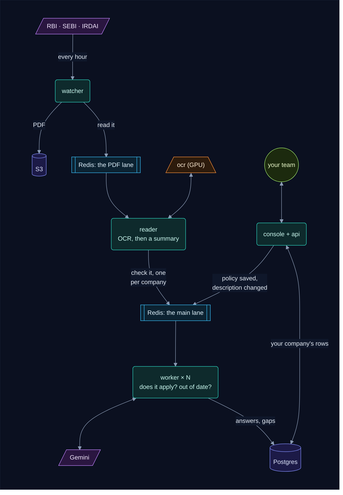
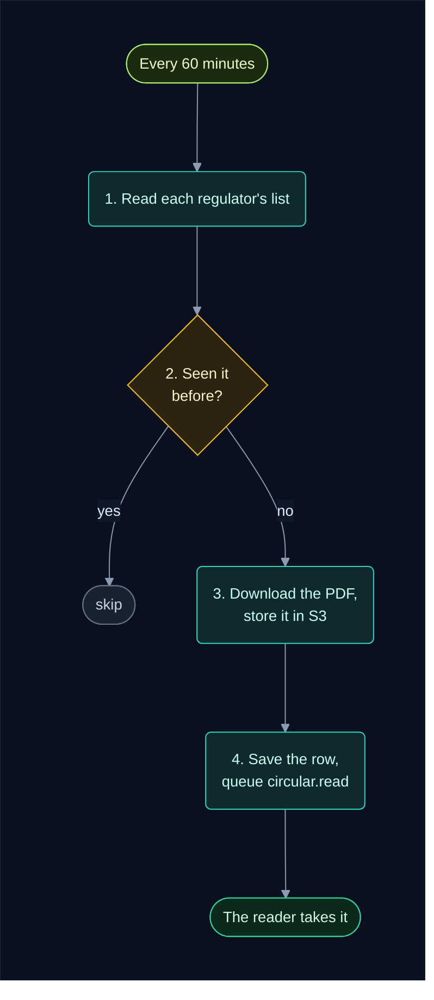
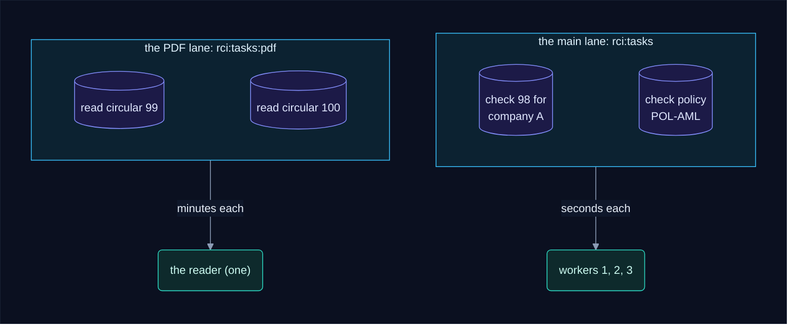
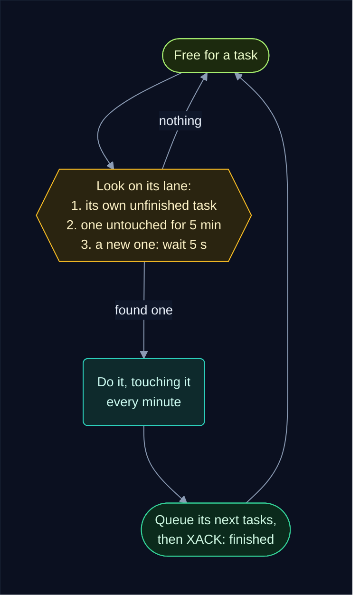
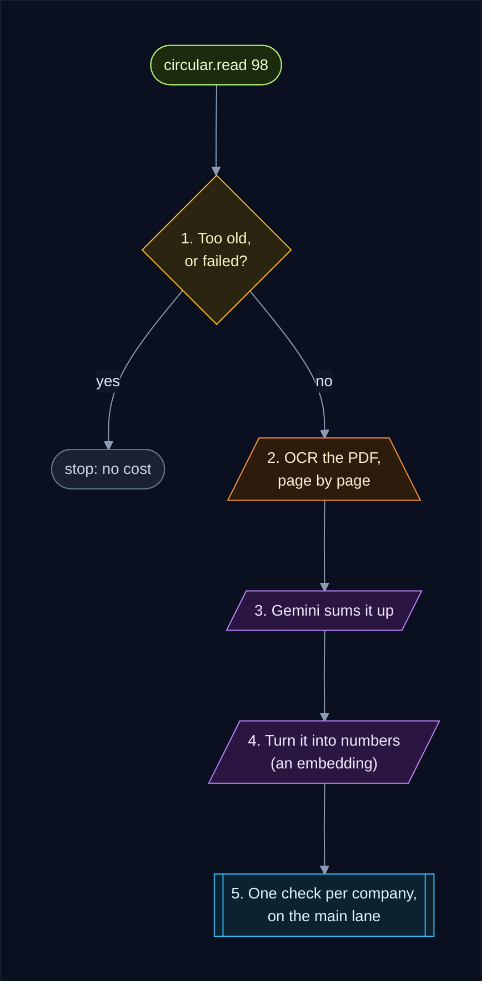
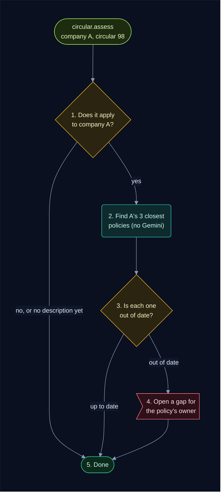
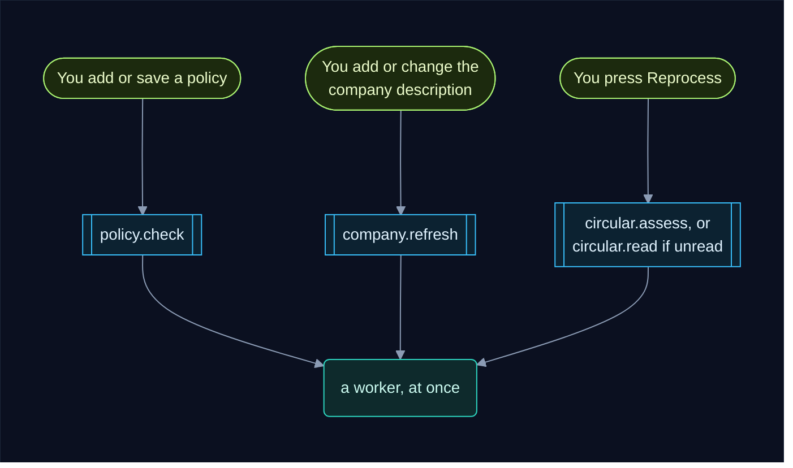
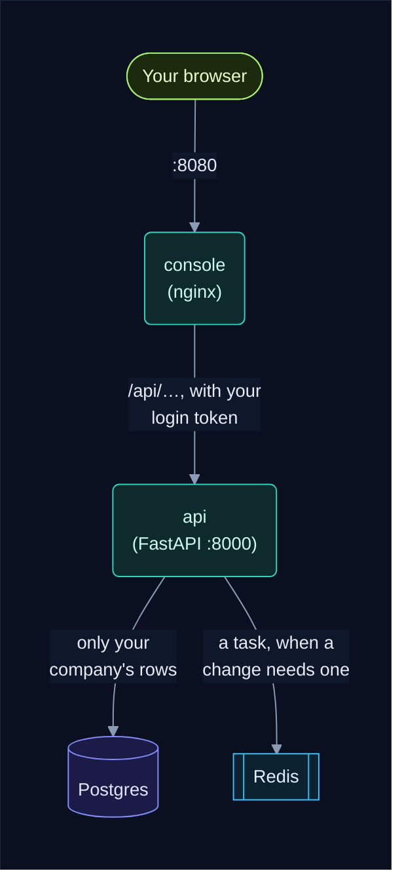

# How the system works, in short

The whole system on one page: what each part does, and each step in a line or two. For
the full story with every detail, read [how_it_works.md](how_it_works.md).
To watch it happen, open **How it works** in the console's sidebar: the same steps,
animated, with a detailed animation each for the watcher, the worker and the api.

**Reading the diagrams.** Each colour means the same thing in every diagram:

        

**Contents**

1. [The parts](#1-the-parts)
2. [The watcher: finding new circulars](#2-the-watcher-finding-new-circulars)
3. [The task queue: two lanes in Redis](#3-the-task-queue-two-lanes-in-redis)
4. [How a reader or worker gets a task](#4-how-a-reader-or-worker-gets-a-task)
5. [The reader: reading a circular](#5-the-reader-reading-a-circular)
6. [The worker: checking it for each company](#6-the-worker-checking-it-for-each-company)
7. [When you change something](#7-when-you-change-something)
8. [The api and the console](#8-the-api-and-the-console)
9. [When something fails](#9-when-something-fails)
10. [Where to read more](#10-where-to-read-more)

---

## 1. The parts

| Part | What it does |
|---|---|
| **watcher** | Visits RBI, SEBI and IRDAI every hour and saves each new circular |
| **S3** (Floci on your machine) | Keeps every circular's PDF |
| **Postgres** | Keeps everything else: circulars, companies, policies, answers, gaps |
| **Redis** | The to-do lists of tasks, in two lanes |
| **reader** | Reads each new circular's PDF once (OCR) and sums it up with Gemini |
| **worker** | Checks each circular against each company's policies, and opens gaps |
| **ocr** | A model on the GPU that turns a page image into text |
| **Gemini** | Google's model that answers the questions, through LangChain |
| **api** | The FastAPI backend behind the console |
| **console** | The web pages your team uses (nginx, port 8080) |

Nobody calls anybody directly. A service saves its change in Postgres, then puts a small
note (a **task**) on a Redis list; the reader and the workers pick the notes up. Every part
saves its work in Postgres (the picture shows only the main arrows), and the reader also
asks Gemini for each circular's summary.

---

## 2. The watcher: finding new circulars

1. **Read each regulator's list.** Every 60 minutes (`WATCH_INTERVAL_MINUTES`) it reads RBI's
   RSS feed and the SEBI and IRDAI listing pages, politely, with a pause between requests.
2. **Skip what it has.** A circular already saved (same regulator, same id on the
   regulator's site) is skipped, so a circular is never saved twice.
3. **Store the PDF.** It downloads the PDF, checks it really is one, and stores it in S3 as
   `<regulator>/<sha256>.pdf` (the sha256 is the file's fingerprint).
4. **Save and queue.** It adds a `circulars` row with status `new`, then queues
   `circular.read` on the PDF lane. If any step fails, nothing is kept: the next round tries
   again.

Only one watcher runs: two would find the same new circular at the same time. More:
[how_the_watcher_works.md](how_the_watcher_works.md).

---

## 3. The task queue: two lanes in Redis

- **A task is a small note**, like `circular.read 98`: a type and some ids. The facts stay
  in Postgres, so a note delivered twice does no harm.
- **Two lanes.** Reading a PDF takes minutes, so it has its own lane and its own reader.
  Everything else takes seconds and goes to the main lane, so it never waits behind a PDF.
- **Each task goes to one worker**, however many run (a Redis **consumer group**).
- **Never queued twice.** Queueing a task first sets a small key in Redis; a copy is
  dropped while that key exists, and the key is deleted when the task is done.
- **The queue is the only source of work.** No worker ever searches Postgres for something
  to do, and Redis keeps the lists on disk, so a restart loses nothing.

| Task | Lane | Queued by | What it does |
|---|---|---|---|
| `circular.read` | PDF | the watcher; **Reprocess** on an unread circular | OCR, summary and embedding: once, for every company |
| `circular.assess` | main | the reader, one per company; **Reprocess** | does it apply to this company? Is each close policy out of date? |
| `policy.check` | main | the api, when a policy is added or saved | checks the policy against the company's recent circulars |
| `company.refresh` | main | the api, when the description is added or changed | asks "does it apply?" again for the company's circulars |

---

## 4. How a reader or worker gets a task

1. **Wait on its lane.** It asks Redis for a task (`XREADGROUP`) and waits up to 5 seconds.
   There's no timer: a task is picked up the moment it's queued.
2. **The task becomes its own.** Redis writes the worker's name next to the task on a
   **pending list** as it hands it over, so no other worker gets it.
3. **Keep it while working.** Every minute it touches the task. A task nobody touches for 5
   minutes belongs to a worker that died, and another worker takes it over.
4. **Finish.** It queues the next tasks (for example one check per company), then says
   "finished" (`XACK`), and Redis takes the task off the pending list for good.

Each lane is served one task at a time per reader or worker. The `reader` service runs one
copy; the `worker` service runs `WORKERS` copies (set it in `.env`).

---

## 5. The reader: reading a circular

1. **Skip what isn't worth reading.** A circular published more than 30 days ago
   (`LOOKBACK_DAYS`) is marked `skipped`; one marked `failed` waits for **Reprocess**.
2. **OCR, once.** Each page goes to the OCR model on the GPU and is saved the moment it's
   read. The whole text is saved on the circular (status `parsed`); blank pages are never sent.
3. **Sum it up.** Gemini reads the text and answers in a fixed shape: who it's addressed to,
   a short summary, and every obligation, with numbers and deadlines as written.
4. **Turn it into numbers.** The title, summary and obligations become an **embedding** (768
   numbers), used to find each company's closest policies. The circular is now `read`.
5. **Hand over.** Each company gets an **assessment** row ("not checked yet") and a
   `circular.assess` task on the main lane.

**A PDF is read only once.** A circular with the very same PDF as one already read copies
its text and summary, a restarted reader carries on from the next unsaved page, and there's
exactly one reader. Details:
[A PDF is read only once](how_the_worker_works.md#a-pdf-is-read-only-once).

---

## 6. The worker: checking it for each company

1. **Does it apply?** Gemini compares the company's description (from the console's Company
   page) with who the circular is addressed to, and gives a one-line reason.
2. **Closest policies.** The company's policies for that regulator are scored against the
   circular's embedding: plain arithmetic, no Gemini. The 3 closest go on (`MATCH_TOP_K`).
3. **Out of date?** For each, Gemini reads the obligations, the policy and its controls, and
   says what's missing and how severe it is. Each answer is saved, so it's never asked twice.
4. **Open a gap.** An out-of-date policy gets a **gap** for its owner, with a draft of the new
   wording, due in 7, 30 or 60 days (high, medium or low severity).
5. **Done.** The company's assessment is marked `done`, and the circular shows as analysed
   on that company's console. Other companies never see it.

---

## 7. When you change something

- **A policy is added or saved** (`policy.check`). The worker turns the policy into numbers,
  then checks it against the company's circulars of the last 30 days that apply to it.
  The console shows **Waiting for the worker**, then **Checked**.
- **The description is added or changed** (`company.refresh`). The company's older "does it
  apply?" answers go back to pending, and each recent circular gets a check again.
- **Reprocess** on a circular. A circular already read is judged again for your company only
  (no OCR, and your gaps are kept); one not read yet is read again.
- **Nothing to judge, nothing queued:** signing up, renaming the company, adding a control,
  updating a gap or adding a teammate.

---

## 8. The api and the console

The console is static pages served by nginx, which passes `/api` on to the api. You sign in
once and get a **login token**; every call carries it, and the api only ever reads and
writes your own company's rows. The api never calls OCR or Gemini itself.

| Area | Endpoints | What they do |
|---|---|---|
| Accounts | `POST /auth/signup`, `POST /auth/login`, `GET /auth/me`, `PUT /auth/password`, `GET`/`POST /users` | sign up a company, sign in, your team |
| Company | `GET`/`PUT /company` | the name and the description the agent judges by |
| Circulars | `GET /circulars`, `GET /circulars/{id}`, `GET /circulars/{id}/text`, `POST /circulars/{id}/reprocess` | the list, a circular's summary and your verdicts, its OCR text, run it again |
| Policies | `GET`/`POST /policies`, `GET`/`PUT /policies/{id}`, `POST /policies/{id}/controls` | your policy library and its controls |
| Gaps | `GET /gaps`, `GET`/`PATCH /gaps/{id}`, `POST /gaps/{id}/comments` | the to-do list of out-of-date policies: owner, due date, status, history |
| Other | `GET /health`, `GET /stats` | is it up; counts for the dashboard |

A gap goes `open → in_progress → closed` (or `dismissed`), and every change is kept in its
history. The full list, with what each call queues: [backend/api/README.md](backend/api/README.md).
Interactive docs: http://localhost:8000/docs.

---

## 9. When something fails

| What happens | What the system does | What you do |
|---|---|---|
| OCR is still loading, or Gemini's quota is used up | the task waits a minute and tries again, as long as it takes | nothing |
| a hiccup: a timeout, a server error, an answer in the wrong shape | the task is tried again, up to 3 times | nothing |
| anything else (no text in the PDF, Floci not running) | the circular or the check is marked **Failed**, with the error on its page | fix the cause, press **Reprocess** |
| a reader or worker dies mid-task | it picks the task up again when Docker restarts it; otherwise another takes it over after 5 minutes. Either way it carries on from the last saved step | nothing |
| Redis is down | the console says **try again**; the watcher retries next round | wait, then save again |
| Redis lost its data (its volume deleted) | nothing is queued | run `cd backend/api && uv run python manage.py requeue` once |

Nothing slow or paid for is done twice: every page, summary, answer and gap is saved the
moment it exists, and work carries on from there.

---

## 10. Where to read more

- [how_it_works.md](how_it_works.md): the whole app in depth, a diagram for every step.
- [how_the_watcher_works.md](how_the_watcher_works.md): one hourly round of the watcher.
- [how_the_worker_works.md](how_the_worker_works.md): a new circular and a new policy,
  step by step, with what changes in Redis and Postgres.
- [backend/worker/INTERNALS.md](backend/worker/INTERNALS.md): the worker for developers,
  every Redis command and SQL statement.
- [README.md](README.md): how to install and start it.
